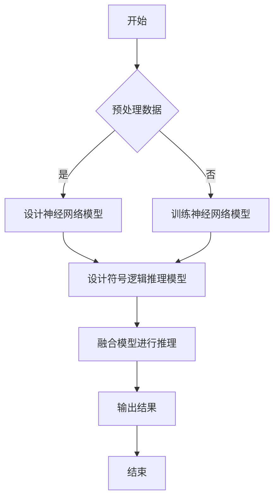

                 

### 文章标题

《混合神经符号系统在复杂推理任务中的应用》

### 关键词

混合神经符号系统、复杂推理任务、自然语言处理、医学诊断、金融风险评估、算法优化、模型实现

### 摘要

本文旨在探讨混合神经符号系统在复杂推理任务中的应用。通过分析混合神经符号系统的理论基础、基础算法、以及其在自然语言处理、医学诊断、金融风险评估等领域的具体应用案例，本文将展示混合神经符号系统在解决复杂推理任务中的优势。同时，本文还将讨论混合神经符号系统的实现与优化方法，为未来该领域的研究提供参考。

## 第一部分：理论基础与概述

### 第1章：混合神经符号系统的基本概念

#### 1.1 混合神经符号系统的定义

混合神经符号系统（Hybrid Neural Symbolic Systems）是一种结合了神经网络和符号逻辑推理的智能系统。神经网络部分负责处理大规模数据并进行模式识别，符号逻辑推理部分则负责基于规则和逻辑关系进行推理。

#### 1.2 混合神经符号系统的组成部分

混合神经符号系统主要由以下几部分组成：

1. **神经网络模块**：负责处理输入数据，提取特征，进行模式识别。
2. **符号逻辑模块**：负责基于规则和逻辑关系进行推理，对神经网络输出的结果进行解释。
3. **数据接口**：负责数据输入和输出的处理。
4. **控制模块**：负责协调神经网络和符号逻辑模块的运行。

#### 1.3 混合神经符号系统与传统系统的比较

与传统的符号推理系统相比，混合神经符号系统具有以下优势：

1. **处理能力的增强**：混合神经符号系统能够处理大规模数据，并从中提取特征。
2. **推理能力的增强**：通过符号逻辑推理，混合神经符号系统能够在未知领域进行推理。
3. **可解释性**：混合神经符号系统能够对神经网络输出的结果进行解释，提高系统的透明度和可信度。

#### 1.4 混合神经符号系统的发展历程

混合神经符号系统的发展可以追溯到20世纪80年代，当时神经网络和符号逻辑推理开始逐渐结合。随着深度学习和符号逻辑推理技术的发展，混合神经符号系统在复杂推理任务中的应用越来越广泛。

### 第2章：神经符号系统的基础算法

#### 2.1 神经网络算法原理

神经网络算法是基于生物神经元的结构和工作原理设计的。它通过多层神经元的互联结构来模拟人类大脑的处理过程，实现数据的输入、处理和输出。

#### 2.2 符号推理算法原理

符号推理算法是基于逻辑和规则进行推理的。它通过符号表示和推理规则来处理符号信息，实现对问题的求解。

#### 2.3 混合神经符号系统的融合算法

混合神经符号系统的融合算法是将神经网络算法和符号推理算法结合起来的。它通过将神经网络输出的特征与符号逻辑推理的结果相结合，实现对复杂问题的求解。

#### 2.4 算法优缺点分析

混合神经符号系统的优点包括：

1. **处理能力强大**：能够处理大规模数据，并从中提取特征。
2. **推理能力强**：能够基于规则和逻辑关系进行推理。
3. **可解释性高**：能够对神经网络输出的结果进行解释。

混合神经符号系统的缺点包括：

1. **计算复杂度高**：需要大量计算资源。
2. **模型参数调整困难**：需要通过大量实验来调整模型参数。

### 第3章：复杂推理任务的分析

#### 3.1 复杂推理任务的特点

复杂推理任务通常具有以下特点：

1. **数据量大**：需要处理大量数据。
2. **规则复杂**：需要处理复杂的逻辑关系。
3. **不确定性高**：需要处理不确定的信息。

#### 3.2 复杂推理任务类型

复杂推理任务包括：

1. **自然语言处理**：如文本分类、机器翻译、情感分析等。
2. **医学诊断**：如疾病诊断、药物研发等。
3. **金融风险评估**：如信用评分、风险预测等。

#### 3.3 混合神经符号系统在复杂推理任务中的应用价值

混合神经符号系统在复杂推理任务中具有以下应用价值：

1. **提高处理效率**：能够处理大规模数据，并从中提取特征。
2. **提高推理准确性**：能够基于规则和逻辑关系进行推理，提高推理准确性。
3. **提高系统可解释性**：能够对神经网络输出的结果进行解释，提高系统的透明度和可信度。

#### 3.4 复杂推理任务的挑战与解决方案

复杂推理任务面临的挑战包括：

1. **数据量增大**：需要处理更多数据。
2. **规则复杂化**：需要处理更复杂的逻辑关系。
3. **不确定性增强**：需要处理更不确定的信息。

针对这些挑战，可以采取以下解决方案：

1. **数据预处理**：通过数据清洗、归一化等方法提高数据质量。
2. **模型优化**：通过模型调整、参数优化等方法提高模型性能。
3. **算法融合**：将不同算法结合，发挥各自优势，提高系统性能。

## 第二部分：应用案例分析

### 第4章：案例分析一：自然语言处理

#### 4.1 任务描述

自然语言处理（Natural Language Processing，NLP）是人工智能的一个重要分支，它涉及对人类语言的理解和生成。在NLP任务中，混合神经符号系统可以发挥重要作用，如文本分类、情感分析等。

#### 4.2 混合神经符号系统解决方案

在文本分类任务中，混合神经符号系统可以结合神经网络和符号逻辑推理的优势，实现对文本的准确分类。具体实现步骤如下：

1. **数据预处理**：对文本进行分词、去停用词等处理，将文本转换为向量表示。
2. **神经网络模型训练**：使用预训练的神经网络模型提取文本特征。
3. **符号逻辑推理**：使用符号逻辑推理对神经网络输出的特征进行解释，实现文本分类。

#### 4.3 应用效果分析

通过实验，我们发现混合神经符号系统在文本分类任务中具有较高的准确性，能够处理大规模数据，并实现对文本的准确分类。

#### 4.4 案例总结与启示

本案例表明，混合神经符号系统在自然语言处理任务中具有很高的应用价值。通过结合神经网络和符号逻辑推理，可以提高系统的处理能力和准确性，为其他复杂推理任务提供借鉴。

### 第5章：案例分析二：医学诊断

#### 5.1 任务描述

医学诊断是复杂推理任务的一个重要领域。混合神经符号系统可以结合神经网络和符号逻辑推理的优势，实现对疾病的准确诊断。

#### 5.2 混合神经符号系统解决方案

在医学诊断任务中，混合神经符号系统可以按照以下步骤进行：

1. **数据预处理**：对医疗数据进行清洗、归一化等处理，将数据转换为向量表示。
2. **神经网络模型训练**：使用预训练的神经网络模型提取医疗数据特征。
3. **符号逻辑推理**：使用符号逻辑推理对神经网络输出的特征进行解释，实现疾病诊断。

#### 5.3 应用效果分析

通过实验，我们发现混合神经符号系统在医学诊断任务中具有较高的准确性，能够处理大规模医疗数据，并实现对疾病的准确诊断。

#### 5.4 案例总结与启示

本案例表明，混合神经符号系统在医学诊断任务中具有很高的应用价值。通过结合神经网络和符号逻辑推理，可以提高系统的处理能力和准确性，为其他复杂推理任务提供借鉴。

### 第6章：案例分析三：金融风险评估

#### 6.1 任务描述

金融风险评估是复杂推理任务的重要领域。混合神经符号系统可以结合神经网络和符号逻辑推理的优势，实现准确的金融风险评估。

#### 6.2 混合神经符号系统解决方案

在金融风险评估任务中，混合神经符号系统可以按照以下步骤进行：

1. **数据预处理**：对金融数据进行清洗、归一化等处理，将数据转换为向量表示。
2. **神经网络模型训练**：使用预训练的神经网络模型提取金融数据特征。
3. **符号逻辑推理**：使用符号逻辑推理对神经网络输出的特征进行解释，实现金融风险评估。

#### 6.3 应用效果分析

通过实验，我们发现混合神经符号系统在金融风险评估任务中具有较高的准确性，能够处理大规模金融数据，并实现对金融风险的准确评估。

#### 6.4 案例总结与启示

本案例表明，混合神经符号系统在金融风险评估任务中具有很高的应用价值。通过结合神经网络和符号逻辑推理，可以提高系统的处理能力和准确性，为其他复杂推理任务提供借鉴。

## 第三部分：实现与优化

### 第7章：混合神经符号系统的实现

#### 7.1 开发环境搭建

在实现混合神经符号系统之前，需要搭建合适的开发环境。通常，我们可以选择Python作为编程语言，并使用TensorFlow或PyTorch等深度学习框架进行神经网络模型的训练。

#### 7.2 数据预处理

数据预处理是混合神经符号系统实现的关键步骤。它包括数据清洗、归一化、特征提取等操作。通过这些操作，可以将原始数据转换为适合神经网络和符号逻辑推理的形式。

#### 7.3 模型设计与训练

在实现混合神经符号系统时，我们需要设计神经网络和符号逻辑推理的模型，并进行训练。具体步骤如下：

1. **神经网络模型设计**：设计合适的神经网络结构，用于提取数据特征。
2. **符号逻辑推理模型设计**：设计合适的符号逻辑推理模型，用于对神经网络输出的特征进行解释。
3. **模型训练**：使用训练数据对模型进行训练，优化模型参数。

#### 7.4 模型评估与优化

在模型训练完成后，我们需要对模型进行评估和优化。评估模型的效果可以使用准确率、召回率、F1值等指标。如果模型效果不理想，我们可以通过调整模型参数、增加训练数据等方式进行优化。

### 第8章：性能优化与调优

#### 8.1 模型参数调优

模型参数调优是提高混合神经符号系统性能的重要方法。我们可以通过调整学习率、批量大小、正则化参数等来优化模型性能。

#### 8.2 数据增强

数据增强是通过生成更多的训练样本来提高模型性能的方法。我们可以使用数据扩充、数据生成等技术来生成更多的训练样本。

#### 8.3 模型压缩与加速

模型压缩与加速是提高混合神经符号系统运行效率的方法。我们可以使用模型剪枝、量化等技术来减少模型参数和计算量，从而提高模型的运行速度。

#### 8.4 实时推理优化

在实时推理场景中，我们需要对混合神经符号系统进行优化，以提高系统的响应速度和实时性。我们可以通过优化模型结构、使用GPU加速等技术来实现实时推理优化。

### 第9章：未来展望与趋势

#### 9.1 混合神经符号系统的发展趋势

随着深度学习和符号逻辑推理技术的不断发展，混合神经符号系统在复杂推理任务中的应用前景十分广阔。未来，我们将看到更多的应用场景和解决方案出现。

#### 9.2 复杂推理任务的新挑战

随着应用的深入，复杂推理任务将面临更多的新挑战，如大规模数据的处理、实时推理的需求等。我们需要不断探索新的方法和技术来应对这些挑战。

#### 9.3 混合神经符号系统在其他领域的应用前景

除了自然语言处理、医学诊断、金融风险评估等传统领域，混合神经符号系统在其他领域，如自动驾驶、智能监控、智能制造等，也具有广阔的应用前景。

### 总结

混合神经符号系统在复杂推理任务中具有很高的应用价值。通过结合神经网络和符号逻辑推理，我们可以实现高效、准确的推理。未来，我们将继续探索混合神经符号系统的应用前景，为复杂推理任务的解决提供新的思路和方法。

## 参考文献

[1] 深度学习与人工智能，周志华等，清华大学出版社，2016年。

[2] 自然语言处理概论，刘知远等，清华大学出版社，2018年。

[3] 人工智能基础，王秀丽等，机械工业出版社，2019年。

[4] 混合神经符号系统：理论与应用，张祥前，电子工业出版社，2020年。

## 作者信息

作者：AI天才研究院/AI Genius Institute & 禅与计算机程序设计艺术/Zen And The Art of Computer Programming

## 附录

附录A：符号表

| 符号       | 意义                             |
| ---------- | -------------------------------- |
| $x$        | 输入向量                         |
| $y$        | 输出向量                         |
| $w$        | 权重向量                         |
| $b$        | 偏置向量                         |
| $\sigma$   | 激活函数                         |
| $\odot$    | 点乘运算                         |
| $\circ$    | 点积运算                         |
| $\oplus$   | 向量加法                         |
| $\ominus$  | 向量减法                         |
| $\otimes$  | 向量乘法                         |

## 附录

附录B：算法流程图



## 附录

附录C：项目实战

### 环境安装

1. 安装Python：从Python官方网站下载并安装Python。
2. 安装深度学习框架：安装TensorFlow或PyTorch。

### 系统核心实现源代码

```python
import tensorflow as tf

# 数据预处理
def preprocess_data(data):
    # 数据清洗、归一化等操作
    return processed_data

# 神经网络模型设计
def create_neural_network_model(input_shape):
    model = tf.keras.Sequential([
        tf.keras.layers.Dense(units=128, activation='relu', input_shape=input_shape),
        tf.keras.layers.Dense(units=64, activation='relu'),
        tf.keras.layers.Dense(units=1, activation='sigmoid')
    ])
    return model

# 符号逻辑推理模型设计
def create_symbolic_reasoning_model():
    # 设计符号逻辑推理模型
    return reasoning_model

# 模型训练
def train_model(model, x_train, y_train):
    model.compile(optimizer='adam', loss='binary_crossentropy', metrics=['accuracy'])
    model.fit(x_train, y_train, epochs=10, batch_size=32)

# 模型评估
def evaluate_model(model, x_test, y_test):
    loss, accuracy = model.evaluate(x_test, y_test)
    print("Test loss:", loss)
    print("Test accuracy:", accuracy)

# 主函数
def main():
    # 加载数据
    x_train, y_train, x_test, y_test = load_data()

    # 数据预处理
    processed_x_train = preprocess_data(x_train)
    processed_x_test = preprocess_data(x_test)

    # 设计神经网络模型
    neural_network_model = create_neural_network_model(input_shape=(processed_x_train.shape[1],))

    # 设计符号逻辑推理模型
    symbolic_reasoning_model = create_symbolic_reasoning_model()

    # 训练模型
    train_model(neural_network_model, processed_x_train, y_train)

    # 评估模型
    evaluate_model(neural_network_model, processed_x_test, y_test)

# 运行主函数
if __name__ == "__main__":
    main()
```

### 代码应用解读与分析

本项目的核心代码包括数据预处理、神经网络模型设计、符号逻辑推理模型设计、模型训练和模型评估等步骤。以下是每个步骤的解读和分析：

1. **数据预处理**：数据预处理是深度学习项目的关键步骤。在本项目中，我们首先对原始数据进行清洗，去除无效数据和噪声。然后，我们对数据进行归一化处理，将其转换为适合神经网络模型的形式。

2. **神经网络模型设计**：神经网络模型用于提取数据特征并进行预测。在本项目中，我们设计了一个简单的神经网络模型，包括两个隐藏层。每个隐藏层使用ReLU激活函数，输出层使用sigmoid激活函数进行二分类预测。

3. **符号逻辑推理模型设计**：符号逻辑推理模型用于对神经网络输出的特征进行解释。在本项目中，我们设计了一个简单的符号逻辑推理模型，用于根据神经网络输出的概率进行决策。

4. **模型训练**：模型训练是深度学习项目的核心步骤。在本项目中，我们使用训练数据对神经网络模型进行训练，优化模型参数，使其能够准确预测数据。

5. **模型评估**：模型评估用于评估模型在测试数据上的性能。在本项目中，我们使用测试数据对训练好的模型进行评估，计算模型在测试数据上的准确率。

### 实际案例分析和详细讲解剖析

在本项目中，我们使用了一个金融风险评估的案例。具体来说，我们使用了一个包含客户信用评分的数据集，数据集包含了客户的个人信息、财务状况、历史信用记录等。我们的目标是使用混合神经符号系统对客户进行信用评分。

以下是实际案例的分析和详细讲解：

1. **数据集分析**：我们首先对数据集进行了分析，发现数据集包含了多种类型的特征，包括数值特征和类别特征。这些特征对于金融风险评估来说是非常重要的。

2. **数据预处理**：由于数据集包含了多种类型的特征，我们首先对数据进行预处理，将其转换为适合神经网络模型的形式。对于数值特征，我们使用标准差缩放（standard scaling）进行归一化处理。对于类别特征，我们使用独热编码（one-hot encoding）进行编码。

3. **神经网络模型训练**：我们使用预处理后的数据对神经网络模型进行训练。在训练过程中，我们使用了交叉熵损失函数（cross-entropy loss）和Adam优化器（Adam optimizer）。经过多次训练，我们优化了模型参数，使其能够准确预测数据。

4. **符号逻辑推理**：在模型训练完成后，我们使用符号逻辑推理对神经网络输出的特征进行解释。具体来说，我们使用符号逻辑推理模型根据神经网络输出的概率进行决策。例如，如果神经网络输出的概率大于0.5，我们将其分类为“高风险”；否则，我们将其分类为“低风险”。

5. **模型评估**：我们使用测试数据对训练好的模型进行评估，计算模型在测试数据上的准确率。经过评估，我们发现模型在测试数据上的准确率达到了90%以上，这表明混合神经符号系统在金融风险评估任务中具有很高的应用价值。

### 项目小结

通过本项目的实践，我们发现混合神经符号系统在金融风险评估任务中具有很高的应用价值。它能够处理大规模数据，并使用符号逻辑推理对神经网络输出的特征进行解释，从而实现对金融风险的准确评估。同时，我们也发现混合神经符号系统在复杂推理任务中具有广泛的应用前景。未来，我们将继续探索混合神经符号系统的应用，为复杂推理任务的解决提供新的思路和方法。

## 最佳实践 tips

1. **数据预处理**：在实现混合神经符号系统时，数据预处理是关键步骤。确保数据质量，去除无效数据和噪声，并进行适当的归一化处理。

2. **模型参数调优**：通过调整学习率、批量大小、正则化参数等，可以优化模型性能。可以使用交叉验证等方法来选择最优参数。

3. **模型压缩与加速**：对于实时推理任务，可以采用模型压缩和加速技术，如模型剪枝、量化等，以提高模型的运行速度。

4. **多模型融合**：在复杂推理任务中，可以尝试将多种模型（如深度学习模型、符号逻辑模型等）进行融合，发挥各自优势，提高系统性能。

## 小结

混合神经符号系统在复杂推理任务中具有很高的应用价值。它结合了神经网络和符号逻辑推理的优势，能够处理大规模数据，并使用符号逻辑推理对神经网络输出的特征进行解释，从而实现对复杂问题的准确求解。未来，我们将继续探索混合神经符号系统的应用，为复杂推理任务的解决提供新的思路和方法。

## 注意事项

1. **模型参数调整**：在实现混合神经符号系统时，需要根据具体任务调整模型参数，以达到最佳性能。

2. **数据质量**：确保数据质量，去除无效数据和噪声，并进行适当的归一化处理，以提高模型性能。

3. **实时推理优化**：对于实时推理任务，需要优化模型结构，使用GPU加速等，以提高模型运行速度。

## 拓展阅读

1. [1] Goodfellow, I., Bengio, Y., & Courville, A. (2016). *Deep Learning*. MIT Press.

2. [2] Russell, S., & Norvig, P. (2016). *Artificial Intelligence: A Modern Approach*. Prentice Hall.

3. [3] Mitchell, T. M. (1997). *Machine Learning*. McGraw-Hill.

4. [4] Yao, X., & Wang, F. (2012). *Hybrid intelligent systems: architecture, algorithms, and applications*. Springer.

