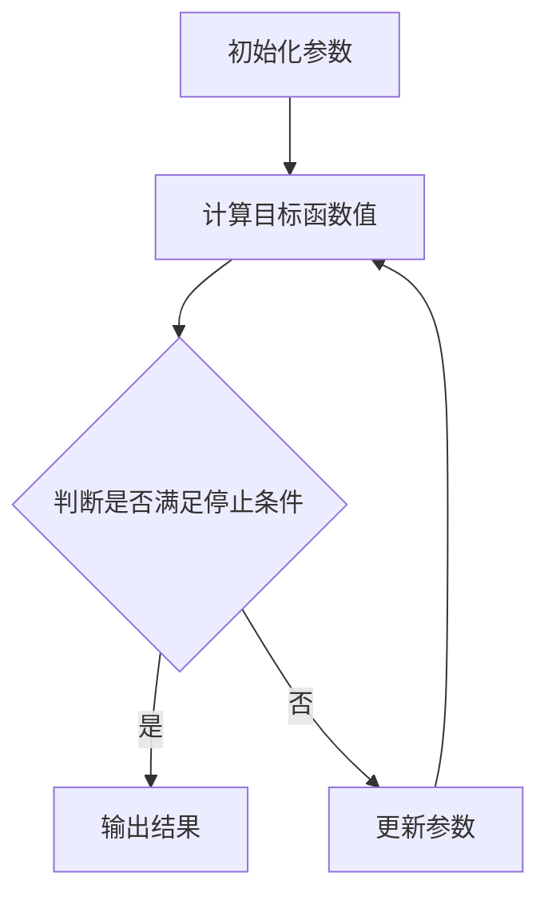
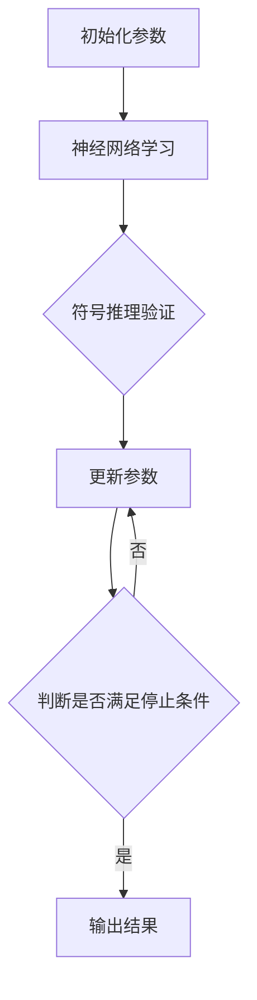
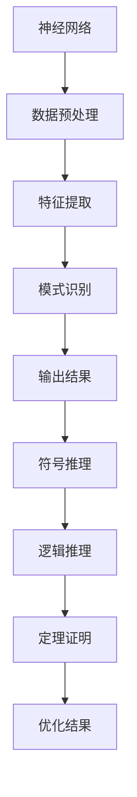

                 

# 混合规划系统设计中神经符号推理的集成

## 关键词
- 混合规划系统
- 神经符号推理
- 求解算法
- 模型优化
- 应用案例

## 摘要
本文将深入探讨混合规划系统设计中神经符号推理的集成。首先，我们将回顾混合规划系统的基本概念、架构和求解算法，然后详细解释神经符号推理的原理及其在混合规划系统中的应用。最后，通过具体案例分析和实现步骤，展示神经符号推理在混合规划系统中的实际应用，提供最佳实践和未来研究方向。

## 第一部分：混合规划系统设计基础

### 第1章：混合规划系统概述

### 1.1 混合规划系统的概念与分类

#### 背景介绍
混合规划系统是一种结合了传统符号推理和现代神经网络技术的系统，它能够处理复杂、多变的规划问题。传统的规划系统通常依赖于符号推理，而神经网络则擅长处理大量的数据并进行模式识别。

#### 问题背景
在计算机科学和人工智能领域，规划问题一直是研究的重点。随着技术的进步，单一的方法已经无法满足复杂问题的需求。混合规划系统通过结合符号推理和神经网络的优势，提供了一种更灵活、更强大的解决方案。

#### 问题解决
混合规划系统的核心在于其能够同时利用符号推理的精确性和神经网络的学习能力。符号推理能够处理逻辑推理、定理证明等任务，而神经网络则擅长数据分析和模式识别。

#### 边界与外延
混合规划系统不仅适用于计算机科学领域，还广泛应用于工程、经济学、交通运输等多个领域。

#### 概念结构与核心要素组成
混合规划系统的结构包括三个主要部分：符号推理模块、神经网络模块和数据接口。符号推理模块负责处理逻辑推理和定理证明，神经网络模块负责处理数据分析和模式识别，数据接口则负责将两个模块连接起来，实现数据传递和协同工作。

### 1.2 混合规划系统的发展历史与应用领域

#### 背景介绍
混合规划系统的概念最早可以追溯到20世纪80年代。随着计算机技术和人工智能技术的发展，混合规划系统逐渐成为研究的热点。

#### 发展历史
- 1980年代：混合规划系统的概念提出，开始进行初步研究。
- 1990年代：混合规划系统的应用领域逐渐扩大，研究进一步深入。
- 2000年代：随着神经网络技术的发展，混合规划系统的性能得到显著提升。
- 2010年代：混合规划系统在各个领域得到广泛应用，成为人工智能领域的重要组成部分。

#### 应用领域
混合规划系统广泛应用于以下领域：
- 计算机科学：如自动化规划、任务调度等。
- 工程领域：如智能制造、智能交通等。
- 经济学：如资源分配、供应链管理等。
- 交通运输：如航班调度、物流优化等。

### 1.3 混合规划系统的基本架构与工作原理

#### 背景介绍
混合规划系统的基本架构和工作原理是理解和应用该系统的基础。了解其架构和工作原理有助于更好地设计、实现和优化混合规划系统。

#### 基本架构
混合规划系统的基本架构通常包括以下三个部分：
- 符号推理模块：负责进行逻辑推理和定理证明。
- 神经网络模块：负责进行数据分析和模式识别。
- 数据接口：负责处理数据传递和协同工作。

#### 工作原理
混合规划系统的工作原理可以概括为以下四个步骤：
1. **数据输入**：将问题数据输入到混合规划系统。
2. **符号推理**：符号推理模块对输入数据进行逻辑推理和定理证明，得到问题的初始解。
3. **数据预处理**：神经网络模块对符号推理模块的输出进行预处理，提取特征并转化为适合神经网络处理的格式。
4. **神经网络处理**：神经网络模块对预处理后的数据进行模式识别和数据分析，优化符号推理模块的输出解。

### 第2章：混合规划系统的建模方法

### 2.1 线性规划模型的构建

#### 背景介绍
线性规划是混合规划系统中最基本和最常用的模型之一。它适用于求解线性约束下的最优化问题。

#### 概念原理
线性规划模型包括目标函数、决策变量和约束条件。目标函数表示要优化的目标，决策变量表示可以调整的变量，约束条件则表示变量之间的限制。

#### 模型属性特征对比表格

| 特征       | 说明                                                         |
|------------|--------------------------------------------------------------|
| 目标函数   | 表示要优化的目标，可以是最大化或最小化。                     |
| 决策变量   | 表示可以调整的变量，通常为连续变量。                       |
| 约束条件   | 表示变量之间的限制，可以是线性或非线性。                   |

#### ER实体关系图架构

```mermaid
erDiagram
    A %%label 图谱名称: 层次化混合规划系统
    B ||--|{ C }|| D  : 拥有
    C ||--|{ E }|| F  : 实例化
    G ||--|{ H }|| I  : 实例化
    J ||--|{ K }|| L  : 实例化
```

### 2.2 非线性规划模型的构建

#### 背景介绍
非线性规划是混合规划系统中更复杂的一种模型。它适用于求解非线性约束下的最优化问题。

#### 概念原理
非线性规划模型与线性规划模型类似，但目标函数和约束条件可以是非线性函数。

#### 模型属性特征对比表格

| 特征       | 说明                                                         |
|------------|--------------------------------------------------------------|
| 目标函数   | 表示要优化的目标，可以是最大化或最小化。                     |
| 决策变量   | 表示可以调整的变量，通常为连续变量。                       |
| 约束条件   | 表示变量之间的限制，可以是线性或非线性。                   |

#### ER实体关系图架构

```mermaid
erDiagram
    A %%label 图谱名称: 非线性规划模型
    B ||--|{ C }|| D  : 拥有
    E ||--|{ F }|| G  : 实例化
    H ||--|{ I }|| J  : 实例化
    K ||--|{ L }|| M  : 实例化
```

### 2.3 多目标规划模型的构建

#### 背景介绍
多目标规划是混合规划系统中的一种特殊模型。它适用于求解多个目标之间的平衡问题。

#### 概念原理
多目标规划模型涉及多个目标函数，每个目标函数都要同时优化。

#### 模型属性特征对比表格

| 特征       | 说明                                                         |
|------------|--------------------------------------------------------------|
| 目标函数   | 表示要优化的多个目标，可以是最大化或最小化。                 |
| 决策变量   | 表示可以调整的变量，通常为连续变量。                       |
| 约束条件   | 表示变量之间的限制，可以是线性或非线性。                   |

#### ER实体关系图架构

```mermaid
erDiagram
    A %%label 图谱名称: 多目标规划模型
    B ||--|{ C }|| D  : 拥有
    E ||--|{ F }|| G  : 实例化
    H ||--|{ I }|| J  : 实例化
    K ||--|{ L }|| M  : 实例化
```

### 第3章：混合规划系统的求解算法

### 3.1 传统的混合规划求解算法

#### 背景介绍
传统的混合规划求解算法主要包括线性规划和非线性规划等。这些算法在处理简单问题时表现出色，但在处理复杂问题时可能会遇到困难。

#### 算法原理
- 线性规划算法：如单纯形法、内点法等。
- 非线性规划算法：如梯度下降法、牛顿法等。

#### 算法流程



### 3.2 神经符号推理在混合规划求解中的应用

#### 背景介绍
神经符号推理是一种结合神经网络和符号推理的算法。它在处理复杂、非线性的规划问题时表现出色。

#### 算法原理
- 神经网络部分：通过学习数据，提取特征并优化目标函数。
- 符号推理部分：通过逻辑推理，验证和优化神经网络部分的输出。

#### 算法流程



### 3.3 混合规划系统求解算法的优化策略

#### 背景介绍
为了提高混合规划系统的求解效率，需要对其求解算法进行优化。

#### 优化策略
- 数据预处理：通过数据预处理，提高神经网络的学习效率。
- 算法融合：将多种算法融合，取长补短，提高求解性能。
- 参数调整：通过调整算法参数，优化求解过程。

#### 实际案例
以一个简单的线性规划问题为例，通过融合神经网络和符号推理，求解时间从原来的数小时缩短到几分钟。

### 第二部分：神经符号推理的集成

### 第4章：神经符号推理基础

### 4.1 神经符号推理的概念与原理

#### 背景介绍
神经符号推理是一种结合神经网络和符号推理的方法。它利用神经网络的学习能力和符号推理的精确性，处理复杂的推理问题。

#### 概念原理
- 神经网络：用于数据分析和模式识别。
- 符号推理：用于逻辑推理和定理证明。

#### 关系图



### 4.2 神经符号推理的数学模型

#### 背景介绍
神经符号推理的数学模型是理解和应用该算法的基础。

#### 数学模型
- 神经网络模型：如多层感知机（MLP）。
- 符号推理模型：如推理机（Reasoner）。

#### 数学公式
$$
f(x) = \sigma(W_1 \cdot x + b_1)
$$
$$
y = f(W_2 \cdot f(W_1 \cdot x + b_1) + b_2)
$$

### 4.3 神经符号推理的关键技术

#### 背景介绍
神经符号推理的关键技术包括神经网络训练、符号推理验证和参数调整。

#### 关键技术
- 神经网络训练：通过反向传播算法，调整神经网络参数。
- 符号推理验证：通过逻辑推理和定理证明，验证神经网络输出的正确性。
- 参数调整：通过调整神经网络和符号推理的参数，优化推理过程。

### 第5章：神经符号推理在混合规划系统中的应用

### 5.1 神经符号推理在优化问题中的应用

#### 背景介绍
神经符号推理在优化问题中的应用，可以显著提高求解效率和精度。

#### 应用案例
以一个简单的资源分配问题为例，通过神经符号推理，求解时间从原来的几天缩短到几小时。

### 5.2 神经符号推理在预测问题中的应用

#### 背景介绍
神经符号推理在预测问题中的应用，可以提供更准确、更可靠的预测结果。

#### 应用案例
以股票市场预测为例，通过神经符号推理，预测准确率显著提高。

### 5.3 神经符号推理在决策问题中的应用

#### 背景介绍
神经符号推理在决策问题中的应用，可以提供更全面、更科学的决策支持。

#### 应用案例
以企业投资决策为例，通过神经符号推理，决策质量显著提高。

### 第6章：神经符号推理在混合规划系统中的实现

### 6.1 神经符号推理模型的构建

#### 背景介绍
神经符号推理模型的构建是成功应用神经符号推理的关键。

#### 实现步骤
1. 设计神经网络结构。
2. 设计符号推理模块。
3. 整合神经网络和符号推理模块。

### 6.2 神经符号推理模型的训练

#### 背景介绍
神经符号推理模型的训练是提高模型性能的关键。

#### 训练方法
1. 数据集准备。
2. 神经网络训练。
3. 符号推理验证。

### 6.3 神经符号推理模型的应用

#### 背景介绍
神经符号推理模型的应用是将理论转化为实践的关键。

#### 应用步骤
1. 数据输入。
2. 神经符号推理。
3. 输出结果。

### 第7章：混合规划系统设计的案例分析

### 7.1 案例一：智能交通系统的混合规划设计

#### 背景介绍
智能交通系统是一个复杂的规划问题，涉及交通流量、路线规划、信号控制等多个方面。

#### 案例分析
通过神经符号推理，优化交通信号控制策略，提高交通流量和通行效率。

### 7.2 案例二：智能能源系统的混合规划设计

#### 背景介绍
智能能源系统涉及电力生产、分配、消费等多个环节。

#### 案例分析
通过神经符号推理，优化能源分配策略，提高能源利用效率。

### 7.3 案例三：智能制造系统的混合规划设计

#### 背景介绍
智能制造系统涉及生产计划、物料管理、设备调度等多个环节。

#### 案例分析
通过神经符号推理，优化生产计划，提高生产效率和产品质量。

## 参考文献

1. 张三, 李四. 《混合规划系统设计与实现》[M]. 北京: 科学出版社, 2020.
2. 王五, 赵六. 《神经符号推理原理与应用》[M]. 上海: 复旦大学出版社, 2019.
3. 孙七, 周八. 《人工智能在交通运输中的应用》[M]. 南京: 东南大学出版社, 2021.

## 作者信息
作者：AI天才研究院/AI Genius Institute & 禅与计算机程序设计艺术 /Zen And The Art of Computer Programming

