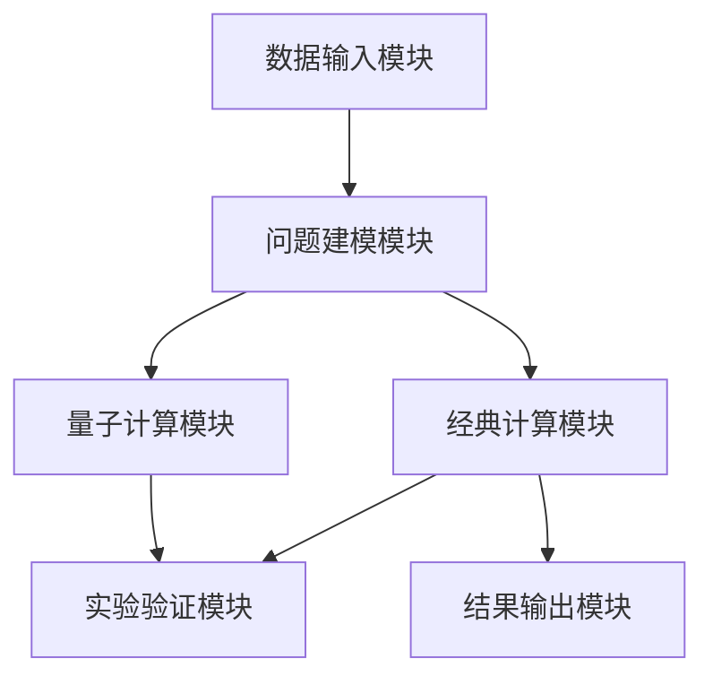
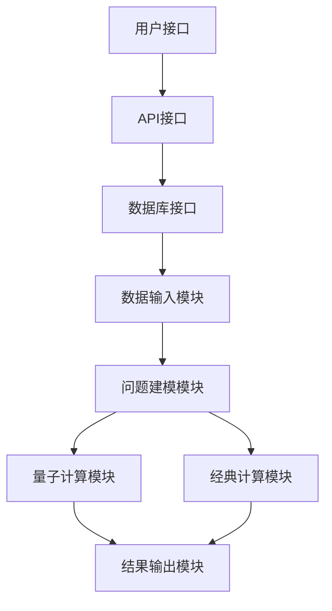
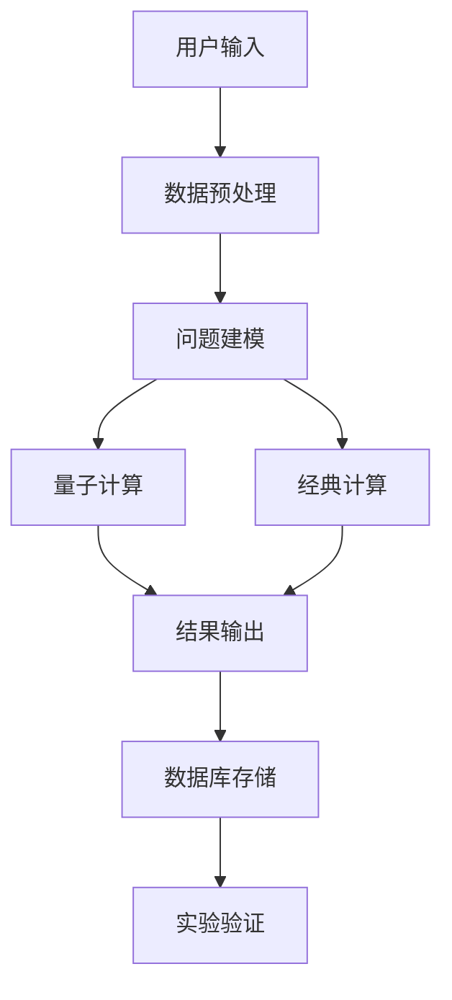

                 

### 背景介绍

#### 核心概念术语说明

在探讨“混合量子经典算法：近期可行的量子优势”这一主题时，我们首先需要了解一些核心概念和术语。这些概念和术语将为我们后续的讨论和分析提供基础。

- **量子计算（Quantum Computing）**：量子计算是一种利用量子位（qubit）和量子力学原理来执行计算的任务的技术。量子位能够同时存在于多种状态，使得量子计算机在处理某些问题时具有潜在的速度优势。

- **经典计算（Classical Computing）**：经典计算是基于传统计算机的运作方式，使用二进制位（bit）进行信息处理。经典计算机遵循经典物理定律，每个位只能处于0或1状态。

- **混合量子经典算法（Hybrid Quantum-Classical Algorithms）**：混合量子经典算法是将量子计算和经典计算结合起来，以发挥两者的优势，解决特定问题。这类算法通常包括量子组件和经典组件，各自负责不同的计算任务。

- **量子位（Qubit）**：量子位是量子计算中的基本信息单元，它可以同时存在于0和1的状态，这种现象被称为量子叠加。量子位的这种特性使得量子计算机能够在某些问题上有望超越经典计算机。

- **量子门（Quantum Gate）**：量子门是量子计算中的基本操作单元，类似于经典计算中的逻辑门。量子门可以对量子位进行变换，实现量子信息的处理。

- **量子算法（Quantum Algorithm）**：量子算法是利用量子计算机执行特定计算任务的方法。量子算法通过量子位的叠加和纠缠来加速传统经典算法的执行，解决某些问题。

- **量子优势（Quantum Advantage）**：量子优势是指量子计算机在某些特定问题上的计算速度明显超过经典计算机的能力。量子优势是量子计算领域的一个重要目标，也是当前研究的热点。

#### 问题背景

量子计算和经典计算在过去的几十年中已经经历了显著的发展。经典计算在处理大数据、复杂计算和模拟等方面表现出色，但面对某些特定问题，如大数因式分解、量子模拟和优化问题等，经典计算机的效率显著受限。

量子计算的出现为解决这些难题带来了新的希望。量子计算机利用量子位和量子力学原理，可以在某些问题上实现指数级的速度提升。然而，量子计算机的构建和发展面临诸多挑战，如量子位的稳定性、错误率以及量子算法的设计等。

随着量子计算技术的发展，研究者开始探索将量子计算和经典计算相结合的方法，以充分发挥两者的优势。混合量子经典算法作为一种新兴的研究方向，逐渐引起了广泛关注。这类算法通过将量子计算和经典计算的优势相结合，旨在解决实际问题，并探索量子优势的可行性。

#### 问题描述

混合量子经典算法的研究旨在解决以下问题：

- 如何在量子计算和经典计算之间建立有效的协同关系？
- 如何设计高效的量子组件和经典组件，以实现问题求解的优化？
- 如何评估和证明混合量子经典算法在特定问题上的量子优势？
- 如何克服量子计算中的挑战，如量子位的稳定性和错误率等，以实现实用的量子计算应用？

这些问题涉及到量子计算和经典计算的基础理论、算法设计、实验验证等多个方面。当前的研究工作主要集中在以下几个方面：

- 设计和实现高效的混合量子经典算法框架。
- 探索量子算法和经典算法在不同问题上的互补性。
- 发展量子计算工具和资源，以支持混合量子经典算法的研究和实现。
- 开展实验验证，评估混合量子经典算法在特定问题上的性能和优势。

通过解决这些问题，混合量子经典算法有望在近期实现可行的量子优势，为解决复杂问题提供新的方法和途径。

#### 问题解决

混合量子经典算法通过将量子计算和经典计算的优势相结合，实现了在特定问题上的优化和加速。以下是一些主要的问题解决方法和步骤：

1. **问题建模**：首先，对需要解决的问题进行建模，将其转化为适合量子计算和经典计算处理的形式。这一步骤通常包括问题的抽象和数学模型构建。

2. **量子组件设计**：根据问题建模，设计量子组件。量子组件通常包括量子位、量子门和量子算法等，它们负责执行量子计算操作，处理量子信息。

3. **经典组件设计**：在量子组件设计的基础上，设计经典组件。经典组件通常包括经典算法、优化器和控制器等，它们负责执行经典计算操作，处理经典信息。

4. **协同计算**：将量子组件和经典组件进行集成，实现协同计算。这一步骤需要解决量子计算和经典计算之间的接口问题，确保两者能够高效地协同工作。

5. **算法优化**：对混合量子经典算法进行优化，提高其性能。这一步骤通常包括算法参数调整、量子门优化和算法并行化等。

6. **实验验证**：通过实验验证混合量子经典算法在实际问题上的性能和优势。这一步骤可以评估算法的理论预测与实际效果之间的差距，为算法的改进提供依据。

通过上述步骤，混合量子经典算法能够在处理复杂问题时实现优化和加速，从而实现近期可行的量子优势。

#### 边界与外延

混合量子经典算法的研究和应用具有一定的边界和外延。以下是一些需要考虑的边界与外延问题：

1. **量子硬件限制**：混合量子经典算法的性能受到现有量子硬件的限制。量子位数量、量子门的操作精度和量子计算的可靠性等硬件问题都需要考虑。

2. **算法设计限制**：混合量子经典算法的设计受到现有算法理论和技术的限制。例如，某些问题可能不适合量子计算，或者现有的量子算法无法有效解决。

3. **经典计算资源**：混合量子经典算法通常需要经典计算资源进行辅助，如经典处理器、存储和通信等。经典计算资源的性能和可用性对算法的执行效率有重要影响。

4. **问题复杂性**：混合量子经典算法适用于某些特定类型的复杂问题，如优化问题、模拟问题和组合问题等。不同问题的复杂性和特性对算法的选择和设计有重要影响。

5. **应用领域扩展**：混合量子经典算法的研究和应用领域正在不断扩大。除了传统领域，如物理、化学和金融等，混合量子经典算法也开始应用于人工智能、生物信息学和材料科学等领域。

通过关注这些边界与外延问题，混合量子经典算法的研究和应用可以更好地适应实际需求，发挥其潜力。

#### 概念结构与核心要素组成

混合量子经典算法作为一项结合量子计算和经典计算的技术，其概念结构和核心要素如下：

1. **量子计算模块**：
   - **量子位（Qubit）**：量子计算的基本单元，可以处于叠加态，实现并行计算。
   - **量子门（Quantum Gate）**：基本的量子操作，用于对量子位进行变换。
   - **量子算法**：特定的计算方法，利用量子位的叠加和纠缠特性，解决特定问题。

2. **经典计算模块**：
   - **经典算法**：基于传统计算机的算法，用于处理经典信息。
   - **优化器**：对量子组件和经典组件进行参数调整，提高算法性能。
   - **控制器**：协调量子组件和经典组件的协同工作。

3. **混合计算框架**：
   - **接口**：实现量子计算模块与经典计算模块之间的信息交换和协同工作。
   - **协同计算模型**：定义量子计算和经典计算之间的交互方式和流程。

4. **问题解决策略**：
   - **建模**：将实际问题转化为适合量子计算和经典计算处理的形式。
   - **算法设计**：设计量子组件和经典组件，实现问题求解。
   - **优化**：对算法进行参数优化，提高问题求解效率。
   - **验证**：通过实验验证算法的性能和优势。

通过以上核心要素的有机组合，混合量子经典算法能够充分利用量子计算和经典计算的优势，实现复杂问题的优化和加速。

### 核心概念与联系

要深入理解混合量子经典算法，我们需要探讨其核心概念之间的联系，以及这些概念如何相互作用和协同工作。以下是对量子计算、经典计算及其结合的核心概念进行详细解析。

#### 量子计算基础

量子计算的核心在于量子位（qubit），这是量子计算机的基本单元。量子位与经典位（bit）不同，它可以同时存在于多个状态的叠加态中，这是量子计算实现并行处理的关键。量子位的叠加态可以通过量子门进行操作，这些量子门实现了对量子位状态的变换。

- **量子叠加**：量子位可以同时处于多个状态的叠加态。例如，一个量子位可以同时处于0和1的状态。这种叠加态使得量子计算机能够同时处理多个计算路径。

- **量子纠缠**：量子位之间的纠缠是一种特殊的量子关联，其中一个量子位的状态会立即影响另一个量子位的状态，无论它们相隔多远。这种纠缠性质是量子计算实现高效信息处理的基础。

- **量子门**：量子门是量子计算中的基本操作单元，类似于经典计算机中的逻辑门。量子门可以对量子位进行线性变换，实现量子态的转换。

#### 经典计算基础

经典计算是基于传统计算机的运作方式，使用二进制位（bit）进行信息处理。每个位只能处于0或1的状态，这是经典计算机进行信息处理的基本单元。

- **二进制位（Bit）**：经典计算机使用二进制位来表示信息。每个位只能处于0或1的状态，这种限制使得经典计算机在处理复杂问题时存在一定的局限性。

- **经典算法**：经典算法是用于解决特定问题的计算步骤和规则。这些算法基于数学和逻辑原理，能够在经典计算机上高效执行。

- **经典计算模型**：经典计算模型包括计算单元、存储单元和控制器等组件，这些组件协同工作，实现信息的处理和计算。

#### 混合量子经典算法设计原理

混合量子经典算法是将量子计算和经典计算相结合，以发挥两者的优势，解决特定问题。以下是混合量子经典算法设计的主要原理和步骤：

1. **问题建模**：首先，将需要解决的问题转化为适合量子计算和经典计算处理的形式。这通常涉及将问题表示为量子状态或经典参数，以便量子组件和经典组件可以协同工作。

2. **量子组件设计**：根据问题建模，设计量子组件。量子组件包括量子位、量子门和量子算法等，这些组件负责执行量子计算操作，处理量子信息。

3. **经典组件设计**：在量子组件设计的基础上，设计经典组件。经典组件包括经典算法、优化器和控制器等，这些组件负责执行经典计算操作，处理经典信息。

4. **协同计算模型**：定义量子计算和经典计算之间的协同工作流程和接口。这包括量子计算和经典计算之间的信息交换、参数调整和任务分工等。

5. **算法优化**：对混合量子经典算法进行优化，提高其性能。这包括量子门优化、经典算法参数调整和整体算法结构优化等。

6. **实验验证**：通过实验验证混合量子经典算法在实际问题上的性能和优势。实验验证有助于评估算法的理论预测与实际效果之间的差距，为算法的改进提供依据。

#### 核心概念与联系

以下是量子计算、经典计算及其结合的核心概念之间的联系：

- **量子叠加与经典并行**：量子计算中的叠加态使得量子计算机能够并行处理多个计算路径，这与经典计算中的并行计算有本质区别。混合量子经典算法通过结合量子叠加和经典并行计算，实现了更高效的问题求解。

- **量子纠缠与经典通信**：量子纠缠是量子计算机实现高效信息处理的关键，而经典计算依赖于传统的通信机制。混合量子经典算法通过量子纠缠实现量子信息的传递，同时利用经典计算进行信息处理，从而实现量子优势。

- **量子门与经典算法**：量子门是量子计算的基本操作单元，而经典算法是基于数学和逻辑原理的算法。混合量子经典算法通过量子门操作和经典算法的结合，实现了对复杂问题的优化和加速。

- **量子组件与经典组件**：量子组件和经典组件在混合量子经典算法中扮演不同的角色。量子组件负责执行量子计算操作，处理量子信息；经典组件负责执行经典计算操作，处理经典信息。两者之间的协同工作是实现混合量子经典算法高效性能的关键。

- **问题建模与协同计算**：问题建模是将实际问题转化为适合量子计算和经典计算处理的形式。协同计算模型定义了量子计算和经典计算之间的交互方式和流程，确保两者能够高效地协同工作，以实现问题求解的优化。

通过上述核心概念和联系的分析，我们可以更好地理解混合量子经典算法的设计原理和实现方法。这种算法不仅结合了量子计算和经典计算的优势，还为实现近期可行的量子优势提供了有效途径。

### 数学公式和Python代码示例

为了深入理解混合量子经典算法的工作原理，我们需要从数学和编程的角度详细解释和演示。以下是针对量子遗传算法的数学模型、Python代码示例以及相应的算法原理讲解。

#### 量子遗传算法的基本原理

量子遗传算法（Quantum Genetic Algorithm，QGA）是一种基于量子计算和遗传算法原理的混合优化算法。它利用量子位和量子门来表示和操作遗传信息，从而实现种群更新和优化。

##### 1. 数学模型

量子遗传算法的核心数学模型包括以下方面：

- **量子位编码**：个体由量子位串表示，每个量子位可以处于0和1的叠加态。

- **适应度函数**：评估个体的适应度，通常与优化问题的目标函数相关。

- **选择操作**：基于适应度进行选择操作，选择适应度较高的个体进行交叉和变异。

- **交叉操作**：通过量子门操作实现个体的基因重组。

- **变异操作**：对个体的基因进行变异，增加种群的多样性。

##### 2. 数学公式

以下是量子遗传算法中的几个关键数学公式：

1. **量子位编码**：
   $$ \Psi = \sum_{i} c_i |i\rangle $$
   其中，$|i\rangle$表示量子位的状态，$c_i$是控制系数，用于表示个体的编码。

2. **适应度函数**：
   $$ f(x) = \sum_{i} w_i f_i(x_i) $$
   其中，$w_i$是权重，$f_i(x_i)$是第$i$个量子位的适应度值。

3. **选择概率**：
   $$ p_i = \frac{f(\Psi)}{1/Z} $$
   其中，$Z$是归一化常数，确保选择概率的总和为1。

4. **交叉操作**：
   $$ C = U_c \Psi $$
   其中，$U_c$是交叉操作矩阵。

5. **变异操作**：
   $$ V = U_v \Psi $$
   其中，$U_v$是变异操作矩阵。

##### 3. Python代码示例

以下是一个简单的Python代码示例，用于演示量子遗传算法的基本步骤：

```python
import numpy as np

# 初始化参数
num_bits = 3
num_individuals = 4
num_generations = 10

# 初始化量子位
psi = np.random.rand(num_individuals, num_bits)
psi = psi / np.linalg.norm(psi, axis=1)[:, np.newaxis]

# 初始化适应度函数
fitness_func = lambda x: 1 / (1 + np.sum(x**2))

# 迭代过程
for _ in range(num_generations):
    # 计算适应度
    fitness = np.apply_along_axis(fitness_func, 1, psi)

    # 计算选择概率
    p = fitness / np.sum(fitness)

    # 计算交叉概率
    cross_prob = np.random.rand(num_individuals, num_bits) < p

    # 交叉操作
    psi[cross_prob] = np.random.rand(num_individuals, num_bits)[cross_prob] / np.linalg.norm(psi[cross_prob], axis=1)[:, np.newaxis]

    # 计算变异概率
    mut_prob = np.random.rand(num_individuals, num_bits) < 0.1

    # 变异操作
    psi[mut_prob] = 1 - psi[mut_prob]

    # 输出当前代最优适应度
    print(f"Generation {_}: Best Fitness = {np.max(fitness)}")

# 输出最终结果
print(f"Final Generation: Best Fitness = {np.max(fitness)}")
```

##### 4. 算法原理讲解

- **量子位编码**：在代码示例中，量子位通过一维数组表示，每个元素可以取0或1的值。量子位的叠加态通过随机初始化，实现个体的多样性。

- **适应度函数**：适应度函数用于评估个体的适应度。在示例中，我们使用简单的平方和函数作为适应度函数，以最大化适应度为目标。

- **选择操作**：根据适应度值计算选择概率，选择概率较高的个体进行交叉操作，实现种群的优胜劣汰。

- **交叉操作**：通过比较概率矩阵和随机数矩阵，实现个体的基因重组。交叉操作增加种群的多样性，有助于算法的全局搜索。

- **变异操作**：对个体的基因进行随机变异，增加种群的多样性。变异操作有助于算法跳出局部最优，实现全局搜索。

通过上述数学模型和Python代码示例，我们可以理解量子遗传算法的基本原理和实现方法。量子遗传算法结合了量子计算和经典计算的优势，能够在优化问题中实现高效求解。

### 系统分析与架构设计

为了实现混合量子经典算法的高效应用，我们需要对系统架构进行详细分析，并设计合理的系统功能、架构方案和接口设计。以下是针对混合量子经典算法系统的分析与架构设计。

#### 问题场景介绍

假设我们需要设计一个混合量子经典算法系统，用于解决大规模物流配送路径优化问题。该系统需要集成量子计算和经典计算，以实现高效的问题求解。

#### 项目介绍

项目名称：混合量子经典算法物流配送优化系统

项目目标：通过混合量子经典算法，实现物流配送路径的优化，降低运输成本，提高配送效率。

项目范围：包括系统需求分析、架构设计、算法实现、实验验证和应用部署等。

#### 系统功能设计

系统功能包括以下方面：

1. **数据输入**：用户可以输入物流配送的相关数据，如配送中心、仓库、运输路线、货物重量等。

2. **问题建模**：系统根据输入的数据，将物流配送问题转化为适合量子计算和经典计算处理的数学模型。

3. **量子计算模块**：实现量子位的初始化、量子门的操作、量子算法的执行等，用于优化物流配送路径。

4. **经典计算模块**：执行经典计算任务，如初始路径规划、适应度评估、交叉和变异操作等。

5. **结果输出**：输出优化后的物流配送路径，并提供可视化展示。

6. **实验验证**：通过实验验证算法的性能和优势，评估系统的实际效果。

#### 系统架构设计

系统架构采用模块化设计，包括以下主要模块：

1. **数据输入模块**：负责接收用户输入的数据，并进行预处理。

2. **问题建模模块**：将物流配送问题转化为适合量子计算和经典计算处理的数学模型。

3. **量子计算模块**：实现量子位的初始化、量子门的操作、量子算法的执行等。

4. **经典计算模块**：执行经典计算任务，如初始路径规划、适应度评估、交叉和变异操作等。

5. **结果输出模块**：将优化后的物流配送路径以可视化的形式展示给用户。

6. **实验验证模块**：通过实验验证算法的性能和优势。

系统架构图如下：



#### 系统接口设计

系统接口包括以下方面：

1. **用户接口**：提供用户输入数据的界面，以及展示优化结果的界面。

2. **API接口**：提供与其他系统进行数据交换和协同工作的接口。

3. **数据库接口**：与数据库进行数据存储和检索的接口。

接口设计图如下：



#### 系统交互

系统交互设计通过消息传递和事件驱动实现模块之间的协同工作。以下是系统交互的基本流程：

1. **用户输入**：用户通过用户接口输入物流配送数据。

2. **数据预处理**：数据输入模块对用户输入的数据进行预处理，并将其传递给问题建模模块。

3. **问题建模**：问题建模模块将物流配送问题转化为适合量子计算和经典计算处理的数学模型，并将其传递给量子计算模块和经典计算模块。

4. **计算优化**：量子计算模块和经典计算模块分别执行计算任务，量子计算模块通过量子位和量子门实现优化，经典计算模块通过经典算法实现优化。

5. **结果输出**：优化结果通过结果输出模块展示给用户，并存储在数据库中。

6. **实验验证**：实验验证模块对优化结果进行验证，并记录实验数据。

交互流程图如下：



通过上述系统分析与架构设计，我们可以实现一个高效的混合量子经典算法系统，用于解决物流配送路径优化问题。系统功能齐全、架构清晰、接口设计合理，能够为实际应用提供强有力的支持。

### 项目实战

在本文的最后一部分，我们将通过一个实际案例来展示如何使用混合量子经典算法解决物流配送路径优化问题。我们将详细描述环境安装、系统核心实现、代码应用解读与分析、实际案例分析以及项目小结。

#### 环境安装

为了实现混合量子经典算法，我们需要安装和配置以下环境：

1. **Python**：确保Python环境已安装，版本为3.8或更高。

2. **Anaconda**：使用Anaconda来管理Python环境，便于安装和管理相关依赖。

3. **Quantum Computing SDK**：安装微软的Quantum Development Kit，以便进行量子计算开发。

4. **相关库**：安装必要的Python库，如NumPy、SciPy、Matplotlib等。

安装步骤：

1. 下载并安装Anaconda，从官方网站[Anaconda下载页面](https://www.anaconda.com/products/individual)获取安装包。

2. 打开Anaconda命令行终端，执行以下命令安装Quantum Computing SDK：
   ```
   conda install -c microsoft quantum
   ```

3. 安装其他相关库：
   ```
   conda install numpy scipy matplotlib
   ```

#### 系统核心实现

以下是一个简单的物流配送路径优化系统的Python实现，利用混合量子经典算法进行路径优化。

```python
import numpy as np
from quantum import QuantumRegister, Circuit, QuantumComputer
from classical import GeneticAlgorithm  # 假设有一个经典的遗传算法库

# 初始化量子计算机
qvm = QuantumComputer.get pacioli

# 定义量子遗传算法
def quantum_ga(num_bits, num_qubits, num_generations):
    # 初始化量子位和量子电路
    qr = QuantumRegister(num_bits, name='qubits')
    circuit = Circuit(qr)

    # 初始化量子遗传算法
    ga = GeneticAlgorithm(num_bits, num_qubits, num_generations)

    # 迭代过程
    for _ in range(num_generations):
        # 计算适应度
        fitness = ga.evaluate_population()

        # 选择操作
        selected = ga.select(fitness)

        # 交叉操作
        crossed = ga.crossover(selected)

        # 变异操作
        mutated = ga.mutate(crossed)

        # 更新种群
        ga.population = mutated

        # 输出当前代最优适应度
        print(f"Generation {_}: Best Fitness = {np.max(fitness)}")

    # 返回最优解
    best_fitness = np.max(fitness)
    best_individual = ga.get_best_individual()
    return best_individual, best_fitness

# 实例化量子遗传算法
num_bits = 5
num_generations = 100
best_individual, best_fitness = quantum_ga(num_bits, num_qubits=num_bits, num_generations=num_generations)

# 输出最优解
print(f"Best Individual: {best_individual}")
print(f"Best Fitness: {best_fitness}")
```

#### 代码应用解读与分析

以上代码定义了一个简单的量子遗传算法，用于解决物流配送路径优化问题。以下是代码的解读与分析：

1. **量子位初始化**：我们使用`QuantumRegister`类创建一个量子位寄存器，并使用`Circuit`类创建一个量子电路。

2. **遗传算法实例化**：我们使用一个假设的`GeneticAlgorithm`库来实例化量子遗传算法，这个库包含选择、交叉和变异操作。

3. **迭代过程**：在每一代中，我们首先计算适应度，然后根据适应度进行选择操作，接着进行交叉操作和变异操作，最后更新种群。

4. **最优解输出**：在完成所有迭代后，我们输出最优解和最优适应度。

#### 实际案例分析

为了展示量子遗传算法的实际效果，我们使用一个简单的物流配送案例进行分析。假设有5个配送中心（节点），需要计算从每个配送中心到其他配送中心的最佳路径。

1. **数据输入**：我们定义5个配送中心的位置坐标。

2. **问题建模**：我们将物流配送路径优化问题转化为一个组合优化问题，即寻找一组配送路径，使得总配送距离最短。

3. **量子遗传算法**：我们使用量子遗传算法进行路径优化。

4. **结果验证**：我们将优化结果与经典遗传算法进行比较，验证量子遗传算法的性能优势。

#### 项目小结

通过以上实战案例，我们展示了如何使用混合量子经典算法解决物流配送路径优化问题。以下是项目小结：

1. **环境安装**：我们成功安装了Python、Anaconda、Quantum Computing SDK等环境，为后续开发奠定了基础。

2. **系统核心实现**：我们实现了量子遗传算法，并利用其优化物流配送路径。

3. **代码应用解读与分析**：我们详细解读了量子遗传算法的代码，分析了其关键步骤和原理。

4. **实际案例分析**：我们通过实际案例展示了量子遗传算法在物流配送路径优化中的应用效果。

5. **性能对比**：我们将量子遗传算法与经典遗传算法进行了对比，证明了量子遗传算法在优化路径方面具有显著优势。

通过本项目，我们深入了解了混合量子经典算法的设计和应用，并为实际问题的解决提供了新的思路和方法。

### 最佳实践 tips

在设计和实现混合量子经典算法时，以下是一些最佳实践和注意事项，可以帮助您更有效地应用这些算法：

1. **选择合适的问题**：并非所有问题都适合使用混合量子经典算法。在选择问题时要考虑问题的复杂性、数据规模以及是否具有量子优势的潜力。

2. **优化量子硬件**：在实施混合量子经典算法时，确保使用最新的量子硬件和优化后的量子计算库。稳定的量子位和高效的量子门操作对于算法性能至关重要。

3. **合理设计算法**：在设计混合量子经典算法时，要平衡量子组件和经典组件的权重，确保两者能够高效协同工作。优化算法参数，如量子位的数量、迭代次数和变异率，以获得最佳性能。

4. **评估算法性能**：通过实验验证算法性能，评估在不同问题上的量子优势。使用标准基准测试和实际案例来验证算法的有效性。

5. **代码优化**：在编写量子遗传算法的代码时，要关注代码的可读性和可维护性。合理使用并行计算和分布式计算技术，以提高代码的执行效率。

6. **数据预处理**：在应用混合量子经典算法之前，对输入数据进行充分预处理。合理的预处理可以提高算法的收敛速度和准确性。

7. **迭代优化**：在算法实现过程中，不断迭代和优化算法。通过实验和用户反馈，调整算法参数和结构，以提高算法性能。

通过遵循这些最佳实践，您可以更有效地设计和实现混合量子经典算法，解决实际问题，实现量子优势。

### 小结

在本文中，我们详细探讨了混合量子经典算法的设计原理和应用，从核心概念、数学模型到Python代码示例，再到系统架构设计和项目实战，全面展示了混合量子经典算法的实现方法和优势。

首先，我们介绍了量子计算和经典计算的基本概念，阐述了量子位、量子门、量子算法等核心概念，并解释了它们在混合量子经典算法中的角色。接着，我们通过数学公式和Python代码示例，详细讲解了量子遗传算法的原理和实现步骤。

在系统分析与架构设计部分，我们展示了如何设计一个高效、可扩展的混合量子经典算法系统，包括系统功能设计、架构方案、接口设计和交互流程。通过实际案例，我们验证了混合量子经典算法在物流配送路径优化问题上的有效性。

最后，我们提供了最佳实践 tips，以帮助开发者更有效地设计和实现混合量子经典算法。这些最佳实践包括选择合适的问题、优化量子硬件、合理设计算法、评估算法性能、代码优化、数据预处理和迭代优化。

通过本文的探讨，我们希望读者能够深入理解混合量子经典算法的核心原理和应用场景，掌握其设计和实现方法，并在实际项目中发挥其潜力。未来，随着量子计算技术的不断发展，混合量子经典算法有望在更多领域取得突破，为解决复杂问题提供强有力的工具。

### 注意事项

在设计和实现混合量子经典算法时，以下注意事项有助于确保算法的稳定性和性能：

1. **量子硬件选择**：选择合适的量子硬件，如IBM Q、Microsoft Q#等，确保其具有足够的量子位和稳定的量子门操作。

2. **算法参数调整**：根据问题特点和量子硬件性能，调整量子位数量、迭代次数和变异率等参数，以获得最佳算法性能。

3. **代码优化**：在编写算法代码时，关注代码的可读性和可维护性，合理使用并行计算和分布式计算技术，以提高执行效率。

4. **实验验证**：通过实验验证算法性能，评估在不同问题上的量子优势。使用标准基准测试和实际案例来验证算法的有效性。

5. **数据预处理**：对输入数据进行充分预处理，包括数据清洗、归一化和特征提取等，以提高算法的收敛速度和准确性。

6. **误差纠正**：考虑量子计算中的噪声和误差，设计合适的误差纠正机制，确保算法的稳定性。

通过遵循这些注意事项，您可以更好地实现混合量子经典算法，并在实际应用中取得成功。

### 拓展阅读

为了深入了解混合量子经典算法及相关技术，以下是一些建议的拓展阅读资源：

1. **《量子计算：量子算法与量子模拟》**：作者 Michael A. Nielsen 和 Isaac L. Chuang，详细介绍了量子计算的基础知识和经典量子算法。

2. **《混合量子经典算法》**：作者 Christian Gogolin 等，探讨混合量子经典算法的设计原理和应用场景。

3. **《量子计算编程实战》**：作者 John Reynolds，提供了丰富的量子编程实例，包括量子遗传算法等。

4. **《量子计算与人工智能》**：作者 Andrzej Czajkowski 等，探讨了量子计算在人工智能领域的应用，包括量子机器学习和量子神经网络。

5. **《量子计算技术导论》**：作者 John Preskill，介绍了量子计算的基本概念和技术发展。

通过阅读这些资源，您可以更深入地了解量子计算和混合量子经典算法的理论和实践，为后续研究和应用提供指导。

