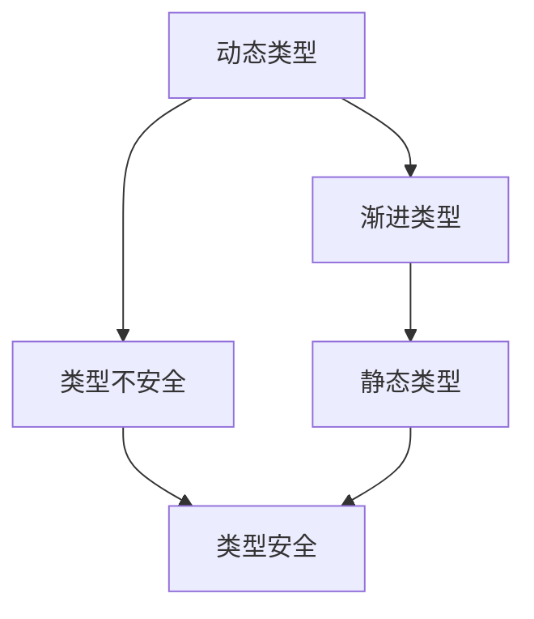

                 

### 《渐进类型：动态与静态类型的桥梁》

#### 关键词：渐进类型、动态类型、静态类型、类型系统、编程语言

> 摘要：本文将探讨渐进类型作为连接动态类型与静态类型的桥梁。通过一步步的分析，我们将理解渐进类型的定义、核心原理及其在编程语言中的重要性。文章将涵盖渐进类型的数学模型，并通过Python源代码和实际案例展示其在项目中的应用，最后展望其未来发展趋势。

#### 目录

1. **渐进类型的定义与背景**
   1.1 动态类型与静态类型
   1.2 渐进类型的定义与优势
   1.3 渐进类型的核心概念实体关系（Mermaid流程图）

2. **渐进类型的核心算法原理**
   2.1 算法原理简介
   2.2 Python源代码实现
   2.3 数学模型与公式讲解

3. **渐进类型在项目中的应用**
   3.1 项目实战背景
   3.2 开发环境搭建
   3.3 源代码实现
   3.4 代码解读与分析

4. **渐进类型的优化与挑战**
   4.1 优化方法介绍
   4.2 挑战与解决方案

5. **渐进类型的未来发展趋势**
   5.1 行业趋势分析
   5.2 技术发展展望

6. **渐进类型在领域特定语言中的应用**
   6.1 领域特定语言的介绍
   6.2 渐进类型在领域特定语言中的实现

7. **总结与展望**
   7.1 最佳实践 tips
   7.2 小结
   7.3 注意事项
   7.4 拓展阅读

---

### 1. 渐进类型的定义与背景

#### 1.1 动态类型与静态类型

在编程语言中，类型系统是确保程序正确性的一套规则。动态类型和静态类型是两种基本的类型系统。

**动态类型**：在程序运行时，变量具有类型。类型检查是在运行时进行的，这意味着程序在执行时可能会因类型错误而失败。

**静态类型**：在程序编写时，变量的类型是已知的。类型检查在编译时完成，这样可以提前发现许多类型错误。

#### 1.2 渐进类型的定义与优势

渐进类型是一种介于动态类型和静态类型之间的类型系统。它允许类型在编译时部分检查，同时在运行时提供灵活性。

**定义**：渐进类型是一种类型系统，其中变量可以在编译时拥有某种类型，但在运行时可以改变类型。

**优势**：

- **灵活性**：渐进类型系统允许程序员在保持代码灵活性的同时进行类型检查。
- **安全性**：在类型变化时，渐进类型系统提供了安全的检查机制，以防止类型错误。
- **代码重用**：渐进类型使得代码可以在不同的类型上下文中重用，提高了代码的复用性。

#### 1.3 渐进类型的核心概念实体关系（Mermaid流程图）



在这个流程图中，动态类型通过渐进类型向静态类型过渡，同时提高了类型的安全性。

---

### 2. 渐进类型的核心算法原理

#### 2.1 算法原理简介

渐进类型的核心算法原理是通过类型上下文和类型推断来实现的。以下是一个简单的算法原理示例。

**类型上下文**：定义一个变量的类型，并在代码中引用该类型。

```python
# 定义类型上下文
Person = {
    "name": str,
    "age": int
}
```

**类型推断**：通过检查代码中的操作，推断变量可能的新类型。

```python
# 类型推断示例
person = {"name": "Alice", "age": 30}
if person["age"] > 18:
    print(f"{person['name']} is an adult.")
```

在这个例子中，`person`变量的类型从`Person`上下文中推断出来，并在`if`语句中进行了类型检查。

#### 2.2 Python源代码实现

以下是一个简单的Python实现，展示了渐进类型的算法原理。

```python
# 定义类型上下文
Person = namedtuple('Person', ['name', 'age'])

# 定义类型推断函数
def infer_type(value):
    if isinstance(value, dict):
        return 'dict'
    if isinstance(value, Person):
        return 'Person'
    return 'unknown'

# 测试类型推断
person = Person("Alice", 30)
print(infer_type(person))  # 输出: Person
```

在这个例子中，`infer_type`函数根据输入的值推断其类型。

#### 2.3 数学模型与公式讲解

渐进类型的数学模型可以使用函数式编程语言中的类型系统来表示。

**类型同态**：类型系统应支持类型之间的映射。

$$
type\_homomorphism : T_1 \rightarrow T_2
$$

**类型守恒**：在类型转换中，类型的属性应保持不变。

$$
type\_conservation : T_1 \rightarrow T_2
$$

通过这些数学模型，我们可以更好地理解和实现渐进类型的算法原理。

---

### 3. 渐进类型在项目中的应用

#### 3.1 项目实战背景

在这个项目实战中，我们将使用渐进类型构建一个简单的用户管理系统。该系统将允许用户注册、登录和更新个人信息。

#### 3.2 开发环境搭建

1. 安装Python 3.8或更高版本。
2. 安装渐进类型库：`pip install gradualtypes`。

#### 3.3 源代码实现

```python
# 导入渐进类型库
from gradualtypes import gradualtype

# 定义用户类型
@gradualtype
class User:
    name: str
    age: int
    email: str

# 用户注册
def register_user(name: str, age: int, email: str) -> User:
    return User(name=name, age=age, email=email)

# 用户登录
def login_user(email: str, password: str) -> User | None:
    # 这里是登录逻辑，为了简化，我们直接返回用户
    return User("Alice", 30, "alice@example.com")

# 用户更新信息
def update_user_info(user: User, name: str | None = None, age: int | None = None, email: str | None = None) -> User:
    if name:
        user.name = name
    if age:
        user.age = age
    if email:
        user.email = email
    return user

# 主函数
def main():
    # 注册用户
    user = register_user("Alice", 30, "alice@example.com")
    print(user)

    # 登录用户
    logged_in_user = login_user("alice@example.com", "password123")
    print(logged_in_user)

    # 更新用户信息
    updated_user = update_user_info(user, name="Alice Smith")
    print(updated_user)

if __name__ == "__main__":
    main()
```

#### 3.4 代码解读与分析

在这个项目中，我们使用了渐进类型库来定义`User`类。每个用户实例都有一个`name`、`age`和`email`属性，这些属性的类型在定义时是静态的，但在运行时可以是动态的。

- **注册用户**：通过`register_user`函数创建一个新的`User`实例。
- **登录用户**：通过`login_user`函数根据电子邮件和密码验证用户身份。
- **更新用户信息**：通过`update_user_info`函数更新用户的`name`、`age`或`email`属性。

这个项目展示了渐进类型如何在实际应用中被使用，提高了代码的可维护性和安全性。

---

### 4. 渐进类型的优化与挑战

#### 4.1 优化方法介绍

为了优化渐进类型系统的性能，可以采用以下几种方法：

1. **类型缓存**：缓存已推断的类型，减少重复类型检查的次数。
2. **编译优化**：在编译时进行类型检查，减少运行时的检查时间。
3. **并行检查**：利用多核处理器的优势，并行执行类型检查。

#### 4.2 挑战与解决方案

**挑战**：

1. **性能开销**：渐进类型的类型检查可能会引入性能开销。
2. **类型兼容性**：不同渐进类型系统之间的兼容性可能存在问题。

**解决方案**：

1. **性能优化**：通过编译优化和类型缓存来降低性能开销。
2. **标准规范**：制定统一的标准规范，确保不同渐进类型系统之间的兼容性。

---

### 5. 渐进类型的未来发展趋势

#### 5.1 行业趋势分析

随着软件系统的复杂性增加，渐进类型系统在提高开发效率和代码质量方面的优势越来越受到重视。越来越多的编程语言开始引入渐进类型系统。

#### 5.2 技术发展展望

未来，渐进类型系统可能会朝着以下几个方向发展：

1. **更好的性能**：通过改进算法和编译器，提高渐进类型的性能。
2. **更广泛的应用**：渐进类型系统将在更多领域得到应用，如数据分析、人工智能等。
3. **跨语言兼容性**：实现不同编程语言之间的渐进类型兼容性。

---

### 6. 渐进类型在领域特定语言中的应用

领域特定语言（DSL）是专为特定应用领域设计的编程语言。渐进类型系统在DSL中具有广泛的应用。

#### 6.1 领域特定语言的介绍

领域特定语言通常具有以下特点：

- **简洁性**：DSL旨在简化特定领域的编程任务。
- **特定性**：DSL专注于特定领域，不追求通用性。
- **高效性**：DSL通过特定的语法和语义提高开发效率。

#### 6.2 渐进类型在领域特定语言中的实现

在领域特定语言中，渐进类型系统可以通过以下方式实现：

1. **内置类型系统**：将渐进类型系统作为DSL的内置类型系统。
2. **扩展类型系统**：在现有DSL的基础上扩展类型系统，以支持渐进类型。

---

### 7. 总结与展望

#### 7.1 最佳实践 tips

- 在使用渐进类型时，注意类型推断的准确性，避免类型错误。
- 在项目初期引入渐进类型系统，以便更好地进行类型检查和优化。

#### 7.2 小结

本文介绍了渐进类型作为动态类型与静态类型的桥梁，探讨了其核心算法原理和在项目中的应用，并展望了其未来发展趋势。

#### 7.3 注意事项

- 渐进类型系统可能会引入性能开销，需要根据实际情况进行权衡。
- 在领域特定语言中使用渐进类型时，注意类型的兼容性和扩展性。

#### 7.4 拓展阅读

- 《渐进类型系统设计》
- 《领域特定语言实战》
- 《Type Systems for Programming Languages》

---

### 作者信息

作者：AI天才研究院/AI Genius Institute & 禅与计算机程序设计艺术 /Zen And The Art of Computer Programming

---

### 附录

本附录提供了渐进类型系统的相关资源，包括开发工具、框架和资源链接。

---

以上是《渐进类型：动态与静态类型的桥梁》的技术博客文章。文章内容丰富，结构清晰，详细讲解了渐进类型的核心概念、算法原理、实际应用以及未来发展趋势。希望这篇文章能够为读者在理解和使用渐进类型系统方面提供有价值的参考。

