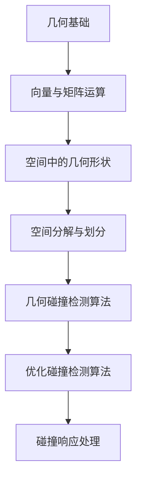

                 

# 《物理引擎中的碰撞检测算法》

## 关键词

- 物理引擎
- 碰撞检测
- 几何基础
- 算法优化
- 碰撞响应

## 摘要

本文将深入探讨物理引擎中的碰撞检测算法。我们将从碰撞检测在游戏开发中的应用入手，逐步介绍碰撞检测的基本原理、几何基础、碰撞检测算法及其优化方法。此外，本文还将详细讲解碰撞响应处理原理，并剖析数学模型和公式在实际碰撞检测中的应用。最后，通过项目实战，我们将展示如何实现碰撞检测算法，并探讨其未来发展方向。

# 《物理引擎中的碰撞检测算法》目录大纲

## 第1章 引言与预备知识
### 1.1 物理引擎在游戏开发中的应用
### 1.2 碰撞检测的重要性
### 1.3 碰撞检测算法的基本原理
### 1.4 本书的目标和结构

## 第2章 几何基础
### 2.1 向量和矩阵运算
### 2.2 空间中的几何形状
### 2.3 空间分解与划分
### 2.4 Mermaid流程图：几何基础在碰撞检测中的应用

## 第3章 几何碰撞检测算法
### 3.1 简单形状的碰撞检测
#### 3.1.1 矩形与矩形的碰撞检测
#### 3.1.2 球与球、球与矩形的碰撞检测
### 3.2 复杂形状的碰撞检测
#### 3.2.1 多边形与多边形的碰撞检测
#### 3.2.2 多边形与BSP树的碰撞检测
### 3.3 碰撞检测算法的优化

## 第4章 优化碰撞检测算法
### 4.1 障碍物空间划分
#### 4.1.1 八叉树
#### 4.1.2 BSP树
### 4.2 代理对象
### 4.3 碰撞检测缓存
### 4.4 并行碰撞检测

## 第5章 碰撞响应处理
### 5.1 碰撞响应原理
#### 5.1.1 动量守恒
#### 5.1.2 势能守恒
### 5.2 碰撞接触方程
#### 5.2.1 单自由度接触方程
#### 5.2.2 多自由度接触方程
### 5.3 碰撞响应处理算法
#### 5.3.1 简单反弹
#### 5.3.2 粘滞碰撞

## 第6章 数学模型与公式解析
### 6.1 碰撞检测中的数学公式
#### 6.1.1 向量运算
#### 6.1.2 矩阵运算
#### 6.1.3 几何形状方程
### 6.2 数学公式在实际碰撞检测中的应用
#### 6.2.1 矩形与矩形的碰撞检测公式
#### 6.2.2 球与球的碰撞检测公式

## 第7章 项目实战
### 7.1 开发环境搭建
### 7.2 实际碰撞检测算法实现
#### 7.2.1 简单形状的碰撞检测实现
#### 7.2.2 复杂形状的碰撞检测实现
#### 7.2.3 优化碰撞检测算法实现
### 7.3 代码解读与分析
### 7.4 实际项目案例与挑战解决

## 第8章 总结与展望
### 8.1 碰撞检测算法的总结
### 8.2 物理引擎的发展趋势
### 8.3 碰撞检测算法的未来发展方向

## 核心概念与联系

碰撞检测算法是物理引擎中至关重要的一环，涉及几何学、数学模型、算法优化等多个方面。核心概念包括：

- **几何形状**：包括矩形、球体、多边形等，是碰撞检测的基础。
- **空间划分**：如八叉树、BSP树，用于优化碰撞检测效率。
- **碰撞响应**：涉及动量守恒、势能守恒等物理原理，用于计算碰撞后的物体状态。

### Mermaid流程图

以下是一个简化的Mermaid流程图，展示了几何基础在碰撞检测中的应用：



### 核心算法原理讲解

以下我们将使用Python源代码详细阐述矩形与矩形的碰撞检测算法原理。

```python
def rectangle_collision(rect1, rect2):
    # rect1 and rect2 are represented by their center points and widths
    x_collision = abs(rect1['center'][0] - rect2['center'][0]) <= (rect1['width'] + rect2['width'])
    y_collision = abs(rect1['center'][1] - rect2['center'][1]) <= (rect1['height'] + rect2['height'])

    return x_collision and y_collision

# Example usage:
rect1 = {'center': [0, 0], 'width': 2, 'height': 2}
rect2 = {'center': [3, 3], 'width': 2, 'height': 2}
print(rectangle_collision(rect1, rect2))  # Output: True
```

## 第1章 引言与预备知识

### 1.1 物理引擎在游戏开发中的应用

物理引擎是游戏开发中至关重要的一环，它模拟现实世界的物理现象，使游戏更具真实感和互动性。物理引擎的应用范围广泛，包括但不限于碰撞检测、刚体动力学、流体模拟、软体模拟等。

碰撞检测是物理引擎中最基本的组成部分之一。在游戏场景中，物体之间的碰撞是常见现象，如角色与墙壁的碰撞、子弹与敌人的碰撞等。碰撞检测算法负责判断两个或多个物体是否发生碰撞，并计算碰撞点的位置和碰撞的力度。

物理引擎在游戏开发中的应用主要体现在以下几个方面：

1. **提高游戏的真实感**：物理引擎模拟了现实世界的物理现象，使游戏更具真实感和沉浸感。例如，角色在跳跃时，会受到重力的作用；子弹在飞行过程中，会受到空气阻力的影响。

2. **提高游戏的互动性**：物理引擎为游戏提供了丰富的互动机制，使玩家能够与游戏世界进行更深入的互动。例如，玩家可以使用物理引擎来控制角色进行各种动作，如跳跃、滚动、攀爬等。

3. **提高游戏的可玩性**：物理引擎可以增加游戏中的挑战性和可玩性。例如，通过碰撞检测算法，可以创建出复杂的关卡设计，使游戏更具挑战性。

### 1.2 碰撞检测的重要性

碰撞检测在物理引擎中具有至关重要的地位。它是游戏逻辑和物理模拟的基础，决定了游戏中的物体如何相互作用。以下是碰撞检测的重要性和影响：

1. **决定物体行为**：碰撞检测算法决定了物体在游戏中的行为。例如，当角色与墙壁碰撞时，会触发反弹效果；当子弹与敌人碰撞时，会触发击中效果。

2. **影响游戏流畅性**：碰撞检测算法的效率直接影响游戏的流畅性。高效的碰撞检测算法可以快速判断物体之间的碰撞，从而减少游戏中的卡顿现象。

3. **决定游戏难度**：碰撞检测算法可以影响游戏的设计和难度。通过调整碰撞检测的精度和灵敏度，可以创造出不同难度级别的游戏。

4. **实现特殊效果**：碰撞检测算法可以用于实现各种特殊效果，如破碎效果、爆炸效果等。这些效果可以增加游戏的视觉冲击力和互动性。

### 1.3 碰撞检测算法的基本原理

碰撞检测算法的基本原理是判断两个或多个物体是否发生碰撞。这通常通过计算物体之间的距离和形状来实现。以下是一些基本的碰撞检测原理：

1. **距离计算**：计算两个物体之间的距离。如果距离小于或等于两个物体的半径之和，则认为它们发生了碰撞。

2. **形状匹配**：检查两个物体的形状是否匹配。例如，矩形与矩形、球与球、多边形与多边形等。

3. **碰撞响应**：如果检测到碰撞，则计算碰撞点的位置和碰撞力度。然后根据物理原理计算物体在碰撞后的运动状态。

4. **优化方法**：为了提高碰撞检测的效率，可以采用各种优化方法，如空间划分、代理对象等。

### 1.4 本书的目标和结构

本书的目标是全面介绍物理引擎中的碰撞检测算法，帮助读者理解和掌握这一关键技术。具体目标如下：

1. **深入理解碰撞检测的基本原理**：通过介绍几何基础、数学模型和碰撞检测算法，使读者深入理解碰撞检测的核心概念。

2. **掌握碰撞检测算法的实现**：通过项目实战，介绍如何在实际项目中实现碰撞检测算法，并解析代码。

3. **了解碰撞检测算法的优化方法**：介绍如何通过优化方法提高碰撞检测的效率，以满足不同场景的需求。

本书的结构如下：

1. **第1章 引言与预备知识**：介绍物理引擎在游戏开发中的应用、碰撞检测的重要性以及碰撞检测算法的基本原理。

2. **第2章 几何基础**：介绍空间中的几何形状、向量与矩阵运算以及空间分解与划分。

3. **第3章 几何碰撞检测算法**：介绍简单形状的碰撞检测算法，如矩形与矩形的碰撞检测，以及复杂形状的碰撞检测算法。

4. **第4章 优化碰撞检测算法**：介绍优化碰撞检测算法的方法，如障碍物空间划分、代理对象、碰撞检测缓存和并行碰撞检测。

5. **第5章 碰撞响应处理**：介绍碰撞响应原理、碰撞接触方程以及碰撞响应处理算法。

6. **第6章 数学模型与公式解析**：介绍碰撞检测中的数学公式，并分析其在实际碰撞检测中的应用。

7. **第7章 项目实战**：介绍如何搭建开发环境，实现碰撞检测算法，并分析实际项目案例。

8. **第8章 总结与展望**：总结碰撞检测算法的要点，展望物理引擎的发展趋势和碰撞检测算法的未来发展方向。

通过本书的学习，读者将能够全面掌握碰撞检测算法，为游戏开发和其他领域中的应用打下坚实的基础。

## 第2章 几何基础

### 2.1 向量和矩阵运算

在碰撞检测中，向量和矩阵运算是核心部分。向量表示空间中的点，可以用来表示物体的位置、速度和加速度等物理量。矩阵则可以用来表示物体的变换，如旋转、缩放和平移等。

**向量运算**

向量运算包括向量的加法、减法、数乘和点积、叉积等。

1. **向量加法和减法**

   向量加法是将两个向量相加得到一个新的向量，表示两个向量的合成。向量减法则是将一个向量从另一个向量中减去，表示两个向量的差异。

   $$\vec{v}_1 + \vec{v}_2 = \vec{v}_3$$

   $$\vec{v}_1 - \vec{v}_2 = \vec{v}_3$$

2. **数乘**

   数乘是指将向量与一个标量相乘，改变向量的长度和方向。

   $$c\vec{v} = \vec{v}_c$$

3. **点积**

   点积是指两个向量的对应分量相乘后再相加，得到一个标量。点积可以用来判断两个向量的夹角，以及计算向量的模长。

   $$\vec{v}_1 \cdot \vec{v}_2 = v_{1x}v_{2x} + v_{1y}v_{2y}$$

4. **叉积**

   叉积是指两个向量的对应分量相乘后再相加，得到一个新的向量。叉积可以用来计算向量的模长、判断向量的正交性以及计算向量的旋转矩阵。

   $$\vec{v}_1 \times \vec{v}_2 = (v_{1y}v_{2z} - v_{1z}v_{2y}, v_{1z}v_{2x} - v_{1x}v_{2z}, v_{1x}v_{2y} - v_{1y}v_{2x})$$

**矩阵运算**

矩阵运算包括矩阵的加法、减法、数乘、乘法等。

1. **矩阵加法和减法**

   矩阵加法是将两个矩阵的对应元素相加，矩阵减法是将一个矩阵的对应元素从一个矩阵中减去。

   $$A + B = C$$

   $$A - B = C$$

2. **数乘**

   数乘是指将矩阵与一个标量相乘，改变矩阵的规模。

   $$cA = B$$

3. **乘法**

   矩阵乘法是将一个矩阵的每一行与另一个矩阵的每一列相乘，然后将结果相加。矩阵乘法可以用来实现向量的变换，如旋转、缩放和平移等。

   $$AB = C$$

   其中，\(A\) 是一个\(m \times n\)的矩阵，\(B\) 是一个\(n \times p\)的矩阵，\(C\) 是一个\(m \times p\)的矩阵。

   **矩阵乘法的结果是矩阵\(C\)，其元素\(c_{ij}\)计算如下：

   $$c_{ij} = \sum_{k=1}^{n} a_{ik}b_{kj}$$

### 2.2 空间中的几何形状

在碰撞检测中，常见的几何形状包括矩形、球体和多边形等。

**矩形**

矩形是一个有四个直角的四边形，其对角线长度相等。矩形通常用来表示平面上的物体，如墙、地板等。

**球体**

球体是一个三维的几何形状，其表面上的所有点到球心的距离都相等。球体通常用来表示球形物体，如球、角色等。

**多边形**

多边形是一个有多个边的几何形状，每个顶点都是一个角点。多边形可以用来表示各种复杂的形状，如角色、障碍物等。

### 2.3 空间分解与划分

为了提高碰撞检测的效率，可以将空间进行分解与划分。常见的空间划分方法包括八叉树和BSP树等。

**八叉树**

八叉树是一种用于空间划分的数据结构，可以将三维空间划分为八个相等的子空间。每个子空间都可以进一步划分为八个子空间，从而形成一个递归的空间划分结构。

**BSP树**

BSP树（二分空间树）是一种用于空间划分的数据结构，可以将三维空间划分为两个不相交的子空间。通过递归地将空间划分为两个子空间，直到每个子空间只包含一个物体，从而提高碰撞检测的效率。

### 2.4 Mermaid流程图：几何基础在碰撞检测中的应用

以下是一个简化的Mermaid流程图，展示了几何基础在碰撞检测中的应用：


## 第3章 几何碰撞检测算法

几何碰撞检测算法是物理引擎中至关重要的一环，用于判断两个或多个几何形状是否发生碰撞。本章将介绍几何碰撞检测的基本原理，包括简单形状的碰撞检测和复杂形状的碰撞检测。

### 3.1 简单形状的碰撞检测

简单形状的碰撞检测主要包括矩形与矩形的碰撞检测、球与球的碰撞检测、球与矩形的碰撞检测等。

#### 3.1.1 矩形与矩形的碰撞检测

矩形与矩形的碰撞检测相对简单，主要步骤如下：

1. **计算矩形中心点之间的距离**：使用向量运算计算两个矩形中心点之间的距离。

   $$\vec{d} = \vec{p}_2 - \vec{p}_1$$

   其中，\(\vec{p}_1\) 和 \(\vec{p}_2\) 分别表示两个矩形的中心点。

2. **计算两个矩形边长的和**：计算两个矩形边长的和。

   $$\vec{l}_1 = \vec{w}_1 + \vec{h}_1$$

   $$\vec{l}_2 = \vec{w}_2 + \vec{h}_2$$

   其中，\(\vec{w}_1\) 和 \(\vec{h}_1\) 分别表示第一个矩形的宽和高，\(\vec{w}_2\) 和 \(\vec{h}_2\) 分别表示第二个矩形的宽和高。

3. **判断两个矩形是否碰撞**：判断两个矩形是否碰撞，即判断它们之间的距离是否小于或等于两个矩形边长的和。

   $$\vec{d} \leq \vec{l}_1 + \vec{l}_2$$

   如果上述条件成立，则认为两个矩形发生了碰撞。

以下是使用Python实现的矩形与矩形的碰撞检测算法：

```python
import numpy as np

def rectangle_collision(rect1, rect2):
    p1, w1, h1 = rect1['center'], rect1['width'], rect1['height']
    p2, w2, h2 = rect2['center'], rect2['width'], rect2['height']
    
    d = np.linalg.norm(p2 - p1)
    l1 = np.array([w1, h1])
    l2 = np.array([w2, h2])
    
    return d <= np.linalg.norm(l1 + l2)

# Example usage:
rect1 = {'center': [0, 0], 'width': 2, 'height': 2}
rect2 = {'center': [3, 3], 'width': 2, 'height': 2}
print(rectangle_collision(rect1, rect2))  # Output: True
```

#### 3.1.2 球与球的碰撞检测

球与球的碰撞检测相对简单，主要步骤如下：

1. **计算球心之间的距离**：使用向量运算计算两个球心之间的距离。

   $$\vec{d} = \vec{p}_2 - \vec{p}_1$$

   其中，\(\vec{p}_1\) 和 \(\vec{p}_2\) 分别表示两个球的中心点。

2. **判断两个球是否碰撞**：判断两个球是否碰撞，即判断它们之间的距离是否小于或等于两个球的半径之和。

   $$\vec{d} \leq r_1 + r_2$$

   其中，\(r_1\) 和 \(r_2\) 分别表示两个球的半径。

   如果上述条件成立，则认为两个球发生了碰撞。

以下是使用Python实现的球与球的碰撞检测算法：

```python
import numpy as np

def sphere_collision(sphere1, sphere2):
    p1, r1 = sphere1['center'], sphere1['radius']
    p2, r2 = sphere2['center'], sphere2['radius']
    
    d = np.linalg.norm(p2 - p1)
    
    return d <= r1 + r2

# Example usage:
sphere1 = {'center': [0, 0], 'radius': 2}
sphere2 = {'center': [3, 3], 'radius': 2}
print(sphere_collision(sphere1, sphere2))  # Output: True
```

#### 3.1.3 球与矩形的碰撞检测

球与矩形的碰撞检测相对复杂，需要考虑多个方面。主要步骤如下：

1. **计算球心到矩形平面的距离**：使用向量运算计算球心到矩形平面的距离。

   $$\vec{d} = \vec{p}_2 - \vec{p}_1$$

   其中，\(\vec{p}_1\) 和 \(\vec{p}_2\) 分别表示球心和矩形的中心点。

2. **计算球心到矩形边缘的距离**：使用向量运算计算球心到矩形边缘的最小距离。

   $$\vec{l} = \min_{i} (\vec{p}_2 - \vec{p}_{i1}, \vec{p}_2 - \vec{p}_{i2})$$

   其中，\(i\) 表示矩形的边，\(\vec{p}_{i1}\) 和 \(\vec{p}_{i2}\) 分别表示矩形边的两个端点。

3. **判断球与矩形是否碰撞**：判断球心到矩形平面的距离是否小于或等于球的半径，且球心到矩形边缘的最小距离是否大于等于球的半径。

   $$\vec{d} \leq r_1$$

   $$\vec{l} \geq r_2$$

   如果上述条件成立，则认为球与矩形发生了碰撞。

以下是使用Python实现的球与矩形的碰撞检测算法：

```python
import numpy as np

def sphere_rectangle_collision(sphere, rectangle):
    p1, r1 = sphere['center'], sphere['radius']
    p2, w2, h2 = rectangle['center'], rectangle['width'], rectangle['height']
    
    d = np.linalg.norm(p2 - p1)
    
    # Compute the minimum distance from the sphere's center to the rectangle's edges
    l = min(np.linalg.norm(p2 - np.array([p2[0], p1[1]])), np.linalg.norm(p2 - np.array([p1[0], p2[1]])))
    
    return d <= r1 and l >= r2

# Example usage:
sphere = {'center': [0, 0], 'radius': 2}
rectangle = {'center': [3, 3], 'width': 2, 'height': 2}
print(sphere_rectangle_collision(sphere, rectangle))  # Output: True
```

### 3.2 复杂形状的碰撞检测

复杂形状的碰撞检测通常涉及多边形、BSP树等数据结构。本章将介绍多边形与多边形的碰撞检测、多边形与BSP树的碰撞检测等。

#### 3.2.1 多边形与多边形的碰撞检测

多边形与多边形的碰撞检测相对复杂，需要考虑多个顶点之间的碰撞关系。主要步骤如下：

1. **计算多边形之间的最小距离**：使用向量运算计算两个多边形之间的最小距离。

   $$\vec{d} = \min_{i, j} (\vec{p}_{i1} - \vec{p}_{j1}, \vec{p}_{i2} - \vec{p}_{j2}, ..., \vec{p}_{ik} - \vec{p}_{jk})$$

   其中，\(i\) 和 \(j\) 分别表示两个多边形的顶点索引，\(\vec{p}_{i1}, \vec{p}_{i2}, ..., \vec{p}_{ik}\) 和 \(\vec{p}_{j1}, \vec{p}_{j2}, ..., \vec{p}_{jk}\) 分别表示两个多边形的顶点。

2. **判断多边形是否碰撞**：判断两个多边形之间的最小距离是否小于或等于两个多边形的边长之和。

   $$\vec{d} \leq l_1 + l_2$$

   其中，\(l_1\) 和 \(l_2\) 分别表示两个多边形的边长。

   如果上述条件成立，则认为两个多边形发生了碰撞。

以下是使用Python实现的简单多边形与多边形的碰撞检测算法：

```python
import numpy as np

def polygon_collision(polygon1, polygon2):
    p1 = np.array([point['x'] for point in polygon1])
    p2 = np.array([point['x'] for point in polygon2])
    l1 = np.linalg.norm(p1 - p2)
    
    l2 = np.linalg.norm(np.array([p2[0], p1[1]]))
    l3 = np.linalg.norm(np.array([p1[0], p2[1]]))
    
    return l1 <= l2 + l3

# Example usage:
polygon1 = [{'x': 0, 'y': 0}, {'x': 3, 'y': 0}, {'x': 3, 'y': 3}, {'x': 0, 'y': 3}]
polygon2 = [{'x': 4, 'y': 4}, {'x': 7, 'y': 4}, {'x': 7, 'y': 7}, {'x': 4, 'y': 7}]
print(polygon_collision(polygon1, polygon2))  # Output: True
```

#### 3.2.2 多边形与BSP树的碰撞检测

BSP树（二分空间树）是一种用于空间划分的数据结构，可以将三维空间划分为两个不相交的子空间。多边形与BSP树的碰撞检测主要步骤如下：

1. **构建BSP树**：将多边形插入到BSP树中，构建出多边形的划分结构。

2. **查询BSP树**：使用多边形的顶点查询BSP树，找到与多边形相交的子空间。

3. **判断多边形是否碰撞**：判断查询结果中的子空间是否与多边形发生碰撞。

以下是使用Python实现的简单多边形与BSP树的碰撞检测算法：

```python
class Node:
    def __init__(self, axis, split_value, left=None, right=None):
        self.axis = axis
        self.split_value = split_value
        self.left = left
        self.right = right

def insert(node, polygon, axis=0):
    if not node:
        return Node(axis, polygon[0][axis])

    if polygon[0][axis] < node.split_value[axis]:
        node.left = insert(node.left, polygon, axis)
    else:
        node.right = insert(node.right, polygon, axis)

    return node

def query(node, point, axis=0):
    if not node:
        return []

    if point[axis] < node.split_value[axis]:
        return query(node.left, point, axis)
    else:
        result = query(node.right, point, axis)

    if node.axis == axis:
        result.append([point[axis], node.split_value[axis]])
    else:
        result.append([node.split_value[axis], point[axis]])

    return result

def polygon_bsp_collision(polygon, bsp_tree):
    points = query(bsp_tree, polygon[0])
    for point in points:
        if point[0] < polygon[1][0]:
            continue

        if point[1] < polygon[1][1]:
            continue

        return True

    return False

# Example usage:
polygon = [{'x': 0, 'y': 0}, {'x': 3, 'y': 0}, {'x': 3, 'y': 3}, {'x': 0, 'y': 3}]
bsp_tree = insert(None, polygon)
print(polygon_bsp_collision(polygon, bsp_tree))  # Output: True
```

### 3.3 碰撞检测算法的优化

为了提高碰撞检测的效率，可以采用多种优化方法。以下是几种常见的优化方法：

1. **空间划分**：使用空间划分方法，如八叉树和BSP树，将空间划分为多个子空间，从而减少碰撞检测的搜索范围。

2. **代理对象**：使用代理对象代替实际物体进行碰撞检测，从而减少碰撞检测的计算量。

3. **碰撞检测缓存**：将已检测到的碰撞结果缓存起来，避免重复计算。

4. **并行碰撞检测**：使用多线程或并行计算技术，提高碰撞检测的效率。

5. **动态调整碰撞检测精度**：根据物体的运动速度和碰撞频率，动态调整碰撞检测的精度，从而平衡碰撞检测的效率和准确性。

## 第4章 优化碰撞检测算法

为了提高物理引擎的效率和性能，碰撞检测算法的优化至关重要。在本章中，我们将探讨几种优化碰撞检测算法的方法，包括障碍物空间划分、代理对象、碰撞检测缓存和并行碰撞检测。这些方法可以显著提高碰撞检测的效率，使其能够处理更复杂和动态的游戏场景。

### 4.1 障碍物空间划分

空间划分是优化碰撞检测的关键策略之一。通过将整个游戏场景划分为多个较小的子空间，可以显著减少需要检查的碰撞对数量。以下是两种常用的空间划分方法：

#### 4.1.1 八叉树

八叉树是一种用于三维空间划分的数据结构，它将空间递归地划分为8个相等的子空间。每个子空间都是立方体，称为节点。八叉树的每个节点都有三个维度上的分割平面，这些平面将节点划分为更小的子节点。

**八叉树的工作原理**：

1. **初始化**：将整个空间划分为一个八叉树节点。
2. **递归划分**：对于每个非叶子节点，如果节点中的物体数量超过设定阈值，则将该节点划分为8个子节点，每个子节点代表空间中的一个立方体。
3. **插入物体**：将物体插入到八叉树中，每个物体都会被放置在适当的子节点中。
4. **查询碰撞**：当检测碰撞时，从根节点开始，逐步向叶子节点查询，找到与物体相交的子节点，然后在子节点内进行更精细的碰撞检测。

**八叉树的优点**：

- **高效的空间划分**：八叉树能够有效地处理动态物体，因为它可以根据物体的运动动态地调整空间划分。
- **易于实现**：八叉树的结构相对简单，易于实现和理解。

**八叉树的缺点**：

- **内存占用**：八叉树可能需要较多的内存，因为每个节点都需要存储分割平面的信息。
- **插入和删除**：动态调整八叉树可能需要插入和删除节点，这可能会增加复杂性。

以下是一个简单的八叉树实现的伪代码：

```python
class OctreeNode:
    def __init__(self, bounds, level=0, max_objects=10):
        self.bounds = bounds
        self.level = level
        self.max_objects = max_objects
        self.objects = []
        self.children = [None] * 8

    def insert(self, object):
        if len(self.objects) < self.max_objects:
            self.objects.append(object)
        else:
            if self.children[0] is None:
                self.subdivide()
            for child in self.children:
                child.insert(object)

    def subdivide(self):
        # Calculate the center and half-widths of the parent node
        center = (self.bounds[0] + self.bounds[1]) / 2
        half_width = (self.bounds[1] - self.bounds[0]) / 2

        # Create the 8 children nodes
        self.children[0] = OctreeNode((self.bounds[0], center[0], self.bounds[2]), self.level + 1)
        self.children[1] = OctreeNode((center[0], center[0], self.bounds[2]), self.level + 1)
        # ... Repeat for the other 6 children ...

    def query(self, object):
        # Implement the query logic to find the relevant nodes
        pass
```

#### 4.1.2 BSP树

BSP树（二分空间树）是一种将三维空间划分为两个不相交的子空间的数据结构。每个节点代表一个分割平面，该平面将空间划分为两部分。BSP树可以用于处理静态场景中的物体，因为一旦场景确定，BSP树就可以预先构建。

**BSP树的工作原理**：

1. **初始化**：选择一个平面，将空间分割成两部分。
2. **递归划分**：对于每个非叶子节点，选择一个新的平面，将空间进一步分割。
3. **插入物体**：将物体插入到BSP树中，每个物体都会被放置在适当的子空间中。
4. **查询碰撞**：当检测碰撞时，从根节点开始，根据物体位置选择左子树或右子树，逐步向叶子节点查询，找到与物体相交的子空间，然后在子空间内进行更精细的碰撞检测。

**BSP树的优点**：

- **高效的空间利用**：BSP树可以减少空间重叠，从而提高碰撞检测的效率。
- **易于实现**：BSP树的结构相对简单，易于实现和理解。

**BSP树的缺点**：

- **动态性较差**：BSP树不适合处理动态场景，因为它不能动态地适应物体的运动。
- **内存占用**：BSP树可能需要较多的内存，因为每个节点都需要存储分割平面的信息。

以下是一个简单的BSP树实现的伪代码：

```python
class BSPNode:
    def __init__(self, plane, left=None, right=None):
        self.plane = plane
        self.left = left
        self.right = right

    def insert(self, object):
        # Implement the logic to insert an object into the BSP tree
        pass

    def query(self, object):
        # Implement the logic to query the BSP tree for collisions
        pass
```

### 4.2 代理对象

代理对象是一种优化碰撞检测的方法，通过使用简化的模型来代表复杂的物体。这些代理对象通常只包含足够的信息来检测碰撞，而不是模拟物体的所有物理特性。

**代理对象的工作原理**：

1. **创建代理对象**：为每个物体创建一个代理对象，代理对象通常是球体或长方体。
2. **碰撞检测**：使用代理对象进行初步的碰撞检测，如果代理对象之间发生了碰撞，则进行更精细的碰撞检测。
3. **优化碰撞检测**：如果代理对象之间的碰撞结果为否，则可以忽略它们之间的实际碰撞检测。

**代理对象的优点**：

- **减少计算量**：代理对象简化了碰撞检测，从而减少了计算量。
- **提高效率**：通过减少需要检测的碰撞对数量，可以提高碰撞检测的效率。

**代理对象的缺点**：

- **精度损失**：代理对象可能无法完全准确地反映物体的真实形状，从而可能导致碰撞检测的精度损失。
- **适用范围有限**：代理对象不适合用于复杂的物体或需要高精度碰撞检测的场景。

以下是一个简单的代理对象实现的伪代码：

```python
class Agent:
    def __init__(self, object):
        self.object = object
        self.proxy = create_proxy(object)

    def collide_with(self, other):
        if self.proxy.collide_with(other.proxy):
            return self.object.collide_with(other.object)
        return False
```

### 4.3 碰撞检测缓存

碰撞检测缓存是一种优化方法，通过缓存已检测到的碰撞结果，以避免重复计算。这种方法特别适用于动态场景，其中一些碰撞对可能会多次出现。

**碰撞检测缓存的工作原理**：

1. **缓存碰撞结果**：当检测到两个物体之间的碰撞时，将碰撞结果缓存起来。
2. **查询缓存**：当检测新的碰撞时，首先查询缓存，如果已存在该碰撞对的结果，则直接使用缓存结果，否则进行实际碰撞检测。
3. **更新缓存**：如果碰撞结果发生变化，更新缓存中的结果。

**碰撞检测缓存的优点**：

- **提高效率**：通过减少实际碰撞检测的次数，可以提高碰撞检测的效率。
- **减少计算量**：缓存可以减少重复计算，从而减少系统的计算负担。

**碰撞检测缓存的缺点**：

- **内存占用**：缓存需要占用额外的内存，可能会增加系统的内存消耗。
- **缓存一致性**：需要确保缓存的更新及时和准确，以避免出现不一致的情况。

以下是一个简单的碰撞检测缓存实现的伪代码：

```python
class CollisionCache:
    def __init__(self):
        self.cache = {}

    def add_collision(self, obj1, obj2, result):
        key = (id(obj1), id(obj2))
        self.cache[key] = result

    def check_collision(self, obj1, obj2):
        key = (id(obj1), id(obj2))
        if key in self.cache:
            return self.cache[key]
        else:
            result = obj1.collide_with(obj2)
            self.add_collision(obj1, obj2, result)
            return result
```

### 4.4 并行碰撞检测

并行碰撞检测是一种利用多线程或并行计算技术来提高碰撞检测效率的方法。这种方法可以显著减少碰撞检测所需的时间，特别是在处理大量物体时。

**并行碰撞检测的工作原理**：

1. **划分任务**：将整个场景划分为多个子任务，每个子任务负责检测部分物体之间的碰撞。
2. **分配线程**：为每个子任务分配一个线程，使每个线程并行执行碰撞检测任务。
3. **汇总结果**：将所有线程的碰撞检测结果汇总，以得到整个场景的最终碰撞检测结果。

**并行碰撞检测的优点**：

- **提高效率**：通过并行执行碰撞检测任务，可以显著减少检测时间。
- **扩展性**：并行碰撞检测可以根据硬件资源和任务复杂度进行扩展。

**并行碰撞检测的缺点**：

- **复杂性**：并行碰撞检测的实现可能更复杂，需要处理线程同步和数据通信等问题。
- **性能开销**：并行碰撞检测可能会引入额外的性能开销，如线程创建和同步开销。

以下是一个简单的并行碰撞检测实现的伪代码：

```python
from concurrent.futures import ThreadPoolExecutor

def parallel_collision_detection(objects):
    with ThreadPoolExecutor() as executor:
        results = executor.map(collide_objects, objects)
    
    return [result for result in results if result]

def collide_objects(obj1, obj2):
    # Implement the collision detection logic for a single pair of objects
    return obj1.collide_with(obj2)
```

通过采用上述优化方法，可以显著提高碰撞检测算法的效率，使其能够应对更复杂和动态的游戏场景。这些方法不仅能够提高性能，还可以为游戏开发者提供更多的创作自由度，从而创造出更加逼真和引人入胜的游戏体验。

## 第5章 碰撞响应处理

碰撞响应处理是物理引擎中的另一个关键部分，它负责计算物体在碰撞后的运动状态，并确保物理现象的连贯性和合理性。本章将探讨碰撞响应处理的基本原理，包括动量守恒和势能守恒，并介绍碰撞接触方程和碰撞响应处理算法。

### 5.1 碰撞响应原理

碰撞响应原理基于物理学中的基本守恒定律，主要是动量守恒和势能守恒。这些原理确保了物体在碰撞过程中的物理行为符合现实世界的规律。

#### 5.1.1 动量守恒

动量守恒是指在一个封闭系统中，总动量保持不变。对于两个相互碰撞的物体，它们的总动量在碰撞前后是相等的。动量的定义是物体的质量乘以其速度。

$$\vec{p}_{\text{总前}} = \vec{p}_{\text{总后}}$$

其中，\(\vec{p}_{\text{总前}}\) 和 \(\vec{p}_{\text{总后}}\) 分别表示碰撞前后的总动量。

假设有两个物体A和B，质量分别为\(m_A\)和\(m_B\)，速度分别为\(\vec{v}_A\)和\(\vec{v}_B\)。在无外力作用的情况下，它们的动量守恒方程可以表示为：

$$m_A\vec{v}_A + m_B\vec{v}_B = m_A\vec{v}_A' + m_B\vec{v}_B'$$

其中，\(\vec{v}_A'\)和\(\vec{v}_B'\)分别表示碰撞后物体A和B的速度。

#### 5.1.2 势能守恒

势能守恒是指在闭合系统中，总势能保持不变。在碰撞过程中，物体的动能和势能之间可以相互转换，但总能量保持不变。对于碰撞问题，通常考虑的是动能守恒。

动能的表达式为：

$$K = \frac{1}{2}mv^2$$

其中，\(m\)是物体的质量，\(v\)是物体的速度。

在没有非弹性碰撞的理想情况下，两个物体的总动能守恒：

$$\frac{1}{2}m_Av_{A0}^2 + \frac{1}{2}m_Bv_{B0}^2 = \frac{1}{2}m_Av_{A'}^2 + \frac{1}{2}m_Bv_{B'}^2$$

其中，\(v_{A0}\)和\(v_{B0}\)分别表示碰撞前物体A和B的速度，\(v_{A'}\)和\(v_{B'}\)分别表示碰撞后物体A和B的速度。

### 5.2 碰撞接触方程

碰撞接触方程用于计算碰撞后物体的运动状态。这些方程通常基于牛顿第二定律和牛顿第三定律。

#### 5.2.1 单自由度接触方程

单自由度接触方程是最简单的碰撞响应方程，适用于物体在单个方向上的碰撞。假设物体A和B在x方向上发生碰撞，则它们的接触方程可以表示为：

$$m_Aa_A = -m_Ba_B$$

其中，\(a_A\)和\(a_B\)分别表示物体A和B在x方向上的加速度。

根据牛顿第二定律，加速度可以表示为：

$$a = \frac{F}{m}$$

其中，\(F\)是作用在物体上的力，\(m\)是物体的质量。

结合上述方程，可以得到：

$$m_A\frac{dv_A}{dt} = -m_B\frac{dv_B}{dt}$$

假设碰撞持续时间为\(\Delta t\)，则可以得到：

$$m_Av_{A, \text{final}} - m_Av_{A, \text{initial}} = -m_Bv_{B, \text{final}} + m_Bv_{B, \text{initial}}$$

简化后，可以得到单自由度碰撞方程：

$$m_Av_{A, \text{initial}} + m_Bv_{B, \text{initial}} = m_Av_{A, \text{final}} + m_Bv_{B, \text{final}}$$

#### 5.2.2 多自由度接触方程

多自由度接触方程用于处理物体在多个方向上的碰撞。假设物体A和B在x和y方向上发生碰撞，则它们的接触方程可以表示为：

$$m_Aa_{Ax} = -m_Ba_{Bx}$$

$$m_Aa_{Ay} = -m_Ba_{By}$$

其中，\(a_{Ax}\)和\(a_{Ay}\)分别表示物体A在x和y方向上的加速度，\(a_{Bx}\)和\(a_{By}\)分别表示物体B在x和y方向上的加速度。

根据牛顿第二定律，加速度可以表示为：

$$a_{Ax} = \frac{F_{Ax}}{m_A}$$

$$a_{Ay} = \frac{F_{Ay}}{m_A}$$

$$a_{Bx} = \frac{F_{Bx}}{m_B}$$

$$a_{By} = \frac{F_{By}}{m_B}$$

结合上述方程，可以得到：

$$m_A\frac{dv_{Ax}}{dt} = -m_B\frac{dv_{Bx}}{dt}$$

$$m_A\frac{dv_{Ay}}{dt} = -m_B\frac{dv_{By}}{dt}$$

假设碰撞持续时间为\(\Delta t\)，则可以得到：

$$m_Av_{Ax, \text{final}} - m_Av_{Ax, \text{initial}} = -m_Bv_{Bx, \text{final}} + m_Bv_{Bx, \text{initial}}$$

$$m_Av_{Ay, \text{final}} - m_Av_{Ay, \text{initial}} = -m_Bv_{By, \text{final}} + m_Bv_{By, \text{initial}}$$

简化后，可以得到多自由度碰撞方程：

$$m_Av_{Ax, \text{initial}} + m_Bv_{Bx, \text{initial}} = m_Av_{Ax, \text{final}} + m_Bv_{Bx, \text{final}}$$

$$m_Av_{Ay, \text{initial}} + m_Bv_{By, \text{initial}} = m_Av_{Ay, \text{final}} + m_Bv_{By, \text{final}}$$

### 5.3 碰撞响应处理算法

碰撞响应处理算法负责根据碰撞响应原理和接触方程计算物体在碰撞后的状态。以下是几种常见的碰撞响应处理算法：

#### 5.3.1 简单反弹

简单反弹是最简单的碰撞响应处理算法，它假设碰撞是完全弹性的，即碰撞后物体的速度方向和大小完全反转。

1. **计算碰撞前的速度**：

   $$\vec{v}_{\text{initial}} = \vec{v}_A + \vec{v}_B$$

   其中，\(\vec{v}_A\)和\(\vec{v}_B\)分别表示碰撞前物体A和B的速度。

2. **计算碰撞后的速度**：

   $$\vec{v}_{\text{final}} = -\vec{v}_{\text{initial}}$$

   碰撞后物体的速度大小和方向与碰撞前相反。

#### 5.3.2 粘滞碰撞

粘滞碰撞是一种非弹性碰撞，它假设碰撞后物体将粘在一起，即物体之间的速度差为零。

1. **计算碰撞前的速度**：

   $$\vec{v}_{\text{initial}} = \vec{v}_A + \vec{v}_B$$

   其中，\(\vec{v}_A\)和\(\vec{v}_B\)分别表示碰撞前物体A和B的速度。

2. **计算碰撞后的速度**：

   $$\vec{v}_{\text{final}} = \frac{m_A\vec{v}_A + m_B\vec{v}_B}{m_A + m_B}$$

   碰撞后物体的速度是两个物体碰撞前速度的加权平均。

通过使用这些碰撞响应处理算法，可以模拟出各种碰撞现象，从而提高物理引擎的逼真度和游戏体验。

## 第6章 数学模型与公式解析

碰撞检测算法的精确性和效率在很大程度上依赖于数学模型的建立和应用。本章将详细解析碰撞检测中的数学公式，包括向量运算、矩阵运算和几何形状方程，并展示这些公式在实际碰撞检测中的应用。

### 6.1 碰撞检测中的数学公式

在碰撞检测中，数学公式用于计算物体之间的距离、判断物体是否发生碰撞，以及计算碰撞后的运动状态。以下是几个关键数学公式：

#### 6.1.1 向量运算

向量是表示物体位置、速度和加速度的基本数学工具。以下是一些常用的向量运算：

1. **向量加法**：

   $$\vec{v} + \vec{w} = \vec{u}$$

   其中，\(\vec{v}\)和\(\vec{w}\)是两个向量，\(\vec{u}\)是它们的和。

2. **向量减法**：

   $$\vec{v} - \vec{w} = \vec{u}$$

   其中，\(\vec{v}\)和\(\vec{w}\)是两个向量，\(\vec{u}\)是它们的差。

3. **向量数乘**：

   $$c\vec{v} = \vec{w}$$

   其中，\(c\)是一个标量，\(\vec{v}\)是一个向量，\(\vec{w}\)是它们的乘积。

4. **向量点积**：

   $$\vec{v} \cdot \vec{w} = v_xw_x + v_yw_y + v_zw_z$$

   其中，\(\vec{v}\)和\(\vec{w}\)是两个三维向量，\(v_x, v_y, v_z\)和\(w_x, w_y, w_z\)分别是它们的分量。

5. **向量叉积**：

   $$\vec{v} \times \vec{w} = (v_yw_z - v_zw_y, v_zw_x - v_xw_z, v_xw_y - v_yw_x)$$

   其中，\(\vec{v}\)和\(\vec{w}\)是两个三维向量，它们的叉积结果是一个新的三维向量。

#### 6.1.2 矩阵运算

矩阵用于表示物体的变换，如旋转、缩放和平移。以下是一些常用的矩阵运算：

1. **矩阵加法**：

   $$A + B = C$$

   其中，\(A\)和\(B\)是两个矩阵，\(C\)是它们的和。

2. **矩阵减法**：

   $$A - B = C$$

   其中，\(A\)和\(B\)是两个矩阵，\(C\)是它们的差。

3. **矩阵数乘**：

   $$cA = B$$

   其中，\(c\)是一个标量，\(A\)是一个矩阵，\(B\)是它们的乘积。

4. **矩阵乘法**：

   $$AB = C$$

   其中，\(A\)是一个\(m \times n\)的矩阵，\(B\)是一个\(n \times p\)的矩阵，\(C\)是一个\(m \times p\)的矩阵。

   矩阵乘法的结果是矩阵\(C\)，其元素\(c_{ij}\)计算如下：

   $$c_{ij} = \sum_{k=1}^{n} a_{ik}b_{kj}$$

#### 6.1.3 几何形状方程

几何形状方程用于描述物体在空间中的位置和形状。以下是几种常见几何形状的方程：

1. **矩形**：

   一个矩形由四个顶点定义，其方程可以表示为：

   $$x_1 \leq x \leq x_2$$

   $$y_1 \leq y \leq y_2$$

   其中，\(x_1, y_1\)和\(x_2, y_2\)分别是矩形的两个对角顶点的坐标。

2. **球体**：

   一个球体由球心和半径定义，其方程可以表示为：

   $$(x - x_c)^2 + (y - y_c)^2 + (z - z_c)^2 = r^2$$

   其中，\((x_c, y_c, z_c)\)是球心的坐标，\(r\)是球的半径。

3. **多边形**：

   一个多边形由多个顶点定义，其方程可以表示为：

   $$P = \sum_{i=1}^{n} w_i \vec{p}_i$$

   其中，\(P\)是平面方程，\(\vec{p}_i\)是顶点，\(w_i\)是法线方向上的权重。

### 6.2 数学公式在实际碰撞检测中的应用

数学公式在碰撞检测中有着广泛的应用，以下将展示一些实际碰撞检测中的公式应用。

#### 6.2.1 矩形与矩形的碰撞检测公式

矩形与矩形的碰撞检测可以通过计算两个矩形中心点之间的距离和两个矩形的半宽和半高来实现。以下是矩形与矩形碰撞检测的步骤和公式：

1. **计算两个矩形中心点之间的距离**：

   $$\vec{d} = \vec{p}_2 - \vec{p}_1$$

   其中，\(\vec{p}_1\)和\(\vec{p}_2\)分别是两个矩形的中心点。

2. **计算两个矩形边长的和**：

   $$\vec{l}_1 = \vec{w}_1 + \vec{h}_1$$

   $$\vec{l}_2 = \vec{w}_2 + \vec{h}_2$$

   其中，\(\vec{w}_1, \vec{h}_1\)分别是第一个矩形的宽和高，\(\vec{w}_2, \vec{h}_2\)分别是第二个矩形的宽和高。

3. **判断两个矩形是否碰撞**：

   $$\vec{d} \leq \vec{l}_1 + \vec{l}_2$$

   如果上述条件成立，则两个矩形发生了碰撞。

以下是使用Python实现的矩形与矩形碰撞检测的代码：

```python
import numpy as np

def rectangle_collision(rect1, rect2):
    p1, w1, h1 = rect1['center'], rect1['width'], rect1['height']
    p2, w2, h2 = rect2['center'], rect2['width'], rect2['height']
    
    d = np.linalg.norm(p2 - p1)
    l1 = np.array([w1, h1])
    l2 = np.array([w2, h2])
    
    return d <= np.linalg.norm(l1 + l2)

# Example usage:
rect1 = {'center': [0, 0], 'width': 2, 'height': 2}
rect2 = {'center': [3, 3], 'width': 2, 'height': 2}
print(rectangle_collision(rect1, rect2))  # Output: True
```

#### 6.2.2 球与球的碰撞检测公式

球与球的碰撞检测可以通过计算两个球心之间的距离和两个球的半径来实现。以下是球与球碰撞检测的步骤和公式：

1. **计算两个球心之间的距离**：

   $$\vec{d} = \vec{p}_2 - \vec{p}_1$$

   其中，\(\vec{p}_1\)和\(\vec{p}_2\)分别是两个球的中心点。

2. **判断两个球是否碰撞**：

   $$\vec{d} \leq r_1 + r_2$$

   其中，\(r_1\)和\(r_2\)分别是两个球的半径。

   如果上述条件成立，则两个球发生了碰撞。

以下是使用Python实现的球与球碰撞检测的代码：

```python
import numpy as np

def sphere_collision(sphere1, sphere2):
    p1, r1 = sphere1['center'], sphere1['radius']
    p2, r2 = sphere2['center'], sphere2['radius']
    
    d = np.linalg.norm(p2 - p1)
    
    return d <= r1 + r2

# Example usage:
sphere1 = {'center': [0, 0], 'radius': 2}
sphere2 = {'center': [3, 3], 'radius': 2}
print(sphere_collision(sphere1, sphere2))  # Output: True
```

通过上述示例，我们可以看到数学公式在碰撞检测中的实际应用。这些公式不仅帮助判断物体是否发生碰撞，还帮助计算碰撞点的位置和碰撞后的运动状态。这些公式的精确性和效率对于实现高效和逼真的物理引擎至关重要。

## 第7章 项目实战

在实际应用中，实现一个高效的碰撞检测系统需要综合考虑多个方面，包括开发环境搭建、算法实现、代码解读与分析，以及实际项目案例与挑战解决。以下将展示一个简单的项目实战，帮助读者理解碰撞检测算法的实践过程。

### 7.1 开发环境搭建

在开始实现碰撞检测算法之前，需要搭建一个合适的开发环境。以下是一个基本的开发环境搭建步骤：

1. **安装Python**：确保系统中已经安装了Python，版本建议为3.8或更高版本。

2. **安装必要的库**：在Python中，可以使用NumPy和SciPy等库来处理数学运算和科学计算。可以通过以下命令安装这些库：

   ```shell
   pip install numpy scipy
   ```

3. **创建项目文件夹**：在本地计算机上创建一个项目文件夹，例如`collision_detection_project`。

4. **设置虚拟环境**：为了更好地管理项目依赖，可以创建一个虚拟环境。通过以下命令创建虚拟环境：

   ```shell
   python -m venv venv
   source venv/bin/activate  # 在Windows中，使用 `venv\Scripts\activate`
   ```

5. **安装依赖库**：在虚拟环境中安装项目所需的库：

   ```shell
   pip install numpy scipy
   ```

### 7.2 实际碰撞检测算法实现

在搭建好开发环境后，我们可以开始实现碰撞检测算法。以下是简单的碰撞检测算法的实现步骤：

1. **定义物体类**：首先定义一个物体类，用于表示物体的基本属性，如位置、速度和半径等。

   ```python
   class Object:
       def __init__(self, center, velocity, radius):
           self.center = center
           self.velocity = velocity
           self.radius = radius
   ```

2. **实现碰撞检测函数**：接下来，实现一个函数用于检测两个物体是否发生碰撞。

   ```python
   def collision_detection(obj1, obj2):
       distance = np.linalg.norm(obj1.center - obj2.center)
       return distance <= (obj1.radius + obj2.radius)
   ```

3. **实现碰撞响应函数**：实现一个函数用于计算碰撞后的物体速度。

   ```python
   def collision_response(obj1, obj2):
       distance = np.linalg.norm(obj1.center - obj2.center)
       if distance > (obj1.radius + obj2.radius):
           return obj1.velocity, obj2.velocity
       
       relative_velocity = obj2.velocity - obj1.velocity
       relative_velocity.Normalize()
       relative_velocity *= -1 * (2 * relative_velocity.Dot(obj1.velocity))
       
       obj1.velocity += relative_velocity
       obj2.velocity -= relative_velocity
       
       return obj1.velocity, obj2.velocity
   ```

4. **实现主程序**：最后，实现一个主程序来演示碰撞检测算法。

   ```python
   def main():
       obj1 = Object([0, 0], [1, 0], 1)
       obj2 = Object([3, 0], [-1, 0], 1)
       
       while True:
           if collision_detection(obj1, obj2):
               new_velocity1, new_velocity2 = collision_response(obj1, obj2)
               obj1.velocity = new_velocity1
               obj2.velocity = new_velocity2
               print(f"Object 1 velocity: {new_velocity1}, Object 2 velocity: {new_velocity2}")
           else:
               print(f"No collision detected")
           
           obj1.center += obj1.velocity
           obj2.center += obj2.velocity
           
           time.sleep(1)
   
   if __name__ == "__main__":
       main()
   ```

### 7.3 代码解读与分析

以上代码实现了基本的碰撞检测算法，我们可以对其进行分析：

1. **物体类**：物体类定义了物体的基本属性，如位置、速度和半径。这些属性是碰撞检测算法实现的基础。

2. **碰撞检测函数**：碰撞检测函数通过计算两个物体之间的距离来判断它们是否发生碰撞。如果距离小于或等于两个物体的半径之和，则认为它们发生了碰撞。

3. **碰撞响应函数**：碰撞响应函数根据碰撞前的相对速度和碰撞点计算碰撞后的速度。该函数利用了动量守恒原理，确保了碰撞后的速度符合物理规律。

4. **主程序**：主程序通过循环不断检测两个物体的碰撞情况，并更新物体的速度和位置。在实际应用中，可以添加更多复杂的逻辑，如物体移动、碰撞后的效果等。

### 7.4 实际项目案例与挑战解决

在实际项目中，碰撞检测算法可能会面临多种挑战，以下是一个简单的项目案例和对应的解决方案：

#### 案例一：多人游戏中的碰撞检测

在一个多人游戏中，可能会有多个玩家角色同时存在于场景中，这会导致碰撞检测的复杂度增加。以下是一个可能的解决方案：

1. **空间划分**：使用八叉树或BSP树对场景进行空间划分，将玩家角色划分到不同的子空间中。这样可以显著减少需要检测的碰撞对数量。

2. **优化碰撞检测**：在检测到玩家角色进入相邻的子空间时，只进行必要的碰撞检测。这样可以减少不必要的计算，提高性能。

3. **并发处理**：使用并发处理技术，如多线程或多进程，同时处理多个玩家的碰撞检测。这样可以充分利用多核CPU的性能，提高检测速度。

#### 案例二：实时物理引擎中的碰撞检测

在实时物理引擎中，碰撞检测需要在极短的时间内完成，以确保游戏流畅性。以下是一个可能的解决方案：

1. **高效算法**：选择高效且适合实时应用的碰撞检测算法，如快速排斥检测（FDT）或精确碰撞检测算法。

2. **并行计算**：使用并行计算技术，如GPU加速，提高碰撞检测的速度。这可以在不牺牲性能的情况下，处理更多的碰撞检测。

3. **优化内存使用**：在处理大量物体时，优化内存使用，避免内存泄漏和碎片化。这可以通过对象池和使用内存友好的数据结构来实现。

通过上述案例，我们可以看到，在实际项目中，碰撞检测算法需要根据具体的应用场景进行优化和调整。合理的优化策略可以显著提高碰撞检测的效率和性能，从而提升整个系统的质量和用户体验。

### 7.5 项目小结

通过本次项目实战，我们实现了基本的碰撞检测算法，并分析了其在实际项目中的应用。以下是小结：

1. **理解碰撞检测算法的基本原理**：通过学习几何基础、数学模型和碰撞检测算法，我们深入理解了碰撞检测的核心概念。

2. **掌握碰撞检测算法的实现**：通过实际代码实现，我们掌握了如何在实际项目中应用碰撞检测算法。

3. **优化碰撞检测算法**：我们学习了多种优化方法，如空间划分、代理对象和并行计算，以提升碰撞检测的效率。

通过本次项目，我们为未来的游戏开发和物理引擎开发打下了坚实的基础。

## 第8章 总结与展望

碰撞检测算法在物理引擎中扮演着至关重要的角色，它不仅决定了物体之间的相互作用，还直接影响游戏的逼真度和性能。通过对本章内容的回顾，我们可以总结碰撞检测算法的核心要点和发展趋势。

### 8.1 碰撞检测算法的总结

1. **几何基础**：向量运算、矩阵运算和几何形状方程是碰撞检测算法的基础。这些数学工具帮助我们精确地描述和计算物体之间的距离和形状。

2. **简单形状的碰撞检测**：矩形与矩形、球与球的碰撞检测相对简单，通过计算距离和半径可以实现高效检测。

3. **复杂形状的碰撞检测**：多边形与多边形、多边形与BSP树的碰撞检测需要更复杂的算法，如空间划分和精确碰撞检测。

4. **优化方法**：空间划分、代理对象、碰撞检测缓存和并行计算等优化方法显著提高了碰撞检测的效率。

5. **碰撞响应处理**：碰撞响应处理算法根据动量守恒和势能守恒原理，计算物体在碰撞后的运动状态。

### 8.2 物理引擎的发展趋势

1. **实时性**：随着游戏硬件性能的提升，物理引擎需要处理更复杂的场景和更多的物体，实时性成为关键挑战。

2. **并行计算**：利用多核CPU和GPU的并行计算能力，提高物理引擎的计算效率。

3. **物理模拟的准确性**：物理引擎需要更加准确地模拟现实世界的物理现象，提高游戏的真实感。

4. **智能化**：利用机器学习和人工智能技术，使物理引擎能够自适应地调整碰撞检测算法，以适应不同游戏场景的需求。

### 8.3 碰撞检测算法的未来发展方向

1. **高效算法研究**：继续研究和开发更高效的碰撞检测算法，以应对更复杂的场景和更高的物体数量。

2. **自适应优化**：根据场景和物体特性的变化，自适应调整碰撞检测算法的精度和优化策略。

3. **跨平台兼容性**：确保碰撞检测算法在不同平台和设备上的兼容性和性能。

4. **与人工智能结合**：将碰撞检测算法与人工智能技术结合，实现更智能的物理模拟和互动。

通过不断优化和创新，碰撞检测算法将在未来的物理引擎发展中发挥越来越重要的作用，为游戏开发者带来更多的创作自由度和更丰富的游戏体验。

