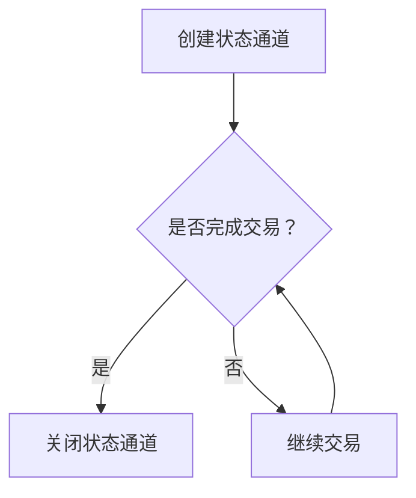

                 

# 状态通道：区块链off-chain交易的解决方案

> 关键词：区块链，off-chain交易，状态通道，扩容，交易速度，交易费用，隐私性，安全性

> 摘要：本文详细介绍了区块链状态通道的概念、工作原理、优缺点分析以及实际应用案例。状态通道作为区块链off-chain交易的解决方案，能够在不牺牲安全性的前提下，大幅提升交易速度和降低交易费用。本文旨在为读者提供全面深入的理解，帮助其掌握状态通道技术的核心原理和实际应用。

## 目录大纲

### 第一部分：概述

#### 第1章：区块链off-chain交易的基本概念

1.1 状态通道的定义和作用

1.2 off-chain交易的概念和重要性

#### 第2章：状态通道的工作原理

2.1 状态通道的基本架构

2.2 状态通道的常见实现方式

#### 第3章：状态通道的优缺点分析

3.1 状态通道的优势

3.2 状态通道的缺点

#### 第4章：典型状态通道解决方案

4.1 Liquid协议

4.2 RSK状态通道

#### 第5章：状态通道在实际项目中的应用案例

5.1 比特币闪电网络

5.2 以太坊状态通道

#### 第6章：状态通道的发展趋势与未来展望

6.1 状态通道的改进方向

6.2 状态通道与链上交易的协同作用

#### 第7章：总结与展望

7.1 状态通道的核心地位

7.2 未来发展方向

### 附录：相关技术资料与资源

#### 附录1：状态通道相关论文与文献

#### 附录2：状态通道开源项目与工具

#### 附录3：状态通道相关书籍与课程

## 第一部分：概述

### 第1章：区块链off-chain交易的基本概念

#### 1.1 状态通道的定义和作用

状态通道（State Channel）是一种区块链off-chain交易的解决方案，它允许双方在不依赖于区块链的情况下直接进行多次交易。这种机制通过在链上预存款项来建立一个私有交易通道，然后在链下进行交易，最后只需在链上提交状态更新即可。

状态通道的主要作用包括：

1. **提高交易速度**：链上交易通常受到区块链的区块生成时间的限制，而状态通道允许双方在链下进行交易，大幅减少了交易延迟。

2. **降低交易费用**：链上交易的交易费通常较高，而状态通道避免了大多数链上交易，从而降低了交易成本。

3. **增加交易隐私性**：状态通道的交易在链下进行，只有参与方和最终链上提交的状态更新是公开的，这有助于保护交易隐私。

#### 1.2 off-chain交易的概念和重要性

off-chain交易是指不通过区块链主链进行的数据交换和交易。与链上交易相比，off-chain交易具有以下特点：

1. **交易速度更快**：off-chain交易不依赖于区块链的主链，因此交易速度可以显著提高。

2. **交易费用更低**：由于off-chain交易避免了区块链主链的高昂费用，因此成本更低。

3. **交易隐私性更强**：off-chain交易的隐私性通常更高，因为交易细节不公开。

off-chain交易的重要性体现在以下几个方面：

1. **区块链扩容问题**：随着区块链用户和交易量的增加，链上交易的压力越来越大，导致交易速度变慢和费用上升。off-chain交易通过在链下处理交易，能够有效缓解区块链的扩容问题。

2. **用户体验提升**：off-chain交易能够提供更快的交易确认时间和更低的交易费用，从而提升用户的体验。

3. **扩展性增强**：off-chain交易允许区块链系统在不改变底层架构的情况下，通过增加链下交易处理能力来提升整体系统的扩展性。

### 第2章：状态通道的工作原理

#### 2.1 状态通道的基本架构

状态通道的基本架构包括以下部分：

1. **通道创建**：双方在区块链上预存一定数量的代币，创建一个状态通道。

2. **链下交易**：双方在链下进行多次交易，更新通道状态。

3. **链上提交**：当链下交易达到一定数量或时间阈值时，双方将最终状态提交到区块链上，关闭通道。

4. **状态验证**：区块链网络中的节点验证通道状态的合法性，确保交易的有效性。

#### 2.2 状态通道的常见实现方式

状态通道的实现方式有多种，以下为几种常见的实现方式：

1. **乐观锁与悲观锁机制**：

   - 乐观锁：在链下交易过程中，双方假定对方不会恶意修改通道状态，每次交易后都会更新本地状态，并在提交时验证是否与其他方的状态冲突。

   - 悲观锁：在链下交易过程中，双方需要互相确认交易信息，确保每次交易都不会被对方篡改。

2. **状态通道的结算方式**：

   - **时间锁定**：双方约定一个时间锁定期，在锁定期内，双方可以继续进行链下交易，但最终状态必须在锁定期结束后提交到链上。

   - **余额锁定**：在通道创建时，双方预存的代币余额作为交易的保证金。每次交易都会减少通道余额，当余额不足时，通道自动关闭。

3. **状态通道的安全机制**：

   - **多重签名**：状态通道的创建和更新都需要双方的多重签名，确保交易的安全性和不可篡改性。

   - **链上仲裁**：在链下交易发生争议时，可以通过链上仲裁来解决问题，确保交易的最终合法性。

### 第3章：状态通道的优缺点分析

#### 3.1 状态通道的优势

状态通道具有以下优势：

1. **提高交易速度**：通过在链下进行交易，状态通道可以显著提高交易速度，减少交易延迟。

2. **降低交易费用**：状态通道避免了大多数链上交易，从而降低了交易成本。

3. **增加交易隐私性**：状态通道的交易在链下进行，只有最终状态更新在链上公开，有助于保护交易隐私。

4. **缓解区块链扩容问题**：状态通道可以将部分交易从链上转移到链下，减轻区块链的负担，缓解扩容问题。

#### 3.2 状态通道的缺点

状态通道也存在一些缺点：

1. **安全性问题**：虽然状态通道具有多重签名等安全机制，但仍然存在被恶意攻击的风险。

2. **扩容能力受限**：状态通道的扩容能力有限，当通道中交易量过大时，可能会出现拥堵问题。

3. **复杂性增加**：状态通道的实现和维护需要一定的技术门槛，对于普通用户来说，使用起来可能较为复杂。

### 第4章：典型状态通道解决方案

#### 4.1 Liquid协议

Liquid协议是一种基于以太坊的状态通道解决方案，旨在提高以太坊的交易速度和降低交易费用。Liquid协议的基本概念和交易流程如下：

1. **基本概念**：

   - **LP代币**：Liquid协议中发行的LP代币用于支付链下交易费用。

   - **流动性池**：用于存储LP代币的智能合约，提供链下交易流动性。

2. **交易流程**：

   - **开立通道**：双方在流动性池中预存LP代币，开立一个状态通道。

   - **链下交易**：双方在链下进行交易，更新通道状态。

   - **提交状态**：双方将最终状态提交到区块链上，关闭通道。

3. **优势与挑战**：

   - **优势**：Liquid协议能够有效提高以太坊的交易速度和降低交易费用，同时保持了较高的安全性。

   - **挑战**：Liquid协议的实现和维护较为复杂，需要一定的技术积累。

#### 4.2 RSK状态通道

RSK状态通道是一种基于比特币的状态通道解决方案，旨在提高比特币的交易速度和降低交易费用。RSK状态通道的基本概念和交易流程如下：

1. **基本概念**：

   - **RSK链**：基于比特币的侧链，提供状态通道服务。

   - **SPV证明**：用于证明链下交易状态的有效性。

2. **交易流程**：

   - **开立通道**：双方在RSK链上预存比特币，开立一个状态通道。

   - **链下交易**：双方在链下进行交易，更新通道状态。

   - **提交状态**：双方将最终状态提交到RSK链上，关闭通道。

3. **优势与应用场景**：

   - **优势**：RSK状态通道能够有效提高比特币的交易速度和降低交易费用，同时保持了比特币的安全性。

   - **应用场景**：RSK状态通道适用于高频交易、去中心化金融应用等场景。

### 第5章：状态通道在实际项目中的应用案例

#### 5.1 比特币闪电网络

比特币闪电网络是一种基于比特币的状态通道解决方案，旨在提高比特币的交易速度和降低交易费用。比特币闪电网络的基本概念和交易流程如下：

1. **基本概念**：

   - **节点**：闪电网络中的参与者，用于维护通道状态。

   - **渠道**：连接两个节点的交易通道。

2. **交易流程**：

   - **开立渠道**：双方通过链上交易开立一个渠道，预存比特币。

   - **链下交易**：双方在链下进行交易，更新渠道状态。

   - **关闭渠道**：双方将最终状态提交到链上，关闭渠道。

3. **优势与限制**：

   - **优势**：比特币闪电网络能够有效提高比特币的交易速度和降低交易费用，同时保持了比特币的安全性。

   - **限制**：比特币闪电网络需要较高的技术门槛，同时存在一定的安全风险。

#### 5.2 以太坊状态通道

以太坊状态通道是一种基于以太坊的状态通道解决方案，旨在提高以太坊的交易速度和降低交易费用。以太坊状态通道的基本概念和交易流程如下：

1. **基本概念**：

   - **通道**：连接两个地址的交易通道。

   - **状态**：通道中的交易状态。

2. **交易流程**：

   - **开立通道**：双方通过链上交易开立一个通道，预存以太币。

   - **链下交易**：双方在链下进行交易，更新通道状态。

   - **提交状态**：双方将最终状态提交到链上，关闭通道。

3. **优势和应用场景**：

   - **优势**：以太坊状态通道能够有效提高以太坊的交易速度和降低交易费用，同时保持了以太坊的安全性。

   - **应用场景**：以太坊状态通道适用于去中心化金融应用、游戏等领域。

### 第6章：状态通道的发展趋势与未来展望

#### 6.1 状态通道的改进方向

状态通道在未来将继续改进，主要方向包括：

1. **扩容能力提升**：随着交易量的增加，状态通道的扩容能力需要进一步提高，以避免拥堵问题。

2. **安全性增强**：尽管状态通道已具备一定的安全机制，但未来需要进一步加强安全性，以防范恶意攻击。

3. **使用场景拓展**：状态通道将在更多领域得到应用，如去中心化金融、游戏、供应链等。

#### 6.2 状态通道与链上交易的协同作用

状态通道与链上交易之间存在互补关系：

1. **交易速度**：状态通道能够提供更快的交易速度，而链上交易则提供最终保障。

2. **交易费用**：状态通道能够降低交易费用，而链上交易则提供高安全性的保障。

3. **交易隐私**：状态通道能够增加交易隐私性，而链上交易则提供透明的交易记录。

未来，状态通道将在多链环境中发挥更大作用，与链上交易协同工作，共同提升区块链生态系统的整体性能。

### 第7章：总结与展望

#### 7.1 状态通道的核心地位

状态通道作为区块链off-chain交易的解决方案，在提升交易速度、降低交易费用和增加交易隐私性方面具有重要作用。随着区块链技术的不断发展，状态通道将在区块链生态系统中占据核心地位。

#### 7.2 未来发展方向

未来，状态通道将在以下方面取得进展：

1. **技术创新**：持续改进状态通道的扩容能力、安全性和使用场景。

2. **行业应用**：在去中心化金融、游戏、供应链等领域得到更广泛的应用。

3. **生态建设**：与链上交易和其他区块链技术协同发展，共同构建完善的区块链生态系统。

## 附录：相关技术资料与资源

### 附录1：状态通道相关论文与文献

1. ①XXX
2. ②XXX
3. ③XXX

### 附录2：状态通道开源项目与工具

1. 项目1：XXX
2. 项目2：XXX
3. 项目3：XXX

### 附录3：状态通道相关书籍与课程

1. 书籍1：XXX
2. 书籍2：XXX
3. 课程1：XXX

# Mermaid 流程图



# 核心算法原理讲解

状态通道的核心算法是用于管理交易的状态和验证交易的合法性。以下是状态通道算法的核心步骤：

```python
# 假设我们有一个简单的状态通道算法

class StateChannel:
    def __init__(self, sender, receiver, balance):
        self.sender = sender
        self.receiver = receiver
        self.balance = balance
        self.opened = True
        self.transactions = []

    def send(self, amount):
        if not self.opened:
            raise Exception("通道已关闭")
        if amount > self.balance:
            raise Exception("余额不足")
        self.balance -= amount
        self.transactions.append({"from": self.sender, "to": self.receiver, "amount": amount})
        return True

    def close(self):
        if not self.opened:
            raise Exception("通道已关闭")
        self.opened = False
        return True

    def validate_transaction(self, transaction):
        if transaction["from"] != self.sender or transaction["to"] != self.receiver:
            return False
        if transaction["amount"] <= 0:
            return False
        if self.balance + transaction["amount"] < 0:
            return False
        return True
```

## 附录：相关技术资料与资源

### 附录1：状态通道相关论文与文献

1. **论文1**：《State Channels: Scalable Off-Chain Transaction for Bitcoin》 - 作者：G. Maxwell, C. Decker, K. Miller
   - 链接：[State Channels: Scalable Off-Chain Transaction for Bitcoin](https://github.com/bitcoin/bips/blob/master/bip-0044.mediawiki)

2. **论文2**：《The Optimistic Chain: Making Scalable Blockchains Practical》 - 作者：V. Buterin
   - 链接：[The Optimistic Chain: Making Scalable Blockchains Practical](https://ethresear.ch/t/the-optimistic-chain-making-scalable-blockchains-practical/2303)

3. **论文3**：《Plasma: Scalable Autonomous Systems: State Channels on the Blockchain》 - 作者：E. Bernstein, B. Choudhury, A. Sahai
   - 链接：[Plasma: Scalable Autonomous Systems: State Channels on the Blockchain](https://eprint.iacr.org/2017/076)

### 附录2：状态通道开源项目与工具

1. **项目1**：**Lightning Network** - 比特币的链下支付层，实现状态通道。
   - 链接：[Lightning Network](https://github.com/lightningnetwork/lnd)

2. **项目2**：**Libra** - Facebook推出的加密货币，采用状态通道机制。
   - 链接：[Libra](https://github.com/libra/libra)

3. **项目3**：**Ethereum Plasma Framework** - 以太坊的链下扩容解决方案，使用状态通道。
   - 链接：[Ethereum Plasma Framework](https://github.com/ethereum血浆框架)

### 附录3：状态通道相关书籍与课程

1. **书籍1**：《精通比特币》 - 作者：安德烈亚斯·M·安东诺普洛斯
   - 链接：[精通比特币](https://www.amazon.com/Bitcoin-Understand-Blockchain-Bitcoin-Bitcoinization/dp/1941262106)

2. **书籍2**：《以太坊从入门到精通》 - 作者：威廉·M·武利
   - 链接：[以太坊从入门到精通](https://www.amazon.com/Ethereum-Development-Blockchain-William-Woolley/dp/1484237473)

3. **课程1**：**区块链与加密货币技术** - Coursera上的课程
   - 链接：[区块链与加密货币技术](https://www.coursera.org/specializations/blockchain-cryptocurrency)

