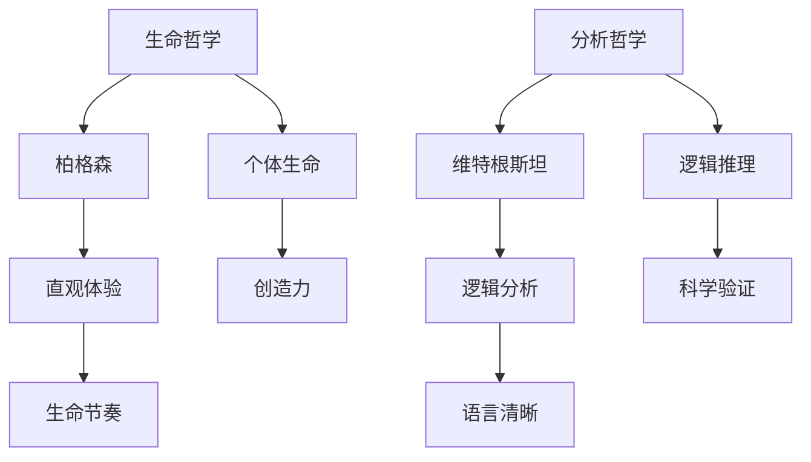

                 

### 文章标题

# 生命哲学与分析哲学：柏格森与维特根斯坦的方法论差异

### 关键词

- 生命哲学
- 分析哲学
- 柏格森
- 维特根斯坦
- 方法论
- 逻辑思考
- 科学研究

### 摘要

本文旨在探讨生命哲学与分析哲学两大流派中，代表人物柏格森与维特根斯坦的方法论差异。通过对两位哲学家的核心观点、方法论及影响的分析，揭示他们在哲学研究中的独特贡献与区别，进而思考这两种哲学方法论在现代科学研究中的应用前景。本文旨在为读者提供一种全新的视角，以更深刻地理解哲学方法论的多样性与互补性。

## 第一部分：引言

### 1.1 生命哲学与分析哲学的背景与意义

#### 1.1.1 生命哲学的起源与发展

生命哲学，又称生命主义哲学，起源于19世纪末和20世纪初，以法国哲学家亨利·柏格森为主要代表。柏格森认为，生命是一种不断进化的过程，充满了创造力与不确定性。他的生命哲学主张对生命的本质和动力进行深入探讨，强调个体生命的独特性和生命的内在节奏。

#### 1.1.2 分析哲学的起源与发展

分析哲学起源于20世纪初，主要代表人物是路德维希·维特根斯坦。分析哲学强调逻辑和语言的精确性，致力于通过分析语言和思维来揭示真理。维特根斯坦认为，哲学的任务不是去探讨抽象的形而上学问题，而是要澄清日常语言中的混乱和模糊。

#### 1.1.3 两种哲学方法论的差异与关联

生命哲学与分析哲学在研究方法和目标上存在显著差异。生命哲学关注生命的本质和内在节奏，强调个体生命的重要性；而分析哲学则强调逻辑和语言的清晰性，致力于消除思维和语言中的混乱。然而，这两种哲学方法并非完全对立，它们在一定程度上可以相互补充，共同推动哲学的发展。

### 1.2 文章结构概述

本文分为五个部分。第一部分为引言，介绍生命哲学与分析哲学的背景与意义；第二部分探讨柏格森的生命哲学；第三部分分析维特根斯坦的分析哲学；第四部分对比柏格森与维特根斯坦的方法论差异；第五部分总结与展望，探讨两种哲学方法论的意义与未来发展方向。

## 第二部分：柏格森的生命哲学

### 2.1 柏格森的生命哲学核心观点

#### 2.1.1 生命冲动与创造力

柏格森认为，生命冲动（或称生命意志）是生命的核心驱动力，它推动生命不断进化和发展。这种冲动具有不可预测性和创造力，是生命不断变化和创新的源泉。

#### 2.1.2 生命节奏与时间

柏格森将时间视为生命的基本形式，他认为时间是流动的、不可分割的，具有生命节奏。生命的节奏与时间息息相关，时间的变化影响着生命的运动和变化。

#### 2.1.3 生命哲学的方法论

柏格森的生命哲学方法论强调对生命的直观体验和直觉思考。他认为，通过深入体验生命的节奏和冲动，我们可以更好地理解生命的本质和规律。

### 2.2 柏格森的哲学理论与影响

#### 2.2.1 对哲学史的影响

柏格森的生命哲学对西方哲学史产生了深远的影响。他挑战了传统形而上学和理性主义的观念，为后来的存在主义和后现代主义提供了思想资源。

#### 2.2.2 对现代科学的影响

柏格森的生命哲学对现代科学产生了重要影响。他的观点促进了生物学、心理学和哲学等学科的交叉研究，丰富了科学理论体系。

#### 2.2.3 柏格森与生命科学的互动

柏格森的生命哲学与生命科学有着密切的联系。他的观点促进了生物学研究对生命本质和生命过程的探讨，为生命科学的发展提供了新的视角。

## 第三部分：维特根斯坦的分析哲学

### 3.1 维特根斯坦的分析哲学核心观点

#### 3.1.1 语言哲学

维特根斯坦认为，语言是思维和现实的桥梁，语言的清晰性和准确性对于哲学研究至关重要。他主张通过分析语言，揭示思维的本质和现实的结构。

#### 3.1.2 形式逻辑与数学基础

维特根斯坦强调形式逻辑和数学在哲学研究中的重要性。他认为，形式逻辑和数学能够提供清晰、准确的表达方式，有助于揭示哲学问题的本质。

#### 3.1.3 维特根斯坦的方法论

维特根斯坦的方法论强调语言的日常使用和哲学问题的澄清。他认为，哲学的任务不是提出新的理论，而是澄清日常语言中的混乱和模糊。

### 3.2 维特根斯坦的哲学理论与影响

#### 3.2.1 对哲学史的影响

维特根斯坦的分析哲学对西方哲学史产生了深远的影响。他挑战了传统形而上学和理性主义的观念，为后来的语言哲学和逻辑哲学提供了思想资源。

#### 3.2.2 对语言学研究的影响

维特根斯坦的分析哲学对语言学研究产生了重要影响。他的观点促进了语言哲学和语言分析的发展，为语言学提供了新的理论和方法。

#### 3.2.3 维特根斯坦与语言科学的互动

维特根斯坦的分析哲学与语言科学有着密切的联系。他的观点促进了语言学研究对语言本质和语言功能的探讨，为语言科学的发展提供了新的视角。

## 第四部分：柏格森与维特根斯坦的方法论差异

### 4.1 对话与批判

#### 4.1.1 柏格森对维特根斯坦的批评

柏格森批评维特根斯坦的分析哲学过于关注语言和逻辑，忽视了生命的本质和内在节奏。他认为，维特根斯坦的哲学方法过于抽象，无法真正揭示生命的真实面貌。

#### 4.1.2 维特根斯坦对柏格森的批评

维特根斯坦批评柏格森的生命哲学过于模糊和含糊，无法提供清晰的理论框架。他认为，柏格森的观点缺乏逻辑基础，难以进行科学的验证。

### 4.2 方法论的对比分析

#### 4.2.1 生命哲学与分析哲学的异同

生命哲学与分析哲学在研究方法和目标上存在显著差异。生命哲学强调直观体验和直觉思考，关注生命的本质和内在节奏；而分析哲学则强调逻辑和语言的精确性，致力于消除思维和语言中的混乱。

#### 4.2.2 两种方法论的应用场景

生命哲学与分析哲学在应用场景上也有所不同。生命哲学适用于探讨生命的本质、生命节奏和生命过程等问题；而分析哲学适用于澄清日常语言中的混乱、解决逻辑和数学问题。

#### 4.2.3 两种方法论的互补性

尽管生命哲学与分析哲学在方法和目标上存在差异，但它们在一定程度上可以相互补充。生命哲学可以为分析哲学提供对生命本质和内在节奏的深入理解，而分析哲学则可以为生命哲学提供清晰、准确的理论框架。

## 第五部分：总结与展望

### 5.1 柏格森与维特根斯坦方法论差异的意义

#### 5.1.1 对哲学研究的影响

柏格森与维特根斯坦的方法论差异对哲学研究产生了深远的影响。他们的观点挑战了传统形而上学和理性主义的观念，为哲学研究提供了新的视角和方法。

#### 5.1.2 对现代科学的影响

柏格森与维特根斯坦的方法论差异也对现代科学产生了重要影响。他们的观点促进了生物学、心理学和哲学等学科的交叉研究，推动了科学理论的发展。

#### 5.1.3 对未来哲学发展的启示

柏格森与维特根斯坦的方法论差异为未来哲学发展提供了启示。通过综合两种哲学方法论的优势，我们可以探索出更丰富、更深刻的哲学研究路径。

### 5.2 生命哲学与分析哲学的融合与拓展

#### 5.2.1 柏格森与维特根斯坦的潜在共识

尽管柏格森与维特根斯坦在方法论上存在差异，但他们都关注生命的本质和内在节奏，这为他们的哲学观点提供了潜在共识。

#### 5.2.2 两种哲学方法论的交叉应用

在未来的哲学研究中，我们可以尝试将生命哲学与分析哲学进行交叉应用，以探索更丰富的哲学问题。

#### 5.2.3 生命哲学与分析哲学的未来发展

随着科学技术的不断发展，生命哲学与分析哲学在未来将面临更多机遇和挑战。通过不断探索和创新，我们可以期待哲学研究取得更加丰硕的成果。

### 附录

#### 附录A：柏格森与维特根斯坦相关文献推荐

- 柏格森，《创造进化论》
- 维特根斯坦，《逻辑哲学论》
- 维特根斯坦，《哲学研究》

#### 附录B：哲学方法论学习资源

- 《西方哲学史》
- 《哲学概论》
- 《哲学的基本问题》

#### 附录C：柏格森与维特根斯坦方法论对比的Mermaid流程图

## 作者信息

- 作者：AI天才研究院/AI Genius Institute & 禅与计算机程序设计艺术 /Zen And The Art of Computer Programming

## 结语

通过对柏格森与维特根斯坦的方法论差异的探讨，我们不仅可以更深入地理解生命哲学与分析哲学的核心观点和特点，还可以思考这两种哲学方法论在现代科学研究中的应用前景。希望本文能为读者提供一种全新的视角，以更全面地认识和理解哲学方法论的多样性与互补性。在未来的哲学研究中，让我们继续探索与创新，共同推动哲学的发展。

