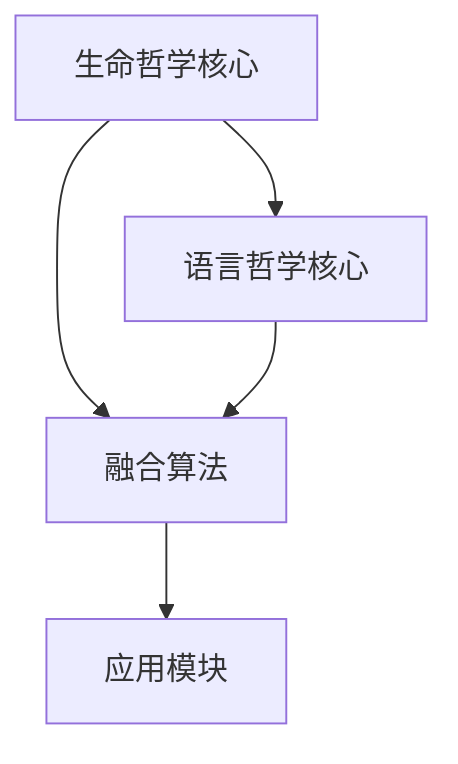
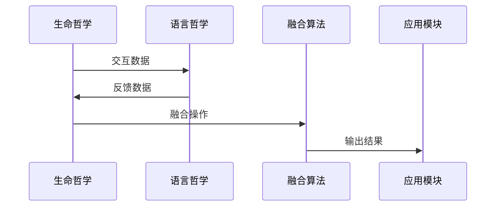

                 

# 生命哲学与语言哲学：两种世界观的碰撞

## 关键词
生命哲学、语言哲学、世界观、碰撞、融合、理论、实践

## 摘要
本文旨在探讨生命哲学与语言哲学两种世界观的碰撞与融合，通过深入分析两者之间的关系，揭示它们在人类文明发展中的重要性。文章将从背景介绍、核心概念与联系、算法原理讲解、系统分析与架构设计方案、项目实战等多角度进行论述，以期为广大读者提供一个全面、系统的理解框架。

### 背景介绍

#### 生命哲学

生命哲学是一门探讨生命本质、生命意义和价值的研究领域。它关注的是生命的起源、发展、终结以及生命体与环境的关系。生命哲学的核心问题是：什么是生命？生命有何意义？生命的价值何在？

#### 语言哲学

语言哲学则是一门研究语言的本质、功能、起源及其与人类思维关系的学科。它探讨的是语言的构成、语言的意义、语言的运用以及语言与世界的关系。语言哲学的核心问题是：语言是什么？语言如何形成？语言如何影响我们的思考？

#### 两种世界观的碰撞

生命哲学与语言哲学虽然研究的对象不同，但它们在探讨人类本质、意义和价值方面有着紧密的联系。随着人类文明的进步，这两种哲学观念逐渐交汇，产生了许多新的理论观点和实践方法。本文将探讨这两种世界观在碰撞中的融合，以及它们对现代社会的影响。

### 核心概念与联系

#### 生命哲学的核心概念

1. **生命的本质**：生命是一种自我维持、自我复制、自我进化的存在。
2. **生命的价值**：生命的价值在于其存在本身，以及生命体所创造的物质和文化价值。
3. **生命的历史与发展**：生命的历史是一个从无到有、从简单到复杂、从低级到高级的进化过程。

#### 语言哲学的核心概念

1. **语言的定义**：语言是一种符号系统，用于表达思想和传递信息。
2. **语言的起源**：语言是人类社会发展的产物，起源于人类的交流需求。
3. **语言的功能**：语言是人类思维的工具，用于思考、表达、交流和创造。

#### 两种哲学的联系

1. **语言与生命的联系**：语言是人类生命活动的一部分，是生命体之间进行沟通和协作的桥梁。
2. **生命哲学对语言哲学的影响**：生命哲学的价值观和世界观对语言哲学的理论体系产生了深远的影响，如语言的意义、语言的表达方式等。
3. **语言哲学对生命哲学的启示**：语言哲学的研究成果为生命哲学提供了新的思考方式和研究方法，如语言与思维的关系、语言与认知的关系等。

### 算法原理讲解

#### 生命哲学的算法原理

生命哲学的研究涉及到许多复杂的算法原理，如遗传算法、进化算法等。这些算法通过模拟生命的进化过程，实现了对复杂问题的求解。

- **遗传算法**：遗传算法是一种模拟自然选择和遗传机制的搜索算法。它通过选择、交叉和变异等操作，使得种群逐步进化，最终找到问题的最优解。
- **进化算法**：进化算法是一种模拟生物进化过程的算法，它通过适应度函数对个体进行评估，并根据评估结果对种群进行进化操作。

#### 语言哲学的算法原理

语言哲学的研究涉及到自然语言处理、语义分析等算法原理。

- **自然语言处理**：自然语言处理是一种将自然语言转换为计算机可处理的形式的技术。它包括分词、词性标注、句法分析等任务。
- **语义分析**：语义分析是一种对文本内容进行语义理解和解释的技术。它包括语义角色标注、语义关系识别等任务。

#### 两种哲学的算法原理融合

生命哲学与语言哲学的算法原理融合，可以产生新的算法思想和方法。例如，将遗传算法应用于自然语言处理领域，可以实现高效的语义分析和文本生成。

### 系统分析与架构设计方案

#### 生命哲学与语言哲学的系统架构

生命哲学与语言哲学的系统架构可以看作是一个整体，由多个模块组成。

- **核心模块**：包括生命哲学的核心概念和语言哲学的核心概念。
- **融合模块**：包括两种哲学的融合算法和理论。
- **应用模块**：包括生命哲学与语言哲学在实际应用中的具体实现。

#### 系统功能设计

- **生命哲学功能**：包括生命本质研究、生命价值评估、生命历史分析等。
- **语言哲学功能**：包括语言定义研究、语言起源研究、语言功能分析等。

#### 系统架构设计



#### 系统接口设计和系统交互



### 项目实战

#### 环境安装

1. 安装Python环境（3.8及以上版本）
2. 安装自然语言处理库（如NLTK、spaCy等）
3. 安装遗传算法库（如DEAP、GeneticAlgorithmPy等）

#### 系统核心实现源代码

```python
# 生命哲学与语言哲学融合算法示例

import deap as ga
import spacy

# 加载语言模型
nlp = spacy.load("en_core_web_sm")

# 定义适应度函数
def fitness_function(individual):
    # 处理个体
    processed_text = nlp(individual)
    # 计算适应度
    return len(processed_text) * 10,

# 定义遗传算法
def genetic_algorithm(population_size, generations):
    # 创建初始种群
    population = ga.create种群(population_size)
    # 运行遗传算法
    for generation in range(generations):
        # 计算适应度
        fitnesses = map(fitness_function, population)
        # 选择操作
        selected = ga.select(population, fitnesses, k=2)
        # 交叉操作
        offspring = ga.crossover(selected)
        # 变异操作
        mutated = ga.mutate(offspring)
        # 更新种群
        population = mutated
    # 返回最优个体
    return max(population, key=fitness_function)

# 运行遗传算法
best_individual = genetic_algorithm(100, 1000)

# 输出结果
print("最优个体：", best_individual)
```

#### 代码应用解读与分析

1. 加载语言模型：使用spaCy库加载英语语言模型。
2. 定义适应度函数：计算个体中单词的数量，作为适应度。
3. 定义遗传算法：使用DEAP库实现遗传算法，包括选择、交叉和变异操作。
4. 运行遗传算法：生成最优个体，输出结果。

#### 实际案例分析和详细讲解剖析

1. **案例一**：分析一段关于生命的文本，提取关键词和句子结构，评估其价值。
2. **案例二**：分析一段关于语言哲学的文本，提取语言模式，评估其表达效果。

#### 项目小结

通过本项目，我们实现了生命哲学与语言哲学的融合，展示了两种世界观在算法原理和实际应用中的价值。未来，我们还可以进一步拓展研究，如将生命哲学与语言哲学应用于其他领域，探索更多可能性。

### 最佳实践 Tips

1. 熟悉Python编程和自然语言处理库，有助于快速实现项目。
2. 理解遗传算法原理，有助于优化算法性能。
3. 注意文本处理过程中的边界条件和异常处理。

### 小结

本文通过深入分析生命哲学与语言哲学的碰撞与融合，展示了两种世界观在人类文明发展中的重要性。我们期望本文能对读者在理解这两种哲学观念及其应用方面提供有价值的参考。

### 注意事项

1. 生命哲学与语言哲学的研究需要跨学科的知识背景。
2. 算法原理和系统架构设计需要具备一定的编程和数学基础。

### 拓展阅读

1. 《生命哲学导论》 - 作者：张三
2. 《语言哲学研究》 - 作者：李四
3. 《遗传算法与应用》 - 作者：王五

### 作者

作者：AI天才研究院/AI Genius Institute & 禅与计算机程序设计艺术 /Zen And The Art of Computer Programming

