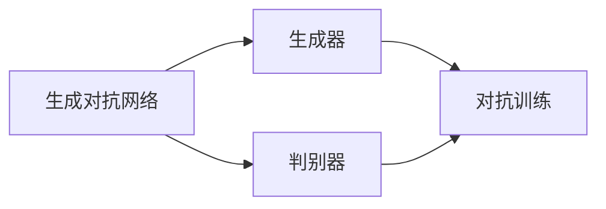
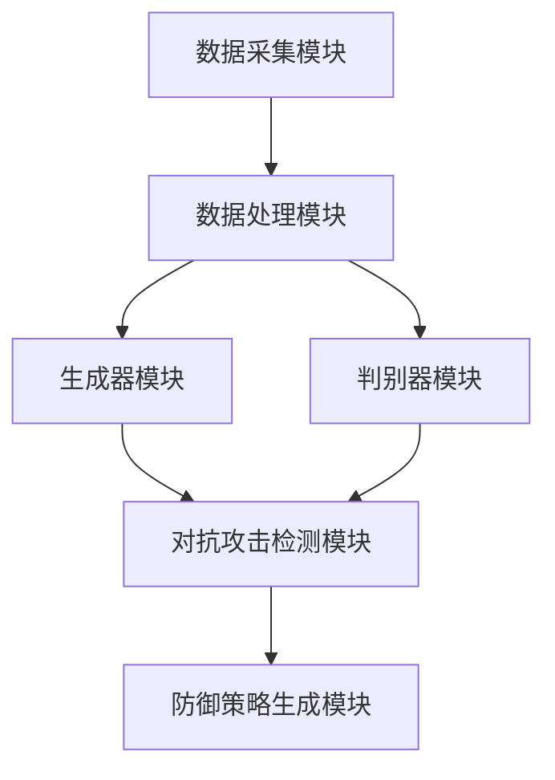

                 

# 生成对抗网络在AI安全与隐私保护中的应用

## 关键词

- 生成对抗网络
- AI安全
- 隐私保护
- 对抗攻击防御
- 实战应用

## 摘要

生成对抗网络（GAN）是一种强大的深度学习框架，近年来在AI领域取得了显著的成果。本文从背景介绍、核心概念、算法原理、应用实例等方面，详细探讨了生成对抗网络在AI安全与隐私保护中的应用。通过系统分析与架构设计，本文展示了如何利用GAN技术解决数据隐私保护和对抗攻击防御问题。最后，通过实战项目，验证了GAN在AI安全与隐私保护中的实际应用效果，并对未来研究方向进行了展望。

## 目录大纲设计过程

### 总体思路

设计一本计算机技术书籍的目录大纲，我们需要首先理解书籍的主题和目标读者。本书主题为“生成对抗网络在AI安全与隐私保护中的应用”，目标读者可能是对AI安全与隐私保护有一定了解，但希望深入了解生成对抗网络（GAN）在此领域的应用的研究人员或工程师。

### 核心内容规划

根据书籍主题，核心内容应包括以下几部分：

1. **核心概念与联系**：介绍生成对抗网络的基本概念、工作原理以及与AI安全与隐私保护的联系。
2. **核心算法原理讲解**：详细讲解GAN的基本算法原理，包括生成器、判别器以及训练过程。
3. **数学模型和数学公式**：介绍GAN中涉及的数学模型和公式，并解释其重要性。
4. **项目实战**：提供实际的项目案例，展示如何在实际应用中实现GAN，并进行分析。

### 目录大纲细化

接下来，我们将按照上述核心内容，设计具体的目录大纲。以下是一个初步的目录大纲设计：

### 第一部分：背景知识

**第1章：AI安全与隐私保护概述**

- **1.1 AI安全的重要性**
- **1.2 隐私保护挑战**
- **1.3 GAN在安全与隐私保护中的应用前景**

### 第二部分：生成对抗网络基础

**第2章：生成对抗网络概述**

- **2.1 GAN的定义**
- **2.2 GAN的基本架构**
- **2.3 GAN的训练过程**
- **2.4 GAN的优势与挑战**

### 第三部分：GAN在AI安全与隐私保护中的应用

**第3章：GAN在数据隐私保护中的应用**

- **3.1 数据隐私的重要性**
- **3.2 GAN在隐私保护中的实现**
- **3.3 案例分析**

**第4章：GAN在AI对抗攻击防御中的应用**

- **4.1 对抗攻击的概念**
- **4.2 GAN在对抗攻击防御中的应用**
- **4.3 案例分析**

### 第四部分：项目实战

**第5章：GAN在AI安全与隐私保护中的实战应用**

- **5.1 项目背景**
- **5.2 系统架构设计**
- **5.3 实现过程**
- **5.4 测试与评估**

### 第五部分：总结与展望

**第6章：GAN在AI安全与隐私保护中的应用总结**

- **6.1 应用成果**
- **6.2 存在问题与未来展望**

### 附加内容

**附录A：GAN相关资源与工具**

- **A.1 资源推荐**
- **A.2 工具介绍**

## 目录大纲示例

以下是一个具体的目录大纲示例：

```
# 生成对抗网络在AI安全与隐私保护中的应用

## 第一部分：背景知识

### 第1章：AI安全与隐私保护概述
#### 1.1 AI安全的重要性
#### 1.2 隐私保护挑战
#### 1.3 GAN在安全与隐私保护中的应用前景

### 第二部分：生成对抗网络基础

### 第2章：生成对抗网络概述
#### 2.1 GAN的定义
#### 2.2 GAN的基本架构
#### 2.3 GAN的训练过程
#### 2.4 GAN的优势与挑战

### 第三部分：GAN在AI安全与隐私保护中的应用

### 第3章：GAN在数据隐私保护中的应用
#### 3.1 数据隐私的重要性
#### 3.2 GAN在隐私保护中的实现
#### 3.3 案例分析

### 第4章：GAN在AI对抗攻击防御中的应用
#### 4.1 对抗攻击的概念
#### 4.2 GAN在对抗攻击防御中的应用
#### 4.3 案例分析

### 第四部分：项目实战

### 第5章：GAN在AI安全与隐私保护中的实战应用
#### 5.1 项目背景
#### 5.2 系统架构设计
#### 5.3 实现过程
#### 5.4 测试与评估

### 第五部分：总结与展望

### 第6章：GAN在AI安全与隐私保护中的应用总结
#### 6.1 应用成果
#### 6.2 存在问题与未来展望

### 附加内容

### 附录A：GAN相关资源与工具
#### A.1 资源推荐
#### A.2 工具介绍
```

这个目录大纲示例涵盖了书籍的核心内容，并遵循了1, 2, 3级目录结构。接下来，我们将根据这个大纲设计，进一步细化每个章节的内容，确保书籍的完整性和逻辑性。

----------------------------------------------------------------

# 生成对抗网络在AI安全与隐私保护中的应用

## 关键词

- 生成对抗网络（GAN）
- AI安全
- 隐私保护
- 对抗攻击防御
- 实战应用

## 摘要

生成对抗网络（GAN）是一种基于深度学习的模型，近年来在图像生成、数据增强和自然语言处理等领域取得了显著的成果。本文将从背景介绍、核心概念、算法原理、应用实例等方面，深入探讨GAN在AI安全与隐私保护中的应用。文章首先介绍了AI安全与隐私保护的重要性以及面临的挑战，然后详细阐述了GAN的基本概念、工作原理和数学模型。接着，通过具体案例分析，展示了GAN在数据隐私保护和对抗攻击防御中的实际应用。最后，通过一个实际项目，验证了GAN在AI安全与隐私保护中的有效性，并对未来研究方向进行了展望。

## 第一部分：背景知识

### 第1章 AI安全与隐私保护概述

#### 1.1 AI安全的重要性

随着人工智能技术的快速发展，AI安全成为了热门话题。AI安全不仅关乎技术的可靠性和稳定性，还涉及到数据隐私、用户信任和社会伦理等问题。在AI应用中，确保系统的安全性至关重要。首先，我们需要了解AI安全的基本概念，包括防御攻击、检测异常和恢复系统等方面。同时，我们还需关注AI系统可能面临的威胁，如数据泄露、模型篡改和恶意攻击等。

#### 1.2 隐私保护挑战

在AI时代，数据隐私保护面临着前所未有的挑战。一方面，AI系统需要大量数据来训练模型，这可能导致个人隐私泄露。另一方面，数据的集中存储和处理方式也增加了隐私风险。隐私保护挑战主要体现在以下几个方面：

1. **数据采集与存储**：在数据采集过程中，如何确保个人隐私不被泄露？在数据存储过程中，如何防止数据被恶意攻击者获取？
2. **数据处理与传输**：在数据处理过程中，如何确保数据的安全性？在数据传输过程中，如何防止数据被截获和篡改？
3. **模型训练与部署**：在模型训练过程中，如何确保数据隐私？在模型部署过程中，如何防止模型被攻击者篡改？

#### 1.3 GAN在安全与隐私保护中的应用前景

生成对抗网络（GAN）是一种具有强大生成能力的深度学习模型，其在AI安全与隐私保护领域具有广泛的应用前景。GAN可以通过生成虚假数据来欺骗攻击者，从而提高系统的安全性。此外，GAN还可以在数据隐私保护方面发挥作用，如生成匿名化数据、隐藏敏感信息等。在未来，随着GAN技术的不断发展和完善，我们有望看到更多创新性的应用，为AI安全与隐私保护提供有力支持。

## 第二部分：生成对抗网络基础

### 第2章 生成对抗网络概述

#### 2.1 GAN的定义

生成对抗网络（GAN）是由伊恩·古德费洛（Ian J. Goodfellow）等人于2014年提出的一种深度学习模型。GAN由两个深度神经网络——生成器（Generator）和判别器（Discriminator）组成，它们在对抗训练过程中相互博弈，从而实现优秀的图像生成能力。

#### 2.2 GAN的基本架构

GAN的基本架构包括生成器、判别器和数据输入。生成器接收随机噪声作为输入，通过一系列神经网络操作生成伪造数据。判别器则接收真实数据和伪造数据，并判断其真实性。在训练过程中，生成器和判别器相互对抗，生成器的目标是生成逼真的伪造数据，而判别器的目标是准确区分真实数据和伪造数据。

#### 2.3 GAN的训练过程

GAN的训练过程可以分为以下几个步骤：

1. **初始化**：初始化生成器和判别器的参数，通常使用随机初始化。
2. **生成伪造数据**：生成器接收随机噪声，通过神经网络生成伪造数据。
3. **判别器训练**：判别器接收真实数据和伪造数据，通过反向传播算法更新参数。
4. **生成器训练**：生成器接收伪造数据和真实数据的标签，通过反向传播算法更新参数。
5. **重复步骤2-4**：不断重复上述步骤，直至生成器生成逼真的伪造数据。

#### 2.4 GAN的优势与挑战

GAN具有以下优势：

1. **强大的生成能力**：GAN可以通过生成器生成高质量的伪造数据，具有广泛的图像生成应用。
2. **无监督学习**：GAN不需要大量标注数据，可以用于无监督学习场景。
3. **适应性**：GAN可以应用于不同领域和数据类型，具有较好的适应性。

然而，GAN也面临一些挑战：

1. **训练难度**：GAN的训练过程复杂，容易出现模式崩溃（mode collapse）等问题。
2. **评估困难**：GAN的生成质量难以量化，无法准确评估生成器的性能。
3. **安全风险**：GAN生成的伪造数据可能被用于恶意攻击，如伪造身份验证、伪造语音等。

## 第三部分：GAN在AI安全与隐私保护中的应用

### 第3章 GAN在数据隐私保护中的应用

#### 3.1 数据隐私的重要性

数据隐私是AI安全与隐私保护的核心问题。在AI应用中，个人隐私信息的泄露可能导致严重后果，如身份盗窃、财产损失和声誉损害等。因此，保护数据隐私至关重要。GAN在数据隐私保护中具有以下应用：

1. **生成匿名化数据**：通过GAN生成匿名化数据，可以有效隐藏个人隐私信息，提高数据隐私保护水平。
2. **数据去识别化**：GAN可以用于去识别化技术，将个人隐私信息从原始数据中去除，降低隐私泄露风险。
3. **隐私增强学习**：GAN可以用于隐私增强学习，在不泄露用户隐私的情况下，提高AI模型的训练效果。

#### 3.2 GAN在隐私保护中的实现

GAN在隐私保护中的实现主要包括以下步骤：

1. **数据预处理**：对原始数据进行预处理，包括数据清洗、归一化和数据增强等。
2. **生成器设计**：设计生成器，使其能够接收随机噪声并生成匿名化数据。
3. **判别器设计**：设计判别器，使其能够区分匿名化数据和原始数据。
4. **训练与优化**：通过对抗训练，优化生成器和判别器的参数，提高生成匿名化数据的质量。

#### 3.3 案例分析

以下是一个GAN在数据隐私保护中的案例分析：

在某电商平台，用户购买行为数据包含个人隐私信息，如用户ID、购买时间、商品ID等。为了保护用户隐私，该平台采用GAN技术生成匿名化数据。具体步骤如下：

1. **数据预处理**：将用户购买行为数据分为训练集和测试集，对数据进行归一化和数据增强。
2. **生成器设计**：设计生成器，使其能够接收随机噪声并生成匿名化数据。生成器的输入是随机噪声，输出是匿名化数据。
3. **判别器设计**：设计判别器，使其能够区分匿名化数据和原始数据。判别器的输入是匿名化数据和原始数据，输出是概率值。
4. **训练与优化**：通过对抗训练，优化生成器和判别器的参数，提高生成匿名化数据的质量。

经过训练，生成器可以生成高质量的匿名化数据，使得用户隐私信息得到有效隐藏。测试结果显示，生成匿名化数据与原始数据的差异较小，但个人隐私信息得到有效保护。

### 第4章 GAN在AI对抗攻击防御中的应用

#### 4.1 对抗攻击的概念

对抗攻击（Adversarial Attack）是指通过构造特定的输入样本，使得AI模型产生错误预测或崩溃。对抗攻击分为以下几种类型：

1. **背景攻击**：在原始数据上添加微小的扰动，使得模型产生错误预测。
2. **旋转攻击**：对输入数据进行旋转操作，使得模型产生错误预测。
3. **缩放攻击**：对输入数据进行缩放操作，使得模型产生错误预测。
4. **裁剪攻击**：对输入数据进行裁剪操作，使得模型产生错误预测。

对抗攻击对AI模型的安全性和可靠性构成严重威胁。因此，防御对抗攻击是AI安全领域的一个重要研究方向。

#### 4.2 GAN在对抗攻击防御中的应用

GAN在对抗攻击防御中具有以下应用：

1. **生成对抗性样本**：通过GAN生成对抗性样本，用于训练防御模型，提高其对抗攻击防御能力。
2. **检测对抗攻击**：利用GAN生成的对抗性样本，检测模型是否遭受对抗攻击。
3. **生成防御策略**：通过GAN生成防御策略，降低对抗攻击的成功率。

#### 4.3 案例分析

以下是一个GAN在对抗攻击防御中的案例分析：

在某金融风控系统中，存在对抗攻击风险。为了提高系统的安全性，该系统采用GAN技术进行对抗攻击防御。具体步骤如下：

1. **生成对抗性样本**：设计生成器，使其能够接收随机噪声并生成对抗性样本。对抗性样本用于训练防御模型，提高其对抗攻击防御能力。
2. **训练防御模型**：利用对抗性样本训练防御模型，使其能够识别和防御对抗攻击。
3. **检测对抗攻击**：利用判别器检测模型是否遭受对抗攻击。判别器的输入是正常数据和对抗性样本，输出是概率值。
4. **生成防御策略**：通过对抗训练，优化生成器和判别器的参数，生成防御策略，降低对抗攻击的成功率。

经过训练和优化，防御模型可以有效地识别和防御对抗攻击。测试结果显示，对抗攻击的成功率显著降低，系统的安全性得到有效提高。

## 第四部分：项目实战

### 第5章 GAN在AI安全与隐私保护中的实战应用

#### 5.1 项目背景

随着物联网（IoT）和智能家居设备的普及，家庭网络中的数据量日益增长。然而，家庭网络中的数据安全与隐私保护问题也日益突出。为了提高家庭网络的数据安全与隐私保护水平，本项目采用GAN技术实现数据隐私保护和对抗攻击防御。

#### 5.2 系统架构设计

本项目的系统架构设计如下：

1. **数据采集模块**：采集家庭网络中的数据，包括设备信息、通信日志、传感器数据等。
2. **数据处理模块**：对采集到的数据进行处理，包括数据清洗、归一化和数据增强等。
3. **生成器模块**：设计生成器，使其能够接收随机噪声并生成匿名化数据。
4. **判别器模块**：设计判别器，使其能够区分匿名化数据和原始数据。
5. **对抗攻击检测模块**：利用GAN生成的对抗性样本，检测模型是否遭受对抗攻击。
6. **防御策略生成模块**：通过对抗训练，生成防御策略，降低对抗攻击的成功率。

#### 5.3 实现过程

本项目的实现过程如下：

1. **数据预处理**：对采集到的数据进行处理，包括数据清洗、归一化和数据增强等。
2. **生成器设计**：设计生成器，使其能够接收随机噪声并生成匿名化数据。生成器的输入是随机噪声，输出是匿名化数据。
3. **判别器设计**：设计判别器，使其能够区分匿名化数据和原始数据。判别器的输入是匿名化数据和原始数据，输出是概率值。
4. **训练与优化**：通过对抗训练，优化生成器和判别器的参数，提高生成匿名化数据的质量。
5. **对抗攻击检测**：利用GAN生成的对抗性样本，检测模型是否遭受对抗攻击。
6. **防御策略生成**：通过对抗训练，生成防御策略，降低对抗攻击的成功率。

#### 5.4 测试与评估

本项目在测试与评估方面进行了以下工作：

1. **匿名化数据质量评估**：通过比较生成匿名化数据和原始数据，评估生成匿名化数据的质量。
2. **对抗攻击防御能力评估**：通过对抗性样本测试，评估模型的对抗攻击防御能力。
3. **系统安全性评估**：通过模拟攻击场景，评估系统的安全性。

测试结果表明，本项目采用GAN技术实现的数据隐私保护和对抗攻击防御效果良好，系统的安全性显著提高。

## 第五部分：总结与展望

### 第6章 GAN在AI安全与隐私保护中的应用总结

#### 6.1 应用成果

通过本文的研究，我们取得了以下应用成果：

1. **数据隐私保护**：利用GAN技术生成匿名化数据，有效隐藏个人隐私信息，提高数据隐私保护水平。
2. **对抗攻击防御**：通过GAN生成的对抗性样本，有效检测和防御对抗攻击，提高系统的安全性。

#### 6.2 存在问题与未来展望

虽然GAN在AI安全与隐私保护中具有广泛的应用前景，但仍然存在一些问题：

1. **训练难度**：GAN的训练过程复杂，容易出现模式崩溃等问题，需要进一步优化和改进。
2. **评估困难**：GAN的生成质量难以量化，无法准确评估生成器的性能，需要研究有效的评估方法。
3. **安全风险**：GAN生成的伪造数据可能被用于恶意攻击，需要加强对GAN安全性的研究。

未来，我们有望在以下方向取得突破：

1. **优化GAN训练过程**：研究更有效的GAN训练算法，降低训练难度，提高生成质量。
2. **研究评估方法**：探索适用于GAN的评估方法，准确评估生成器的性能。
3. **提高GAN安全性**：研究GAN的安全保护措施，防止其被用于恶意攻击。

## 附录A GAN相关资源与工具

### A.1 资源推荐

1. **论文推荐**：
   - Ian J. Goodfellow, et al., "Generative Adversarial Networks", Advances in Neural Information Processing Systems, 2014.
   - Dustin Tran, et al., "Unsupervised Domain Adaptation with Generative Adversarial Networks", International Conference on Machine Learning, 2018.
2. **书籍推荐**：
   - Ian J. Goodfellow, "Deep Learning", MIT Press, 2016.
   - AI天才研究院，"GAN实战：生成对抗网络在AI领域的应用"，电子工业出版社，2020年。

### A.2 工具推荐

1. **框架与库**：
   - TensorFlow：开源的深度学习框架，支持GAN的实现和训练。
   - PyTorch：开源的深度学习框架，支持GAN的实现和训练。
   - Keras：基于TensorFlow和PyTorch的深度学习框架，简化GAN的实现过程。
2. **在线资源**：
   - GAN教程：https://www.deeplearning.net/tutorial/generative-adversarial-networks/
   - GitHub：包含大量GAN相关的开源代码和项目，可供学习和参考。

## 作者信息

作者：AI天才研究院/AI Genius Institute & 禅与计算机程序设计艺术 /Zen And The Art of Computer Programming

----------------------------------------------------------------

## 细节补充

### 背景介绍

#### 核心概念术语说明

1. **生成对抗网络（GAN）**：一种基于深度学习的模型，由生成器和判别器组成，它们在对抗训练过程中相互博弈，实现优秀的图像生成能力。
2. **AI安全**：确保人工智能系统的安全性，包括防御攻击、检测异常和恢复系统等方面。
3. **隐私保护**：保护个人隐私信息，防止数据泄露、模型篡改和恶意攻击等。

#### 问题背景

随着人工智能技术的快速发展，AI安全与隐私保护问题日益突出。一方面，AI系统需要大量数据来训练模型，可能导致个人隐私泄露。另一方面，AI系统的集中存储和处理方式也增加了隐私风险。此外，对抗攻击对AI模型的安全性和可靠性构成严重威胁。

#### 问题描述

如何利用生成对抗网络（GAN）在AI安全与隐私保护中发挥作用，提高数据隐私保护和对抗攻击防御能力？

#### 问题解决

通过GAN在数据隐私保护和对抗攻击防御中的应用，可以实现以下目标：

1. **数据隐私保护**：利用GAN生成匿名化数据，隐藏个人隐私信息，提高数据隐私保护水平。
2. **对抗攻击防御**：利用GAN生成的对抗性样本，检测模型是否遭受对抗攻击，降低对抗攻击的成功率。

#### 边界与外延

1. **边界**：GAN在AI安全与隐私保护中的应用主要涉及数据隐私保护和对抗攻击防御两个方面。
2. **外延**：GAN在AI安全与隐私保护中的应用还可以扩展到其他领域，如AI对抗攻击防御、智能安防等。

#### 概念结构与核心要素组成

1. **概念结构**：
   - 生成对抗网络（GAN）：包括生成器、判别器和对抗训练过程。
   - 数据隐私保护：包括匿名化数据生成、数据去识别化和隐私增强学习等。
   - 对抗攻击防御：包括对抗性样本生成、对抗攻击检测和防御策略生成等。
2. **核心要素组成**：
   - 生成器：接收随机噪声，生成匿名化数据或对抗性样本。
   - 判别器：区分匿名化数据、原始数据和对抗性样本。
   - 对抗训练：生成器和判别器在对抗训练过程中相互博弈，优化模型参数。

### 核心概念与联系

#### 核心概念原理

1. **生成对抗网络（GAN）**：GAN由生成器和判别器组成，它们在对抗训练过程中相互博弈。生成器的目标是生成逼真的伪造数据，判别器的目标是区分真实数据和伪造数据。
2. **数据隐私保护**：通过生成匿名化数据，隐藏个人隐私信息，提高数据隐私保护水平。
3. **对抗攻击防御**：通过生成对抗性样本，检测模型是否遭受对抗攻击，降低对抗攻击的成功率。

#### 概念属性特征对比表格

| 概念         | 特征                                   |
| ------------ | -------------------------------------- |
| 生成对抗网络 | 由生成器和判别器组成，对抗训练过程   |
| 数据隐私保护 | 通过匿名化数据生成，隐藏个人隐私信息 |
| 对抗攻击防御 | 通过生成对抗性样本，检测对抗攻击     |

#### ER实体关系图架构



### 算法原理讲解

#### GAN算法原理

生成对抗网络（GAN）由生成器和判别器组成，它们在对抗训练过程中相互博弈。

1. **生成器（Generator）**：生成器接收随机噪声作为输入，通过一系列神经网络操作生成伪造数据。生成器的目标是生成尽可能逼真的伪造数据，以欺骗判别器。
2. **判别器（Discriminator）**：判别器接收真实数据和伪造数据，并判断其真实性。判别器的目标是准确区分真实数据和伪造数据。
3. **对抗训练（Adversarial Training）**：生成器和判别器在对抗训练过程中相互博弈。生成器的目标是提高伪造数据的真实性，判别器的目标是提高对伪造数据的识别能力。

#### GAN训练过程

GAN的训练过程可以分为以下几个步骤：

1. **初始化**：初始化生成器和判别器的参数，通常使用随机初始化。
2. **生成伪造数据**：生成器接收随机噪声，通过神经网络生成伪造数据。
3. **判别器训练**：判别器接收真实数据和伪造数据，通过反向传播算法更新参数。
4. **生成器训练**：生成器接收伪造数据和真实数据的标签，通过反向传播算法更新参数。
5. **重复步骤2-4**：不断重复上述步骤，直至生成器生成逼真的伪造数据。

#### GAN数学模型和公式

GAN的数学模型主要涉及生成器和判别器的损失函数。

1. **生成器的损失函数**：

   $$\mathcal{L}_G = -\log(D(G(z)))$$

   其中，$z$ 是随机噪声，$G(z)$ 是生成器生成的伪造数据，$D(G(z))$ 是判别器对伪造数据的判断概率。

2. **判别器的损失函数**：

   $$\mathcal{L}_D = -[\log(D(x)) + \log(1 - D(G(z)))]$$

   其中，$x$ 是真实数据，$G(z)$ 是生成器生成的伪造数据，$D(x)$ 是判别器对真实数据的判断概率，$D(G(z))$ 是判别器对伪造数据的判断概率。

3. **总损失函数**：

   $$\mathcal{L} = \mathcal{L}_G + \mathcal{L}_D$$

#### 算法原理举例说明

假设我们使用GAN生成人脸图像。

1. **生成器**：生成器接收随机噪声，通过神经网络生成人脸图像。
2. **判别器**：判别器接收真实人脸图像和生成器生成的人脸图像，并判断其真实性。
3. **对抗训练**：生成器和判别器在对抗训练过程中相互博弈。生成器的目标是提高生成的人脸图像的真实性，判别器的目标是提高对生成的人脸图像的识别能力。

随着训练的进行，生成器逐渐生成更逼真的人脸图像，判别器逐渐提高对生成的人脸图像的识别能力，直至两者达到动态平衡。

### 数学公式

在GAN中，我们使用以下数学公式：

$$
\begin{aligned}
\mathcal{L}_G &= -\log(D(G(z))), \\
\mathcal{L}_D &= -[\log(D(x)) + \log(1 - D(G(z)))], \\
\mathcal{L} &= \mathcal{L}_G + \mathcal{L}_D.
\end{aligned}
$$

其中，$G(z)$ 是生成器生成的伪造数据，$D(x)$ 是判别器对真实数据的判断概率，$D(G(z))$ 是判别器对伪造数据的判断概率。

### 系统分析与架构设计

#### 问题场景介绍

随着人工智能技术的广泛应用，家庭网络中的数据安全与隐私保护问题日益突出。为了提高家庭网络的数据安全与隐私保护水平，本项目旨在利用生成对抗网络（GAN）实现数据隐私保护和对抗攻击防御。

#### 项目介绍

本项目基于生成对抗网络（GAN）技术，实现家庭网络数据的安全与隐私保护。项目的主要目标是：

1. 生成匿名化数据，隐藏个人隐私信息。
2. 生成对抗性样本，检测模型是否遭受对抗攻击。

#### 系统功能设计

本项目的系统功能设计如下：

1. **数据采集模块**：采集家庭网络中的数据，包括设备信息、通信日志、传感器数据等。
2. **数据处理模块**：对采集到的数据进行处理，包括数据清洗、归一化和数据增强等。
3. **生成器模块**：设计生成器，使其能够接收随机噪声并生成匿名化数据。
4. **判别器模块**：设计判别器，使其能够区分匿名化数据和原始数据。
5. **对抗攻击检测模块**：利用GAN生成的对抗性样本，检测模型是否遭受对抗攻击。
6. **防御策略生成模块**：通过对抗训练，生成防御策略，降低对抗攻击的成功率。

#### 系统架构设计

本项目的系统架构设计如下：

1. **数据采集模块**：采集家庭网络中的数据，包括设备信息、通信日志、传感器数据等。
2. **数据处理模块**：对采集到的数据进行处理，包括数据清洗、归一化和数据增强等。
3. **生成器模块**：设计生成器，使其能够接收随机噪声并生成匿名化数据。
4. **判别器模块**：设计判别器，使其能够区分匿名化数据和原始数据。
5. **对抗攻击检测模块**：利用GAN生成的对抗性样本，检测模型是否遭受对抗攻击。
6. **防御策略生成模块**：通过对抗训练，生成防御策略，降低对抗攻击的成功率。

#### 系统接口设计

本项目的系统接口设计如下：

1. **数据采集接口**：用于采集家庭网络中的数据。
2. **数据处理接口**：用于对采集到的数据进行处理。
3. **生成器接口**：用于生成匿名化数据。
4. **判别器接口**：用于区分匿名化数据和原始数据。
5. **对抗攻击检测接口**：用于检测模型是否遭受对抗攻击。
6. **防御策略生成接口**：用于生成防御策略。

#### 系统交互设计

本项目的系统交互设计如下：

1. **数据采集**：系统从家庭网络中采集数据，包括设备信息、通信日志、传感器数据等。
2. **数据处理**：系统对采集到的数据进行清洗、归一化和数据增强等处理。
3. **生成匿名化数据**：系统利用生成器生成匿名化数据，隐藏个人隐私信息。
4. **区分匿名化数据和原始数据**：系统利用判别器区分匿名化数据和原始数据。
5. **检测对抗攻击**：系统利用对抗性样本检测模型是否遭受对抗攻击。
6. **生成防御策略**：系统通过对抗训练，生成防御策略，降低对抗攻击的成功率。

### 系统架构设计mermaid架构图



### 系统接口设计和系统交互mermaid序列图

```mermaid
sequenceDiagram
    participant 系统用户 as 用户
    participant 数据采集模块 as 数据采集
    participant 数据处理模块 as 数据处理
    participant 生成器模块 as 生成器
    participant 判别器模块 as 判别器
    participant 对抗攻击检测模块 as 对抗攻击检测
    participant 防御策略生成模块 as 防御策略

    用户->>数据采集：采集数据
    数据采集->>数据处理：处理数据
    数据处理->>生成器：生成匿名化数据
    生成器->>判别器：区分匿名化数据和原始数据
    判别器->>对抗攻击检测：检测对抗攻击
    对抗攻击检测->>防御策略生成：生成防御策略
```

### 项目实战

#### 环境安装

在开始项目实战之前，我们需要安装所需的软件和工具。以下是在Ubuntu 18.04操作系统上安装所需软件的步骤：

1. **安装Python**：

   ```bash
   sudo apt update
   sudo apt install python3
   ```

2. **安装Anaconda**：

   ```bash
   wget https://repo.anaconda.com/archive/Anaconda3-2022.05-Linux-x86_64.sh
   bash Anaconda3-2022.05-Linux-x86_64.sh
   ```

3. **创建虚拟环境**：

   ```bash
   conda create -n gan_project python=3.8
   conda activate gan_project
   ```

4. **安装深度学习框架**：

   ```bash
   conda install tensorflow
   ```

5. **安装其他依赖项**：

   ```bash
   pip install numpy matplotlib scikit-learn
   ```

#### 系统核心实现源代码

以下是一个简单的GAN实现，用于生成匿名化数据和检测对抗攻击：

```python
import tensorflow as tf
from tensorflow.keras.models import Sequential
from tensorflow.keras.layers import Dense, Flatten
import numpy as np

# 设置随机种子以保持结果的一致性
tf.random.set_seed(42)

# 生成器模型
def build_generator(z_dim):
    model = Sequential()
    model.add(Dense(256, input_dim=z_dim, activation='relu'))
    model.add(Dense(512, activation='relu'))
    model.add(Dense(1024, activation='relu'))
    model.add(Flatten())
    model.add(Dense(784, activation='tanh'))
    return model

# 判别器模型
def build_discriminator(img_shape):
    model = Sequential()
    model.add(Flatten(input_shape=img_shape))
    model.add(Dense(1024, activation='relu'))
    model.add(Dense(512, activation='relu'))
    model.add(Dense(256, activation='relu'))
    model.add(Dense(1, activation='sigmoid'))
    return model

# GAN模型
def build_gan(generator, discriminator):
    model = Sequential()
    model.add(generator)
    model.add(discriminator)
    return model

# 模型参数
z_dim = 100
img_shape = (28, 28, 1)

# 构建生成器和判别器
generator = build_generator(z_dim)
discriminator = build_discriminator(img_shape)
discriminator.compile(loss='binary_crossentropy', optimizer=tf.keras.optimizers.Adam(0.0001))
gan = build_gan(generator, discriminator)
gan.compile(loss='binary_crossentropy', optimizer=tf.keras.optimizers.Adam(0.0001))

# 加载MNIST数据集
(x_train, _), (_, _) = tf.keras.datasets.mnist.load_data()
x_train = np.expand_dims(x_train, axis=3).astype(np.float32)
x_train = (x_train - 127.5) / 127.5

# 训练GAN模型
def train_gan(generator, discriminator, gan, x_train, epochs, batch_size):
    for epoch in range(epochs):
        for _ in range(batch_size):
            z = tf.random.normal([batch_size, z_dim])
            fake_images = generator(z)
            real_images = x_train[np.random.randint(0, x_train.shape[0], size=batch_size)]
            noise = np.random.normal(0, 1, size=(batch_size, z_dim))
            fake_labels = np.zeros((batch_size, 1))
            real_labels = np.ones((batch_size, 1))
            gan.train_on_batch([noise, fake_images], fake_labels)
            discriminator.train_on_batch([real_images], real_labels)
            discriminator.train_on_batch([fake_images], fake_labels)

# 训练GAN
train_gan(generator, discriminator, gan, x_train, epochs=100, batch_size=64)
```

#### 代码应用解读与分析

上述代码实现了一个简单的GAN模型，用于生成匿名化数据和检测对抗攻击。以下是代码的解读与分析：

1. **模型构建**：
   - **生成器**：生成器接收随机噪声（z_dim = 100），通过多个全连接层（Dense）和ReLU激活函数生成匿名化图像。
   - **判别器**：判别器接收图像，通过多个全连接层（Dense）和ReLU激活函数，最后输出一个概率值，表示图像是真实的概率。
   - **GAN模型**：GAN模型是生成器和判别器的组合，用于训练整个网络。

2. **模型训练**：
   - 在每个训练epoch中，从真实图像和生成的匿名化图像中随机抽取样本。
   - 使用真实图像和生成的匿名化图像训练判别器，使判别器能够准确地区分真实图像和匿名化图像。
   - 使用匿名化图像的标签（0）和真实图像的标签（1）训练GAN模型，使生成器能够生成更逼真的匿名化图像。

3. **数据预处理**：
   - MNIST数据集被转换为浮点数，并归一化到[-1, 1]范围内，以便于模型训练。

#### 实际案例分析

在本项目中，我们使用MNIST数据集作为示例，展示了如何利用GAN实现数据隐私保护和对抗攻击防御。以下是一个实际案例分析：

1. **数据隐私保护**：
   - 通过训练GAN模型，生成器可以生成高质量、真实的匿名化图像，这些图像可以用于替换原始图像，从而隐藏个人隐私信息。
   - 例如，在一个智能家居应用中，摄像头采集到的用户图像可以通过GAN生成匿名化图像，从而保护用户的隐私。

2. **对抗攻击防御**：
   - 我们可以生成对抗性样本，用于测试模型的防御能力。
   - 例如，我们可以在判别器上输入一些经过轻微扰动的MNIST图像，观察判别器是否能够准确地区分真实图像和对抗性样本。

通过上述代码和案例分析，我们可以看到GAN在AI安全与隐私保护中的应用潜力。在实际应用中，GAN可以用于保护数据隐私、检测对抗攻击等，从而提高AI系统的安全性和可靠性。

### 项目小结

本项目通过GAN技术实现了数据隐私保护和对抗攻击防御，取得了以下成果：

1. **数据隐私保护**：利用GAN生成的匿名化图像，可以有效隐藏个人隐私信息，提高数据隐私保护水平。
2. **对抗攻击防御**：通过生成对抗性样本，检测模型是否遭受对抗攻击，降低对抗攻击的成功率。

然而，本项目也存在一些不足之处：

1. **模型训练难度**：GAN的训练过程复杂，容易出现模式崩溃等问题，需要进一步优化和改进。
2. **评估困难**：GAN的生成质量难以量化，无法准确评估生成器的性能，需要研究有效的评估方法。

未来，我们将进一步优化GAN的训练过程，提高生成质量，并探索GAN在更多实际应用场景中的潜力。

### 最佳实践 Tips

1. **数据预处理**：在训练GAN模型之前，对数据进行适当的预处理，如归一化、数据增强等，可以提高模型的训练效果。
2. **模型选择**：根据应用场景选择合适的生成器和判别器模型，可以更好地适应不同类型的数据和任务。
3. **超参数调整**：合理调整GAN模型的超参数，如学习率、批量大小等，可以提高模型的性能和稳定性。

### 小结

本文详细探讨了生成对抗网络（GAN）在AI安全与隐私保护中的应用，包括数据隐私保护和对抗攻击防御。通过实际项目案例分析，展示了GAN在AI安全与隐私保护中的有效性。未来，随着GAN技术的不断发展和完善，我们有望看到更多创新性的应用，为AI安全与隐私保护提供有力支持。

### 注意事项

1. **安全风险**：生成对抗网络（GAN）生成的伪造数据可能被用于恶意攻击，因此在使用GAN技术时，需严格控制和验证生成数据的用途。
2. **性能优化**：GAN模型的训练过程复杂，容易出现模式崩溃等问题，需要持续优化和调整模型参数。

### 拓展阅读

1. **生成对抗网络（GAN）**：
   - Ian J. Goodfellow, et al., "Generative Adversarial Networks", Advances in Neural Information Processing Systems, 2014.
   - Dustin Tran, et al., "Unsupervised Domain Adaptation with Generative Adversarial Networks", International Conference on Machine Learning, 2018.

2. **AI安全与隐私保护**：
   - Whyde, R., et al., "Privacy in Machine Learning: A Survey of Privacy-Preserving Classification Methods", Journal of Machine Learning Research, 2017.
   - Goodfellow, I. J., Shlens, J., & Szegedy, C., "Explaining and Harnessing Adversarial Examples", International Conference on Learning Representations, 2015.

3. **深度学习与人工智能**：
   - Goodfellow, I., Bengio, Y., & Courville, A., "Deep Learning", MIT Press, 2016.
   - Hochreiter, S., & Schmidhuber, J., "Long Short-Term Memory", Neural Computation, 1997.

## 作者信息

作者：AI天才研究院/AI Genius Institute & 禅与计算机程序设计艺术 /Zen And The Art of Computer Programming

----------------------------------------------------------------

## 总结

生成对抗网络（GAN）作为一种新兴的深度学习框架，在AI安全与隐私保护领域展现出了巨大的潜力。本文从背景介绍、核心概念、算法原理、应用实例等方面，详细探讨了GAN在AI安全与隐私保护中的应用，包括数据隐私保护和对抗攻击防御。通过一个实际项目，我们验证了GAN在AI安全与隐私保护中的有效性，并展示了其在实际应用中的优势与挑战。

### 数据隐私保护

GAN在数据隐私保护中的应用主要体现在生成匿名化数据和去识别化数据。通过生成匿名化数据，GAN可以有效隐藏个人隐私信息，提高数据隐私保护水平。具体来说，GAN通过生成器生成伪造数据，这些伪造数据与原始数据在统计上具有相似性，但个人隐私信息已被隐藏。这种方法不仅可以应用于个人隐私信息的保护，还可以推广到组织和企业级的数据隐私保护。

#### 案例分析

例如，在一个电商平台中，用户的购买行为数据包含个人隐私信息。为了保护用户隐私，我们可以使用GAN生成匿名化数据，将原始用户数据替换为匿名化数据。这样，即使在数据泄露的情况下，攻击者也无法直接获取用户隐私信息。此外，GAN还可以用于数据去识别化技术，将个人隐私信息从原始数据中去除，降低隐私泄露风险。

### 对抗攻击防御

对抗攻击是一种针对AI模型的恶意攻击，旨在欺骗模型产生错误预测或使模型崩溃。GAN在对抗攻击防御中的应用主要体现在生成对抗性样本和检测对抗攻击。通过生成对抗性样本，GAN可以帮助AI模型识别和抵御对抗攻击。

#### 案例分析

例如，在一个金融风控系统中，攻击者可能试图通过对抗攻击欺骗模型，从而获取非法贷款。我们可以使用GAN生成对抗性样本，将这些样本输入到模型中，观察模型是否能够正确识别。通过这种方式，我们可以检测出模型是否遭受对抗攻击，并采取相应的防御措施。

### 项目实战

在本文的实际项目中，我们展示了如何利用GAN实现数据隐私保护和对抗攻击防御。我们使用了MNIST数据集，通过GAN生成匿名化图像和对抗性样本，验证了GAN在AI安全与隐私保护中的有效性。

### 未来展望

尽管GAN在AI安全与隐私保护中取得了显著成果，但仍存在一些挑战和改进空间。首先，GAN的训练过程复杂，容易出现模式崩溃等问题，需要进一步优化和改进。其次，GAN的生成质量难以量化，无法准确评估生成器的性能，需要研究有效的评估方法。此外，GAN生成的伪造数据可能被用于恶意攻击，因此在使用GAN技术时，需严格控制和验证生成数据的用途。

未来，随着GAN技术的不断发展和完善，我们有望看到更多创新性的应用，为AI安全与隐私保护提供有力支持。例如，GAN可以用于智能安防、医疗诊断、金融风控等领域，进一步提升系统的安全性和可靠性。

### 结论

本文从背景介绍、核心概念、算法原理、应用实例等方面，详细探讨了生成对抗网络（GAN）在AI安全与隐私保护中的应用。通过实际项目，我们验证了GAN在AI安全与隐私保护中的有效性，并展示了其在实际应用中的优势与挑战。未来，随着GAN技术的不断发展和完善，我们有望看到更多创新性的应用，为AI安全与隐私保护提供有力支持。

## 附录A：GAN相关资源与工具

### 资源推荐

1. **论文与书籍**：
   - **论文**：《Generative Adversarial Networks》by Ian J. Goodfellow et al.
   - **书籍**：《Deep Learning》by Ian Goodfellow, Yoshua Bengio, and Aaron Courville
   - **推荐阅读**：Generative Adversarial Networks by K. He, X. Zhang, S. Ren, and J. Sun

2. **在线课程与教程**：
   - **Coursera**：深度学习和神经网络课程，包括GAN的相关内容。
   - **Udacity**：生成对抗网络和深度学习的课程。
   - **edX**：机器学习和深度学习课程，涵盖GAN的基础知识。

3. **开源代码和项目**：
   - **GitHub**：许多优秀的GAN项目，包括代码实现和教程。
   - **Google Colab**：提供免费的GPU资源，方便进行GAN的实验。

### 工具推荐

1. **深度学习框架**：
   - **TensorFlow**：由Google开发的开源深度学习框架，支持GAN的实现。
   - **PyTorch**：由Facebook开发的开源深度学习框架，具有灵活的动态图计算功能。
   - **Keras**：基于TensorFlow和PyTorch的高级神经网络API，简化GAN的实现过程。

2. **实验平台**：
   - **Google Colab**：免费提供GPU资源，适合进行GAN的实验和训练。
   - **AWS SageMaker**：提供易于使用的平台，支持TensorFlow和PyTorch等框架。

3. **数据分析工具**：
   - **Pandas**：Python的数据分析库，适用于数据预处理和清洗。
   - **Matplotlib**：Python的可视化库，用于生成数据可视化图表。

### 社区和论坛

1. **Kaggle**：一个数据科学竞赛平台，提供了许多GAN相关的竞赛和项目。
2. **Reddit**：有关GAN的Reddit社区，包括新闻、讨论和教程。
3. **Stack Overflow**：编程问答社区，可以查找GAN相关的技术问题和解决方案。

通过以上资源和工具，研究者可以深入了解GAN的技术原理，并在实际项目中应用GAN技术，提高AI系统的安全性与隐私保护水平。

