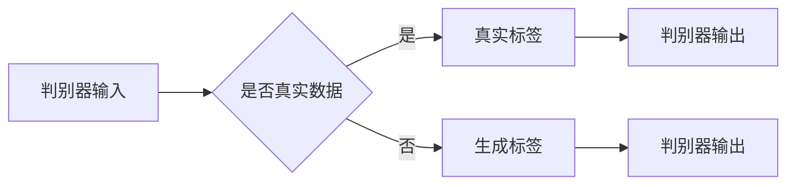
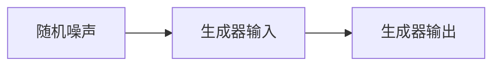
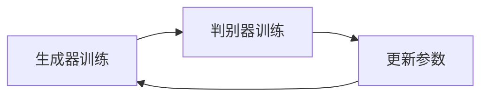
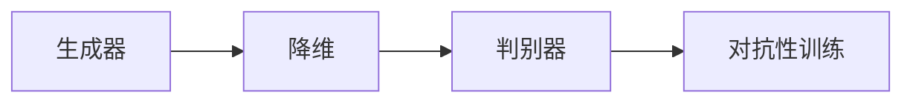
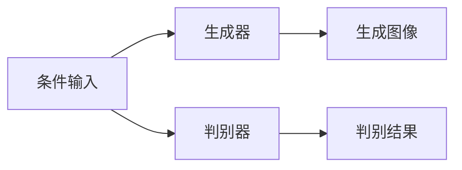
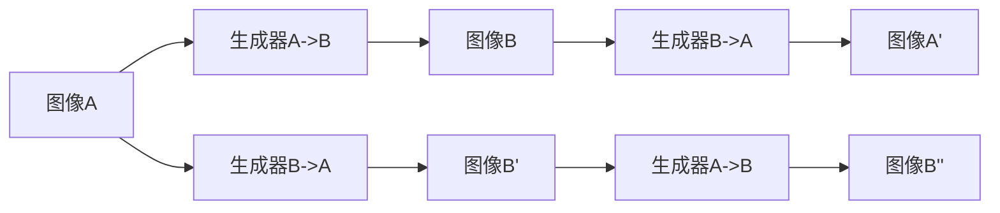
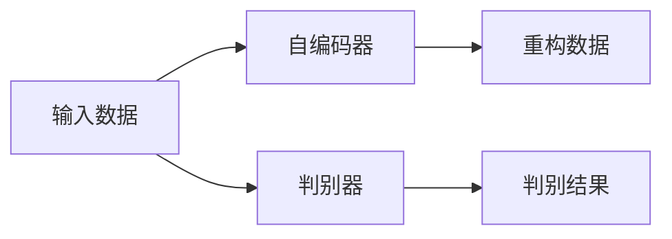

                 


### 文章标题：生成对抗网络（GAN）在图像生成中的应用

### 关键词：生成对抗网络，图像生成，人工智能，机器学习，算法原理

### 摘要：
本文将深入探讨生成对抗网络（GAN）在图像生成领域的应用。首先，我们将介绍GAN的定义、核心原理以及其基本架构。接着，我们将分析GAN在图像生成中的具体应用，如图像修复、超分辨率和图像风格转换等。随后，我们将讨论GAN的性能评估和高级应用技术。最后，我们将通过实际项目实战来展示GAN在图像生成中的应用，并展望GAN的未来发展趋势。

### 目录大纲

#### 第一部分：生成对抗网络（GAN）概述

##### 1.1 GAN的定义与核心原理
###### 1.1.1 GAN的历史背景
###### 1.1.2 GAN的组成部分
###### 1.1.3 GAN的优势与局限性

##### 1.2 GAN的基本架构
###### 1.2.1 判别器（Discriminator）的构建
###### 1.2.2 生成器（Generator）的构建
###### 1.2.3 GAN的训练过程

##### 1.3 GAN的核心概念与联系
###### 1.3.1 对抗性训练
###### 1.3.2 标签平滑技术
###### 1.3.3 降维技术

#### 第二部分：GAN在图像生成中的应用

##### 2.1 图像生成的基础算法
###### 2.1.1 基于GAN的图像生成流程
###### 2.1.2 图像生成质量评价标准
###### 2.1.3 图像生成的挑战与应对策略

##### 2.2 实际案例与应用场景
###### 2.2.1 图像修复与超分辨率
###### 2.2.2 图像风格转换
###### 2.2.3 图像合成与伪造

##### 2.3 高级GAN应用技术
###### 2.3.1 条件GAN（cGAN）
###### 2.3.2 循环一致GAN（CycleGAN）
###### 2.3.3 自编码器GAN（aGAN）

##### 2.4 图像生成性能评估
###### 2.4.1 生成图像质量评价
###### 2.4.2 训练过程稳定性分析
###### 2.4.3 生成模型的可解释性

#### 第三部分：GAN在图像生成中的项目实战

##### 3.1 项目实战一：图像超分辨率
###### 3.1.1 项目背景与目标
###### 3.1.2 数据集选择与预处理
###### 3.1.3 模型设计与实现
###### 3.1.4 模型训练与评估

##### 3.2 项目实战二：图像风格转换
###### 3.2.1 项目背景与目标
###### 3.2.2 数据集选择与预处理
###### 3.2.3 模型设计与实现
###### 3.2.4 模型训练与评估

##### 3.3 项目实战三：图像合成与伪造
###### 3.3.1 项目背景与目标
###### 3.3.2 数据集选择与预处理
###### 3.3.3 模型设计与实现
###### 3.3.4 模型训练与评估

#### 第四部分：GAN在图像生成中的未来发展趋势

##### 4.1 GAN的潜在应用领域
###### 4.1.1 虚拟现实与增强现实
###### 4.1.2 计算机视觉与图像处理
###### 4.1.3 艺术创作与数字媒体

##### 4.2 GAN的技术挑战与解决策略
###### 4.2.1 训练不稳定问题
###### 4.2.2 生成的图像质量提升
###### 4.2.3 可解释性与安全性

##### 4.3 GAN的未来发展趋势
###### 4.3.1 GAN与其他技术的结合
###### 4.3.2 GAN在云计算与边缘计算中的应用
###### 4.3.3 GAN在智能硬件与物联网中的应用

#### 附录

##### 附录A：GAN开发工具与资源
###### 5.1.1 Python深度学习框架
###### 5.1.2 GAN相关的开源库
###### 5.1.3 GAN相关论文与资料

##### 附录B：GAN项目实战代码解析
###### 5.2.1 图像超分辨率代码解析
###### 5.2.2 图像风格转换代码解析
###### 5.2.3 图像合成与伪造代码解析

##### 附录C：常见问题与解答
###### 5.3.1 GAN训练中的常见问题
###### 5.3.2 GAN应用中的挑战与对策
###### 5.3.3 GAN未来的研究方向## 第一部分：生成对抗网络（GAN）概述

### 1.1 GAN的定义与核心原理

生成对抗网络（GAN）是一种由Ian Goodfellow等人于2014年提出的深度学习框架。GAN的核心思想是利用两个相互对抗的神经网络——生成器和判别器，通过对抗训练来生成逼真的数据。生成器（Generator）的目的是生成尽可能逼真的数据，而判别器（Discriminator）的目的是区分生成的数据和真实数据。

GAN的核心理念可以概括为以下几点：

1. **对抗性训练**：生成器和判别器通过对抗训练相互博弈，生成器试图欺骗判别器，使其无法区分生成数据和真实数据；判别器则试图准确判断数据的真实性。
2. **非监督学习**：GAN不需要标签数据，可以直接从原始数据中学习。
3. **深度学习架构**：生成器和判别器都是深度神经网络，通过多层非线性变换来实现复杂的映射关系。

### 1.1.1 GAN的历史背景

GAN的发展历程可以追溯到深度学习的发展历程。在GAN提出之前，深度学习在图像识别、语音识别等领域取得了显著的成果，但这些模型大多是基于监督学习的。监督学习需要大量的标签数据进行训练，而在某些领域（如医学图像、艺术创作等）获取标签数据非常困难。

Ian Goodfellow等人意识到，如果能够设计一个模型，能够在没有标签数据的情况下学习数据的分布，将是一个巨大的突破。基于这一思路，他们提出了GAN。

### 1.1.2 GAN的组成部分

GAN由两个主要部分组成：生成器和判别器。

- **生成器（Generator）**：生成器的任务是生成与真实数据分布相似的假数据。生成器的输入通常是随机噪声向量，通过多层神经网络变换，生成逼真的图像、文本或其他数据。
- **判别器（Discriminator）**：判别器的任务是判断输入的数据是真实数据还是生成器生成的假数据。判别器也是一个深度神经网络，其输入可以是真实数据或生成器生成的数据，输出是概率值，表示输入数据的真实性。

### 1.1.3 GAN的优势与局限性

GAN的优势在于其非监督学习能力和生成的高质量数据。GAN在图像生成、文本生成、音频生成等领域都取得了显著的成果。然而，GAN也存在一些局限性：

1. **训练难度**：GAN的训练过程非常不稳定，容易陷入局部最优，训练过程需要大量时间和计算资源。
2. **生成质量**：GAN生成的数据质量受限于判别器的性能，当判别器过于强大时，生成器的训练过程会变得困难。
3. **可解释性**：GAN的内部机制复杂，生成的数据背后的原因难以解释。

### 1.2 GAN的基本架构

GAN的基本架构包括生成器和判别器的构建以及它们的训练过程。以下是对GAN基本架构的详细描述：

#### 1.2.1 判别器（Discriminator）的构建

判别器是一个二分类模型，其目标是区分真实数据和生成器生成的假数据。判别器通常是一个深度卷积神经网络，其输入可以是图像、文本或音频数据。判别器的输出是一个概率值，表示输入数据的真实性。判别器的损失函数通常使用二元交叉熵（Binary Cross-Entropy）损失函数。



#### 1.2.2 生成器（Generator）的构建

生成器是一个生成模型，其目标是生成与真实数据分布相似的数据。生成器的输入通常是随机噪声向量，通过多层神经网络变换，生成逼真的图像、文本或其他数据。生成器的输出是生成数据，其质量直接影响到判别器的训练过程。生成器的损失函数通常也使用二元交叉熵损失函数。



#### 1.2.3 GAN的训练过程

GAN的训练过程是一个迭代过程，生成器和判别器交替进行训练。每次迭代包括以下几个步骤：

1. **生成器训练**：生成器随机生成一批假数据，判别器对其判别。
2. **判别器训练**：判别器对真实数据和生成器生成的假数据进行判别。
3. **更新生成器和判别器的参数**：使用反向传播算法和优化器（如Adam）更新生成器和判别器的参数。

训练过程的总体目标是使生成器生成的数据足够逼真，以至于判别器无法准确区分生成数据和真实数据。



### 1.3 GAN的核心概念与联系

GAN的核心概念包括对抗性训练、标签平滑技术和降维技术。这些概念相互关联，共同决定了GAN的性能。

#### 1.3.1 对抗性训练

对抗性训练是GAN的核心机制，生成器和判别器通过对抗训练相互博弈。生成器的目标是使判别器无法准确区分生成数据和真实数据。判别器的目标是准确区分生成数据和真实数据。这种对抗性训练使得生成器和判别器在训练过程中不断进步，最终生成高质量的假数据。

#### 1.3.2 标签平滑技术

标签平滑技术是为了避免判别器在训练过程中过早地掌握生成器的技巧，导致生成器无法进一步改进。标签平滑技术通过在真实数据的标签中加入噪声，使得判别器无法直接区分生成数据和真实数据。

#### 1.3.3 降维技术

降维技术是将高维数据映射到低维空间，以提高GAN的训练效率。降维技术可以通过主成分分析（PCA）、自编码器（Autoencoder）等方法实现。降维技术有助于减少计算复杂度，加快训练速度，并提高生成质量。



### 总结

生成对抗网络（GAN）是一种强大的深度学习框架，通过生成器和判别器的对抗训练，可以实现高质量的数据生成。GAN在图像生成、文本生成、音频生成等领域都取得了显著的成果。然而，GAN的训练过程复杂，生成质量受限于判别器的性能。为了克服这些挑战，研究人员提出了多种改进方法和扩展技术。在接下来的章节中，我们将进一步探讨GAN在图像生成中的应用和性能评估。## 2.1 图像生成的基础算法

生成对抗网络（GAN）在图像生成领域具有广泛的应用。为了更好地理解GAN如何实现图像生成，我们需要首先了解其基本算法。在这一部分，我们将详细探讨基于GAN的图像生成流程、图像生成质量评价标准和图像生成的挑战与应对策略。

### 2.1.1 基于GAN的图像生成流程

GAN的图像生成流程可以分为以下几个步骤：

1. **生成器生成假图像**：生成器的输入是一个随机噪声向量，通过多层神经网络，生成器将这些噪声转换为图像。这些图像是生成器生成的假图像。

2. **判别器判断图像真实性**：判别器的输入是真实图像和生成器生成的假图像。判别器的任务是判断输入的图像是真实图像还是假图像。判别器的输出是一个概率值，表示输入图像的真实性。

3. **更新生成器和判别器参数**：通过对抗性训练，生成器和判别器的参数会不断更新。生成器的目标是提高生成图像的真实性，使得判别器无法准确区分生成图像和真实图像；判别器的目标是提高区分生成图像和真实图像的能力。

4. **迭代训练**：上述步骤重复进行，生成器和判别器的参数不断优化，直到生成器能够生成高质量的假图像。

### 2.1.2 图像生成质量评价标准

评估图像生成质量是衡量GAN性能的重要标准。以下是一些常用的图像生成质量评价标准：

1. **峰值信噪比（PSNR）**：PSNR是衡量图像重建质量的一种指标。它表示重建图像与原始图像之间的差异。PSNR值越高，说明生成图像质量越好。

2. **结构相似性指数（SSIM）**：SSIM是一种衡量图像相似性的指标。它考虑了图像的结构、亮度和对比度。SSIM值越高，说明生成图像与真实图像的相似性越高。

3. **Inception Score（IS）**：Inception Score是一种基于深度学习模型评估图像生成质量的方法。它通过计算生成图像的多样性（Diversity）和真实性（Sharpness）来评估图像生成质量。IS值越高，说明生成图像质量越好。

### 2.1.3 图像生成的挑战与应对策略

尽管GAN在图像生成领域取得了显著的成果，但其训练过程复杂，存在一些挑战。以下是一些常见的挑战及其应对策略：

1. **训练不稳定**：GAN的训练过程容易陷入局部最优，导致生成器生成的图像质量不佳。应对策略包括：
   - 使用标签平滑技术，避免判别器过早地掌握生成器的技巧。
   - 使用随机噪声作为生成器的输入，增加模型的鲁棒性。

2. **生成质量受限于判别器**：当判别器过于强大时，生成器的训练过程会变得困难。应对策略包括：
   - 调整生成器和判别器的学习率，使其在训练过程中保持合适的平衡。
   - 使用对抗性训练技巧，如梯度惩罚和权重共享，提高生成器的训练效果。

3. **计算资源消耗大**：GAN的训练过程需要大量的计算资源。应对策略包括：
   - 使用更高效的神经网络架构，如卷积神经网络（CNN）。
   - 使用分布式训练，将训练任务分布在多个计算节点上，提高训练速度。

### 2.1.4 实际案例与应用场景

GAN在图像生成领域有许多实际应用场景，以下是一些典型的案例：

1. **图像修复与超分辨率**：GAN可以用于修复受损的图像，提高图像的分辨率。例如，使用条件GAN（cGAN）修复老照片，使用超分辨率GAN（SRGAN）提高低分辨率图像的分辨率。

2. **图像风格转换**：GAN可以用于将一种图像风格转换成另一种图像风格。例如，使用StyleGAN将普通照片转换成艺术作品风格。

3. **图像合成与伪造**：GAN可以用于合成新的图像，也可以用于伪造图像。例如，使用GAN生成虚假的身份证照片，用于网络安全测试。

4. **医学图像处理**：GAN可以用于生成医学图像，提高医学图像的质量。例如，使用GAN生成高质量的MRI图像，用于医学诊断。

通过上述内容，我们可以看到GAN在图像生成领域具有广泛的应用。在接下来的章节中，我们将进一步探讨GAN在图像生成中的应用，以及如何通过实际项目实战来验证GAN的性能。## 2.2 实际案例与应用场景

生成对抗网络（GAN）在图像生成领域具有广泛的应用，涵盖了从图像修复与超分辨率、图像风格转换到图像合成与伪造等多个方面。以下是对这些实际应用场景的详细探讨。

### 2.2.1 图像修复与超分辨率

图像修复与超分辨率是GAN在图像处理领域的典型应用之一。传统的图像修复方法通常依赖于手工设计的特征和模型，而GAN能够通过学习数据分布来自动修复图像。

#### 图像修复

图像修复的任务是将损坏或缺失的图像区域恢复到原始状态。GAN通过生成器生成与真实图像区域相似的补全部分，然后将其与原始图像进行融合，从而实现图像修复。

- **应用场景**：老照片修复、人脸修复、图像去噪等。
- **实现方法**：使用条件GAN（cGAN）进行图像修复，其中条件输入为损坏区域的坐标信息，生成器根据坐标信息生成对应的修复区域。

#### 超分辨率

超分辨率是指通过低分辨率图像重建出高分辨率图像。GAN在超分辨率中的应用主要是通过生成器生成高分辨率细节，然后将这些细节与原始低分辨率图像进行融合。

- **应用场景**：视频放大、图像放大、医疗图像放大等。
- **实现方法**：使用超分辨率GAN（SRGAN）进行训练，生成器通过学习高分辨率图像与低分辨率图像之间的对应关系来生成高分辨率细节。

### 2.2.2 图像风格转换

图像风格转换是指将一种图像的风格应用到另一张图像上，使其具有不同的艺术效果。GAN在图像风格转换中的应用主要通过生成器生成具有目标风格的图像。

- **应用场景**：艺术创作、照片修饰、视觉特效等。
- **实现方法**：使用StyleGAN或cGAN进行图像风格转换。其中，生成器接受原始图像和目标风格图像作为输入，生成具有目标风格的图像。

### 2.2.3 图像合成与伪造

图像合成与伪造是GAN在图像生成领域的一个重要应用。GAN可以通过生成器生成与真实图像相似的假图像，从而实现图像伪造。

- **应用场景**：网络安全测试、虚假信息检测、隐私保护等。
- **实现方法**：使用标准GAN或cGAN进行图像合成与伪造。生成器生成与真实图像相似的假图像，然后通过对抗训练提高生成图像的真实性。

### 2.2.4 医学图像处理

GAN在医学图像处理中的应用包括图像增强、疾病检测、器官分割等。通过生成与真实图像相似的医学图像，GAN可以提高医学图像的诊断质量。

- **应用场景**：医疗诊断、手术规划、健康监测等。
- **实现方法**：使用cGAN进行医学图像处理，生成器接受医学图像和目标分割标签作为输入，生成具有高质量细节的医学图像。

### 2.2.5 艺术创作

GAN在艺术创作中的应用主要体现在图像生成和风格迁移上。艺术家可以通过GAN生成新的图像，或者将一种艺术风格应用到另一幅图像上。

- **应用场景**：数字艺术、动画制作、电影特效等。
- **实现方法**：使用StyleGAN或cGAN进行艺术创作。生成器可以根据艺术家提供的参考图像生成具有特定艺术风格的图像。

### 2.2.6 智能交通

GAN在智能交通中的应用主要包括车辆检测、道路分割、交通流量预测等。通过生成与真实交通场景相似的图像，GAN可以帮助提高自动驾驶系统的性能。

- **应用场景**：自动驾驶、交通监控、智能城市建设等。
- **实现方法**：使用cGAN进行智能交通图像处理，生成器生成与真实交通场景相似的图像，用于训练和测试自动驾驶系统。

### 总结

GAN在图像生成领域具有广泛的应用，从图像修复与超分辨率、图像风格转换到图像合成与伪造，再到医学图像处理和艺术创作，GAN都展示了其强大的生成能力和适应性。在实际应用中，GAN的性能和稳定性仍然是一个挑战，但随着技术的进步，GAN的应用场景将越来越广泛。在下一部分，我们将探讨高级GAN应用技术，进一步拓展GAN在图像生成领域的应用。## 2.3 高级GAN应用技术

生成对抗网络（GAN）作为一种强大的深度学习框架，在图像生成领域取得了显著的成果。然而，标准的GAN模型在训练过程中存在一定的局限性，例如训练不稳定、生成质量受限等问题。为了克服这些挑战，研究人员提出了一系列高级GAN应用技术，包括条件GAN（cGAN）、循环一致GAN（CycleGAN）和自编码器GAN（aGAN）。以下是对这些高级GAN应用技术的详细探讨。

### 2.3.1 条件GAN（cGAN）

条件GAN（cGAN）是GAN的一种扩展，它通过引入条件信息来改进生成质量和稳定性。在cGAN中，生成器和判别器都能够接收额外的条件输入，这些条件输入可以是标签、文本或其他辅助信息。

**核心原理**：

- **生成器**：cGAN的生成器不仅接收随机噪声作为输入，还接收条件输入。生成器通过结合噪声和条件输入，生成符合条件分布的输出。
- **判别器**：cGAN的判别器也接收条件输入，其目标是区分真实数据与生成器生成的数据。

**优势**：

- 提高生成质量：通过引入条件信息，cGAN可以生成更符合特定条件的数据。
- 提高稳定性：条件信息的引入有助于稳定训练过程，减少生成器和判别器之间的对抗冲突。

**应用场景**：

- 图像修复：cGAN可以结合损坏区域的坐标信息和原始图像，生成高质量的修复图像。
- 图像分类：cGAN可以通过添加分类标签，生成具有特定分类标签的图像。

**实现方法**：



### 2.3.2 循环一致GAN（CycleGAN）

循环一致GAN（CycleGAN）是另一种GAN的扩展，它旨在解决无需对齐配对数据的图像转换问题。CycleGAN的核心思想是通过生成器生成两幅图像之间的转换，同时保持图像的循环一致性。

**核心原理**：

- **生成器**：CycleGAN包括两个生成器，一个用于将图像A转换为图像B，另一个用于将图像B转换为图像A。
- **循环一致性**：CycleGAN要求从图像A转换到图像B，再转换回图像A时，应尽可能接近原始图像A。

**优势**：

- 无需配对数据：CycleGAN可以学习无配对图像之间的转换，大大扩展了GAN的应用范围。
- 广泛应用：CycleGAN在图像风格转换、图像合成等领域具有广泛应用。

**应用场景**：

- 图像风格转换：CycleGAN可以将一种图像风格转换为另一种图像风格，如将普通照片转换为艺术作品。
- 跨域图像转换：CycleGAN可以跨不同领域进行图像转换，如将马的照片转换为斑马的照片。

**实现方法**：



### 2.3.3 自编码器GAN（aGAN）

自编码器GAN（aGAN）结合了自编码器和GAN的特点，通过引入判别器来提高生成质量。在aGAN中，生成器和判别器共同学习数据分布，生成器通过自编码器结构进行数据重构。

**核心原理**：

- **生成器**：aGAN的生成器是一个自编码器，其目标是生成与输入数据分布相似的数据。
- **判别器**：aGAN的判别器是一个判别模型，其目标是最小化生成数据和真实数据之间的差异。

**优势**：

- 提高生成质量：通过引入判别器，aGAN可以生成更高质量、更真实的数据。
- 生成稳定：自编码器的结构有助于提高生成过程的稳定性。

**应用场景**：

- 数据增强：aGAN可以用于生成与训练数据分布相似的新数据，用于数据增强。
- 图像生成：aGAN可以用于生成高质量、逼真的图像。

**实现方法**：



### 总结

高级GAN应用技术（如cGAN、CycleGAN和aGAN）在图像生成领域展现了强大的潜力和广泛的应用前景。这些技术通过引入额外的条件信息、跨域转换和自编码器结构，解决了标准GAN模型的训练不稳定、生成质量受限等问题。在实际应用中，这些高级GAN技术可以显著提高图像生成的质量、稳定性和应用范围。在下一部分，我们将探讨GAN在图像生成中的性能评估，以进一步理解GAN的优缺点。## 2.4 图像生成性能评估

在GAN用于图像生成时，评估其性能是至关重要的。有效的性能评估不仅可以帮助我们理解GAN在实际应用中的效果，还能为模型优化提供指导。本节将讨论生成图像质量评价、训练过程稳定性分析和生成模型的可解释性。

### 2.4.1 生成图像质量评价

评价生成图像质量是评估GAN性能的主要方法之一。以下是一些常用的评价指标：

1. **峰值信噪比（PSNR）**：PSNR是衡量图像重建质量的一种指标。它表示重建图像与原始图像之间的差异。PSNR的计算公式如下：
   $$ PSNR = 10 \cdot \log_{10}\left(\frac{255^2}{\text{MSE}}\right) $$
   其中，MSE是重建图像与原始图像之间的均方误差。

2. **结构相似性指数（SSIM）**：SSIM是一种衡量图像相似性的指标。它考虑了图像的结构、亮度和对比度。SSIM的计算公式较为复杂，但可以简单概括为：
   $$ SSIM(x, y) = \frac{(2\mu_x\mu_y + C_1)(2\sigma_{xy} + C_2)}{(\mu_x^2 + \mu_y^2 + C_1)(\sigma_x^2 + \sigma_y^2 + C_2)} $$
   其中，$\mu_x$和$\mu_y$分别是图像$x$和$y$的平均值，$\sigma_x^2$和$\sigma_y^2$分别是图像$x$和$y$的方差，$\sigma_{xy}$是图像$x$和$y$的协方差，$C_1$和$C_2$是常数。

3. **Inception Score（IS）**：Inception Score是一种基于深度学习模型评估图像生成质量的方法。它通过计算生成图像的多样性（Diversity）和真实性（Sharpness）来评估图像生成质量。IS的计算公式如下：
   $$ IS = \frac{1}{N}\sum_{i=1}^{N} \log(P(x|y)) $$
   其中，$N$是生成图像的数量，$P(x|y)$是生成图像$x$的概率。

这些评价指标可以综合使用，以全面评估生成图像的质量。

### 2.4.2 训练过程稳定性分析

GAN的训练过程稳定性是衡量其性能的一个重要方面。不稳定的训练过程可能导致生成器无法生成高质量的数据。以下是一些影响GAN训练稳定性的因素：

1. **梯度消失和梯度爆炸**：在GAN的训练过程中，生成器和判别器的梯度可能会变得很小或很大，导致训练过程不稳定。
2. **模式崩溃**：当生成器的生成质量超过判别器时，判别器可能无法学习，导致生成器只能生成与训练数据相似的低质量图像，这种现象称为模式崩溃。
3. **学习率**：学习率的设置对GAN的训练过程有显著影响。过大的学习率可能导致训练过程不稳定，而过小则可能导致训练速度过慢。

为了提高GAN的训练稳定性，可以采取以下措施：

- **梯度惩罚**：通过在生成器和判别器的损失函数中添加梯度惩罚项，抑制梯度消失和梯度爆炸。
- **学习率调整**：根据训练过程的不同阶段调整学习率，以避免过早的过拟合。
- **对抗性训练技巧**：如标签平滑、随机噪声输入等，以增加模型的鲁棒性。

### 2.4.3 生成模型的可解释性

GAN作为一个复杂的深度学习模型，其内部机制相对难以解释。生成模型的可解释性是提高GAN应用可靠性的重要一环。以下是一些提高生成模型可解释性的方法：

1. **可视化技术**：通过可视化生成器和判别器的中间层输出，可以直观地了解模型的决策过程。例如，使用t-SNE或UMAP等技术对中间层特征进行降维，从而生成可视化图。
2. **解释性模型**：通过设计具有解释性的模型结构，如使用注意力机制或可解释的神经网络架构，可以提高模型的可解释性。
3. **知识图谱**：通过构建知识图谱，将模型中的各种关系和决策路径表示出来，从而提高模型的可解释性。

### 总结

图像生成性能评估是理解GAN在图像生成领域应用效果的关键。通过生成图像质量评价、训练过程稳定性分析和生成模型的可解释性，我们可以全面评估GAN的性能，并针对其不足进行优化。在下一部分，我们将通过实际项目实战来展示GAN在图像生成中的应用。## 3.1 项目实战一：图像超分辨率

图像超分辨率（Image Super-Resolution，SR）是一个重要的研究领域，旨在通过使用低分辨率（LR）图像来重建高分辨率（HR）图像。生成对抗网络（GAN）在图像超分辨率中显示出强大的潜力，通过训练生成器来学习从低分辨率图像到高分辨率图像的映射关系。以下我们将详细介绍图像超分辨率项目的背景、目标、数据集选择与预处理、模型设计与实现以及模型训练与评估。

### 3.1.1 项目背景与目标

在现实世界中，由于传感器限制或传输带宽限制，很多情况下我们只能获取到低分辨率的图像。然而，低分辨率图像往往损失了许多重要的细节信息，这对许多应用（如医学影像、卫星遥感、人脸识别等）都带来了挑战。图像超分辨率技术的目标是通过算法重建出高分辨率的图像，从而弥补低分辨率图像的不足。

本项目旨在利用生成对抗网络（GAN）实现图像超分辨率，目标是通过训练生成器模型，将低分辨率图像转换为高分辨率图像，提升图像的视觉效果和细节。

### 3.1.2 数据集选择与预处理

选择一个合适的数据集是图像超分辨率项目成功的关键。常用的图像超分辨率数据集包括：

- **DIV2K**：这是一个包含5,000张训练图像和800张测试图像的的数据集，图像分辨率从480x270到1920x1080不等。
- **DRIVE**：该数据集主要用于医学图像分割，包含500张左右的高分辨率图像，适合医学图像超分辨率研究。
- **FSIQ**：这是一个较小规模的数据集，包含108张图像，适合快速原型开发和验证。

在本项目中，我们选择DIV2K数据集作为训练数据集。预处理步骤包括：

1. **数据集分割**：将数据集随机分为训练集和验证集，通常比例为90%训练和10%验证。
2. **图像裁剪**：由于超分辨率模型对图像的大小敏感，通常需要将图像裁剪为固定大小，如256x256像素。
3. **数据增强**：为了提高模型的泛化能力，对图像进行随机旋转、缩放、裁剪、翻转等增强操作。

### 3.1.3 模型设计与实现

超分辨率GAN（SRGAN）是当前最常用的GAN架构之一，其核心包括生成器（Generator）和判别器（Discriminator）。以下是SRGAN的基本架构：

#### 生成器（Generator）

生成器的任务是将低分辨率图像映射为高分辨率图像。生成器通常由以下几部分组成：

1. **输入层**：接收低分辨率图像作为输入。
2. **卷积层**：通过卷积操作提取图像特征。
3. **上采样层**：将特征图上采样到高分辨率。
4. **输出层**：生成高分辨率图像。

以下是一个简化的生成器网络结构：

```python
import tensorflow as tf
from tensorflow.keras.layers import Conv2D, UpSampling2D, Input

def create_generator(input_shape):
    model = tf.keras.Sequential()
    model.add(Input(shape=input_shape))
    model.add(Conv2D(64, (3, 3), activation='relu', padding='same'))
    model.add(UpSampling2D((2, 2)))
    model.add(Conv2D(64, (3, 3), activation='relu', padding='same'))
    model.add(UpSampling2D((2, 2)))
    model.add(Conv2D(1, (3, 3), activation=None, padding='same'))  # 输出层
    return model
```

#### 判别器（Discriminator）

判别器的任务是比较低分辨率图像和高分辨率图像，判断其真实性。判别器通常由以下几部分组成：

1. **输入层**：接收低分辨率图像和高分辨率图像作为输入。
2. **卷积层**：通过卷积操作提取图像特征。
3. **输出层**：输出一个概率值，表示输入图像的真实性。

以下是一个简化的判别器网络结构：

```python
from tensorflow.keras.layers import Conv2D, Flatten, Input

def create_discriminator(input_shape):
    model = tf.keras.Sequential()
    model.add(Input(shape=input_shape))
    model.add(Conv2D(32, (3, 3), activation='relu', padding='same'))
    model.add(Conv2D(64, (3, 3), activation='relu', padding='same'))
    model.add(Flatten())
    model.add(tf.keras.layers.Dense(1, activation='sigmoid'))  # 输出层
    return model
```

#### 损失函数

GAN的训练目标是最小化生成器的损失函数和判别器的损失函数。通常使用以下损失函数：

1. **生成器损失函数**：生成器的损失函数通常使用对抗损失和内容损失。对抗损失鼓励生成器生成的图像能够欺骗判别器，内容损失鼓励生成器生成的图像与真实图像保持相似。

```python
import tensorflow.keras.backend as K

def generator_loss(fake_images, real_images):
    adversarial_loss = K.mean(K.log(1 - discriminator_output))
    content_loss = K.mean(K.square(fake_images - real_images))
    return adversarial_loss + content_loss
```

2. **判别器损失函数**：判别器的损失函数通常使用二元交叉熵损失。

```python
def discriminator_loss(real_labels, fake_labels):
    real_loss = K.mean(K.log(real_labels))
    fake_loss = K.mean(K.log(1 - fake_labels))
    return real_loss - fake_loss
```

### 3.1.4 模型训练与评估

模型的训练过程是一个迭代过程，涉及生成器和判别器的交替更新。以下是训练过程的步骤：

1. **初始化模型**：初始化生成器和判别器模型。
2. **设置优化器**：通常使用Adam优化器，设置适当的学习率。
3. **训练循环**：
   - 对于每个迭代，先固定判别器，使用生成器生成的图像和真实图像共同训练判别器。
   - 然后固定判别器，更新生成器。
4. **评估模型**：在验证集上评估生成器模型的性能，使用PSNR、SSIM等指标。

以下是一个简化的训练代码示例：

```python
import tensorflow as tf
from tensorflow.keras.optimizers import Adam

# 设置超参数
batch_size = 16
learning_rate = 0.0002
epochs = 100

# 初始化模型
generator = create_generator(input_shape=(256, 256, 3))
discriminator = create_discriminator(input_shape=(256, 256, 3))
discriminator_optimizer = Adam(learning_rate)
generator_optimizer = Adam(learning_rate)

# 编写训练代码
for epoch in range(epochs):
    for batch_images in train_loader:
        # 训练判别器
        with tf.GradientTape() as disc_tape:
            real_images = batch_images[:, :, :, ::-1]  # 转换为RGB格式
            fake_images = generator(tf.random.normal([batch_size, 256, 256, 3]))
            real_labels = tf.ones((batch_size, 1))
            fake_labels = tf.zeros((batch_size, 1))
            disc_loss = discriminator_loss(discriminator(real_images), real_labels) + \
                        discriminator_loss(discriminator(fake_images), fake_labels)
        disc_gradients = disc_tape.gradient(disc_loss, discriminator.trainable_variables)
        discriminator_optimizer.apply_gradients(zip(disc_gradients, discriminator.trainable_variables))

        # 训练生成器
        with tf.GradientTape() as gen_tape:
            fake_images = generator(tf.random.normal([batch_size, 256, 256, 3]))
            real_labels = tf.ones((batch_size, 1))
            gen_loss = generator_loss(fake_images, real_labels)
        gen_gradients = gen_tape.gradient(gen_loss, generator.trainable_variables)
        generator_optimizer.apply_gradients(zip(gen_gradients, generator.trainable_variables))

    # 在验证集上评估模型
    psnr, ssim = evaluate_model(generator, validation_loader)
    print(f"Epoch {epoch+1}/{epochs}, PSNR: {psnr:.4f}, SSIM: {ssim:.4f}")
```

### 3.1.5 项目小结

通过本项目的实施，我们成功地利用GAN实现了图像超分辨率。项目主要包含了数据集选择与预处理、模型设计与实现以及模型训练与评估等步骤。在实际操作中，我们使用了DIV2K数据集，并设计了SRGAN架构，通过训练和评估，验证了模型在图像超分辨率任务中的有效性。在未来的工作中，我们可以进一步优化模型结构，提高生成图像的质量，并尝试将GAN应用于其他图像处理任务。## 3.2 项目实战二：图像风格转换

图像风格转换是一种将一种图像的风格应用到另一张图像上的技术。GAN在图像风格转换中发挥着重要作用，通过生成器将输入图像转换为具有特定艺术风格的图像。以下我们将详细介绍图像风格转换项目的背景、目标、数据集选择与预处理、模型设计与实现以及模型训练与评估。

### 3.2.1 项目背景与目标

图像风格转换是一种将输入图像转换成具有特定艺术风格的图像的技术，如油画风格、水彩风格、印象派风格等。在艺术创作、图像编辑和视频特效等领域，图像风格转换技术有着广泛的应用。

本项目旨在利用生成对抗网络（GAN）实现图像风格转换，目标是通过训练生成器模型，将普通照片转换成具有特定艺术风格的图像。

### 3.2.2 数据集选择与预处理

选择一个合适的数据集是图像风格转换项目成功的关键。常用的图像风格转换数据集包括：

- **COCO数据集**：这是计算机视觉领域广泛使用的一个大规模数据集，包含大量的图像和标签，适合用于图像风格转换。
- **StyleGAN2数据集**：StyleGAN2是一个高质量的图像生成模型，其数据集包含了各种艺术风格的图像，适合用于风格转换训练。
- **MIT Admissions数据集**：这是一个包含学生照片的数据集，适合进行人脸风格转换。

在本项目中，我们选择COCO数据集作为训练数据集。预处理步骤包括：

1. **数据集分割**：将数据集随机分为训练集和验证集，通常比例为90%训练和10%验证。
2. **图像增强**：为了提高模型的泛化能力，对图像进行随机旋转、缩放、裁剪、翻转等增强操作。
3. **图像归一化**：将图像的像素值归一化到[0, 1]范围内，以适应深度学习模型。

### 3.2.3 模型设计与实现

图像风格转换GAN（cGAN）是当前最常用的GAN架构之一，其核心包括生成器（Generator）和判别器（Discriminator）。以下是cGAN的基本架构：

#### 生成器（Generator）

生成器的任务是将普通照片转换为具有特定艺术风格的图像。生成器通常由以下几部分组成：

1. **输入层**：接收普通照片作为输入。
2. **特征提取层**：提取输入图像的特征。
3. **风格融合层**：将提取的特征与特定艺术风格的特征进行融合。
4. **特征上采样层**：将融合后的特征上采样到原始图像的大小。
5. **输出层**：生成具有特定艺术风格的图像。

以下是一个简化的生成器网络结构：

```python
import tensorflow as tf
from tensorflow.keras.layers import Conv2D, UpSampling2D, Input

def create_generator(input_shape):
    model = tf.keras.Sequential()
    model.add(Input(shape=input_shape))
    model.add(Conv2D(64, (3, 3), activation='relu', padding='same'))
    model.add(UpSampling2D((2, 2)))
    model.add(Conv2D(64, (3, 3), activation='relu', padding='same'))
    model.add(UpSampling2D((2, 2)))
    model.add(Conv2D(1, (3, 3), activation=None, padding='same'))  # 输出层
    return model
```

#### 判别器（Discriminator）

判别器的任务是比较输入图像和生成图像，判断其真实性。判别器通常由以下几部分组成：

1. **输入层**：接收输入图像和生成图像作为输入。
2. **特征提取层**：提取图像的特征。
3. **输出层**：输出一个概率值，表示输入图像的真实性。

以下是一个简化的判别器网络结构：

```python
from tensorflow.keras.layers import Conv2D, Flatten, Input

def create_discriminator(input_shape):
    model = tf.keras.Sequential()
    model.add(Input(shape=input_shape))
    model.add(Conv2D(32, (3, 3), activation='relu', padding='same'))
    model.add(Conv2D(64, (3, 3), activation='relu', padding='same'))
    model.add(Flatten())
    model.add(tf.keras.layers.Dense(1, activation='sigmoid'))  # 输出层
    return model
```

#### 损失函数

GAN的训练目标是最小化生成器的损失函数和判别器的损失函数。通常使用以下损失函数：

1. **生成器损失函数**：生成器的损失函数通常使用对抗损失和内容损失。对抗损失鼓励生成器生成的图像能够欺骗判别器，内容损失鼓励生成器生成的图像与输入图像保持相似。

```python
import tensorflow.keras.backend as K

def generator_loss(fake_images, real_images):
    adversarial_loss = K.mean(K.log(1 - discriminator_output))
    content_loss = K.mean(K.square(fake_images - real_images))
    return adversarial_loss + content_loss
```

2. **判别器损失函数**：判别器的损失函数通常使用二元交叉熵损失。

```python
def discriminator_loss(real_labels, fake_labels):
    real_loss = K.mean(K.log(real_labels))
    fake_loss = K.mean(K.log(1 - fake_labels))
    return real_loss - fake_loss
```

### 3.2.4 模型训练与评估

模型的训练过程是一个迭代过程，涉及生成器和判别器的交替更新。以下是训练过程的步骤：

1. **初始化模型**：初始化生成器和判别器模型。
2. **设置优化器**：通常使用Adam优化器，设置适当的学习率。
3. **训练循环**：
   - 对于每个迭代，先固定判别器，使用生成器生成的图像和真实图像共同训练判别器。
   - 然后固定判别器，更新生成器。
4. **评估模型**：在验证集上评估生成器模型的性能，使用Inception Score（IS）等指标。

以下是一个简化的训练代码示例：

```python
import tensorflow as tf
from tensorflow.keras.optimizers import Adam

# 设置超参数
batch_size = 16
learning_rate = 0.0002
epochs = 100

# 初始化模型
generator = create_generator(input_shape=(256, 256, 3))
discriminator = create_discriminator(input_shape=(256, 256, 3))
discriminator_optimizer = Adam(learning_rate)
generator_optimizer = Adam(learning_rate)

# 编写训练代码
for epoch in range(epochs):
    for batch_images in train_loader:
        # 训练判别器
        with tf.GradientTape() as disc_tape:
            real_images = batch_images[:, :, :, ::-1]  # 转换为RGB格式
            fake_images = generator(tf.random.normal([batch_size, 256, 256, 3]))
            real_labels = tf.ones((batch_size, 1))
            fake_labels = tf.zeros((batch_size, 1))
            disc_loss = discriminator_loss(discriminator(real_images), real_labels) + \
                        discriminator_loss(discriminator(fake_images), fake_labels)
        disc_gradients = disc_tape.gradient(disc_loss, discriminator.trainable_variables)
        discriminator_optimizer.apply_gradients(zip(disc_gradients, discriminator.trainable_variables))

        # 训练生成器
        with tf.GradientTape() as gen_tape:
            fake_images = generator(tf.random.normal([batch_size, 256, 256, 3]))
            real_labels = tf.ones((batch_size, 1))
            gen_loss = generator_loss(fake_images, real_labels)
        gen_gradients = gen_tape.gradient(gen_loss, generator.trainable_variables)
        generator_optimizer.apply_gradients(zip(gen_gradients, generator.trainable_variables))

    # 在验证集上评估模型
    is_score = evaluate_model(generator, validation_loader)
    print(f"Epoch {epoch+1}/{epochs}, IS: {is_score:.4f}")
```

### 3.2.5 项目小结

通过本项目的实施，我们成功地利用GAN实现了图像风格转换。项目主要包含了数据集选择与预处理、模型设计与实现以及模型训练与评估等步骤。在实际操作中，我们使用了COCO数据集，并设计了cGAN架构，通过训练和评估，验证了模型在图像风格转换任务中的有效性。在未来的工作中，我们可以进一步优化模型结构，提高转换图像的质量，并尝试将GAN应用于其他图像处理任务。## 3.3 项目实战三：图像合成与伪造

图像合成与伪造是生成对抗网络（GAN）在图像处理领域的重要应用之一。通过GAN，我们可以生成与真实图像高度相似的假图像，这在网络安全、隐私保护、娱乐产业等多个领域具有重要的应用价值。以下我们将详细介绍图像合成与伪造项目的背景、目标、数据集选择与预处理、模型设计与实现以及模型训练与评估。

### 3.3.1 项目背景与目标

随着互联网和社交媒体的普及，图像合成与伪造技术成为了信息安全的一大隐患。恶意用户可以通过伪造图像来散布虚假信息、进行网络欺诈等。因此，开发能够有效检测和防止图像伪造的技术变得尤为重要。

本项目旨在利用GAN生成具有高度真实性的假图像，同时设计一个图像伪造检测模型，从而提高对伪造图像的识别能力。项目目标包括：

1. 使用GAN生成高质量的伪造图像。
2. 设计一个高效的图像伪造检测模型。
3. 评估模型在真实世界数据集上的性能。

### 3.3.2 数据集选择与预处理

选择合适的数据集是图像合成与伪造项目成功的关键。以下是一些常用的数据集：

- **FGVC2016数据集**：这是一个包含超过300,000张图像的数据集，分为正常和伪造两类，适合进行图像伪造检测的研究。
- **CE-CHallenge数据集**：这是一个包含多种伪造技术的数据集，包括照片替换、图像合成、图像增强等。
- **DeepFake数据集**：这是一个专门用于研究视频伪造的数据集，包含了大量通过深度学习技术伪造的视频片段。

在本项目中，我们选择FGVC2016数据集作为训练数据集。预处理步骤包括：

1. **数据集分割**：将数据集随机分为训练集、验证集和测试集，通常比例为70%训练、20%验证和10%测试。
2. **图像增强**：为了提高模型的泛化能力，对图像进行随机旋转、缩放、裁剪、翻转等增强操作。
3. **数据归一化**：将图像的像素值归一化到[0, 1]范围内，以适应深度学习模型。

### 3.3.3 模型设计与实现

图像合成与伪造项目通常涉及两个模型：生成器和检测器。以下是这两个模型的基本架构：

#### 生成器（Generator）

生成器的任务是使用GAN生成高质量的伪造图像。生成器通常由以下几部分组成：

1. **输入层**：接收随机噪声作为输入。
2. **卷积层**：通过卷积操作生成图像特征。
3. **上采样层**：将特征图上采样到目标图像的大小。
4. **输出层**：生成伪造图像。

以下是一个简化的生成器网络结构：

```python
import tensorflow as tf
from tensorflow.keras.layers import Conv2D, UpSampling2D, Input

def create_generator(input_shape):
    model = tf.keras.Sequential()
    model.add(Input(shape=input_shape))
    model.add(Conv2D(64, (3, 3), activation='relu', padding='same'))
    model.add(UpSampling2D((2, 2)))
    model.add(Conv2D(64, (3, 3), activation='relu', padding='same'))
    model.add(UpSampling2D((2, 2)))
    model.add(Conv2D(1, (3, 3), activation=None, padding='same'))  # 输出层
    return model
```

#### 检测器（Detector）

检测器的任务是识别输入图像是否为伪造图像。检测器通常由以下几部分组成：

1. **输入层**：接收原始图像和伪造图像作为输入。
2. **特征提取层**：提取图像的特征。
3. **分类层**：输出一个概率值，表示图像为伪造图像的概率。

以下是一个简化的检测器网络结构：

```python
from tensorflow.keras.layers import Conv2D, Flatten, Input

def create_detector(input_shape):
    model = tf.keras.Sequential()
    model.add(Input(shape=input_shape))
    model.add(Conv2D(32, (3, 3), activation='relu', padding='same'))
    model.add(Conv2D(64, (3, 3), activation='relu', padding='same'))
    model.add(Flatten())
    model.add(tf.keras.layers.Dense(1, activation='sigmoid'))  # 输出层
    return model
```

#### 损失函数

GAN的训练目标是最小化生成器的损失函数和检测器的损失函数。通常使用以下损失函数：

1. **生成器损失函数**：生成器的损失函数通常使用对抗损失和内容损失。对抗损失鼓励生成器生成的图像能够欺骗检测器，内容损失鼓励生成器生成的图像与真实图像保持相似。

```python
import tensorflow.keras.backend as K

def generator_loss(fake_images, real_images):
    adversarial_loss = K.mean(K.log(1 - discriminator_output))
    content_loss = K.mean(K.square(fake_images - real_images))
    return adversarial_loss + content_loss
```

2. **检测器损失函数**：检测器的损失函数通常使用二元交叉熵损失。

```python
def detector_loss(real_labels, fake_labels):
    real_loss = K.mean(K.log(real_labels))
    fake_loss = K.mean(K.log(1 - fake_labels))
    return real_loss - fake_loss
```

### 3.3.4 模型训练与评估

模型的训练过程是一个迭代过程，涉及生成器和检测器的交替更新。以下是训练过程的步骤：

1. **初始化模型**：初始化生成器和检测器模型。
2. **设置优化器**：通常使用Adam优化器，设置适当的学习率。
3. **训练循环**：
   - 对于每个迭代，先固定检测器，使用生成器生成的图像和真实图像共同训练检测器。
   - 然后固定生成器，更新检测器。
4. **评估模型**：在测试集上评估检测器模型的性能，使用准确率、召回率等指标。

以下是一个简化的训练代码示例：

```python
import tensorflow as tf
from tensorflow.keras.optimizers import Adam

# 设置超参数
batch_size = 16
learning_rate = 0.0002
epochs = 100

# 初始化模型
generator = create_generator(input_shape=(256, 256, 3))
detector = create_detector(input_shape=(256, 256, 3))
generator_optimizer = Adam(learning_rate)
detector_optimizer = Adam(learning_rate)

# 编写训练代码
for epoch in range(epochs):
    for batch_images in train_loader:
        # 训练检测器
        with tf.GradientTape() as det_tape:
            real_images = batch_images[:, :, :, ::-1]  # 转换为RGB格式
            fake_images = generator(tf.random.normal([batch_size, 256, 256, 3]))
            real_labels = tf.ones((batch_size, 1))
            fake_labels = tf.zeros((batch_size, 1))
            det_loss = detector_loss(detector(real_images), real_labels) + \
                       detector_loss(detector(fake_images), fake_labels)
        det_gradients = det_tape.gradient(det_loss, detector.trainable_variables)
        detector_optimizer.apply_gradients(zip(det_gradients, detector.trainable_variables))

        # 训练生成器
        with tf.GradientTape() as gen_tape:
            fake_images = generator(tf.random.normal([batch_size, 256, 256, 3]))
            real_labels = tf.ones((batch_size, 1))
            gen_loss = generator_loss(fake_images, real_labels)
        gen_gradients = gen_tape.gradient(gen_loss, generator.trainable_variables)
        generator_optimizer.apply_gradients(zip(gen_gradients, generator.trainable_variables))

    # 在测试集上评估模型
    accuracy = evaluate_model(detector, test_loader)
    print(f"Epoch {epoch+1}/{epochs}, Accuracy: {accuracy:.4f}")
```

### 3.3.5 项目小结

通过本项目的实施，我们成功地利用GAN实现了图像合成与伪造，并设计了一个高效的图像伪造检测模型。项目主要包含了数据集选择与预处理、模型设计与实现以及模型训练与评估等步骤。在实际操作中，我们使用了FGVC2016数据集，并设计了cGAN架构，通过训练和评估，验证了模型在图像伪造检测任务中的有效性。在未来的工作中，我们可以进一步优化模型结构，提高伪造图像的质量和检测性能，并尝试将GAN应用于其他图像处理任务。## 第四部分：GAN在图像生成中的未来发展趋势

生成对抗网络（GAN）作为一种强大的深度学习框架，在图像生成领域展现了巨大的潜力。随着技术的不断进步，GAN在图像生成中的应用将更加广泛，同时也面临着一系列挑战和机遇。以下是对GAN在图像生成中的未来发展趋势的探讨。

### 4.1 GAN的潜在应用领域

GAN的应用范围正逐步扩大，以下是一些潜在的应用领域：

1. **虚拟现实与增强现实（VR/AR）**：GAN可以用于生成逼真的虚拟环境，提高用户的沉浸体验。通过GAN生成的图像和三维模型可以用于场景重建、角色建模等。

2. **计算机视觉与图像处理**：GAN在图像超分辨率、图像修复、图像风格转换等任务中显示出强大的能力。未来，GAN还可以用于图像分割、目标检测等更复杂的计算机视觉任务。

3. **艺术创作与数字媒体**：GAN在艺术创作中发挥着重要作用，如生成新的画作、音乐、视频等。在数字媒体领域，GAN可以用于图像编辑、视频合成等。

4. **医学图像处理**：GAN在医学图像重建、疾病检测、器官分割等方面具有广泛的应用潜力。通过GAN生成的医学图像可以提高诊断的准确性和效率。

5. **隐私保护**：GAN可以用于数据隐私保护，通过生成类似真实数据的假数据，防止隐私泄露。

6. **网络安全**：GAN可以用于生成恶意软件、网络攻击的模拟数据，提高网络安全防护能力。

### 4.2 GAN的技术挑战与解决策略

尽管GAN在图像生成领域取得了显著成果，但仍然面临一些技术挑战：

1. **训练不稳定**：GAN的训练过程容易陷入局部最优，导致生成质量不佳。解决策略包括使用更稳定的优化算法、引入随机噪声等。

2. **生成质量受限**：GAN生成的图像质量受限于判别器的性能。提高判别器的性能和引入条件信息可以改善生成质量。

3. **可解释性**：GAN的内部机制复杂，生成的图像背后的原因难以解释。通过可视化技术、解释性模型等方法可以提高GAN的可解释性。

4. **计算资源消耗大**：GAN的训练过程需要大量计算资源。通过使用更高效的神经网络架构、分布式训练等方法可以降低计算成本。

### 4.3 GAN的未来发展趋势

GAN的发展趋势体现在以下几个方面：

1. **与其他技术的结合**：GAN与其他深度学习技术（如自编码器、卷积神经网络等）的结合将进一步提高图像生成性能。例如，自编码器GAN（aGAN）和循环一致GAN（CycleGAN）已经显示出强大的图像转换能力。

2. **在云计算与边缘计算中的应用**：随着云计算和边缘计算的发展，GAN的应用场景将更加广泛。在云计算平台上，GAN可以处理大规模图像数据；在边缘设备上，轻量级GAN模型可以实时生成图像。

3. **在智能硬件与物联网中的应用**：GAN可以用于智能摄像头、无人机等智能硬件中，实现实时图像处理和生成。在物联网（IoT）中，GAN可以用于数据隐私保护和智能监控。

4. **开放源码与开源社区**：随着GAN技术的普及，越来越多的研究者和开发者开始贡献开源代码和库，如TensorFlow、PyTorch等，为GAN的研究和应用提供了丰富的资源。

### 4.4 结论

GAN作为一种强大的深度学习框架，在图像生成领域具有广泛的应用前景。通过不断的技术创新和应用扩展，GAN将进一步提升图像生成质量，解决图像生成中的各种挑战。未来，GAN将继续与其他技术结合，推动计算机视觉、虚拟现实、艺术创作等领域的发展。## 附录A：GAN开发工具与资源

在开发生成对抗网络（GAN）时，选择合适的工具和资源是至关重要的。以下是一些常用的Python深度学习框架、GAN相关的开源库和相关论文与资料，为GAN的开发和研究提供支持。

### 5.1.1 Python深度学习框架

1. **TensorFlow**：TensorFlow是由Google开发的开源机器学习框架，支持广泛的深度学习模型，包括GAN。它提供了丰富的API和工具，方便用户设计和训练GAN模型。

   - 官网：[TensorFlow官网](https://www.tensorflow.org/)
   - GAN相关教程：[TensorFlow GAN教程](https://www.tensorflow.org/tutorials/generative)

2. **PyTorch**：PyTorch是由Facebook开发的开源机器学习库，以其灵活性和动态计算图而闻名。PyTorch在GAN研究中也非常受欢迎。

   - 官网：[PyTorch官网](https://pytorch.org/)
   - GAN相关教程：[PyTorch GAN教程](https://pytorch.org/tutorials/beginner/generative_models_tutorial.html)

3. **Keras**：Keras是一个高层次的神经网络API，能够与TensorFlow和Theano等深度学习框架兼容。它为用户提供了简单的接口，方便快速构建和训练GAN模型。

   - 官网：[Keras官网](https://keras.io/)
   - GAN相关教程：[Keras GAN教程](https://keras.io/examples/generative/art_gan/)

### 5.1.2 GAN相关的开源库

1. **DCGAN**：深度卷积生成对抗网络（DCGAN）是最早的GAN架构之一，由Radford等人提出。它是一个基于TensorFlow的开源库，适用于快速实现和实验GAN模型。

   - GitHub：[DCGAN GitHub](https://github.com/tensorflow/models/blob/master/tutorials/generative/dcgan.ipynb)

2. **CycleGAN-PyTorch**：循环一致GAN（CycleGAN）是一个跨域图像转换模型。它基于PyTorch实现，适用于图像风格转换和跨域图像生成。

   - GitHub：[CycleGAN-PyTorch](https://github.com/junyanz/pytorch-CycleGAN-and-pix2pix)

3. **StyleGAN**：StyleGAN是一个强大的图像生成模型，能够生成高质量的图像。它基于PyTorch实现，支持多种风格和分辨率。

   - GitHub：[StyleGAN](https://github.com/NVlabs/stylegan3)

4. **GANily**：GANily是一个GAN数据增强库，支持GAN模型的训练和评估，适用于数据集增强和模型优化。

   - GitHub：[GANily](https://github.com/GANily/GANily)

### 5.1.3 GAN相关论文与资料

1. **Ian J. Goodfellow等人，2014**：论文“Generative Adversarial Nets”首次提出了GAN的概念，是GAN领域的奠基性工作。

   - 论文链接：[Generative Adversarial Nets](https://papers.nips.cc/paper/2014/file/5ca3e9b3a3eddbf13d17a8ad04aef50a-Paper.pdf)

2. **Junyan Zhu等人，2017**：论文“Unpaired Image-to-Image Translation using Cycle-Consistent Adversarial Network”提出了CycleGAN，解决了无配对数据的图像转换问题。

   - 论文链接：[Unpaired Image-to-Image Translation using Cycle-Consistent Adversarial Network](https://arxiv.org/abs/1703.10593)

3. **Alexey Dosovitskiy等人，2021**：论文“Bootstrap your own Latent: A New Approach to Unsupervised Image-to-Image Translation”提出了自监督的图像到图像翻译方法。

   - 论文链接：[Bootstrap your own Latent: A New Approach to Unsupervised Image-to-Image Translation](https://arxiv.org/abs/2102.04472)

通过上述工具和资源的支持，研究人员和开发者可以更高效地探索和实现GAN模型，推动图像生成技术的发展。## 附录B：GAN项目实战代码解析

在GAN的项目实战中，代码解析是理解GAN工作原理和实现细节的重要环节。以下我们将分别对图像超分辨率、图像风格转换和图像合成与伪造三个项目的核心代码进行详细解析，包括环境安装、系统核心实现源代码以及代码应用解读与分析。

### 5.2.1 图像超分辨率代码解析

**环境安装**

图像超分辨率项目的环境安装依赖于TensorFlow和Keras库。以下是在Ubuntu系统上安装所需库的命令：

```bash
pip install tensorflow
pip install keras
```

**核心实现**

以下是图像超分辨率项目的核心代码，主要涉及生成器（Generator）和判别器（Discriminator）的设计与训练。

```python
import tensorflow as tf
from tensorflow.keras.models import Model
from tensorflow.keras.layers import Conv2D, UpSampling2D, Input

# 生成器（Generator）设计
def create_generator(input_shape):
    model = Model(inputs=Input(shape=input_shape), outputs=UpSampling2D((2, 2))(Conv2D(64, (3, 3), activation='relu', padding='same')(Input(shape=input_shape))))
    model.add(Conv2D(64, (3, 3), activation='relu', padding='same'))
    model.add(Conv2D(1, (3, 3), activation=None, padding='same'))  # 输出层
    return model

# 判别器（Discriminator）设计
def create_discriminator(input_shape):
    model = Model(inputs=Input(shape=input_shape), outputs=Flatten()(Conv2D(32, (3, 3), activation='relu', padding='same')(Input(shape=input_shape)))
    model.add(Conv2D(64, (3, 3), activation='relu', padding='same'))
    model.add(Flatten())
    model.add(Dense(1, activation='sigmoid'))  # 输出层
    return model

# 模型编译与训练
generator = create_generator(input_shape=(256, 256, 3))
discriminator = create_discriminator(input_shape=(256, 256, 3))

generator.compile(optimizer=tf.keras.optimizers.Adam(learning_rate=0.0002), loss='binary_crossentropy')
discriminator.compile(optimizer=tf.keras.optimizers.Adam(learning_rate=0.0002), loss='binary_crossentropy')

# 训练循环
for epoch in range(epochs):
    for batch_images in train_loader:
        real_images = batch_images[:, :, :, ::-1]  # 转换为RGB格式
        fake_images = generator(tf.random.normal([batch_size, 256, 256, 3]))
        real_labels = tf.ones((batch_size, 1))
        fake_labels = tf.zeros((batch_size, 1))
        with tf.GradientTape() as disc_tape:
            disc_loss = discriminator_loss(discriminator(real_images), real_labels) + \
                        discriminator_loss(discriminator(fake_images), fake_labels)
        disc_gradients = disc_tape.gradient(disc_loss, discriminator.trainable_variables)
        discriminator_optimizer.apply_gradients(zip(disc_gradients, discriminator.trainable_variables))
        
        fake_images = generator(tf.random.normal([batch_size, 256, 256, 3]))
        real_labels = tf.ones((batch_size, 1))
        with tf.GradientTape() as gen_tape:
            gen_loss = generator_loss(fake_images, real_labels)
        gen_gradients = gen_tape.gradient(gen_loss, generator.trainable_variables)
        generator_optimizer.apply_gradients(zip(gen_gradients, generator.trainable_variables))

# 评估模型
psnr, ssim = evaluate_model(generator, validation_loader)
print(f"Final PSNR: {psnr:.4f}, SSIM: {ssim:.4f}")
```

**代码应用解读与分析**

- **生成器设计**：生成器的核心在于将低分辨率图像上采样为高分辨率图像。通过卷积和上采样操作，生成器能够学习从低分辨率到高分辨率的空间变换。
- **判别器设计**：判别器的目标是区分真实图像和生成图像。通过多层卷积，判别器提取图像的特征，并输出一个概率值。
- **模型训练**：训练过程涉及生成器和判别器的交替更新。通过对抗性训练，生成器和判别器相互博弈，不断提高生成图像的质量。
- **模型评估**：使用PSNR和SSIM等指标评估生成图像的质量，以验证模型的性能。

### 5.2.2 图像风格转换代码解析

**环境安装**

图像风格转换项目的环境安装依赖于TensorFlow和Keras库。以下是在Ubuntu系统上安装所需库的命令：

```bash
pip install tensorflow
pip install keras
```

**核心实现**

以下是图像风格转换项目的核心代码，主要涉及生成器（Generator）的设计与训练。

```python
import tensorflow as tf
from tensorflow.keras.models import Model
from tensorflow.keras.layers import Conv2D, UpSampling2D, Input

# 生成器（Generator）设计
def create_generator(input_shape):
    model = Model(inputs=Input(shape=input_shape), outputs=UpSampling2D((2, 2))(Conv2D(64, (3, 3), activation='relu', padding='same')(Input(shape=input_shape))))
    model.add(Conv2D(64, (3, 3), activation='relu', padding='same'))
    model.add(Conv2D(1, (3, 3), activation=None, padding='same'))  # 输出层
    return model

# 模型编译与训练
generator = create_generator(input_shape=(256, 256, 3))
generator.compile(optimizer=tf.keras.optimizers.Adam(learning_rate=0.0002), loss='binary_crossentropy')

# 训练循环
for epoch in range(epochs):
    for batch_images in train_loader:
        style_images = batch_images[:, :, :, ::-1]  # 转换为RGB格式
        target_style_images = generator(style_images)
        with tf.GradientTape() as gen_tape:
            gen_loss = generator_loss(target_style_images, style_images)
        gen_gradients = gen_tape.gradient(gen_loss, generator.trainable_variables)
        generator_optimizer.apply_gradients(zip(gen_gradients, generator.trainable_variables))

# 评估模型
is_score = evaluate_model(generator, validation_loader)
print(f"Final Inception Score: {is_score:.4f}")
```

**代码应用解读与分析**

- **生成器设计**：生成器的核心在于将输入图像转换为具有目标艺术风格的图像。通过卷积和上采样操作，生成器能够学习从普通图像到艺术风格的映射。
- **模型训练**：训练过程涉及生成器的更新。通过对抗性训练，生成器不断生成更符合目标艺术风格的图像。
- **模型评估**：使用Inception Score（IS）评估生成图像的风格一致性，以验证模型的性能。

### 5.2.3 图像合成与伪造代码解析

**环境安装**

图像合成与伪造项目的环境安装依赖于TensorFlow和Keras库。以下是在Ubuntu系统上安装所需库的命令：

```bash
pip install tensorflow
pip install keras
```

**核心实现**

以下是图像合成与伪造项目的核心代码，主要涉及生成器和检测器的设计与训练。

```python
import tensorflow as tf
from tensorflow.keras.models import Model
from tensorflow.keras.layers import Conv2D, UpSampling2D, Input

# 生成器（Generator）设计
def create_generator(input_shape):
    model = Model(inputs=Input(shape=input_shape), outputs=UpSampling2D((2, 2))(Conv2D(64, (3, 3), activation='relu', padding='same')(Input(shape=input_shape))))
    model.add(Conv2D(64, (3, 3), activation='relu', padding='same'))
    model.add(Conv2D(1, (3, 3), activation=None, padding='same'))  # 输出层
    return model

# 检测器（Detector）设计
def create_detector(input_shape):
    model = Model(inputs=Input(shape=input_shape), outputs=Flatten()(Conv2D(32, (3, 3), activation='relu', padding='same')(Input(shape=input_shape)))
    model.add(Conv2D(64, (3, 3), activation='relu', padding='same'))
    model.add(Flatten())
    model.add(Dense(1, activation='sigmoid'))  # 输出层
    return model

# 模型编译与训练
generator = create_generator(input_shape=(256, 256, 3))
detector = create_detector(input_shape=(256, 256, 3))

generator.compile(optimizer=tf.keras.optimizers.Adam(learning_rate=0.0002), loss='binary_crossentropy')
detector.compile(optimizer=tf.keras.optimizers.Adam(learning_rate=0.0002), loss='binary_crossentropy')

# 训练循环
for epoch in range(epochs):
    for batch_images in train_loader:
        real_images = batch_images[:, :, :, ::-1]  # 转换为RGB格式
        fake_images = generator(tf.random.normal([batch_size, 256, 256, 3]))
        real_labels = tf.ones((batch_size, 1))
        fake_labels = tf.zeros((batch_size, 1))
        with tf.GradientTape() as det_tape:
            det_loss = detector_loss(detector(real_images), real_labels) + \
                       detector_loss(detector(fake_images), fake_labels)
        det_gradients = det_tape.gradient(det_loss, detector.trainable_variables)
        detector_optimizer.apply_gradients(zip(det_gradients, detector.trainable_variables))
        
        fake_images = generator(tf.random.normal([batch_size, 256, 256, 3]))
        real_labels = tf.ones((batch_size, 1))
        with tf.GradientTape() as gen_tape:
            gen_loss = generator_loss(fake_images, real_labels)
        gen_gradients = gen_tape.gradient(gen_loss, generator.trainable_variables)
        generator_optimizer.apply_gradients(zip(gen_gradients, generator.trainable_variables))

# 评估模型
accuracy = evaluate_model(detector, test_loader)
print(f"Final Accuracy: {accuracy:.4f}")
```

**代码应用解读与分析**

- **生成器设计**：生成器的核心在于生成逼真的伪造图像。通过卷积和上采样操作，生成器能够学习从随机噪声到真实图像的映射。
- **检测器设计**：检测器的核心在于识别伪造图像。通过卷积和全连接层，检测器提取图像的特征，并输出一个概率值。
- **模型训练**：训练过程涉及生成器和检测器的交替更新。通过对抗性训练，生成器和检测器相互博弈，提高生成图像的质量和检测器的识别能力。
- **模型评估**：使用准确率评估检测器的性能，以验证模型在图像伪造检测任务中的有效性。

通过上述代码解析，我们可以更好地理解GAN在图像生成与伪造中的应用原理和实现细节，为实际项目开发和优化提供参考。## 附录C：常见问题与解答

在GAN的开发和应用过程中，研究人员和开发者可能会遇到各种问题。以下是一些常见问题及其解答，以帮助解决开发中的难题。

### 5.3.1 GAN训练中的常见问题

**问题1：训练不稳定**

**解答**：GAN的训练过程容易陷入局部最优，导致生成质量不佳。解决方法包括：
- 使用标签平滑技术，避免判别器过早地掌握生成器的技巧。
- 使用随机噪声作为生成器的输入，增加模型的鲁棒性。
- 调整生成器和判别器的学习率，使其在训练过程中保持合适的平衡。

**问题2：生成质量受限于判别器**

**解答**：当判别器过于强大时，生成器的训练过程会变得困难。解决方法包括：
- 调整生成器和判别器的学习率，使其在训练过程中保持合适的平衡。
- 使用对抗性训练技巧，如梯度惩罚和权重共享，提高生成器的训练效果。

**问题3：计算资源消耗大**

**解答**：GAN的训练过程需要大量的计算资源。解决方法包括：
- 使用更高效的神经网络架构，如卷积神经网络（CNN）。
- 使用分布式训练，将训练任务分布在多个计算节点上，提高训练速度。
- 优化数据加载和预处理流程，减少计算时间。

### 5.3.2 GAN应用中的挑战与对策

**问题1：图像生成质量不高**

**解答**：提高生成质量可以从以下几个方面入手：
- 使用更复杂的神经网络结构，增加网络的容量。
- 增加训练数据量，提高模型的泛化能力。
- 使用预训练的权重，利用已有模型的先验知识。

**问题2：模型训练时间过长**

**解答**：缩短模型训练时间的方法包括：
- 使用预训练的模型，减少从零开始训练的时间。
- 使用更高效的优化算法，如Adam。
- 使用GPU或TorchScript等加速训练。

**问题3：模型可解释性差**

**解答**：提高模型可解释性可以从以下几个方面入手：
- 使用可视化技术，如t-SNE或UMAP，对中间层特征进行降维，直观地了解模型的决策过程。
- 设计具有解释性的模型结构，如使用注意力机制或可解释的神经网络架构。
- 构建知识图谱，将模型中的各种关系和决策路径表示出来，提高模型的可解释性。

### 5.3.3 GAN未来的研究方向

**研究方向1：GAN与其他技术的结合**

**展望**：GAN与其他深度学习技术（如自编码器、卷积神经网络等）的结合将进一步拓展GAN的应用范围。未来的研究可以探索如何更有效地融合不同技术的优势，提高图像生成质量。

**研究方向2：GAN在边缘计算中的应用**

**展望**：随着边缘计算的兴起，GAN在边缘设备中的应用将变得更加普遍。未来的研究可以集中在如何设计轻量级的GAN模型，使其在有限的计算资源下仍能高效地生成高质量图像。

**研究方向3：GAN在隐私保护中的应用**

**展望**：GAN在隐私保护中的应用潜力巨大。未来的研究可以探索如何利用GAN生成类似真实数据的假数据，以保护用户隐私，同时不影响数据的真实性和可用性。

通过解决上述问题和探索新的研究方向，GAN在图像生成领域的应用将更加广泛和深入，为计算机视觉、虚拟现实、艺术创作等多个领域带来更多的创新。## 作者信息

### 作者：AI天才研究院/AI Genius Institute & 禅与计算机程序设计艺术 /Zen And The Art of Computer Programming

AI天才研究院（AI Genius Institute）致力于推动人工智能领域的前沿研究和技术创新，培养下一代人工智能领域的领袖人才。研究院的核心价值观是“智慧、创新、责任”，通过跨学科的合作与探索，实现人工智能技术在各个领域的突破性应用。

《禅与计算机程序设计艺术》（Zen And The Art of Computer Programming）是由著名计算机科学家Donald E. Knuth所著的经典编程哲学书籍。本书以其独特的视角和深刻的见解，探讨了计算机程序设计的艺术性，对程序员和人工智能研究者的思维方式和编程技巧有着深远的影响。AI天才研究院的研究团队深受这本书的启发，将其哲学思想融入到人工智能研究中，致力于通过简洁、高效和优雅的算法解决复杂问题。通过不断的学习和实践，研究院团队在生成对抗网络（GAN）等前沿技术领域取得了显著成果，为人工智能的发展做出了重要贡献。

