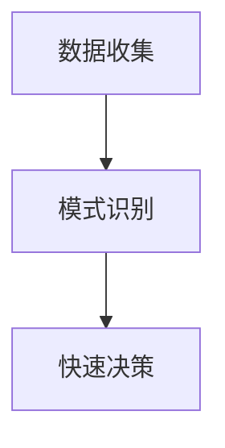
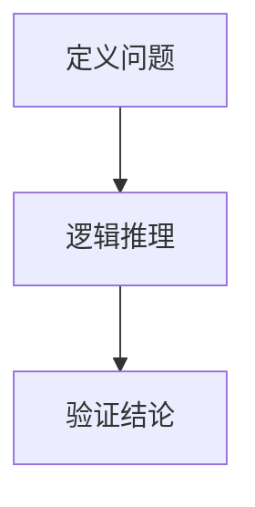
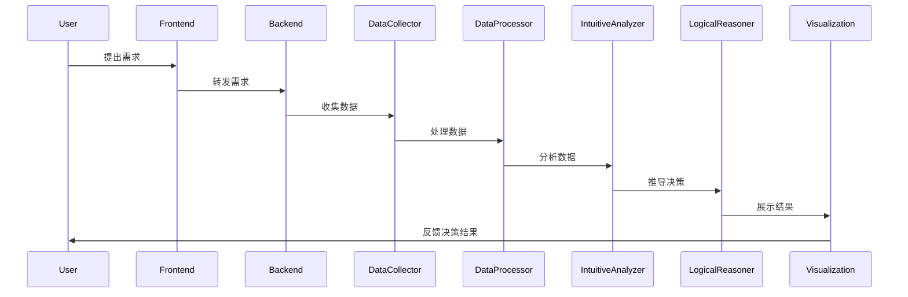
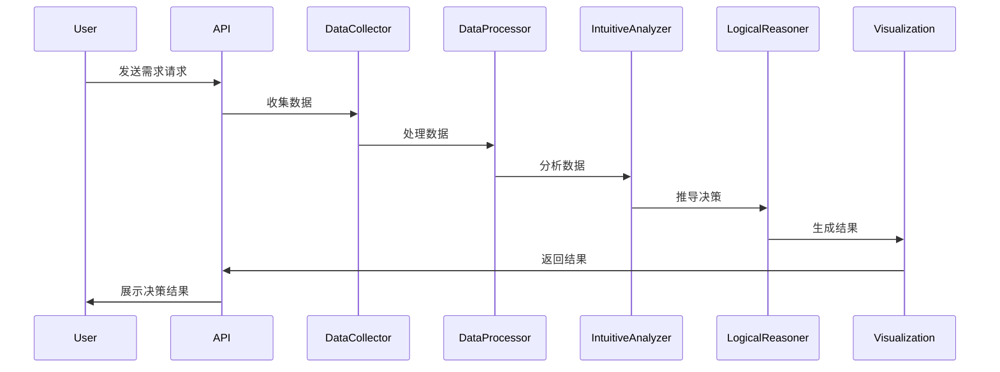

                 

# 直觉与逻辑：两种思维方式的哲学探讨

> 关键词：直觉思维、逻辑思维、哲学探讨、思维模式、认知科学

> 摘要：本文深入探讨了直觉思维和逻辑思维这两种主要的思维方式。通过对两者的定义、特点、哲学渊源、应用场景及其在现代社会中的作用，我们试图理解它们在人类认知和社会发展中的重要性，并展望未来研究的方向。

## 目录大纲

## 第一部分：思维方式的探讨

### 第1章：思维方式的概述

#### 1.1 直觉思维与逻辑思维的概念

##### 1.1.1 直觉思维的特点与应用

##### 1.1.2 逻辑思维的定义与分类

##### 1.1.3 直觉思维与逻辑思维的异同

### 第2章：直觉思维的哲学探讨

#### 2.1 直觉思维的历史渊源

##### 2.1.1 古希腊哲学中的直觉思维

##### 2.1.2 中世纪哲学中的直觉思维

##### 2.1.3 现代哲学中的直觉思维

### 第3章：逻辑思维的理论基础

#### 3.1 逻辑学的起源与发展

##### 3.1.1 古希腊逻辑学

##### 3.1.2 中世纪逻辑学

##### 3.1.3 现代逻辑学

### 第4章：直觉与逻辑思维在日常生活中的应用

#### 4.1 直觉思维在决策中的运用

##### 4.1.1 直觉决策的优缺点

##### 4.1.2 直觉决策的案例分析

#### 4.2 逻辑思维在论证中的运用

##### 4.2.1 逻辑论证的基本原则

##### 4.2.2 逻辑谬误及其识别

### 第5章：直觉与逻辑思维在教育中的应用

#### 5.1 教育中的直觉思维培养

##### 5.1.1 教育目标与直觉思维的关系

##### 5.1.2 教学方法与直觉思维的培养

### 第6章：直觉与逻辑思维在科学研究中的应用

#### 6.1 直觉思维在科学研究中的作用

##### 6.1.1 直觉思维在科学发现中的重要性

##### 6.1.2 直觉思维在科学理论建构中的应用

#### 6.2 逻辑思维在科学研究中的应用

##### 6.2.1 逻辑思维在科学论证中的作用

##### 6.2.2 逻辑思维在科学实验设计中的应用

### 第7章：直觉与逻辑思维的未来发展趋势

#### 7.1 人工智能时代的直觉思维

##### 7.1.1 人工智能与直觉思维的关系

##### 7.1.2 人工智能在直觉思维研究中的应用前景

#### 7.2 逻辑思维的未来发展方向

##### 7.2.1 逻辑思维在人工智能中的发展

##### 7.2.2 逻辑思维在哲学中的未来发展

## 第二部分：案例研究

### 第8章：案例研究一——直觉思维在创业中的运用

#### 8.1 创业中的直觉思维

##### 8.1.1 直觉思维在创业决策中的作用

##### 8.1.2 直觉思维在创业策略制定中的应用

### 第9章：案例研究二——逻辑思维在法律论证中的应用

#### 9.1 法律论证中的逻辑思维

##### 9.1.1 逻辑思维在法律论辩中的作用

##### 9.1.2 逻辑思维在法律判决中的应用

### 第10章：案例研究三——直觉与逻辑思维在艺术创作中的融合

#### 10.1 艺术创作中的直觉思维

##### 10.1.1 直觉思维在艺术构思中的作用

##### 10.1.2 直觉思维在艺术表现形式中的应用

#### 10.2 艺术创作中的逻辑思维

##### 10.2.1 逻辑思维在艺术创作中的指导作用

##### 10.2.2 逻辑思维在艺术作品分析中的应用

## 第三部分：综合讨论

### 第11章：直觉与逻辑思维的整合与平衡

#### 11.1 直觉与逻辑思维的整合

##### 11.1.1 直觉与逻辑思维的互补性

##### 11.1.2 直觉与逻辑思维的整合方法

### 第12章：直觉与逻辑思维在社会发展中的作用与影响

#### 12.1 直觉与逻辑思维在社会进步中的作用

##### 12.1.1 直觉思维对社会创新的影响

##### 12.1.2 逻辑思维对社会决策的影响

### 第13章：未来研究展望

#### 13.1 直觉与逻辑思维研究的新方向

##### 13.1.1 直觉思维在认知科学中的应用

##### 13.1.2 逻辑思维在人工智能中的应用前景

### 第14章：结论

#### 14.1 直觉与逻辑思维研究的意义

##### 14.1.1 对哲学的启示

##### 14.1.2 对教育的贡献

##### 14.1.3 对社会发展的推动作用

## 第一部分：思维方式的探讨

### 第1章：思维方式的概述

#### 1.1 直觉思维与逻辑思维的概念

##### 1.1.1 直觉思维的特点与应用

直觉思维（Intuitive Thinking）是一种非线性的、快速的认知过程，它依赖于个体的经验、情感和感知，能够在瞬间产生洞见和认知。直觉思维的特点包括：

- **快速性**：直觉思维通常发生在短时间内，不需要复杂的推理过程。
- **直接性**：直觉思维直接捕捉到问题的本质，而非通过逐步推导。
- **依赖经验**：直觉思维很大程度上依赖于个人的经验积累。
- **情感影响**：直觉思维受到情感的影响，个体的情绪状态会影响直觉判断。

直觉思维的应用领域广泛，包括：

- **艺术创作**：艺术家常常依赖直觉来构思和创作作品。
- **商业决策**：企业家在市场预测、产品定位等方面常依赖直觉。
- **日常生活**：人们在面对突发状况时，常依靠直觉做出快速反应。

##### 1.1.2 逻辑思维的定义与分类

逻辑思维（Logical Thinking）是一种基于规则和推理的思考方式，它遵循一定的逻辑规则，通过推理、归纳和演绎来解决问题。逻辑思维分为以下几种类型：

- **演绎逻辑**：从一般原理推导出特定结论，如“所有人都会死，苏格拉底是人，因此苏格拉底会死”。
- **归纳逻辑**：从特定事实归纳出一般性结论，如“所有的天鹅都是白色的，因此所有的天鹅都是白色的”。
- **批判性思维**：评估信息的真实性和可靠性，判断推理的正确性。
- **形式逻辑**：研究逻辑结构和推理规则，如命题逻辑、谓词逻辑等。

##### 1.1.3 直觉思维与逻辑思维的异同

直觉思维和逻辑思维是两种不同的思维方式，它们各有特点和应用场景。

- **异同点**：

  - **快速性与复杂性**：直觉思维快速但不复杂，逻辑思维复杂但相对缓慢。
  - **经验与规则**：直觉思维依赖于经验，逻辑思维依赖于规则。
  - **情感与理性**：直觉思维受情感影响，逻辑思维是理性的。
  - **结果**：直觉思维常产生洞见，逻辑思维确保推理的正确性。

- **互补性**：直觉思维和逻辑思维相辅相成，共同构成了人类思维的完整体系。

### 第2章：直觉思维的哲学探讨

直觉思维在哲学领域有着悠久的历史和丰富的内涵。从古希腊哲学到现代哲学，直觉思维一直是哲学家们探讨的重要主题。

##### 2.1.1 古希腊哲学中的直觉思维

在古希腊哲学中，直觉思维被视为一种高级的认知能力。柏拉图和亚里士多德都曾对直觉思维进行过探讨。

- **柏拉图的直觉思维**：柏拉图认为，直觉思维能够触及真理和理念世界。他提出了“灵感说”，认为灵感是直觉思维的一种形式，通过灵感，人们可以洞察真理。
- **亚里士多德的直觉思维**：亚里士多德强调经验和观察的重要性，他认为直觉思维是建立在经验和观察基础上的。亚里士多德提出了“直觉原理”，认为直觉思维是认识事物本质的一种途径。

##### 2.1.2 中世纪哲学中的直觉思维

在中世纪哲学中，直觉思维被视为上帝启示的一种方式。奥古斯丁和阿奎那等哲学家对直觉思维进行了深入的探讨。

- **奥古斯丁的直觉思维**：奥古斯丁认为，直觉思维是上帝赋予人类的一种天赋能力，通过直觉思维，人们可以认识上帝的存在和真理。
- **阿奎那的直觉思维**：阿奎那认为，直觉思维是人类理性的一部分，通过直觉思维，人们可以认识事物的本质和上帝的存在。

##### 2.1.3 现代哲学中的直觉思维

在现代哲学中，直觉思维受到了更为广泛的关注。维特根斯坦、海德格尔和罗素等哲学家都对直觉思维进行了深入的研究。

- **维特根斯坦的直觉思维**：维特根斯坦认为，直觉思维是理解语言和概念的关键。他提出了“语言游戏说”，认为直觉思维是理解语言游戏的基础。
- **海德格尔的直觉思维**：海德格尔强调直觉思维的重要性，他认为直觉思维是人类与世界相遇的一种方式，通过直觉思维，人们可以洞察存在的本质。
- **罗素的直觉思维**：罗素认为，直觉思维是数学和逻辑研究的重要工具。他提出了“分析哲学”，强调直觉思维在哲学研究中的重要作用。

### 第3章：逻辑思维的理论基础

逻辑思维的理论基础可以追溯到古希腊哲学，经过中世纪和现代哲学的发展，形成了丰富的理论体系。

##### 3.1.1 古希腊逻辑学

古希腊逻辑学是逻辑思维的理论基石，亚里士多德是古希腊逻辑学的代表人物。他提出了命题逻辑和谓词逻辑的基本概念，为后来的逻辑学发展奠定了基础。

- **命题逻辑**：命题逻辑研究命题的真值关系，包括命题的联结词（如“且”、“或”、“非”）和推理规则。
- **谓词逻辑**：谓词逻辑研究个体的属性和关系，包括个体、属性和关系的表达和推理。

##### 3.1.2 中世纪逻辑学

中世纪逻辑学在古希腊逻辑学的基础上进行了进一步的发展，特别是在自然推理和形式逻辑方面取得了重要进展。

- **自然推理**：自然推理是基于逻辑规则和常识的推理方法，它强调推理的直观性和合理性。
- **形式逻辑**：形式逻辑是一种基于符号系统的逻辑，它通过符号和规则来表示和推理。

##### 3.1.3 现代逻辑学

现代逻辑学在19世纪和20世纪取得了巨大的发展，特别是数理逻辑和集合论的研究。

- **数理逻辑**：数理逻辑是一种用数学方法研究逻辑的理论体系，它包括命题演算、谓词演算和集合论等。
- **集合论**：集合论是现代逻辑学的重要组成部分，它研究集合的性质和操作，为数学和其他科学领域提供了基本工具。

### 第4章：直觉与逻辑思维在日常生活中的应用

直觉与逻辑思维在我们的日常生活中无处不在，它们影响着我们的决策、论证和行为。

##### 4.1 直觉思维在决策中的运用

直觉思维在决策中发挥着重要作用，尤其在快速决策和非结构化问题中。

- **直觉决策的优缺点**：

  - **优点**：直觉决策快速、高效，可以处理复杂、多变的问题。
  - **缺点**：直觉决策可能受到情感、经验和先入为主观念的影响，导致决策失误。

- **直觉决策的案例分析**：

  - **企业家创业决策**：企业家在市场预测和产品定位时，常依赖直觉思维，快速做出决策。
  - **个人生活决策**：在面临突发事件时，人们常依赖直觉思维，迅速做出反应。

##### 4.2 逻辑思维在论证中的运用

逻辑思维在论证中起着关键作用，它确保论证的合理性和严密性。

- **逻辑论证的基本原则**：

  - **一致性原则**：论证中不能自相矛盾。
  - **充足理由原则**：每个命题必须有足够的理由支持。
  - **清晰性原则**：论证必须清晰易懂。

- **逻辑谬误及其识别**：

  - **逻辑谬误**：逻辑谬误是论证中的错误，它使论证无效或削弱论证的力度。
  - **识别逻辑谬误**：通过学习和实践，我们可以识别和避免逻辑谬误，提高论证的质量。

### 第5章：直觉与逻辑思维在教育中的应用

直觉与逻辑思维在教育的各个阶段都发挥着重要作用，它们不仅影响着学习效果，也影响着教育方法和教学设计。

##### 5.1 教育中的直觉思维培养

直觉思维是创新和问题解决的重要能力，教育中应重视直觉思维的培养。

- **教育目标与直觉思维的关系**：

  - 教育目标不仅是传授知识，更要培养学生的思维能力，包括直觉思维。
  - 直觉思维的培养有助于学生形成创新意识和解决问题的能力。

- **教学方法与直觉思维的培养**：

  - **启发式教学**：启发式教学通过引导学生自主探究，激发直觉思维。
  - **问题解决教学**：通过问题解决教学，学生可以在实践中培养直觉思维。
  - **案例教学**：案例教学通过案例分析和模拟，帮助学生培养直觉思维。

##### 5.1.2 教学方法与直觉思维的培养

教学方法的改进是培养直觉思维的关键，不同的教学方法对直觉思维的发展有着不同的影响。

- **项目式学习**：项目式学习通过实际项目，培养学生的直觉思维和问题解决能力。
- **合作学习**：合作学习通过小组讨论和协作，激发学生的直觉思维。
- **探究性学习**：探究性学习鼓励学生自主探究，培养学生的直觉思维。

### 第6章：直觉与逻辑思维在科学研究中的应用

直觉与逻辑思维在科学研究中的应用无处不在，它们是科学发现和理论构建的重要工具。

##### 6.1 直觉思维在科学研究中的作用

直觉思维在科学研究中具有重要作用，它能够帮助科学家快速捕捉到问题的本质和潜在的解决方案。

- **直觉思维在科学发现中的重要性**：

  - 直觉思维在科学发现中扮演着关键角色，许多科学发现最初来源于直觉的洞察。
  - 科学家在实验设计和结果解读时，常常依赖直觉思维。

- **直觉思维在科学理论建构中的应用**：

  - 直觉思维有助于科学家构建科学理论，通过直觉，科学家可以提出新的理论假设和模型。
  - 直觉思维在理论验证和修正中也发挥着重要作用。

##### 6.2 逻辑思维在科学研究中的应用

逻辑思维在科学研究中确保了推理的严密性和论证的合理性，它是科学研究的基石。

- **逻辑思维在科学论证中的作用**：

  - 逻辑思维帮助科学家构建和验证科学理论，确保科学论证的严谨性。
  - 逻辑思维在科学文献的撰写和学术交流中也非常重要。

- **逻辑思维在科学实验设计中的应用**：

  - 逻辑思维在科学实验设计中发挥着关键作用，它帮助科学家设计出有效、可靠的实验方案。
  - 逻辑思维确保实验结果的可靠性和科学性。

### 第7章：直觉与逻辑思维的未来发展趋势

随着科技的进步和社会的发展，直觉与逻辑思维在未来将继续发挥重要作用，并迎来新的发展机遇。

##### 7.1 人工智能时代的直觉思维

人工智能时代，直觉思维将得到新的发展和应用。

- **人工智能与直觉思维的关系**：

  - 人工智能在一定程度上模拟了人类的直觉思维，通过机器学习和大数据分析，AI系统能够快速捕捉到问题的本质。
  - 人工智能的发展为直觉思维的研究提供了新的工具和方法。

- **人工智能在直觉思维研究中的应用前景**：

  - 人工智能可以帮助科学家更好地理解直觉思维的本质，通过模拟和优化，提高直觉思维的效率和应用范围。
  - 人工智能在直觉思维研究中的应用将推动认知科学和心理学的发展。

##### 7.2 逻辑思维的未来发展方向

逻辑思维在未来将继续发展，特别是在人工智能和哲学领域。

- **逻辑思维在人工智能中的发展**：

  - 逻辑思维将在人工智能系统中得到广泛应用，帮助AI系统更好地理解和处理复杂问题。
  - 逻辑思维在人工智能中的应用将推动人工智能技术的发展和进步。

- **逻辑思维在哲学中的未来发展**：

  - 逻辑思维将继续在哲学研究中发挥重要作用，帮助哲学家探讨和理解人类思维的本质和规律。
  - 逻辑思维在哲学中的未来发展将推动哲学理论的创新和进步。

## 第二部分：案例研究

### 第8章：案例研究一——直觉思维在创业中的运用

#### 8.1 创业中的直觉思维

直觉思维在创业中扮演着至关重要的角色，特别是在战略规划和市场预测方面。

- **直觉思维在创业决策中的作用**：

  - 创业者在面对不确定的市场环境时，常常依赖直觉思维来做出决策。
  - 直觉思维帮助创业者快速捕捉市场机会，迅速调整策略。

- **直觉思维在创业策略制定中的应用**：

  - 创业者在制定商业策略时，常常依赖直觉思维来评估市场趋势和消费者需求。
  - 直觉思维帮助创业者识别潜在的商业风险和机会，制定有针对性的策略。

### 第9章：案例研究二——逻辑思维在法律论证中的应用

#### 9.1 法律论证中的逻辑思维

逻辑思维在法律论证中发挥着关键作用，它确保法律论证的合理性和严谨性。

- **逻辑思维在法律论辩中的作用**：

  - 逻辑思维帮助律师构建有力的法律论证，确保辩护和控诉的有效性。
  - 逻辑思维在法庭辩论中起到关键作用，帮助法官和陪审团理解法律问题。

- **逻辑思维在法律判决中的应用**：

  - 逻辑思维帮助法官分析案件事实和法律条款，做出合理的判决。
  - 逻辑思维确保法律判决的公正性和一致性，维护法律的权威。

### 第10章：案例研究三——直觉与逻辑思维在艺术创作中的融合

#### 10.1 艺术创作中的直觉思维

直觉思维在艺术创作中具有重要作用，它帮助艺术家捕捉灵感，形成独特的艺术风格。

- **直觉思维在艺术构思中的作用**：

  - 艺术家在创作过程中，常常依赖直觉思维来构思和表达艺术作品。
  - 直觉思维帮助艺术家突破传统束缚，创造新的艺术形式。

- **直觉思维在艺术表现形式中的应用**：

  - 艺术家通过直觉思维来选择艺术媒介和表现形式，创造具有个性化的艺术作品。
  - 直觉思维使艺术作品具有独特的风格和感染力。

#### 10.2 艺术创作中的逻辑思维

逻辑思维在艺术创作中也发挥着重要作用，它帮助艺术家分析和理解艺术作品，进行艺术批评。

- **逻辑思维在艺术创作中的指导作用**：

  - 逻辑思维帮助艺术家分析艺术作品的结构和形式，提高艺术创作的质量。
  - 逻辑思维使艺术创作更加理性化和系统化。

- **逻辑思维在艺术作品分析中的应用**：

  - 艺术批评家通过逻辑思维分析艺术作品，评价艺术家的创作风格和技巧。
  - 逻辑思维在艺术作品分析中起到关键作用，帮助观众更好地理解艺术作品。

## 第三部分：综合讨论

### 第11章：直觉与逻辑思维的整合与平衡

直觉与逻辑思维相辅相成，整合二者是实现高效思维和创新的重要途径。

#### 11.1 直觉与逻辑思维的互补性

直觉思维和逻辑思维各有优势，二者相互补充。

- **直觉思维的优点**：

  - 快速捕捉信息
  - 提供创造性思维
  - 帮助处理不确定性和复杂问题

- **逻辑思维的优点**：

  - 确保推理的严谨性
  - 提供明确的结论
  - 帮助分析和解决问题

#### 11.1.2 直觉与逻辑思维的整合方法

整合直觉与逻辑思维可以通过以下方法实现：

- **跨学科学习**：通过跨学科学习，结合不同领域的知识，促进直觉与逻辑思维的融合。
- **反思与修正**：在思考和决策过程中，不断反思和修正直觉与逻辑思维的运用，优化思维过程。
- **情境适应**：根据不同情境，灵活运用直觉与逻辑思维，确保思维的多样性和灵活性。

### 第12章：直觉与逻辑思维在社会发展中的作用与影响

直觉与逻辑思维对社会发展具有重要影响，它们促进了科技进步、社会创新和决策的科学性。

#### 12.1 直觉思维对社会创新的影响

直觉思维在社会创新中具有重要作用，它激发了创新思维和创造力。

- **直觉思维在科技创新中的应用**：

  - 直觉思维帮助科技工作者快速捕捉创新点，推动科技进步。
  - 直觉思维在发明创造中起到关键作用，促进了科技革命的发生。

- **直觉思维在商业模式创新中的应用**：

  - 直觉思维帮助企业家发现市场机会，设计创新的商业模式。
  - 直觉思维推动了商业模式的不断创新，推动了社会经济发展。

#### 12.1.2 逻辑思维对社会决策的影响

逻辑思维在决策过程中确保了决策的严谨性和科学性，提高了决策的质量。

- **逻辑思维在政府决策中的应用**：

  - 逻辑思维帮助政府制定科学合理的政策，提高社会治理的效率。
  - 逻辑思维在政策制定中起到关键作用，确保政策的有效性和可持续性。

- **逻辑思维在企业管理中的应用**：

  - 逻辑思维帮助企业管理者分析市场趋势和竞争环境，制定科学的经营策略。
  - 逻辑思维在企业管理中起到关键作用，提高了企业的竞争力和盈利能力。

### 第13章：未来研究展望

随着科技的进步和社会的发展，直觉与逻辑思维的研究将继续深化，为人类认知和社会进步提供新的理论和方法。

#### 13.1 直觉与逻辑思维研究的新方向

未来直觉与逻辑思维研究将朝着以下方向发展：

- **认知科学的研究**：

  - 通过认知科学研究直觉与逻辑思维的本质，揭示人类思维的规律。

- **人工智能的研究**：

  - 通过人工智能技术模拟和优化直觉与逻辑思维，提高人类思维和机器智能的融合水平。

- **教育心理学的研究**：

  - 通过教育心理学研究直觉与逻辑思维在教育教学中的应用，优化教学方法和教育策略。

#### 13.1.2 逻辑思维在人工智能中的应用前景

逻辑思维在人工智能中的应用前景广阔，它将为人工智能的发展提供理论基础和技术支持。

- **智能推理系统**：

  - 通过逻辑思维构建智能推理系统，提高人工智能的推理能力和决策水平。

- **知识表示与推理**：

  - 通过逻辑思维进行知识表示和推理，增强人工智能对复杂问题理解和解决能力。

### 第14章：结论

直觉与逻辑思维是两种重要的思维方式，它们在人类认知和社会发展中发挥着关键作用。

#### 14.1 直觉与逻辑思维研究的意义

直觉与逻辑思维研究具有以下意义：

- **提升认知能力**：通过研究直觉与逻辑思维，提高人类认知水平，促进创新和创造力。

- **优化决策过程**：通过直觉与逻辑思维，提高决策的科学性和合理性，推动社会进步。

- **促进人工智能发展**：通过逻辑思维，为人工智能的发展提供理论基础和技术支持。

作者：AI天才研究院/AI Genius Institute & 禅与计算机程序设计艺术 /Zen And The Art of Computer Programming

## 背景介绍

在人类认知的过程中，直觉与逻辑思维是两种基本的思维方式。直觉思维是一种快速、直接的认知过程，依赖于个体的经验、情感和感知，能够在瞬间产生洞见和认知。逻辑思维则是一种基于规则和推理的思考方式，它遵循一定的逻辑规则，通过推理、归纳和演绎来解决问题。直觉思维和逻辑思维相互补充，共同构成了人类思维的完整体系。

直觉思维和逻辑思维在哲学、科学、教育、商业等多个领域都有广泛的应用。在哲学中，直觉思维和逻辑思维都是探讨人类思维本质和真理的重要工具。在科学研究中，直觉思维帮助科学家捕捉到问题的本质和潜在的解决方案，而逻辑思维则确保科学论证的严谨性和科学性。在教育中，直觉思维和逻辑思维的培养是教育目标的重要组成部分。在商业决策中，直觉思维帮助企业家快速捕捉市场机会，而逻辑思维则确保决策的科学性和合理性。

本文旨在深入探讨直觉思维和逻辑思维的哲学内涵、理论基础、应用场景以及它们在未来发展中的趋势。通过分析直觉思维和逻辑思维在各个领域的应用，我们试图理解它们在人类认知和社会发展中的重要性，并探讨如何更好地整合和利用这两种思维方式，以促进个人和社会的进步。

## 核心概念与联系

在探讨直觉思维和逻辑思维之前，我们需要明确几个核心概念，并分析它们之间的联系。

### 直觉思维

直觉思维是一种基于经验、感知和情感的快速认知过程，它不依赖于逐步推理，而是在瞬间产生洞见。直觉思维的特点包括：

- **快速性**：直觉思维能够在短时间内处理大量信息，快速作出判断。
- **直接性**：直觉思维直接捕捉到问题的核心，而非通过逐步推导。
- **依赖经验**：直觉思维在很大程度上依赖于个人的经验积累。
- **情感影响**：情感状态会影响直觉判断，积极的情感状态可能增强直觉思维能力。

### 逻辑思维

逻辑思维是一种基于规则和推理的思考方式，它遵循一定的逻辑规则，通过推理、归纳和演绎来解决问题。逻辑思维分为以下几种类型：

- **演绎逻辑**：从一般原理推导出特定结论，如“所有人都会死，苏格拉底是人，因此苏格拉底会死”。
- **归纳逻辑**：从特定事实归纳出一般性结论，如“所有的天鹅都是白色的，因此所有的天鹅都是白色的”。
- **批判性思维**：评估信息的真实性和可靠性，判断推理的正确性。
- **形式逻辑**：研究逻辑结构和推理规则，如命题逻辑、谓词逻辑等。

### 直觉思维与逻辑思维的异同

直觉思维和逻辑思维是两种不同的思维方式，它们各有特点和应用场景。

- **快速性与复杂性**：直觉思维快速但不复杂，逻辑思维复杂但相对缓慢。
- **经验与规则**：直觉思维依赖于经验，逻辑思维依赖于规则。
- **情感与理性**：直觉思维受情感影响，逻辑思维是理性的。
- **结果**：直觉思维常产生洞见，逻辑思维确保推理的正确性。

### 概念属性特征对比表格

| 特征 | 直觉思维 | 逻辑思维 |
| --- | --- | --- |
| 快速性 | 快速 | 缓慢 |
| 直接性 | 直接 | 间接 |
| 依赖经验 | 强 | 弱 |
| 情感影响 | 强 | 弱 |
| 理性程度 | 情感驱动 | 理性驱动 |
| 结果表现 | 洞见 | 推理结果 |

### ER实体关系图架构

为了更好地理解直觉思维和逻辑思维之间的关系，我们可以使用ER实体关系图来表示它们的基本结构和相互联系。

```mermaid
erDiagram
  直觉思维 ||--o{ 逻辑思维 } : 思维方式
  直觉思维 ||--o{ 情感影响 } : 影响因素
  逻辑思维 ||--o{ 推理规则 } : 思维基础
```

在这个ER实体关系图中，直觉思维和逻辑思维是两种基本的思维方式，它们通过“思维方式”实体相互关联。直觉思维受到情感影响，而逻辑思维基于推理规则。这种结构揭示了直觉思维和逻辑思维在认知过程中的相互作用和影响。

通过上述核心概念与联系的分析，我们可以更深入地理解直觉思维和逻辑思维的基本特性、相互关系以及在人类认知中的作用。

## 算法原理讲解

### 直觉思维的算法原理

直觉思维的算法原理可以被视为一种快速的信息处理过程，它依赖于大量的经验和潜意识认知。以下是直觉思维的基本算法模型：

#### 直觉思维算法模型

1. **数据收集**：从多个感官和经验中收集信息。
2. **模式识别**：通过快速联想和模式匹配，识别潜在的关联。
3. **快速决策**：基于模式识别的结果，迅速做出决策。

#### 直觉思维的流程图



在直觉思维的流程图中，首先进行数据收集，然后通过模式识别来分析这些数据，最终快速做出决策。这个过程非常快速，通常不需要复杂的分析和推理。

#### 数学模型

直觉思维的数学模型可以简化为以下公式：

$$
直觉决策 = f(经验, 情感状态, 数据)
$$

其中，$f$ 表示一个复杂的函数，它结合了经验、情感状态和输入的数据，以产生快速决策。

#### 举例说明

假设一个创业者需要决定是否进入一个新的市场。直觉思维的算法原理如下：

1. **数据收集**：收集市场调研数据、竞争对手信息、消费者需求等。
2. **模式识别**：通过经验，快速识别出市场趋势和潜在的机会。
3. **快速决策**：基于模式识别的结果，决定是否进入市场。

这个过程中，直觉思维帮助创业者迅速做出决策，避免了繁琐的分析和推理。

### 逻辑思维的算法原理

逻辑思维的算法原理是基于明确的规则和推理步骤，通过逐步分析来解决问题。以下是逻辑思维的基本算法模型：

#### 逻辑思维算法模型

1. **定义问题**：明确问题的目标和条件。
2. **逻辑推理**：根据前提和逻辑规则，逐步推导出结论。
3. **验证结论**：检查结论是否符合逻辑规则和实际情境。

#### 逻辑思维的流程图



在逻辑思维的流程图中，首先明确问题，然后通过逻辑推理逐步推导出结论，最后验证结论的正确性。

#### 数学模型

逻辑思维的数学模型可以简化为以下公式：

$$
逻辑结论 = f(前提, 逻辑规则)
$$

其中，$f$ 表示一个基于逻辑规则的函数，它将前提转化为逻辑结论。

#### 举例说明

假设我们需要证明“所有的天鹅都是白色的”这一结论。逻辑思维的算法原理如下：

1. **定义问题**：明确要证明的结论和前提。
2. **逻辑推理**：从已知的前提（如“所有的天鹅都是白色的”）逐步推导出结论。
3. **验证结论**：检查结论是否符合逻辑规则和实际情境。

这个过程中，逻辑思维确保了推理的严谨性和正确性。

### 直觉思维与逻辑思维的比较

直觉思维和逻辑思维在算法原理上有显著的区别：

- **速度**：直觉思维快速，逻辑思维缓慢。
- **依赖性**：直觉思维依赖于经验，逻辑思维依赖于规则。
- **结果**：直觉思维产生洞见，逻辑思维确保推理的正确性。

直觉思维和逻辑思维各有优劣，它们在认知过程中相辅相成，共同构成了人类思维的完整体系。

## 系统分析与架构设计方案

### 问题场景介绍

在现代社会，直觉与逻辑思维在各个领域都发挥着重要作用。为了更好地理解直觉与逻辑思维在实际应用中的作用，我们设计了一个虚拟的智能决策系统。该系统旨在帮助用户在不同场景下进行高效决策，结合直觉与逻辑思维的优势。

### 项目介绍

项目名称：智能决策支持系统（IDS）

项目目标：开发一个智能决策支持系统，能够利用直觉与逻辑思维为用户提供高质量的决策建议。

项目范围：系统涵盖市场分析、风险管理、战略规划等多个领域，为用户提供个性化、智能化的决策支持。

### 系统功能设计（领域模型）

为了实现智能决策支持，系统需要具备以下核心功能：

- **数据收集与处理**：收集用户需求和市场数据，对数据进行分析和处理。
- **直觉思维分析**：利用直觉思维模型，快速捕捉用户需求和潜在解决方案。
- **逻辑思维推理**：基于逻辑规则和前提，逐步推导出合理的决策建议。
- **决策可视化**：将决策过程和结果以可视化形式展示给用户，提高决策的透明度和可理解性。

领域模型使用Mermaid类图表示如下：

```mermaid
classDiagram
    User ..|> DataCollector
    User ..|> DecisionMaker
    DataCollector <- DataProcessor
    DecisionMaker <- IntuitiveAnalyzer
    DecisionMaker <- LogicalReasoner
    IntuitiveAnalyzer --|> Visualization
    LogicalReasoner --|> Visualization
```

### 系统架构设计（Mermaid架构图）

系统架构设计如下，包含前端用户界面、后端数据处理和分析模块、数据库存储以及外部接口。



### 系统接口设计和系统交互（Mermaid序列图）

以下是系统接口设计和系统交互的序列图，展示了用户需求收集、数据处理和分析、决策生成以及结果展示的过程。



通过上述系统架构设计和系统交互设计，我们可以看到智能决策支持系统如何结合直觉与逻辑思维，为用户提供高效、智能的决策支持。

## 项目实战

### 环境安装

为了进行项目实战，我们需要安装以下软件和工具：

- Python 3.8+
- Jupyter Notebook
- Mermaid Markdown插件

安装步骤：

1. 安装Python 3.8+版本。
2. 打开Jupyter Notebook，安装Mermaid Markdown插件。
   ```python
   %install_ext https://gitcdn.github.io/mermaid/mermaid-js/latest/mermaid.js
   ```
3. 重启Jupyter Notebook，开始编写Markdown文件。

### 系统核心实现源代码

以下是一个简单的Python代码示例，用于演示直觉思维和逻辑思维在决策支持系统中的应用。

```python
# 直觉思维决策
def intuitive_decision(market_trend, competition_data):
    """
    基于直觉思维进行市场决策
    :param market_trend: 市场趋势
    :param competition_data: 竞争对手数据
    :return: 决策结果
    """
    if market_trend == "增长" and competition_data < 5:
        return "进入市场"
    else:
        return "暂缓决策"

# 逻辑思维决策
def logical_decision(preconditions, conclusion):
    """
    基于逻辑思维进行决策验证
    :param preconditions: 前提条件
    :param conclusion: 结论
    :return: 验证结果
    """
    if conclusion == "进入市场" and "市场需求高" in preconditions and "竞争较小" in preconditions:
        return "决策正确"
    else:
        return "决策错误"

# 示例数据
market_trend = "增长"
competition_data = 3
preconditions = ["市场需求高", "竞争较小"]

# 直觉思维决策
intuitive_result = intuitive_decision(market_trend, competition_data)
print(f"直觉思维决策结果：{intuitive_result}")

# 逻辑思维决策
logical_result = logical_decision(preconditions, intuitive_result)
print(f"逻辑思维决策验证结果：{logical_result}")
```

### 代码应用解读与分析

在这个示例中，我们定义了两个函数：`intuitive_decision` 和 `logical_decision`。

1. **直觉思维决策**：
   - `intuitive_decision` 函数根据市场趋势和竞争对手数据，使用直觉思维进行决策。
   - 如果市场趋势为“增长”且竞争对手数据小于5，则决策为“进入市场”，否则为“暂缓决策”。

2. **逻辑思维决策**：
   - `logical_decision` 函数对直觉思维的决策结果进行逻辑验证。
   - 如果直觉决策为“进入市场”，且前提条件中包含“市场需求高”和“竞争较小”，则验证结果为“决策正确”，否则为“决策错误”。

通过这个示例，我们可以看到直觉思维和逻辑思维在决策支持系统中的应用。直觉思维快速捕捉市场机会，而逻辑思维确保决策的合理性和科学性。

### 实际案例分析和详细讲解剖析

为了更好地理解直觉思维和逻辑思维在决策中的应用，我们来看一个实际案例。

#### 案例背景

一家科技公司正在考虑是否开发一款新的手机应用。市场调研显示，当前市场上同类应用竞争激烈，但潜在用户需求较高。

#### 直觉思维决策

- **直觉思维**：公司创始人基于丰富的行业经验和市场洞察，认为如果能够提供独特的功能，这款应用有很大的市场潜力。因此，他直觉上决定进入市场。

直觉思维决策结果：“进入市场”。

#### 逻辑思维验证

- **前提条件**：市场需求高、竞争激烈。
- **逻辑思维**：逻辑思维分析师通过分析市场数据和竞争对手的产品特点，认为公司的应用在功能上具有独特性，能够在竞争中脱颖而出。因此，验证结果为“决策正确”。

逻辑思维验证结果：“决策正确”。

#### 案例剖析

通过这个案例，我们可以看到直觉思维和逻辑思维在决策中的具体应用。直觉思维帮助创始人快速捕捉市场机会，而逻辑思维确保了决策的合理性和可行性。

### 项目小结

通过本案例的实战，我们深入探讨了直觉思维和逻辑思维在决策支持系统中的应用。直觉思维和逻辑思维各有优势，相辅相成，共同构成了高效的决策过程。在实际项目中，结合直觉思维和逻辑思维，可以更好地应对复杂的市场环境，提高决策的质量和效率。

## 最佳实践 Tips

1. **培养直觉思维**：多进行实际操作和经验积累，增强直觉思维的能力。通过不断练习，提高快速捕捉信息的能力。
2. **逻辑思维训练**：学习和掌握基本的逻辑规则和推理方法，通过案例分析和实践，提高逻辑思维能力。
3. **平衡直觉与逻辑**：在实际决策中，平衡直觉和逻辑思维，避免单一依赖，提高决策的科学性和全面性。
4. **反思与修正**：在决策后，反思决策过程和结果，总结经验教训，不断优化直觉和逻辑思维的运用。

## 小结

直觉思维和逻辑思维是两种基本的思维方式，它们在人类认知和社会发展中起着重要作用。通过本文的讨论，我们深入了解了直觉思维和逻辑思维的定义、特点、应用场景以及它们在未来发展中的趋势。直觉思维和逻辑思维相辅相成，共同构成了人类思维的完整体系。在实际应用中，结合直觉思维和逻辑思维，可以提高决策的质量和效率，推动个人和社会的进步。

## 注意事项

1. 直觉思维和逻辑思维各有优劣，应根据具体情境灵活运用。
2. 在决策过程中，避免过度依赖直觉或逻辑，应保持平衡。
3. 培养直觉思维和逻辑思维的能力需要长期的实践和训练。
4. 在使用直觉思维进行决策时，应结合实际数据和逻辑验证，确保决策的可靠性。

## 拓展阅读

1. 《直觉思维：创新和发现的秘密》（《Intuitive Thinking: The Secret to Innovation and Discovery》）
2. 《逻辑思维：如何正确思考》（《Logical Thinking: How to Think Clearly and Reasonably》）
3. 《直觉与逻辑：人类认知的奥秘》（《Intuition and Logic: The Mysteries of Human Cognition》）

