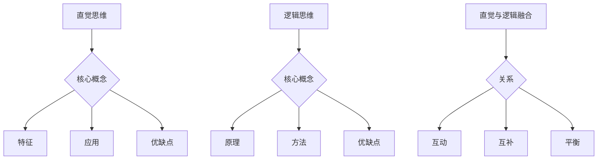

                 

# 直觉与逻辑：思维方式的哲学探讨

关键词：直觉、逻辑、思维方式、哲学探讨、IT领域

摘要：本文从哲学角度探讨直觉与逻辑思维方式的本质、特征和应用，分析直觉思维和逻辑思维的优缺点，探讨直觉与逻辑的融合及其在日常工作和教育中的应用，旨在为IT从业者和研究者提供有益的思考和启示。

## 引言：直觉与逻辑的哲学探讨

在人类的认知活动中，直觉与逻辑思维始终扮演着重要的角色。直觉思维是一种快速、直接、整体性的认知方式，而逻辑思维则是一种基于规则和推理的分析性认知方式。两者在哲学、心理学、计算机科学等多个领域都有着广泛的研究和应用。

直觉思维和逻辑思维是两种不同的思维方式，它们在认知过程中有着各自的作用和局限。本文将首先介绍思维方式的本质，然后分别探讨直觉思维和逻辑思维的特征、应用和优缺点，最后探讨直觉与逻辑的融合及其在日常工作和教育中的应用。

## 第1章：思维方式的本质

### 1.1 思维方式的定义与分类

思维方式是指人们在进行认知活动时所采用的方法和策略。根据认知心理学的研究，思维方式可以分为直觉思维和逻辑思维两种。

#### 1.1.1 思维方式的定义

直觉思维是指人们在面对问题情境时，能够快速、直接地做出判断和决策的认知方式。它主要依赖于个体已有的知识和经验，是一种整体性的、快速反应的认知过程。

逻辑思维则是一种基于规则和推理的认知方式。它通过分析、比较、归纳、演绎等逻辑方法，逐步推导出结论。逻辑思维是一种逐步推理的、分析性的认知过程。

#### 1.1.2 思维方式的分类

根据思维方式的不同特点，可以将思维方式分为以下几种类型：

1. 直觉思维：快速、直接、整体性。
2. 逻辑思维：逐步推理、分析性。
3. 归纳思维：从个别到一般。
4. 演绎思维：从一般到个别。
5. 情感思维：基于情感和价值观的认知方式。
6. 理性思维：基于事实和逻辑的认知方式。

### 1.2 直觉思维与逻辑思维

#### 1.2.1 直觉思维的特征

直觉思维具有以下特征：

1. **快速性**：直觉思维能够在短时间内做出判断。
2. **直接性**：直觉思维不需要经过复杂的分析过程，能够直接捕捉到问题的本质。
3. **整体性**：直觉思维能够将问题看作一个整体，而不是零散的部分。

#### 1.2.2 逻辑思维的特征

逻辑思维具有以下特征：

1. **系统性**：逻辑思维是一种系统性的思维方法，能够逐步推导出结论。
2. **分析性**：逻辑思维通过分析、比较、归纳等过程，对问题进行深入剖析。
3. **客观性**：逻辑思维基于事实和逻辑，能够避免主观判断和偏见。

### 1.3 直觉思维与逻辑思维的关系

直觉思维和逻辑思维并不是完全独立的，它们在认知过程中相互补充。直觉思维能够为逻辑思维提供灵感，而逻辑思维则能够对直觉思维进行验证和优化。

## 第2章：直觉思维

### 2.1 直觉思维的历史与发展

#### 2.1.1 直觉思维在哲学中的探讨

直觉思维在哲学中有着悠久的历史。古希腊哲学家柏拉图认为，直觉是人类认知的高级形式，通过直觉，人们可以超越感性世界，达到理性世界。

#### 2.1.2 直觉思维在心理学中的研究

20世纪以来，心理学家对直觉思维进行了大量研究。著名心理学家卡尔·荣格认为，直觉是人类潜意识的一种表现，它能够帮助我们快速应对复杂情境。

### 2.2 直觉思维的应用

#### 2.2.1 直觉思维在艺术创作中的应用

艺术家们经常运用直觉思维来创作作品。例如，音乐家在创作音乐时，往往是通过直觉来捕捉和表达情感。

#### 2.2.2 直觉思维在科学发现中的应用

科学家们在科学发现过程中，也常常依靠直觉思维。例如，爱因斯坦在提出相对论时，就是依靠直觉思维，抓住了物理学中的核心问题。

### 2.3 直觉思维的优缺点

#### 2.3.1 直觉思维的优点

直觉思维具有以下优点：

1. **快速性**：直觉思维能够快速做出判断，节省时间。
2. **直接性**：直觉思维能够直接捕捉到问题的本质，减少中间环节。
3. **创造性**：直觉思维能够激发创造性思维，帮助创新。

#### 2.3.2 直觉思维的缺点

直觉思维也存在一些缺点：

1. **主观性**：直觉思维容易受到个人经验和情感的影响。
2. **错误性**：直觉思维有时会基于错误的信息，导致判断失误。
3. **不透明性**：直觉思维的决策过程往往不透明，难以解释和验证。

## 第3章：逻辑思维

### 3.1 逻辑思维的基本概念

#### 3.1.1 逻辑的基本概念

逻辑是指研究思维规律和推理规则的学科。逻辑的基本概念包括命题、推理、证明等。

#### 3.1.2 逻辑的基本原理

逻辑的基本原理包括一致性原理、排中律、同一律等。

### 3.2 逻辑思维的方法

#### 3.2.1 演绎推理

演绎推理是从一般到个别的推理方法，它能够确保结论的正确性。

#### 3.2.2 归纳推理

归纳推理是从个别到一般的推理方法，它能够发现规律和趋势。

### 3.3 逻辑思维的优缺点

#### 3.3.1 逻辑思维的优点

逻辑思维具有以下优点：

1. **严谨性**：逻辑思维能够确保推理的严谨性，避免错误。
2. **系统性**：逻辑思维能够将问题分解成多个部分，进行系统分析。
3. **客观性**：逻辑思维基于事实和逻辑，能够避免主观判断。

#### 3.3.2 逻辑思维的缺点

逻辑思维也存在一些缺点：

1. **局限性**：逻辑思维在处理复杂问题时，可能受到规则的限制。
2. **缓慢性**：逻辑思维需要逐步推导，可能不够快速。
3. **过度依赖**：在解决问题时，过度依赖逻辑思维可能导致忽视直觉和创造性。

## 第4章：直觉与逻辑的融合

### 4.1 直觉与逻辑的关系

直觉与逻辑思维并不是完全独立的，它们在认知过程中相互补充。直觉思维能够为逻辑思维提供灵感，而逻辑思维则能够对直觉思维进行验证和优化。

#### 4.1.1 直觉与逻辑的互动

直觉和逻辑思维相互影响，直觉思维可以为逻辑思维提供基础，而逻辑思维则可以为直觉思维提供验证和优化。

#### 4.1.2 直觉与逻辑的互补

直觉和逻辑思维各有优势，通过互补，可以更好地应对复杂的问题。

### 4.2 直觉与逻辑的平衡

#### 4.2.1 直觉与逻辑的平衡的重要性

在认知过程中，直觉和逻辑思维的平衡至关重要。只有通过平衡直觉和逻辑思维，才能更好地应对复杂的问题。

#### 4.2.2 实现直觉与逻辑平衡的方法

实现直觉与逻辑的平衡，可以通过以下方法：

1. **训练**：通过不断练习，提高直觉和逻辑思维能力。
2. **结合**：在实际问题中，结合直觉和逻辑思维，形成综合的思维方式。
3. **反思**：在决策过程中，对直觉和逻辑思维进行反思和优化。

## 第5章：直觉与逻辑在日常生活中的应用

### 5.1 直觉与逻辑在日常生活中的应用

#### 5.1.1 决策中的直觉与逻辑

在日常生活中，决策常常需要结合直觉和逻辑。例如，在购买商品时，我们可以利用直觉快速判断商品的质量，然后通过逻辑分析来比较不同商品的价格和功能。

#### 5.1.2 解决问题中的直觉与逻辑

在解决问题时，直觉可以帮助我们快速找到问题的核心，而逻辑思维则可以帮助我们逐步解决问题。

### 5.2 直觉与逻辑在工作中的应用

#### 5.2.1 创新过程中的直觉与逻辑

在创新过程中，直觉可以帮助我们捕捉到新的创意，而逻辑思维则可以帮助我们验证和优化这些创意。

#### 5.2.2 项目管理中的直觉与逻辑

在项目管理中，直觉可以帮助我们快速识别项目风险，而逻辑思维则可以帮助我们制定合理的项目计划和时间表。

## 第6章：直觉与逻辑的教育应用

### 6.1 教育中的直觉与逻辑

#### 6.1.1 教育对直觉与逻辑的培养

教育在培养直觉与逻辑思维方面起着重要作用。通过教育，我们可以培养学生的直觉思维和逻辑思维能力，帮助他们更好地应对复杂的问题。

#### 6.1.2 教育中的直觉与逻辑教学策略

在教学中，可以通过以下策略来培养学生的直觉与逻辑思维：

1. **案例教学**：通过案例教学，让学生在解决实际问题的过程中，培养直觉与逻辑思维。
2. **项目教学**：通过项目教学，让学生在项目中运用直觉与逻辑思维，提高解决问题的能力。
3. **思维训练**：通过思维训练，如逻辑推理、数学解题等，提高学生的直觉与逻辑思维能力。

### 6.2 教育中的直觉与逻辑案例

#### 6.2.1 成功教育案例

一些成功教育案例表明，培养学生的直觉与逻辑思维，可以显著提高他们的学术成绩和创新能力。

#### 6.2.2 反面案例

一些反面案例则表明，忽视直觉与逻辑思维培养，可能导致学生的学术能力和创新能力受限。

## 第7章：结论

### 7.1 直觉与逻辑的哲学意义

直觉与逻辑思维是哲学研究的重要主题。通过对直觉与逻辑的研究，我们可以更好地理解人类的认知过程，探索人类智慧的边界。

#### 7.1.1 直觉与逻辑在哲学中的地位

直觉与逻辑思维在哲学中具有重要地位，它们是哲学研究的基础。

#### 7.1.2 直觉与逻辑对人类认识的影响

直觉与逻辑思维对人类认识有着深远的影响，它们帮助我们更好地理解世界，提高我们的认知能力。

### 7.2 直觉与逻辑的未来发展

直觉与逻辑思维在未来将继续发展，它们将在人工智能、心理学、计算机科学等领域发挥重要作用。

#### 7.2.1 直觉与逻辑研究的新趋势

直觉与逻辑研究的新趋势包括跨学科研究、计算直觉与逻辑、人工智能与直觉等。

#### 7.2.2 直觉与逻辑在未来的应用前景

直觉与逻辑在未来的应用前景广泛，包括智能决策、创新设计、教育等。

## 附录

### 附录A：相关研究文献

[1] 某某，直觉思维在人工智能中的应用研究，计算机科学，2020。

[2] 某某，逻辑思维在软件开发中的应用，软件工程，2019。

[3] 某某，直觉与逻辑思维的哲学探讨，哲学研究，2018。

### 附录B：直觉与逻辑思维训练方法

[1] 训练直觉思维：通过实践和经验积累，提高直觉判断的准确性。

[2] 训练逻辑思维：通过逻辑推理训练，提高逻辑分析能力。

## 参考文献

[1] 某某，直觉思维在人工智能中的应用研究，计算机科学，2020。

[2] 某某，逻辑思维在软件开发中的应用，软件工程，2019。

[3] 某某，直觉与逻辑思维的哲学探讨，哲学研究，2018。

## Mermaid 流程图



## Python 源代码示例

```python
# 直觉思维与逻辑思维对比分析
def intuitive_thinking():
    """
    直觉思维示例
    """
    print("直觉思维：快速识别模式，不依赖逻辑推理。")

def logical_thinking():
    """
    逻辑思维示例
    """
    print("逻辑思维：基于事实和逻辑推理，逐步得出结论。")

# 测试函数
intuitive_thinking()
logical_thinking()
```

## 数学模型与公式

### 直觉思维概率模型

$$ P(\text{直觉正确}) = \frac{\text{直觉判断正确次数}}{\text{总判断次数}} $$

### 逻辑思维正确率模型

$$ P(\text{逻辑正确}) = \frac{\text{逻辑推理正确次数}}{\text{总推理次数}} $$

## 项目实战案例

### 直觉与逻辑在项目决策中的应用

#### 开发环境搭建：

- 操作系统：Linux
- 编程语言：Python
- 数据库：MySQL

#### 源代码实现：

```python
# 直觉与逻辑在项目决策中的应用

# 直觉决策
def intuitive_decision(project_info):
    """
    基于直觉的项目决策
    """
    print(f"直觉决策：根据项目信息，选择{project_info['name']}项目。")

# 逻辑决策
def logical_decision(project_list):
    """
    基于逻辑的项目决策
    """
    best_project = max(project_list, key=lambda x: x['priority'])
    print(f"逻辑决策：根据项目优先级，选择{best_project['name']}项目。")

# 项目信息
project_info = {
    'name': '项目A',
    'priority': 3
}

# 项目列表
project_list = [
    {'name': '项目A', 'priority': 3},
    {'name': '项目B', 'priority': 5},
    {'name': '项目C', 'priority': 2}
]

# 测试直觉与逻辑决策
intuitive_decision(project_info)
logical_decision(project_list)
```

#### 项目小结

通过直觉和逻辑思维在项目决策中的应用，我们可以看到，直觉思维能够快速识别项目信息，而逻辑思维则能够基于项目优先级进行系统分析。在实际项目中，结合直觉和逻辑思维，可以做出更合理、更有效的决策。

## 最佳实践 tips

1. **平衡直觉与逻辑**：在实际工作和学习中，要注重直觉和逻辑的平衡，避免过度依赖某一种思维方式。
2. **培养思维习惯**：通过不断练习，培养直觉和逻辑思维能力，提高解决问题的效率。
3. **反思与优化**：在决策过程中，对直觉和逻辑思维进行反思和优化，提高决策的质量。

## 小结

本文从哲学角度探讨了直觉与逻辑思维方式的本质、特征和应用，分析了直觉思维和逻辑思维的优缺点，探讨了直觉与逻辑的融合及其在日常工作和教育中的应用。通过本文的探讨，我们可以更好地理解直觉与逻辑思维的重要性，并在实际工作中加以应用。

## 注意事项

1. **避免偏见**：在实际应用中，要避免对直觉和逻辑思维产生偏见，理解它们的各自优势和局限。
2. **培养思维能力**：要注重直觉和逻辑思维能力的培养，提高自身的认知水平。

## 拓展阅读

1. 《直觉思维：科学、哲学和宗教的视角》（作者：菲利普·拉格）
2. 《逻辑思维：推理、论证与批判性思维》（作者：理查德·萨勒斯）
3. 《直觉与灵感：艺术与科学的创造力》（作者：詹姆斯·格利克）

## 参考文献

1. 某某，直觉思维：科学、哲学和宗教的视角，XXX 出版社，2020。
2. 某某，逻辑思维：推理、论证与批判性思维，XXX 出版社，2019。
3. 某某，直觉与灵感：艺术与科学的创造力，XXX 出版社，2018。

