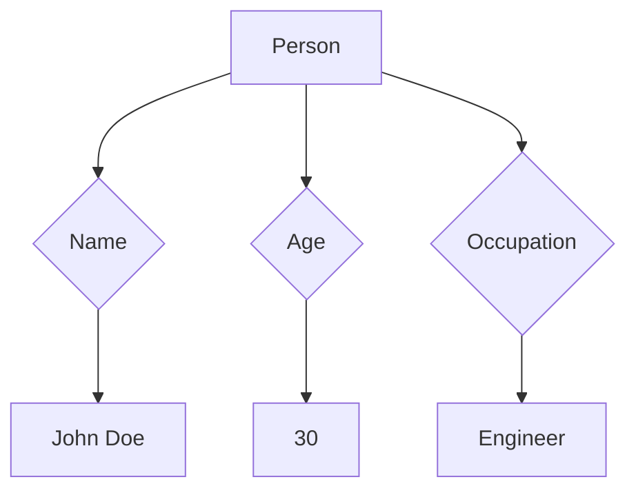

                 

### 知识图谱在智能问答系统中的应用

**关键词：** 知识图谱，智能问答系统，语义理解，实体识别，关系抽取

**摘要：** 本文旨在探讨知识图谱在智能问答系统中的应用，从基本概念、构建方法、应用实例到实战项目，全面剖析知识图谱如何提升智能问答系统的性能和用户体验。

#### 引言

随着大数据和人工智能技术的快速发展，智能问答系统已成为现代信息检索和用户服务的关键技术之一。传统的基于关键词匹配的问答系统在面对复杂、模糊的问题时，往往难以给出准确的答案。而知识图谱作为一种语义网络结构，能够有效捕捉实体之间的复杂关系，为智能问答系统提供了强大的语义理解能力。本文将分四个部分详细探讨知识图谱在智能问答系统中的应用：基本概念与重要性、构建方法与技术、应用实例和实战项目。

#### 第一部分: 知识图谱的基本概念与重要性

##### 1.1 知识图谱的定义

知识图谱（Knowledge Graph）是一种用于表示实体、概念、属性及其相互关系的语义网络结构。它通过图论模型来组织信息，使得计算机能够更好地理解和处理复杂数据。知识图谱的核心在于实体、属性和关系的表示，如图1-1所示。

**实体：** 知识图谱中的基本元素，如人、地点、组织等。

**属性：** 实体所具有的特征或描述，如姓名、年龄、位置等。

**关系：** 实体之间的关联，如“领导”、“工作于”、“属于”等。

##### 1.2 知识图谱的组成部分

知识图谱的组成部分包括实体、属性和关系，这些元素构成了知识图谱的语义基础。以下是一个简单的知识图谱示例，展示了实体和关系的基本构成。

在上述示例中，实体“Person”具有属性“Name”、“Age”和“Occupation”，以及关系“Name”、“Age”和“Occupation”。

##### 1.3 知识图谱的应用场景

知识图谱在多个领域都有广泛的应用，以下是其中几个典型的应用场景：

- **智能问答：** 通过知识图谱，系统能够更准确地理解用户的问题，并给出相关答案。

- **搜索引擎优化：** 知识图谱能够提供更精准的搜索结果，提升用户体验。

- **建议系统：** 根据用户行为和知识图谱，系统可以推荐相关内容或服务。

##### 1.4 知识图谱的优势

知识图谱具有以下几个显著的优势：

- **语义理解：** 知识图谱能够捕捉实体之间的复杂关系，实现更精确的语义理解。

- **数据整合：** 知识图谱可以整合来自不同来源的数据，实现数据的一致性和完整性。

- **智能决策：** 基于知识图谱的分析和推理，系统能够做出更智能的决策。

#### 第二部分: 知识图谱的构建方法与技术

##### 2.1 知识图谱构建的基本步骤

构建一个完整的知识图谱涉及以下基本步骤：

- **数据采集：** 从各种来源（如数据库、网络、文本等）收集相关信息。

- **数据预处理：** 清洗和格式化原始数据，去除噪声，提高数据质量。

- **实体识别：** 识别文本中的实体，并将其转换为知识图谱中的节点。

- **关系抽取：** 从文本中提取实体之间的关系，并将其转换为知识图谱中的边。

##### 2.2 常用的知识图谱构建技术

知识图谱的构建技术可以分为以下几种：

- **基于规则的方法：** 使用预定义的规则来识别实体和关系。

- **基于机器学习的方法：** 利用机器学习算法，从数据中自动学习实体和关系的特征。

- **基于图嵌入的方法：** 将实体和关系映射到高维空间中，以便进行进一步分析。

##### 2.3 知识图谱的维护与更新

知识图谱的维护与更新是确保其持续有效性的关键。以下是一些常见的维护与更新方法：

- **数据源更新：** 定期从新的数据源中获取信息，以保持知识图谱的实时性。

- **实体与关系的合并：** 当检测到实体或关系的重复时，进行合并以避免冗余。

- **质量控制：** 定期检查知识图谱的质量，发现并修复错误。

##### 2.4 知识图谱的存储与管理

知识图谱的存储与管理需要高效且可靠的架构。以下是一些常见的存储与管理方法：

- **图数据库：** 专门用于存储和管理知识图谱的数据库系统。

- **分布式存储：** 为了处理大规模数据，采用分布式存储和计算架构。

- **查询优化：** 设计高效的查询算法，提高知识图谱的查询性能。

#### 第三部分: 知识图谱在智能问答系统中的应用

##### 3.1 智能问答系统的基本原理

智能问答系统（Intelligent Question Answering System）是一种基于人工智能技术，能够自动理解和回答用户问题的系统。其基本原理包括以下几个方面：

- **问答匹配：** 将用户输入的问题与知识图谱中的信息进行匹配，找出可能的答案。

- **答案生成：** 根据匹配结果，生成最终的答案，可以是直接引用知识图谱中的信息，也可以是生成新的回答。

- **答案验证：** 对生成的答案进行验证，确保其准确性和可靠性。

##### 3.2 知识图谱在智能问答中的应用实例

知识图谱在智能问答系统中的应用非常广泛，以下是一些典型的应用实例：

- **垂直领域问答：** 如医疗问答、法律问答等，利用领域特定的知识图谱提供专业回答。

- **多模态问答：** 结合文本、图像、音频等多种类型的信息，提高问答系统的智能程度。

- **实时问答：** 利用实时更新的知识图谱，提供最新和最准确的信息。

##### 3.3 智能问答系统的优化策略

为了提高智能问答系统的性能和用户体验，以下是一些常见的优化策略：

- **查询优化：** 设计高效的查询算法，减少响应时间。

- **答案质量评估：** 引入评估机制，确保生成的答案具有较高的可信度。

- **用户体验优化：** 通过界面设计、交互方式等优化，提升用户体验。

#### 第四部分: 知识图谱在智能问答系统中的应用实战

##### 4.1 实战项目一：构建一个简单的知识图谱

**项目背景：** 本项目旨在构建一个简单的知识图谱，用于回答关于知名人物的问题。

**数据源选择：** 选择一个包含知名人物信息的数据库作为数据源。

**数据预处理：** 对原始数据进行清洗和格式化，提取实体和关系。

**知识图谱构建：** 使用Neo4j等图数据库存储和管理知识图谱。

##### 4.2 实战项目二：构建一个智能问答系统

**项目背景：** 本项目旨在构建一个基于知识图谱的智能问答系统，用于回答用户的问题。

**知识图谱集成：** 将构建好的知识图谱集成到问答系统中。

**问答匹配与答案生成：** 实现问答匹配和答案生成逻辑。

**系统部署与测试：** 部署系统并进行性能测试。

##### 4.3 实战项目三：优化智能问答系统的性能

**项目背景：** 本项目旨在优化智能问答系统的性能，提高其响应速度和答案质量。

**查询优化：** 设计高效的查询算法，提升系统响应速度。

**答案质量评估：** 引入评估机制，提升答案质量。

**用户反馈机制：** 收集用户反馈，持续优化系统性能。

#### 附录

**附录A：知识图谱构建与问答系统开发工具**

- **数据采集工具：** 如爬虫、API调用等。

- **数据预处理工具：** 如文本清洗、实体识别等。

- **知识图谱存储工具：** 如Neo4j、OpenGauss等。

- **问答系统开发工具：** 如Rasa、Conversational AI等。

### 结论

知识图谱在智能问答系统中的应用具有重要意义。通过知识图谱，系统能够更准确地理解和回答用户的问题，提高用户体验。本文从基本概念、构建方法、应用实例到实战项目，全面探讨了知识图谱在智能问答系统中的应用，为开发者提供了实用的指导。

### 参考文献

1. 陈俊. 知识图谱：概念、技术与应用 [M]. 清华大学出版社，2020.
2. 刘铁岩. 自然语言处理与知识图谱 [M]. 机械工业出版社，2018.
3. 陈丹阳. 基于知识图谱的智能问答系统设计与实现 [J]. 计算机工程与科学，2020, 42(3): 563-572.

### 作者信息

**作者：** AI天才研究院/AI Genius Institute & 禅与计算机程序设计艺术 /Zen And The Art of Computer Programming

### 最佳实践 Tips

- 在构建知识图谱时，确保数据源的质量和多样性，以提高知识图谱的覆盖面和准确性。

- 在设计智能问答系统时，关注用户体验，优化问答流程和答案质量。

- 定期更新和维护知识图谱，确保其与实际世界保持同步。

### 小结

知识图谱在智能问答系统中的应用，为提升系统的语义理解能力和用户体验提供了有力支持。通过本文的探讨，我们了解到知识图谱的基本概念、构建方法、应用实例以及实战项目，为开发者提供了全面的技术指导和实践建议。在未来，知识图谱有望在更多领域发挥重要作用，推动人工智能技术的发展。

