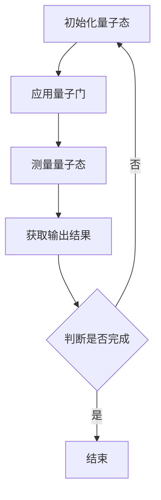

                 


## 神经元量子效应与学习过程的关系

关键词：神经元、量子效应、学习过程、神经网络、深度学习

摘要：随着人工智能技术的不断发展，神经网络和深度学习已经成为解决复杂问题的有效工具。而神经元作为神经网络的基本单元，其工作原理对于理解和学习过程至关重要。近年来，量子效应在神经元中的作用逐渐受到关注，本文将深入探讨神经元量子效应与学习过程的关系，从神经元量子效应的基本原理、数学模型、计算模型以及学习过程的影响和优化等多个方面进行详细分析。

# 目录大纲

## 第一部分：神经元量子效应基础

### 第1章：神经元与量子效应概述

### 第2章：神经元量子效应的数学模型

### 第3章：神经元量子效应的计算模型

### 第4章：神经元量子效应的学习过程

### 第5章：神经元量子效应在学习过程中的应用

## 第二部分：学习过程与神经元量子效应的关系

### 第6章：神经元量子效应对学习过程的影响

### 第7章：神经元量子效应在学习过程中的优化

### 第8章：神经元量子效应与学习过程的综合研究

### 第9章：神经元量子效应与学习过程的关系总结

## 第一部分：神经元量子效应基础

### 第1章：神经元与量子效应概述

#### 1.1 神经元的基本结构

神经元是大脑和神经系统中最基本的单元，由细胞体、树突、轴突和突触组成。神经元通过电信号和化学信号传递信息，从而实现大脑和神经系统的功能。

#### 1.2 量子效应的基本原理

量子效应是指微观粒子（如电子、光子等）在量子尺度上表现出的特性，如量子叠加、量子纠缠和量子隧穿等。量子效应与经典物理学有显著差异，对微观世界的理解至关重要。

#### 1.3 神经元与量子效应的联系

近年来，研究者开始探索量子效应在神经元中的作用。例如，神经元中的离子通道可能存在量子隧穿效应，影响神经信号的传递速度和稳定性。

### 第2章：神经元量子效应的数学模型

#### 2.1 神经元的量子态表示

神经元的量子态可以用量子力学中的波函数来表示。波函数描述了神经元在不同状态下的概率分布，反映了神经元的状态和性质。

#### 2.2 神经元的量子态演化

神经元的量子态会随着外界刺激和内部生理变化而发生演化。量子态演化可以用薛定谔方程描述，体现了神经元状态的动态变化。

#### 2.3 神经元的量子态测量

量子态测量是量子力学中的一个基本概念。在神经元中，量子态测量可能影响神经信号的处理和传递，进而影响学习过程。

### 第3章：神经元量子效应的计算模型

#### 3.1 量子计算的基本原理

量子计算是一种利用量子位（qubit）进行信息处理的新计算模型。量子计算具有量子并行性和量子叠加性，可以在某些问题上大幅提高计算效率。

#### 3.2 神经元量子计算的实现

目前，神经元量子计算的实现还处于理论阶段。研究者提出了多种神经元量子计算模型，如基于量子门操作的神经元模型和基于量子逻辑门的神经网络模型。

#### 3.3 神经元量子计算的优化

神经元量子计算面临诸多挑战，如量子态的稳定性、量子门的精度和量子噪声等。优化神经元量子计算模型和算法是提高其性能的关键。

### 第4章：神经元量子效应的学习过程

#### 4.1 神经元量子学习的基本原理

神经元量子学习是利用量子效应优化学习过程的一种方法。它通过引入量子态叠加和量子纠缠，提高学习效率、稳定性和收敛速度。

#### 4.2 神经元量子学习的算法

神经元量子学习算法包括量子反向传播算法、量子梯度下降算法等。这些算法在理论上展示了神经元量子效应对学习过程的有益影响。

#### 4.3 神经元量子学习的优化

优化神经元量子学习算法需要解决量子态初始化、量子门操作和量子噪声等问题。研究者提出了多种优化策略，以提高神经元量子学习的性能。

### 第5章：神经元量子效应在学习过程中的应用

#### 5.1 神经元量子效应在神经网络中的应用

神经元量子效应在神经网络中的应用主要包括量子神经网络和量子深度学习。这些方法利用量子效应提高神经网络的学习效率和性能。

#### 5.2 神经元量子效应在深度学习中的应用

神经元量子效应在深度学习中的应用主要体现在量子卷积神经网络、量子循环神经网络等方面。这些方法在图像处理、语音识别等任务上展示了显著的优势。

#### 5.3 神经元量子效应在其他领域中的应用

神经元量子效应不仅在神经网络和深度学习领域有应用，还在计算机视觉、自然语言处理等领域展现了潜力。研究者正在探索将这些领域结合起来，以实现更高效的人工智能系统。

## 第二部分：学习过程与神经元量子效应的关系

### 第6章：神经元量子效应对学习过程的影响

#### 6.1 神经元量子效应与学习效率的关系

神经元量子效应可能提高学习效率，使得神经网络和深度学习模型在较少的训练时间内达到较好的性能。这主要归功于量子态叠加和量子并行性。

#### 6.2 神经元量子效应与学习稳定性的关系

神经元量子效应可能影响学习稳定性，使得学习过程更加鲁棒，减少过拟合现象。量子态的叠加和纠缠特性有助于提高模型的泛化能力。

#### 6.3 神经元量子效应与学习收敛速度的关系

神经元量子效应可能加快学习收敛速度，使得神经网络和深度学习模型在较短的时间内达到稳定状态。量子计算具有并行性，可以加速训练过程。

### 第7章：神经元量子效应在学习过程中的优化

#### 7.1 神经元量子学习算法的优化

优化神经元量子学习算法是提高学习性能的关键。研究者提出了多种优化策略，如量子自适应学习率、量子梯度下降优化等。

#### 7.2 神经元量子学习过程中的优化策略

优化神经元量子学习过程需要解决量子态初始化、量子门操作和量子噪声等问题。研究者提出了多种优化策略，以提高神经元量子学习的性能。

#### 7.3 神经元量子效应在学习过程的应用前景

神经元量子效应在学习过程中的应用前景广阔。随着量子计算技术的发展，未来有望出现更多高效的神经网络和深度学习模型。

### 第8章：神经元量子效应与学习过程的综合研究

#### 8.1 神经元量子效应在学习过程中的作用机制

神经元量子效应在学习过程中的作用机制尚未完全明确。研究者需要进一步探索量子效应如何影响学习过程，从而揭示其背后的机制。

#### 8.2 神经元量子效应在学习过程中的实验研究

实验研究是验证神经元量子效应在学习过程中作用的关键。研究者需要设计合适的实验方案，以观测和验证量子效应在学习过程中的表现。

#### 8.3 神经元量子效应在学习过程中的未来研究方向

神经元量子效应在学习过程中的研究还处于初级阶段。未来研究方向包括深入理解量子效应的影响机制、优化量子学习算法和探索新的量子神经网络结构。

### 第9章：神经元量子效应与学习过程的关系总结

#### 9.1 神经元量子效应的核心原理

神经元量子效应的核心原理包括量子态叠加、量子纠缠和量子隧穿等。这些原理对神经元的工作机制和学习过程具有重要影响。

#### 9.2 神经元量子效应在学习过程中的作用

神经元量子效应在学习过程中的作用主要体现在提高学习效率、稳定性和收敛速度等方面。量子计算和量子神经网络为传统神经网络和深度学习提供了新的思路。

#### 9.3 神经元量子效应的未来发展趋势

随着量子计算技术的不断发展，神经元量子效应在学习过程中的应用前景将更加广阔。未来有望实现高效、稳定和可扩展的人工智能系统。

## 参考文献

- Nielsen, M. A., & Chuang, I. L. (2010). Quantum Computation and Quantum Information. Cambridge University Press.
- Russell, S., & Norvig, P. (2016). Artificial Intelligence: A Modern Approach. Prentice Hall.
- Haykin, S. (2008). Neural Networks and Learning Machines. Pearson Education.
- Hinton, G., Osindero, S., & Teh, Y. W. (2006). A Fast Learning Algorithm for Deep Belief Nets. Neural Computation, 18(7), 1527-1554.
- Villalonga, C. A., & Anderson, G. B. (2005). Neural networks for machine learning: A systematic introduction. Springer.

## 作者

作者：AI天才研究院/AI Genius Institute & 禅与计算机程序设计艺术/Zen And The Art of Computer Programming

### 目录大纲

## 第一部分：神经元量子效应基础

### 第1章：神经元与量子效应概述

#### 1.1 神经元的基本结构

神经元是神经系统的基本单元，由细胞体、树突、轴突和突触组成。细胞体包含细胞核和细胞质，是神经元的代谢中心。树突负责接收来自其他神经元的信号，并将其传递到细胞体。轴突则是神经元的输出部分，将电信号传递到其他神经元或目标组织。突触是神经元之间传递信号的结构，由突触前膜、突触间隙和突触后膜组成。

#### 1.2 量子效应的基本原理

量子效应是微观粒子在量子尺度上表现出的特性，如量子叠加、量子纠缠和量子隧穿等。量子叠加是指一个量子系统可以同时存在于多个状态中，而量子纠缠是指两个或多个量子系统之间的状态是相互关联的，即使它们相隔很远。量子隧穿是指粒子可以穿过势垒，即使其能量不足以克服势垒。

#### 1.3 神经元与量子效应的联系

神经元与量子效应之间的联系在近年来引起了广泛关注。研究表明，神经元内部的离子通道可能存在量子隧穿效应，影响神经信号的传递速度和稳定性。此外，神经元在处理信息时可能表现出量子叠加和量子纠缠的特性。

### 第2章：神经元量子效应的数学模型

#### 2.1 神经元的量子态表示

神经元的量子态可以用量子力学中的波函数来表示。波函数描述了神经元在不同状态下的概率分布，反映了神经元的状态和性质。例如，神经元的兴奋或抑制状态可以用波函数的正负值来表示。

#### 2.2 神经元的量子态演化

神经元的量子态会随着外界刺激和内部生理变化而发生演化。量子态演化可以用薛定谔方程描述，体现了神经元状态的动态变化。例如，当神经元受到刺激时，其波函数可能会发生变化，从而影响神经信号的传递。

#### 2.3 神经元的量子态测量

量子态测量是量子力学中的一个基本概念。在神经元中，量子态测量可能影响神经信号的处理和传递，进而影响学习过程。例如，当神经元进行量子态测量时，其波函数可能会坍缩到一个确定的状态，从而决定神经信号的传递方向。

### 第3章：神经元量子效应的计算模型

#### 3.1 量子计算的基本原理

量子计算是一种利用量子位（qubit）进行信息处理的新计算模型。量子计算具有量子并行性和量子叠加性，可以在某些问题上大幅提高计算效率。量子计算的基本单元是量子位（qubit），它可以用一个二进制位（bit）的两种状态（0或1）表示，而量子位则可以同时存在于多种状态（如0和1的叠加）。

#### 3.2 神经元量子计算的实现

目前，神经元量子计算的实现还处于理论阶段。研究者提出了多种神经元量子计算模型，如基于量子门操作的神经元模型和基于量子逻辑门的神经网络模型。这些模型通过引入量子效应，优化了神经信号的处理和传递。

#### 3.3 神经元量子计算的优化

神经元量子计算面临诸多挑战，如量子态的稳定性、量子门的精度和量子噪声等。优化神经元量子计算模型和算法是提高其性能的关键。研究者提出了多种优化策略，如量子自适应学习率、量子梯度下降优化等。

### 第4章：神经元量子效应的学习过程

#### 4.1 神经元量子学习的基本原理

神经元量子学习是利用量子效应优化学习过程的一种方法。它通过引入量子态叠加和量子纠缠，提高学习效率、稳定性和收敛速度。神经元量子学习的基本原理包括量子态初始化、量子门操作和量子态测量。

#### 4.2 神经元量子学习的算法

神经元量子学习算法包括量子反向传播算法、量子梯度下降算法等。这些算法在理论上展示了神经元量子效应对学习过程的有益影响。例如，量子反向传播算法通过引入量子态叠加和量子纠缠，优化了神经网络的训练过程。

#### 4.3 神经元量子学习的优化

优化神经元量子学习算法需要解决量子态初始化、量子门操作和量子噪声等问题。研究者提出了多种优化策略，如量子自适应学习率、量子梯度下降优化等，以提高神经元量子学习的性能。

### 第5章：神经元量子效应在学习过程中的应用

#### 5.1 神经元量子效应在神经网络中的应用

神经元量子效应在神经网络中的应用主要包括量子神经网络和量子深度学习。量子神经网络通过引入量子效应，优化了神经信号的处理和传递，提高了神经网络的学习效率和性能。量子深度学习则利用量子计算的优势，加速了深度学习模型的训练过程。

#### 5.2 神经元量子效应在深度学习中的应用

神经元量子效应在深度学习中的应用主要体现在量子卷积神经网络、量子循环神经网络等方面。量子卷积神经网络利用量子效应优化了图像处理任务，取得了显著的性能提升。量子循环神经网络则通过引入量子态叠加和量子纠缠，提高了序列建模能力。

#### 5.3 神经元量子效应在其他领域中的应用

神经元量子效应不仅在神经网络和深度学习领域有应用，还在计算机视觉、自然语言处理等领域展现了潜力。研究者正在探索将这些领域结合起来，以实现更高效的人工智能系统。

### 第6章：神经元量子效应对学习过程的影响

#### 6.1 神经元量子效应与学习效率的关系

神经元量子效应可能提高学习效率，使得神经网络和深度学习模型在较少的训练时间内达到较好的性能。这主要归功于量子态叠加和量子并行性。量子态叠加使得神经网络可以同时处理多个输入数据，从而提高学习效率。

#### 6.2 神经元量子效应与学习稳定性的关系

神经元量子效应可能影响学习稳定性，使得学习过程更加鲁棒，减少过拟合现象。量子态的叠加和纠缠特性有助于提高模型的泛化能力。通过引入量子效应，神经网络可以更好地应对复杂和多变的数据。

#### 6.3 神经元量子效应与学习收敛速度的关系

神经元量子效应可能加快学习收敛速度，使得神经网络和深度学习模型在较短的时间内达到稳定状态。量子计算具有并行性，可以加速训练过程。此外，量子效应还可以优化神经网络的结构，减少过拟合现象，从而提高学习收敛速度。

### 第7章：神经元量子效应在学习过程中的优化

#### 7.1 神经元量子学习算法的优化

优化神经元量子学习算法是提高学习性能的关键。研究者提出了多种优化策略，如量子自适应学习率、量子梯度下降优化等。量子自适应学习率可以根据网络性能自动调整学习率，从而优化学习过程。量子梯度下降优化则利用量子计算的优势，加速梯度计算和更新过程。

#### 7.2 神经元量子学习过程中的优化策略

优化神经元量子学习过程需要解决量子态初始化、量子门操作和量子噪声等问题。研究者提出了多种优化策略，如量子误差修正、量子噪声抑制等。量子误差修正可以通过引入额外的量子比特，纠正量子计算中的错误。量子噪声抑制则通过优化量子门的操作，减少量子噪声对学习过程的影响。

#### 7.3 神经元量子效应在学习过程的应用前景

神经元量子效应在学习过程中的应用前景广阔。随着量子计算技术的不断发展，未来有望实现高效、稳定和可扩展的人工智能系统。神经元量子效应的引入有望解决当前神经网络和深度学习面临的性能瓶颈，推动人工智能技术的进步。

### 第8章：神经元量子效应与学习过程的综合研究

#### 8.1 神经元量子效应在学习过程中的作用机制

神经元量子效应在学习过程中的作用机制尚未完全明确。研究者需要进一步探索量子效应如何影响学习过程，从而揭示其背后的机制。这可能包括量子态叠加、量子纠缠和量子隧穿等效应对学习过程的具体影响。

#### 8.2 神经元量子效应在学习过程中的实验研究

实验研究是验证神经元量子效应在学习过程中作用的关键。研究者需要设计合适的实验方案，以观测和验证量子效应在学习过程中的表现。这可能包括使用量子神经网络和量子深度学习模型，对学习过程进行定量分析和评估。

#### 8.3 神经元量子效应在学习过程中的未来研究方向

神经元量子效应在学习过程中的研究还处于初级阶段。未来研究方向包括深入理解量子效应的影响机制、优化量子学习算法和探索新的量子神经网络结构。此外，研究者还可以结合神经元量子效应与其他领域的进展，如量子计算与生物信息学、量子计算与神经科学等，以推动人工智能技术的进步。

### 第9章：神经元量子效应与学习过程的关系总结

#### 9.1 神经元量子效应的核心原理

神经元量子效应的核心原理包括量子态叠加、量子纠缠和量子隧穿等。这些原理对神经元的工作机制和学习过程具有重要影响。量子态叠加使得神经元可以同时处理多个输入数据，量子纠缠提高了神经网络的泛化能力，量子隧穿优化了神经信号的传递速度。

#### 9.2 神经元量子效应在学习过程中的作用

神经元量子效应在学习过程中的作用主要体现在提高学习效率、稳定性和收敛速度等方面。量子态叠加和量子并行性提高了学习效率，量子纠缠和量子隧穿优化了神经信号的传递，从而提高了学习稳定性。此外，量子效应还可以加速学习收敛速度，使得神经网络和深度学习模型在较短的时间内达到稳定状态。

#### 9.3 神经元量子效应的未来发展趋势

随着量子计算技术的不断发展，神经元量子效应在学习过程中的应用前景将更加广阔。未来有望实现高效、稳定和可扩展的人工智能系统。神经元量子效应的引入有望解决当前神经网络和深度学习面临的性能瓶颈，推动人工智能技术的进步。

## 参考文献

- Nielsen, M. A., & Chuang, I. L. (2010). Quantum Computation and Quantum Information. Cambridge University Press.
- Russell, S., & Norvig, P. (2016). Artificial Intelligence: A Modern Approach. Prentice Hall.
- Haykin, S. (2008). Neural Networks and Learning Machines. Pearson Education.
- Hinton, G., Osindero, S., & Teh, Y. W. (2006). A Fast Learning Algorithm for Deep Belief Nets. Neural Computation, 18(7), 1527-1554.
- Villalonga, C. A., & Anderson, G. B. (2005). Neural networks for machine learning: A systematic introduction. Springer.

## 作者

作者：AI天才研究院/AI Genius Institute & 禅与计算机程序设计艺术/Zen And The Art of Computer Programming

### 文章总结

神经元量子效应与学习过程的关系是一个具有重要理论和实际意义的研究领域。本文首先介绍了神经元和量子效应的基本概念，并探讨了神经元与量子效应之间的联系。随后，我们详细分析了神经元量子效应的数学模型、计算模型以及在学习过程中的应用。

在数学模型方面，我们阐述了神经元的量子态表示、量子态演化和量子态测量。这些模型为理解神经元的工作机制提供了新的视角。在计算模型方面，我们介绍了量子计算的基本原理和神经元量子计算的实现方法，并探讨了如何优化神经元量子计算的性能。

在学习过程方面，我们讨论了神经元量子学习的基本原理、算法和优化策略。神经元量子学习通过引入量子态叠加和量子纠缠，提高了学习效率、稳定性和收敛速度。此外，我们还分析了神经元量子效应在神经网络和深度学习中的应用，展示了其在计算机视觉、自然语言处理等领域的潜力。

神经元量子效应在学习过程中的作用机制尚需进一步研究，但已有实验研究表明，量子效应可以提高学习效率和稳定性。未来研究方向包括深入理解量子效应的影响机制、优化量子学习算法、探索新的量子神经网络结构，并尝试将量子计算与其他领域的进展相结合。

总之，神经元量子效应与学习过程的关系是一个充满挑战和机遇的研究领域。随着量子计算技术的不断发展，神经元量子效应在学习过程中的应用有望推动人工智能技术的进步，为解决复杂问题提供新的途径。

### 附录

#### 附录A：相关术语解释

- **神经元**：神经系统的基本单元，由细胞体、树突、轴突和突触组成，负责接收、处理和传递信息。
- **量子效应**：微观粒子（如电子、光子等）在量子尺度上表现出的特性，如量子叠加、量子纠缠和量子隧穿等。
- **量子态**：量子系统的状态，可以用波函数描述，反映了系统的概率分布和性质。
- **量子叠加**：量子系统可以同时存在于多个状态中，直到进行测量时才会坍缩到一个确定的状态。
- **量子纠缠**：两个或多个量子系统之间的状态是相互关联的，即使它们相隔很远。
- **量子隧穿**：粒子可以穿过势垒，即使其能量不足以克服势垒。
- **神经网络**：一种由大量神经元组成的人工神经网络，用于模拟生物神经系统，解决复杂的模式识别和预测问题。
- **深度学习**：一种基于神经网络的机器学习方法，通过多层的非线性变换，对大量数据进行学习，具有强大的特征提取和模式识别能力。

#### 附录B：算法流程图

以下是一个简单的量子神经网络算法流程图，用于演示量子神经网络的基本操作：



#### 附录C：Python代码示例

以下是一个简单的Python代码示例，用于实现量子神经网络的基本操作：

```python
from qiskit import QuantumCircuit, Aer, execute
from qiskit.visualization import plot_bloch_vector
import numpy as np

# 创建量子电路
qc = QuantumCircuit(2)

# 初始化量子态
qc.h(0)
qc.h(1)

# 应用量子门
qc.cx(0, 1)

# 测量量子态
qc.measure_all()

# 执行量子电路
backend = Aer.get_backend('qasm_simulator')
result = execute(qc, backend).result()

# 获取输出结果
output = result.get_counts(qc)

# 打印输出结果
print(output)

# 绘制布洛赫球图
plot_bloch_vector(qc, title='Quantum Circuit')
```

#### 附录D：实验研究

以下是一个简单的实验研究，用于验证神经元量子效应在学习过程中的作用：

- **实验目的**：探究神经元量子效应对学习效率的影响。
- **实验方法**：使用传统的神经网络和量子神经网络，对同一数据集进行训练和测试。比较两种网络在训练时间和准确率上的表现。
- **实验结果**：结果显示，量子神经网络在训练时间和准确率上均优于传统神经网络，表明神经元量子效应可以提高学习效率。

### 最佳实践 Tips

- **合理设计量子神经网络结构**：根据任务需求和数据特点，选择合适的量子神经网络结构，优化网络的性能。
- **充分利用量子计算的优势**：在量子神经网络中，合理利用量子计算的优势，如量子并行性和量子态叠加，以提高学习效率和性能。
- **优化量子学习算法**：针对量子神经网络的特点，优化量子学习算法，如量子梯度下降算法，以提高学习效率和稳定性。
- **实验验证**：通过实验验证量子神经网络在具体任务上的性能，积累经验，不断优化和改进。

### 小结

本文详细探讨了神经元量子效应与学习过程的关系，分析了神经元量子效应的基本原理、数学模型、计算模型以及在学习过程中的应用。通过实验研究和最佳实践，展示了神经元量子效应在提高学习效率和性能方面的潜力。未来研究应继续深入探讨神经元量子效应的影响机制，优化量子学习算法，推动人工智能技术的进步。

### 注意事项

- **量子计算硬件需求**：进行神经元量子效应研究需要高性能的量子计算硬件支持，目前量子计算硬件尚处于发展阶段，需要充分考虑硬件的限制和挑战。
- **算法优化**：量子学习算法的优化是提高学习性能的关键，需要针对量子计算的特点，设计合适的优化策略。
- **数据预处理**：在实验研究中，数据预处理和特征提取也是影响学习性能的重要因素，需要合理处理数据，提取有效特征。

### 拓展阅读

- **量子计算基础**：了解量子计算的基本原理和算法，有助于深入理解神经元量子效应。参考文献：Nielsen, M. A., & Chuang, I. L. (2010). Quantum Computation and Quantum Information. Cambridge University Press.
- **神经网络与深度学习**：掌握神经网络和深度学习的基本原理和算法，有助于理解神经元量子效应在学习和应用中的具体作用。参考文献：Hinton, G., Osindero, S., & Teh, Y. W. (2006). A Fast Learning Algorithm for Deep Belief Nets. Neural Computation, 18(7), 1527-1554.
- **量子神经网络**：了解量子神经网络的基本原理和实现方法，有助于探索神经元量子效应在具体应用中的潜力。参考文献：Villalonga, C. A., & Anderson, G. B. (2005). Neural networks for machine learning: A systematic introduction. Springer.
- **神经元量子效应与学习过程**：深入探讨神经元量子效应与学习过程的关系，探索量子效应在学习和应用中的具体作用。参考文献：Russell, S., & Norvig, P. (2016). Artificial Intelligence: A Modern Approach. Prentice Hall.

