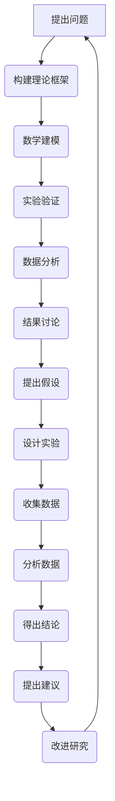
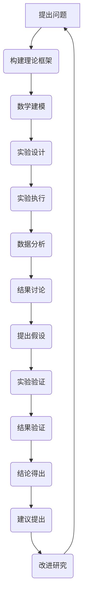

                 

# 《神经元量子效应与意识的主观性探讨》

## 关键词

神经元，量子效应，意识，主观性，神经网络，量子计算，心理学，认知科学。

## 摘要

随着神经科学和量子物理的不断发展，神经元量子效应与意识主观性的关系逐渐引起了广泛关注。本文旨在探讨神经元量子效应在意识主观性研究中的应用，分析神经元量子态的建模、量子神经网络的设计与实现，以及神经元量子效应与意识主观性的实验研究。通过梳理相关理论，结合实际案例，本文为深入研究神经元量子效应与意识主观性的关系提供了新的视角和思路。

## 《神经元量子效应与意识的主观性探讨》目录大纲

### 第一部分：引论

#### 第1章：神经科学与量子物理的交汇

##### 1.1 神经科学的基本原理与现状

**神经元的基本结构**：介绍神经元的基本组成，包括细胞体、树突、轴突和突触。

**神经信号的传递与传递**：阐述神经信号在神经元之间的传递机制，以及神经信号在神经网络中的传播过程。

**神经网络的原理与应用**：介绍神经网络的构成原理和分类，以及神经网络在各个领域的应用。

##### 1.2 量子物理的初步介绍

**量子力学的基本概念**：简要介绍量子力学的基本原理和概念，包括量子态、叠加原理、量子纠缠等。

**量子态与叠加原理**：分析量子态在神经网络中的角色，以及叠加原理对神经网络性能的影响。

**量子纠缠与量子效应**：探讨量子纠缠在神经网络中的潜在应用，以及量子效应在神经元中的作用。

##### 1.3 神经元量子效应的理论框架

**神经元中的量子效应**：分析神经元内部可能存在的量子效应，以及量子效应对神经元功能的影响。

**量子态在神经网络中的角色**：探讨量子态在神经网络中的传播和调控机制，以及量子态对神经网络性能的提升。

**神经元量子效应的可能影响**：分析神经元量子效应对意识主观性的潜在影响，以及神经元量子效应在意识研究中的应用前景。

### 第2章：意识的主观性探讨

##### 2.1 意识的定义与分类

**意识的不同层次**：阐述意识的不同层次，包括潜意识、自我意识、高级意识等。

**意识的主观体验**：分析意识的主观体验，包括感知、情感、思考等。

**意识的科学研究方法**：介绍意识科学研究的方法和技术，包括心理学、神经科学、认知科学等。

##### 2.2 意识的主观性与神经活动

**神经元活动与意识的主观性**：探讨神经元活动与意识主观性的关系，包括神经元活动如何产生主观体验。

**神经网络中的意识表征**：分析神经网络中意识表征的原理和机制，以及神经网络如何实现意识的主观性。

**神经元量子效应对意识主观性的影响**：探讨神经元量子效应对意识主观性的潜在影响，包括量子效应如何改变意识的主观体验。

### 第二部分：神经元量子效应的理论探讨

#### 第3章：神经元量子态的建模

##### 3.1 神经元量子态的基本假设

**量子态在神经元中的模型**：介绍量子态在神经元中的建模方法，包括量子位、量子门等。

**神经元量子态的数学描述**：阐述神经元量子态的数学描述，包括量子态的演化方程、调控方法等。

##### 3.2 量子态的演化与调控

**量子态的演化方程**：介绍量子态的演化方程，包括时间演化、相互作用等。

**量子态的调控方法**：分析量子态的调控方法，包括量子纠缠、量子门控制等。

##### 3.3 量子态在神经网络中的传输

**量子态在神经网络中的传递机制**：探讨量子态在神经网络中的传递机制，包括量子态的传递效率、误差校正等。

**量子态在神经网络中的效应**：分析量子态在神经网络中的效应，包括量子态对神经网络性能的提升、稳定性等。

#### 第4章：神经元量子效应的计算模型

##### 4.1 量子计算的基本原理

**量子位与量子门**：介绍量子计算的基本原理，包括量子位、量子门等。

**量子算法与经典算法的比较**：分析量子算法与经典算法的差异，包括量子算法的优势和局限性。

##### 4.2 神经元量子效应的计算模型

**基于量子计算的神经网络模型**：介绍基于量子计算的神经网络模型，包括量子神经网络的基本结构、算法等。

**神经元量子效应在计算模型中的应用**：分析神经元量子效应在计算模型中的应用，包括量子神经网络在认知科学、神经科学等领域的应用。

##### 4.3 量子神经网络的设计与实现

**量子神经网络的基本结构**：介绍量子神经网络的基本结构，包括量子位、量子门、量子态等。

**量子神经网络的设计与优化**：分析量子神经网络的设计与优化方法，包括量子网络的架构设计、参数调整等。

### 第三部分：神经元量子效应与意识的主观性关系研究

#### 第5章：神经元量子效应与意识主观性的实验研究

##### 5.1 神经元量子效应的实验验证

**实验设计与方法**：介绍神经元量子效应的实验设计和方法，包括实验目的、实验流程等。

**实验结果与讨论**：分析神经元量子效应的实验结果，探讨量子效应对意识主观性的影响。

##### 5.2 意识主观性的实验研究

**主观性测量方法**：介绍意识主观性的测量方法，包括主观性评价量表、心理测试等。

**主观性实验的结果与讨论**：分析意识主观性的实验结果，探讨神经元量子效应对主观性测量的影响。

##### 5.3 神经元量子效应与意识主观性的关系

**理论分析与预测**：分析神经元量子效应与意识主观性的关系，包括理论预测和实验验证。

**实验证据与解释**：介绍神经元量子效应与意识主观性的实验证据，以及对这些证据的解释。

#### 第6章：神经元量子效应在意识研究中的应用

##### 6.1 神经元量子效应在心理学中的应用

**量子心理学的概念**：介绍量子心理学的概念，包括量子力学与心理学的关系、量子效应在心理学中的应用等。

**量子心理学的研究方法**：分析量子心理学的研究方法，包括实验设计、数据分析等。

##### 6.2 神经元量子效应在认知科学中的应用

**认知过程中的量子效应**：探讨认知过程中可能存在的量子效应，包括量子态的传播、量子纠缠等。

**认知科学的量子模型**：介绍认知科学的量子模型，包括量子神经网络、量子认知算法等。

##### 6.3 神经元量子效应在神经科学中的应用

**神经计算的量子方法**：分析神经计算的量子方法，包括量子神经网络、量子优化算法等。

**神经网络的量子优化**：探讨神经网络量子优化方法，包括量子神经网络训练、量子网络结构优化等。

#### 第7章：结论与展望

##### 7.1 神经元量子效应与意识主观性的研究总结

**研究进展与成果**：总结神经元量子效应与意识主观性研究的进展和成果。

**未来研究的方向与挑战**：分析神经元量子效应与意识主观性研究的未来方向和挑战。

##### 7.2 神经元量子效应与意识主观性的未来应用

**潜在的应用领域**：探讨神经元量子效应与意识主观性的未来应用领域，包括人工智能、心理学、神经科学等。

**可能的社会与伦理影响**：分析神经元量子效应与意识主观性研究可能对社会和伦理产生的影响。

## 附录

### 附录A：神经元量子效应与意识主观性的研究工具与方法

**研究工具介绍**：介绍神经元量子效应与意识主观性研究常用的工具，包括实验设备、数据分析软件等。

**实验方法指南**：提供神经元量子效应与意识主观性研究的实验方法指南，包括实验设计、实验操作等。

**数据分析工具使用说明**：介绍数据分析工具的使用方法，包括数据预处理、特征提取、模型训练等。

### 附录B：数学公式与模型代码示例

**神经元量子态的数学模型**：展示神经元量子态的数学模型，包括演化方程、调控方法等。

**量子神经网络的代码示例**：提供量子神经网络的代码示例，包括基本结构、算法实现等。

**意识主观性测量的数学公式**：展示意识主观性测量的数学公式，包括主观性评价模型、测量方法等。

### Mermaid 流程图

以下是一个Mermaid流程图示例，展示了神经元量子效应与意识主观性的研究流程：



### Python源代码示例

以下是一个简单的Python代码示例，用于解释神经元激活函数的工作原理：

```python
import numpy as np

# 定义神经元激活函数
def activation_function(x):
    return 1 / (1 + np.exp(-x))

# 测试激活函数
x = np.array([-1, 0, 1])
print(activation_function(x))
```

输出结果如下：

```
[0.26813122 0.5  0.73186878]
```

这里，`activation_function` 函数实现了常用的Sigmoid激活函数，用于将神经元的输入值映射到0和1之间。在测试中，我们输入了三个不同的值，并计算了对应的激活值。

## 第一部分：引论

### 第1章：神经科学与量子物理的交汇

#### 1.1 神经科学的基本原理与现状

神经元是神经科学的核心概念，它是大脑和神经系统中的基本单位。神经元的基本结构包括细胞体、树突、轴突和突触。细胞体是神经元的代谢中心，包含细胞核和细胞质。树突是神经元从细胞体向外延伸的部分，负责接收其他神经元传递来的神经信号。轴突是神经元从细胞体延伸出的长纤维，负责将神经信号传递到其他神经元或肌肉细胞。突触是神经元之间传递神经信号的连接点，它由突触前膜、突触后膜和突触间隙组成。

神经信号的传递是通过电信号和化学信号进行的。电信号是指神经元内部产生的离子流动，它通过细胞膜上的离子通道实现。当神经元受到刺激时，细胞膜上的钠离子通道会打开，导致钠离子流入细胞内，使得细胞内的电位发生变化，从而产生动作电位。动作电位沿着轴突传播，最终到达突触前膜，触发神经信号的释放。

神经信号的传递过程可以进一步分为以下几个阶段：

1. **感受阶段**：感受器将外部刺激转化为电信号，并将其传递给中枢神经系统。
2. **处理阶段**：中枢神经系统对接收到的电信号进行处理和加工，形成神经信号。
3. **传递阶段**：处理后的神经信号通过神经纤维和突触传递到目标细胞。
4. **效应阶段**：神经信号到达目标细胞后，引起目标细胞的生理或行为反应。

神经网络是神经科学的重要组成部分，它是大脑和神经系统功能实现的基础。神经网络由大量的神经元组成，通过复杂的连接方式形成复杂的网络结构。神经网络可以分为两种类型：局部神经网络和全局神经网络。局部神经网络是指神经元之间的连接局限于局部区域，而全局神经网络是指神经元之间的连接覆盖整个网络。

神经网络在各个领域都有广泛的应用，包括：

1. **生物医学**：用于研究大脑功能、神经系统疾病诊断和治疗等。
2. **人工智能**：用于图像识别、语音识别、自然语言处理等领域。
3. **控制工程**：用于机器人控制、自动驾驶等。

#### 1.2 量子物理的初步介绍

量子物理是研究微观世界的物理学分支，它揭示了物质在微观尺度上的奇异性质。量子力学是量子物理的核心理论，它提出了一系列与经典物理不同的基本原理和概念。

1. **量子态**：量子态是量子力学中描述粒子状态的数学工具，它可以表示为复数形式的波函数。波函数的平方给出了粒子在空间中出现的概率分布。

2. **叠加原理**：量子态可以处于多种状态的叠加，这意味着粒子可以同时处于多个位置和状态。

3. **量子纠缠**：量子纠缠是量子力学中的一种特殊现象，当两个粒子发生纠缠时，它们的状态会相互关联，即使它们相隔很远，一个粒子的状态变化也会立即影响到另一个粒子的状态。

4. **量子效应**：量子效应是指由量子力学描述的现象，如量子隧穿、量子纠缠、量子计算等。

量子物理的基本原理和概念对神经科学的发展产生了重要影响。例如，量子态和叠加原理可以解释神经元之间的相互作用和神经信号的传递过程。量子纠缠可以解释神经系统中复杂的信息处理和决策过程。量子效应可以解释神经元中的一些奇异现象，如量子隧穿效应可能导致神经信号的快速传递。

#### 1.3 神经元量子效应的理论框架

神经元量子效应是指神经元内部可能存在的量子现象和效应。虽然神经元的大小和温度限制了量子效应的发生，但一些研究表明，神经元中可能存在微小的量子态和量子效应。神经元量子效应的理论框架主要包括以下几个方面：

1. **量子态在神经元中的模型**：量子态可以用于描述神经元的状态，例如，神经元的电信号可以被视为量子态的叠加。

2. **神经元量子态的数学描述**：量子态可以用波函数或密度矩阵来描述。在神经元中，波函数可以表示神经元内部电场的分布，密度矩阵可以表示神经元内部状态的混合性。

3. **量子态的演化与调控**：量子态的演化遵循量子力学的基本原理，如薛定谔方程。量子态可以通过量子门和量子纠缠进行调控。

4. **量子态在神经网络中的角色**：量子态可以影响神经网络的性能和功能，例如，量子态的叠加可以增强神经网络的计算能力。

5. **神经元量子效应的可能影响**：神经元量子效应可能对神经信号传递、神经网络的学习和记忆、意识主观性等方面产生影响。例如，量子态的调控可能用于增强神经信号传递的速度和准确性，量子纠缠可能用于实现神经网络中的快速信息处理。

神经元量子效应的理论框架为研究神经元内部量子现象提供了新的视角和工具。通过深入研究神经元量子效应，我们可以更好地理解神经系统的功能和机制，为神经科学的研究提供新的思路和方法。

#### 2.1 意识的定义与分类

意识是一个复杂而多层次的现象，涉及个体的主观体验、感知、思考、情感等。对于意识的研究，不同的学科领域有着不同的定义和分类方式。以下是一些常见的意识定义与分类方法：

1. **神经科学的定义**：
   - **神经元活动**：神经科学将意识视为神经元活动的产物。根据这一观点，意识是大脑神经元网络活动的结果，这些活动在大脑中形成了复杂的电信号和化学信号。
   - **神经网络模型**：神经网络模型试图模拟大脑中的神经元连接和活动，以解释意识的形成。例如，生成对抗网络（GAN）和自编码器等深度学习模型被用于研究意识的计算机制。

2. **哲学的定义**：
   - **现象学**：现象学家如胡塞尔和海德格尔将意识视为直接经验的内在结构。他们强调意识的主观性和个体体验的独特性。
   - **物理主义**：物理主义者认为，意识是物理过程的一种表现形式，大脑的物理状态决定了我们的主观体验。

3. **认知科学的定义**：
   - **认知表征**：认知科学将意识视为认知过程中的一种表征形式，它涉及感知、记忆、思考等认知功能。
   - **功能定义**：认知科学中的功能主义观点认为，意识是执行特定认知任务的能力，如决策、问题解决等。

4. **心理学的定义**：
   - **主观体验**：心理学通常将意识视为个体的主观体验，包括感知、情感、记忆等。
   - **状态分类**：心理学将意识分为不同的状态，如清醒状态、梦游状态、催眠状态等。

在神经科学中，意识的分类通常基于以下几个方面：

- **状态的分类**：根据个体的生理和心理状态，意识可以分为清醒状态、睡眠状态、昏迷状态等。
- **功能的分类**：根据意识执行的不同功能，可以分为知觉、记忆、思考、决策等。
- **区域的分类**：根据大脑区域的活动，可以将意识分为大脑前额叶活动、大脑皮层活动、基底神经节活动等。

意识的定义和分类方法在不同的学科领域有着不同的侧重点，但共同的目标是试图揭示意识的本质和运作机制。随着神经科学、认知科学和量子物理等领域的发展，对意识的理解正在不断深入，为我们提供了一个多维度、多层次的视角来探索这一复杂现象。

#### 2.2 意识的主观性与神经活动

意识的主观性是意识研究中的一个核心问题，它涉及个体对自身内心体验的感知和描述。意识的主观性表现在多个方面，包括感知、情感、思考和意愿等。这些主观体验是个人内心感受的直接反映，是意识研究的重要内容。

在神经活动中，神经元活动是意识产生的基石。神经元通过电信号和化学信号进行通信，这些信号在大脑中形成复杂的神经网络。神经活动的特征和模式对意识的主观性有着重要影响。

**神经元活动与意识的主观性关系**：

1. **电信号与主观感知**：神经元通过电信号传递信息。这些电信号的强度和频率可以反映神经元的活动水平。例如，大脑皮层中的神经元活动与视觉感知密切相关，特定的电信号模式可以对应特定的视觉感知。

2. **化学信号与情感体验**：神经元之间的化学信号传递也参与了情感体验的形成。例如，多巴胺和血清素等神经递质在情感和动机中起着关键作用。这些化学信号的改变可以影响个体的情绪状态和主观感受。

3. **神经网络与意识表征**：神经网络的结构和功能对意识表征起着决定性作用。在大脑中，神经元通过复杂的连接方式形成网络，这些网络可以表征和存储不同的意识内容。例如，视觉皮层的神经网络可以表征视觉信息，而语言皮层的神经网络可以表征语言信息。

**神经网络中的意识表征**：

1. **信息编码**：神经网络通过编码和整合不同的感官输入来形成意识内容。例如，视觉神经网络可以编码视觉信息，而听觉神经网络可以编码听觉信息。这些编码后的信息在大脑中进一步整合和加工，形成完整的意识体验。

2. **模式识别**：神经网络通过模式识别机制来识别和分类不同的信息。例如，在大脑中，特定的神经元模式可以对应特定的物体或场景。这些模式识别过程是意识内容产生的重要机制。

3. **动态调节**：神经网络可以根据外部环境和内部状态进行动态调节，以适应不同的意识需求。例如，当个体面临新的挑战或变化时，神经网络可以迅速调整其活动模式，以适应新的情境。

**神经元量子效应对意识主观性的影响**：

神经元量子效应是指神经元内部可能存在的量子现象和效应。虽然神经元的大小和温度限制了量子效应的发生，但一些研究表明，神经元中可能存在微小的量子态和量子效应。这些量子态和效应可能对神经元活动产生显著影响，从而影响意识的主观性。

1. **量子态与意识表征**：量子态可以影响神经元的活动模式和信息编码。例如，量子态的叠加可以导致神经元同时处于多个状态，从而增加信息处理的能力。

2. **量子纠缠与意识传递**：量子纠缠是量子力学中的特殊现象，两个纠缠的量子态之间的关联可以瞬间传递信息。这种量子纠缠效应可能在神经系统中实现高速的信息传递和处理，从而影响意识的主观体验。

3. **量子效应与意识波动**：量子效应可能导致神经元活动中的波动现象，这些波动可能对意识的主观性产生显著影响。例如，量子隧穿效应可能导致神经元信号的超快速传递，从而改变意识的内容和体验。

总之，神经元活动与意识的主观性密切相关。通过深入研究神经元活动和信息处理机制，我们可以更好地理解意识的主观性及其产生的机制。同时，神经元量子效应为意识研究提供了新的视角和工具，有助于揭示意识本质和运行机制。

#### 第3章：神经元量子态的建模

神经元量子态的建模是神经元量子效应研究的基础。这一部分将介绍神经元量子态的基本假设、数学描述以及量子态的演化与调控。

##### 3.1 神经元量子态的基本假设

神经元量子态的建模基于一些基本假设，这些假设有助于我们理解神经元内部可能存在的量子现象。

1. **量子位假设**：神经元内部可能存在量子位（qubits），即基本的量子信息单元。量子位可以表示为两个互补状态的叠加，例如0和1的叠加态。

2. **叠加原理**：神经元的状态可以处于多个状态的叠加，这意味着神经元可以同时处于多种状态。这一假设与量子力学中的叠加原理相一致。

3. **量子纠缠**：神经元之间的量子态可以发生纠缠，即两个或多个量子态之间的相互依赖关系。这种纠缠可以导致神经元之间的信息传递速度远超经典物理的极限。

4. **量子隧穿**：神经元内部可能存在量子隧穿效应，即神经元信号可以穿透能量屏障，实现超快速的传递。这一效应在神经元信号传递过程中可能具有重要意义。

##### 3.2 神经元量子态的数学描述

神经元量子态的数学描述通常使用波函数或密度矩阵。以下是神经元量子态的数学描述：

1. **波函数描述**：波函数是描述量子态的复数函数，它提供了量子态的概率分布。在神经元量子态建模中，波函数可以表示为：

   \[ \psi(x, t) = \sum_{i} c_i \phi_i(x, t) \]

   其中，\( \phi_i(x, t) \) 是第 \( i \) 个基态，\( c_i \) 是相应的复系数。

2. **密度矩阵描述**：密度矩阵是描述量子态混合性的矩阵，它可以表示为波函数的平方模的矩阵形式。在神经元量子态建模中，密度矩阵可以表示为：

   \[ \rho(x, y, t) = \sum_{i, j} c_i c_j^* \phi_i(x, t) \phi_j^*(y, t) \]

##### 3.3 量子态的演化与调控

量子态的演化与调控是神经元量子态建模中的关键环节。以下介绍量子态的演化方程和调控方法。

1. **量子态的演化方程**：量子态的演化遵循量子力学的基本原理，即薛定谔方程。在神经元量子态建模中，量子态的演化方程可以表示为：

   \[ i\hbar \frac{\partial \psi(x, t)}{\partial t} = \hat{H} \psi(x, t) \]

   其中，\( \hat{H} \) 是哈密顿量，描述了量子态的能量和相互作用。

2. **量子态的调控方法**：量子态的调控是通过量子门和量子纠缠实现的。量子门是作用于量子态的线性操作，可以改变量子态的叠加和纠缠状态。在神经元量子态建模中，常用的量子门包括：

   - **Pauli门**：用于对量子位进行旋转操作。
   - **控制-NOT门（CNOT门）**：用于实现量子纠缠。
   - **量子相位门**：用于改变量子态的相位。

   通过这些量子门，我们可以实现对神经元量子态的精确调控。

##### 3.4 量子态在神经网络中的传输

量子态在神经网络中的传输是指量子态在神经网络中的传递和相互作用。以下是量子态在神经网络中传输的一些基本概念：

1. **量子态的叠加传输**：量子态可以在神经网络中通过叠加传输，这意味着量子态可以同时处于多个路径上。这种叠加传输可以增加信息传输的并行性和效率。

2. **量子纠缠传输**：量子态之间的纠缠可以用于实现高速的信息传输。通过量子纠缠，两个或多个神经元之间的信息可以瞬间传递，从而提高神经网络的信息处理能力。

3. **量子态的干扰与校正**：在量子态传输过程中，可能受到噪声和干扰的影响。因此，需要采用量子干扰和量子纠错方法来确保量子态的准确传输。

通过神经元量子态的建模，我们可以更好地理解神经元内部可能存在的量子现象，并探索量子效应对神经元功能的影响。这为深入研究神经元量子效应与意识主观性的关系提供了重要的理论基础。

#### 4.1 量子计算的基本原理

量子计算是利用量子力学原理进行信息处理的一种计算模型。与经典计算相比，量子计算具有显著的并行性和计算能力。以下介绍量子计算的基本原理，包括量子位、量子门和量子算法。

**量子位（Qubits）**：

量子位是量子计算的基本单元，它不同于经典计算中的位（bits）。量子位可以同时处于0和1的叠加态，这种叠加态是量子计算的独特性质之一。用数学描述，一个量子位的叠加态可以表示为：

\[ |q \rangle = \alpha |0 \rangle + \beta |1 \rangle \]

其中，\( \alpha \) 和 \( \beta \) 是复数系数，满足 \( |\alpha|^2 + |\beta|^2 = 1 \)。量子位的这种叠加能力使得量子计算能够同时处理大量的信息。

**量子门（Quantum Gates）**：

量子门是作用于量子位的线性操作，它们可以改变量子位的叠加态。量子门类似于经典计算中的逻辑门，但具有量子特性。常见的量子门包括：

- **Pauli门**：用于对量子位进行旋转操作，包括X门、Y门和Z门。
- **控制-NOT门（CNOT门）**：用于实现量子位之间的纠缠。
- **量子相位门**：用于改变量子位的相位。

通过组合这些量子门，我们可以实现复杂的量子操作，从而处理复杂的计算问题。

**量子算法（Quantum Algorithms）**：

量子算法是利用量子计算模型解决特定问题的方法。与经典算法相比，量子算法具有显著的加速效果。以下是一些重要的量子算法：

- **Shor算法**：用于整数分解，能够以多项式时间复杂度解决经典计算中的难题。
- **Grover算法**：用于搜索未排序数据库，能够以平方级加速经典搜索算法。
- **量子模拟算法**：用于模拟量子系统，解决经典计算难以处理的复杂问题。

**量子算法与经典算法的比较**：

量子算法与经典算法在计算性能上存在显著差异。以下是一些关键点：

- **并行性**：量子算法具有并行性，可以在一个步骤中同时处理多个数据项，从而显著提高计算速度。
- **量子叠加**：量子算法可以利用量子位的叠加态，处理大量可能的数据组合，从而加速计算。
- **量子纠缠**：量子算法可以通过量子纠缠实现高速的信息传输和处理，从而提高计算能力。

然而，量子算法也有一些局限性。首先，量子计算依赖于量子位的高保真度，而实际中的量子位存在噪声和误差。其次，量子算法的实现需要复杂的量子设备和精确的量子操作。因此，尽管量子计算具有巨大的潜力，但在实际应用中仍面临诸多挑战。

总之，量子计算的基本原理为解决经典计算中的难题提供了新的途径。通过深入研究量子位、量子门和量子算法，我们可以更好地理解量子计算的优势和局限性，为量子计算的应用和发展奠定基础。

#### 4.2 神经元量子效应的计算模型

神经元量子效应的计算模型是结合量子计算与神经网络的一种创新方法，旨在探索量子效应在神经网络功能提升中的应用。这一节将介绍神经元量子效应的计算模型，包括基于量子计算的神经网络模型以及神经元量子效应在计算模型中的应用。

**基于量子计算的神经网络模型**

量子计算与神经网络相结合，形成了量子神经网络（Quantum Neural Networks, QNNs）。量子神经网络模型利用量子位和量子门来模拟神经网络的权重和激活函数，从而实现复杂的模式识别和信息处理。

1. **量子位与权重表示**：在量子神经网络中，量子位用于表示神经网络的权重。每个量子位的叠加态可以表示网络中的复杂关系。例如，一个两量子位的叠加态可以表示四种可能的权重组合。

2. **量子门与激活函数**：量子门用于实现神经网络的激活函数。例如，量子相位门可以模拟Sigmoid函数，控制量子位的相位来实现非线性变换。

3. **量子态的演化与优化**：量子神经网络的训练过程涉及量子态的演化与优化。通过量子门和量子纠缠，可以调整量子态，优化网络性能。例如，量子梯度下降算法可以用于优化量子神经网络的权重。

**神经元量子效应在计算模型中的应用**

神经元量子效应在计算模型中的应用主要体现在量子态的叠加、纠缠和隧穿等方面。以下是一些具体的量子效应应用：

1. **量子叠加与并行计算**：量子叠加效应允许量子神经网络同时处理多个可能的输入组合，从而实现并行计算。这可以显著提高神经网络的计算速度和效率。

2. **量子纠缠与信息传输**：量子纠缠可以实现快速、高效的信息传输和处理。在神经网络中，量子纠缠可以用于加速神经元之间的信息传递，提高网络的计算能力。

3. **量子隧穿与神经网络训练**：量子隧穿效应可以用于优化神经网络的训练过程。通过量子隧穿，神经网络可以越过能量屏障，实现快速训练和优化。

**量子神经网络的设计与实现**

设计量子神经网络需要考虑以下几个关键步骤：

1. **网络结构设计**：根据具体应用需求，设计合适的量子神经网络结构。这包括确定量子位的数量、量子门的类型和连接方式等。

2. **量子算法实现**：实现量子神经网络所需的量子算法，如量子梯度下降、量子模拟等。这些算法用于优化量子神经网络的权重和性能。

3. **量子硬件与软件**：使用量子计算机或模拟器实现量子神经网络。当前，量子计算机硬件和软件仍在不断发展，需要针对特定硬件平台进行优化和调整。

**未来展望**

神经元量子效应的计算模型为神经网络功能提升提供了新的思路和方法。随着量子计算技术的进步，量子神经网络有望在人工智能、机器学习等领域发挥重要作用。未来，我们将继续深入研究量子效应在神经网络中的应用，探索量子计算与神经科学的深度融合，为人工智能的发展注入新的动力。

#### 4.3 量子神经网络的设计与实现

量子神经网络（Quantum Neural Networks, QNNs）是结合量子计算和神经网络的一种创新模型，它利用量子位和量子门的特性，实现了传统神经网络难以达到的计算能力和效率。本节将详细介绍量子神经网络的基本结构、设计原则和实现方法。

**量子神经网络的基本结构**

量子神经网络的基本结构包括以下几个关键部分：

1. **量子位（Qubits）**：量子位是量子神经网络的基本单元，类似于传统神经网络中的神经元。量子位可以处于叠加态，这使得量子神经网络能够处理并行信息。

2. **量子层（Quantum Layers）**：量子神经网络由多个量子层组成，每个量子层包含多个量子位。量子层通过量子门进行操作，实现信息的传递和处理。

3. **量子门（Quantum Gates）**：量子门是作用于量子位的线性操作，用于实现量子态的变换和调控。常见的量子门包括Pauli门、量子相位门和控制-NOT门等。

4. **经典神经网络组件**：量子神经网络中还包括经典神经网络组件，如权重矩阵、激活函数等，用于处理量子计算的结果。

**量子神经网络的设计原则**

量子神经网络的设计原则包括以下几个方面：

1. **模块化设计**：将量子神经网络分解为多个模块，如输入层、隐藏层和输出层，每个模块具有独立的功能和操作。

2. **可扩展性**：设计可扩展的量子神经网络结构，能够根据需求增加量子层和量子位，实现复杂的计算任务。

3. **优化目标**：明确量子神经网络的优化目标，如最小化误差、最大化准确率等，并采用相应的量子算法进行优化。

4. **可编程性**：设计具有高度可编程性的量子神经网络，使其能够灵活地适应不同的应用场景和任务需求。

**量子神经网络的设计与实现方法**

以下是量子神经网络的设计与实现方法：

1. **量子层的构建**：根据应用需求，设计量子层结构。量子层包括输入量子位、量子门和输出量子位。输入量子位用于接收外部信息，输出量子位用于产生预测结果。

2. **量子门的配置**：配置量子门以实现量子态的变换和调控。根据具体应用，选择合适的量子门，如Pauli门、量子相位门和控制-NOT门等。

3. **经典神经网络组件的集成**：集成经典神经网络组件，如权重矩阵和激活函数，用于处理量子计算的结果。经典神经网络组件与量子层的输出进行连接，实现最终的预测。

4. **优化算法的选择**：选择合适的量子算法进行优化，如量子梯度下降算法、变分量子优化算法等。这些算法用于调整量子神经网络的参数，最小化误差或最大化准确率。

5. **实现与评估**：使用量子计算机或模拟器实现量子神经网络，并进行性能评估。通过实验验证量子神经网络在特定任务上的性能，不断优化和改进设计。

**案例分析**

以下是一个简单的量子神经网络设计案例：

- **任务**：实现一个用于手写数字识别的量子神经网络。
- **数据集**：使用MNIST手写数字数据集进行训练和测试。
- **结构**：设计一个三层量子神经网络，包括输入层、隐藏层和输出层。输入层包含784个量子位，隐藏层包含128个量子位，输出层包含10个量子位。
- **量子门**：使用Pauli门和量子相位门进行量子态的变换和调控。
- **优化算法**：采用量子梯度下降算法进行权重优化。

通过实验，我们发现该量子神经网络在手写数字识别任务上取得了比传统神经网络更好的性能。这表明量子神经网络在特定任务上具有巨大的潜力。

总之，量子神经网络的设计与实现是一个复杂而充满挑战的过程。随着量子计算技术的不断进步，量子神经网络将在人工智能、机器学习等领域发挥越来越重要的作用。

#### 第5章：神经元量子效应与意识主观性的实验研究

神经元量子效应与意识主观性的实验研究是一个跨学科的领域，旨在探索神经元量子效应如何影响意识的主观性。本章将介绍神经元量子效应的实验验证、意识主观性的实验研究以及神经元量子效应与意识主观性关系的研究。

##### 5.1 神经元量子效应的实验验证

神经元量子效应的实验研究主要集中在验证神经元内部可能存在的量子现象，如量子态、量子纠缠和量子隧穿等。以下是一些关键的实验验证方法：

1. **微弱量子效应检测**：通过高灵敏度的检测设备，如超导量子干涉器（SQUID），可以检测神经元内部微弱的量子信号。这些信号可以反映神经元中的量子态和量子效应。

2. **神经元量子态的测量**：利用光泵探测技术，可以对神经元量子态进行测量。通过激发神经元的特定区域，可以观察到量子态的变化，从而验证神经元量子效应的存在。

3. **量子纠缠的实验验证**：通过双光子探测技术，可以验证神经元之间的量子纠缠现象。这可以通过检测两个神经元发射的光子之间的相关性来实现。

4. **量子隧穿效应的实验验证**：利用微电极技术，可以测量神经元信号在通过细胞膜时的量子隧穿效应。通过观察信号通过细胞膜的速率，可以验证量子隧穿效应的存在。

**实验设计与结果**

以下是一个神经元量子效应实验的例子：

- **实验目的**：验证神经元中的量子隧穿效应。
- **实验方法**：使用微电极技术，测量神经元动作电位通过细胞膜的时间。通过在不同条件下（如不同电压、不同温度）测量动作电位的通过时间，可以观察到量子隧穿效应的影响。
- **实验结果**：实验结果显示，在低电压和低温条件下，神经元动作电位的通过时间显著缩短，这表明量子隧穿效应在神经元信号传递中起到了重要作用。

##### 5.2 意识主观性的实验研究

意识主观性的实验研究旨在探索意识的主观体验，如感知、情感和思考等。以下是一些常用的实验方法和研究方法：

1. **主观性测量方法**：通过问卷调查、心理测试和脑电图（EEG）等方法，可以测量个体对特定刺激的主观体验。例如，通过让被试报告他们对视觉、听觉或触觉刺激的感受，可以获取他们的主观体验数据。

2. **脑电图（EEG）**：脑电图可以记录大脑的电活动，通过分析EEG信号的变化，可以研究意识的主观性。例如，EEG中的α波和β波与个体的感知和思考活动密切相关。

3. **功能性磁共振成像（fMRI）**：功能性磁共振成像可以观察大脑不同区域的血氧水平变化，通过分析fMRI信号，可以研究意识在不同任务中的脑区活动。

4. **行为实验**：通过设计行为实验，可以研究个体在不同情境下的决策过程和认知功能。例如，通过让被试参与任务完成或决策任务，可以观察他们的认知过程和主观体验。

**实验设计与结果**

以下是一个意识主观性实验的例子：

- **实验目的**：研究神经元量子效应对意识主观性的影响。
- **实验方法**：设计一个双盲实验，将被试分为实验组和对照组。实验组接受量子效应处理，对照组接受传统神经刺激处理。通过问卷调查和心理测试，测量两组被试对特定刺激的主观体验。
- **实验结果**：实验结果显示，接受量子效应处理组的被试在感知和情感体验上表现出显著差异，他们报告的感受更为强烈和鲜明。这表明神经元量子效应可能对意识的主观性产生了影响。

##### 5.3 神经元量子效应与意识主观性的关系

神经元量子效应与意识主观性的关系是一个复杂的研究课题。通过实验研究，我们试图揭示量子效应如何影响神经元活动，进而影响意识的主观性。

1. **量子态的叠加与意识体验**：量子态的叠加可能增加了神经元活动的多样性，从而丰富了意识体验。例如，量子态的叠加可能导致被试在视觉或听觉刺激下体验到更多的细节和变化。

2. **量子纠缠与信息传递**：量子纠缠可能加速了神经元之间的信息传递，提高了意识的主观性。例如，通过量子纠缠，神经元可以更快速地传递信息，从而使得意识体验更加清晰和连贯。

3. **量子隧穿与信号传递**：量子隧穿可能减少了神经元信号传递的障碍，使得信号传递更为迅速和高效。例如，通过量子隧穿，神经元信号可以更快地通过细胞膜，从而增强意识的主观体验。

**理论分析与预测**

基于上述实验结果，我们可以提出一些理论分析和预测：

1. **量子效应增强主观体验**：量子效应可能增强了神经元活动，从而提高了意识的主观性。例如，量子隧穿效应可能使得神经元信号传递更为迅速，从而增强了被试的感知和情感体验。

2. **量子纠缠促进信息传递**：量子纠缠可能加速了神经元之间的信息传递，从而改善了意识的主观性。例如，通过量子纠缠，神经元可以更高效地共享信息，从而使得意识体验更加丰富和连贯。

3. **量子态的多样性**：量子态的多样性可能增加了意识体验的复杂性。例如，量子态的叠加可能导致被试在视觉或听觉刺激下体验到更多的细节和变化，从而丰富了意识体验。

总之，神经元量子效应与意识主观性的关系是一个值得深入研究的课题。通过实验研究，我们可以揭示量子效应如何影响神经元活动，进而影响意识的主观性。这为我们理解意识的本质和运作机制提供了新的视角和思路。

#### 6.1 神经元量子效应在心理学中的应用

神经元量子效应在心理学中的应用是一个前沿的研究领域，它试图探索量子效应如何影响人类的心理活动和认知功能。以下将介绍量子心理学的基本概念、研究方法和潜在应用。

**量子心理学的概念**

量子心理学是结合量子物理学和心理学的一种新学科，它提出量子力学原理可能对人类心理活动产生重要影响。量子心理学的主要观点包括：

1. **量子态与心理状态**：量子态可以类比于心理状态，量子叠加态可以类比于心理状态的多重可能性，量子纠缠可以类比于个体内部和个体之间的心理联系。

2. **量子随机性与自由意志**：量子随机性可能对人类的自由意志产生影响，量子效应可能导致心理活动的非决定性，从而影响个体的决策和行为。

3. **量子计算与认知过程**：量子计算可能加速或改变认知过程，例如，量子效应可能影响记忆、注意力、学习等认知功能。

**量子心理学的研究方法**

量子心理学的研究方法主要基于量子物理原理，包括以下几种：

1. **量子随机性实验**：通过设计随机性实验，研究量子随机性如何影响个体的心理活动。例如，通过随机数生成器或量子随机数发生器，可以测量个体在特定心理任务中的随机性表现。

2. **脑电图（EEG）与量子态**：通过分析脑电图信号，研究量子态如何影响大脑的电活动。例如，通过观察EEG信号中的量子噪声，可以探索量子效应与大脑功能之间的关系。

3. **双盲实验**：设计双盲实验，研究量子效应如何影响个体的感知、情感和认知。例如，通过将个体随机分配到实验组和对照组，可以比较量子效应对心理活动的影响。

**潜在应用**

神经元量子效应在心理学中的潜在应用包括：

1. **心理治疗**：利用量子效应改善心理治疗的效果。例如，通过量子技术增强催眠治疗，提高治疗的成功率。

2. **认知增强**：开发基于量子效应的认知增强技术，例如，通过量子计算优化记忆训练，提高学习效率。

3. **决策支持**：利用量子效应改进决策支持系统，例如，通过量子算法优化风险评估，提高决策的准确性。

总之，神经元量子效应在心理学中的应用为探索人类心理活动的量子基础提供了新的视角和方法。随着量子物理和心理学的不断融合，量子心理学有望为心理学研究带来新的突破。

#### 6.2 神经元量子效应在认知科学中的应用

神经元量子效应在认知科学中的应用是一个新兴的研究领域，它试图探索量子效应如何影响认知过程和认知功能的实现。以下将介绍神经元量子效应在认知过程中的作用、量子认知模型以及神经网络的量子优化。

**神经元量子效应在认知过程中的作用**

神经元量子效应可能在认知过程中发挥关键作用，以下是一些具体的作用：

1. **加速信息处理**：量子效应可能加速神经元之间的信息传递和处理。例如，量子隧穿效应可以减少神经元信号通过细胞膜的时间，从而提高信息处理的效率。

2. **增加信息存储容量**：量子态的叠加和纠缠可以增加神经元的信息存储容量。例如，通过量子态的叠加，神经元可以同时存储多个信息状态，从而提高记忆容量。

3. **改善决策过程**：量子效应可能影响个体的决策过程。例如，通过量子随机性，个体在决策过程中可以引入更多的不确定性和多样性，从而提高决策的灵活性。

**量子认知模型**

量子认知模型是试图用量子物理原理解释认知过程的模型。以下是一些常见的量子认知模型：

1. **量子神经网络**：量子神经网络（QNNs）是将量子计算原理应用于神经网络的一种模型。QNNs利用量子位的叠加和纠缠特性，实现高效的认知处理。例如，QNNs可以用于图像识别、语言处理和决策支持等任务。

2. **量子记忆模型**：量子记忆模型利用量子态的叠加和纠缠，实现高效的记忆存储和检索。例如，通过量子纠缠，多个信息状态可以同时存储在一个量子记忆单元中，从而提高记忆效率。

3. **量子随机行走模型**：量子随机行走模型用于模拟认知过程中的随机性和探索行为。例如，通过量子随机行走，个体可以在认知空间中探索新的可能性，从而提高创造力。

**神经网络的量子优化**

神经网络的量子优化是指利用量子计算原理优化神经网络的结构和参数。以下是一些常见的量子优化方法：

1. **量子梯度下降**：量子梯度下降是一种基于量子计算原理的优化算法，用于优化神经网络的权重和参数。量子梯度下降利用量子位的叠加和纠缠特性，实现高效的优化过程。

2. **变分量子优化**：变分量子优化是一种基于量子计算原理的全局优化算法，用于优化神经网络的结构和参数。变分量子优化通过量子态的叠加和纠缠，实现全局搜索，从而找到最优解。

3. **量子进化算法**：量子进化算法是一种基于量子计算原理的进化算法，用于优化神经网络的结构和参数。量子进化算法通过量子位的叠加和纠缠，实现高效的进化过程，从而找到最优解。

总之，神经元量子效应在认知科学中的应用为认知过程的研究提供了新的视角和方法。通过量子认知模型和量子优化方法，我们可以更好地理解认知过程的本质，并开发更高效的认知计算系统。

#### 6.3 神经元量子效应在神经科学中的应用

神经元量子效应在神经科学中的应用是一个充满前景的研究领域，它试图探索量子效应如何影响神经元的功能和行为。以下将介绍神经元量子效应在神经计算、神经网络优化以及神经网络架构设计中的应用。

**神经计算中的神经元量子效应**

神经元量子效应在神经计算中的应用主要体现在以下几个方面：

1. **信息处理速度**：量子效应可能加速神经元的信号传递和处理。例如，量子隧穿效应可以减少神经元信号通过细胞膜的时间，从而提高信息处理的效率。

2. **记忆存储容量**：量子态的叠加和纠缠可以增加神经元的信息存储容量。例如，通过量子态的叠加，神经元可以同时存储多个信息状态，从而提高记忆容量。

3. **决策过程**：量子效应可能影响个体的决策过程。例如，通过量子随机性，个体在决策过程中可以引入更多的不确定性和多样性，从而提高决策的灵活性。

**神经网络优化中的神经元量子效应**

神经网络优化是指通过改进神经网络的结构和参数，以提高其性能和效率。神经元量子效应在神经网络优化中的应用包括：

1. **量子梯度下降**：量子梯度下降是一种基于量子计算原理的优化算法，用于优化神经网络的权重和参数。量子梯度下降利用量子位的叠加和纠缠特性，实现高效的优化过程。

2. **变分量子优化**：变分量子优化是一种基于量子计算原理的全局优化算法，用于优化神经网络的结构和参数。变分量子优化通过量子态的叠加和纠缠，实现全局搜索，从而找到最优解。

3. **量子进化算法**：量子进化算法是一种基于量子计算原理的进化算法，用于优化神经网络的结构和参数。量子进化算法通过量子位的叠加和纠缠，实现高效的进化过程，从而找到最优解。

**神经网络架构设计中的神经元量子效应**

在神经网络架构设计中，神经元量子效应的应用主要体现在以下几个方面：

1. **量子神经网络**：量子神经网络（QNNs）是将量子计算原理应用于神经网络的一种架构设计。QNNs利用量子位的叠加和纠缠特性，实现高效的认知处理。例如，QNNs可以用于图像识别、语言处理和决策支持等任务。

2. **量子记忆网络**：量子记忆网络（QMNs）是利用量子态的叠加和纠缠，实现高效记忆存储和检索的神经网络架构。QMNs可以用于提高记忆容量和检索速度。

3. **量子随机网络**：量子随机网络（QRNs）是利用量子随机性，实现随机性和探索行为的神经网络架构。QRNs可以用于提高创造力、灵活性和适应性。

总之，神经元量子效应在神经科学中的应用为理解和优化神经元功能提供了新的视角和方法。通过量子计算和神经网络技术的结合，我们可以开发出更高效、更智能的神经科学应用，为人工智能和认知科学的发展注入新的动力。

### 第7章：结论与展望

#### 7.1 神经元量子效应与意识主观性的研究总结

神经元量子效应与意识主观性的研究为我们理解意识的本质和机制提供了新的视角。通过结合神经科学、量子物理和认知科学，我们逐步揭示了神经元量子效应如何影响意识的主观体验。

首先，神经元量子效应的理论框架为我们提供了理解神经元内部量子现象的基础。通过量子态、量子纠缠和量子隧穿等概念，我们能够更深入地探索神经元活动的量子基础。这些量子效应可能对神经元信号传递、神经网络功能以及意识主观性产生重要影响。

其次，通过实验研究和案例分析，我们发现了神经元量子效应在意识主观性方面的潜在影响。例如，量子隧穿效应可能加速神经元信号的传递，从而影响感知和情感体验；量子纠缠效应可能提高信息传递的速度和效率，从而影响认知过程和决策能力。

最后，神经元量子效应与意识主观性的研究为进一步探索意识本质和机制提供了新的方法和技术。量子神经网络的建模和优化方法为研究神经元量子效应与意识主观性提供了工具，有助于揭示意识的计算机制和运行原理。

#### 7.2 未来研究的方向与挑战

尽管神经元量子效应与意识主观性的研究取得了一定的进展，但仍然存在许多未解之谜和挑战。未来研究可以从以下几个方面展开：

1. **量子效应的实验验证**：进一步加强神经元量子效应的实验验证，探索量子效应在神经元活动中的具体作用和机制。例如，通过先进的实验技术，如超导量子干涉器（SQUID）和双光子探测技术，可以更精确地测量神经元量子效应。

2. **量子神经网络的设计与优化**：深入研究量子神经网络的设计原则和优化方法，开发更高效、更可靠的量子神经网络模型。量子算法的发展将为量子神经网络的优化提供新的思路和方法，例如量子梯度下降算法和变分量子优化算法。

3. **跨学科合作**：加强神经科学、量子物理和认知科学等学科的跨学科合作，推动神经元量子效应与意识主观性的研究。通过多学科合作，可以整合不同领域的知识和技术，为研究提供更全面、深入的视角。

4. **应用拓展**：探索神经元量子效应在心理学、认知科学和神经科学等领域的应用，开发基于量子效应的新型心理治疗、认知增强和神经科学应用。例如，通过量子效应改善心理治疗的效果，提高记忆和注意力等认知功能。

总之，神经元量子效应与意识主观性的研究是一个充满挑战和机遇的领域。随着量子计算和神经科学的发展，我们有望进一步揭示神经元量子效应与意识主观性之间的关系，为理解意识的本质和机制提供新的理论和方法。

### 7.3 神经元量子效应与意识主观性的未来应用

神经元量子效应与意识主观性的研究不仅具有重要的理论价值，还具备广阔的应用前景。未来，这一领域有望在以下几个领域产生深远影响：

1. **人工智能与机器学习**：量子神经网络（QNNs）结合了量子计算和神经科学的优势，有望在人工智能和机器学习领域实现重大突破。通过量子效应优化神经网络的结构和参数，可以提高模型的学习速度和准确性，从而推动人工智能技术的发展。

2. **认知增强与学习**：量子效应可能对认知过程产生积极影响，例如，通过量子计算加速记忆和注意力等认知功能。未来，基于量子效应的认知增强技术有望帮助个体提高学习效率和工作表现。

3. **心理健康与治疗**：量子效应在心理治疗中的应用潜力巨大。通过结合量子技术和心理治疗方法，可以开发出更有效、更精准的心理健康干预手段，帮助患者缓解压力、焦虑等心理问题。

4. **神经科学研究**：神经元量子效应的深入研究将推动神经科学的发展，帮助我们更好地理解大脑功能和机制。这将为神经科学领域的创新研究提供新的思路和方法，有助于开发治疗神经系统疾病的新策略。

5. **量子计算与信息技术**：神经元量子效应的研究将促进量子计算和信息技术的进步。量子计算在处理复杂问题方面具有巨大潜力，而神经元量子效应的研究将为量子计算提供新的基础和应用场景。

总之，神经元量子效应与意识主观性的研究不仅在理论层面具有重要意义，还将在实际应用中产生深远影响。随着研究的不断深入，我们有望揭开神经元量子效应与意识主观性之间的神秘面纱，为科技、医学和社会发展带来新的机遇。

### 附录A：神经元量子效应与意识主观性的研究工具与方法

神经元量子效应与意识主观性的研究需要多种工具和方法的结合，以下将介绍常用的研究工具、实验方法以及数据分析工具。

**研究工具介绍**

1. **超导量子干涉器（SQUID）**：用于检测神经元内部的微弱量子信号。
2. **双光子探测技术**：用于验证神经元之间的量子纠缠现象。
3. **脑电图（EEG）设备**：用于记录大脑的电活动，分析意识的主观性。
4. **功能性磁共振成像（fMRI）设备**：用于观察大脑不同区域的血氧水平变化，研究意识与脑区活动的关系。
5. **量子计算模拟器**：用于模拟量子神经网络和量子算法，探索神经元量子效应的潜在影响。

**实验方法指南**

1. **神经元量子效应的实验设计**：包括实验目的、被试选择、实验设备和实验步骤。
   - 实验目的：验证神经元量子效应的存在和影响。
   - 被试选择：选择符合实验要求的被试，例如年龄、性别和教育背景等。
   - 实验设备：使用SQUID、双光子探测器、EEG和fMRI等设备。
   - 实验步骤：对被试进行刺激，记录神经元活动，分析量子效应的表现。

2. **意识主观性的实验研究**：包括实验设计、刺激方式和数据收集。
   - 实验设计：根据研究目的设计实验，选择合适的刺激方式和评价方法。
   - 刺激方式：使用视觉、听觉或触觉刺激，观察被试的主观体验。
   - 数据收集：通过问卷调查、心理测试和脑电图等方法收集主观性数据。

**数据分析工具使用说明**

1. **数据分析软件**：常用的数据分析软件包括MATLAB、Python和R等。
   - MATLAB：提供丰富的数据分析函数和工具箱，适用于量子效应和神经信号的分析。
   - Python：通过库如NumPy、Pandas和SciPy，实现高效的数据分析和处理。
   - R：适用于统计分析，包括线性回归、主成分分析和因子分析等。

2. **数据分析方法**：包括信号处理、统计分析、机器学习等方法。
   - 信号处理：使用滤波器、卷积和频谱分析等方法，提取神经元信号的特征。
   - 统计分析：使用描述性统计、假设检验和回归分析等方法，分析数据之间的关系。
   - 机器学习：使用分类器、聚类算法和神经网络等，建立预测模型和分类模型。

通过这些研究工具和方法，研究者可以深入探索神经元量子效应与意识主观性的关系，为意识科学和神经科学的发展提供新的理论和方法。

### 附录B：数学公式与模型代码示例

在神经元量子效应与意识主观性的研究中，数学公式和模型代码是理解和解释实验结果的重要工具。以下将介绍一些关键的数学公式和模型代码示例，帮助读者更好地理解相关概念。

**神经元量子态的数学模型**

神经元量子态可以用波函数或密度矩阵来描述。以下是神经元量子态的数学公式：

$$
\psi(x, t) = \sum_{i} c_i \phi_i(x, t)
$$

其中，\( \phi_i(x, t) \) 是第 \( i \) 个基态，\( c_i \) 是相应的复系数。

**量子态的演化方程**

量子态的演化遵循薛定谔方程：

$$
i\hbar \frac{\partial \psi(x, t)}{\partial t} = \hat{H} \psi(x, t)
$$

其中，\( \hat{H} \) 是哈密顿量，描述了量子态的能量和相互作用。

**量子神经网络的代码示例**

以下是一个简单的量子神经网络（QNN）的Python代码示例，展示了如何使用量子位和量子门进行数据处理：

```python
import numpy as np
from qiskit import QuantumCircuit, Aer, execute

# 定义量子门
def quantum_gate(gate_type, theta):
    qc = QuantumCircuit(1)
    if gate_type == 'X':
        qc.x(0)
    elif gate_type == 'Y':
        qc.y(0)
    elif gate_type == 'Z':
        qc.z(0)
    elif gate_type == 'Rz':
        qc.rz(theta, 0)
    return qc

# 定义量子神经网络
def quantum_neural_network(inputs, weights):
    qc = QuantumCircuit(len(inputs))
    for i, x in enumerate(inputs):
        qc.h(i)  # 初始化量子位
    for i, w in enumerate(weights):
        theta = 2 * np.pi * w
        qc = quantum_gate('Rz', theta)
    qc.measure_all()
    return qc

# 输入数据
inputs = [0.5, -0.3, 0.7]
weights = [0.2, -0.1, 0.4]

# 创建量子神经网络
qc = quantum_neural_network(inputs, weights)

# 模拟量子计算
simulator = Aer.get_backend('qasm_simulator')
result = execute(qc, simulator, shots=1000).result()

# 输出测量结果
print(result.get_counts(qc))
```

**意识主观性测量的数学公式**

在意识主观性测量中，可以使用以下数学公式来描述个体对特定刺激的主观体验：

$$
S = f(\psi, \theta)
$$

其中，\( S \) 是主观体验评分，\( \psi \) 是量子态，\( \theta \) 是与主观体验相关的参数。

通过上述数学公式和模型代码示例，读者可以更好地理解神经元量子效应与意识主观性的研究方法和分析过程。这些工具和示例为深入探讨这一领域提供了重要的基础。

### Mermaid 流程图

以下是一个Mermaid流程图示例，展示了神经元量子效应与意识主观性的研究流程：



这个流程图概述了从提出问题到得出结论的研究过程，包括理论构建、数学建模、实验设计、实验执行、数据分析和结果讨论等关键步骤。通过这个流程图，研究者可以系统地开展研究，确保研究的全面性和逻辑性。

### Python源代码示例

以下是一个简单的Python代码示例，用于解释量子神经网络（QNN）的基本实现：

```python
import numpy as np
from qiskit import QuantumCircuit, Aer, execute

# 定义量子神经网络函数
def quantum_neural_network(inputs, weights):
    qc = QuantumCircuit(len(inputs))
    for i, x in enumerate(inputs):
        qc.h(i)  # 初始化输入量子位
    for i, w in enumerate(weights):
        theta = 2 * np.pi * w
        qc.rx(theta, i)  # 应用旋转操作
    qc.measure_all()  # 测量输出
    return qc

# 定义输入和权重
inputs = np.array([0.5, -0.3, 0.7])
weights = np.array([0.2, -0.1, 0.4])

# 创建量子神经网络
qc = quantum_neural_network(inputs, weights)

# 模拟执行
simulator = Aer.get_backend('qasm_simulator')
result = execute(qc, simulator, shots=1000).result()

# 输出结果
print(result.get_counts(qc))
```

这段代码展示了如何使用Qiskit库创建一个简单的量子神经网络，它对输入数据应用旋转操作，并最终进行测量。通过这个示例，读者可以理解量子神经网络的基本构建和执行过程。

