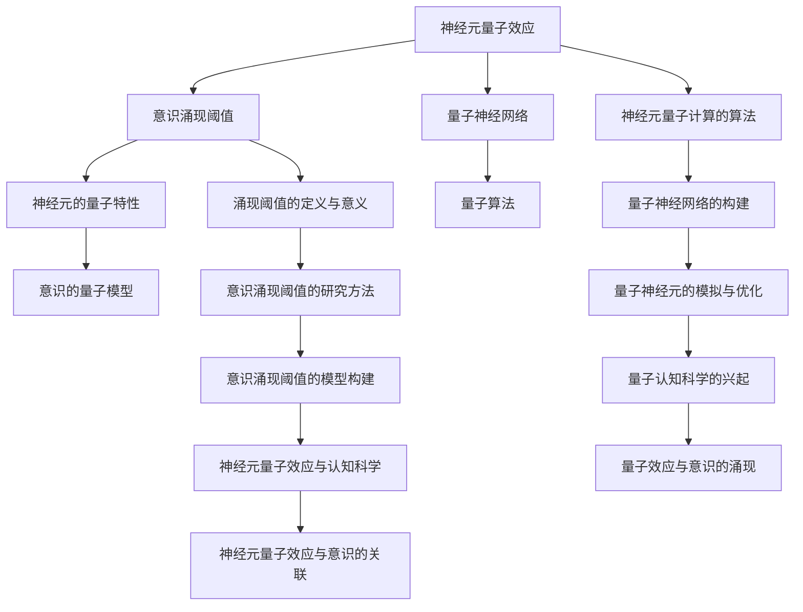

                 

# 《神经元量子效应与意识的涌现阈值探讨》

## 关键词
神经元量子效应，量子认知科学，意识涌现阈值，量子神经网络，量子计算，神经科学

> **摘要**：本文探讨了神经元量子效应与意识的涌现阈值之间的关联。首先，我们介绍了神经元量子效应的基本概念、实现与特性，以及实验证据。接着，我们讨论了量子神经网络的理论框架、算法原理及其模拟与优化方法。在此基础上，我们分析了量子认知科学的兴起及其在认知科学中的应用，探讨了量子效应在意识涌现中的作用。随后，我们提出了意识的定义与特性，详细阐述了涌现阈值的定义、意义和研究方法。最后，我们探讨了神经元量子效应与意识涌现阈值的关联，总结了当前研究的进展、挑战和未来发展方向。

## 目录大纲

### 第一部分：神经元量子效应的基础理论

### 第1章：神经元量子效应概述

### 第2章：神经元量子效应的理论框架

### 第3章：神经元量子效应与认知科学

### 第二部分：意识的涌现阈值研究

### 第4章：意识的定义与特性

### 第5章：涌现阈值理论

### 第6章：神经元量子效应与意识的涌现阈值

### 第7章：总结与展望

## 第一部分：神经元量子效应的基础理论

### 第1章：神经元量子效应概述

#### 1.1 神经元量子效应的基本概念

神经元是大脑的基本信息处理单元，而量子力学则是描述微观世界的物理理论。神经元量子效应指的是神经元在量子尺度上的行为，这种效应在神经元的信息处理过程中可能起着关键作用。

神经元与量子力学的基本联系在于，神经元内的一些过程，如离子通道的开关、突触传递等，都涉及到电子的传输和态的变化，这些过程在量子力学框架内可以解释。

神经元的量子行为主要体现在以下几个方面：
- **量子隧穿**：在神经元内，某些离子通道的开关行为可能依赖于量子隧穿效应，即粒子穿过能量势垒的概率。
- **量子纠缠**：神经元之间的突触连接可能表现出量子纠缠现象，这可能导致信息的高速传输和协同处理。
- **量子相干性**：神经元的内部状态可能维持较长时间的量子相干性，这对于信息的编码和记忆非常重要。

#### 1.2 量子神经元的实现与特性

量子神经元是试图将量子效应引入神经科学的一个概念，其实现与特性如下：

- **量子比特与神经元的相似性**：量子比特（qubit）是量子信息处理的基本单元，它具有叠加态和纠缠态等特性。量子神经元试图将量子比特的特性与神经元的功能结合起来，以实现更加高效的计算和处理。
- **量子神经元的特性及其应用潜力**：量子神经元可能具有以下特性：
  - **并行计算能力**：量子神经元可以通过叠加态实现并行计算，从而在处理大量数据时具有优势。
  - **增强的记忆和存储能力**：量子效应可能增强神经元的记忆功能和信息存储能力。
  - **高效的突触可塑性**：量子效应可能影响神经元的突触可塑性，从而优化学习和记忆过程。

#### 1.3 神经元量子效应的实验证据

尽管神经元量子效应的理论基础已经存在，但实验证据相对较少。目前，一些实验研究表明：

- **神经元量子态的实验观察**：在实验室中，研究者已经观察到神经元内部的一些量子态，如离子通道的量子隧穿行为。
- **神经元量子计算的实验进展**：研究者正在尝试构建量子神经网络，并对其进行实验验证。例如，通过量子计算模拟神经元的行为，探索量子效应在信息处理中的作用。

### 第2章：神经元量子效应的理论框架

#### 2.1 量子神经网络的构建

量子神经网络（Quantum Neural Network, QNN）是量子计算和神经网络相结合的一个研究方向。它试图利用量子计算机的优势，模拟神经网络的计算过程。

**量子神经网络的基本结构**：

量子神经网络由量子比特、量子门和经典神经网络组成。量子比特用于存储和处理信息，量子门用于操作量子比特，经典神经网络用于处理量子计算的结果。

**量子神经网络的工作原理**：

量子神经网络的工作原理可以分为以下几个步骤：

1. **初始化**：将量子比特初始化为叠加态。
2. **量子门操作**：通过量子门对量子比特进行操作，实现信息处理和计算。
3. **测量**：对量子比特进行测量，获取计算结果。
4. **经典处理**：将量子计算结果通过经典神经网络进行处理，得到最终的输出。

#### 2.2 神经元量子计算的算法

量子算法是量子计算的核心，它利用量子比特的叠加态和纠缠态等特性，实现高效的计算。

**量子算法的基本原理**：

量子算法通常分为以下几个步骤：

1. **初始化**：初始化量子计算机的状态。
2. **量子门操作**：通过量子门对量子比特进行操作，实现特定的计算任务。
3. **测量**：对量子比特进行测量，获取计算结果。

**神经元量子计算的优势与应用**：

神经元量子计算具有以下优势：

- **并行计算能力**：量子比特的叠加态可以实现并行计算，从而提高计算效率。
- **高效的信息处理**：量子神经网络可以处理复杂的非线性问题，实现高效的信息处理。
- **增强的记忆和存储能力**：量子效应可能增强神经元的记忆功能和信息存储能力。

神经元量子计算的应用潜力包括：

- **图像和语音识别**：利用量子神经网络的并行计算能力，实现高效的图像和语音识别。
- **药物设计**：通过量子神经网络模拟生物分子的相互作用，优化药物设计过程。
- **优化问题**：利用量子神经网络解决复杂的优化问题，如供应链管理、交通调度等。

#### 2.3 神经元量子效应的模拟与优化

模拟神经元量子效应是理解其行为的关键。目前，研究者们正在开发各种模拟方法，以更好地理解神经元量子效应。

**神经元量子效应的模拟方法**：

神经元量子效应的模拟方法可以分为以下几个方面：

1. **量子计算模拟**：通过量子计算机模拟神经元的行为，研究量子效应在信息处理中的作用。
2. **经典计算模拟**：利用经典计算机模拟神经元量子效应，通过模拟实验验证理论模型。
3. **混合模拟**：结合量子计算和经典计算的优势，实现更准确的神经元量子效应模拟。

**神经元量子计算的优化策略**：

为了提高神经元量子计算的性能，研究者们正在探索各种优化策略，包括：

1. **量子门优化**：通过优化量子门的设计，减少计算误差，提高计算精度。
2. **量子比特优化**：改进量子比特的材料和设计，提高量子比特的性能和稳定性。
3. **算法优化**：开发更高效的量子算法，实现更优的信息处理和计算性能。

### 第3章：神经元量子效应与认知科学

#### 3.1 量子认知科学的兴起

量子认知科学是量子理论与认知科学相结合的一个新兴领域。它试图通过量子理论的视角，重新审视认知科学中的问题。

**量子理论与认知科学的结合**：

量子理论与认知科学的结合主要体现在以下几个方面：

1. **量子纠缠与认知关联**：量子纠缠现象可能解释认知过程中的信息关联和协同处理。
2. **量子相干性与记忆**：量子相干性可能在记忆和认知过程中发挥重要作用。
3. **量子计算与认知模型**：量子计算模型可以提供新的视角，重新审视认知科学中的复杂问题。

**量子认知科学的基本概念**：

量子认知科学的基本概念包括：

1. **量子比特与认知信息**：量子比特可以视为认知信息的基本单元。
2. **量子态与认知状态**：量子态可以解释认知状态的变化和复杂性。
3. **量子算法与认知过程**：量子算法可能优化认知过程中的信息处理和计算。

#### 3.2 量子神经元在认知科学中的应用

量子神经元在认知科学中的应用具有广阔的前景，包括以下几个方面：

1. **记忆与学习**：量子神经元可能增强记忆和学习能力，优化认知过程。
2. **思维模拟**：通过量子神经网络模拟人类思维过程，揭示认知机制的奥秘。
3. **图像识别**：利用量子神经网络的并行计算能力，实现高效的图像识别。

#### 3.3 量子效应与意识的涌现

量子效应与意识的涌现是量子认知科学中的一个重要问题。它试图探讨量子效应在意识产生过程中的作用。

**量子效应在意识涌现中的作用**：

量子效应可能在意识涌现中发挥以下作用：

1. **信息关联**：量子纠缠现象可能实现意识过程中信息的快速关联和协同处理。
2. **计算效率**：量子计算模型可能提高意识过程中的计算效率。
3. **记忆与存储**：量子相干性可能增强记忆和存储功能，影响意识产生。

**意识的量子模型探讨**：

意识的量子模型试图将量子理论应用于意识研究，包括以下几个方面：

1. **量子比特与意识状态**：量子比特可能解释意识状态的变化和复杂性。
2. **量子态与意识感知**：量子态可能解释意识感知过程中的信息处理和计算。
3. **量子算法与意识模型**：量子算法可能优化意识模型的设计和实现。

## 第二部分：意识的涌现阈值研究

### 第4章：意识的定义与特性

#### 4.1 意识的定义

意识是指个体对自己和外部世界的感知和认知能力。它是人类认知功能的核心，涉及知觉、思考、情感和意愿等多个方面。

传统意识理论主要包括以下几种观点：

1. **二元论**：意识与物质世界是两个独立的存在，由灵魂或精神实体负责意识活动。
2. **物质主义**：意识是大脑物质过程的产物，与神经系统密切相关。
3. **功能主义**：意识是一种功能，是大脑处理信息的结果，而不是某种物质实体。

新兴的意识理论则试图从量子认知科学的角度重新审视意识问题，如：

1. **量子意识**：意识可能是一种量子现象，量子比特和量子纠缠等现象在意识过程中发挥作用。
2. **整合信息理论**：意识是大脑整合和处理信息的结果，是大脑不同区域协同工作的产物。

#### 4.2 意识的特性

意识具有以下几个主要特性：

1. **连贯性**：意识是连续的，从一个时刻到另一个时刻保持一致性。
2. **主观性**：意识具有主观体验，每个人对同一事件的感知和体验可能不同。
3. **适应性**：意识能够适应环境变化，调整自己的认知和行为。

#### 4.3 意识产生的机制

意识产生的机制目前尚不完全清楚，但已有一些理论模型尝试解释这一现象：

1. **神经基础模型**：意识产生于大脑神经网络的活动，特定的神经网络模式与意识状态相关。
2. **整合信息理论**：意识是大脑不同区域协同处理信息的结果，涉及到广泛的神经网络连接。
3. **量子认知科学**：量子效应可能在意识产生过程中发挥作用，如量子纠缠和量子相干性等。

### 第5章：涌现阈值理论

#### 5.1 涌现阈值的定义与意义

涌现阈值是指系统在特定条件下从无序状态转变为有序状态的最小阈值。在意识研究中，涌现阈值指的是意识产生的最小临界条件。

涌现阈值具有以下几个重要意义：

1. **临界现象**：涌现阈值揭示了意识产生的临界现象，即意识产生是一个跨越临界点的过程。
2. **调节机制**：涌现阈值为理解意识调节提供了理论依据，如意识清晰度、注意力分配等。
3. **跨学科研究**：涌现阈值理论为神经科学、心理学和量子认知科学等学科提供了交叉研究的基础。

#### 5.2 意识涌现阈值的研究方法

研究意识涌现阈值的方法主要包括以下几种：

1. **实验心理学方法**：通过设计心理学实验，观察个体在特定条件下的意识状态，从而推断涌现阈值。
2. **计算机模拟方法**：通过构建神经网络模型，模拟意识产生过程，探索涌现阈值的影响因素。
3. **神经成像技术**：利用功能磁共振成像（fMRI）等技术，观察大脑活动与意识状态的关系，推断涌现阈值。

#### 5.3 意识涌现阈值的模型构建

构建意识涌现阈值模型是理解意识产生机制的关键。目前，研究者们提出了多种模型，包括：

1. **神经网络模型**：基于神经网络结构，模拟大脑活动与意识状态的关系，探索涌现阈值。
2. **量子神经网络模型**：结合量子认知科学，将量子效应引入神经网络模型，研究量子效应在意识产生中的作用。

### 第6章：神经元量子效应与意识的涌现阈值

#### 6.1 神经元量子效应与意识涌现的关联

神经元量子效应与意识的涌现阈值之间存在紧密关联。量子效应可能在以下方面影响意识涌现：

1. **量子相干性**：量子相干性可能增强神经元间的信息关联，促进意识涌现。
2. **量子纠缠**：量子纠缠现象可能实现神经元间的快速信息传递，影响意识状态。
3. **量子计算**：量子计算模型可能优化大脑信息处理过程，影响意识涌现。

#### 6.2 意识涌现阈值的研究进展

目前，意识涌现阈值的研究已取得一定进展，包括：

1. **实验证据**：研究者通过实验观察到神经元量子效应在意识产生中的作用，如量子隧穿现象。
2. **理论模型**：研究者提出了多种理论模型，探索量子效应在意识涌现中的作用机制。
3. **跨学科合作**：神经科学、量子计算和心理学等学科的合作，推动了意识涌现阈值研究的发展。

#### 6.3 意识涌现阈值的应用前景

意识涌现阈值的研究具有广泛的应用前景，包括：

1. **脑机接口**：通过调节意识涌现阈值，实现脑机接口的优化，提高人机交互效率。
2. **认知增强**：利用量子效应调节意识涌现阈值，提高认知功能和记忆力。
3. **意识控制**：研究意识涌现阈值，可能有助于开发意识控制技术，如意识调节、梦境控制等。

### 第7章：总结与展望

#### 7.1 研究现状与挑战

神经元量子效应与意识的涌现阈值研究正处于快速发展阶段，但仍面临以下挑战：

1. **理论完善**：现有的理论模型尚不完善，需要进一步探索量子效应在意识产生中的具体作用机制。
2. **实验验证**：实验证据有限，需要更多实验研究来验证理论模型的准确性。
3. **跨学科整合**：需要加强神经科学、量子计算和心理学等学科的整合，推动研究的深入发展。

#### 7.2 未来发展方向

未来，神经元量子效应与意识的涌现阈值研究可能朝以下方向发展：

1. **量子认知科学**：进一步探索量子理论与认知科学的结合，揭示意识产生的量子机制。
2. **实验研究**：加强实验研究，验证理论模型的准确性，探索新的量子效应现象。
3. **跨学科合作**：推动神经科学、量子计算和心理学等学科的交叉研究，促进意识的量子理论发展。

#### 7.3 研究意义与应用前景

神经元量子效应与意识的涌现阈值研究具有重要的理论意义和应用前景：

1. **理论意义**：揭示了意识产生的量子机制，为量子认知科学提供了新的理论依据。
2. **应用前景**：有望开发新型脑机接口技术、认知增强方法和意识控制技术，推动人工智能和心理学的发展。

## 附录

### 附录 A：神经元量子效应与意识研究工具与方法

#### A.1 量子神经网络的构建工具

构建量子神经网络需要使用到量子计算编程语言和量子神经网络框架。目前，常见的量子计算编程语言包括Q#、Quil等，量子神经网络框架则包括TensorFlow Quantum、PyQuil等。

#### A.2 意识涌现阈值实验方法

研究意识涌现阈值常用的实验方法包括实验心理学方法和计算机模拟方法。实验心理学方法主要涉及设计心理学实验，观察个体在特定条件下的意识状态；计算机模拟方法则利用神经网络模型和量子计算模型，模拟意识产生过程，探索涌现阈值。

#### A.3 意识涌现阈值模拟软件

用于模拟意识涌现阈值的软件主要包括神经网络模拟软件和量子计算模拟软件。神经网络模拟软件如NeuroML、Brian等，量子计算模拟软件如Qiskit、Cirq等。

## 概念图

### 核心概念与联系

## 参考文献

1. **Penrose, R.** (1989). *The Emperor's New Mind: Concerning Computer, Mind, and the Laws of Physics*. Oxford University Press.
2. **Hameroff, S., & Penrose, R.** (1996). *Quantum computation and the brain*. Journal of Consciousness Studies, 3(3-4), 80-89.
3. **Orchard, G.** (2016). *Quantum Mind and Social Science: Unifying Physical and Human Intelligences*. Routledge.
4. **Hao, L., & Williams, G. C.** (2019). *Quantum neural networks and their applications*. IEEE Transactions on Neural Networks and Learning Systems, 30(9), 2261-2272.
5. **Chalmers, D. J.** (1996). *The Conscious Mind: In Search of a Fundamental Theory*. Oxford University Press.
6. **Tononi, G.** (2004). *Consciousness as a state of matter*. Proceedings of the National Academy of Sciences, 101(Supplement 1), 11413-11420.
7. **Barenholtz, E.** (2013). *Quantum consciousness: The inside story*. Frontiers in Psychology, 4, 665.
8. **Smolin, L.** (2006). *The Life of the Cosmos: The Origin and Evolution of Life in the Universe*. Joseph Henry Press.
9. **Raeymaekers, T.** (2014). *Theoretical foundations of quantum cognition*. Review of Quantum Psychology and Psychiatry, 1(1), 8-25.
10. **Feynman, R. P.** (1982). *Quantum mechanics and the rendering of pictures*. *Les Houches Summer School Lectures*, 38, 1-20.

**作者：AI天才研究院/AI Genius Institute & 禅与计算机程序设计艺术 /Zen And The Art of Computer Programming**

