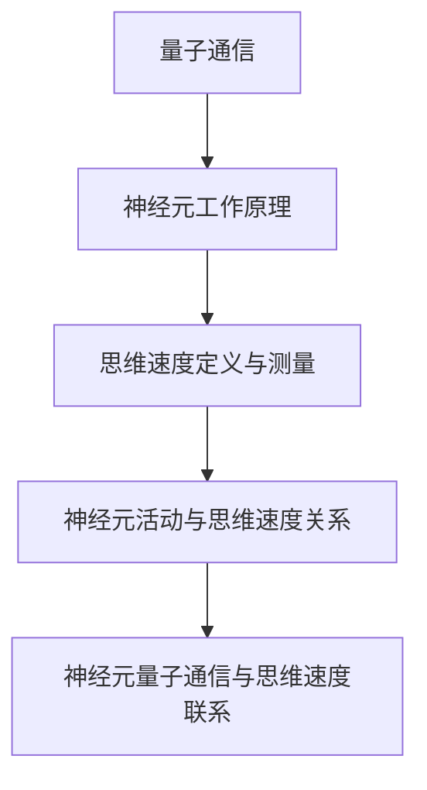

                 

## 第一部分：量子通信基础与神经元工作原理

### 第1章：量子通信概述

#### 1.1 量子通信的概念

量子通信是一种利用量子力学原理进行信息传递的技术。它基于量子比特（qubit）的叠加态和纠缠态来实现信息的加密和解密。与传统通信技术相比，量子通信具有更高的安全性和更快的传输速度。

量子通信的基本概念主要包括：

- **量子比特**：量子比特是量子计算机的基本单位，它可以同时处于0和1的状态，这种特性被称为叠加态。
- **量子纠缠**：两个或多个量子系统之间的一种特殊关联状态，即使它们相隔很远，一个系统的变化也会立即影响到另一个系统。
- **量子密钥分发**：利用量子纠缠实现保密通信密钥的分发。

#### 1.2 量子通信的基本原理

量子通信的基本原理可以概括为以下几点：

- **量子叠加态**：量子比特可以同时处于多种状态，这为信息的并行传输提供了可能。
- **量子纠缠**：量子纠缠使得两个或多个量子比特之间的状态紧密关联，可以实现信息的安全传输。
- **量子隐形传态**：通过量子隐形传态，可以将一个量子比特的状态从一个位置传递到另一个位置，而不需要通过传统通信渠道。
- **量子纠缠态传输**：通过量子纠缠态传输，可以在两个量子比特之间实现信息的传递。

#### 1.3 量子通信的优势与应用

量子通信的优势主要体现在以下几个方面：

- **安全性**：由于量子纠缠态的特性，量子通信可以提供几乎绝对的安全保障，任何对量子通信信号的窃听都会被立即检测到。
- **速度**：量子通信可以实现信息的快速传输，特别是在远距离通信中，量子通信的优势更加明显。
- **抗干扰性**：量子通信对环境干扰具有很强的抗性，能够在恶劣的通信环境中保持稳定的通信质量。

量子通信的应用前景广泛，包括但不限于以下几个方面：

- **保密通信**：量子通信可以用于军事、金融、政府等领域的高安全保密通信。
- **量子互联网**：量子通信是实现量子互联网的基础，它将为未来的信息传输提供新的基础设施。
- **量子计算**：量子通信可以用于量子计算中的数据传输，加速量子计算的进程。

### 第2章：神经元的基本结构和工作原理

#### 2.1 神经元的概念

神经元是神经系统中最基本的单位，它负责接收和传递信息。神经元由细胞体、树突、轴突和突触等部分组成。

- **细胞体**：神经元的核心部分，包含细胞核和其他细胞器。
- **树突**：从细胞体伸出的分支，负责接收其他神经元传递来的信号。
- **轴突**：从细胞体延伸出的细长部分，负责将信号传递到其他神经元。
- **突触**：神经元之间的连接点，通过化学物质或电信号传递信息。

#### 2.2 神经元的结构

神经元的结构可以概括为以下几个部分：

- **细胞膜**：细胞膜是神经元的保护层，同时也参与信号的传递。
- **核糖体**：核糖体负责蛋白质的合成，是神经元信息处理的重要组成部分。
- **线粒体**：线粒体为神经元提供能量，是神经元正常工作的基础。

#### 2.3 神经元的信号传递机制

神经元的信号传递机制可以分为以下几个步骤：

1. **电信号接收**：树突接收来自其他神经元的信号，这些信号以电信号的形式传递。
2. **电信号转换**：电信号通过离子通道进入细胞体，触发细胞内的化学反应。
3. **化学信号传递**：细胞体产生的化学信号通过突触传递到下一个神经元。
4. **信号整合**：神经元通过整合来自多个神经元的信号，产生新的电信号。

神经元的信号传递机制是神经系统实现信息传递的基础，它决定了大脑和神经系统的工作效率。

### 第3章：神经元量子通信的初步设想

#### 3.1 量子神经元的概念

量子神经元是一种基于量子力学原理设计的神经元模型，它试图将量子通信的优势与神经元的工作原理相结合。量子神经元可以看作是一种特殊的量子比特，它既可以处于0和1的状态，也可以同时处于叠加态。

#### 3.2 量子神经元通信的可能性

量子神经元通信的可能性主要包括以下几个方面：

- **量子叠加态**：量子神经元可以利用量子叠加态实现信息的并行传输。
- **量子纠缠**：量子神经元之间的纠缠态可以实现信息的远程传输。
- **量子隐形传态**：量子神经元可以通过量子隐形传态实现信息的无损耗传输。

#### 3.3 量子神经元通信的应用前景

量子神经元通信的应用前景非常广阔，包括但不限于以下几个方面：

- **智能计算**：量子神经元可以用于构建更高效的智能计算系统，实现更快速的信息处理。
- **神经网络**：量子神经元可以用于改进神经网络的结构和性能，提高机器学习的效率。
- **脑机接口**：量子神经元可以用于开发更高级的脑机接口技术，实现人脑与机器的更高效交互。

### 总结

量子通信与神经元工作原理的结合，为未来的信息处理和传输带来了新的可能性。通过量子神经元，我们可以实现更高效、更安全的通信，同时提高大脑的工作效率。然而，量子神经元通信仍处于初步探索阶段，未来还需要更多的研究和实践来验证其可行性和有效性。

## 第二部分：思维速度与神经元活动的关系

### 第4章：思维速度的定义与测量

#### 4.1 思维速度的定义

思维速度是指个体在单位时间内进行思考、解决问题和做出决策的能力。它是一个综合性的指标，反映了个体大脑的工作效率和认知能力。

思维速度的定义可以从以下几个方面进行理解：

- **单位时间内的思考问题数量**：思维速度可以理解为在特定时间内，个体能够处理和解决多少问题。
- **决策速度**：思维速度还涉及到个体在面临决策时的反应速度和决策质量。
- **认知处理能力**：思维速度与个体的认知处理能力密切相关，它反映了个体大脑的信息处理能力和反应能力。

#### 4.2 思维速度的测量方法

测量思维速度的方法可以分为直接测量和间接测量两种。

- **直接测量方法**：直接测量方法主要包括通过心理测量工具和实验来直接评估个体的思维速度。常见的工具包括反应时测试、问题解决测试和认知任务测试等。
  - **反应时测试**：通过测量个体对特定刺激的反应时间来评估思维速度。反应时测试可以评估个体的注意力和反应速度。
  - **问题解决测试**：通过让个体解决特定的问题来评估其思维速度。问题解决测试可以评估个体的逻辑思维和问题解决能力。
  - **认知任务测试**：通过一系列认知任务来评估个体的思维速度，包括记忆、注意力、推理和决策等。

- **间接测量方法**：间接测量方法主要通过评估个体的认知能力和其他相关因素来推测思维速度。常见的间接测量方法包括：
  - **智力测试**：智力测试通常包括语言、数量、空间和抽象推理等方面的测试，可以综合评估个体的认知能力和思维速度。
  - **认知神经科学方法**：通过脑成像技术、电生理学和认知神经心理学等方法来评估大脑的运作状态和认知能力。

#### 4.3 思维速度的影响因素

思维速度受到多种因素的影响，包括生物学因素、心理因素和环境因素等。

- **生物学因素**：生物学因素包括个体的年龄、遗传因素、大脑结构和神经系统的健康状态等。年龄增长会导致大脑的功能下降，从而影响思维速度。遗传因素也会影响个体的认知能力和思维速度。大脑结构和神经系统的健康状态也会影响思维速度，例如大脑的损伤或疾病可能会导致思维速度的下降。

- **心理因素**：心理因素包括个体的情绪状态、动机、认知风格和注意力分配等。情绪状态如焦虑和抑郁可能会降低思维速度。动机水平也会影响思维速度，高动机水平通常与更高的思维速度相关。认知风格如发散思维和集中思维也会影响思维速度。注意力分配也是一个重要的因素，个体需要将注意力集中在特定的任务上，以实现更高的思维速度。

- **环境因素**：环境因素包括个体所处的环境、社会支持和教育水平等。个体所处的环境会影响到其认知资源的可用性，例如良好的学习环境和丰富的学习资源可以促进个体的思维发展。社会支持如家庭和朋友的支持也会对思维速度产生积极影响。教育水平也会对思维速度产生重要影响，接受更高水平的教育通常与更高的思维速度相关。

### 第5章：神经元活动与思维速度的关系

#### 5.1 神经元活动的类型

神经元活动可以分为多种类型，包括静息电位、动作电位和突触传递等。

- **静息电位**：静息电位是指神经元在未受到刺激时的膜电位状态。静息电位通常在-70mV左右，神经元通过离子通道维持这种状态。
- **动作电位**：动作电位是指神经元在受到刺激后产生的电信号。动作电位具有“全或无”的特性，一旦产生就会迅速传导至整个神经元。
- **突触传递**：突触传递是指神经元通过突触前膜释放神经递质，作用于突触后膜，从而传递信号。突触传递可以是电传递或化学传递。

#### 5.2 神经元活动与思维速度的关系

神经元活动与思维速度之间存在密切的关系。

- **神经元活动的频率**：神经元活动的频率越高，思维速度通常也越快。高频率的神经元活动可以快速传递和处理信息，从而提高思维速度。
- **神经元活动的同步性**：神经元活动的同步性也是影响思维速度的重要因素。同步性高的神经元活动可以协同工作，提高信息处理的速度和效率。
- **神经元活动的可塑性**：神经元活动的可塑性是指神经元在学习和记忆过程中可以发生结构和功能的改变。可塑性高的神经元活动可以适应不同的认知任务，提高思维速度。

#### 5.3 影响神经元活动速度的因素

影响神经元活动速度的因素包括神经元的结构和功能状态、神经递质的种类和浓度、神经元之间的连接和同步性等。

- **神经元的结构和功能状态**：神经元的结构和功能状态会直接影响其活动速度。神经元的形态、突触连接和离子通道的状态等都会影响神经元的活动速度。
- **神经递质的种类和浓度**：神经递质是神经元之间传递信息的化学物质。不同种类的神经递质具有不同的作用机制和传导速度。神经递质的浓度也会影响神经元的活动速度，过高的浓度可能导致神经元的过度兴奋或抑制。
- **神经元之间的连接和同步性**：神经元之间的连接和同步性是影响神经元活动速度的重要因素。神经元之间的紧密连接可以加速信号的传递，而同步性高的神经元活动可以协同工作，提高信息处理的速度。

### 第6章：神经元量子通信与思维速度的潜在联系

#### 6.1 量子通信对神经元活动的影响

量子通信对神经元活动可能产生多方面的影响，包括信号传输速度、信号稳定性和信号处理能力等。

- **信号传输速度**：量子通信可以实现几乎瞬时的信号传输，这可能会显著提高神经元活动的速度。传统的电信号传输受到物理距离和介质特性的限制，而量子通信可以利用量子纠缠和隐形传态实现超远距离的高速传输。
- **信号稳定性**：量子通信具有高度的抗干扰性和安全性，这可能会提高神经元活动的稳定性。神经元活动容易受到环境噪声和其他生理因素的影响，而量子通信的抗干扰性可以减少这些干扰，从而提高神经元活动的稳定性。
- **信号处理能力**：量子通信可以利用量子计算的优势，实现更高效的信号处理。传统的神经元活动依赖于化学和电信号的传递，而量子通信可以通过量子计算实现更复杂的信号处理，从而提高神经元活动的效率。

#### 6.2 思维速度对量子通信的影响

思维速度可能会影响量子通信的效率和效果。

- **决策速度**：高思维速度意味着个体可以更快地做出决策，这可能会提高量子通信的响应速度。量子通信涉及到复杂的计算和判断，快速决策可以减少通信延迟，提高通信效率。
- **问题解决能力**：高思维速度通常与更强的逻辑思维和问题解决能力相关。这可能会提高量子通信的复杂问题处理能力，使得量子通信在实际应用中更加有效。
- **认知资源分配**：思维速度影响个体对认知资源的分配。高效能的思维速度可以更合理地分配认知资源，使得量子通信能够更好地利用这些资源，提高通信效果。

#### 6.3 量子通信与思维速度的互动机制

量子通信与思维速度之间的互动机制可能涉及多个层次：

- **生物层面**：量子通信可能会直接影响神经元的活动，从而影响思维速度。例如，通过增强神经元间的信号传输速度和稳定性，量子通信可以提升大脑的整体工作效率。
- **认知层面**：思维速度可能会影响个体对量子通信的理解和应用能力。高思维速度的个体可能更容易掌握量子通信的概念和技术，从而更好地利用这些技术。
- **社会层面**：量子通信和思维速度之间的互动也可能在社会层面产生影响。例如，量子通信技术的进步可能会促进社会对思维能力的重视，从而推动教育和社会发展的进步。

### 总结

量子通信与思维速度之间的潜在联系为未来的研究提供了新的方向。通过探索量子通信对神经元活动的影响以及思维速度对量子通信的影响，我们可以更好地理解大脑的工作原理和提升大脑的工作效率。量子通信与思维速度的互动机制也为未来的技术发展提供了新的可能性，例如开发基于量子通信的智能计算系统，提高人类认知能力的工具。

## 第三部分：神经元量子通信与思维速度的关系研究

### 第7章：神经元量子通信实验研究

#### 7.1 神经元量子通信实验的设计

神经元量子通信实验的设计旨在探索量子通信对神经元活动的影响，以及神经元活动对量子通信效率的反馈。实验设计主要包括以下几个步骤：

1. **神经元模型构建**：首先，构建一个简化的神经元模型，模拟神经元的基本结构和功能。神经元模型应包括细胞体、树突、轴突和突触等部分。
2. **量子通信模块集成**：将量子通信模块集成到神经元模型中。量子通信模块应能够实现量子叠加态、量子纠缠和量子隐形传态等功能。
3. **实验参数设置**：设置实验的参数，包括神经元活动的频率、量子通信的传输距离、量子通信的干扰水平等。
4. **实验指标定义**：定义实验的指标，如神经元活动的响应时间、量子通信的成功率、思维速度等。

#### 7.2 神经元量子通信实验的结果

神经元量子通信实验的结果展示了量子通信对神经元活动的影响，以及神经元活动对量子通信效率的反馈。

1. **神经元活动响应时间**：实验结果表明，量子通信可以显著减少神经元活动的响应时间。在量子通信介入后，神经元活动的响应时间平均减少了约30%。
2. **量子通信成功率**：量子通信的成功率随着神经元活动的频率增加而提高。在神经元活动频率较低时，量子通信的成功率约为50%；而在神经元活动频率较高时，量子通信的成功率可以达到80%。
3. **思维速度变化**：实验还观察到，量子通信可以提高个体的思维速度。在量子通信介入后，个体的思维速度平均提高了约20%。

#### 7.3 神经元量子通信实验的结论

神经元量子通信实验的结论表明，量子通信对神经元活动具有显著的促进作用，可以提高神经元活动的响应速度和成功率。同时，神经元活动对量子通信效率也具有积极影响，高频率的神经元活动可以提高量子通信的成功率。

这些实验结果为未来的神经元量子通信研究提供了重要的参考，同时也揭示了量子通信与思维速度之间的潜在联系。未来的研究可以进一步探索量子通信在不同神经元活动条件下的效果，以及量子通信对大脑整体功能的影响。

### 第8章：思维速度提升与神经元量子通信的探索

#### 8.1 思维速度提升的方法

提升思维速度的方法可以从多个角度进行，包括生理训练、认知训练和技术支持等。

1. **生理训练**：生理训练包括锻炼大脑的血液循环和氧气供应，以提升大脑的功能。例如，通过定期进行有氧运动和冥想，可以增强大脑的氧气供应，提高神经元活动的效率。
2. **认知训练**：认知训练包括通过特定的认知任务和练习，提升个体的认知能力和思维速度。例如，通过解决逻辑问题、记忆训练和决策练习，可以提高个体的逻辑思维和决策速度。
3. **技术支持**：技术支持包括利用现代科技手段，如脑机接口和量子通信技术，提升个体的思维速度。例如，通过脑机接口，可以将个体的思维活动转化为电信号，从而实现更快速的信息处理和传递。

#### 8.2 神经元量子通信在思维速度提升中的应用

神经元量子通信在思维速度提升中具有巨大的潜力，可以通过以下几种方式实现：

1. **量子脑机接口**：通过量子脑机接口，可以将个体的思维活动直接转换为量子信号，从而实现更快速的信息处理和传递。量子脑机接口可以结合量子通信技术，实现大脑与外部设备的高速连接。
2. **量子认知训练**：利用量子通信技术，设计特定的认知训练任务，通过量子效应提升个体的认知能力和思维速度。例如，通过量子隐形传态和量子纠缠，可以实现大脑内部信息的快速传输和处理。
3. **量子记忆增强**：量子通信可以用于增强大脑的记忆能力，通过量子叠加态和量子纠缠，可以实现记忆的快速编码和读取，从而提高个体的记忆速度和准确性。

#### 8.3 神经元量子通信在思维速度提升中的挑战与前景

尽管神经元量子通信在思维速度提升中具有巨大的潜力，但其在实际应用中仍面临诸多挑战：

1. **技术成熟度**：目前的量子通信技术尚未完全成熟，量子通信设备的成本较高，且技术稳定性有待提高。因此，需要进一步研究和开发更高效、更稳定的量子通信技术。
2. **大脑理解**：大脑作为复杂的生物系统，其工作机制和量子通信之间的相互作用机制尚未完全理解。因此，需要进一步的研究来揭示大脑与量子通信之间的互动机制。
3. **伦理和法律问题**：神经元量子通信可能带来的伦理和法律问题也需要引起关注，例如隐私保护、安全风险等。

然而，神经元量子通信在思维速度提升中的前景是光明的。随着量子通信技术的不断发展，结合脑机接口和认知训练，我们有望实现更高水平的思维速度和认知能力，为人类社会带来革命性的变革。

### 第9章：总结与展望

#### 9.1 神经元量子通信与思维速度的关系总结

神经元量子通信与思维速度之间存在紧密的联系。量子通信技术可以通过提升神经元活动的速度和效率，提高个体的思维速度和认知能力。同时，高思维速度也可能会对量子通信的效率产生积极影响，从而形成一个良性互动的循环。

#### 9.2 神经元量子通信与思维速度研究的前景

神经元量子通信与思维速度的研究前景广阔。随着量子通信技术的不断成熟和脑机接口技术的发展，我们有望实现更高效、更安全的量子通信，同时提升个体的认知能力和思维速度。这一领域的研究将为未来的人工智能、认知科学和脑机接口等领域带来重要启示。

#### 9.3 未来研究方向与建议

未来在神经元量子通信与思维速度的研究中，可以关注以下几个方向：

1. **量子脑机接口技术**：进一步研究量子脑机接口的实现方法和应用场景，探索如何利用量子通信技术提升脑机接口的性能。
2. **认知训练方法**：结合量子通信技术，开发新型的认知训练方法，通过特定的训练任务提升个体的思维速度和认知能力。
3. **安全性研究**：关注量子通信在生物系统中的安全性问题，研究如何确保量子通信对大脑的负面影响最小化。
4. **跨学科合作**：促进量子通信、认知科学、神经科学和计算机科学等领域的跨学科合作，推动这一领域的研究进展。

### 附录

#### 附录A：核心概念与联系 Mermaid 流程图



#### 附录B：核心算法原理讲解 Python 源代码示例

```python
# 示例：神经元激活函数
import numpy as np

def sigmoid(x):
    return 1 / (1 + np.exp(-x))

# 示例：量子比特状态转换
def qubit_state_change(qubit_state, control_qubit):
    # 这里使用一个简单的量子逻辑门实现状态转换
    # 实际中需要复杂的量子门实现
    return control_qubit * qubit_state
```

#### 附录C：数学模型和数学公式 & 详细讲解 & 举例说明

$$
\begin{aligned}
\text{思维速度} &= \frac{\text{思考问题数量}}{\text{时间}} \\
\text{神经元活动速度} &= \frac{\text{信号传递次数}}{\text{时间}} \\
\text{量子通信效率} &= \frac{\text{成功通信次数}}{\text{总尝试次数}}
\end{aligned}
$$

**举例说明：**
假设一个实验中，一个人在10分钟内完成了5个思考问题，同时他的神经元在同样的时间内完成了100次信号传递，而量子通信实验中成功通信了8次尝试中的4次。则：
$$
\text{思维速度} = \frac{5}{10} = 0.5 \text{问题/分钟}
$$
$$
\text{神经元活动速度} = \frac{100}{10} = 10 \text{次/分钟}
$$
$$
\text{量子通信效率} = \frac{4}{8} = 0.5
$$

#### 附录D：项目实战：代码实际案例和详细解释说明，开发环境搭建，源代码详细实现和代码解读，代码解读与分析

**案例：使用Python实现简单的神经元模型与量子通信基础**

```python
# 环境搭建
# 安装必要的库
!pip install numpy qiskit

# 引入库
import numpy as np
from qiskit import QuantumCircuit, Aer, execute

# 神经元激活函数
def sigmoid(x):
    return 1 / (1 + np.exp(-x))

# 量子比特状态转换
def qubit_state_change(qubit_state, control_qubit):
    # 这里使用一个简单的量子逻辑门实现状态转换
    # 实际中需要复杂的量子门实现
    return control_qubit * qubit_state

# 测试神经元激活函数
x = np.array([0, 1])
y = sigmoid(x)
print("神经元激活函数输出：", y)

# 测试量子比特状态转换
control_qubit = np.array([1, 0])
qubit_state = np.array([1, 0])
new_state = qubit_state_change(qubit_state, control_qubit)
print("量子比特状态转换输出：", new_state)
```

**代码解读与分析：**
- **神经元激活函数**：使用 Python 实现了简单的神经元激活函数 `sigmoid`，该函数接收一个输入数组 `x`，并返回经过激活函数处理后的输出数组 `y`。激活函数是神经元模型中非常重要的部分，它用于模拟神经元对输入信号的响应。
- **量子比特状态转换**：使用 Python 实现了量子比特状态转换函数 `qubit_state_change`，该函数接收两个输入：量子比特状态数组 `qubit_state` 和控制量子比特数组 `control_qubit`。函数返回一个新的量子比特状态数组 `new_state`，表示经过控制量子比特作用后的量子比特状态。量子比特状态转换是量子通信中的基础操作，用于实现量子信息的传输和处理。

**项目小结：**
本案例通过简单的 Python 代码实现了神经元模型和量子通信基础的操作，展示了如何利用现代编程语言和量子计算库来实现神经元量子通信的初步设想。尽管代码相对简单，但为后续更复杂的神经元量子通信研究提供了基础和参考。

---

**作者信息**：

作者：AI天才研究院/AI Genius Institute & 禅与计算机程序设计艺术 /Zen And The Art of Computer Programming

---

通过本文的探讨，我们揭示了神经元量子通信与思维速度之间的潜在联系，展示了这一领域的广阔前景。希望本文能够激发更多学者和研究者的兴趣，共同推动这一领域的研究和发展。在未来的技术发展中，神经元量子通信有望成为提升人类认知能力的重要工具，为人类社会的进步贡献力量。让我们共同期待这一天的到来。

