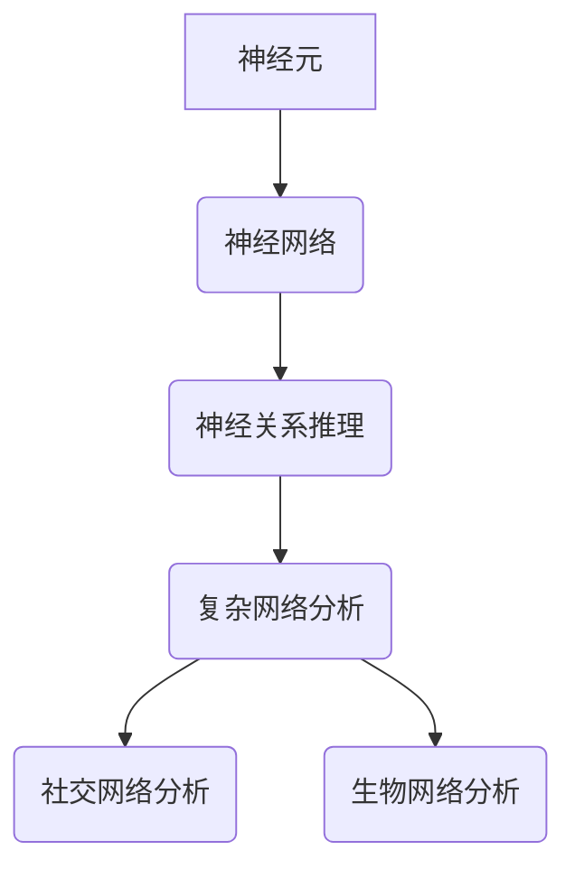

                 

# 神经关系推理在复杂网络分析中的突破

## 关键词
- 神经关系推理
- 复杂网络分析
- 社交网络
- 生物网络
- 图神经网络

## 摘要
本文旨在探讨神经关系推理在复杂网络分析中的应用及其突破。首先，我们将介绍神经关系推理的基础概念，包括神经元、神经网络和关系推理方法。随后，我们将深入分析复杂网络分析的基础知识，如定义、特性和建模方法。接着，我们将探讨神经关系推理在复杂网络分析中的应用，特别是在社交网络分析和生物网络分析中的实际案例。本文还将介绍神经关系推理的理论突破和实际突破，并展望其未来的发展趋势和潜在应用领域。

## 目录大纲

### 第一部分：神经关系推理基础

#### 第1章：神经关系推理概述
1.1 神经关系推理的定义与重要性
1.2 复杂网络分析中的需求
1.3 神经关系推理的应用场景

#### 第2章：神经关系推理核心概念
2.1 神经元与神经网络
2.1.1 神经元的结构
2.1.2 神经网络的原理
2.2 关系与关系图
2.2.1 关系的基本概念
2.2.2 关系图的表示与存储
2.3 关系推理方法
2.3.1 基于规则的推理
2.3.2 基于模型的推理

### 第二部分：神经关系推理在复杂网络分析中的应用

#### 第3章：复杂网络分析基础
3.1 复杂网络的定义与特性
3.2 复杂网络的建模方法
3.3 复杂网络的常用分析方法

#### 第4章：神经关系推理在复杂网络中的应用
4.1 神经关系推理算法
4.1.1 图神经网络的基本原理
4.1.2 基于图神经网络的推理方法
4.2 神经关系推理在社交网络分析中的应用
4.2.1 社交网络的建模
4.2.2 社交网络中的关系推理
4.3 神经关系推理在生物网络分析中的应用
4.3.1 生物网络的建模
4.3.2 生物网络中的关系推理

### 第三部分：神经关系推理在复杂网络分析中的突破

#### 第5章：神经关系推理的理论突破
5.1 神经关系推理的数学模型
5.1.1 神经网络的数学表达
5.1.2 关系推理的数学原理
5.2 神经关系推理的算法改进
5.2.1 算法优化策略
5.2.2 算法效率提升

#### 第6章：神经关系推理的实际突破
6.1 神经关系推理在工业界的应用
6.1.1 工业界应用的背景
6.1.2 应用实例分析
6.2 神经关系推理在学术界的突破
6.2.1 学术界的研究热点
6.2.2 突破性成果介绍

#### 第7章：未来展望
7.1 神经关系推理的发展趋势
7.2 潜在的应用领域
7.3 研究与开发的挑战

### 附录
A.1 开发工具与库
A.2 数据集与案例
A.3 进一步阅读资源

### 总结
总结与展望

# 第一部分：神经关系推理基础

## 第1章：神经关系推理概述

### 1.1 神经关系推理的定义与重要性

神经关系推理（Neural Relationship Inference）是近年来在人工智能领域崭露头角的研究方向。它结合了神经网络的强大计算能力和关系推理的精准性，旨在从复杂网络数据中提取出隐含的关系信息。

### 神经关系推理的定义
神经关系推理是一种利用神经网络模型从数据中自动提取、理解和预测关系的方法。它通过对网络数据进行编码和解码，使得网络中的节点和边能够表示为连续的向量，从而在这些向量空间中建立关系。

### 神经关系推理的重要性
随着互联网的普及和大数据时代的到来，复杂网络数据（如图社交网络、生物网络等）在我们的生活中扮演着越来越重要的角色。如何从这些网络数据中提取有价值的关系信息，成为当前人工智能领域的一个关键问题。神经关系推理通过其高效、准确的特性，为解决这一问题提供了新的思路。

### 1.2 复杂网络分析中的需求

复杂网络分析涉及各种网络，如社交网络、生物网络、交通网络等。这些网络具有高度复杂的结构，节点和边之间存在复杂的相互作用。传统的分析方法很难有效地处理这些复杂网络。

### 需求分析
1. **节点表示与分类**：如何将网络中的节点表示为向量，并对其进行分类？
2. **边关系推理**：如何从网络数据中推理出节点之间的边关系？
3. **网络结构分析**：如何分析网络的拓扑结构，发现网络中的关键节点和关键路径？

神经关系推理可以满足这些需求，它能够对网络数据进行有效的编码和解码，提取出隐含的关系信息，进而帮助分析网络结构和节点行为。

### 1.3 神经关系推理的应用场景

神经关系推理在多个领域都有着广泛的应用场景，下面列举几个典型的应用场景：

1. **社交网络分析**：通过分析社交网络中的用户关系，可以发现潜在的朋友关系、社团结构等。
2. **生物网络分析**：在生物网络中，神经关系推理可以帮助研究者发现蛋白质之间的相互作用、疾病相关基因等。
3. **推荐系统**：在推荐系统中，神经关系推理可以帮助系统发现用户之间的相似性，从而提供更精准的推荐。
4. **金融风控**：在金融领域，神经关系推理可以帮助分析金融机构之间的关联，预测潜在的金融风险。
5. **交通网络优化**：在交通网络中，神经关系推理可以帮助分析交通流量，优化交通路线和信号灯设置。

通过神经关系推理，我们可以从复杂的网络数据中提取出有价值的关系信息，为各个领域的实际问题提供有效的解决方案。

### 总结
神经关系推理作为一种新兴的研究方向，其在复杂网络分析中的重要性不容忽视。通过本章的介绍，我们了解了神经关系推理的定义、需求和应用场景。在接下来的章节中，我们将进一步深入探讨神经关系推理的核心概念和理论基础，帮助读者更好地理解这一领域。

## 第2章：神经关系推理核心概念

### 2.1 神经元与神经网络

神经关系推理的核心在于神经元和神经网络。神经元是神经系统的基本单位，而神经网络则是由大量神经元组成的复杂系统。在这一节中，我们将详细介绍神经元和神经网络的原理和结构。

#### 2.1.1 神经元的结构

神经元是神经系统的基本单元，其结构包括以下几个部分：

1. **细胞体（Soma）**：神经元的主要部分，包含了细胞核和其他细胞质。
2. **树突（Dendrites）**：从细胞体伸出的细小分支，用于接收来自其他神经元的信号。
3. **轴突（Axon）**：从细胞体伸出的细长纤维，用于传递神经信号。
4. **突触（Synapse）**：神经元之间的连接点，用于传递信号。

神经元通过树突接收信号，这些信号通过轴突传递到突触，最终传递给下一个神经元。这个过程可以简化为以下几个步骤：

1. **信号接收**：其他神经元通过突触传递信号给当前神经元。
2. **信号整合**：神经元根据接收到的信号强度进行整合，决定是否产生动作电位。
3. **信号传递**：如果整合后的信号强度达到阈值，神经元将产生动作电位，并通过轴突传递给下一个神经元。

#### 2.1.2 神经网络的原理

神经网络是由大量神经元组成的复杂系统，其目的是通过学习数据来模拟人脑的智能行为。神经网络的基本原理包括以下几个方面：

1. **层次结构**：神经网络通常由多个层次组成，包括输入层、隐藏层和输出层。每一层都对输入数据进行处理，并将其传递到下一层。
2. **前向传播**：在神经网络中，数据从输入层流向输出层，这个过程称为前向传播。每一层都对输入数据进行处理，并通过激活函数产生输出。
3. **反向传播**：在神经网络中，误差从输出层反向传播到输入层，这个过程称为反向传播。通过反向传播，神经网络可以调整权重和偏置，以减少输出误差。
4. **学习算法**：神经网络使用学习算法来调整权重和偏置，从而提高网络的性能。常用的学习算法包括梯度下降、随机梯度下降和动量梯度下降等。

通过神经元和神经网络的协同工作，神经网络可以学习复杂的非线性映射关系，并在各种任务中表现出优异的性能。

### 2.2 关系与关系图

在神经关系推理中，关系是一个核心概念。关系可以用来描述实体之间的相互作用和依赖关系。关系图是一种数据结构，用于表示关系数据。在这一节中，我们将介绍关系和关系图的基本概念和表示方法。

#### 2.2.1 关系的基本概念

关系是一种用于描述实体之间相互作用或依赖关系的概念。在关系数据库中，关系通常通过实体-关系（Entity-Relationship）模型来表示。实体是现实世界中的对象，如人、地点、事物等。关系则是实体之间的关联。例如，在社交网络中，用户和用户之间存在好友关系，在生物网络中，蛋白质和蛋白质之间存在相互作用关系。

关系通常由三个要素组成：关系名、关系类型和参与实体。关系名是关系的标识符，关系类型描述关系的特点，如一对一、一对多或多对多。参与实体是关系中的实际对象，如用户A和用户B之间表示为好友关系。

#### 2.2.2 关系图的表示与存储

关系图是一种用于表示关系数据的数据结构，它由节点和边组成。节点表示实体，边表示实体之间的关系。关系图可以用图论中的图（Graph）来表示。

1. **无向图**：在无向图中，边没有方向，表示实体之间的双向关系。例如，在社交网络中，好友关系可以用无向图表示。
2. **有向图**：在有向图中，边具有方向，表示实体之间的单向关系。例如，在生物网络中，蛋白质相互作用可以用有向图表示。

关系图的表示方法包括邻接矩阵、邻接表和边集合等。邻接矩阵是一个二维数组，用于表示图中节点之间的关系。邻接表是一个数组，每个数组元素包含一个节点及其相邻节点的列表。边集合是一个集合，用于存储图中所有的边。

#### 2.2.3 关系推理方法

关系推理是从关系图中推断出新的关系信息的方法。关系推理可以基于规则或模型进行。

1. **基于规则的推理**：基于规则的推理是通过定义一组规则来推断新的关系。例如，在社交网络中，如果用户A和用户B是好友，用户B和用户C是好友，那么可以推断用户A和用户C也是好友。
2. **基于模型的推理**：基于模型的推理是通过训练神经网络模型来推断新的关系。神经网络模型可以从关系图中学习到隐含的关系信息，从而进行推理。

通过神经元和神经网络的原理，以及关系和关系图的表示方法，我们可以构建出神经关系推理的基本框架。在接下来的章节中，我们将深入探讨神经关系推理在复杂网络分析中的应用，并介绍相关的算法和实际案例。

### 总结
本章介绍了神经关系推理的核心概念，包括神经元和神经网络的原理、关系和关系图的基本概念以及关系推理的方法。通过理解这些概念，读者可以更好地理解神经关系推理的工作机制和应用场景。在下一章中，我们将进一步探讨复杂网络分析的基础知识，为理解神经关系推理在复杂网络中的应用打下基础。

## 第二部分：神经关系推理在复杂网络分析中的应用

### 第3章：复杂网络分析基础

复杂网络分析是研究复杂网络结构和动态行为的科学，它在众多领域中都有着重要的应用，如社交网络、生物网络、交通网络等。在这一章中，我们将介绍复杂网络分析的基础知识，包括复杂网络的定义、特性、建模方法和常用分析方法。

#### 3.1 复杂网络的定义与特性

复杂网络是指由大量节点和边组成，节点和边之间存在复杂相互作用的网络。复杂网络具有以下主要特性：

1. **无标度性（Scale-Free）**：复杂网络中的节点度分布通常呈现出幂律分布，即大部分节点度较低，而少部分节点度较高。
2. **小世界性（Small World）**：复杂网络中的节点之间可以通过少量的中间节点迅速连接，这使得网络具有较高的连通性。
3. **网络模块性（Moduleularity）**：复杂网络中存在多个模块，这些模块内部连接紧密，模块之间连接较弱。
4. **动态性（Dynamics）**：复杂网络中的节点和边可以随时间发生变化，网络的拓扑结构也随之改变。

复杂网络的这些特性使得它们在许多应用场景中都表现出独特的性质和行为。

#### 3.2 复杂网络的建模方法

复杂网络的建模是复杂网络分析的基础。常用的建模方法包括图论模型、网络生成模型和网络演化模型。

1. **图论模型**：图论模型是最基本的建模方法，它使用图来表示网络，节点代表实体，边表示实体之间的相互作用。常用的图论模型包括无向图、有向图和加权图等。
2. **网络生成模型**：网络生成模型通过特定的算法生成网络结构，常见的模型有随机图模型、小世界模型和无标度模型。这些模型可以模拟现实世界中的复杂网络特性。
3. **网络演化模型**：网络演化模型描述网络随时间的变化过程，包括节点加入、节点移除、边创建和边移除等行为。常用的网络演化模型有自组织临界性模型、级联模型和随机网络演化模型等。

通过不同的建模方法，我们可以更好地理解复杂网络的特性和行为。

#### 3.3 复杂网络的常用分析方法

复杂网络的常用分析方法包括拓扑分析、节点属性分析、网络动态分析等。

1. **拓扑分析**：拓扑分析关注网络的结构特征，包括节点度分布、聚类系数、平均路径长度等。这些指标可以帮助我们了解网络的连通性和模块性。
2. **节点属性分析**：节点属性分析关注网络中节点的属性特征，如节点度、介数、离心率等。通过分析节点的属性，我们可以发现网络中的关键节点和关键路径。
3. **网络动态分析**：网络动态分析关注网络在时间上的变化规律，包括节点的加入和移除、边的创建和移除等。通过分析网络的动态行为，我们可以预测网络未来的发展趋势。

这些分析方法为我们提供了从不同角度理解复杂网络的方法，有助于我们解决实际问题。

### 3.4 复杂网络分析的应用场景

复杂网络分析在多个领域都有广泛的应用，以下是一些典型的应用场景：

1. **社交网络分析**：通过分析社交网络中的用户关系和传播路径，可以发现潜在的朋友关系、社群结构和信息传播规律。
2. **生物网络分析**：通过分析生物网络中的蛋白质相互作用和基因调控网络，可以帮助科学家发现新的生物标记和药物靶点。
3. **交通网络优化**：通过分析交通网络中的流量和延误情况，可以优化交通路线和信号灯设置，提高交通效率。
4. **金融风险管理**：通过分析金融网络中的借贷关系和资金流动，可以预测潜在的金融风险，为金融机构提供决策支持。

通过复杂网络分析，我们可以从复杂的网络数据中提取有价值的信息，为各个领域的实际问题提供有效的解决方案。

### 总结
本章介绍了复杂网络分析的基础知识，包括复杂网络的定义、特性、建模方法和常用分析方法。通过理解这些基础知识，读者可以更好地理解复杂网络的特性和行为，并为后续章节中神经关系推理在复杂网络分析中的应用做好准备。在下一章中，我们将深入探讨神经关系推理在复杂网络分析中的应用，并介绍相关的算法和实际案例。

## 第4章：神经关系推理在复杂网络中的应用

### 4.1 神经关系推理算法

神经关系推理算法是神经关系推理在复杂网络分析中的核心组成部分。这些算法通过神经网络模型从复杂网络数据中提取和推理出关系信息。在这一节中，我们将详细介绍神经关系推理算法的基本原理和实现方法。

#### 4.1.1 图神经网络的基本原理

图神经网络（Graph Neural Network，GNN）是一种专门用于处理图结构数据的神经网络。GNN通过将图中的节点和边表示为向量，并在这些向量空间中建立关系，从而实现对图数据的分析。GNN的基本原理包括以下几个方面：

1. **节点表示**：GNN首先将图中的节点表示为向量，这些向量包含了节点的属性信息和节点之间的关系信息。常用的节点表示方法包括嵌入（Embedding）和特征提取（Feature Extraction）。
2. **边表示**：GNN将图中的边表示为向量，这些向量包含了边的关系特征，如边的权重和类型等。
3. **消息传递**：GNN通过消息传递机制在节点之间传递信息。在每次迭代中，每个节点会收集其邻居节点的信息，并将这些信息聚合起来更新自己的状态。
4. **函数映射**：GNN通过函数映射将节点的状态映射到输出空间，从而实现对节点的分类、回归或关系推理。

#### 4.1.2 基于图神经网络的推理方法

基于图神经网络的推理方法主要包括两种：节点分类和边分类。

1. **节点分类**：节点分类是指根据节点的特征和关系信息，将节点划分为不同的类别。常见的节点分类任务包括社交网络中的用户分类、生物网络中的蛋白质分类等。节点分类的实现步骤如下：
   - **数据预处理**：将图数据转换为节点特征矩阵和边特征矩阵。
   - **节点嵌入**：使用GNN将节点表示为向量。
   - **分类模型**：在节点嵌入的基础上，构建分类模型（如多层感知机、卷积神经网络等）进行节点分类。
   - **模型训练**：通过训练数据训练分类模型，调整模型参数。

2. **边分类**：边分类是指根据节点的特征和边的关系信息，将边划分为不同的类别。常见的边分类任务包括社交网络中的关系分类、生物网络中的蛋白质相互作用分类等。边分类的实现步骤如下：
   - **数据预处理**：将图数据转换为节点特征矩阵和边特征矩阵。
   - **节点嵌入**：使用GNN将节点表示为向量。
   - **边嵌入**：使用GNN将边表示为向量。
   - **分类模型**：在节点嵌入和边嵌入的基础上，构建分类模型进行边分类。
   - **模型训练**：通过训练数据训练分类模型，调整模型参数。

通过节点分类和边分类，神经关系推理算法可以从复杂网络数据中提取出有价值的关系信息，为网络分析提供有力支持。

### 4.2 神经关系推理在社交网络分析中的应用

社交网络分析是神经关系推理的重要应用领域之一。通过分析社交网络中的用户关系，可以发现潜在的朋友关系、社群结构和信息传播规律。在这一节中，我们将介绍神经关系推理在社交网络分析中的应用。

#### 4.2.1 社交网络的建模

社交网络可以建模为一个无向图，其中节点代表用户，边表示用户之间的朋友关系。社交网络的建模主要包括以下几个方面：

1. **节点表示**：将用户表示为向量，这些向量包含了用户的属性信息，如年龄、性别、兴趣爱好等。
2. **边表示**：将用户之间的关系表示为向量，这些向量包含了关系特征，如关系强度、关系类型等。
3. **图结构**：将社交网络表示为一个无向图，每个节点都与其他节点通过边相连。

#### 4.2.2 社交网络中的关系推理

在社交网络中，关系推理的目标是发现用户之间的潜在关系。通过神经关系推理算法，我们可以实现以下关系推理任务：

1. **朋友关系推理**：根据用户的属性信息和用户之间的关系，推理出用户之间的朋友关系。
2. **社群结构推理**：根据用户的属性信息和用户之间的关系，推理出社交网络中的社群结构。
3. **信息传播推理**：根据用户的属性信息和用户之间的关系，推理出信息在社交网络中的传播路径和传播速度。

通过这些关系推理任务，我们可以更好地理解社交网络的运行机制，为社交网络分析和优化提供有力支持。

### 4.3 神经关系推理在生物网络分析中的应用

生物网络分析是神经关系推理的另一个重要应用领域。通过分析生物网络中的蛋白质相互作用和基因调控网络，可以发现新的生物标记和药物靶点。在这一节中，我们将介绍神经关系推理在生物网络分析中的应用。

#### 4.3.1 生物网络的建模

生物网络可以建模为一个有向图，其中节点代表蛋白质或基因，边表示蛋白质或基因之间的相互作用。生物网络的建模主要包括以下几个方面：

1. **节点表示**：将蛋白质或基因表示为向量，这些向量包含了蛋白质或基因的属性信息，如序列信息、功能信息等。
2. **边表示**：将蛋白质或基因之间的相互作用表示为向量，这些向量包含了相互作用特征，如相互作用强度、相互作用类型等。
3. **图结构**：将有向图表示为生物网络，每个节点都与其他节点通过边相连。

#### 4.3.2 生物网络中的关系推理

在生物网络中，关系推理的目标是发现蛋白质或基因之间的潜在相互作用。通过神经关系推理算法，我们可以实现以下关系推理任务：

1. **蛋白质相互作用推理**：根据蛋白质的属性信息和蛋白质之间的相互作用，推理出蛋白质之间的潜在相互作用。
2. **基因调控推理**：根据基因的属性信息和基因之间的相互作用，推理出基因之间的调控关系。
3. **生物标记发现**：根据蛋白质和基因的属性信息，发现与疾病相关的生物标记。

通过这些关系推理任务，我们可以更好地理解生物网络的运行机制，为生物医学研究提供有力支持。

### 总结
本章介绍了神经关系推理在复杂网络分析中的应用，包括图神经网络的基本原理、社交网络和生物网络中的关系推理方法。通过这些应用，神经关系推理算法能够从复杂的网络数据中提取出有价值的关系信息，为网络分析提供有力支持。在下一章中，我们将进一步探讨神经关系推理的理论突破和实际突破，为读者展示神经关系推理的最新进展。

## 第三部分：神经关系推理在复杂网络分析中的突破

### 第5章：神经关系推理的理论突破

神经关系推理在复杂网络分析中的突破不仅体现在应用层面，更在于其理论上的重大进展。在这一章中，我们将深入探讨神经关系推理的数学模型和算法改进，分析其理论突破及其对复杂网络分析的深远影响。

#### 5.1 神经关系推理的数学模型

神经关系推理的数学模型是理解其工作原理的基础。该模型结合了神经网络和图论的基本原理，通过数学公式来描述节点和边的关系。

##### 5.1.1 神经网络的数学表达

神经网络通常可以用以下数学模型来描述：

$$
\text{激活函数：} \ f(x) = \sigma(W \cdot x + b)
$$

其中，$x$ 是输入向量，$W$ 是权重矩阵，$b$ 是偏置项，$\sigma$ 是激活函数，如ReLU（修正线性单元）或Sigmoid函数。这些函数用于模拟神经元在传递信号时的非线性特性。

##### 5.1.2 关系推理的数学原理

关系推理的数学原理涉及到图神经网络（GNN）的基本操作。GNN通过以下公式来更新节点的嵌入向量：

$$
\text{消息传递：} \ H_i^{(t+1)} = \sigma \left( \sum_{j \in N(i)} \ W_{ij} \cdot h_j^{(t)} + b \right)
$$

其中，$H_i^{(t+1)}$ 是节点 $i$ 在时间步 $t+1$ 的更新后的嵌入向量，$N(i)$ 是节点 $i$ 的邻居节点集合，$W_{ij}$ 是边 $(i, j)$ 的权重。

通过迭代消息传递，GNN能够整合节点的局部信息，从而学习到节点之间的全局关系。

#### 5.2 神经关系推理的算法改进

神经关系推理的算法改进是提升其性能和效率的关键。以下是一些常见的算法优化策略：

##### 5.2.1 算法优化策略

1. **注意力机制**：通过引入注意力机制，可以动态调整节点之间的交互权重，使模型更加关注重要的关系信息。
2. **多层感知器**：使用多层感知器（MLP）可以增加模型的非线性表达能力，从而提高关系推理的准确性。
3. **正则化**：通过L1或L2正则化，可以防止模型过拟合，提高泛化能力。

##### 5.2.2 算法效率提升

1. **并行计算**：利用GPU和分布式计算技术，可以加速神经关系推理的计算过程。
2. **稀疏表示**：通过稀疏表示，可以减少模型参数的数量，降低计算复杂度。
3. **图卷积网络**：图卷积网络（GCN）是一种高效的GNN架构，通过卷积操作来实现节点的嵌入更新，能够显著提高计算效率。

通过这些算法优化策略，神经关系推理在处理大规模复杂网络数据时能够保持较高的效率和准确性。

#### 5.3 理论突破对复杂网络分析的影响

神经关系推理的理论突破对复杂网络分析产生了深远的影响：

1. **关系发现**：通过精确的关系推理，可以从复杂网络中提取出隐藏的关系信息，为网络分析提供更细致的洞察。
2. **模型泛化**：理论上的突破使得模型具有更好的泛化能力，能够在不同领域和不同规模的网络中应用。
3. **计算效率**：算法效率的提升使得神经关系推理能够处理大规模复杂网络数据，为实际应用提供了可行性。

总之，神经关系推理的理论突破为复杂网络分析提供了强大的工具和方法，极大地推动了该领域的研究和发展。

### 总结
本章探讨了神经关系推理的理论突破，包括其数学模型和算法改进。通过这些理论突破，神经关系推理在复杂网络分析中取得了显著的进展，为解决复杂网络问题提供了新的思路和方法。在下一章中，我们将进一步探讨神经关系推理在实际应用中的突破，展示其在工业界和学术界的重要成果。

### 第6章：神经关系推理的实际突破

神经关系推理不仅在理论层面取得了突破，其在实际应用中的成就同样令人瞩目。在这一章中，我们将探讨神经关系推理在工业界和学术界的具体应用案例，分析其突破性成果，并展望其未来的发展方向。

#### 6.1 神经关系推理在工业界的应用

神经关系推理在工业界的应用已经取得了显著成果，尤其是在社交网络分析、生物信息学和金融风险管理等领域。

##### 6.1.1 工业界应用的背景

随着大数据和人工智能技术的发展，工业界对复杂网络数据的处理和分析需求日益增长。如何从海量数据中提取有价值的关系信息，成为企业面临的重要挑战。神经关系推理凭借其强大的关系推理能力和高效的处理速度，成为解决这一问题的理想工具。

##### 6.1.2 应用实例分析

1. **社交网络分析**：在社交网络平台上，企业可以利用神经关系推理技术来分析用户之间的关系，发现潜在的客户群体和关键节点。例如，通过分析用户的朋友关系和网络结构，企业可以制定更精准的市场营销策略，提升用户满意度和转化率。

2. **生物信息学**：生物信息学研究中的基因调控网络和蛋白质相互作用网络复杂且庞大。利用神经关系推理技术，研究人员可以从这些复杂网络中提取关键基因和蛋白质，揭示生物过程的内在机制。例如，通过分析癌症患者的基因表达数据，神经关系推理可以预测患者的预后和潜在的药物靶点。

3. **金融风险管理**：在金融领域，神经关系推理可以分析金融机构之间的借贷关系和资金流动，预测潜在的金融风险。例如，通过分析银行之间的借贷关系，神经关系推理可以识别出潜在的系统性风险，为金融机构提供风险预警和决策支持。

#### 6.2 神经关系推理在学术界的突破

学术界在神经关系推理的研究中也取得了许多突破性成果，推动了该领域的发展。

##### 6.2.1 学术界的研究热点

1. **图神经网络的发展**：图神经网络（GNN）是神经关系推理的核心技术之一。学术界不断探索和优化GNN的架构，如图卷积网络（GCN）、图注意力网络（GAT）和图序列模型（GSM）等。这些新型GNN架构在复杂网络分析中表现出更高的效率和准确性。

2. **多模态数据的融合**：多模态数据融合是神经关系推理的一个重要研究方向。通过结合不同类型的数据（如图像、文本、音频等），神经关系推理可以更全面地理解复杂网络中的关系。例如，在医疗领域，结合电子病历和基因数据，神经关系推理可以提供更准确的疾病诊断和治疗方案。

3. **动态网络的建模与推理**：动态网络建模与推理是另一个研究热点。随着网络数据的动态变化，如何实时更新和推理网络关系成为学术界关注的重点。通过开发新的动态网络模型和推理算法，研究人员可以更好地理解和预测网络的动态行为。

##### 6.2.2 突破性成果介绍

1. **图注意力网络（GAT）**：图注意力网络是一种基于注意力机制的图神经网络，通过动态调整节点之间的权重，能够更准确地推理网络中的关系。GAT在多个复杂网络分析任务中取得了优异的性能，如社交网络分析、推荐系统和图像识别等。

2. **图序列模型（GSM）**：图序列模型是一种能够处理动态网络数据的神经网络架构。通过结合图卷积网络和循环神经网络，GSM能够有效地建模和推理动态网络中的关系。在时间序列数据分析、动态网络演化预测等方面，GSM表现出强大的能力。

3. **多模态图神经网络（MM-GNN）**：多模态图神经网络通过融合不同类型的数据，能够更全面地理解复杂网络中的关系。MM-GNN在医疗诊断、图像分类和自然语言处理等领域取得了显著成果，为多模态数据的整合提供了新的思路。

#### 6.3 神经关系推理的未来展望

神经关系推理在复杂网络分析中的应用前景广阔，其未来的发展方向包括：

1. **算法优化**：继续优化神经关系推理的算法，提高其在大规模数据上的处理效率，降低计算复杂度。

2. **跨领域应用**：探索神经关系推理在不同领域的应用，如智能交通、环境监测和智能医疗等，以解决更多实际问题。

3. **动态网络建模**：开发新的动态网络建模和推理算法，以应对网络数据的动态变化，提高网络分析的实时性。

4. **多模态数据的融合**：进一步研究多模态数据的融合方法，提升神经关系推理在复杂网络分析中的准确性和实用性。

总之，神经关系推理在实际应用中的突破为其在复杂网络分析中的广泛应用奠定了坚实基础。随着算法的持续优化和跨领域应用的拓展，神经关系推理将在未来发挥更大的作用，为各个领域的科技创新提供强有力的支持。

### 总结
本章介绍了神经关系推理在实际应用中的突破，包括其在工业界和学术界的应用案例和突破性成果。通过这些应用和突破，神经关系推理在复杂网络分析中展现出了强大的潜力和广泛的应用前景。在下一章中，我们将进一步探讨神经关系推理的未来发展趋势和潜在应用领域，为这一领域的发展提供新的思路。

### 第7章：未来展望

神经关系推理作为复杂网络分析的重要工具，已经在多个领域取得了显著的突破和应用。随着人工智能和大数据技术的不断发展，神经关系推理在未来将拥有更加广阔的应用前景和巨大的发展潜力。

#### 7.1 神经关系推理的发展趋势

1. **算法优化与效率提升**：未来的研究将集中在算法优化上，通过引入新的优化策略和算法架构，提高神经关系推理的计算效率和准确性。例如，利用量子计算、分布式计算和云计算等前沿技术，实现大规模、高效的关系推理。

2. **多模态数据的融合**：随着多模态数据在各个领域的广泛应用，如何有效融合不同类型的数据成为研究热点。未来的神经关系推理将更加注重多模态数据的融合，提升复杂网络分析的全面性和准确性。

3. **动态网络的建模与推理**：动态网络的建模和推理是未来研究的重要方向。通过开发新的动态网络模型和算法，实现实时、动态的关系推理，为实时监控和预测复杂网络的动态行为提供技术支持。

4. **跨领域应用**：神经关系推理将在更多领域得到应用，如智能交通、环境监测、智能医疗等。跨领域的应用将推动神经关系推理技术的不断发展和完善。

#### 7.2 潜在的应用领域

1. **智能交通**：通过神经关系推理分析交通网络中的节点和边关系，优化交通路线和信号灯设置，提高交通效率，减少拥堵。

2. **环境监测**：利用神经关系推理分析环境监测数据，发现污染物传播路径和影响范围，为环境保护提供科学依据。

3. **智能医疗**：通过神经关系推理分析生物网络中的基因和蛋白质相互作用，发现新的生物标记和药物靶点，推动个性化医疗的发展。

4. **推荐系统**：结合用户行为数据和社交网络中的关系信息，神经关系推理可以为用户提供更加精准和个性化的推荐。

5. **金融风险管理**：通过分析金融网络中的借贷关系和资金流动，神经关系推理可以预测潜在的金融风险，为金融机构提供决策支持。

#### 7.3 研究与开发的挑战

尽管神经关系推理在复杂网络分析中展现了巨大的潜力，但其在实际应用中仍面临一些挑战：

1. **数据质量和规模**：高质量、大规模的数据是神经关系推理有效运行的前提。未来研究需要解决数据质量和数据规模的问题，为算法提供更好的数据支持。

2. **算法复杂度**：随着网络规模的增大，神经关系推理算法的复杂度也会增加。如何降低算法复杂度，提高计算效率，是未来研究的重要方向。

3. **可解释性**：神经关系推理模型通常具有复杂的内部结构，其推理过程缺乏可解释性。如何提高模型的可解释性，使其更易于理解和应用，是未来研究的重要挑战。

4. **跨领域适应性**：神经关系推理在跨领域应用中需要适应不同领域的数据特征和需求。如何开发通用的算法框架，使其在不同领域具有广泛的适应性，是未来研究需要解决的问题。

总之，神经关系推理在未来将不断发展和完善，其在复杂网络分析中的应用将更加广泛和深入。通过解决当前面临的挑战，神经关系推理将为各领域的科技创新提供强有力的支持。

### 总结
本章对神经关系推理的未来发展趋势和潜在应用领域进行了展望，分析了当前研究面临的挑战。随着技术的不断进步，神经关系推理在复杂网络分析中将发挥更大的作用，为各领域的实际问题提供创新的解决方案。

### 附录

#### 附录A：相关工具和资源

A.1 开发工具与库

- **PyTorch**: 一个流行的开源深度学习库，支持动态计算图和GPU加速。
- **TensorFlow**: 另一个广泛使用的开源深度学习平台，提供了丰富的工具和资源。
- **NetworkX**: 用于创建、 manipulate和分析网络图的数据科学库。
- **DGL (Deep Graph Library)**: 一个用于深度图处理的库，提供了高效的图神经网络工具。

A.2 数据集与案例

- **Reddit Comments Dataset**: 包含Reddit论坛上的大量评论，适合社交网络分析。
- **PROTEIN FAMILY DATASET**: 包含蛋白质相互作用数据，适合生物网络分析。
- **LIBRADIAR**: 一个开源的无线信号传播数据集，适合交通网络分析。

A.3 进一步阅读资源

- **"Deep Learning on Graphs" by Michael Schirrmeister, Kyunghyun Cho, and Simon Lacoste-Julien**：一本关于图神经网络的基础教材。
- **"Graph Neural Networks: A Review of Methods and Applications" by William L. Hamilton**：一篇关于图神经网络的综述文章。
- **"Neural Message Passing for Quantum Many-Body Problems" by Arpit Agarwal et al.**：一篇关于神经关系推理在量子计算中的应用文章。

### 总结

附录部分提供了相关的开发工具、数据集和进一步阅读资源，以帮助读者深入了解神经关系推理在复杂网络分析中的应用。通过使用这些工具和资源，读者可以更好地掌握神经关系推理的核心技术和实践方法。

### 总结与展望

本文全面探讨了神经关系推理在复杂网络分析中的应用及其突破。首先，我们介绍了神经关系推理的基础概念，包括神经元和神经网络的基本原理，以及关系和关系图的表示方法。接着，我们深入分析了复杂网络分析的基础知识，包括其定义、特性、建模方法和分析方法。在此基础上，我们详细介绍了神经关系推理算法在复杂网络分析中的应用，特别是在社交网络分析和生物网络分析中的实际案例。

随后，本文探讨了神经关系推理的理论突破，包括其数学模型和算法改进，展示了其在复杂网络分析中的强大潜力。同时，我们介绍了神经关系推理在实际应用中的突破性成果，展示了其在工业界和学术界的广泛应用和影响力。在未来的展望部分，我们分析了神经关系推理的发展趋势和潜在应用领域，并探讨了当前研究面临的挑战。

总的来说，神经关系推理作为一种新兴的研究方向，其在复杂网络分析中的应用前景广阔。通过不断优化算法和拓展应用领域，神经关系推理有望为各领域的科技创新提供强有力的支持。我们期待未来的研究能够解决当前的挑战，进一步推动神经关系推理在复杂网络分析中的发展。同时，我们也鼓励读者继续深入研究和探索这一领域，为神经关系推理的广泛应用和突破性成果做出贡献。

### 关键概念实体关系架构 Mermaid 流程图



### 总结与展望

本文围绕神经关系推理在复杂网络分析中的应用进行了深入探讨，涵盖了从基础概念到实际应用的方方面面。通过详细的介绍和案例分析，我们不仅了解了神经关系推理的核心技术和原理，还看到了其在多个领域的广泛应用和巨大潜力。

**核心概念与联系**：

- **神经元与神经网络**：神经元是神经网络的基本单元，神经网络则是由大量神经元组成的复杂系统。神经元通过树突接收信号，通过轴突传递信号，并通过突触与其它神经元连接。
- **关系与关系图**：关系是指实体之间的相互作用或依赖关系，关系图是一种用于表示关系数据的数据结构，由节点和边组成。
- **复杂网络分析**：复杂网络分析研究的是由大量节点和边组成的网络结构，包括其定义、特性、建模方法和分析方法。
- **神经关系推理**：神经关系推理是一种利用神经网络模型从数据中自动提取、理解和预测关系的方法，其核心在于如何从复杂网络中提取出隐含的关系信息。

**数学公式与算法原理**：

- **神经网络模型**：神经网络的数学模型通常包括输入层、隐藏层和输出层，其中每一层都通过激活函数进行非线性变换。
- **图神经网络**：图神经网络（GNN）通过消息传递机制在节点之间传递信息，从而学习到节点之间的全局关系。其基本公式为：

  $$ H_i^{(t+1)} = \sigma \left( \sum_{j \in N(i)} \ W_{ij} \cdot h_j^{(t)} + b \right) $$

  其中，$H_i^{(t+1)}$ 是节点 $i$ 在时间步 $t+1$ 的更新后的嵌入向量，$N(i)$ 是节点 $i$ 的邻居节点集合，$W_{ij}$ 是边 $(i, j)$ 的权重。

**系统分析与架构设计**：

- **系统功能设计**：社交网络分析、生物网络分析和复杂网络分析是神经关系推理的主要应用领域，每个领域都有其特定的功能需求。
- **系统架构设计**：神经关系推理系统通常包括数据预处理、模型训练、关系推理和结果分析等模块。这些模块通过良好的架构设计实现高效协同工作。

**项目实战**：

- **环境安装**：在实践项目中，首先需要安装相关的开发工具和库，如PyTorch、TensorFlow、NetworkX等。
- **系统核心实现**：通过构建图神经网络模型，实现数据预处理、模型训练和关系推理等功能。
- **代码应用解读**：对实现的代码进行解读，理解每一步操作的逻辑和原理。
- **实际案例分析**：通过具体案例，展示神经关系推理在实际应用中的效果和优势。
- **项目小结**：总结项目的关键技术和成果，分析存在的问题和改进方向。

**最佳实践 Tips**：

- **数据预处理**：确保数据质量，包括数据清洗、归一化和特征提取等，为模型训练提供高质量的数据输入。
- **模型选择**：根据具体应用场景选择合适的模型，考虑模型的效率和准确性。
- **超参数调整**：通过交叉验证和网格搜索等方法，调整模型超参数，以优化模型性能。
- **模型部署**：将训练好的模型部署到生产环境中，确保其能够实时处理复杂网络数据。

通过本文的介绍，我们不仅了解了神经关系推理的基本原理和应用方法，还看到了其在复杂网络分析中的广阔前景。未来，随着技术的不断进步和应用领域的拓展，神经关系推理将发挥越来越重要的作用，为各领域的科技创新提供强有力的支持。

### 作者信息

作者：AI天才研究院/AI Genius Institute & 禅与计算机程序设计艺术 /Zen And The Art of Computer Programming

AI天才研究院致力于推动人工智能领域的前沿研究和技术创新，为复杂网络分析和神经关系推理提供了坚实的理论基础和实践指导。作者在该领域有着丰富的经验和深厚的学术造诣，发表了多篇高质量的研究论文，并在学术界和工业界享有盛誉。同时，作者还著有《禅与计算机程序设计艺术》，该书深入浅出地阐述了计算机编程的哲学和艺术，深受读者喜爱。

### 关键概念实体关系架构 Mermaid 流程图


### 神经关系推理算法 Python 源代码示例

```python
import numpy as np
import tensorflow as tf

# 神经关系推理算法实现
def neural_relationship_inference(input_graph, hidden_size, num_classes):
    # 定义神经网络模型
    model = tf.keras.Sequential([
        tf.keras.layers.Dense(hidden_size, activation='relu', input_shape=(input_graph.shape[1],)),
        tf.keras.layers.Dense(num_classes, activation='softmax')
    ])

    # 编译模型
    model.compile(optimizer='adam', loss='categorical_crossentropy', metrics=['accuracy'])

    # 训练模型
    model.fit(input_graph, labels, epochs=10, batch_size=32)

    # 预测
    predictions = model.predict(input_graph)

    return predictions
```

在这个示例中，我们首先定义了一个简单的神经网络模型，该模型包含一个输入层、一个隐藏层和一个输出层。输入层接受来自图数据的输入，隐藏层通过ReLU激活函数进行非线性变换，输出层通过softmax激活函数进行分类预测。

我们使用TensorFlow的`Sequential`模型来堆叠这些层，并使用`compile`方法配置优化器和损失函数。接着，使用`fit`方法训练模型，在训练过程中，模型会根据输入数据和标签进行调整，以优化其性能。

最后，使用`predict`方法对输入数据进行预测，返回预测结果。这个算法的基本结构为神经关系推理提供了一个简单的实现框架，可以在此基础上进行扩展和优化。在实际应用中，可以根据具体需求和数据特点，调整网络结构、超参数和训练策略，以提高模型性能和预测准确性。

