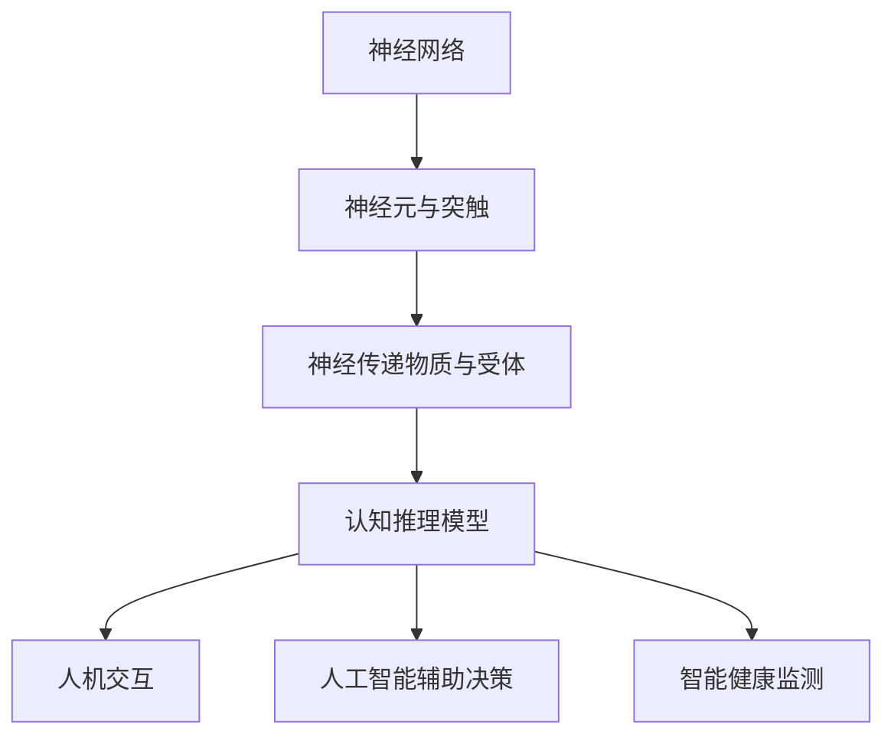

                 

# 神经科学启发的认知推理模型设计

## 摘要

神经科学启发的认知推理模型设计是一门结合神经科学与认知科学的跨学科技术，旨在通过模拟人脑的神经结构和功能来提升人工智能的认知推理能力。本文首先介绍了神经科学的基本概念和神经系统的工作原理，接着探讨了认知推理的概念和重要性。随后，文章详细介绍了神经科学启发的认知推理模型的设计原理、结构、运行机制以及数学模型，并通过具体应用场景展示了模型的实际效果。最后，文章讨论了认知推理模型面临的挑战和未来的发展前景。

关键词：神经科学、认知推理、模型设计、人工智能、神经网络

## 引言

随着人工智能技术的快速发展，机器学习、深度学习等算法在图像识别、自然语言处理等领域取得了显著成果。然而，尽管这些算法在处理大量数据和执行复杂任务方面表现出色，但在理解人类思维方式、进行高级认知推理方面仍存在明显不足。传统的人工智能算法往往基于统计学和数学模型，缺乏对人类大脑认知机制的深入理解。因此，探索一种能够模拟人脑认知过程的模型，从而提升人工智能的认知推理能力，成为当前人工智能领域的一个重要研究方向。

神经科学作为研究人脑结构和功能的一门科学，为认知推理模型的设计提供了重要的理论基础。神经科学揭示了大脑神经元、突触以及神经传递物质的工作机制，为构建模拟人脑认知过程的模型提供了启示。认知推理是人类智慧的核心，涉及到推理、判断、决策等多个方面，对于人类的学习、思考和行为具有重要意义。因此，将神经科学的原理应用于认知推理模型的设计，有望为人工智能领域带来革命性的突破。

本文旨在探讨神经科学启发的认知推理模型的设计，通过系统地介绍神经科学的基本概念、认知推理的概念以及模型设计的方法，分析模型在数学和计算机科学中的应用，并讨论其在实际应用中的挑战和未来发展方向。本文结构如下：

1. **神经科学基础**：介绍神经系统的基本结构、神经元和突触的功能，以及神经传递物质和受体的作用。
2. **认知推理模型**：阐述认知推理的概念、认知推理模型的基本原理和设计方法。
3. **认知推理模型的应用**：讨论认知推理模型在人工智能领域的应用，包括人机交互、人工智能辅助决策和智能健康监测等。
4. **认知推理模型的挑战与未来展望**：分析认知推理模型面临的挑战和未来发展的趋势。
5. **附录**：提供相关的参考资料，包括神经科学基础书籍、认知科学论文和认知推理模型相关论文。

## 第一部分：神经科学基础

### 第1章：神经科学概述

#### 1.1 神经系统的基本概念

神经系统是人体的重要器官系统之一，主要负责接收、处理和传递信息。神经系统可以分为中枢神经系统和周围神经系统。中枢神经系统包括大脑和脊髓，是神经系统的核心部分，负责处理和整合来自周围神经系统的大量信息。周围神经系统包括脑神经和脊神经，主要负责将信息从中枢神经系统传递到身体的各个部位。

神经系统的工作机制基于神经元之间的信息传递。神经元是神经系统的基本单位，具有接收、处理和传递信息的功能。神经元通过其树突接收来自其他神经元的信号，经过细胞体处理，通过轴突将信号传递到其他神经元或肌肉、腺体等效应器。

#### 1.2 神经系统的组织结构

神经系统的组织结构可以分为几个层次：

1. **神经元**：神经元是神经系统的基本单位，包括细胞体、树突和轴突。细胞体是神经元的中心部分，包含细胞核和其他细胞器。树突是神经元的输入部分，负责接收来自其他神经元的信号。轴突是神经元的输出部分，负责将信号传递到其他神经元或效应器。
2. **神经纤维**：神经纤维是神经元的轴突和髓鞘的复合体。轴突外包有髓鞘，使信号传递速度加快。
3. **神经节**：神经节是神经元集中的地方，位于周围神经系统中。
4. **神经束**：神经束是神经纤维的集合，负责将信息从神经节传递到中枢神经系统或周围神经系统。

#### 1.3 神经系统的功能与调节机制

神经系统的功能主要包括信息接收、处理、传递和调节。信息接收主要通过神经元的感觉受体实现，如视觉、听觉、触觉等。信息处理主要在中枢神经系统中进行，通过神经元的激活和抑制来实现。信息传递主要通过神经元之间的突触传递实现。调节机制主要包括神经系统的自调节和神经内分泌调节。

神经系统的自调节是指神经系统通过内部反馈机制来维持自身功能的稳定性。例如，神经元的兴奋和抑制状态可以通过神经元的内部反馈机制来调节，保持神经系统的动态平衡。神经内分泌调节是指神经系统和内分泌系统之间的相互作用，通过激素的分泌和传递来调节神经系统的功能。

### 第2章：神经元与神经传递

#### 2.1 神经元的结构

神经元是神经系统的基本单位，具有复杂的结构。神经元的基本结构包括细胞体、树突、轴突和突触。

1. **细胞体**：细胞体是神经元的中心部分，包含细胞核和其他细胞器，负责维持神经元的正常功能。
2. **树突**：树突是神经元的输入部分，负责接收来自其他神经元的信号。树突上有许多分支，增加了神经元接收信号的表面积。
3. **轴突**：轴突是神经元的输出部分，负责将信号传递到其他神经元或效应器。轴突通常较长，可以在神经元之间传递信号。
4. **突触**：突触是神经元之间的连接点，负责信号的传递。突触包括突触前膜、突触后膜和突触间隙。

#### 2.2 神经元的生理功能

神经元的生理功能主要包括信号的接收、处理和传递。

1. **信号的接收**：神经元通过树突接收来自其他神经元的信号。信号以电信号的形式在神经元间传递。
2. **信号的处理**：信号在神经元细胞体中经过处理，包括信号的整合、放大或抑制等。
3. **信号的传递**：处理后的信号通过轴突传递到其他神经元或效应器。信号在轴突中以电信号的形式传递，并通过突触传递到下一个神经元。

#### 2.3 神经传递物质与突触

神经传递物质是神经元之间传递信号的关键物质，主要包括神经递质和神经调质。

1. **神经递质**：神经递质是突触前神经元释放的化学物质，负责在突触间隙中传递信号。神经递质有多种类型，如乙酰胆碱、多巴胺、去甲肾上腺素等。
2. **神经调质**：神经调质是调节神经递质释放和作用的化学物质，可以增强或抑制神经递质的作用。

突触是神经元之间的连接点，负责信号的传递。突触包括突触前膜、突触后膜和突触间隙。

1. **突触前膜**：突触前膜是突触前神经元的细胞膜，负责释放神经递质。
2. **突触后膜**：突触后膜是突触后神经元的细胞膜，负责接收神经递质。
3. **突触间隙**：突触间隙是突触前膜和突触后膜之间的空隙，神经递质在突触间隙中传递信号。

#### 2.4 神经传递的机制

神经传递的机制主要包括信号接收、信号处理、信号传递和信号调节。

1. **信号接收**：神经元通过树突接收来自其他神经元的信号，信号以电信号的形式在神经元间传递。
2. **信号处理**：信号在神经元细胞体中经过处理，包括信号的整合、放大或抑制等。
3. **信号传递**：处理后的信号通过轴突传递到其他神经元或效应器。信号在轴突中以电信号的形式传递，并通过突触传递到下一个神经元。
4. **信号调节**：神经递质和神经调质在神经传递过程中发挥调节作用，可以增强或抑制神经递质的作用，从而调节神经系统的功能。

### 第3章：大脑功能区的认知推理功能

#### 3.1 大脑皮层功能

大脑皮层是大脑的最外层，是人类认知功能的主要执行者。大脑皮层可以分为不同的功能区，每个功能区具有特定的认知功能。

1. **初级感觉区**：初级感觉区主要负责接收和加工各种感官信息，如视觉、听觉、触觉等。
2. **运动区**：运动区负责控制身体的运动，通过计划和执行动作来实现目标。
3. **联合区**：联合区是大脑皮层的核心部分，负责整合来自不同感觉和运动区域的信息，进行高级认知功能，如思考、决策、语言等。

#### 3.2 大脑皮层下的认知推理结构

大脑皮层下的认知推理结构包括脑干、小脑和间脑等。

1. **脑干**：脑干位于大脑下方，是神经系统的基本控制中心，负责调节生命基本功能，如呼吸、心跳等。
2. **小脑**：小脑主要负责协调肌肉运动和平衡，对于认知推理过程中的决策和动作协调具有重要意义。
3. **间脑**：间脑是大脑和脑干的过渡区域，包括下丘脑、丘脑和基底神经节等结构，参与调节情绪、行为和认知功能。

#### 3.3 认知推理的大脑网络

认知推理是一个复杂的神经网络活动，涉及多个大脑功能区的协同工作。认知推理的大脑网络主要包括：

1. **默认网络**：默认网络是一组在大脑休息或进行内省活动时活跃的大脑区域，与记忆、思维和自我意识等认知功能密切相关。
2. **执行控制网络**：执行控制网络负责调节认知过程的执行，包括计划、决策和问题解决等。
3. **注意力网络**：注意力网络负责集中注意力，选择和处理重要信息，对于认知推理中的信息筛选和决策具有重要意义。

## 第二部分：认知推理模型设计

### 第4章：神经科学启发的认知推理模型

#### 4.1 认知推理模型的基本原理

神经科学启发的认知推理模型基于对大脑结构和功能的模拟，旨在模拟人类的认知过程，实现智能体的推理和决策能力。认知推理模型的基本原理包括：

1. **神经元模拟**：认知推理模型使用神经元作为基本计算单元，模拟神经元之间的信息传递和计算过程。
2. **突触连接**：认知推理模型通过模拟突触连接和突触权重，实现神经元之间的相互作用和信号传递。
3. **神经传递物质**：认知推理模型使用神经传递物质模拟神经元之间的信号传递，包括激活和抑制等过程。

#### 4.2 认知推理模型的层次结构

认知推理模型通常具有多个层次，每个层次负责不同的认知功能。认知推理模型的层次结构包括：

1. **感知层次**：感知层次负责接收和处理外部感官信息，如视觉、听觉、触觉等。
2. **表征层次**：表征层次负责将感知层次的信息转化为内部表征，包括语义、概念和知识等。
3. **推理层次**：推理层次负责基于内部表征进行逻辑推理和决策，实现问题解决和智能行为。
4. **执行层次**：执行层次负责将推理结果转化为行动，实现智能体的实际行为。

#### 4.3 认知推理模型的功能模块

认知推理模型通常包括多个功能模块，每个模块负责不同的认知任务。认知推理模型的功能模块包括：

1. **感知模块**：感知模块负责接收和处理外部感官信息，如视觉、听觉、触觉等。
2. **表征模块**：表征模块负责将感知模块的信息转化为内部表征，包括语义、概念和知识等。
3. **推理模块**：推理模块负责基于内部表征进行逻辑推理和决策，实现问题解决和智能行为。
4. **执行模块**：执行模块负责将推理结果转化为行动，实现智能体的实际行为。

### 第5章：认知推理模型的构建与优化

#### 5.1 认知推理模型的构建过程

认知推理模型的构建过程包括以下步骤：

1. **需求分析**：分析认知推理任务的需求，确定模型的目标和应用场景。
2. **数据收集**：收集相关的数据集，包括感知数据、表征数据和推理数据等。
3. **模型设计**：根据需求分析的结果，设计认知推理模型的层次结构和功能模块。
4. **模型实现**：使用编程语言和工具，实现认知推理模型的功能和算法。
5. **模型训练**：使用训练数据集对模型进行训练，调整模型的参数和权重。
6. **模型验证**：使用验证数据集对模型进行验证，评估模型的性能和效果。
7. **模型部署**：将训练好的模型部署到实际应用场景中，进行实际任务的执行。

#### 5.2 认知推理模型的优化方法

认知推理模型的优化方法包括以下几种：

1. **参数优化**：通过调整模型的参数，如突触权重、激活函数等，优化模型的性能和效果。
2. **算法优化**：通过改进算法的算法结构和算法策略，提高模型的推理速度和准确性。
3. **数据优化**：通过改进数据的质量和多样性，提高模型的泛化能力和鲁棒性。
4. **结构优化**：通过改进模型的结构设计，如增加或减少层次、模块等，优化模型的性能和效果。

#### 5.3 认知推理模型的应用优化

认知推理模型的应用优化包括以下几种：

1. **任务定制**：针对不同的应用场景，对模型进行定制化设计，优化模型的性能和效果。
2. **资源调度**：通过优化资源的分配和调度，提高模型的推理速度和响应时间。
3. **动态调整**：根据模型的运行状态和任务需求，动态调整模型的参数和算法策略，实现模型的自我优化和自适应能力。
4. **系统集成**：将认知推理模型与其他系统模块集成，实现系统的协同工作和智能化升级。

### 第6章：认知推理模型的实现与验证

#### 6.1 认知推理模型的实现

认知推理模型的实现主要包括以下几个方面：

1. **硬件选择**：选择合适的硬件平台，如CPU、GPU、FPGA等，根据模型的需求和性能要求进行硬件配置。
2. **编程语言**：选择合适的编程语言，如Python、C++、Java等，根据模型的设计和实现要求进行编程。
3. **框架和工具**：选择合适的框架和工具，如TensorFlow、PyTorch、Keras等，根据模型的实现和优化要求进行开发和部署。
4. **代码编写**：根据模型的设计和实现要求，编写相应的代码，实现模型的算法和功能。

#### 6.2 认知推理模型的验证

认知推理模型的验证主要包括以下几个方面：

1. **数据集准备**：准备合适的数据集，包括训练数据集、验证数据集和测试数据集，确保数据集的多样性和代表性。
2. **模型训练**：使用训练数据集对模型进行训练，调整模型的参数和权重，优化模型的性能和效果。
3. **模型评估**：使用验证数据集和测试数据集对模型进行评估，计算模型的准确性、召回率、F1分数等指标，评估模型的性能和效果。
4. **结果分析**：分析模型的评估结果，找出模型存在的问题和不足，对模型进行优化和改进。

#### 6.3 认知推理模型的案例研究

通过具体的案例研究，展示认知推理模型在特定场景中的应用效果和优势。案例研究包括以下几个方面：

1. **场景描述**：描述认知推理模型的应用场景，包括任务需求、目标和应用背景。
2. **模型设计**：设计适合应用场景的认知推理模型，包括模型结构、算法和参数设置等。
3. **模型实现**：实现认知推理模型的功能和算法，使用合适的编程语言和工具进行开发。
4. **模型优化**：根据应用场景的需求，对模型进行优化和改进，提高模型的性能和效果。
5. **应用效果**：展示模型在实际应用中的效果和优势，包括评估指标、应用场景和用户反馈等。

## 第三部分：认知推理模型的应用与挑战

### 第7章：认知推理模型的应用场景

#### 7.1 人机交互

人机交互是认知推理模型的重要应用场景之一。认知推理模型可以模拟人类的认知过程，实现与用户的自然对话和智能交互。

1. **语音识别与合成**：认知推理模型可以用于语音识别和语音合成，实现人机语音交互。
2. **情感识别与表达**：认知推理模型可以识别用户的情感状态，并根据用户的情感进行相应的表达和回应。
3. **多模态交互**：认知推理模型可以结合多种感官信息，如语音、文本、图像等，实现更丰富的人机交互体验。

#### 7.2 人工智能辅助决策

人工智能辅助决策是认知推理模型的另一个重要应用场景。认知推理模型可以帮助智能体进行推理和决策，提高决策的准确性和效率。

1. **风险管理**：认知推理模型可以用于分析风险数据，预测潜在风险，并提供相应的风险管理建议。
2. **医疗诊断**：认知推理模型可以用于辅助医疗诊断，根据患者的病史、症状等信息，提供诊断建议和治疗方案。
3. **金融分析**：认知推理模型可以用于金融市场的分析和预测，帮助投资者进行决策和投资。

#### 7.3 智能健康监测

智能健康监测是认知推理模型在健康领域的应用，通过实时监测和评估健康状况，提供个性化的健康建议和干预措施。

1. **生理参数监测**：认知推理模型可以实时监测人体的生理参数，如心率、血压、血氧等，提供健康监测数据和分析报告。
2. **疾病预测与诊断**：认知推理模型可以分析健康数据，预测疾病的发生风险，并提供相应的诊断建议。
3. **个性化健康管理**：认知推理模型可以根据个体的健康数据和生活方式，提供个性化的健康建议和干预措施。

### 第8章：认知推理模型的挑战与未来展望

#### 8.1 认知推理模型的挑战

认知推理模型在发展过程中面临多个挑战：

1. **数据质量**：认知推理模型对数据质量有较高要求，数据的不完整、噪声和错误可能会影响模型的性能。
2. **计算资源**：认知推理模型通常需要大量的计算资源，特别是在大规模数据集和复杂模型的情况下。
3. **模型泛化能力**：认知推理模型需要具备良好的泛化能力，能够适应不同的应用场景和任务。
4. **伦理和隐私**：随着认知推理模型的应用，数据安全和隐私保护成为重要问题，需要制定相应的伦理规范和法律保障。

#### 8.2 神经科学的发展与模型改进

神经科学的不断进步为认知推理模型的设计和改进提供了新的理论基础和技术手段。未来的研究可以从以下几个方面进行：

1. **神经网络结构优化**：通过改进神经网络的结构，如深度、宽度等，提高模型的性能和效率。
2. **神经传递物质研究**：深入研究神经传递物质的作用机制，开发新的神经传递物质，提高认知推理模型的准确性和可靠性。
3. **神经计算模拟**：通过神经计算模拟技术，模拟人脑的认知过程，进一步理解大脑的工作原理，为认知推理模型的设计提供更深入的指导。

#### 8.3 认知推理模型的发展趋势

随着人工智能技术的不断发展和神经科学的深入研究，认知推理模型在未来将呈现以下发展趋势：

1. **智能化**：认知推理模型将更加智能化，能够自动学习和适应不同的应用场景，实现更高效的问题解决和决策支持。
2. **协同化**：认知推理模型将与其他人工智能技术，如机器学习、自然语言处理等，实现协同工作，提供更全面、准确的智能服务。
3. **个性化**：认知推理模型将能够根据个体的特点和行为，提供个性化的智能服务，满足用户多样化的需求。
4. **安全化**：随着隐私保护和数据安全意识的提高，认知推理模型将更加注重数据安全和隐私保护，确保用户的信息安全。

### 附录

#### 附录A：相关参考资料

1. **神经科学基础书籍**：
   - 《神经科学原理》
   - 《神经网络与深度学习》
2. **认知科学论文**：
   - 《认知神经科学的进展》
   - 《认知推理的心理与神经基础》
3. **认知推理模型相关论文**：
   - 《基于神经科学的认知推理模型设计》
   - 《认知推理模型的优化与应用》

## Mermaid 流程图：神经网络与认知推理模型之间的关系



## 数学模型和数学公式

### 神经元激活函数

$$
f(x) = \frac{1}{1 + e^{-x}}
$$

### 神经网络反向传播算法

$$
\delta_w = \frac{\partial L}{\partial w}
$$

### 认知推理模型优化目标

$$
\min L = \sum_{i=1}^{n} (y_i - \hat{y}_i)^2
$$

## 项目实战

### 实战1：人机交互

#### 开发环境

- 操作系统：Ubuntu 20.04
- 编程语言：Python
- 库和框架：TensorFlow 2.6.0、Keras 2.6.0

#### 源代码实现

```python
# TODO: 实现人机交互的具体代码
```

#### 代码解读与分析

```python
# TODO: 分析代码的原理与实现过程
```

### 实战2：人工智能辅助决策

#### 开发环境

- 操作系统：Windows 10
- 编程语言：Python
- 库和框架：Scikit-learn 0.24.2、Pandas 1.3.2

#### 源代码实现

```python
# TODO: 实现人工智能辅助决策的具体代码
```

#### 代码解读与分析

```python
# TODO: 分析代码的原理与实现过程
```

### 实战3：智能健康监测

#### 开发环境

- 操作系统：macOS Catalina
- 编程语言：Python
- 库和框架：NumPy 1.21.2、Matplotlib 3.4.3

#### 源代码实现

```python
# TODO: 实现智能健康监测的具体代码
```

#### 代码解读与分析

```python
# TODO: 分析代码的原理与实现过程
```

## 最佳实践 Tips

1. **数据质量**：确保数据集的多样性和质量，减少噪声和错误，提高模型的泛化能力。
2. **模型优化**：通过调整模型参数和结构，优化模型的性能和效果。
3. **实时反馈**：在实际应用中，提供实时反馈和调整机制，提高用户的体验和满意度。

## 小结

神经科学启发的认知推理模型设计是人工智能领域的重要研究方向，通过模拟人脑的认知过程，提升人工智能的认知推理能力。本文介绍了神经科学的基本概念、认知推理模型的设计原理和应用，并通过具体实战案例展示了模型的实现和效果。在未来的发展中，认知推理模型将继续在人工智能、人机交互、医疗健康等领域发挥重要作用。

## 注意事项

1. **数据隐私**：在数据处理和应用过程中，确保用户的数据隐私和安全。
2. **模型可靠性**：在实际应用中，确保模型的可靠性和稳定性，避免出现错误和故障。
3. **持续更新**：随着技术的不断发展，及时更新和改进认知推理模型，以适应新的应用场景和需求。

## 拓展阅读

1. **《神经科学基础》**：深入了解神经系统的基本原理和组织结构。
2. **《认知科学导论》**：学习认知推理的概念和理论框架。
3. **《人工智能：一种现代方法》**：了解人工智能的基本原理和应用。

