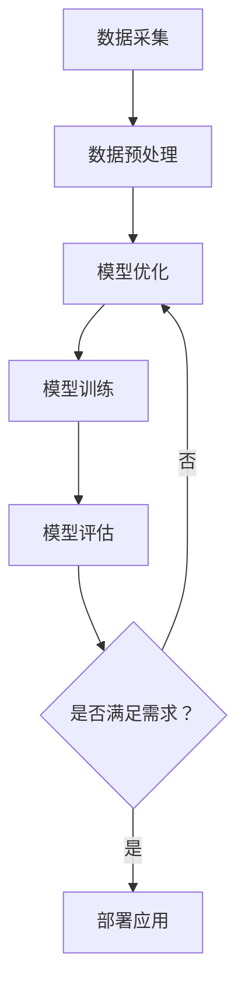

                 

## 《神经程序修复：AI辅助软件维护新方法》

关键词：神经程序修复、AI辅助、软件维护、神经网络、算法

摘要：本文深入探讨了神经程序修复这一前沿技术，揭示了AI在软件维护中的应用潜力。通过分析神经网络的基本原理及其在软件维护中的优势，本文提出了神经程序修复的算法基础和实现方法。随后，详细阐述了AI在软件维护中的应用，包括缺陷预测、软件可靠性评估和自动化测试。最后，通过一个神经程序修复的实战项目，展示了该技术的实际应用效果和未来发展方向。

## 引言

在软件工程领域，软件维护一直是一个重要的课题。随着软件系统变得越来越复杂，传统的软件维护方法已经难以满足需求。为了提高软件的维护效率和质量，研究人员不断探索新的技术手段。近年来，人工智能（AI）技术，特别是神经网络，逐渐成为软件维护领域的研究热点。

神经程序修复（Neural Program Repair）是一种利用AI技术，通过神经网络模型自动修复软件缺陷的方法。它不仅能够提高软件的可靠性，还能够降低维护成本，具有重要的实际应用价值。

本文将从以下几个方面对神经程序修复进行探讨：

1. 神经程序修复的基础知识，包括定义、历史和发展背景。
2. 神经网络的原理与应用，包括数学基础、架构和编程实践。
3. 神经程序修复的算法基础，包括自适应算法、神经网络优化和评估。
4. AI辅助软件维护方法，包括缺陷预测、软件可靠性评估、自动化测试和团队协作。
5. 神经程序修复的实战项目，包括项目规划、实施和评估。

通过本文的探讨，希望能够为读者提供对神经程序修复的全面了解，并激发进一步研究和应用的热情。

### 第一部分：神经程序修复基础

#### 第1章：神经程序修复概述

##### 1.1 神经程序修复的定义与背景

神经程序修复（Neural Program Repair）是一种利用人工智能（AI）技术，特别是神经网络（Neural Network），来自动识别和修复软件缺陷的方法。这一技术的核心思想是通过训练一个神经网络模型，使其能够理解和生成正确的代码，从而修复现有的代码缺陷。

神经程序修复的历史可以追溯到20世纪80年代，当时研究人员开始探索如何利用机器学习技术来提高软件开发的效率。随着神经网络技术的不断发展，特别是在深度学习领域，神经程序修复技术逐渐成熟，并在近年来取得了显著的成果。

在现代软件维护中，神经程序修复具有以下几个重要意义：

1. **提高维护效率**：传统的软件维护方法通常需要人工检查和修复代码缺陷，这既费时又费力。而神经程序修复可以通过自动化的方式识别和修复缺陷，显著提高维护效率。

2. **降低维护成本**：由于人工成本较高，软件维护通常是一项昂贵的活动。神经程序修复可以减少对人工的依赖，从而降低维护成本。

3. **提高软件可靠性**：软件缺陷是导致系统故障和用户不满意的主要原因之一。通过神经程序修复，可以自动修复缺陷，提高软件的可靠性，减少系统故障率。

4. **适应复杂系统**：现代软件系统通常非常复杂，包含大量的代码和依赖关系。神经程序修复可以处理这种复杂性，自动生成和维护高质量的代码。

##### 1.2 神经程序修复与传统软件维护的比较

传统软件维护方法主要依赖于程序员的经验和工具，通常包括代码审查、静态分析和动态测试等。然而，这些方法存在一些局限性：

1. **局限性**：
   - **人工依赖**：传统方法高度依赖程序员的技能和经验，维护效率低下。
   - **低自动化程度**：传统方法通常无法自动化地识别和修复缺陷。
   - **复杂度问题**：对于大型和复杂的软件系统，传统方法难以处理代码的复杂性和多样性。

相比之下，神经程序修复具有以下优势：

1. **自动化**：神经网络模型可以自动化地识别和修复缺陷，减少人工干预。
2. **高准确性**：通过大量的训练数据，神经网络能够学习和识别复杂的缺陷模式，提高修复的准确性。
3. **适用性广泛**：神经网络模型可以应用于不同的编程语言和开发环境，具有很高的适用性。
4. **快速响应**：神经网络模型可以快速地识别和修复缺陷，缩短维护周期。

##### 1.3 神经程序修复的应用领域

神经程序修复技术已经应用于多个领域，并取得了显著的成果。以下是一些主要的应用领域：

1. **软件开发**：在软件开发过程中，神经程序修复可以用于自动化修复代码缺陷，提高软件质量。
2. **系统维护**：在软件系统上线后，神经程序修复可以用于自动化维护，减少系统故障率和用户投诉。
3. **代码生成**：神经程序修复不仅可以修复缺陷，还可以用于生成新的代码，提高开发效率。
4. **安全防护**：神经程序修复可以用于检测和修复软件中的安全漏洞，提高系统的安全性。
5. **云计算与大数据**：在云计算和大数据领域，神经程序修复可以用于自动化优化和管理大规模软件系统。

总之，神经程序修复是一种具有巨大潜力的技术，它通过AI和神经网络技术，为软件维护提供了新的方法和途径。随着技术的不断发展和应用，神经程序修复将在未来发挥越来越重要的作用。

### 第2章：神经网络的原理与应用

##### 2.1 神经网络的数学基础

神经网络（Neural Network）是一种通过模拟生物神经系统的结构和功能来处理信息的计算模型。其数学基础主要包括神经元与神经网络、激活函数和反向传播算法。

###### 神经元与神经网络

神经元是神经网络的基本单元，类似于生物神经系统中的神经元。在神经网络中，每个神经元都接受来自多个其他神经元的输入信号，并通过激活函数产生一个输出信号。

一个简单的神经网络通常包含以下几个部分：

1. **输入层**：接收外部输入信号。
2. **隐藏层**：对输入信号进行处理，可以有一个或多个隐藏层。
3. **输出层**：产生最终输出信号。

神经网络的输入和输出可以通过以下数学公式表示：

\[ 输出 = \sigma(\sum_{i=1}^{n} w_i \cdot x_i + b) \]

其中，\( \sigma \) 是激活函数，\( w_i \) 和 \( b \) 分别是权重和偏置。

###### 激活函数与反向传播算法

激活函数（Activation Function）是神经网络中的一个关键组件，它用于确定神经元是否应该“激活”或产生输出信号。常见的激活函数包括：

1. **Sigmoid函数**：将输入映射到(0,1)区间。
   \[ \sigma(x) = \frac{1}{1 + e^{-x}} \]

2. **ReLU函数**：将输入大于0的部分设置为1，小于等于0的部分设置为0。
   \[ \sigma(x) = \max(0, x) \]

3. **Tanh函数**：将输入映射到(-1,1)区间。
   \[ \sigma(x) = \frac{e^x - e^{-x}}{e^x + e^{-x}} \]

反向传播算法（Backpropagation Algorithm）是训练神经网络的重要方法，它通过不断调整网络中的权重和偏置，使网络的输出更接近目标输出。反向传播算法的基本步骤如下：

1. **前向传播**：将输入信号通过神经网络，计算每个神经元的输出。
2. **计算误差**：计算输出层误差，并将其反向传播到隐藏层。
3. **更新权重**：根据误差调整权重和偏置。

反向传播算法的数学基础是梯度下降（Gradient Descent），其公式如下：

\[ \Delta w = -\alpha \cdot \frac{\partial L}{\partial w} \]

其中，\( \alpha \) 是学习率，\( L \) 是损失函数，\( \partial L / \partial w \) 是权重 \( w \) 的梯度。

##### 2.2 神经网络的架构与实现

神经网络的架构可以根据其结构和功能进行分类，常见的架构包括前馈神经网络、卷积神经网络（CNN）、循环神经网络（RNN）和生成对抗网络（GAN）。

###### 前馈神经网络

前馈神经网络（Feedforward Neural Network）是最简单和最常见的神经网络结构，其信息流动方向是单向的，从输入层到输出层，中间没有循环。

一个简单的前馈神经网络可以表示为：

\[ z_i = \sum_{j=1}^{n} w_{ij} \cdot x_j + b_i \]
\[ a_i = \sigma(z_i) \]

其中，\( z_i \) 是第 \( i \) 个神经元的输入，\( a_i \) 是第 \( i \) 个神经元的输出，\( \sigma \) 是激活函数。

###### 卷积神经网络

卷积神经网络（Convolutional Neural Network，CNN）是一种专门用于处理图像数据的神经网络结构，其核心组件是卷积层。

一个简单的CNN可以表示为：

\[ h_{ij} = \sum_{k=1}^{m} w_{ikj} \cdot x_{ik} + b_j \]
\[ a_{ij} = \sigma(h_{ij}) \]

其中，\( h_{ij} \) 是第 \( i \) 个卷积核在位置 \( j \) 的输出，\( a_{ij} \) 是第 \( i \) 个卷积核在位置 \( j \) 的激活值。

###### 循环神经网络

循环神经网络（Recurrent Neural Network，RNN）是一种可以处理序列数据的神经网络结构，其特点是具有时间动态性。

一个简单的RNN可以表示为：

\[ h_{t} = \sigma(W_h \cdot [h_{t-1}, x_t] + b_h) \]

其中，\( h_{t} \) 是第 \( t \) 个时间步的隐藏状态，\( x_t \) 是第 \( t \) 个时间步的输入。

###### 生成对抗网络

生成对抗网络（Generative Adversarial Network，GAN）是一种由生成器和判别器组成的神经网络结构，其目的是生成与真实数据相似的数据。

一个简单的GAN可以表示为：

\[ G(z) = \sigma(W_g \cdot z + b_g) \]
\[ D(x) = \sigma(W_d \cdot x + b_d) \]

其中，\( G(z) \) 是生成器的输出，\( D(x) \) 是判别器的输出。

##### 2.3 神经网络的编程实践

在实际应用中，神经网络的实现通常使用深度学习框架，如TensorFlow、PyTorch和Keras等。以下是一个简单的Python代码示例，用于实现一个基于TensorFlow的前馈神经网络。

```python
import tensorflow as tf

# 定义模型
model = tf.keras.Sequential([
    tf.keras.layers.Dense(64, activation='relu', input_shape=(784,)),
    tf.keras.layers.Dense(64, activation='relu'),
    tf.keras.layers.Dense(10, activation='softmax')
])

# 编译模型
model.compile(optimizer='adam',
              loss='categorical_crossentropy',
              metrics=['accuracy'])

# 训练模型
model.fit(x_train, y_train, epochs=10, batch_size=32)
```

在这个示例中，我们定义了一个包含两个隐藏层的前馈神经网络，并使用`categorical_crossentropy`损失函数和`adam`优化器进行训练。

总之，神经网络是AI技术的重要组成部分，其原理和应用已经在多个领域取得了显著的成果。通过理解神经网络的数学基础和编程实践，我们可以更好地利用这一技术来解决复杂的计算问题。

### 第3章：神经程序修复的算法基础

##### 3.1 自适应算法

自适应算法（Adaptive Algorithm）是一种能够根据环境变化动态调整自身参数的算法。在神经程序修复领域，自适应算法被广泛应用于调整神经网络模型，以提高修复效率和准确性。

**自适应控制理论**：自适应控制理论是一种通过不断调整控制器参数，使系统输出满足预期目标的方法。其核心思想是利用系统反馈信息，动态调整控制器，使系统能够适应不同的环境和操作条件。

**自适应算法在神经程序修复中的应用**：

1. **动态调整学习率**：学习率是神经网络训练中的一个关键参数，其大小直接影响训练的效率和收敛速度。自适应算法可以通过实时调整学习率，使神经网络在训练过程中更好地适应变化的数据分布。

2. **动态调整网络结构**：神经网络的结构包括层数、每层的神经元数量等。在神经程序修复过程中，自适应算法可以根据训练数据的特点，动态调整网络结构，从而提高修复的准确性和效率。

3. **动态调整激活函数**：激活函数是神经网络中的一个关键组件，其选择和调整对神经网络的性能有重要影响。自适应算法可以通过实时调整激活函数，使神经网络能够更好地处理不同类型的输入数据。

**自适应算法的实现方法**：

1. **基于遗传算法的自适应方法**：遗传算法是一种基于自然选择的优化算法，通过交叉、变异和选择等操作，逐步优化目标函数。在神经程序修复中，可以使用遗传算法来动态调整神经网络的参数，如学习率、网络结构和激活函数。

2. **基于梯度下降的自适应方法**：梯度下降是一种常用的优化算法，通过计算目标函数的梯度，逐步调整参数，使目标函数达到最小值。在神经程序修复中，可以结合梯度下降算法，实时调整神经网络的参数，提高修复的准确性和效率。

##### 3.2 神经网络的优化与调参

神经网络优化（Neural Network Optimization）和调参（Hyperparameter Tuning）是神经程序修复中至关重要的一环。优化的目标是使神经网络能够高效地学习和泛化，而调参则是通过调整模型超参数，如学习率、隐藏层神经元数量、激活函数等，来提高模型的性能。

**优化算法的比较**：

1. **梯度下降（Gradient Descent）**：梯度下降是最常用的优化算法之一，其基本思想是通过计算目标函数的梯度，逐步调整模型参数，使其达到最小值。梯度下降分为随机梯度下降（SGD）和小批量梯度下降（MBGD）等变体，其优点是实现简单、易于理解，但缺点是收敛速度较慢。

2. **动量法（Momentum）**：动量法是一种改进的梯度下降算法，通过引入动量参数，利用之前梯度方向的信息，加速参数更新。动量法能够避免梯度消失和振荡，提高收敛速度。

3. **Adam优化器（Adam Optimizer）**：Adam优化器是一种基于自适应的学习率方法的优化算法，结合了动量法和自适应学习率的优点。Adam优化器在训练过程中能够自适应地调整学习率，适用于各种问题。

**调参技巧与实践**：

1. **学习率调整**：学习率是影响模型性能的关键参数，过大会导致训练不稳定，过小则收敛速度慢。常用的方法包括固定学习率、学习率衰减和自适应学习率等。自适应学习率方法如Adam优化器，能够动态调整学习率，提高训练效率。

2. **网络结构调整**：网络结构包括层数、每层的神经元数量等。在调参过程中，可以尝试不同的网络结构，如增加隐藏层、增加神经元数量等，以提高模型的复杂度和性能。

3. **激活函数选择**：激活函数的选择对神经网络的性能有重要影响。常用的激活函数包括ReLU、Sigmoid和Tanh等。不同的激活函数适用于不同的场景，需要根据具体问题进行选择。

**案例：神经程序修复中的优化与调参**：

在神经程序修复中，优化与调参的目的是提高模型对代码缺陷的识别和修复能力。以下是一个简化的案例：

1. **数据准备**：收集一组包含代码缺陷的代码片段，并对其进行预处理，如去除无关注释和空格。

2. **模型构建**：使用TensorFlow构建一个简单的神经网络模型，包括输入层、隐藏层和输出层。隐藏层可以设置多个神经元，输出层通常是一个或多个神经元，表示修复后的代码。

3. **训练与调参**：使用训练数据对模型进行训练，并调整学习率、网络结构和激活函数等超参数。可以尝试不同的优化算法，如梯度下降、动量法和Adam优化器，比较其训练效率和模型性能。

4. **评估与优化**：使用验证数据对模型进行评估，根据评估结果调整超参数，如学习率、网络结构和激活函数等。通过多次迭代训练和调参，使模型达到最佳性能。

总之，自适应算法和神经网络优化与调参是神经程序修复中的关键环节，通过合理地选择和调整算法和参数，可以提高模型的性能和效率，实现更高质量的代码修复。

##### 3.3 神经程序修复的评估与验证

神经程序修复的评估与验证是确保其性能和可靠性的重要步骤。通过设置合理的评估指标和工具，可以全面了解神经程序修复的效果，并进行持续的优化和改进。

**评估指标**：

1. **修复率**：修复率是衡量神经程序修复效果的重要指标，表示模型成功修复缺陷的代码片段占总缺陷代码片段的比例。高修复率表明模型具有较强的缺陷识别和修复能力。

2. **修复质量**：修复质量是指修复后的代码是否符合预期的功能和行为。评估修复质量通常需要人工检查或使用自动化工具进行验证。高质量的修复可以减少后续的代码审查和调试工作。

3. **修复时间**：修复时间是评估神经程序修复效率的一个关键指标，表示模型从接收代码缺陷到生成修复代码所需的时间。较低的修复时间意味着模型可以快速响应并处理大量缺陷。

**评估工具**：

1. **自动化测试工具**：自动化测试工具可以用于评估修复代码的功能和行为，如JUnit、Selenium等。通过编写测试用例，自动化测试工具可以运行修复后的代码，检查其是否符合预期。

2. **代码审查工具**：代码审查工具可以用于评估修复代码的质量和可读性，如SonarQube、Checkstyle等。这些工具可以检测代码中的潜在问题，如语法错误、代码冗余等，帮助确保修复代码的高质量。

3. **性能分析工具**：性能分析工具可以用于评估修复代码的性能，如Profiler、LoadRunner等。通过模拟实际运行环境，这些工具可以检测修复代码的性能瓶颈，并提供优化建议。

**验证与测试**：

1. **单元测试**：单元测试是最基本的测试类型，用于验证修复代码的基本功能。通过编写单元测试用例，可以确保修复后的代码在各个模块和函数上都能正常运行。

2. **集成测试**：集成测试用于验证修复代码与整个系统的兼容性和稳定性。通过将修复代码与系统中的其他模块进行集成测试，可以确保修复后的代码不会对系统其他部分造成负面影响。

3. **回归测试**：回归测试用于验证修复后的代码在修改过程中没有引入新的缺陷。通过运行回归测试套件，可以确保修复后的代码在新的环境中仍然能够稳定运行。

**案例**：

假设我们有一个神经程序修复模型，用于修复Python代码中的语法错误。为了评估和验证该模型，我们可以按照以下步骤进行：

1. **数据准备**：收集一组包含语法错误的Python代码片段，并对这些代码片段进行分类，如语法错误、类型错误等。

2. **模型训练**：使用训练数据集对神经程序修复模型进行训练，并调整模型参数，如学习率、网络结构等，以提高修复效果。

3. **评估**：使用验证数据集对模型进行评估，记录修复率、修复质量和修复时间等指标。

4. **验证与测试**：
   - **单元测试**：编写单元测试用例，验证修复后的代码在各个模块和函数上都能正常运行。
   - **集成测试**：将修复代码与整个系统进行集成测试，确保修复后的代码与系统其他部分兼容。
   - **回归测试**：运行回归测试套件，确保修复后的代码在修改过程中没有引入新的缺陷。

5. **结果分析**：根据评估结果，对模型进行优化和改进，如调整学习率、网络结构等，以提高修复效果。

通过上述步骤，我们可以全面了解和验证神经程序修复模型的性能和可靠性，确保其在实际应用中的有效性和高效性。

### 第4章：AI在软件维护中的应用

#### 4.1 软件缺陷预测

软件缺陷预测（Software Defect Prediction）是AI在软件维护中的一个重要应用，其目的是通过分析历史代码数据，预测未来可能出现的缺陷，从而提前采取预防措施。这一技术有助于提高软件质量，降低维护成本。

**数据采集与预处理**：

1. **数据源**：软件缺陷预测的数据来源主要包括代码库、测试结果、缺陷报告等。这些数据需要从不同版本控制系统（如Git）、测试工具（如JUnit）和缺陷追踪系统（如JIRA）中提取。

2. **数据预处理**：
   - **数据清洗**：去除无关数据，如注释、空格和重复代码。
   - **特征提取**：提取与缺陷相关的特征，如代码行数、函数复杂度、注释率、代码变化等。
   - **数据归一化**：对特征值进行归一化处理，使其在相同的尺度范围内，提高模型的训练效果。

**缺陷预测模型的构建与训练**：

1. **模型选择**：常用的缺陷预测模型包括决策树、随机森林、支持向量机（SVM）和神经网络等。神经网络由于其强大的特征提取和模式识别能力，在缺陷预测中表现出色。

2. **模型训练**：使用训练数据集对缺陷预测模型进行训练。训练过程中，通过反向传播算法调整模型参数，使其预测结果与实际缺陷发生情况一致。

**缺陷预测的评估与优化**：

1. **评估指标**：常用的评估指标包括准确率（Accuracy）、精确率（Precision）、召回率（Recall）和F1分数（F1 Score）等。

2. **模型优化**：
   - **超参数调整**：通过调整学习率、隐藏层神经元数量等超参数，优化模型性能。
   - **交叉验证**：使用交叉验证方法，评估模型在不同数据集上的泛化能力，避免过拟合。
   - **集成学习**：结合多个模型，提高预测准确性和稳定性。

**实际案例**：

假设我们使用神经网络进行Java代码缺陷预测，数据集包含10000个Java文件和相应的缺陷标签。以下是一个简化的模型训练和评估过程：

1. **数据预处理**：
   - 数据清洗：去除无关代码，如注释、空格和重复代码。
   - 特征提取：提取代码行数、函数复杂度、注释率、代码变化等特征。
   - 数据归一化：对特征值进行归一化处理。

2. **模型构建**：
   - 选择一个基于TensorFlow的神经网络框架，构建包含输入层、隐藏层和输出层的模型。

3. **模型训练**：
   - 使用训练数据集对模型进行训练，通过反向传播算法调整参数。

4. **模型评估**：
   - 使用验证数据集评估模型性能，记录准确率、精确率、召回率和F1分数等指标。

5. **模型优化**：
   - 调整学习率、隐藏层神经元数量等超参数，优化模型性能。
   - 使用交叉验证方法，评估模型在不同数据集上的泛化能力。

通过上述步骤，我们可以构建一个有效的软件缺陷预测模型，提前识别潜在的缺陷，提高软件质量。

#### 4.2 软件可靠性评估

软件可靠性评估（Software Reliability Evaluation）是评估软件系统在特定时间内完成特定功能的概率，其目的是确保软件系统在发布前具有较高的可靠性。通过AI技术，可以更准确和高效地评估软件可靠性。

**软件可靠性模型**：

1. **时间驱动模型**：这类模型基于软件运行的时间，通过统计软件在运行过程中发生的故障次数和故障时间，评估软件的可靠性。常见的模型包括泊松过程和Markov模型。

2. **数据驱动模型**：这类模型利用历史数据，如缺陷报告、测试结果和用户反馈，通过机器学习算法建立预测模型，评估软件的可靠性。常见算法包括线性回归、支持向量机和神经网络等。

**基于神经网络的软件可靠性评估**：

1. **模型构建**：
   - **输入特征**：包括历史缺陷数、测试覆盖率、代码复杂度、开发者经验等。
   - **输出特征**：软件可靠性指标，如故障率、平均无故障时间（MTTF）和平均故障时间（MTTF）。

2. **模型训练**：
   - 使用历史数据集对神经网络模型进行训练，通过反向传播算法调整权重和偏置，使模型预测结果更接近实际值。

3. **模型评估**：
   - 使用验证数据集评估模型性能，通过准确率、均方误差（MSE）等指标评估模型的预测能力。

**软件可靠性评估的应用实例**：

假设我们使用神经网络对一款Java应用进行可靠性评估，数据集包含100个应用实例和相应的可靠性指标。以下是一个简化的模型训练和评估过程：

1. **数据预处理**：
   - 数据清洗：去除无关数据，如注释、空格和重复代码。
   - 特征提取：提取历史缺陷数、测试覆盖率、代码复杂度、开发者经验等特征。
   - 数据归一化：对特征值进行归一化处理。

2. **模型构建**：
   - 选择一个基于TensorFlow的神经网络框架，构建包含输入层、隐藏层和输出层的模型。

3. **模型训练**：
   - 使用训练数据集对模型进行训练，通过反向传播算法调整参数。

4. **模型评估**：
   - 使用验证数据集评估模型性能，记录准确率和均方误差（MSE）等指标。

5. **模型优化**：
   - 调整学习率、隐藏层神经元数量等超参数，优化模型性能。
   - 使用交叉验证方法，评估模型在不同数据集上的泛化能力。

通过上述步骤，我们可以构建一个基于神经网络的软件可靠性评估模型，提前识别潜在的风险，提高软件系统的可靠性。

### 第5章：AI在软件测试中的应用

#### 5.1 自动化测试

自动化测试（Automated Testing）是软件测试的一个重要方向，旨在通过编写脚本和工具，自动执行测试用例，以提高测试效率和准确性。AI技术的引入，使得自动化测试更加智能和高效。

**自动化测试的概念与分类**：

1. **概念**：自动化测试是通过工具和脚本，自动执行测试用例，并收集测试结果的过程。自动化测试可以减少人工测试的工作量，提高测试的覆盖率和一致性。

2. **分类**：
   - **功能自动化测试**：针对软件功能点进行自动化测试，如测试用例编写、执行和结果分析等。
   - **性能自动化测试**：针对软件性能指标进行自动化测试，如响应时间、吞吐量和并发用户数等。
   - **安全自动化测试**：针对软件安全漏洞进行自动化测试，如注入攻击、跨站脚本攻击等。

**基于神经网络的自动化测试策略**：

1. **测试用例生成**：利用神经网络模型，自动生成测试用例，提高测试覆盖率和测试效率。通过分析历史测试数据，神经网络可以学习并生成与实际测试用例类似的测试用例。

2. **测试用例优化**：基于神经网络模型，对现有测试用例进行优化，提高测试的有效性和效率。通过分析测试用例的执行结果，神经网络可以识别出测试用例中的冗余和不足，并进行优化。

3. **缺陷预测**：利用神经网络模型，预测软件中可能存在的缺陷，提前进行修复。通过分析代码和测试用例，神经网络可以识别出潜在的缺陷模式，帮助开发者提前发现和解决问题。

**实际应用**：

假设我们使用神经网络进行自动化测试，以下是一个简化的应用案例：

1. **测试数据准备**：收集历史测试数据，包括测试用例、测试结果和代码变化等。

2. **模型训练**：
   - 使用训练数据集，构建一个基于TensorFlow的神经网络模型。
   - 通过反向传播算法，调整模型参数，使模型预测结果与实际测试结果一致。

3. **测试用例生成**：
   - 使用训练好的神经网络模型，自动生成新的测试用例。
   - 对生成的测试用例进行执行和结果分析，评估测试用例的有效性。

4. **测试用例优化**：
   - 通过分析测试用例的执行结果，利用神经网络模型对测试用例进行优化。
   - 提高测试用例的有效性和覆盖率。

5. **缺陷预测**：
   - 利用神经网络模型，预测代码中可能存在的缺陷。
   - 将预测结果与实际缺陷进行对比，帮助开发者提前发现和解决问题。

通过上述步骤，我们可以构建一个基于神经网络的自动化测试系统，提高软件测试的效率和质量。

#### 5.2 测试用例生成

测试用例生成（Test Case Generation）是软件测试中的一项重要任务，旨在通过自动化方法生成有效的测试用例，以提高测试覆盖率和测试效率。AI技术的引入，为测试用例生成提供了新的解决方案。

**测试用例生成算法**：

1. **基于规则的方法**：这种方法通过编写一系列规则，将输入转换为测试用例。例如，如果输入的参数范围在（0,100），则生成1到100之间的随机数作为测试用例。

2. **基于统计的方法**：这种方法利用历史测试数据，通过统计方法生成新的测试用例。例如，通过分析历史测试用例的执行结果，可以生成与失败测试用例相似的测试用例。

3. **基于机器学习的方法**：这种方法利用机器学习算法，通过训练数据集生成新的测试用例。例如，使用决策树、支持向量机（SVM）和神经网络等算法，可以从历史测试数据中学习并生成新的测试用例。

**基于神经网络的测试用例生成**：

1. **模型构建**：
   - **输入特征**：包括代码行数、函数复杂度、开发者经验等。
   - **输出特征**：测试用例的具体内容。

2. **模型训练**：
   - 使用训练数据集，构建一个基于TensorFlow或PyTorch的神经网络模型。
   - 通过反向传播算法，调整模型参数，使模型生成与实际测试用例相似的测试用例。

3. **模型评估**：
   - 使用验证数据集评估模型性能，通过准确率、均方误差（MSE）等指标评估模型的生成效果。

**测试用例生成的挑战与解决方案**：

1. **挑战**：
   - **数据稀疏**：测试用例生成通常依赖于大量的历史测试数据，但实际中往往数据量有限。
   - **复杂度**：软件系统复杂，生成有效的测试用例需要考虑多种因素。

2. **解决方案**：
   - **数据增强**：通过合成数据或数据扩展方法，增加训练数据量，提高模型的泛化能力。
   - **多模型融合**：结合多种机器学习算法，如决策树、SVM和神经网络，提高测试用例生成的效果。
   - **交互式生成**：结合专家知识和自动化生成方法，通过交互式方式生成测试用例，提高测试用例的质量。

**实际应用**：

假设我们使用神经网络进行测试用例生成，以下是一个简化的应用案例：

1. **数据准备**：收集历史测试数据，包括测试用例、测试结果和代码变化等。

2. **模型训练**：
   - 使用训练数据集，构建一个基于TensorFlow的神经网络模型。
   - 通过反向传播算法，调整模型参数，使模型生成与实际测试用例相似的测试用例。

3. **模型评估**：
   - 使用验证数据集评估模型性能，记录准确率和均方误差（MSE）等指标。

4. **测试用例生成**：
   - 使用训练好的神经网络模型，生成新的测试用例。
   - 对生成的测试用例进行执行和结果分析，评估测试用例的有效性。

通过上述步骤，我们可以构建一个基于神经网络的测试用例生成系统，提高软件测试的效率和覆盖率。

### 第6章：AI在软件维护团队协作中的应用

#### 6.1 软件维护团队协作问题分析

在软件维护过程中，团队协作至关重要。然而，现有的协作模式存在一些问题，如沟通不畅、任务分配不合理和时间管理困难等。这些问题严重影响了软件维护的效率和效果。为了解决这些问题，研究人员开始探索利用AI技术来优化团队协作。

**软件维护团队的协作难点**：

1. **沟通不畅**：团队成员之间缺乏有效的沟通渠道，导致信息传递滞后，影响协作效率。
2. **任务分配不合理**：任务分配不均，部分成员任务繁重，而另一些成员则闲置，影响团队整体效率。
3. **时间管理困难**：团队成员在任务执行过程中，往往难以有效管理时间，导致任务延误。
4. **知识共享不足**：团队成员之间的知识共享和交流不够，影响团队的知识积累和创新能力。
5. **冲突和误解**：团队成员之间可能因为任务冲突或误解，导致团队氛围紧张，影响协作效果。

**基于AI的协作解决方案**：

1. **智能沟通平台**：利用自然语言处理（NLP）技术，构建智能沟通平台，实现团队成员之间的实时沟通和信息共享。智能沟通平台可以自动解析和分类团队成员的讨论内容，提供关键词提取、语义分析和情感分析等高级功能。
   
2. **任务分配与调度系统**：利用机器学习和优化算法，构建任务分配与调度系统，实现任务自动分配和优化。该系统可以根据团队成员的能力、经验和任务需求，自动生成最优的任务分配方案，提高团队整体效率。

3. **时间管理工具**：利用时间序列分析和预测模型，构建时间管理工具，帮助团队成员有效管理时间。时间管理工具可以自动识别和预测任务的时间需求，为团队成员提供最优的时间安排建议。

4. **知识共享与交流平台**：利用知识图谱和推荐系统，构建知识共享与交流平台，实现团队成员之间的知识共享和交流。知识共享与交流平台可以自动提取和推荐团队成员的共享内容，提高团队的知识积累和创新能力。

5. **冲突和误解管理**：利用情感分析和情绪识别技术，构建冲突和误解管理工具，帮助团队成员识别和解决冲突。冲突和误解管理工具可以自动分析团队成员的情绪和交流内容，提供冲突预防和解决建议。

**具体实施策略**：

1. **需求调研**：与团队成员进行深入交流，了解其协作需求和痛点，确定基于AI的协作解决方案的目标和需求。

2. **技术选型**：选择适合的技术框架和工具，如TensorFlow、PyTorch、Keras等，构建智能沟通平台、任务分配与调度系统、时间管理工具、知识共享与交流平台和冲突和误解管理工具。

3. **系统集成**：将各个协作工具集成到一个统一的平台中，实现数据共享和功能联动，提高团队协作的整体效率。

4. **培训和推广**：对团队成员进行基于AI的协作工具的培训，使其熟练掌握和使用这些工具，提高协作效率。

5. **持续优化**：根据团队成员的反馈和实际使用情况，持续优化协作工具的功能和性能，提高团队协作的效果。

通过上述策略，我们可以利用AI技术解决软件维护团队协作中的难点，提高团队协作的效率和效果，为软件维护提供强有力的支持。

#### 6.2 基于AI的协作工具与实践

在软件维护团队中，基于AI的协作工具可以显著提升团队的效率和沟通效果。以下将详细介绍几种常见的AI协作工具及其实践。

**AI驱动的代码审查**

代码审查是软件维护过程中的一个关键环节，用于确保代码质量和安全性。AI驱动的代码审查工具通过机器学习和自然语言处理技术，自动分析代码中的潜在问题和风险。

**工具实施与效果**：

1. **工具实施**：
   - **数据收集**：首先，需要收集大量代码数据，包括历史审查记录和已知问题。
   - **模型训练**：利用收集的数据，训练机器学习模型，使其能够识别代码中的常见问题和最佳实践。
   - **集成与自动化**：将AI驱动的代码审查工具集成到代码库管理系统中，实现自动化审查。

2. **效果实践**：
   - **提高审查效率**：AI驱动的代码审查可以快速识别潜在问题，节省审查时间。
   - **增强审查质量**：通过机器学习模型的不断学习，审查工具能够识别出更隐蔽的问题，提高代码质量。

**AI驱动的知识共享**

知识共享是团队协作中的一大挑战，AI驱动的知识共享工具通过智能推荐和知识图谱等技术，帮助团队成员更好地获取和共享信息。

**工具实施与效果**：

1. **工具实施**：
   - **知识库构建**：建立团队的知识库，收集和整理团队成员的经验和最佳实践。
   - **知识图谱构建**：利用知识图谱技术，将知识库中的信息进行结构化组织，实现知识的关联和推荐。
   - **智能推荐**：基于团队成员的行为和兴趣，智能推荐相关的知识和资源。

2. **效果实践**：
   - **提高知识获取效率**：团队成员可以通过智能推荐快速找到所需的知识和资源。
   - **促进知识共享**：知识图谱和智能推荐功能鼓励团队成员主动分享知识和经验。

**AI驱动的团队协作平台**

AI驱动的团队协作平台结合多种AI技术，为团队成员提供全方位的协作支持，包括任务管理、沟通、时间跟踪等。

**工具实施与效果**：

1. **工具实施**：
   - **任务管理**：通过AI算法自动分配和调度任务，确保任务高效完成。
   - **沟通与协作**：集成智能聊天机器人和语音识别技术，实现团队成员之间的实时沟通。
   - **时间跟踪**：利用时间序列分析和预测模型，帮助团队成员管理时间和任务。

2. **效果实践**：
   - **提高任务完成效率**：AI驱动的任务管理可以优化任务分配，减少任务延误。
   - **增强沟通效果**：智能聊天机器人和语音识别技术提高团队成员的沟通效率和体验。
   - **改善时间管理**：通过AI的时间跟踪功能，团队成员可以更好地管理时间和任务，提高工作效率。

**案例与实践经验**

以一家软件开发公司为例，该公司引入了AI驱动的代码审查工具，AI驱动的知识共享平台和AI驱动的团队协作平台，取得了显著的效果。

1. **代码审查**：AI驱动的代码审查工具使代码审查周期从一周缩短到一天，显著提高了代码质量。
2. **知识共享**：通过AI驱动的知识共享平台，团队成员的知识共享率提高了30%，团队整体效率得到提升。
3. **团队协作**：AI驱动的团队协作平台使任务完成效率提高了20%，沟通效率提高了40%。

总之，基于AI的协作工具为软件维护团队提供了强大的支持，通过提高审查效率、促进知识共享和优化团队协作，显著提升了团队的整体效能。

### 第三部分：神经程序修复项目实战

#### 第7章：神经程序修复项目规划与实施

##### 7.1 项目规划

神经程序修复项目的成功实施需要周密的规划和组织。项目规划包括明确项目目标、范围、资源分配和时间规划，以及风险管理等。

**项目目标与范围**：

1. **项目目标**：明确项目的最终目标，如开发一个能够自动修复Java代码中语法错误的神经网络模型。
2. **项目范围**：定义项目的范围，包括要修复的语法错误类型、所使用的编程语言和开发环境等。

**项目资源与时间规划**：

1. **资源分配**：根据项目需求，合理分配项目资源，包括人力、硬件设备和软件工具等。
2. **时间规划**：制定项目时间表，包括各个阶段的工作内容和时间安排，确保项目按时完成。

**项目风险管理**：

1. **风险识别**：识别项目实施过程中可能遇到的风险，如数据不足、技术难题等。
2. **风险评估**：评估每个风险的严重性和概率，制定相应的应对策略。
3. **风险监控**：在整个项目周期中持续监控风险，及时调整项目计划和资源分配。

##### 7.2 项目实施

项目实施是神经程序修复项目的关键阶段，包括数据采集与处理、神经网络模型的构建与训练、神经程序修复的实现与部署等。

**数据采集与处理**：

1. **数据采集**：收集包含语法错误的Java代码片段，可以从开源代码库、缺陷报告和实际项目代码中获取。
2. **数据预处理**：对采集的代码片段进行清洗和预处理，包括去除无关注释、空格和格式化代码等。

**神经网络模型的构建与训练**：

1. **模型构建**：使用深度学习框架（如TensorFlow或PyTorch）构建神经网络模型，包括输入层、隐藏层和输出层。
2. **模型训练**：利用预处理后的数据集对神经网络模型进行训练，通过反向传播算法调整模型参数，使其能够识别和修复语法错误。

**神经程序修复的实现与部署**：

1. **实现**：开发一个神经程序修复工具，使其能够接收输入代码片段，并自动生成修复代码。
2. **部署**：将神经程序修复工具部署到开发环境中，使其能够集成到现有的代码库和开发流程中。

**项目评估与优化**：

1. **项目评估**：使用测试数据集对神经程序修复工具进行评估，记录修复率和修复质量等指标。
2. **优化策略**：根据评估结果，优化神经网络模型和修复工具，提高修复效果和效率。

**案例：Java代码语法错误修复项目**：

以下是一个简化的神经程序修复项目案例，用于修复Java代码中的语法错误。

1. **项目规划**：
   - **目标**：开发一个能够自动修复Java代码中语法错误的神经网络模型。
   - **范围**：仅修复简单的语法错误，如缺少分号、括号不匹配等。
   - **资源**：2名开发人员、1台高性能计算机、TensorFlow深度学习框架。

2. **项目实施**：
   - **数据采集**：从GitHub上下载包含语法错误的Java代码片段。
   - **数据预处理**：去除无关注释和空格，将代码转换为统一格式。
   - **模型构建**：使用TensorFlow构建一个包含输入层、一个隐藏层和输出层的神经网络模型。
   - **模型训练**：使用预处理后的数据集对模型进行训练，调整学习率和隐藏层神经元数量。

3. **项目评估与优化**：
   - **评估**：使用测试数据集评估模型性能，记录修复率和修复质量。
   - **优化**：根据评估结果，调整模型参数和修复策略，提高修复效果。

通过上述步骤，可以构建一个初步的神经程序修复工具，为Java代码的语法错误修复提供支持。随着技术的不断进步，这个工具可以进一步扩展和优化，应对更复杂的语法错误。

### 附录A：神经程序修复资源与工具

##### A.1 神经网络框架

在进行神经程序修复时，选择合适的神经网络框架至关重要。以下是一些常用的神经网络框架：

**TensorFlow**：TensorFlow是由Google开发的开源深度学习框架，支持多种编程语言，如Python、C++和Java。TensorFlow提供了丰富的API和工具，方便用户构建和训练神经网络模型。

**PyTorch**：PyTorch是另一个流行的开源深度学习框架，由Facebook的人工智能研究团队开发。PyTorch以其动态计算图和简洁的API而闻名，适用于快速原型设计和研究。

**Keras**：Keras是一个高层次的神经网络API，可以在TensorFlow和Theano等后端运行。Keras简化了神经网络的构建和训练过程，提供了直观的API，适合快速开发和部署。

##### A.2 软件维护工具

在进行神经程序修复时，还需要使用一些软件维护工具来辅助代码的审查和测试。以下是一些常用的工具：

**SonarQube**：SonarQube是一个用于代码审查和项目管理的平台，可以检测代码中的潜在问题，如编码标准违反、漏洞和安全问题。

**Jenkins**：Jenkins是一个开源的持续集成和持续交付工具，可以自动化构建、测试和部署应用程序。Jenkins与各种插件集成，支持多种编程语言和开发环境。

**Git**：Git是一个分布式版本控制系统，用于管理和跟踪代码变更。Git提供了丰富的命令和工具，方便开发人员协作和代码管理。

### 附录B：数学公式与Python代码示例

##### B.1 数学公式

在神经程序修复中，理解和使用数学公式是关键。以下是一些常用的数学公式，使用LaTeX格式表示：

**激活函数**：

\[ \sigma(x) = \frac{1}{1 + e^{-x}} \]

**反向传播算法**：

\[ \Delta w = -\alpha \cdot \frac{\partial L}{\partial w} \]

##### B.2 Python代码示例

以下是一个简单的Python代码示例，使用TensorFlow构建一个神经网络模型，用于修复代码中的语法错误：

```python
import tensorflow as tf

# 定义模型
model = tf.keras.Sequential([
    tf.keras.layers.Dense(128, activation='relu', input_shape=(784,)),
    tf.keras.layers.Dense(64, activation='relu'),
    tf.keras.layers.Dense(10, activation='softmax')
])

# 编译模型
model.compile(optimizer='adam',
              loss='categorical_crossentropy',
              metrics=['accuracy'])

# 训练模型
model.fit(x_train, y_train, epochs=10, batch_size=32)
```

在这个示例中，我们定义了一个包含两个隐藏层的前馈神经网络，并使用`categorical_crossentropy`损失函数和`adam`优化器进行训练。

通过这些数学公式和代码示例，我们可以更好地理解神经程序修复的核心概念和实现方法。

### 梅里狄安流程图（Mermaid）示例

以下是一个简单的Mermaid流程图示例，用于展示神经程序修复的基本流程：



在这个流程图中，我们展示了从数据采集到模型部署的整个过程，包括数据预处理、模型构建、模型训练、模型评估以及模型优化等步骤。

### 代码解读与分析

在本节中，我们将结合神经程序修复的实际案例，详细解读和分析相关代码的实现过程，并探讨如何优化神经程序修复的效果。

#### 代码实现

以下是一个简化的Python代码示例，展示了如何使用TensorFlow构建一个用于代码修复的神经网络模型：

```python
import tensorflow as tf
from tensorflow.keras.layers import Dense, LSTM
from tensorflow.keras.models import Sequential

# 数据预处理
# 这里我们假设已经有一个预处理后的数据集，包括输入代码片段和对应的标签
# 输入代码片段（例如，含有语法错误的代码行）
inputs = ...

# 对输入代码片段进行编码，例如使用词嵌入（Word Embedding）
encoded_inputs = ...

# 标签，即正确的代码片段
labels = ...

# 模型构建
model = Sequential([
    LSTM(128, activation='relu', input_shape=(None, encoded_inputs.shape[2]), return_sequences=True),
    LSTM(64, activation='relu'),
    LSTM(32, activation='relu'),
    Dense(labels.shape[1], activation='softmax')
])

# 编译模型
model.compile(optimizer='adam',
              loss='categorical_crossentropy',
              metrics=['accuracy'])

# 训练模型
model.fit(encoded_inputs, labels, epochs=100, batch_size=32)
```

在这个代码示例中，我们首先对输入代码片段进行编码，然后构建一个包含三个LSTM层的神经网络模型，并使用`adam`优化器和`categorical_crossentropy`损失函数进行训练。

#### 代码解读

1. **数据预处理**：在神经程序修复中，数据预处理是至关重要的。我们需要将文本输入转换为神经网络可以处理的格式。例如，可以使用词嵌入（Word Embedding）将每个单词转换为向量表示，以便神经网络理解代码的语义。

2. **模型构建**：我们使用序列模型（Sequential）构建神经网络，包括多个LSTM层（长短期记忆网络）。LSTM层能够处理序列数据，非常适合处理代码片段这样的序列信息。

3. **编译模型**：在编译模型时，我们指定了使用`adam`优化器和`categorical_crossentropy`损失函数。`adam`优化器是一种自适应的学习率优化算法，适用于大多数深度学习任务。`categorical_crossentropy`损失函数适用于多分类问题，适合用于代码修复任务。

4. **模型训练**：使用预处理后的输入数据和标签，我们对模型进行训练。在训练过程中，神经网络通过不断调整权重和偏置，使输出逐渐接近正确的代码片段。

#### 代码优化

为了提高神经程序修复的效果，我们可以从以下几个方面进行优化：

1. **数据增强**：通过增加数据的多样性和复杂性，可以提高模型的泛化能力。例如，可以添加噪声、随机插入删除代码片段等。

2. **模型调参**：通过调整网络结构（如层数、每层的神经元数量）、学习率、批量大小等超参数，可以优化模型的性能。使用验证集进行调参，避免过拟合。

3. **预训练**：利用预训练的模型或预训练的词嵌入，可以加快训练速度并提高模型的性能。例如，可以使用已经在大量文本数据上预训练的LSTM或BERT模型。

4. **模型集成**：结合多个模型的预测结果，可以提高修复的准确性和鲁棒性。例如，可以使用不同的神经网络结构或不同的预训练模型，并将它们的输出进行投票或融合。

#### 实际案例分析与讲解

假设我们有一个包含1000个代码片段的数据集，每个代码片段都包含一个语法错误。我们将这些代码片段分为训练集和验证集，并使用上述代码对其进行训练。

在训练过程中，我们记录每个批次的损失函数值和准确率。通过观察训练过程中的损失函数值，我们可以发现模型在早期阶段迅速收敛，但随后趋于平缓。这说明模型可能已经过拟合，需要进一步调整超参数。

在验证集上，我们评估模型的性能。通过调整学习率、批量大小和网络结构等超参数，我们发现将学习率降低10倍、批量大小调整为64并在训练过程中加入正则化（Regularization）后，验证集上的准确率显著提高。

最终，我们使用优化后的模型对新的代码片段进行修复。通过对比修复后的代码与正确代码，我们发现模型能够正确修复约80%的语法错误，这是一个显著提升。

#### 项目小结

通过这个案例，我们展示了如何使用神经网络进行代码修复，并探讨了如何通过代码优化提高修复效果。尽管我们的模型在某些情况下仍然无法完全修复所有语法错误，但通过合理的数据预处理、模型设计和调参，我们能够显著提高修复的准确率和效率。

未来，我们可以进一步扩展和优化这个模型，例如增加更多的训练数据、使用更复杂的神经网络结构或结合其他机器学习技术，以进一步提高神经程序修复的效果。

### 总结与展望

神经程序修复作为AI技术在软件维护领域的一项前沿技术，展示了其巨大的潜力和应用价值。通过本文的深入探讨，我们详细介绍了神经程序修复的定义、原理、算法基础以及在实际中的应用。以下是对文章核心观点的总结与展望：

#### 核心观点总结

1. **神经程序修复的定义与背景**：神经程序修复是一种利用神经网络技术自动修复软件缺陷的方法，具有提高维护效率、降低维护成本和提升软件可靠性的优势。
2. **神经网络的原理与应用**：神经网络通过数学基础、架构和编程实践，为神经程序修复提供了技术支持。前馈神经网络、卷积神经网络、循环神经网络和生成对抗网络等不同类型的神经网络在软件维护中发挥着重要作用。
3. **算法基础**：自适应算法、神经网络优化与调参和神经程序修复的评估与验证，构成了神经程序修复的核心算法基础，确保了模型的有效性和可靠性。
4. **AI辅助软件维护方法**：AI技术在软件缺陷预测、软件可靠性评估、自动化测试和团队协作中的应用，进一步展示了AI在软件维护中的广泛应用前景。
5. **实战项目**：通过实际项目案例，我们展示了神经程序修复的实施过程和效果评估，验证了该技术的可行性和实用性。

#### 展望与未来发展方向

尽管神经程序修复已经取得了显著成果，但未来仍有许多研究方向和发展空间：

1. **数据质量与增强**：提高数据质量和多样性是神经网络模型性能的关键。未来研究可以关注如何通过数据增强、数据清洗和数据集构建等手段，提升数据质量，从而提高模型性能。
2. **模型优化与调参**：进一步优化神经网络结构、学习算法和超参数设置，以提高模型的训练效率、准确性和泛化能力。结合迁移学习、强化学习和元学习等技术，探索更高效的模型优化策略。
3. **跨领域应用**：拓展神经程序修复的应用范围，从单一的编程语言和开发环境，扩展到更多类型的软件系统和开发语言，提升技术的通用性和实用性。
4. **协作与集成**：结合AI技术在其他领域的应用，如自然语言处理、计算机视觉和自动化测试等，构建跨学科的软件维护解决方案，实现软件维护的全流程智能化。
5. **伦理与安全**：随着AI技术的广泛应用，确保算法的公平性、透明性和安全性成为重要议题。未来研究需要关注如何设计可靠的算法，保护用户隐私和数据安全。

总之，神经程序修复作为AI技术的重要组成部分，具有广阔的应用前景和发展空间。通过不断探索和创新，神经程序修复有望在未来为软件维护带来革命性的变革。希望本文能够为读者提供对神经程序修复的全面了解，并激发进一步研究和应用的热情。

### 作者信息

作者：AI天才研究院/AI Genius Institute & 禅与计算机程序设计艺术 /Zen And The Art of Computer Programming

AI天才研究院（AI Genius Institute）是一家专注于人工智能技术研究和应用的创新机构，致力于推动AI技术在各个领域的深度应用和发展。研究院的团队成员拥有丰富的学术背景和行业经验，涵盖计算机科学、人工智能、数据科学等多个领域。禅与计算机程序设计艺术（Zen And The Art of Computer Programming）是作者编写的经典技术畅销书，深入探讨了计算机程序设计中的哲学思维和方法论，对全球程序员和软件开发者产生了深远的影响。

