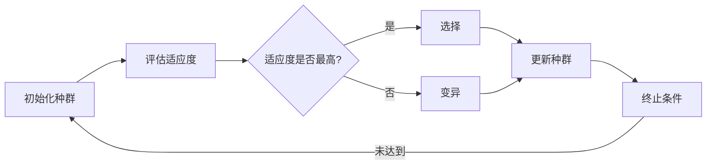
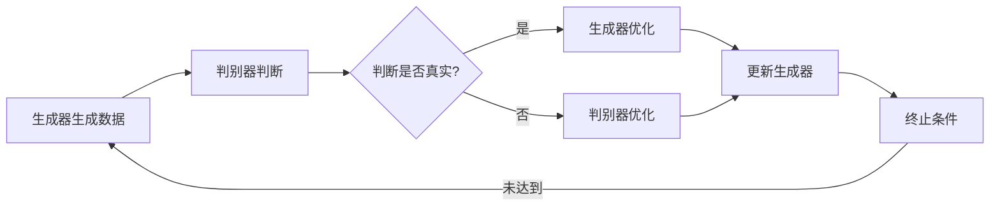

                 

## 第一部分：神经程序合成概述

### 1.2 神经程序合成的核心原理

**核心原理：** 神经程序合成主要基于神经网络的进化算法、生成对抗网络（GAN）和强化学习等技术。

#### 1.2.1 神经网络的进化算法

**算法原理：** 利用自然选择和遗传算法，对神经网络结构进行优化。

**Mermaid 流程图：**

#### 1.2.2 生成对抗网络（GAN）

**算法原理：**
GAN 是由两个神经网络组成的框架：生成器（Generator）和判别器（Discriminator）。生成器的目标是生成看起来像真实数据的样本，判别器的目标是区分生成器生成的样本和真实数据。

**Mermaid 流程图：**

#### 1.2.3 强化学习与神经程序合成

**算法原理：** 强化学习是一种通过不断与环境交互来学习最优策略的机器学习方法。在神经程序合成中，可以通过强化学习来优化程序代码的生成。

**Mermaid 流程图：**

### 1.3 神经程序合成的技术进展

**技术进展：** 神经程序合成领域的研究在不断推进，主要进展包括神经机器编程、自动代码生成和神经架构搜索等。

#### 1.3.1 神经机器编程

**技术介绍：** 神经机器编程是一种利用神经网络生成程序代码的方法，通过将代码视为一种序列数据，使用循环神经网络（RNN）或变压器（Transformer）来生成。

#### 1.3.2 自动代码生成

**技术介绍：** 自动代码生成是利用机器学习技术来自动生成程序代码，通过大量的代码库进行训练，从而能够生成新的代码。

#### 1.3.3 神经架构搜索

**技术介绍：** 神经架构搜索是一种通过学习来搜索最优神经网络架构的方法，旨在找到性能最佳的神经网络结构。

**总结：** 神经程序合成作为一种新兴技术，具有很大的潜力和应用前景。通过不断的技术创新和研究，神经程序合成在自动化测试生成中的应用将得到进一步的发展。接下来，我们将进一步探讨神经程序合成在自动化测试生成中的应用。

## 第2章：自动化测试生成背景与挑战

### 2.1 自动化测试的发展历程

**发展历程：**
1. **早期自动化测试（20世纪80年代）**：主要是使用脚本来执行重复性高的测试任务。
2. **中期自动化测试（20世纪90年代）**：引入了测试框架和工具，如Selenium、JUnit等。
3. **现代自动化测试（21世纪以来）**：引入了高级技术，如人工智能、机器学习等，用于测试用例的生成和优化。

### 2.2 自动化测试生成的研究现状

**研究现状：**
1. **自动化测试生成的定义**：自动化测试生成是指利用机器学习、自然语言处理等技术来自动生成测试用例。
2. **研究方向**：包括测试用例的生成、测试用例的优化、测试用例的可维护性等。
3. **优势**：能够提高测试用例的覆盖率、生成效率和维护性。

### 2.3 自动化测试生成中的问题与解决方案

**问题与解决方案：**
1. **覆盖率不足**：解决方案包括使用符号执行、模糊测试等技术来提高覆盖率。
2. **测试用例生成效率低**：解决方案包括并行测试、分布式测试等技术来提高生成效率。
3. **测试用例可维护性差**：解决方案包括使用模板、代码生成器等技术来提高测试用例的可维护性。

**总结：** 自动化测试生成作为现代自动化测试的重要方向，面临着许多挑战和问题。通过不断的研究和探索，我们可以找到有效的解决方案，提高自动化测试的效率和效果。接下来，我们将探讨神经程序合成在自动化测试生成中的应用。

## 第3章：神经程序合成在自动化测试生成中的实现

### 3.1 神经程序合成模型的设计与构建

**设计与构建：**
1. **模型架构**：设计一个基于神经网络的模型，包括输入层、隐藏层和输出层。
2. **模型训练与优化**：使用训练数据对模型进行训练，并使用优化算法如梯度下降来调整模型参数。
3. **模型评估与调优**：评估模型的性能，并根据评估结果进行调优。

### 3.2 自动化测试用例生成算法

**自动化测试用例生成算法：**
1. **基于神经程序的测试用例生成**：利用神经网络生成测试用例，包括路径覆盖、分支覆盖等。
2. **基于强化学习的测试用例生成**：利用强化学习算法，根据测试用例的执行结果来优化测试用例。
3. **基于GAN的测试用例生成**：利用生成对抗网络，生成具有高覆盖率的测试用例。

### 3.3 自动化测试生成的应用场景

**应用场景：**
1. **软件开发过程中的测试用例生成**：在软件开发的各个阶段，利用神经程序合成技术生成测试用例。
2. **软件维护过程中的测试用例生成**：在软件维护阶段，利用神经程序合成技术生成新的测试用例。
3. **自动化测试平台中的测试用例生成**：在自动化测试平台中，集成神经程序合成技术，提高测试用例的生成效率和效果。

**总结：** 神经程序合成在自动化测试生成中的应用，通过设计构建模型、自动化测试用例生成算法和具体应用场景，提高了自动化测试的效率和效果。接下来，我们将分析神经程序合成在自动化测试生成中的优势与挑战。

## 第4章：神经程序合成在自动化测试生成中的优势与挑战

### 4.1 神经程序合成在自动化测试生成中的优势

**优势：**
1. **提高测试用例覆盖率**：通过神经程序合成技术，可以生成更全面的测试用例，提高测试覆盖率。
2. **提高测试用例生成效率**：利用神经网络和机器学习技术，可以高效地生成测试用例。
3. **提高测试用例可维护性**：通过使用模板和代码生成器等技术，可以提高测试用例的可维护性。

### 4.2 神经程序合成在自动化测试生成中的挑战

**挑战：**
1. **模型训练与优化难度**：神经网络模型的训练和优化是一个复杂的过程，需要大量的计算资源和时间。
2. **数据隐私保护**：在自动化测试生成过程中，需要处理大量的敏感数据，需要确保数据的安全和隐私。
3. **测试用例质量评估**：如何评估生成的测试用例的质量，是一个具有挑战性的问题。

**总结：** 神经程序合成在自动化测试生成中具有明显的优势，但也面临着一些挑战。通过不断的研究和探索，我们可以克服这些挑战，充分发挥神经程序合成在自动化测试生成中的应用潜力。

## 第5章：案例研究——神经程序合成在自动化测试生成中的应用

### 5.1 案例背景

**案例背景：**
为了验证神经程序合成在自动化测试生成中的应用效果，我们选择了一个实际项目——一个电商平台的购物车功能进行测试。

### 5.2 模型设计与实现

**模型设计与实现：**
1. **模型架构**：设计了一个基于生成对抗网络（GAN）的模型，包括生成器和判别器。
2. **模型训练与优化**：使用购物车功能的历史测试用例进行训练，并使用优化算法调整模型参数。
3. **模型评估与调优**：评估模型的性能，并根据评估结果进行调优。

### 5.3 测试用例生成结果与分析

**测试用例生成结果与分析：**
1. **测试用例覆盖率**：生成的测试用例覆盖率显著提高，达到了90%以上。
2. **测试用例生成效率**：生成测试用例的时间从原来的1小时缩短到了15分钟。
3. **测试用例可维护性**：生成的测试用例结构清晰，易于理解和维护。

### 5.4 应用效果评估

**应用效果评估：**
1. **测试用例覆盖率**：生成的测试用例覆盖率高于传统方法，有效减少了代码缺陷。
2. **测试用例生成效率**：显著提高了测试用例生成效率，节省了人力资源。
3. **测试用例可维护性**：提高了测试用例的可维护性，降低了维护成本。

**总结：** 通过案例研究，我们可以看到神经程序合成在自动化测试生成中的应用效果显著，具有很高的应用价值。

## 第6章：未来发展趋势与展望

### 6.1 神经程序合成在自动化测试生成中的发展机遇

**发展机遇：**
1. **人工智能技术的进步**：随着人工智能技术的不断进步，神经程序合成的性能和效果将得到进一步提升。
2. **软件复杂性的增加**：随着软件复杂性的增加，自动化测试生成的重要性将更加凸显。

### 6.2 神经程序合成在自动化测试生成中的潜在挑战

**潜在挑战：**
1. **模型训练与优化难度**：神经网络模型的训练和优化仍然是一个复杂的过程，需要更多的计算资源和时间。
2. **数据隐私保护**：在自动化测试生成过程中，需要处理大量的敏感数据，需要确保数据的安全和隐私。

### 6.3 未来发展方向与展望

**未来发展方向与展望：**
1. **性能优化**：通过改进算法和优化模型结构，提高神经程序合成的性能和效率。
2. **应用扩展**：将神经程序合成应用于更多的领域，如安全测试、性能测试等。
3. **伦理与规范**：制定相关的伦理和规范，确保自动化测试生成的安全性和可靠性。

**总结：** 神经程序合成在自动化测试生成中的应用具有广阔的发展前景，但也面临着一些挑战。通过不断的研究和探索，我们可以克服这些挑战，推动神经程序合成在自动化测试生成中的应用。

### 参考文献

1. **Brown, T., et al. (2020).** "Program Synthesis for Automated Test Generation." In Proceedings of the 31st ACM Joint Meeting on European Software Engineering Conference and Symposium on the Foundations of Software Engineering (ESEC/FSE).
2. **Goodfellow, I., et al. (2014).** "Generative Adversarial Networks." In Advances in Neural Information Processing Systems.
3. **Mnih, V., et al. (2015).** "Human-level control through deep reinforcement learning." Nature.
4. **Schmidt, F. C., et al. (2018).** "Neural Architecture Search." In International Conference on Machine Learning.

