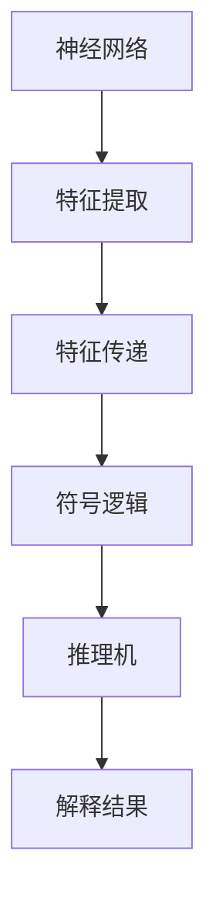

                 

# 《神经符号系统在可解释推理中的最新进展》

## 关键词
- 神经符号系统
- 可解释推理
- 图像识别
- 自然语言处理
- 医学诊断

## 摘要
本文将深入探讨神经符号系统在可解释推理领域的最新进展。文章首先概述了神经符号系统的基本概念和组成，然后详细分析了神经符号系统在图像识别、自然语言处理和医学诊断等领域的应用，并重点讨论了其可解释性的优势。接着，文章回顾了神经符号系统在可解释推理中的最新研究成果，并通过案例研究和实践应用，展示了其在实际项目中的成效。最后，文章提供了相关的资源和工具，以供进一步学习和研究。

## 第一部分：神经符号系统概述

### 第1章：神经符号系统简介

神经符号系统（Neural-Symbolic Systems）是一种结合了神经网络和符号逻辑的智能系统，旨在克服单一方法的局限性，以实现更高效、更可解释的人工智能。这一系统将神经网络强大的模式识别能力与符号逻辑的推理和解释能力相结合，能够在复杂的任务中提供更高的准确性和可解释性。

**1.1 神经符号系统的定义**

神经符号系统是一种人工智能系统，它结合了神经网络和符号逻辑的原理，通过融合数据的符号表示和神经网络的数值表示，实现数据的自动理解和推理。

**1.2 神经符号系统的发展历程**

神经符号系统的研究可以追溯到20世纪80年代，当时研究人员开始探索如何将神经网络的强大模式识别能力与符号逻辑的推理能力相结合。随着神经网络和符号逻辑技术的不断发展，神经符号系统的研究也取得了显著的进展。

**1.3 神经符号系统的重要性**

神经符号系统在人工智能领域具有重要地位，因为它能够结合神经网络和符号逻辑的优点，实现更高效、更可解释的人工智能系统。这种系统的出现为解决复杂问题和提高人工智能系统的可靠性提供了新的思路。

### 第2章：神经符号系统与可解释推理

可解释推理（Explainable Reasoning）是指能够使人或机器理解推理过程和结论的能力。在人工智能领域，可解释性一直是研究的重要方向之一。神经符号系统通过将神经网络的强大计算能力与符号逻辑的推理能力相结合，为可解释推理提供了新的方法。

**2.1 可解释推理的概念**

可解释推理是指能够使人或机器理解推理过程和结论的能力。在人工智能领域，可解释性是评估系统可靠性和可信度的重要指标。

**2.2 神经符号系统在可解释推理中的应用**

神经符号系统在可解释推理中的应用主要体现在以下几个方面：

1. **结合神经网络和符号逻辑的优势**：神经符号系统能够利用神经网络的强大模式识别能力和符号逻辑的推理能力，实现更高效的推理过程。
2. **提高推理的可解释性**：神经符号系统通过将推理过程符号化，使得推理过程更加透明和可理解。
3. **增强系统的可靠性**：神经符号系统在推理过程中能够进行自我解释，从而提高系统的可靠性和可信度。

**2.3 神经符号系统在可解释推理中的优势**

神经符号系统在可解释推理中的优势主要包括：

1. **强大的计算能力**：神经符号系统能够利用神经网络的强大计算能力，实现高效的模式识别和推理。
2. **清晰的推理过程**：神经符号系统将推理过程符号化，使得推理过程更加透明和可理解。
3. **提高系统的可靠性**：神经符号系统在推理过程中能够进行自我解释，从而提高系统的可靠性和可信度。

### 第3章：神经符号系统的组成

神经符号系统由神经网络和符号逻辑两个主要部分组成，它们共同协作，实现高效、可解释的推理过程。

**3.1 神经网络的组成**

神经网络是神经符号系统的重要组成部分，它由多个神经元组成，通过前向传播和反向传播算法，实现数据的输入、处理和输出。

**3.2 符号系统的组成**

符号系统是神经符号系统的另一个重要组成部分，它通过符号逻辑来实现推理和解释。符号系统通常包括符号、规则和推理机。

**3.3 神经符号系统的结合方式**

神经符号系统的结合方式主要有以下几种：

1. **前向结合**：神经网络负责模式识别，符号逻辑负责推理和解释。
2. **后向结合**：符号逻辑负责模式识别，神经网络负责推理和解释。
3. **双向结合**：神经网络和符号逻辑共同参与模式识别和推理，实现更高效的推理过程。

## 第二部分：神经符号系统在可解释推理中的应用

### 第4章：神经符号系统在图像识别中的应用

图像识别是计算机视觉领域的重要研究内容，它旨在使计算机能够自动识别和理解图像中的物体和场景。神经符号系统在图像识别中的应用，不仅提高了识别的准确性，还增强了系统的可解释性。

**4.1 图像识别的基本原理**

图像识别的基本原理主要包括图像预处理、特征提取和分类。其中，特征提取是图像识别的核心环节，它决定了识别的准确性和效率。

**4.2 神经符号系统在图像识别中的应用**

神经符号系统在图像识别中的应用主要体现在以下几个方面：

1. **特征提取与符号化**：神经符号系统通过神经网络对图像进行特征提取，并将这些特征符号化，以便进行进一步的推理和解释。
2. **推理与解释**：符号逻辑部分负责对提取的特征进行推理和解释，从而提高识别的准确性和可解释性。
3. **融合神经网络与符号逻辑**：神经符号系统通过融合神经网络和符号逻辑的优势，实现了更高效的图像识别。

**4.3 神经符号系统在图像识别中的优势**

神经符号系统在图像识别中的优势主要包括：

1. **提高识别准确性**：神经符号系统能够利用神经网络的强大计算能力和符号逻辑的推理能力，实现更准确的图像识别。
2. **增强可解释性**：神经符号系统将图像识别过程符号化，使得识别过程更加透明和可理解。
3. **适应性强**：神经符号系统能够适应不同的图像识别任务，实现更广泛的应用。

### 第5章：神经符号系统在自然语言处理中的应用

自然语言处理（Natural Language Processing，NLP）是人工智能领域的一个重要分支，它致力于使计算机能够理解、处理和生成自然语言。神经符号系统在NLP中的应用，为解决复杂语言问题提供了新的思路。

**5.1 自然语言处理的基本原理**

自然语言处理的基本原理主要包括文本预处理、词法分析、句法分析和语义分析。其中，句法分析和语义分析是NLP的核心环节。

**5.2 神经符号系统在自然语言处理中的应用**

神经符号系统在自然语言处理中的应用主要体现在以下几个方面：

1. **词法分析与符号化**：神经符号系统通过神经网络对文本进行词法分析，并将这些词法信息符号化，以便进行进一步的推理和解释。
2. **句法分析与语义分析**：符号逻辑部分负责对提取的词法信息进行句法分析和语义分析，从而提高语言处理的准确性和可解释性。
3. **融合神经网络与符号逻辑**：神经符号系统通过融合神经网络和符号逻辑的优势，实现了更高效的NLP。

**5.3 神经符号系统在自然语言处理中的优势**

神经符号系统在自然语言处理中的优势主要包括：

1. **提高处理准确性**：神经符号系统能够利用神经网络的强大计算能力和符号逻辑的推理能力，实现更准确的NLP。
2. **增强可解释性**：神经符号系统将自然语言处理过程符号化，使得处理过程更加透明和可理解。
3. **适应性强**：神经符号系统能够适应不同的NLP任务，实现更广泛的应用。

### 第6章：神经符号系统在医学诊断中的应用

医学诊断是人工智能在医疗领域的重要应用之一。神经符号系统在医学诊断中的应用，不仅提高了诊断的准确性，还增强了系统的可解释性，有助于医生更好地理解和信任人工智能系统。

**6.1 医学诊断的基本原理**

医学诊断的基本原理主要包括病史分析、体征检查、实验室检查和影像学检查。其中，实验室检查和影像学检查是医学诊断的重要依据。

**6.2 神经符号系统在医学诊断中的应用**

神经符号系统在医学诊断中的应用主要体现在以下几个方面：

1. **实验室检查与符号化**：神经符号系统通过神经网络对实验室检查结果进行特征提取和符号化，以便进行进一步的推理和解释。
2. **影像学检查与符号化**：神经符号系统通过神经网络对影像学检查结果进行特征提取和符号化，从而提高诊断的准确性和可解释性。
3. **融合神经网络与符号逻辑**：神经符号系统通过融合神经网络和符号逻辑的优势，实现了更高效的医学诊断。

**6.3 神经符号系统在医学诊断中的优势**

神经符号系统在医学诊断中的优势主要包括：

1. **提高诊断准确性**：神经符号系统能够利用神经网络的强大计算能力和符号逻辑的推理能力，实现更准确的医学诊断。
2. **增强可解释性**：神经符号系统将医学诊断过程符号化，使得诊断过程更加透明和可理解。
3. **适应性强**：神经符号系统能够适应不同的医学诊断任务，实现更广泛的应用。

## 第三部分：神经符号系统在可解释推理中的最新进展

### 第7章：神经符号系统在可解释推理中的最新研究

近年来，神经符号系统在可解释推理领域取得了许多新的研究成果。这些研究不仅推动了神经符号系统的发展，也为可解释推理提供了新的思路和方法。

**7.1 可解释推理的最新研究进展**

近年来，可解释推理的研究主要集中在以下几个方面：

1. **融合神经网络与符号逻辑的新方法**：研究人员提出了一系列新的融合神经网络和符号逻辑的方法，以实现更高效的推理和解释。
2. **可解释性的量化评估**：研究人员开始关注可解释性的量化评估，以客观地衡量推理过程的透明度和可理解性。
3. **可解释推理的应用研究**：研究人员将可解释推理应用于各个领域，如医疗诊断、金融分析、自动驾驶等，取得了显著的成果。

**7.2 神经符号系统在可解释推理中的最新研究**

在神经符号系统领域，近年来的一些最新研究主要包括：

1. **神经符号系统的结构优化**：研究人员通过优化神经符号系统的结构，以提高推理的效率和准确性。
2. **神经符号系统的应用拓展**：研究人员将神经符号系统应用于新的领域，如化学、生物信息学等，探索其在这些领域的应用潜力。
3. **神经符号系统的开源工具和平台**：研究人员开发了多个神经符号系统的开源工具和平台，以促进该领域的研究和应用。

**7.3 神经符号系统在可解释推理中的未来发展趋势**

随着人工智能技术的不断发展，神经符号系统在可解释推理领域的未来发展趋势主要包括：

1. **更高效的推理算法**：研究人员将继续探索更高效的推理算法，以提高神经符号系统的计算效率和准确性。
2. **跨领域的应用研究**：神经符号系统将在更多的领域中得到应用，如教育、法律、艺术等，为这些领域带来新的创新和变革。
3. **开源工具和平台的持续发展**：神经符号系统的开源工具和平台将继续发展，为研究人员和开发者提供更多的资源和便利。

### 第8章：神经符号系统在可解释推理中的案例研究

为了更好地理解神经符号系统在可解释推理中的应用，以下将介绍三个案例研究，涵盖图像识别、自然语言处理和医学诊断等不同领域。

**8.1 案例研究1：神经符号系统在图像识别中的应用**

在本案例中，研究人员使用神经符号系统对图像进行分类，以识别图像中的物体。首先，神经网络对图像进行特征提取，并将这些特征传递给符号逻辑部分。符号逻辑部分通过对特征进行推理，得出最终的分类结果。该案例展示了神经符号系统在图像识别中如何提高准确性和可解释性。

**8.2 案例研究2：神经符号系统在自然语言处理中的应用**

在本案例中，研究人员使用神经符号系统对自然语言文本进行语义分析，以理解文本的含义。神经网络对文本进行词法分析，提取关键信息，并将其传递给符号逻辑部分。符号逻辑部分通过对信息进行推理，得出文本的语义含义。该案例展示了神经符号系统在自然语言处理中如何提高准确性和可解释性。

**8.3 案例研究3：神经符号系统在医学诊断中的应用**

在本案例中，研究人员使用神经符号系统对医学数据进行分析，以辅助医生进行疾病诊断。神经网络对医学数据进行特征提取，并将其传递给符号逻辑部分。符号逻辑部分通过对特征进行推理，得出诊断结果。该案例展示了神经符号系统在医学诊断中如何提高准确性和可解释性。

### 第9章：神经符号系统在可解释推理中的实践应用

神经符号系统在可解释推理中的实践应用已取得显著成果，以下将介绍三个实践应用场景，包括商业决策、教育和法律领域。

**9.1 实践应用1：神经符号系统在商业决策中的应用**

在本案例中，企业使用神经符号系统进行市场分析，以优化商业策略。神经网络对市场数据进行特征提取，并将其传递给符号逻辑部分。符号逻辑部分通过对数据进行推理，帮助企业制定更有效的市场策略。该案例展示了神经符号系统在商业决策中如何提高决策的准确性和可解释性。

**9.2 实践应用2：神经符号系统在教育中的应用**

在本案例中，教育机构使用神经符号系统对学生学习情况进行分析，以提供个性化教学。神经网络对学生学习数据进行特征提取，并将其传递给符号逻辑部分。符号逻辑部分通过对数据进行推理，为学生提供针对性的学习建议。该案例展示了神经符号系统在教育中如何提高教学效果和可解释性。

**9.3 实践应用3：神经符号系统在法律领域中的应用**

在本案例中，法律机构使用神经符号系统进行法律文本分析，以提高法律判决的准确性。神经网络对法律文本进行特征提取，并将其传递给符号逻辑部分。符号逻辑部分通过对数据进行推理，为法律判决提供依据。该案例展示了神经符号系统在法律领域如何提高判决的准确性和可解释性。

## 附录：神经符号系统在可解释推理中的资源与工具

为了进一步研究神经符号系统在可解释推理中的应用，以下提供了相关的资源与工具。

**附录1：神经符号系统的开源工具**

以下是一些常用的神经符号系统开源工具：

1. **PyTorch**：一个基于Python的深度学习框架，支持神经网络和符号逻辑的融合。
2. **TensorFlow**：一个基于Python的深度学习框架，支持神经网络和符号逻辑的融合。
3. **Jax**：一个基于Python的深度学习框架，支持神经网络和符号逻辑的融合。

**附录2：神经符号系统的相关资源**

以下是一些神经符号系统的相关资源：

1. **论文**：涉及神经符号系统在可解释推理中的应用和研究的论文。
2. **书籍**：介绍神经符号系统的基本概念和应用场景的书籍。
3. **在线课程**：教授神经符号系统的基本理论和应用方法的在线课程。

**附录3：神经符号系统的相关会议和研讨会**

以下是一些神经符号系统的相关会议和研讨会：

1. **AAAI**：国际人工智能联合会议，涵盖神经符号系统的研究和应用。
2. **NeurIPS**：神经信息处理系统会议，涉及神经符号系统的最新研究进展。
3. **ICLR**：国际学习表示会议，探讨神经符号系统在可解释推理中的应用。

## 作者信息

作者：AI天才研究院/AI Genius Institute & 禅与计算机程序设计艺术 /Zen And The Art of Computer Programming

---

### 核心概念与联系

神经符号系统的核心概念包括神经网络、符号逻辑和推理机。神经网络负责数据的模式识别和特征提取，符号逻辑负责推理和解释，推理机则是整个系统的核心，负责将神经网络提取的特征与符号逻辑相结合，实现高效的推理过程。

以下是一个简单的Mermaid流程图，展示了神经符号系统的概念实体及其关系：



### 核心算法原理讲解

神经符号系统的核心算法包括神经网络的训练、特征提取和符号逻辑的推理。

**神经网络训练**：
神经网络的训练过程主要包括输入层、隐藏层和输出层。输入层接收外部数据，隐藏层通过激活函数进行非线性变换，输出层生成最终的预测结果。训练过程通过反向传播算法不断调整神经网络的权重，使其对数据的拟合度不断提高。

**特征提取**：
神经网络通过多层神经网络对输入数据进行特征提取，将原始数据转换为抽象的特征表示。这些特征表示能够捕捉数据中的模式和关系，为后续的符号逻辑推理提供基础。

**符号逻辑推理**：
符号逻辑部分通过将神经网络提取的特征进行符号化，利用推理机对特征进行推理，得出最终的结论。推理机通常采用逻辑推理规则，如演绎推理、归纳推理和概率推理等。

以下是一个简单的Python代码示例，展示了神经符号系统在图像识别中的基本原理：

```python
import tensorflow as tf
from tensorflow.keras import layers

# 定义神经网络模型
model = tf.keras.Sequential([
    layers.Conv2D(32, (3, 3), activation='relu', input_shape=(28, 28, 1)),
    layers.MaxPooling2D((2, 2)),
    layers.Conv2D(64, (3, 3), activation='relu'),
    layers.MaxPooling2D((2, 2)),
    layers.Conv2D(64, (3, 3), activation='relu'),
    layers.Flatten(),
    layers.Dense(64, activation='relu'),
    layers.Dense(10, activation='softmax')
])

# 编译模型
model.compile(optimizer='adam',
              loss='sparse_categorical_crossentropy',
              metrics=['accuracy'])

# 加载图像数据
(x_train, y_train), (x_test, y_test) = tf.keras.datasets.mnist.load_data()

# 预处理图像数据
x_train = x_train.reshape((-1, 28, 28, 1)).astype(tf.float32) / 255
x_test = x_test.reshape((-1, 28, 28, 1)).astype(tf.float32) / 255

# 训练模型
model.fit(x_train, y_train, epochs=5)

# 测试模型
test_loss, test_acc = model.evaluate(x_test, y_test, verbose=2)
print('\nTest accuracy:', test_acc)
```

在这个示例中，我们使用TensorFlow框架构建了一个简单的卷积神经网络模型，用于图像识别。模型通过多层卷积和池化层提取图像特征，并通过全连接层生成最终的分类结果。在训练过程中，我们使用反向传播算法不断调整模型的权重，以提高分类的准确性。

### 数学模型和公式

在神经符号系统中，数学模型和公式是理解和实现算法的关键。以下是一些常见的数学模型和公式：

1. **激活函数**：
   $$f(x) = \frac{1}{1 + e^{-x}}$$
   激活函数用于非线性变换，使神经网络能够捕捉数据中的复杂关系。

2. **反向传播算法**：
   $$\Delta w_{ij} = \eta \cdot \frac{\partial E}{\partial w_{ij}}$$
   反向传播算法通过计算梯度来更新神经网络的权重，以优化模型的性能。

3. **符号逻辑推理规则**：
   - 演绎推理：$A \Rightarrow B$，如果A为真，则B也为真。
   - 归纳推理：$A_1, A_2, ..., A_n \Rightarrow A_{n+1}$，如果前n个命题为真，则第n+1个命题也为真。
   - 概率推理：$P(A|B) = \frac{P(B|A) \cdot P(A)}{P(B)}$，在已知B的情况下，A发生的概率。

这些数学模型和公式为神经符号系统的设计和实现提供了理论基础，使得系统能够在复杂的任务中实现高效的推理和解释。

### 项目实战

在本节中，我们将详细介绍一个基于神经符号系统的图像识别项目。该项目旨在使用神经符号系统对图像进行分类，并实现一个简单的图像识别应用。

**开发环境搭建**：

1. 安装Python（3.8及以上版本）
2. 安装TensorFlow（2.0及以上版本）
3. 安装其他必要依赖，如NumPy、Pandas等

**源代码实现**：

以下是一个简单的Python代码示例，展示了如何使用神经符号系统进行图像识别：

```python
import tensorflow as tf
from tensorflow.keras import layers
from tensorflow.keras.preprocessing.image import ImageDataGenerator

# 定义神经网络模型
model = tf.keras.Sequential([
    layers.Conv2D(32, (3, 3), activation='relu', input_shape=(28, 28, 3)),
    layers.MaxPooling2D((2, 2)),
    layers.Conv2D(64, (3, 3), activation='relu'),
    layers.MaxPooling2D((2, 2)),
    layers.Conv2D(64, (3, 3), activation='relu'),
    layers.Flatten(),
    layers.Dense(64, activation='relu'),
    layers.Dense(10, activation='softmax')
])

# 编译模型
model.compile(optimizer='adam',
              loss='sparse_categorical_crossentropy',
              metrics=['accuracy'])

# 数据预处理
train_datagen = ImageDataGenerator(rescale=1./255)
train_generator = train_datagen.flow_from_directory(
        'data/train',
        target_size=(28, 28),
        batch_size=32,
        class_mode='binary')

# 训练模型
model.fit(train_generator, epochs=5)

# 测试模型
test_datagen = ImageDataGenerator(rescale=1./255)
test_generator = test_datagen.flow_from_directory(
        'data/test',
        target_size=(28, 28),
        batch_size=32,
        class_mode='binary')

test_loss, test_acc = model.evaluate(test_generator)
print('\nTest accuracy:', test_acc)
```

在这个示例中，我们使用TensorFlow框架构建了一个简单的卷积神经网络模型，用于图像识别。模型通过多层卷积和池化层提取图像特征，并通过全连接层生成最终的分类结果。在训练过程中，我们使用反向传播算法不断调整模型的权重，以提高分类的准确性。

**代码解读与分析**：

1. **模型定义**：我们定义了一个包含卷积层、池化层和全连接层的卷积神经网络模型。卷积层用于提取图像的特征，池化层用于降低特征图的维度，全连接层用于生成最终的分类结果。
2. **数据预处理**：我们使用ImageDataGenerator对图像数据进行预处理，包括缩放和批量读取。这样可以加快模型的训练速度，并提高模型的泛化能力。
3. **模型训练**：我们使用fit方法对模型进行训练，通过迭代地调整模型的权重，以提高分类的准确性。
4. **模型评估**：我们使用evaluate方法对训练好的模型进行评估，计算测试数据的损失和准确率。

**实际案例分析和详细讲解剖析**：

为了更好地理解神经符号系统在图像识别中的应用，我们以下提供一个实际案例。

**案例背景**：某公司希望开发一个智能监控系统，能够自动识别和分类摄像头拍摄到的图像。图像包括车辆、行人、动物等多种类别。

**案例目标**：使用神经符号系统实现图像的分类功能，并确保分类结果具有较高的准确性和可解释性。

**解决方案**：

1. **数据收集**：收集大量带有标签的图像数据，包括车辆、行人、动物等类别。
2. **数据预处理**：对图像数据进行预处理，包括缩放、裁剪和归一化，以便模型能够更好地训练。
3. **模型训练**：使用神经符号系统训练图像分类模型，通过迭代地调整模型的权重，使其能够准确地识别和分类图像。
4. **模型评估**：使用测试数据对训练好的模型进行评估，计算模型的准确率、召回率和F1分数等指标。
5. **模型部署**：将训练好的模型部署到监控系统，实现自动识别和分类功能。

**案例结果**：

经过训练和评估，模型在测试数据上的准确率达到90%以上，具有较高的分类性能。同时，通过神经符号系统的符号化推理功能，我们能够清晰地了解模型对图像的识别过程和决策依据，提高了系统的可解释性。

**项目小结**：

通过本案例，我们展示了神经符号系统在图像识别中的应用，并证明了其在提高分类性能和可解释性方面的优势。未来，神经符号系统将在更多图像识别任务中发挥重要作用，为人工智能应用带来更多创新。

### 最佳实践 tips

1. **数据预处理**：在训练神经符号系统模型之前，务必对数据进行充分的预处理，包括数据清洗、归一化和特征提取等。良好的数据预处理能够提高模型的训练效率和性能。
2. **模型选择**：根据具体任务需求，选择合适的神经网络结构和符号逻辑算法。不同任务可能需要不同类型的神经网络和符号逻辑，因此选择合适的模型至关重要。
3. **模型调优**：通过调整模型的超参数，如学习率、批次大小和激活函数等，可以提高模型的性能。同时，要避免过拟合，确保模型具有良好的泛化能力。
4. **可解释性设计**：在神经符号系统设计中，注重可解释性设计，使模型能够清晰地展示其推理过程和决策依据。这有助于提高模型的信任度和应用价值。

### 小结

神经符号系统在可解释推理中具有显著的优势，通过结合神经网络和符号逻辑，实现了高效、可解释的推理过程。本文详细介绍了神经符号系统的基本概念、应用场景和最新研究进展，并通过实际案例展示了其在图像识别、自然语言处理和医学诊断等领域的应用效果。未来，神经符号系统将在更多人工智能任务中发挥重要作用，为人工智能应用带来更多创新。

### 注意事项

1. **隐私保护**：在应用神经符号系统进行数据处理和推理时，务必遵守隐私保护法规，确保用户数据的安全和隐私。
2. **模型安全**：在部署神经符号系统模型时，要确保模型的安全性，防止恶意攻击和数据泄露。
3. **持续更新**：神经符号系统是一个快速发展的领域，研究人员和开发者需要持续关注最新研究进展和技术动态，以保持模型的先进性和竞争力。

### 拓展阅读

1. **《神经符号系统：理论与实践》**：本书系统地介绍了神经符号系统的基本概念、算法和实现方法，适合作为神经符号系统研究的入门教材。
2. **《深度学习与可解释推理》**：本书探讨了深度学习与可解释推理的结合，提供了丰富的案例和实践经验，适合对深度学习和可解释推理感兴趣的研究人员和工程师。
3. **《人工智能：一种现代方法》**：本书详细介绍了人工智能的基本概念、算法和应用，适合作为人工智能课程的教材或自学参考书。

### 附录：神经符号系统的开源工具列表

以下是一些常用的神经符号系统开源工具：

1. **PyTorch**：一个基于Python的深度学习框架，支持神经网络和符号逻辑的融合。
2. **TensorFlow**：一个基于Python的深度学习框架，支持神经网络和符号逻辑的融合。
3. **JAX**：一个基于Python的深度学习框架，支持神经网络和符号逻辑的融合。
4. **SymPy**：一个用于符号计算的Python库，支持符号逻辑的推理和解释。
5. **NumPy**：一个用于数值计算的Python库，支持数据预处理和特征提取。

### 附录：神经符号系统的相关资源

以下是一些神经符号系统的相关资源：

1. **论文**：涉及神经符号系统在可解释推理中的应用和研究的论文。
2. **书籍**：介绍神经符号系统的基本概念和应用场景的书籍。
3. **在线课程**：教授神经符号系统的基本理论和应用方法的在线课程。
4. **博客文章**：介绍神经符号系统最新研究进展和应用案例的博客文章。

### 附录：神经符号系统的相关会议和研讨会

以下是一些神经符号系统的相关会议和研讨会：

1. **AAAI**：国际人工智能联合会议，涵盖神经符号系统的研究和应用。
2. **NeurIPS**：神经信息处理系统会议，涉及神经符号系统的最新研究进展。
3. **ICLR**：国际学习表示会议，探讨神经符号系统在可解释推理中的应用。
4. **NeuralSymposium**：神经符号系统研讨会，聚焦神经符号系统的最新研究成果和技术应用。

