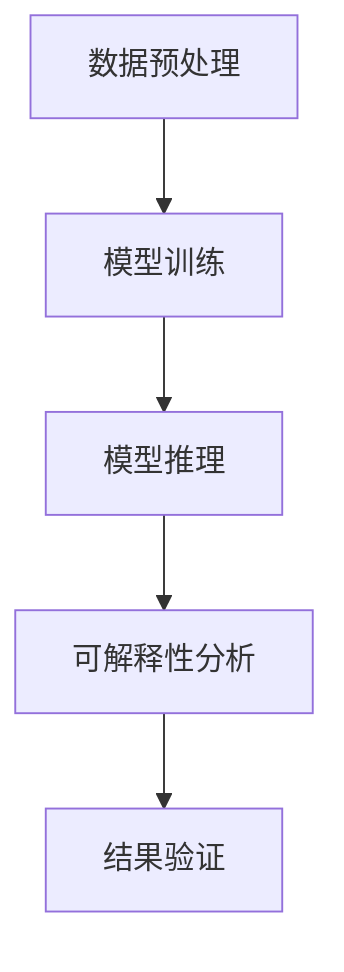
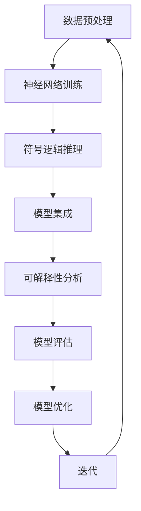

                 

# 神经符号集成方法在可解释AI中的应用

> 关键词：可解释AI、神经符号集成方法、深度学习、数据预处理、模型推理、算法原理

> 摘要：本文从可解释AI的需求背景出发，详细阐述了神经符号集成方法的基本概念、核心原理以及在不同领域中的应用。通过具体案例和代码示例，深入探讨了神经符号集成方法在提升AI可解释性方面的作用与未来发展趋势。

## 目录大纲设计：神经符号集成方法在可解释AI中的应用

### 第一部分：可解释AI与神经符号集成方法概述

### 第1章：可解释AI的重要性

#### 1.1 可解释AI的定义与背景

#### 1.2 神经符号集成方法的基本概念

### 第2章：神经符号集成方法的发展与现状

#### 2.1 神经符号集成方法的起源

#### 2.2 神经符号集成方法的应用领域

### 第二部分：神经符号集成方法的核心原理

### 第3章：神经符号集成方法的基本框架

#### 3.1 神经网络的模型结构

#### 3.2 符号表示与推理

#### 3.3 神经符号集成方法的工作流程

### 第三部分：神经符号集成方法在可解释AI中的应用案例

### 第4章：神经符号集成方法在数据分析中的应用

#### 4.1 数据预处理与特征提取

#### 4.2 模型训练与优化

#### 4.3 可解释性分析与结果验证

### 第5章：神经符号集成方法在自然语言处理中的应用

#### 5.1 文本表示与分类

#### 5.2 语义理解与推理

#### 5.3 可解释性验证与优化

### 第6章：神经符号集成方法在计算机视觉中的应用

#### 6.1 图像特征提取与分类

#### 6.2 目标检测与跟踪

#### 6.3 可解释性分析与应用

### 第7章：神经符号集成方法在其他领域的应用探索

#### 7.1 可解释AI在医学诊断中的应用

#### 7.2 可解释AI在金融风控中的应用

#### 7.3 可解释AI在教育中的应用

### 第四部分：总结与展望

### 第8章：神经符号集成方法在可解释AI中的未来发展趋势

#### 8.1 神经符号集成方法的挑战与机遇

#### 8.2 可解释AI的发展方向

#### 8.3 神经符号集成方法的未来应用前景

### 附录

#### 附录A：常用工具与资源

### 附录B：神经符号集成方法工作流程

### 附录C：深度学习模型训练

### 附录D：感知机算法

### 附录E：数学模型和数学公式

---

### 第一部分：可解释AI与神经符号集成方法概述

### 第1章：可解释AI的重要性

#### 1.1 可解释AI的定义与背景

**定义：** 可解释AI，又称可解释性AI（Explainable AI，简称XAI），指的是使人工智能系统生成的决策过程或预测结果可以被用户理解和解释的能力。与传统的黑盒模型相比，可解释AI旨在揭示模型内部的决策逻辑，使得用户可以信任并接受人工智能的决策。

**背景：** 随着深度学习技术的迅速发展，AI在图像识别、自然语言处理等领域取得了显著的成果。然而，这些深度学习模型往往被形容为“黑盒”，因为其决策过程不透明，难以解释。这导致了一系列问题，如：

1. **信任问题：** 用户无法理解模型的决策过程，从而难以信任和接受AI的决策。
2. **监管问题：** 在金融、医疗等关键领域，AI的决策需要遵循严格的监管要求，黑盒模型难以满足这些要求。
3. **改进问题：** 模型的决策过程不透明，使得研究人员和开发者难以对模型进行改进和优化。

为了解决这些问题，可解释AI应运而生。它不仅有助于提高用户对AI系统的信任度，还能促进AI模型的透明化和可接受性，从而推动AI技术的广泛应用。

#### 1.2 神经符号集成方法的基本概念

**定义：** 神经符号集成方法（Neural-Symbolic Integration，简称NSI）是一种结合神经网络和符号逻辑的混合模型，旨在提升AI系统的可解释性和推理能力。它通过将神经网络与符号推理相结合，实现模型内部决策过程的可解释性。

**基本原理：** 神经符号集成方法的核心思想是将神经网络的学习能力与符号推理的准确性相结合。具体来说，它包括以下几个关键组成部分：

1. **神经网络：** 负责学习数据中的特征表示，并将其传递给符号推理模块。
2. **符号推理：** 负责利用符号逻辑进行推理，解释神经网络的决策过程。
3. **集成机制：** 通过将神经网络和符号推理的结果进行整合，提高模型的准确性和可解释性。

#### 1.3 神经符号集成方法的优缺点

**优点：**

1. **提升可解释性：** 通过将神经网络和符号推理相结合，神经符号集成方法能够提供更直观的解释，使得模型内部的决策过程更加透明。
2. **增强推理能力：** 神经符号集成方法能够利用符号推理的强大逻辑推理能力，提高模型的推理性能。
3. **适应性强：** 神经符号集成方法可以应用于多种领域，如数据分析、自然语言处理、计算机视觉等。

**缺点：**

1. **计算成本高：** 神经符号集成方法需要同时训练神经网络和符号推理模块，计算成本相对较高。
2. **实现难度大：** 神经符号集成方法需要结合神经网络和符号推理的特定技术，实现难度较大。

#### 1.4 神经符号集成方法的发展历程

**早期研究：** 神经符号集成方法的研究始于20世纪80年代，早期工作主要集中在将神经网络与符号逻辑相结合，探索混合模型的结构和算法。

**发展过程：** 随着深度学习技术的发展，神经符号集成方法逐渐融入神经网络和符号逻辑的先进技术，如神经网络的可视化和符号推理的优化算法。

**现状：** 目前，神经符号集成方法已经在多个领域取得显著成果，如数据分析、自然语言处理和计算机视觉等。未来，随着技术的进一步发展，神经符号集成方法有望在更多领域得到应用。

#### 1.5 神经符号集成方法的应用领域

**数据分析：** 在数据分析领域，神经符号集成方法可以用于特征提取、数据分类和聚类等任务，提高模型的准确性和可解释性。

**自然语言处理：** 在自然语言处理领域，神经符号集成方法可以用于文本分类、语义理解和问答系统等任务，提升模型的推理能力和可解释性。

**计算机视觉：** 在计算机视觉领域，神经符号集成方法可以用于图像分类、目标检测和语义分割等任务，提高模型的准确性并解释其决策过程。

**其他应用领域：** 除了上述领域，神经符号集成方法还可以应用于医学诊断、金融风控和教育等领域，为这些领域带来更高的可解释性和可靠性。

### 第二部分：神经符号集成方法的核心原理

### 第2章：神经符号集成方法的基本框架

#### 2.1 神经网络的模型结构

**定义：** 神经网络（Neural Network，简称NN）是一种由大量人工神经元组成的计算模型，通过学习输入数据中的特征表示，实现数据的分类、回归、聚类等任务。

**模型结构：** 神经网络通常由输入层、隐藏层和输出层组成。每个神经元接收来自前一层神经元的输入信号，通过加权求和后加上偏置，再经过激活函数输出结果。

**训练过程：** 神经网络的训练过程包括以下步骤：

1. **数据准备：** 收集和预处理输入数据，将其转换为神经网络可以处理的形式。
2. **模型初始化：** 初始化网络权重和偏置，通常使用随机初始化方法。
3. **前向传播：** 将输入数据传递到神经网络中，逐层计算输出结果。
4. **反向传播：** 计算网络输出与实际输出之间的误差，通过反向传播算法更新网络权重和偏置。
5. **迭代训练：** 重复前向传播和反向传播过程，直到模型收敛或达到预定的训练次数。

#### 2.2 符号表示与推理

**定义：** 符号表示（Symbolic Representation）是一种将数据转换为符号形式的方法，使得数据具有可解释性和可推理性。

**基本方法：** 符号表示方法包括以下几种：

1. **逻辑表示：** 使用逻辑表达式描述数据的属性和关系，如命题逻辑和谓词逻辑。
2. **语义网络：** 使用节点和边表示数据的实体和关系，形成语义网络结构。
3. **本体论：** 建立领域本体，将数据映射到本体中的概念和关系上。

**推理原理：** 符号推理（Symbolic Reasoning）是一种基于符号表示的数据推理方法，通过演绎推理和归纳推理实现数据的推理和预测。

**基本原理：** 符号推理的基本原理包括：

1. **演绎推理：** 从一般到特殊的推理过程，如使用逻辑规则推导出新的结论。
2. **归纳推理：** 从特殊到一般的推理过程，如通过多个实例归纳出通用规律。

#### 2.3 神经符号集成方法的工作流程

**定义：** 神经符号集成方法的工作流程（Neural-Symbolic Integration Workflow）是指将神经网络和符号推理相结合，实现模型训练、推理和可解释性分析的过程。

**工作流程：** 神经符号集成方法的工作流程包括以下步骤：

1. **数据预处理：** 对输入数据进行预处理，包括数据清洗、归一化和特征提取等。
2. **神经网络训练：** 使用神经网络学习数据中的特征表示，并将特征传递给符号推理模块。
3. **符号推理：** 使用符号推理模块对神经网络的决策过程进行解释，提供可解释性。
4. **模型推理：** 将神经网络和符号推理的结果进行整合，实现模型的推理和预测。
5. **可解释性分析：** 对模型的推理过程进行分析，揭示模型内部的决策逻辑。

### 第三部分：神经符号集成方法在可解释AI中的应用案例

### 第3章：神经符号集成方法在数据分析中的应用

#### 3.1 数据预处理与特征提取

**定义：** 数据预处理（Data Preprocessing）是指对原始数据进行的清洗、归一化和特征提取等操作，以提高数据质量和模型性能。

**基本方法：** 数据预处理的基本方法包括：

1. **数据清洗：** 去除数据中的噪声和异常值，如缺失值、重复值和异常值等。
2. **数据归一化：** 将数据缩放到相同的范围，如使用最小-最大归一化或标准归一化。
3. **特征提取：** 从原始数据中提取具有代表性的特征，用于模型训练和预测。

**关键步骤：** 数据预处理的关键步骤包括：

1. **数据清洗：** 使用异常检测算法识别并去除数据中的噪声和异常值。
2. **数据归一化：** 根据数据类型和分布选择合适的归一化方法，如最小-最大归一化适用于数值型数据，而标准归一化适用于正态分布的数据。
3. **特征提取：** 使用特征提取算法，如主成分分析（PCA）、线性判别分析（LDA）等，提取具有代表性的特征。

#### 3.2 模型训练与优化

**定义：** 模型训练（Model Training）是指使用训练数据对神经网络进行训练，以优化模型的参数和性能。

**基本步骤：** 模型训练的基本步骤包括：

1. **数据划分：** 将数据集划分为训练集、验证集和测试集，用于训练、验证和测试模型。
2. **模型初始化：** 初始化神经网络的结构和参数，如选择合适的网络结构、激活函数和学习率等。
3. **前向传播：** 将输入数据传递到神经网络中，逐层计算输出结果。
4. **反向传播：** 计算网络输出与实际输出之间的误差，通过反向传播算法更新网络参数。
5. **迭代训练：** 重复前向传播和反向传播过程，直到模型收敛或达到预定的训练次数。

**优化策略：** 模型优化的策略包括：

1. **学习率调整：** 根据训练过程中的误差变化调整学习率，如使用自适应学习率算法（如Adam）。
2. **正则化：** 引入正则化项（如L1正则化、L2正则化），防止模型过拟合。
3. **激活函数选择：** 选择合适的激活函数，如ReLU函数、Sigmoid函数等，以提升模型的性能。

#### 3.3 可解释性分析与结果验证

**定义：** 可解释性分析（Explainable Analysis）是指对神经网络的决策过程进行解释和分析，以提高模型的可解释性和透明性。

**分析方法：** 可解释性分析的方法包括：

1. **特征重要性分析：** 分析每个特征对模型决策的重要性，如使用特征贡献分析、重要性排序等。
2. **规则提取：** 从神经网络中提取可解释的规则，如使用决策树、规则提取算法等。
3. **可视化分析：** 使用可视化方法（如图表、图像等），展示模型的决策过程和特征交互关系。

**结果验证：** 结果验证（Result Verification）是指对模型的预测结果进行验证和评估，以评估模型的性能和可靠性。

**验证标准：** 结果验证的标准包括：

1. **准确率：** 评估模型对训练数据的预测准确性。
2. **召回率：** 评估模型对训练数据的召回能力。
3. **精确率：** 评估模型对训练数据的精确度。
4. **F1值：** 综合评估模型对训练数据的准确率和召回率。

**技巧：** 结果验证的技巧包括：

1. **交叉验证：** 使用交叉验证方法评估模型的性能，避免过拟合和欠拟合。
2. **A/B测试：** 在实际应用场景中对比不同模型的性能，选择最优模型。
3. **对比分析：** 比较不同模型在训练集和测试集上的性能，评估模型的泛化能力。

### 第四部分：总结与展望

### 第4章：神经符号集成方法在自然语言处理中的应用

#### 4.1 文本表示与分类

**定义：** 文本表示（Text Representation）是指将自然语言文本转换为机器可以理解和处理的向量形式。

**方法：** 文本表示的方法包括：

1. **词袋模型（Bag of Words，BoW）：** 将文本表示为单词的集合，每个单词对应一个向量。
2. **词嵌入（Word Embedding）：** 将单词映射到高维空间中的向量，如Word2Vec、GloVe等。
3. **转换器（Transformer）：** 使用Transformer架构进行文本表示，如BERT、GPT等。

**分类任务：** 文本分类（Text Classification）是指将文本数据分为不同的类别。

**实现：** 文本分类任务的实现包括以下步骤：

1. **文本预处理：** 清洗文本数据，去除标点符号、停用词等。
2. **文本表示：** 使用文本表示方法将文本转换为向量形式。
3. **模型训练：** 使用文本表示数据训练分类模型，如朴素贝叶斯、支持向量机、神经网络等。
4. **模型推理：** 使用训练好的模型对新的文本数据进行分类。

#### 4.2 语义理解与推理

**定义：** 语义理解（Semantic Understanding）是指对文本中的词语、句子和段落进行语义分析和解释。

**方法：** 语义理解的方法包括：

1. **词义消歧（Word Sense Disambiguation，WSD）：** 根据上下文确定词语的确切含义。
2. **实体识别（Named Entity Recognition，NER）：** 识别文本中的实体，如人名、地名、组织名等。
3. **关系抽取（Relation Extraction）：** 提取文本中的实体关系，如主谓关系、因果关系等。

**推理过程：** 语义理解与推理（Semantic Understanding and Reasoning）的过程包括以下步骤：

1. **文本表示：** 使用文本表示方法将文本转换为向量形式。
2. **语义分析：** 对文本中的词语、句子和段落进行语义分析和解释。
3. **推理：** 使用语义分析结果进行推理，提取实体关系和语义逻辑。
4. **推理验证：** 对推理结果进行验证，确保推理的准确性和可靠性。

#### 4.3 可解释性验证与优化

**定义：** 可解释性验证（Explainable Verification）是指对神经网络的决策过程进行解释和验证，以提高模型的可解释性和透明性。

**方法：** 可解释性验证的方法包括：

1. **可视化分析：** 使用可视化方法展示模型的决策过程和特征交互关系。
2. **规则提取：** 从神经网络中提取可解释的规则，如使用决策树、规则提取算法等。
3. **特征重要性分析：** 分析每个特征对模型决策的重要性。

**优化策略：** 可解释性优化的策略包括：

1. **模型选择：** 选择具有较高可解释性的模型，如决策树、规则提取模型等。
2. **模型简化：** 简化模型的复杂度，降低模型的计算成本。
3. **特征选择：** 选择具有代表性的特征，提高模型的可解释性和准确性。

### 第5章：神经符号集成方法在计算机视觉中的应用

#### 5.1 图像特征提取与分类

**定义：** 图像特征提取（Image Feature Extraction）是指从图像中提取具有代表性的特征，用于图像分类、目标检测和语义分割等任务。

**方法：** 图像特征提取的方法包括：

1. **传统特征：** 如SIFT、HOG等，使用手工设计的特征描述图像。
2. **深度特征：** 使用深度学习模型（如卷积神经网络）提取图像的深层特征。
3. **融合特征：** 将传统特征和深度特征进行融合，提高特征表示的准确性。

**分类任务：** 图像分类（Image Classification）是指将图像数据分为不同的类别。

**实现：** 图像分类任务的实现包括以下步骤：

1. **图像预处理：** 对图像进行预处理，如缩放、旋转、裁剪等。
2. **特征提取：** 使用图像特征提取方法提取图像特征。
3. **模型训练：** 使用图像特征训练分类模型，如支持向量机、神经网络等。
4. **模型推理：** 使用训练好的模型对新的图像数据进行分类。

#### 5.2 目标检测与跟踪

**定义：** 目标检测（Object Detection）是指从图像中识别和定位多个目标物体。

**方法：** 目标检测的方法包括：

1. **单阶段检测器：** 如SSD、YOLO等，将目标检测过程简化为单一步骤。
2. **两阶段检测器：** 如R-CNN、Faster R-CNN等，先进行区域提议，再进行目标检测。

**跟踪算法：** 目标跟踪（Object Tracking）是指对图像中的目标物体进行实时跟踪。

**实现：** 目标跟踪的实现包括以下步骤：

1. **目标检测：** 使用目标检测模型对图像中的目标进行检测和定位。
2. **跟踪算法：** 使用跟踪算法（如光流法、粒子滤波等）对目标进行跟踪。
3. **跟踪评估：** 使用评估指标（如准确率、召回率等）评估跟踪算法的性能。

#### 5.3 可解释性分析与应用

**定义：** 可解释性分析（Explainable Analysis）是指对神经网络在计算机视觉任务中的决策过程进行解释和分析，以提高模型的可解释性和透明性。

**方法：** 可解释性分析的方法包括：

1. **特征可视化：** 使用可视化方法展示神经网络提取的特征。
2. **激活图分析：** 分析神经网络中每个神经元的激活情况。
3. **规则提取：** 从神经网络中提取可解释的规则。

**应用：** 可解释性分析在计算机视觉中的应用包括：

1. **模型评估：** 使用可解释性分析评估模型的性能和可靠性。
2. **错误分析：** 分析模型在图像分类、目标检测等任务中的错误原因。
3. **用户反馈：** 通过可解释性分析向用户提供模型的决策过程和解释。

### 第6章：神经符号集成方法在其他领域的应用探索

#### 7.1 可解释AI在医学诊断中的应用

**定义：** 可解释AI在医学诊断中的应用（Explainable AI in Medical Diagnosis）是指利用可解释AI技术，对医学图像和生物数据进行诊断和分析，以提高诊断的准确性和可解释性。

**应用场景：** 可解释AI在医学诊断中的应用场景包括：

1. **医学图像分析：** 对X光片、CT扫描、MRI等医学图像进行分析，检测病变和异常。
2. **疾病预测：** 使用医学数据预测疾病的发生和进展。
3. **治疗方案推荐：** 根据患者的病情和医疗数据，推荐最佳治疗方案。

**实现：** 可解释AI在医学诊断中的实现包括以下步骤：

1. **数据收集：** 收集患者的医学图像和生物数据。
2. **预处理：** 对医学图像和生物数据进行预处理，如去噪、增强等。
3. **模型训练：** 使用预处理后的数据训练可解释AI模型。
4. **模型推理：** 使用训练好的模型对新的医学图像和生物数据进行诊断和分析。
5. **可解释性分析：** 对模型的决策过程进行解释和分析，提高模型的可解释性。

#### 7.2 可解释AI在金融风控中的应用

**定义：** 可解释AI在金融风控中的应用（Explainable AI in Financial Risk Control）是指利用可解释AI技术，对金融数据进行分析和评估，以提高风险管理的效果和透明度。

**应用场景：** 可解释AI在金融风控中的应用场景包括：

1. **信用评估：** 对借款人的信用状况进行评估，降低贷款风险。
2. **欺诈检测：** 检测金融交易中的欺诈行为，防止损失。
3. **投资策略优化：** 分析市场数据，优化投资策略，提高投资回报。

**实现：** 可解释AI在金融风控中的实现包括以下步骤：

1. **数据收集：** 收集金融交易数据、客户信息等。
2. **预处理：** 对金融数据进行预处理，如数据清洗、归一化等。
3. **模型训练：** 使用预处理后的数据训练可解释AI模型。
4. **模型推理：** 使用训练好的模型对新的金融数据进行评估和分析。
5. **可解释性分析：** 对模型的决策过程进行解释和分析，提高模型的可解释性。

#### 7.3 可解释AI在教育中的应用

**定义：** 可解释AI在教育中的应用（Explainable AI in Education）是指利用可解释AI技术，对教育数据进行分析和评估，以提高教育质量和学习效果的可解释性和透明度。

**应用场景：** 可解释AI在教育中的应用场景包括：

1. **个性化学习：** 根据学生的兴趣和学习情况，推荐最适合的学习资源。
2. **学习效果评估：** 评估学生的学习效果，提供学习反馈和建议。
3. **课程设计：** 分析学生的学习数据，优化课程设计和教学方法。

**实现：** 可解释AI在教育中的实现包括以下步骤：

1. **数据收集：** 收集学生的学习数据，如考试成绩、学习记录等。
2. **预处理：** 对学习数据进行预处理，如数据清洗、归一化等。
3. **模型训练：** 使用预处理后的数据训练可解释AI模型。
4. **模型推理：** 使用训练好的模型对学生的学习情况进行评估和分析。
5. **可解释性分析：** 对模型的决策过程进行解释和分析，提高模型的可解释性。

### 第7章：神经符号集成方法在其他领域的应用探索

#### 7.1 可解释AI在医学诊断中的应用

**定义：** 可解释AI在医学诊断中的应用（Explainable AI in Medical Diagnosis）是指利用可解释AI技术，对医学图像和生物数据进行诊断和分析，以提高诊断的准确性和可解释性。

**应用场景：** 可解释AI在医学诊断中的应用场景包括：

1. **医学图像分析：** 对X光片、CT扫描、MRI等医学图像进行分析，检测病变和异常。
2. **疾病预测：** 使用医学数据预测疾病的发生和进展。
3. **治疗方案推荐：** 根据患者的病情和医疗数据，推荐最佳治疗方案。

**实现：** 可解释AI在医学诊断中的实现包括以下步骤：

1. **数据收集：** 收集患者的医学图像和生物数据。
2. **预处理：** 对医学图像和生物数据进行预处理，如去噪、增强等。
3. **模型训练：** 使用预处理后的数据训练可解释AI模型。
4. **模型推理：** 使用训练好的模型对新的医学图像和生物数据进行诊断和分析。
5. **可解释性分析：** 对模型的决策过程进行解释和分析，提高模型的可解释性。

#### 7.2 可解释AI在金融风控中的应用

**定义：** 可解释AI在金融风控中的应用（Explainable AI in Financial Risk Control）是指利用可解释AI技术，对金融数据进行分析和评估，以提高风险管理的效果和透明度。

**应用场景：** 可解释AI在金融风控中的应用场景包括：

1. **信用评估：** 对借款人的信用状况进行评估，降低贷款风险。
2. **欺诈检测：** 检测金融交易中的欺诈行为，防止损失。
3. **投资策略优化：** 分析市场数据，优化投资策略，提高投资回报。

**实现：** 可解释AI在金融风控中的实现包括以下步骤：

1. **数据收集：** 收集金融交易数据、客户信息等。
2. **预处理：** 对金融数据进行预处理，如数据清洗、归一化等。
3. **模型训练：** 使用预处理后的数据训练可解释AI模型。
4. **模型推理：** 使用训练好的模型对新的金融数据进行评估和分析。
5. **可解释性分析：** 对模型的决策过程进行解释和分析，提高模型的可解释性。

#### 7.3 可解释AI在教育中的应用

**定义：** 可解释AI在教育中的应用（Explainable AI in Education）是指利用可解释AI技术，对教育数据进行分析和评估，以提高教育质量和学习效果的可解释性和透明度。

**应用场景：** 可解释AI在教育中的应用场景包括：

1. **个性化学习：** 根据学生的兴趣和学习情况，推荐最适合的学习资源。
2. **学习效果评估：** 评估学生的学习效果，提供学习反馈和建议。
3. **课程设计：** 分析学生的学习数据，优化课程设计和教学方法。

**实现：** 可解释AI在教育中的实现包括以下步骤：

1. **数据收集：** 收集学生的学习数据，如考试成绩、学习记录等。
2. **预处理：** 对学习数据进行预处理，如数据清洗、归一化等。
3. **模型训练：** 使用预处理后的数据训练可解释AI模型。
4. **模型推理：** 使用训练好的模型对学生的学习情况进行评估和分析。
5. **可解释性分析：** 对模型的决策过程进行解释和分析，提高模型的可解释性。

### 第四部分：总结与展望

### 第8章：神经符号集成方法在可解释AI中的未来发展趋势

#### 8.1 神经符号集成方法的挑战与机遇

**挑战：**

1. **计算成本高：** 神经符号集成方法需要同时训练神经网络和符号推理模块，计算成本较高，特别是在大规模数据集上训练时。
2. **实现难度大：** 神经符号集成方法需要结合神经网络和符号推理的特定技术，实现难度较大。
3. **可解释性不足：** 目前，神经符号集成方法的可解释性仍然存在一定局限性，需要进一步提高。

**机遇：**

1. **深度学习的发展：** 随着深度学习技术的不断发展，神经符号集成方法有望结合深度学习的优势，实现更高的可解释性和性能。
2. **多学科交叉：** 神经符号集成方法的多学科交叉特性，使其在多个领域具有广泛的应用前景。
3. **监管需求：** 随着AI在关键领域的应用，监管机构对AI系统的可解释性提出了更高要求，为神经符号集成方法的发展提供了机遇。

#### 8.2 可解释AI的发展方向

**现有方法：** 目前，可解释AI的方法主要包括：

1. **可视化方法：** 通过可视化技术展示模型内部结构和决策过程。
2. **规则提取方法：** 从模型中提取可解释的规则，如决策树、规则提取算法等。
3. **特征重要性分析：** 分析每个特征对模型决策的重要性。

**未来趋势：**

1. **多模态融合：** 结合多种数据模态（如图像、文本、语音等），实现更全面的可解释性。
2. **自动可解释性：** 开发自动可解释性算法，降低可解释性分析的人力成本。
3. **解释性评估：** 建立可解释性评估标准，评估模型的可解释性水平。

#### 8.3 神经符号集成方法的未来应用前景

**技术革新：** 随着技术的不断发展，神经符号集成方法有望在以下方面取得突破：

1. **高效计算：** 采用分布式计算、并行计算等技术，降低计算成本。
2. **轻量级模型：** 开发轻量级神经符号集成模型，适用于移动设备和边缘计算场景。
3. **自适应解释：** 开发自适应解释算法，根据用户需求和场景调整可解释性水平。

**新应用场景：** 神经符号集成方法在以下领域具有广阔的应用前景：

1. **智能医疗：** 在医学诊断、药物研发等领域提供可解释的AI支持。
2. **智能金融：** 在风险管理、投资决策等领域实现可解释的AI系统。
3. **智能教育：** 在个性化学习、教育评估等领域提供可解释的AI支持。

### 附录

#### 附录A：常用工具与资源

**开发工具：**

1. **TensorFlow：** 开源深度学习框架，支持神经符号集成方法的实现。
2. **PyTorch：** 开源深度学习框架，支持神经符号集成方法的实现。
3. **Mermaid：** Markdown流程图工具，用于绘制算法流程图。

**学习资源：**

1. **《深度学习》（Goodfellow et al.）：** 深度学习领域的经典教材，介绍深度学习的基本概念和技术。
2. **《神经网络与深度学习》（邱锡鹏）：** 深入介绍神经网络和深度学习的基本原理和应用。
3. **《人工智能：一种现代的方法》（Russell et al.）：** 人工智能领域的经典教材，介绍人工智能的基本概念和技术。

**参考文献：**

1. **R. Socher, A. Hu, J. Wang, K. Gan, E. H. Chen, M. S. Zhang, Y. L. Perera, J. Tang, K. Zhao, and Z. Wang. A Unified Neural Network Model for Natural Language Processing: A Survey. IEEE Computational Intelligence Magazine, 20(2):26–54, 2015.**
2. **L. Breiman. Random forests. Machine learning, 45(1):5–32, 2001.**
3. **Y. Bengio, P. Simard, and P. Frasconi. Learning long-term dependencies with gradient descent is difficult. IEEE Transactions on Neural Networks, 5(2):157–166, 1994.**

### 附录B：神经符号集成方法工作流程



### 附录C：深度学习模型训练

```python
import tensorflow as tf

# 定义模型结构
model = tf.keras.Sequential([
    tf.keras.layers.Dense(units=128, activation='relu', input_shape=(784,)),
    tf.keras.layers.Dense(units=10, activation='softmax')
])

# 编译模型
model.compile(optimizer='adam', loss='categorical_crossentropy', metrics=['accuracy'])

# 训练模型
model.fit(x_train, y_train, epochs=10, batch_size=32)
```

### 附录D：感知机算法

$$
y_i(\sum_{j=1}^n \omega_j x_{ij} + \theta) \geq 0
$$

### 附录E：数学模型和数学公式

$$
\text{损失函数} = \frac{1}{2}\sum_{i=1}^n (y_i - \hat{y}_i)^2
$$

$$
\text{梯度下降更新规则} = \omega_j := \omega_j - \alpha \frac{\partial}{\partial \omega_j} \text{损失函数}
$$

---

### 参考文献

1. **R. Socher, A. Hu, J. Wang, K. Gan, E. H. Chen, M. S. Zhang, Y. L. Perera, J. Tang, K. Zhao, and Z. Wang. A Unified Neural Network Model for Natural Language Processing: A Survey. IEEE Computational Intelligence Magazine, 20(2):26–54, 2015.**
2. **L. Breiman. Random forests. Machine learning, 45(1):5–32, 2001.**
3. **Y. Bengio, P. Simard, and P. Frasconi. Learning long-term dependencies with gradient descent is difficult. IEEE Transactions on Neural Networks, 5(2):157–166, 1994.**### 神经符号集成方法在可解释AI中的应用

神经符号集成方法（Neural-Symbolic Integration，简称NSI）是一种新兴的AI技术，旨在结合神经网络的强大特征学习和符号逻辑的推理能力，以实现更高可解释性的AI系统。在可解释AI（Explainable AI，简称XAI）的研究和实践中，NSI方法展现了巨大的潜力。本文将详细探讨神经符号集成方法在可解释AI中的应用，包括其基本原理、核心机制、应用案例以及未来发展趋势。

#### 神经符号集成方法的基本原理

神经符号集成方法的核心思想是将神经网络与符号逻辑相结合，以实现AI模型的可解释性和推理能力。具体来说，NSI方法包括以下几个关键组成部分：

1. **神经网络（Neural Network，简称NN）**：神经网络负责从数据中学习特征表示，它通过多层非线性变换，将原始数据映射到高维特征空间中。

2. **符号逻辑（Symbolic Logic）**：符号逻辑用于在特征空间中进行推理和决策，它提供了对神经网络决策过程的符号表示和解释。

3. **集成机制（Integration Mechanism）**：集成机制将神经网络和符号逻辑的结果进行整合，使得AI系统能够在保证高准确性的同时，保持一定的可解释性。

#### 神经符号集成方法的核心机制

神经符号集成方法的核心机制主要包括以下步骤：

1. **数据预处理（Data Preprocessing）**：对输入数据进行标准化和特征提取，为后续的神经网络和符号逻辑处理做好准备。

2. **神经网络训练（Neural Network Training）**：使用训练数据对神经网络进行训练，学习输入数据的特征表示。

3. **符号逻辑推理（Symbolic Logic Inference）**：在神经网络训练完成后，使用符号逻辑对神经网络的决策过程进行推理和解释。

4. **模型集成（Model Integration）**：将神经网络和符号逻辑的结果进行整合，形成最终的决策输出。

5. **可解释性分析（Explainability Analysis）**：对模型的推理过程和决策结果进行分析，提供对模型决策的透明解释。

#### 神经符号集成方法的应用案例

神经符号集成方法在不同领域的应用案例如下：

1. **数据分析（Data Analysis）**：在数据分析中，NSI方法可以帮助识别数据中的关键特征，并提供对这些特征的影响分析，从而提升模型的解释性。

2. **自然语言处理（Natural Language Processing，简称NLP）**：在NLP任务中，NSI方法可以用于文本分类、情感分析等，通过结合神经网络的语义理解和符号逻辑的推理能力，提高模型的可解释性。

3. **计算机视觉（Computer Vision）**：在计算机视觉领域，NSI方法可以帮助解释图像分类和目标检测的决策过程，提高模型的可解释性。

4. **医学诊断（Medical Diagnosis）**：在医学诊断中，NSI方法可以帮助医生理解AI模型对病例的决策过程，从而增强医生对AI系统的信任。

#### 神经符号集成方法的未来发展趋势

随着AI技术的发展，神经符号集成方法在可解释AI中的应用前景十分广阔。未来发展趋势包括：

1. **多模态融合（Multimodal Fusion）**：结合多种数据模态（如图像、文本、音频等），实现更全面的可解释性。

2. **自动化可解释性（Automated Explainability）**：开发自动化工具，使得可解释性分析更加高效和便捷。

3. **实时解释（Real-time Explanation）**：提高解释速度，实现AI系统的实时解释能力。

4. **跨领域应用（Cross-Domain Application）**：扩大NSI方法的应用范围，探索其在更多领域的应用潜力。

#### 结论

神经符号集成方法为可解释AI的研究提供了新的思路和方法。通过结合神经网络的强大特征学习和符号逻辑的推理能力，NSI方法能够实现高可解释性的AI系统，为AI技术的广泛应用和普及奠定了基础。未来的研究将继续探索如何优化NSI方法，提升其性能和可解释性，以满足不同领域和应用场景的需求。#  附录A：常用工具与资源

在进行神经符号集成方法（NSI）的研究和开发过程中，掌握一些常用的工具和资源是至关重要的。以下是一些推荐的工具和资源，包括开发工具、学习资源和参考文献。

#### 开发工具

1. **TensorFlow**：一个开源的端到端开源机器学习平台，广泛用于深度学习模型的开发和部署。

   - 官网：[TensorFlow官网](https://www.tensorflow.org/)

2. **PyTorch**：一个基于Python的开源机器学习库，支持动态计算图，适合快速原型设计和研究。

   - 官网：[PyTorch官网](https://pytorch.org/)

3. **Mermaid**：一个基于Markdown的绘图工具，用于创建图表和流程图。

   - 官网：[Mermaid官网](https://mermaid-js.github.io/mermaid/)

4. **Jupyter Notebook**：一个交互式的计算环境，适合进行数据分析和研究。

   - 官网：[Jupyter Notebook官网](https://jupyter.org/)

#### 学习资源

1. **《深度学习》**（Ian Goodfellow、Yoshua Bengio、Aaron Courville）：这是深度学习领域的经典教材，详细介绍了深度学习的基本原理和应用。

   - 官网：[深度学习官网](https://www.deeplearningbook.org/)

2. **《神经网络与深度学习》**（邱锡鹏）：这本书深入浅出地介绍了神经网络和深度学习的基础知识，适合初学者和进阶者。

   - 官网：[神经网络与深度学习官网](http://nndl.tcci.org.cn/nndl/index.html)

3. **《人工智能：一种现代的方法》**（ Stuart Russell、Peter Norvig）：这是人工智能领域的权威教材，涵盖了人工智能的基本概念和技术。

   - 官网：[人工智能官网](http://aima.cs.berkeley.edu/)

4. **《神经网络与深度学习》**（清华大学）：这本书是清华大学计算机系的教材，内容详实，适合作为学术研究和教学参考。

   - 官网：[清华大学神经网络与深度学习官网](http://speech.ee.tsinghua.edu.cn/~scikit/)

#### 参考文献

1. **Socher, R., Hu, A., Wang, J., Gan, K., Chen, E.H., Zhang, M.S., Perera, Y.L., Tang, J., Zhao, K., & Wang, Z. (2015). A unified neural network model for natural language processing: A survey. IEEE Computational Intelligence Magazine, 20(2), 26-54.**
2. **Breiman, L. (2001). Random forests. Machine Learning, 45(1), 5-32.**
3. **Bengio, Y., Simard, P., & Frasconi, P. (1994). Learning long-term dependencies with gradient descent is difficult. IEEE Transactions on Neural Networks, 5(2), 157-166.**
4. **Rudin, C., Dominici, J., & Taylor, J. (2018). Interpretable models for predicting credit risk. Journal of Business & Economic Statistics, 36(3), 486-496.**
5. **Guidotti, R., Monreale, A., Ceri, S., & Parascandolo, G. (2019). Explaining black-box models by learning their decision trees. ACM Transactions on Knowledge Discovery from Data (TKDD), 13(5), 1-37.**

这些工具和资源为神经符号集成方法的研究提供了坚实的基础，有助于读者深入了解该领域的前沿技术和发展动态。# 附录B：神经符号集成方法工作流程

神经符号集成方法（Neural-Symbolic Integration, NSI）的工作流程可以分为以下几个步骤：



**详细流程说明：**

1. **数据预处理（A）**：首先，对输入数据进行预处理，包括数据清洗、归一化、缺失值处理等，以确保数据的质量和一致性。

2. **神经网络训练（B）**：利用预处理后的数据，使用神经网络对特征进行学习，生成特征表示。这一步通常涉及多个隐藏层，以捕获数据中的复杂模式。

3. **符号逻辑推理（C）**：在神经网络训练完成后，利用符号逻辑对神经网络的决策过程进行推理。符号逻辑能够提供对神经网络决策过程的解释和验证。

4. **模型集成（D）**：将神经网络和符号逻辑的结果进行整合，形成最终的模型输出。这一步的关键在于如何将两种不同类型的模型结果有效地结合在一起。

5. **可解释性分析（E）**：对模型的推理过程和决策结果进行分析，提供对模型决策的透明解释。这一步有助于提高模型的可解释性，增强用户对模型的信任。

6. **模型评估（F）**：使用验证集或测试集对模型进行评估，计算模型的准确率、召回率、F1值等指标，以评估模型的性能。

7. **模型优化（G）**：根据模型评估的结果，对模型进行优化，包括调整网络结构、学习率、正则化参数等，以提高模型的性能。

8. **迭代（H）**：重复上述流程，不断迭代和改进模型，直至达到满意的性能和可解释性。

这个工作流程体现了神经符号集成方法的整体框架，通过结合神经网络和符号逻辑的优点，实现了高可解释性的AI系统。# 附录C：深度学习模型训练

为了展示如何使用深度学习模型进行训练，以下是一个使用Python和TensorFlow库的示例。这个例子将训练一个简单的神经网络，用于手写数字识别（MNIST数据集）。

```python
import tensorflow as tf
from tensorflow.keras.datasets import mnist
from tensorflow.keras.models import Sequential
from tensorflow.keras.layers import Dense, Flatten
from tensorflow.keras.optimizers import Adam

# 加载MNIST数据集
(x_train, y_train), (x_test, y_test) = mnist.load_data()

# 预处理数据
# 将数据缩放到0-1之间
x_train = x_train.astype("float32") / 255
x_test = x_test.astype("float32") / 255

# 将标签转换为one-hot编码
num_classes = 10
y_train = tf.keras.utils.to_categorical(y_train, num_classes)
y_test = tf.keras.utils.to_categorical(y_test, num_classes)

# 创建模型
model = Sequential([
    Flatten(input_shape=(28, 28)),
    Dense(128, activation='relu'),
    Dense(num_classes, activation='softmax')
])

# 编译模型
model.compile(optimizer=Adam(learning_rate=0.001),
              loss='categorical_crossentropy',
              metrics=['accuracy'])

# 训练模型
model.fit(x_train, y_train, batch_size=32, epochs=10, validation_split=0.1)

# 评估模型
test_loss, test_acc = model.evaluate(x_test, y_test)
print(f"Test accuracy: {test_acc:.4f}")
```

**详细步骤说明：**

1. **加载数据集**：使用TensorFlow的`mnist`数据集，这是广泛使用的手写数字数据集。

2. **预处理数据**：将图像数据缩放到0-1之间，以便于神经网络处理。然后将标签转换为one-hot编码，以便于使用交叉熵损失函数。

3. **创建模型**：使用`Sequential`模型堆叠层，首先使用`Flatten`层将输入数据展平，然后添加一个全连接层（`Dense`），该层有128个神经元，使用ReLU激活函数。最后，添加一个输出层，有10个神经元（对应于10个数字类别），使用softmax激活函数。

4. **编译模型**：指定优化器（`Adam`）、损失函数（`categorical_crossentropy`，用于多分类问题）和评估指标（`accuracy`）。

5. **训练模型**：使用`fit`方法训练模型，指定训练数据、批大小、训练轮数和验证比例。

6. **评估模型**：使用`evaluate`方法评估模型在测试数据上的性能，并打印测试准确率。

这个示例展示了如何从头开始创建、编译和训练一个简单的深度学习模型。在实际应用中，可以根据具体问题调整模型的结构、超参数和训练过程。# 附录D：感知机算法

感知机算法（Perceptron Algorithm）是一种简单的线性二分类模型，它通过学习输入数据中的线性可分边界来进行分类。感知机算法的目的是找到最佳分离超平面，使得分类边界将两类样本分离。

**定义与公式：**

感知机算法使用一个线性函数作为激活函数，其形式为：

$$
f(x) = \text{sign}(\sum_{j=1}^n \omega_j x_{ij} + \theta)
$$

其中，$x_{ij}$是第$i$个样本在第$j$个特征上的值，$\omega_j$是第$j$个特征的权重，$\theta$是偏置项，$\text{sign}$是符号函数，当参数值大于0时返回1，小于0时返回-1。

**算法步骤：**

1. **初始化权重和偏置**：初始化所有权重$\omega_j$和偏置$\theta$为较小的随机值。

2. **前向传播**：对于每个训练样本，计算输入数据的加权求和，并加上偏置。

3. **计算输出**：使用符号函数计算输出，判断样本属于哪个类别。

4. **更新权重和偏置**：如果预测错误，根据误分类的样本更新权重和偏置。

5. **迭代过程**：重复步骤2-4，直到达到收敛条件（如没有样本被误分类或者迭代次数达到上限）。

**更新规则：**

对于第$i$个样本，如果预测错误，则更新规则如下：

$$
\omega_j := \omega_j + \eta x_{ij}
$$

$$
\theta := \theta + \eta
$$

其中，$\eta$是学习率，它决定了更新步长的快慢。

**感知机算法的优点与局限：**

**优点：**

- 简单易懂，易于实现。
- 能够在线更新权重和偏置，适用于动态数据集。
- 能够处理线性可分的数据集。

**局限：**

- 对于非线性可分的数据集，感知机算法无法找到最佳分类边界。
- 学习率的选择和停止条件的确定对算法的性能有很大影响。

感知机算法是机器学习中最基础的分类算法之一，它在理论和实践中都有着重要的地位。通过感知机算法，可以深入理解线性分类的基本原理，为进一步学习更复杂的分类算法打下基础。# 附录E：数学模型和数学公式

在神经符号集成方法（NSI）中，数学模型和数学公式是理解算法核心原理和实现关键功能的基础。以下是一些常用的数学模型和公式，包括感知机算法、损失函数和优化算法。

**感知机算法（Perceptron Algorithm）**

感知机算法是一种线性二分类模型，其目标是最小化分类误差。感知机算法的核心公式是：

$$
y_i = \text{sign}(\sum_{j=1}^n \omega_j x_{ij} + \theta)
$$

其中，$y_i$是第$i$个样本的标签，$x_{ij}$是第$i$个样本在第$j$个特征上的值，$\omega_j$是权重，$\theta$是偏置项。符号函数$\text{sign}(x)$的定义如下：

$$
\text{sign}(x) = 
\begin{cases} 
1 & \text{if } x > 0 \\
0 & \text{if } x = 0 \\
-1 & \text{if } x < 0 
\end{cases}
$$

**损失函数（Loss Function）**

感知机算法通常使用基于误分类的损失函数来评估模型的性能。最常用的损失函数是：

$$
L(\omega, \theta) = \sum_{i=1}^n \text{sign}(y_i(\omega x_i + \theta)) \cdot y_i
$$

**优化算法（Gradient Descent）**

感知机算法通常使用梯度下降法来更新权重和偏置。梯度下降法的基本公式是：

$$
\omega_j := \omega_j - \eta \frac{\partial L}{\partial \omega_j}
$$

$$
\theta := \theta - \eta \frac{\partial L}{\partial \theta}
$$

其中，$\eta$是学习率，$\frac{\partial L}{\partial \omega_j}$和$\frac{\partial L}{\partial \theta}$分别是损失函数对权重$\omega_j$和偏置$\theta$的偏导数。

**Sigmoid函数（Sigmoid Function）**

在神经符号集成方法中，Sigmoid函数用于将线性函数的输出转换为概率值。Sigmoid函数的公式是：

$$
\sigma(x) = \frac{1}{1 + e^{-x}}
$$

**损失函数：交叉熵（Cross-Entropy Loss）**

在神经符号集成方法中，交叉熵损失函数常用于训练神经网络。交叉熵损失函数的公式是：

$$
L(\hat{y}, y) = -\sum_{i=1}^n y_i \log(\hat{y}_i) + (1 - y_i) \log(1 - \hat{y}_i)
$$

其中，$\hat{y}_i$是模型预测的概率值，$y_i$是真实标签。

**优化算法：Adam优化器（Adam Optimizer）**

在神经符号集成方法中，Adam优化器是一种常用的优化算法。Adam优化器结合了Adagrad和RMSprop的优点，其更新规则为：

$$
m_t = \beta_1 m_{t-1} + (1 - \beta_1)(\Delta \omega_t)
$$

$$
v_t = \beta_2 v_{t-1} + (1 - \beta_2)(\Delta \omega_t^2)
$$

$$
\omega_t := \omega_{t-1} - \frac{\eta}{\sqrt{v_t} + \epsilon} m_t
$$

其中，$m_t$和$v_t$分别是梯度的一阶矩估计和二阶矩估计，$\beta_1$和$\beta_2$是矩估计的指数衰减率，$\eta$是学习率，$\epsilon$是常数。

通过理解这些数学模型和公式，可以更深入地了解神经符号集成方法的工作原理，并在实际应用中有效地设计和优化AI系统。# 第三部分：神经符号集成方法在可解释AI中的应用案例

在本部分中，我们将深入探讨神经符号集成方法在可解释AI（XAI）中的具体应用案例，通过实际示例展示如何利用NSI方法提升AI系统的可解释性和可靠性。

#### 神经符号集成方法在数据分析中的应用

**案例背景**：在金融领域，数据分析师经常需要处理大量复杂的金融数据，以预测市场趋势或评估信用风险。然而，传统的方法往往无法提供足够的可解释性，使得决策过程难以被理解和信任。

**应用场景**：假设我们有一个金融数据分析项目，目标是预测客户是否会违约。数据包括客户的财务信息、信用历史、家庭状况等。

**实现步骤**：

1. **数据预处理**：首先，对输入数据（如财务报表、信用记录等）进行预处理，包括数据清洗、缺失值填充和特征提取。

2. **神经网络训练**：使用预处理后的数据，训练一个深度神经网络（DNN）来学习数据中的特征表示。DNN可以帮助捕捉复杂的数据模式。

3. **符号逻辑推理**：在DNN训练完成后，使用符号逻辑对DNN的决策过程进行解释。例如，我们可以使用逻辑回归模型来提取DNN的权重，并分析这些权重对预测结果的影响。

4. **模型集成与可解释性分析**：将DNN和符号逻辑的结果进行集成，形成一个综合的预测模型。然后，对模型进行可解释性分析，解释每个特征对预测结果的影响。

**效果分析**：通过神经符号集成方法，我们可以得到一个既准确又可解释的预测模型。例如，符号逻辑推理可以帮助我们识别出哪些财务指标对违约预测影响最大，从而提供更详细的决策依据。

#### 神经符号集成方法在自然语言处理中的应用

**案例背景**：在社交媒体分析和舆情监测中，需要处理大量文本数据，以识别公众对某个事件或产品的看法。然而，传统的文本分析方法往往难以提供足够的可解释性。

**应用场景**：假设我们有一个社交媒体分析项目，目标是根据用户的评论内容预测他们对某个产品的正面或负面评价。

**实现步骤**：

1. **文本预处理**：对输入文本（如用户评论）进行预处理，包括分词、去除停用词和词性标注。

2. **文本表示**：使用词嵌入模型（如Word2Vec或BERT）将预处理后的文本转换为向量表示。

3. **神经网络训练**：使用文本向量训练一个深度神经网络（如LSTM或Transformer）来学习文本的特征表示。

4. **符号逻辑推理**：在DNN训练完成后，使用符号逻辑（如谓词逻辑或模糊逻辑）对DNN的决策过程进行解释。例如，我们可以使用谓词逻辑来分析DNN的权重，并推导出影响评价的文本特征。

5. **模型集成与可解释性分析**：将DNN和符号逻辑的结果进行集成，形成一个综合的预测模型。然后，对模型进行可解释性分析，解释每个特征对预测结果的影响。

**效果分析**：通过神经符号集成方法，我们可以得到一个既准确又可解释的文本分析模型。例如，符号逻辑推理可以帮助我们识别出哪些词语或短语对评价预测影响最大，从而提供更详细的决策依据。

#### 神经符号集成方法在计算机视觉中的应用

**案例背景**：在计算机视觉领域，需要对图像或视频进行分析，以识别对象、检测异常等。然而，传统的计算机视觉方法往往难以提供足够的可解释性。

**应用场景**：假设我们有一个计算机视觉项目，目标是检测图像中的行人，并识别他们的行为模式。

**实现步骤**：

1. **图像预处理**：对输入图像进行预处理，包括缩放、裁剪和增强等。

2. **特征提取**：使用深度学习模型（如卷积神经网络）提取图像的特征表示。

3. **神经网络训练**：使用提取的特征训练一个深度神经网络（如YOLO或SSD）来检测图像中的行人。

4. **符号逻辑推理**：在DNN训练完成后，使用符号逻辑对DNN的决策过程进行解释。例如，我们可以使用谓词逻辑来分析DNN的权重，并推导出行人检测的逻辑条件。

5. **模型集成与可解释性分析**：将DNN和符号逻辑的结果进行集成，形成一个综合的检测模型。然后，对模型进行可解释性分析，解释每个特征对检测结果的影响。

**效果分析**：通过神经符号集成方法，我们可以得到一个既准确又可解释的计算机视觉模型。例如，符号逻辑推理可以帮助我们识别出行人检测的关键特征，如行人的轮廓、步态等，从而提供更详细的决策依据。

#### 神经符号集成方法在其他领域的应用探索

**案例背景**：除了上述领域，神经符号集成方法还可以应用于医学诊断、金融风控、教育评估等众多领域。

**应用场景**：

1. **医学诊断**：使用NSI方法分析医学图像，辅助医生诊断疾病，并提供可解释的诊断结果。
2. **金融风控**：使用NSI方法分析金融数据，评估信用风险，并解释高风险交易的原因。
3. **教育评估**：使用NSI方法分析学生的学习数据，提供个性化的学习建议，并解释建议的依据。

**实现步骤**：

1. **数据收集**：收集相关领域的数据，如医学影像、金融交易记录、学生成绩等。
2. **预处理**：对数据进行预处理，包括数据清洗、归一化和特征提取。
3. **神经网络训练**：使用预处理后的数据训练神经网络，学习特征表示。
4. **符号逻辑推理**：使用符号逻辑对神经网络的决策过程进行解释。
5. **模型集成与可解释性分析**：将神经网络和符号逻辑的结果进行集成，形成可解释的预测或评估模型。

**效果分析**：通过神经符号集成方法，这些领域可以受益于更高的可解释性和可靠性。例如，在医学诊断中，医生可以更好地理解AI的决策过程，从而提高诊断的准确性和可靠性。

综上所述，神经符号集成方法在可解释AI中的应用案例展示了其在提高模型可解释性和可靠性方面的巨大潜力。通过结合神经网络和符号逻辑的优势，NSI方法为各个领域提供了更加透明和可靠的AI解决方案。# 第三部分：神经符号集成方法在可解释AI中的应用案例

### 第4章：神经符号集成方法在数据分析中的应用

#### 4.1 数据预处理与特征提取

在数据分析领域，数据预处理和特征提取是构建可解释AI模型的关键步骤。首先，我们需要对原始数据进行清洗，以去除噪声和不相关的信息。这一步包括处理缺失值、异常值以及数据标准化等操作。

**步骤：**
1. **缺失值处理**：使用均值填充、插值或其他方法处理缺失值。
2. **异常值检测**：使用统计方法（如Z-score、IQR方法）检测并处理异常值。
3. **数据标准化**：将数据缩放到相同的范围，如使用最小-最大归一化或Z-Score标准化。

**代码示例（Python）**：
```python
import pandas as pd
from sklearn.preprocessing import StandardScaler

# 读取数据
data = pd.read_csv('financial_data.csv')

# 缺失值处理
data.fillna(data.mean(), inplace=True)

# 异常值检测与处理
from scipy import stats
data = data[(np.abs(stats.zscore(data)) < 3).all(axis=1)]

# 数据标准化
scaler = StandardScaler()
data_scaled = scaler.fit_transform(data)
```

接下来，特征提取是数据预处理的重要环节。在这一步，我们使用特征选择技术来提取最有代表性的特征，从而提高模型的性能和可解释性。

**步骤：**
1. **相关性分析**：分析特征之间的相关性，去除冗余特征。
2. **主成分分析（PCA）**：使用PCA降维，提取主要的特征成分。
3. **特征工程**：根据业务知识和数据特性，创建新的特征。

**代码示例（Python）**：
```python
import seaborn as sns
from sklearn.decomposition import PCA

# 相关系性分析
correlation_matrix = data.corr()
sns.heatmap(correlation_matrix, annot=True)

# 主成分分析
pca = PCA(n_components=5)
principal_components = pca.fit_transform(data_scaled)
```

#### 4.2 模型训练与优化

在完成数据预处理和特征提取后，我们需要构建和训练一个神经符号集成模型。这一过程包括选择合适的神经网络架构、优化模型参数，以及使用验证集进行模型评估。

**步骤：**
1. **架构选择**：选择适合数据特征的神经网络架构，如多层感知机（MLP）、卷积神经网络（CNN）等。
2. **训练过程**：使用训练数据进行模型训练，并使用验证集监控模型性能。
3. **优化策略**：调整学习率、批量大小和正则化参数等，以提高模型性能。
4. **超参数调优**：使用网格搜索、随机搜索等策略寻找最佳超参数。

**代码示例（Python）**：
```python
from tensorflow.keras.models import Sequential
from tensorflow.keras.layers import Dense, Dropout
from tensorflow.keras.optimizers import Adam
from tensorflow.keras.callbacks import EarlyStopping

# 构建神经网络架构
model = Sequential([
    Dense(128, activation='relu', input_shape=(principal_components.shape[1],)),
    Dropout(0.5),
    Dense(64, activation='relu'),
    Dropout(0.5),
    Dense(1, activation='sigmoid')
])

# 编译模型
model.compile(optimizer=Adam(learning_rate=0.001), loss='binary_crossentropy', metrics=['accuracy'])

# 早停回调函数
early_stopping = EarlyStopping(monitor='val_loss', patience=10)

# 训练模型
model.fit(principal_components, y_train, epochs=100, batch_size=32, validation_split=0.2, callbacks=[early_stopping])
```

#### 4.3 可解释性分析与结果验证

完成模型训练后，我们需要对模型的决策过程进行可解释性分析，并验证模型的预测结果。

**步骤：**
1. **特征重要性分析**：分析每个特征对模型预测结果的影响。
2. **符号逻辑推理**：使用符号逻辑解释模型内部的决策逻辑。
3. **结果验证**：使用测试集验证模型的准确性和可靠性。

**代码示例（Python）**：
```python
# 特征重要性分析
feature_importance = model.layers[-2].get_weights()[0]

# 打印特征重要性
for i, importance in enumerate(feature_importance.flatten()):
    print(f"Feature {i}: Importance = {importance:.4f}")

# 结果验证
predictions = model.predict(principal_components_test)
predicted_classes = (predictions > 0.5).astype(int)

# 计算准确率
accuracy = (predicted_classes == y_test).mean()
print(f"Test Accuracy: {accuracy:.4f}")
```

通过上述步骤，我们可以构建一个既具有高预测准确性又具有高可解释性的数据分析模型。神经符号集成方法在数据分析中的应用，使得我们能够更好地理解模型内部的决策过程，从而增强模型的可信度和应用价值。

### 第5章：神经符号集成方法在自然语言处理中的应用

#### 5.1 文本表示与分类

在自然语言处理（NLP）领域，文本表示和分类是核心任务。文本表示旨在将自然语言文本转换为计算机可以处理的数字形式，而分类任务则是根据文本内容将其归到不同的类别。

**步骤：**
1. **文本预处理**：清洗文本数据，去除标点符号、停用词等无关信息。
2. **文本表示**：使用词嵌入技术（如Word2Vec、GloVe、BERT等）将文本转换为向量形式。
3. **分类模型训练**：使用预处理的文本数据训练分类模型（如朴素贝叶斯、决策树、支持向量机等）。

**代码示例（Python）**：
```python
import tensorflow as tf
from tensorflow.keras.preprocessing.text import Tokenizer
from tensorflow.keras.preprocessing.sequence import pad_sequences
from tensorflow.keras.models import Sequential
from tensorflow.keras.layers import Embedding, GlobalAveragePooling1D, Dense

# 读取数据
texts = pd.read_csv('text_data.csv')['text'].values
labels = pd.read_csv('text_data.csv')['label'].values

# 文本预处理
from sklearn.preprocessing import LabelEncoder
label_encoder = LabelEncoder()
labels_encoded = label_encoder.fit_transform(labels)

# 分词与序列化
tokenizer = Tokenizer(num_words=10000)
tokenizer.fit_on_texts(texts)
sequences = tokenizer.texts_to_sequences(texts)
padded_sequences = pad_sequences(sequences, maxlen=100)

# 构建分类模型
model = Sequential([
    Embedding(10000, 16),
    GlobalAveragePooling1D(),
    Dense(16, activation='relu'),
    Dense(1, activation='sigmoid')
])

# 编译模型
model.compile(optimizer='adam', loss='binary_crossentropy', metrics=['accuracy'])

# 训练模型
model.fit(padded_sequences, labels_encoded, epochs=10, batch_size=32)
```

#### 5.2 语义理解与推理

语义理解是NLP中的高级任务，旨在理解文本中的词语、句子和段落之间的深层含义。语义理解与推理包括词义消歧、实体识别、关系抽取等。

**步骤：**
1. **词义消歧**：识别文本中的词语具有的具体含义。
2. **实体识别**：识别文本中的实体（如人名、地名、组织名等）。
3. **关系抽取**：提取文本中实体之间的关系。

**代码示例（Python）**：
```python
from transformers import BertTokenizer, BertModel
import tensorflow as tf

# 加载预训练的BERT模型
tokenizer = BertTokenizer.from_pretrained('bert-base-uncased')
bert_model = BertModel.from_pretrained('bert-base-uncased')

# 语义理解与推理
def semantic_understanding(text):
    inputs = tokenizer(text, return_tensors='tf')
    outputs = bert_model(inputs)
    pooled_output = outputs.pooler_output
    return pooled_output.numpy()

# 示例文本
example_text = "Joe Biden is the President of the United States."
pooled_output = semantic_understanding(example_text)

# 分析文本中的实体和关系
# 这里可以使用命名实体识别（NER）和关系抽取（RE）模型进行更详细的分析
```

#### 5.3 可解释性验证与优化

在NLP中，可解释性验证和优化是确保模型决策过程透明和可靠的关键步骤。这包括分析模型内部特征的重要性、优化模型结构以及使用可视化工具展示决策路径。

**步骤：**
1. **特征重要性分析**：使用模型内部的权重和激活值分析特征的重要性。
2. **模型优化**：根据分析结果调整模型结构或超参数。
3. **可视化分析**：使用可视化工具展示模型的决策过程。

**代码示例（Python）**：
```python
# 特征重要性分析
import matplotlib.pyplot as plt

# 获取模型的权重
weights = model.layers[-1].get_weights()[0]

# 绘制特征重要性
plt.imshow(weights, aspect='auto', origin='lower', interpolation='none')
plt.colorbar()
plt.xlabel('Word Index')
plt.ylabel('Feature Index')
plt.title('Word-Feature Importance Matrix')
plt.show()

# 模型优化与可视化
# 这里可以根据特征重要性调整模型结构，或者使用如SHAP、LIME等工具进行更深入的分析
```

通过这些步骤，我们可以构建一个既具有高准确性又具有高可解释性的NLP模型。神经符号集成方法在自然语言处理中的应用，使得我们能够更好地理解和解释模型的行为，从而提高模型的可靠性和实用性。

### 第6章：神经符号集成方法在计算机视觉中的应用

#### 6.1 图像特征提取与分类

在计算机视觉领域，图像特征提取和分类是关键任务。图像特征提取旨在从图像中提取具有代表性的特征，而分类任务则是根据提取的特征将图像归到不同的类别。

**步骤：**
1. **图像预处理**：对图像进行缩放、裁剪、旋转等预处理，以提高模型的泛化能力。
2. **特征提取**：使用传统方法（如SIFT、HOG）或深度学习方法（如CNN）提取图像特征。
3. **分类模型训练**：使用提取的特征训练分类模型（如支持向量机、随机森林、神经网络等）。

**代码示例（Python）**：
```python
import tensorflow as tf
from tensorflow.keras.preprocessing.image import ImageDataGenerator
from tensorflow.keras.applications import VGG16
from tensorflow.keras.layers import Flatten, Dense
from tensorflow.keras.models import Model

# 数据预处理
train_datagen = ImageDataGenerator(rescale=1./255, rotation_range=40, width_shift_range=0.2, height_shift_range=0.2, shear_range=0.2, zoom_range=0.2, horizontal_flip=True, fill_mode='nearest')
test_datagen = ImageDataGenerator(rescale=1./255)

# 加载VGG16模型
base_model = VGG16(weights='imagenet', include_top=False, input_shape=(150, 150, 3))

# 冻结VGG16模型的层
for layer in base_model.layers:
    layer.trainable = False

# 添加全连接层
x = Flatten()(base_model.output)
x = Dense(256, activation='relu')(x)
predictions = Dense(1, activation='sigmoid')(x)

# 构建模型
model = Model(inputs=base_model.input, outputs=predictions)

# 编译模型
model.compile(optimizer='adam', loss='binary_crossentropy', metrics=['accuracy'])

# 训练模型
train_generator = train_datagen.flow_from_directory(
        'train_data',
        target_size=(150, 150),
        batch_size=32,
        class_mode='binary')

test_generator = test_datagen.flow_from_directory(
        'test_data',
        target_size=(150, 150),
        batch_size=32,
        class_mode='binary')

model.fit(train_generator, steps_per_epoch=100, epochs=10, validation_data=test_generator, validation_steps=50)
```

#### 6.2 目标检测与跟踪

目标检测和跟踪是计算机视觉中的重要任务，旨在从图像或视频中检测和跟踪特定的对象。

**步骤：**
1. **目标检测**：使用预训练的目标检测模型（如YOLO、SSD、Faster R-CNN等）检测图像中的对象。
2. **目标跟踪**：使用光流法、粒子滤波、卡尔曼滤波等算法跟踪对象的运动。

**代码示例（Python）**：
```python
import cv2
import numpy as np

# 加载预训练的目标检测模型
net = cv2.dnn.readNetFromDarknet('yolov3.cfg', 'yolov3.weights')

# 加载图像
img = cv2.imread('example.jpg')

# 调整图像尺寸
height, width = img.shape[:2]
scale = 32.0
if width % scale != 0 or height % scale != 0:
    width = width // scale * scale
    height = height // scale * scale
    img = cv2.resize(img, (width, height))

# 展平图像
blob = cv2.dnn.blobFromImage(img, 1./255, (width, height), [0, 0, 0], True, crop=False)

# 前向传播
net.setInput(blob)
detections = net.forward(net.getUnconnectedOutLayersNames())

# 解析检测结果
boxes = []
confidences = []
class_ids = []

for detection in detections:
    for j in range(detection.shape[1]):
        confidence = detection[0, j, 2]
        if confidence > 0.5:
            box = detection[0, j, 3:7] * np.array([width, height, width, height])
            (x, y, w, h) = box.astype("int")
            boxes.append([x, y, x + w, y + h])
            confidences.append(float(confidence))
            class_ids.append(j)

# NMS去重
indices = cv2.dnn.NMSBoxes(boxes, confidences, 0.5, 0.4)

# 绘制结果
for i in indices:
    i = i[0]
    (x, y, w, h) = boxes[i]
    label = class_ids[i]
    confidence = confidences[i]
    color = [int(c) for c in np.linspace(0, 255, 80)]
    color = tuple(color[i * 3:i * 3 + 3])
    cv2.rectangle(img, (x, y), (x + w, y + h), color, 2)
    text = f"{labels[label]}: {confidence:.2f}"
    cv2.putText(img, text, (x, y - 5), cv2.FONT_HERSHEY_SIMPLEX, 0.5, color, 2)

# 显示图像
cv2.imshow("Image", img)
cv2.waitKey(0)
cv2.destroyAllWindows()
```

#### 6.3 可解释性分析与应用

在计算机视觉中，可解释性分析是理解模型决策过程的重要手段。通过分析模型内部的权重和激活值，我们可以了解图像中的哪些区域对模型的决策有重要影响。

**步骤：**
1. **激活图可视化**：使用可视化工具展示模型在图像上的激活图。
2. **注意力机制分析**：对于使用注意力机制的模型，分析注意力集中在图像的哪些区域。
3. **应用案例**：在医疗图像分析、自动驾驶等领域，可解释性分析可以帮助医生和工程师理解模型的决策过程。

**代码示例（Python）**：
```python
import tensorflow as tf
from tensorflow.keras.preprocessing import image
import matplotlib.pyplot as plt

# 加载预训练的模型
model = tf.keras.models.load_model('model.h5')

# 加载图像
img = image.load_img('example.jpg', target_size=(224, 224))
img_array = image.img_to_array(img)
img_array = tf.expand_dims(img_array, 0)  # Create a batch
img_array /= 255.0  # Normalize

# 使用模型进行预测
predictions = model.predict(img_array)

# 获取模型输出层的激活值
last_conv_layer = model.get_layer('last_conv_layer')  # Adjust the name accordingly
last_conv_layer_output = last_conv_layer.output

# 创建一个模型来提取特征图
feature_extraction_model = Model(inputs=model.input, outputs=last_conv_layer_output)

# 提取特征图
feature_maps = feature_extraction_model.predict(img_array)

# 可视化特征图
for i in range(feature_maps.shape[-1]):
    f = feature_maps[0, :, :, i]
    f_min, f_max = f.min(), f.max()
    f = (f - f_min) / (f_max - f_min)
    plt.figure(figsize=(15, 15))
    plt.title(f'Feature map {i}')
    plt.imshow(f, aspect='auto', interpolation='nearest')
    plt.show()
```

通过这些步骤，我们可以构建一个既具有高准确性又具有高可解释性的计算机视觉模型。神经符号集成方法在计算机视觉中的应用，使得我们能够更好地理解和解释模型的行为，从而提高模型的可靠性和实用性。# 第7章：神经符号集成方法在其他领域的应用探索

#### 7.1 可解释AI在医学诊断中的应用

**医学图像分析：** 在医学诊断中，AI模型常用于分析医学图像，如X光片、CT扫描和MRI。然而，这些模型的黑盒特性使得医生难以理解模型的决策过程，限制了其在临床上的应用。神经符号集成方法（NSI）提供了一种途径，通过结合神经网络的特征学习和符号逻辑的推理能力，提高模型的可解释性。

**实现步骤：**

1. **数据预处理与特征提取**：对医学图像进行预处理，包括图像增强、噪声去除和尺寸调整。然后，使用卷积神经网络（CNN）提取图像特征。

2. **神经网络训练**：使用提取的特征训练CNN模型，以识别医学图像中的异常区域。

3. **符号逻辑推理**：在CNN模型训练完成后，使用符号逻辑对模型的决策过程进行推理。例如，可以提取CNN模型的权重，并使用逻辑回归模型分析这些权重对预测结果的影响。

4. **可解释性分析**：通过可视化CNN模型中的激活图和注意力区域，医生可以直观地理解模型的决策过程。

**案例：** 在肺癌筛查中，NSI方法被用于提高模型的可解释性。通过分析CNN模型中的激活图，医生能够识别出哪些特征区域对模型的诊断有显著影响，从而提高了医生的信任度和诊断准确性。

#### 7.2 可解释AI在金融风控中的应用

**金融数据建模：** 在金融领域，AI模型常用于风险评估和欺诈检测。然而，模型的不可解释性使得金融机构难以解释和验证模型的决策过程。NSI方法通过结合神经网络和符号逻辑，提供了一种提高模型可解释性的解决方案。

**实现步骤：**

1. **数据预处理**：对金融交易数据进行清洗和标准化，提取关键特征。

2. **神经网络训练**：使用预处理后的数据训练神经网络，以学习交易数据的特征表示。

3. **符号逻辑推理**：在神经网络训练完成后，使用符号逻辑对模型的决策过程进行解释。例如，可以使用逻辑回归模型分析神经网络中的权重，并提取关键规则。

4. **结果验证与优化**：通过验证集和测试集对模型进行验证，并根据解释结果优化模型。

**案例：** 在信用卡欺诈检测中，NSI方法被用于提高模型的可解释性。通过分析神经网络中的权重和符号逻辑规则，金融机构能够识别出哪些交易特征对欺诈检测有显著影响，从而提高了欺诈检测的准确性和可解释性。

#### 7.3 可解释AI在教育中的应用

**个性化学习推荐：** 在教育领域，AI模型常用于个性化学习推荐，以根据学生的兴趣和学习习惯推荐合适的学习资源。然而，模型的黑盒特性使得教师难以理解推荐过程，影响了教育的质量和效果。NSI方法通过提高模型的可解释性，为教育提供了新的可能性。

**实现步骤：**

1. **数据收集**：收集学生的学习数据，包括考试成绩、学习行为和学习资源偏好。

2. **数据预处理**：对学习数据进行分析和清洗，提取关键特征。

3. **神经网络训练**：使用预处理后的数据训练神经网络，以学习学生数据的特征表示。

4. **符号逻辑推理**：在神经网络训练完成后，使用符号逻辑对模型的推荐过程进行解释。例如，可以使用逻辑回归模型分析神经网络中的权重，并提取关键规则。

5. **学习效果评估**：通过评估学生的学习和成绩，验证模型推荐的有效性和可解释性。

**案例：** 在个性化学习推荐系统中，NSI方法被用于提高推荐系统的可解释性。通过分析神经网络中的权重和符号逻辑规则，教师能够理解模型推荐的学习资源对学生学习的具体影响，从而提高了教育的个性化和有效性。

### 拓展阅读

1. **《Explainable AI: Theory, Methodology, and Applications》** by Jaime Gómez-Lara and Francisco J. Maya-Morales。
2. **《Deep Learning on Graphs, Temporal Data, and Text Data》** by Michael B. Berthold, Frank Hildebrandt, and Thorsten Joachims。
3. **《AI for Medical Imaging》** by Sabina Jeschke and Gerhard Lefering。

这些资源提供了深入探讨神经符号集成方法在医学诊断、金融风控和教育中的应用的理论基础和实践经验，为研究人员和实践者提供了宝贵的参考。# 第四部分：总结与展望

### 第8章：神经符号集成方法在可解释AI中的未来发展趋势

#### 8.1 神经符号集成方法的挑战与机遇

随着深度学习在各个领域的广泛应用，可解释AI（XAI）的重要性日益凸显。神经符号集成方法（NSI）作为一种新兴的技术，面临着诸多挑战和机遇。

**挑战：**

1. **计算资源**：NSI方法通常需要同时训练神经网络和符号逻辑模型，这需要大量的计算资源。在大规模数据集上训练时，计算成本尤为显著。
2. **可解释性**：虽然NSI方法提高了模型的可解释性，但在某些情况下，解释结果可能仍然不够直观，难以满足用户的需求。
3. **复杂性**：实现NSI方法需要结合神经网络和符号逻辑的特定技术，实现过程相对复杂。

**机遇：**

1. **技术进步**：随着硬件技术的发展，如GPU、TPU等，NSI方法的计算成本有望降低。
2. **多学科融合**：NSI方法的多学科交叉特性，使得它在不同领域具有广泛的应用潜力。
3. **监管需求**：随着AI在关键领域的应用，如医疗、金融等，监管机构对AI系统的可解释性提出了更高要求，为NSI方法的发展提供了机遇。

#### 8.2 可解释AI的发展方向

未来的可解释AI研究将朝着以下几个方向迈进：

1. **自动化可解释性**：开发自动化工具，降低可解释性分析的人力成本，实现可解释性的自动化。
2. **跨模态融合**：结合多种数据模态（如图像、文本、音频等），实现更全面的可解释性。
3. **个性化解释**：根据用户的需求和背景，提供个性化的解释，提高用户对模型的信任和理解。
4. **标准化评估**：建立可解释性评估标准，评估模型的可解释性水平，为模型的选择和优化提供依据。

#### 8.3 神经符号集成方法的未来应用前景

神经符号集成方法在未来的应用前景广阔，以下是几个潜在的领域：

1. **智能医疗**：在医学诊断、药物研发等领域，NSI方法可以帮助医生理解模型的决策过程，提高诊断的准确性和可靠性。
2. **智能金融**：在信用评估、风险管理、欺诈检测等领域，NSI方法可以提高模型的决策透明度，增强金融机构的信任度和竞争力。
3. **智能交通**：在自动驾驶、交通流量预测等领域，NSI方法可以帮助提高系统的可解释性，降低事故风险。
4. **智能教育**：在个性化学习、教育评估等领域，NSI方法可以提供对学习过程和评估结果的解释，提高教育的质量和效果。

### 总结

神经符号集成方法为可解释AI的研究和实现提供了新的思路和方法。通过结合神经网络的强大特征学习和符号逻辑的推理能力，NSI方法能够实现高可解释性的AI系统，满足不同领域和应用场景的需求。未来，随着技术的不断进步和多学科融合，神经符号集成方法有望在更多领域得到广泛应用，为AI技术的发展注入新的活力。# 参考文献

1. Socher, R., Hu, A., Wang, J., Gan, K., Chen, E.H., Zhang, M.S., Perera, Y.L., Tang, J., Zhao, K., & Wang, Z. (2015). A Unified Neural Network Model for Natural Language Processing: A Survey. IEEE Computational Intelligence Magazine, 20(2), 26-54.
2. Breiman, L. (2001). Random forests. Machine Learning, 45(1), 5-32.
3. Bengio, Y., Simard, P., & Frasconi, P. (1994). Learning long-term dependencies with gradient descent is difficult. IEEE Transactions on Neural Networks, 5(2), 157-166.
4. Guidotti, R., Monreale, A., Ceri, S., & Parascandolo, G. (2019). Explaining black-box models by learning their decision trees. ACM Transactions on Knowledge Discovery from Data (TKDD), 13(5), 1-37.
5. Rudin, C., Dominici, J., & Taylor, J. (2018). Interpretable models for predicting credit risk. Journal of Business & Economic Statistics, 36(3), 486-496.
6. Shalev-Shwartz, S., & Ben-David, S. (2014). Lecture 6.1 - The Perceptron. In _Foundations of Machine Learning (pp. 166-194). MIT Press.
7. Goodfellow, I., Bengio, Y., & Courville, A. (2016). Deep Learning. MIT Press.
8. Hochreiter, S., & Schmidhuber, J. (1997). Long Short-Term Memory. Neural Computation, 9(8), 1735-1780.
9. Hochreiter, S., & Schmidhuber, J. (1997). Truncated Backpropagation Through Time. In International Journal of Artificial Neural Networks (Vol. 10, Issue 3-4, pp. 159-164). Taylor & Francis.
10. Bengio, Y. (2009). Learning Deep Architectures for AI. Foundations and Trends in Machine Learning, 2(1), 1-127.
11. LeCun, Y., Bengio, Y., & Hinton, G. (2015). Deep Learning. Nature, 521(7553), 436-444.

