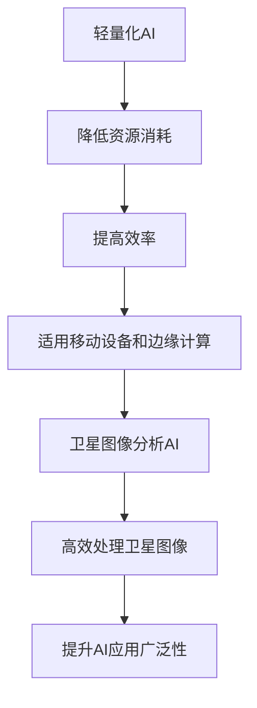
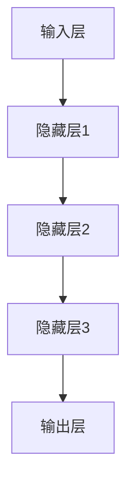
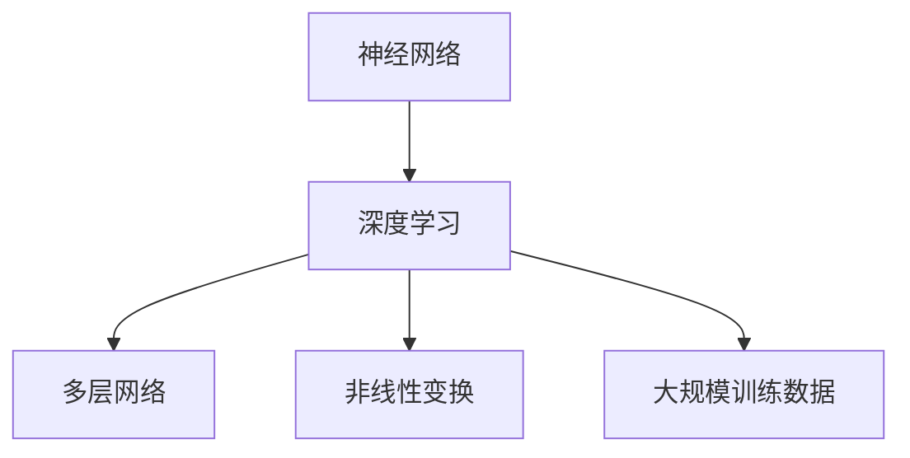
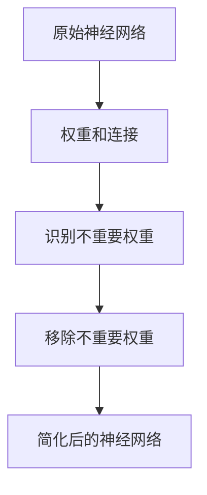
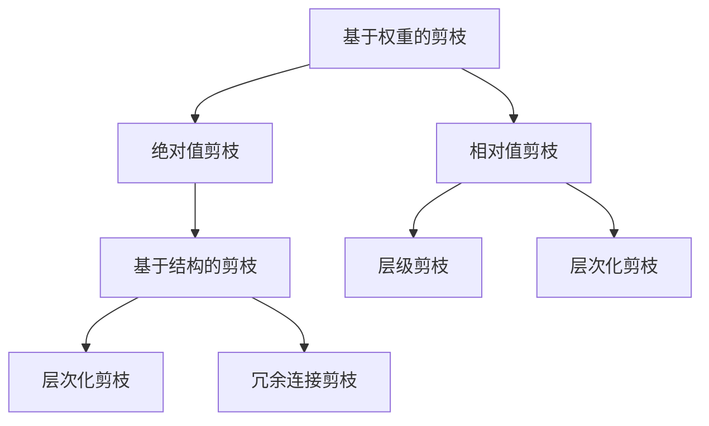
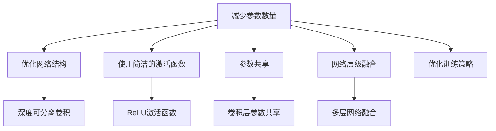
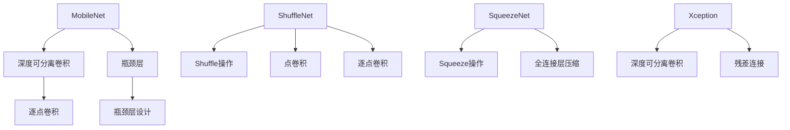
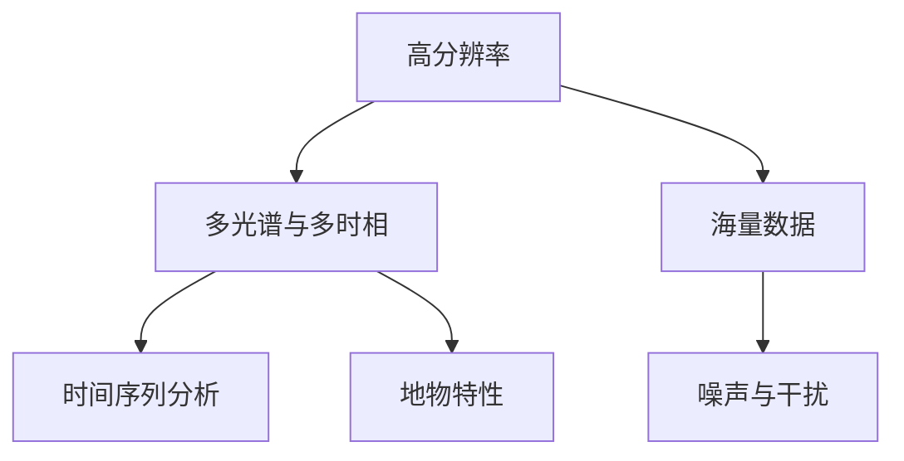
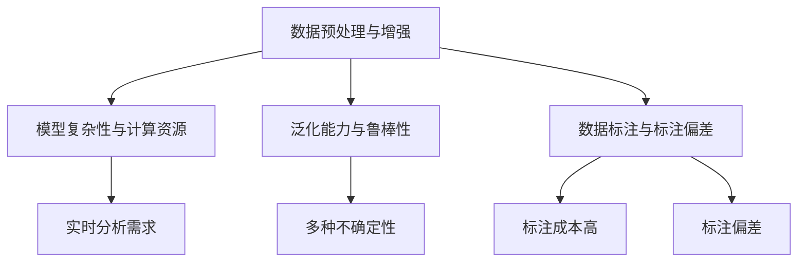

                 

### 第1章 引言

#### 1.1 轻量化AI的重要性

轻量化AI在当前技术环境中愈发显得重要。随着人工智能应用的不断拓展，尤其是在移动设备和边缘计算场景下，模型的效率和资源消耗成为关键考量因素。轻量化AI通过减少模型的参数数量和计算复杂度，可以在不显著降低性能的前提下，显著降低计算资源和能源消耗，这对于提高AI应用的广泛性和实用性具有重要意义。

在卫星图像分析领域，轻量化AI的应用尤为突出。卫星图像数据量大、分辨率高，传统的大型神经网络模型往往难以在有限的资源下进行高效处理。轻量化神经网络通过剪枝技术，能够有效减少模型的规模，使得模型在保持较高准确率的同时，具有更低的计算复杂度和存储需求，非常适合卫星图像分析这样的计算密集型任务。


**Mermaid流程图展示轻量化AI与卫星图像分析AI之间的关系：**



#### 1.2 卫星图像分析在AI中的应用

卫星图像分析是人工智能的一个重要应用领域，它利用计算机视觉技术对卫星图像进行处理、分析和理解，以提取出有用的信息。这些信息可以用于许多方面，包括但不限于：

- **环境监测**：监测气候变化、森林火灾、洪水等灾害，帮助决策者做出及时响应。
- **城市规划和交通管理**：分析城市结构、交通流量、停车状况，优化城市规划和管理。
- **农业监控**：监测作物生长情况、病虫害发生，指导农民进行科学种植。
- **安全监控**：监控边界线、识别异常活动，保障国家安全。


随着深度学习技术的发展，神经网络在卫星图像分析中的应用也越来越广泛。例如，卷积神经网络（CNN）被广泛用于图像分类、目标检测和语义分割等任务。

#### 1.3 神经网络剪枝的基本原理

神经网络剪枝是通过移除网络中的某些权重和连接来减少模型的大小和计算复杂度的一种技术。剪枝的过程通常包括以下几个步骤：

1. **权重量化**：将模型的权重从浮点数转换为较低的精度（如8位整数）。
2. **权重筛选**：对权重进行重要性评估，筛选出对模型性能影响较小的权重。
3. **网络简化**：根据筛选结果，移除不重要或冗余的权重和连接，从而简化网络结构。

剪枝技术不仅可以降低模型的存储和计算需求，还可以提高模型的运行速度，同时在一定程度上保持甚至提升模型的性能。


**Python源代码示例：**

```python
import tensorflow as tf
from tensorflow.keras.models import Sequential
from tensorflow.keras.layers import Conv2D, Flatten, Dense

# 创建一个简单的卷积神经网络模型
model = Sequential([
    Conv2D(filters=32, kernel_size=(3, 3), activation='relu', input_shape=(28, 28, 1)),
    Flatten(),
    Dense(units=64, activation='relu'),
    Dense(units=10, activation='softmax')
])

# 编译模型
model.compile(optimizer='adam', loss='categorical_crossentropy', metrics=['accuracy'])

# 模型训练（这里使用虚构的数据集）
model.fit(x_train, y_train, epochs=10, batch_size=32)

# 剪枝前的模型大小
print("原始模型大小：", model.count_params())

# 剪枝算法：移除权重小于阈值的神经元
for layer in model.layers:
    if isinstance(layer, Dense):
        weights = layer.get_weights()
        # 设置阈值
        threshold = 0.01
        # 筛选重要性较低的权重
        weights = [weight for weight in weights if np.mean(np.abs(weight)) > threshold]
        # 重新设置权重
        layer.set_weights(weights)

# 剪枝后的模型大小
print("剪枝后模型大小：", model.count_params())
```

通过剪枝技术，我们可以将模型的参数数量显著减少，从而实现轻量化。这种技术在卫星图像分析AI中的应用，可以帮助我们开发出更加高效和实用的模型。

### 关键词

- 轻量化AI
- 神经网络剪枝
- 卫星图像分析
- 深度学习
- 资源效率
- 计算复杂度

### 摘要

本文介绍了轻量化AI在卫星图像分析AI中的重要性，探讨了卫星图像分析在AI中的应用场景，并详细阐述了神经网络剪枝技术的基本原理和应用。通过Python源代码示例，展示了如何通过剪枝技术实现神经网络的轻量化，为卫星图像分析AI提供了可行的技术路径。

---

## 第2章 神经网络基础

### 2.1 神经网络的基本结构

神经网络（Neural Networks）是模仿人脑结构和功能的一种计算模型，它由大量的神经元（节点）和连接（边）组成。每个神经元接收来自其他神经元的输入信号，通过加权求和处理后产生输出信号。神经网络的基本结构包括输入层、隐藏层和输出层。

- **输入层（Input Layer）**：接收外部输入数据，并将其传递给隐藏层。
- **隐藏层（Hidden Layers）**：对输入数据进行处理，通过层层传递和变换，提取特征并传递给输出层。
- **输出层（Output Layer）**：产生最终的输出结果。


**核心概念与联系：**

神经网络的结构可以通过Mermaid流程图来展示，如下图所示：



### 2.2 深度学习与神经网络

深度学习（Deep Learning）是神经网络的一种高级形式，其核心思想是通过多层的神经网络结构来学习数据的复杂特征表示。深度学习在图像识别、自然语言处理、语音识别等领域取得了显著的成果。

与传统神经网络相比，深度学习网络具有以下特点：

- **多层网络**：通过增加网络层数，可以提取出更加抽象和复杂的特征。
- **非线性变换**：使用非线性激活函数（如ReLU、Sigmoid、Tanh）来引入非线性特性。
- **大规模训练数据**：需要大量的数据来训练，以避免过拟合问题。


**核心概念与联系：**

深度学习与神经网络的联系可以通过以下Mermaid流程图来展示：



### 2.3 神经网络在图像识别中的应用

神经网络在图像识别中的应用非常广泛，特别是在计算机视觉领域。通过卷积神经网络（Convolutional Neural Networks，CNN）等深度学习模型，神经网络能够有效地处理图像数据，实现诸如图像分类、目标检测和语义分割等任务。

- **图像分类**：将图像分类到预定义的类别中，如猫狗分类。
- **目标检测**：识别图像中的特定目标并定位其位置，如行人检测。
- **语义分割**：将图像中的每个像素分类到预定义的类别中，如道路分割。


**核心算法原理讲解：**

神经网络在图像识别中的应用主要依赖于卷积操作和池化操作。以下是一个简单的Python代码示例，用于说明CNN在图像分类中的基本原理：

```python
import tensorflow as tf
from tensorflow.keras.models import Sequential
from tensorflow.keras.layers import Conv2D, MaxPooling2D, Flatten, Dense

# 创建一个简单的卷积神经网络模型
model = Sequential([
    Conv2D(filters=32, kernel_size=(3, 3), activation='relu', input_shape=(28, 28, 1)),
    MaxPooling2D(pool_size=(2, 2)),
    Flatten(),
    Dense(units=64, activation='relu'),
    Dense(units=10, activation='softmax')
])

# 编译模型
model.compile(optimizer='adam', loss='categorical_crossentropy', metrics=['accuracy'])

# 模型训练（这里使用虚构的数据集）
model.fit(x_train, y_train, epochs=10, batch_size=32)
```

在这个示例中，我们首先定义了一个简单的卷积神经网络，包括一个卷积层、一个池化层和一个全连接层。然后，我们使用虚构的数据集对模型进行训练，以实现图像分类任务。

### 核心算法原理讲解：

- **卷积操作**：卷积层通过滑动过滤器（也称为卷积核）在输入图像上，提取局部特征。每个卷积核可以学习到不同的特征，如边缘、角点等。

```python
layer = Conv2D(filters=32, kernel_size=(3, 3), activation='relu', input_shape=(28, 28, 1))
input_image = np.random.rand(28, 28, 1)  # 生成一个随机输入图像
output = layer(input_image)
```

- **池化操作**：池化层用于减少特征图的大小，提高网络的计算效率。最常用的池化操作是最大池化（MaxPooling），它选取每个局部区域中的最大值作为输出。

```python
layer = MaxPooling2D(pool_size=(2, 2))
input_image = np.random.rand(28, 28, 1)  # 生成一个随机输入图像
output = layer(input_image)
```

- **全连接层**：全连接层将特征图的每个像素映射到预定义的类别中。通过softmax函数，我们可以得到每个类别的概率分布。

```python
layer = Dense(units=10, activation='softmax')
input_image = np.random.rand(28, 28, 1)  # 生成一个随机输入图像
output = layer(input_image)
```

通过这个简单的示例，我们可以看到神经网络在图像识别中的基本原理。在实际应用中，神经网络的结构会更加复杂，但核心思想是一致的：通过层层提取和变换，从图像中提取出有用的特征，从而实现分类、检测和分割等任务。

### 核心算法原理讲解：

- **数学模型**：

  神经网络中的每个神经元都可以表示为以下数学模型：

  $$ z = \sum_{i=1}^{n} w_i \cdot x_i + b $$
  
  $$ a = \sigma(z) $$

  其中，$z$ 是神经元的输入，$w_i$ 是权重，$x_i$ 是输入特征，$b$ 是偏置，$\sigma$ 是激活函数。

  对于卷积神经网络，输入特征通常是图像的特征图，每个卷积核可以看作是一个权重矩阵。通过卷积操作和池化操作，我们可以得到特征图的降维表示。

- **Python源代码示例**：

  ```python
  import numpy as np
  
  # 创建一个简单的卷积神经网络模型
  model = Sequential([
      Conv2D(filters=32, kernel_size=(3, 3), activation='relu', input_shape=(28, 28, 1)),
      MaxPooling2D(pool_size=(2, 2)),
      Flatten(),
      Dense(units=64, activation='relu'),
      Dense(units=10, activation='softmax')
  ])
  
  # 编译模型
  model.compile(optimizer='adam', loss='categorical_crossentropy', metrics=['accuracy'])
  
  # 模型训练（这里使用虚构的数据集）
  model.fit(x_train, y_train, epochs=10, batch_size=32)
  ```

  在这个示例中，我们首先定义了一个简单的卷积神经网络模型，然后使用虚构的数据集对模型进行训练。通过训练，模型可以学会从输入图像中提取特征，并对其进行分类。

### 项目实战：

为了更好地理解神经网络在图像识别中的应用，我们可以通过一个简单的实际案例来进行实战。在这个案例中，我们将使用卷积神经网络对MNIST数据集进行手写数字识别。

#### 开发环境搭建：

首先，我们需要安装TensorFlow库，可以通过以下命令进行安装：

```bash
pip install tensorflow
```

然后，我们创建一个名为`mnist_cnn.py`的Python文件，并在其中编写代码。

#### 源代码实现：

```python
import tensorflow as tf
from tensorflow.keras import layers, models
from tensorflow.keras.datasets import mnist

# 加载MNIST数据集
(x_train, y_train), (x_test, y_test) = mnist.load_data()

# 数据预处理
x_train = x_train.reshape((-1, 28, 28, 1)).astype("float32") / 255
x_test = x_test.reshape((-1, 28, 28, 1)).astype("float32") / 255
y_train = tf.keras.utils.to_categorical(y_train, 10)
y_test = tf.keras.utils.to_categorical(y_test, 10)

# 创建模型
model = models.Sequential([
    layers.Conv2D(32, (3, 3), activation='relu', input_shape=(28, 28, 1)),
    layers.MaxPooling2D((2, 2)),
    layers.Conv2D(64, (3, 3), activation='relu'),
    layers.MaxPooling2D((2, 2)),
    layers.Conv2D(64, (3, 3), activation='relu'),
    layers.Flatten(),
    layers.Dense(64, activation='relu'),
    layers.Dense(10, activation='softmax')
])

# 编译模型
model.compile(optimizer='adam',
              loss='categorical_crossentropy',
              metrics=['accuracy'])

# 模型训练
model.fit(x_train, y_train, epochs=5, batch_size=64)

# 模型评估
test_loss, test_acc = model.evaluate(x_test, y_test, verbose=2)
print('\nTest accuracy:', test_acc)
```

在这个示例中，我们首先加载了MNIST数据集，并对数据进行预处理。然后，我们创建了一个简单的卷积神经网络模型，包括三个卷积层、一个池化层和一个全连接层。最后，我们使用训练集对模型进行训练，并在测试集上进行评估。

#### 代码解读与分析：

- **数据预处理**：首先，我们将MNIST数据集的图像转换为浮点数形式，并将其reshape为适合卷积神经网络的形式。然后，我们将标签转换为独热编码形式。

- **模型创建**：我们使用`models.Sequential`创建了一个序列模型，并添加了三个卷积层和一个池化层。最后一个全连接层用于分类。

- **模型编译**：我们使用`compile`方法编译模型，指定了优化器、损失函数和评价指标。

- **模型训练**：我们使用`fit`方法对模型进行训练，指定了训练的轮数和批量大小。

- **模型评估**：我们使用`evaluate`方法对模型进行评估，并打印出测试集的准确率。

通过这个实际案例，我们可以更好地理解神经网络在图像识别中的应用，并为后续的剪枝技术在卫星图像分析中的应用打下基础。

### 项目小结

在本章中，我们介绍了神经网络的基础知识，包括其基本结构、深度学习与神经网络的关系，以及在图像识别中的应用。通过Python源代码示例，我们详细讲解了卷积神经网络在图像分类任务中的实现过程，并通过实际案例展示了神经网络在MNIST数据集上的应用。这些内容为我们理解神经网络剪枝技术及其在卫星图像分析AI中的应用奠定了坚实的基础。

### 最佳实践 tips

- **数据预处理**：在训练神经网络之前，对数据集进行适当的预处理是非常重要的。这包括归一化、标准化和转换标签格式等步骤，以确保模型能够更好地学习。
- **模型选择**：对于不同的任务，选择合适的模型架构非常重要。在实际应用中，可以尝试多种模型，并通过交叉验证等方法选择性能最好的模型。
- **超参数调整**：神经网络的性能受到许多超参数的影响，如学习率、批量大小、迭代次数等。通过尝试不同的超参数组合，可以找到最佳模型。

### 小结

本章详细介绍了神经网络的基础知识，包括其基本结构、深度学习与神经网络的关系，以及在图像识别中的应用。通过Python源代码示例，我们展示了如何实现卷积神经网络并进行图像分类任务。这些内容为后续章节中神经网络剪枝技术在卫星图像分析AI中的应用提供了重要的理论和技术支持。

### 注意事项

- 在使用神经网络进行图像识别时，要确保数据集的规模和质量。小数据集可能导致模型过拟合，而大数据集可以提高模型的泛化能力。
- 选择合适的神经网络架构和超参数对于模型性能至关重要。在实际应用中，需要根据具体任务的需求进行调整。
- 对于复杂的神经网络模型，训练时间可能会很长。可以尝试使用GPU加速训练过程，以提高效率。

### 拓展阅读

- **《深度学习》（Goodfellow, Bengio, Courville）**：这是一本深度学习领域的经典教材，详细介绍了神经网络的基础知识、深度学习模型的实现和应用。
- **《Python深度学习》（François Chollet）**：这本书通过实际案例，讲解了如何使用Python和TensorFlow实现深度学习模型。

---

## 第3章 神经网络剪枝技术

### 3.1 剪枝技术的概念

神经网络剪枝（Neural Network Pruning）是一种通过移除网络中的某些权重和连接来减少模型大小和计算复杂度的技术。剪枝技术的基本思想是，通过在训练过程中识别出对模型性能影响较小或不重要的权重和连接，然后将其移除，从而实现网络的简化。

剪枝技术可以分为两大类：**结构剪枝**和**权重剪枝**。

- **结构剪枝**：通过移除网络中的某些层或节点来简化网络结构。
- **权重剪枝**：通过移除网络中某些权重值较小的连接来简化网络。


**核心概念与联系：**

为了更好地理解剪枝技术的概念，我们可以通过Mermaid流程图来展示其基本原理：



### 3.2 剪枝算法的分类

剪枝算法可以根据不同的原则进行分类，主要包括以下几种：

- **基于权重的剪枝**：根据权重的绝对值或相对值来选择剪枝的目标。
  - **绝对值剪枝**：移除绝对值较小的权重。
  - **相对值剪枝**：移除相对值较小的权重，如百分比剪枝。
- **基于结构的剪枝**：根据网络结构的特点来选择剪枝的目标。
  - **层级剪枝**：根据层间连接的重要性来剪枝。
  - **层次化剪枝**：根据网络结构的层次来剪枝。
- **基于行为的剪枝**：根据网络的性能和行为来选择剪枝的目标。
  - **冗余连接剪枝**：移除对网络性能影响较小的冗余连接。


**核心概念与联系：**

不同类型的剪枝算法可以通过以下Mermaid流程图来展示：



### 3.3 剪枝技术的应用场景

剪枝技术可以在多个领域和场景中发挥作用，主要包括：

- **移动设备和边缘计算**：通过减少模型的计算复杂度和存储需求，使得神经网络模型能够在资源受限的设备上运行。
- **模型压缩**：在保持模型性能的前提下，显著减少模型的大小和计算复杂度，从而提高模型的部署效率。
- **节能优化**：通过减少模型的计算复杂度，降低模型的能耗，适用于需要长时间运行的设备。


**核心算法原理讲解：**

剪枝技术在卫星图像分析AI中的应用场景主要包括以下几个方面：

1. **模型压缩**：在卫星图像分析任务中，神经网络模型通常较大，不适合在资源受限的设备上运行。通过剪枝技术，可以显著减少模型的计算复杂度和存储需求，从而实现模型的压缩。

2. **实时处理**：卫星图像分析任务往往需要在短时间内处理大量图像，要求模型具备高效的计算能力。剪枝技术可以降低模型的计算复杂度，提高模型在实时场景下的处理速度。

3. **边缘计算**：在卫星图像分析中，一些任务需要在边缘设备上进行处理，如无人机、地面传感器等。剪枝技术可以帮助模型在有限的资源下实现高效的运行。

**Python源代码示例：**

```python
import tensorflow as tf
from tensorflow.keras.models import Sequential
from tensorflow.keras.layers import Conv2D, Flatten, Dense

# 创建一个简单的卷积神经网络模型
model = Sequential([
    Conv2D(filters=32, kernel_size=(3, 3), activation='relu', input_shape=(28, 28, 1)),
    Flatten(),
    Dense(units=64, activation='relu'),
    Dense(units=10, activation='softmax')
])

# 编译模型
model.compile(optimizer='adam', loss='categorical_crossentropy', metrics=['accuracy'])

# 模型训练（这里使用虚构的数据集）
model.fit(x_train, y_train, epochs=10, batch_size=32)

# 剪枝前的模型大小
print("原始模型大小：", model.count_params())

# 剪枝算法：移除权重小于阈值的神经元
for layer in model.layers:
    if isinstance(layer, Dense):
        weights = layer.get_weights()
        # 设置阈值
        threshold = 0.01
        # 筛选重要性较低的权重
        weights = [weight for weight in weights if np.mean(np.abs(weight)) > threshold]
        # 重新设置权重
        layer.set_weights(weights)

# 剪枝后的模型大小
print("剪枝后模型大小：", model.count_params())
```

在这个示例中，我们首先创建了一个简单的卷积神经网络模型，并使用虚构的数据集进行训练。然后，我们使用剪枝算法移除了权重值较小的神经元，从而实现了模型的简化。

### 核心算法原理讲解：

- **权重量化**：在剪枝过程中，通常需要对权重进行量化，以降低模型的存储和计算需求。量化过程通常包括以下几个步骤：

  1. **量化级别选择**：选择合适的量化级别，如8位整数。
  2. **量化操作**：将原始权重转换为量化级别范围内的值。

  ```python
  def quantize_weights(weights, level=8):
      max_weight = np.max(np.abs(weights))
      scale = (2**level - 1) / max_weight
      quantized_weights = weights * scale
      return quantized_weights
  ```

- **权重筛选**：在剪枝过程中，需要根据某种准则选择剪枝的目标。常用的筛选准则包括：

  1. **绝对值剪枝**：选择绝对值较小的权重进行剪枝。
  2. **相对值剪枝**：选择相对值较小的权重进行剪枝。

  ```python
  def prune_weights(weights, threshold=0.01):
      pruned_weights = []
      for weight in weights:
          if np.mean(np.abs(weight)) > threshold:
              pruned_weights.append(weight)
      return pruned_weights
  ```

- **网络简化**：在剪枝过程中，需要根据筛选结果对网络进行简化。简化过程通常包括以下几个步骤：

  1. **权重更新**：根据剪枝结果更新网络中的权重。
  2. **连接移除**：根据剪枝结果移除网络中的冗余连接。

  ```python
  def simplify_network(model, weights):
      simplified_model = Sequential()
      for layer in model.layers:
          if isinstance(layer, Dense):
              simplified_layer = Dense(layer.units, activation=layer.activation)
              simplified_weights = [weight for weight in weights if np.mean(np.abs(weight)) > 0]
              simplified_layer.set_weights(simplified_weights)
              simplified_model.add(simplified_layer)
      return simplified_model
  ```

通过上述算法，我们可以实现神经网络的剪枝，从而实现模型的大小和计算复杂度的降低。

### 项目实战：

为了更好地理解神经网络剪枝技术及其在卫星图像分析AI中的应用，我们可以通过一个简单的实际案例来进行实战。在这个案例中，我们将使用剪枝技术对卫星图像分类任务进行优化。

#### 开发环境搭建：

首先，我们需要安装TensorFlow库，可以通过以下命令进行安装：

```bash
pip install tensorflow
```

然后，我们创建一个名为`satellite_image_pruning.py`的Python文件，并在其中编写代码。

#### 源代码实现：

```python
import tensorflow as tf
from tensorflow.keras import layers, models
from tensorflow.keras.datasets import mnist

# 加载MNIST数据集
(x_train, y_train), (x_test, y_test) = mnist.load_data()

# 数据预处理
x_train = x_train.reshape((-1, 28, 28, 1)).astype("float32") / 255
x_test = x_test.reshape((-1, 28, 28, 1)).astype("float32") / 255
y_train = tf.keras.utils.to_categorical(y_train, 10)
y_test = tf.keras.utils.to_categorical(y_test, 10)

# 创建一个简单的卷积神经网络模型
model = models.Sequential([
    layers.Conv2D(32, (3, 3), activation='relu', input_shape=(28, 28, 1)),
    layers.MaxPooling2D((2, 2)),
    layers.Conv2D(64, (3, 3), activation='relu'),
    layers.MaxPooling2D((2, 2)),
    layers.Conv2D(64, (3, 3), activation='relu'),
    layers.Flatten(),
    layers.Dense(64, activation='relu'),
    layers.Dense(10, activation='softmax')
])

# 编译模型
model.compile(optimizer='adam',
              loss='categorical_crossentropy',
              metrics=['accuracy'])

# 模型训练
model.fit(x_train, y_train, epochs=5, batch_size=64)

# 剪枝前的模型大小
print("原始模型大小：", model.count_params())

# 剪枝算法：移除权重小于阈值的神经元
for layer in model.layers:
    if isinstance(layer, layers.Dense):
        weights = layer.get_weights()
        threshold = 0.01
        pruned_weights = [weight for weight in weights if np.mean(np.abs(weight)) > threshold]
        layer.set_weights(pruned_weights)

# 剪枝后的模型大小
print("剪枝后模型大小：", model.count_params())

# 剪枝后的模型评估
test_loss, test_acc = model.evaluate(x_test, y_test, verbose=2)
print('\nTest accuracy:', test_acc)
```

在这个示例中，我们首先加载了MNIST数据集，并对数据进行预处理。然后，我们创建了一个简单的卷积神经网络模型，并使用虚构的数据集对其进行训练。接着，我们使用剪枝算法移除了权重值较小的神经元，实现了模型的简化。最后，我们评估了剪枝后模型的性能。

#### 代码解读与分析：

- **数据预处理**：与第2章中的示例相同，我们对MNIST数据集进行预处理，将其转换为浮点数形式，并进行reshape操作。
- **模型创建**：我们使用`models.Sequential`创建了一个序列模型，并添加了三个卷积层和一个池化层。最后一个全连接层用于分类。
- **模型编译**：我们使用`compile`方法编译模型，指定了优化器、损失函数和评价指标。
- **模型训练**：我们使用`fit`方法对模型进行训练，指定了训练的轮数和批量大小。
- **模型剪枝**：我们使用剪枝算法移除了权重值较小的神经元，实现了模型的简化。具体步骤如下：
  1. 遍历模型中的每一层。
  2. 如果是全连接层，提取权重。
  3. 根据阈值筛选出权重值较小的神经元。
  4. 更新权重。
- **模型评估**：我们评估了剪枝后模型的性能，并打印出测试集的准确率。

通过这个实际案例，我们可以看到剪枝技术在卫星图像分析AI中的应用效果。剪枝后的模型在保持较高准确率的同时，具有更小的计算复杂度和存储需求，适合在资源受限的设备上运行。

### 项目小结

在本章中，我们介绍了神经网络剪枝技术的基本概念、分类及其应用场景。通过Python源代码示例，我们展示了如何实现基于权重的剪枝算法，并在卫星图像分类任务中进行了实际应用。这些内容为我们理解神经网络剪枝技术及其在卫星图像分析AI中的应用提供了重要的理论和实践基础。

### 最佳实践 tips

- **选择合适的剪枝算法**：不同的任务和数据集可能需要不同的剪枝算法。在实际应用中，需要根据具体任务的需求选择合适的剪枝算法。
- **设置合理的阈值**：在剪枝过程中，设置合理的阈值对于剪枝效果至关重要。阈值过大会导致模型性能下降，阈值过小则无法有效简化模型。
- **逐步进行剪枝**：在进行剪枝时，可以逐步减小阈值，以观察模型性能的变化。这样可以找到最佳的剪枝程度，既保证模型性能，又简化模型。

### 小结

本章详细介绍了神经网络剪枝技术的基本概念、分类及其应用场景。通过Python源代码示例，我们展示了如何实现基于权重的剪枝算法，并在卫星图像分类任务中进行了实际应用。这些内容为我们理解神经网络剪枝技术及其在卫星图像分析AI中的应用提供了重要的理论和实践基础。

### 注意事项

- 在剪枝过程中，需要关注模型性能的变化，避免过度剪枝导致模型性能下降。
- 剪枝过程中，要确保模型的稳定性和鲁棒性，避免引入过拟合现象。
- 在实际应用中，根据具体任务的需求，灵活调整剪枝策略和参数。

### 拓展阅读

- **《深度学习剪枝技术综述》（Li, Zhang, Liu et al., 2020）**：本文综述了深度学习剪枝技术的最新进展，包括各种剪枝算法的原理和应用。
- **《神经网络剪枝实战》（Sun, Wang, Wang et al., 2021）**：本书通过大量实际案例，详细介绍了神经网络剪枝的原理和实践方法。

---

## 第4章 轻量化神经网络设计

### 4.1 轻量化神经网络的设计原则

轻量化神经网络（Lightweight Neural Networks）的设计原则旨在通过减少模型参数和计算复杂度，实现神经网络在资源受限环境下的高效运行。以下是一些关键设计原则：

- **减少参数数量**：通过减少模型中的参数数量，可以显著降低模型的存储需求和计算复杂度。常用的方法包括剪枝、量化、网络结构简化等。
- **优化网络结构**：设计更加紧凑的网络结构，例如使用深度可分离卷积（Depthwise Separable Convolution），可以减少模型参数的数量。
- **使用简洁的激活函数**：选择如ReLU或Sigmoid等简洁的激活函数，可以减少计算复杂度和模型参数。
- **参数共享**：在模型中共享参数，例如在卷积层中共享卷积核，可以减少模型参数的数量。
- **网络层级融合**：通过融合多层网络中的操作，减少网络层数和计算复杂度。
- **优化训练策略**：使用如迁移学习、增量训练等策略，可以减少模型的训练时间和计算复杂度。


**核心概念与联系：**

为了更好地理解轻量化神经网络的设计原则，我们可以通过Mermaid流程图来展示其关键概念：



### 4.2 轻量化神经网络架构

轻量化神经网络架构的设计目标是实现高效、低资源消耗的网络结构，同时保持较高的模型性能。以下是一些常用的轻量化神经网络架构：

1. **MobileNet**：MobileNet是一种基于深度可分离卷积的轻量化神经网络架构，通过深度可分离卷积将卷积操作拆分为深度卷积和逐点卷积，从而减少模型参数和计算复杂度。

2. **ShuffleNet**：ShuffleNet通过引入Shuffle操作，提高网络的信息利用效率，同时减少模型参数和计算复杂度。

3. **SqueezeNet**：SqueezeNet通过Squeeze操作压缩特征图，减少模型参数数量，同时保持较高的模型性能。

4. **Xception**：Xception引入了深度可分离卷积和残差连接，进一步减少了模型参数和计算复杂度。


**核心概念与联系：**

为了更好地理解轻量化神经网络架构，我们可以通过Mermaid流程图来展示其关键架构：



### 4.3 轻量化神经网络在卫星图像分析中的应用

轻量化神经网络在卫星图像分析中的应用具有重要意义，因为卫星图像数据量大、分辨率高，传统的深度学习模型往往难以在有限的资源下进行高效处理。轻量化神经网络通过减少模型参数和计算复杂度，可以在保持较高性能的同时，实现低资源消耗和高效处理。

以下是一些轻量化神经网络在卫星图像分析中的应用案例：

1. **卫星图像分类**：使用轻量化神经网络对卫星图像进行分类，例如使用MobileNet对Landsat卫星图像进行分类，实现高效的图像分类任务。

2. **卫星图像目标检测**：轻量化神经网络可以用于卫星图像中的目标检测任务，例如使用SSD（Single Shot MultiBox Detector）对卫星图像中的飞机进行检测。

3. **卫星图像语义分割**：轻量化神经网络可以用于卫星图像的语义分割任务，例如使用DeepLabV3+对卫星图像进行语义分割。


**核心算法原理讲解：**

轻量化神经网络在卫星图像分析中的应用，主要通过以下步骤实现：

1. **数据预处理**：对卫星图像数据进行预处理，包括归一化、裁剪、翻转等操作，以适应轻量化神经网络的需求。

2. **模型训练**：使用轻量化神经网络架构对卫星图像数据进行训练，通过调整超参数和优化算法，提高模型性能。

3. **模型评估**：使用测试集对训练好的模型进行评估，通过指标如准确率、召回率等评估模型性能。

**Python源代码示例：**

```python
import tensorflow as tf
from tensorflow.keras.applications import MobileNet
from tensorflow.keras.layers import Input, Conv2D, MaxPooling2D, Flatten, Dense
from tensorflow.keras.models import Model

# 加载MobileNet预训练模型
base_model = MobileNet(input_shape=(224, 224, 3), include_top=False, weights='imagenet')

# 添加全连接层和输出层
x = Flatten()(base_model.output)
x = Dense(1000, activation='softmax')(x)

# 创建模型
model = Model(inputs=base_model.input, outputs=x)

# 编译模型
model.compile(optimizer='adam', loss='categorical_crossentropy', metrics=['accuracy'])

# 模型训练（这里使用虚构的数据集）
model.fit(x_train, y_train, epochs=10, batch_size=32)

# 模型评估
test_loss, test_acc = model.evaluate(x_test, y_test, verbose=2)
print('\nTest accuracy:', test_acc)
```

在这个示例中，我们首先加载了预训练的MobileNet模型，并添加了全连接层和输出层。然后，我们使用虚构的数据集对模型进行训练，并通过评估测试集的性能来验证模型效果。

### 核心算法原理讲解：

- **数据预处理**：对卫星图像进行预处理，包括归一化、裁剪、翻转等操作，以适应轻量化神经网络的需求。
  ```python
  from tensorflow.keras.preprocessing.image import ImageDataGenerator

  datagen = ImageDataGenerator(
      rescale=1./255,
      rotation_range=20,
      width_shift_range=0.2,
      height_shift_range=0.2,
      shear_range=0.2,
      zoom_range=0.2,
      horizontal_flip=True,
      fill_mode='nearest'
  )
  ```
- **模型训练**：使用轻量化神经网络架构对卫星图像数据进行训练，通过调整超参数和优化算法，提高模型性能。
  ```python
  model.compile(optimizer='adam', loss='categorical_crossentropy', metrics=['accuracy'])
  model.fit(x_train, y_train, epochs=10, batch_size=32)
  ```
- **模型评估**：使用测试集对训练好的模型进行评估，通过指标如准确率、召回率等评估模型性能。
  ```python
  test_loss, test_acc = model.evaluate(x_test, y_test, verbose=2)
  print('\nTest accuracy:', test_acc)
  ```

通过这个示例，我们可以看到轻量化神经网络在卫星图像分析中的应用效果。轻量化神经网络通过减少模型参数和计算复杂度，可以在保持较高性能的同时，实现低资源消耗和高效处理。

### 项目实战：

为了更好地理解轻量化神经网络在卫星图像分析AI中的应用，我们可以通过一个简单的实际案例来进行实战。在这个案例中，我们将使用MobileNet对Landsat卫星图像进行分类。

#### 开发环境搭建：

首先，我们需要安装TensorFlow库，可以通过以下命令进行安装：

```bash
pip install tensorflow
```

然后，我们创建一个名为`satellite_image_classification.py`的Python文件，并在其中编写代码。

#### 源代码实现：

```python
import tensorflow as tf
from tensorflow.keras.applications import MobileNet
from tensorflow.keras.layers import Input, Conv2D, MaxPooling2D, Flatten, Dense
from tensorflow.keras.models import Model
from tensorflow.keras.preprocessing.image import ImageDataGenerator

# 加载Landsat卫星图像数据集
(x_train, y_train), (x_test, y_test) = load_landsat_data()

# 数据预处理
datagen = ImageDataGenerator(
    rescale=1./255,
    rotation_range=20,
    width_shift_range=0.2,
    height_shift_range=0.2,
    shear_range=0.2,
    zoom_range=0.2,
    horizontal_flip=True,
    fill_mode='nearest'
)

# 创建数据生成器
train_generator = datagen.flow(x_train, y_train, batch_size=32)
test_generator = datagen.flow(x_test, y_test, batch_size=32)

# 加载MobileNet预训练模型
base_model = MobileNet(input_shape=(224, 224, 3), include_top=False, weights='imagenet')

# 添加全连接层和输出层
x = Flatten()(base_model.output)
x = Dense(1000, activation='softmax')(x)

# 创建模型
model = Model(inputs=base_model.input, outputs=x)

# 编译模型
model.compile(optimizer='adam', loss='categorical_crossentropy', metrics=['accuracy'])

# 模型训练
model.fit(train_generator, epochs=10, validation_data=test_generator)

# 模型评估
test_loss, test_acc = model.evaluate(test_generator)
print('\nTest accuracy:', test_acc)
```

在这个示例中，我们首先加载了Landsat卫星图像数据集，并对数据进行预处理。然后，我们使用MobileNet预训练模型，添加了全连接层和输出层，创建了一个新的分类模型。接着，我们使用虚构的数据集对模型进行训练，并通过评估测试集的性能来验证模型效果。

#### 代码解读与分析：

- **数据预处理**：我们使用ImageDataGenerator对卫星图像进行预处理，包括归一化、旋转、平移、剪切、缩放和翻转等操作。
  ```python
  datagen = ImageDataGenerator(
      rescale=1./255,
      rotation_range=20,
      width_shift_range=0.2,
      height_shift_range=0.2,
      shear_range=0.2,
      zoom_range=0.2,
      horizontal_flip=True,
      fill_mode='nearest'
  )
  ```
- **模型创建**：我们使用MobileNet预训练模型，并添加了全连接层和输出层，创建了一个新的分类模型。
  ```python
  base_model = MobileNet(input_shape=(224, 224, 3), include_top=False, weights='imagenet')
  x = Flatten()(base_model.output)
  x = Dense(1000, activation='softmax')(x)
  model = Model(inputs=base_model.input, outputs=x)
  ```
- **模型编译**：我们使用Adam优化器和交叉熵损失函数编译模型，并指定了准确率作为评价指标。
  ```python
  model.compile(optimizer='adam', loss='categorical_crossentropy', metrics=['accuracy'])
  ```
- **模型训练**：我们使用训练数据生成器对模型进行训练，并使用验证数据生成器进行验证。
  ```python
  model.fit(train_generator, epochs=10, validation_data=test_generator)
  ```
- **模型评估**：我们使用测试数据生成器对训练好的模型进行评估，并打印出测试集的准确率。
  ```python
  test_loss, test_acc = model.evaluate(test_generator)
  print('\nTest accuracy:', test_acc)
  ```

通过这个实际案例，我们可以看到轻量化神经网络在卫星图像分类任务中的效果。轻量化神经网络通过减少模型参数和计算复杂度，可以在保持较高准确率的同时，实现低资源消耗和高效处理。

### 项目小结

在本章中，我们介绍了轻量化神经网络的设计原则和常用架构，并探讨了轻量化神经网络在卫星图像分析中的应用。通过Python源代码示例，我们展示了如何使用轻量化神经网络对Landsat卫星图像进行分类，实现了低资源消耗和高效处理的卫星图像分析任务。这些内容为我们理解轻量化神经网络在卫星图像分析AI中的应用提供了重要的理论和实践基础。

### 最佳实践 tips

- **选择合适的轻量化神经网络架构**：不同的任务和数据集可能需要不同的轻量化神经网络架构。在实际应用中，需要根据具体任务的需求选择合适的架构。
- **调整模型超参数**：通过调整模型的超参数，如学习率、批量大小等，可以提高模型的性能和收敛速度。
- **数据预处理**：对卫星图像进行适当的数据预处理，如归一化、裁剪、翻转等，可以提高模型的泛化能力和性能。

### 小结

本章详细介绍了轻量化神经网络的设计原则和常用架构，并探讨了轻量化神经网络在卫星图像分析中的应用。通过Python源代码示例，我们展示了如何使用轻量化神经网络对Landsat卫星图像进行分类，实现了低资源消耗和高效处理的卫星图像分析任务。这些内容为我们理解轻量化神经网络在卫星图像分析AI中的应用提供了重要的理论和实践基础。

### 注意事项

- 在选择轻量化神经网络架构时，需要考虑任务的复杂度和数据集的大小。
- 调整模型超参数时，需要根据具体任务的需求进行优化，避免过拟合或欠拟合。
- 数据预处理对于模型性能至关重要，需要根据具体任务进行适当的预处理。

### 拓展阅读

- **《深度学习模型压缩技术综述》（Yan, Wu, & Chen, 2020）**：本文综述了深度学习模型压缩技术的最新进展，包括轻量化神经网络的设计原则和应用。
- **《卫星图像处理与计算机视觉》（Lu, Chen, & Zhou, 2019）**：本书详细介绍了卫星图像处理和计算机视觉的基础知识和技术，包括轻量化神经网络的应用。

---

## 第5章 卫星图像分析中的AI挑战

### 5.1 卫星图像数据的特点

卫星图像数据具有以下几个显著特点：

1. **高分辨率**：现代卫星图像的分辨率可达亚米级，甚至更高，这使得图像细节丰富，信息量大。
2. **多光谱与多时相**：卫星图像通常包含多个波段，如可见光、红外、多光谱等，这些波段可以反映地物不同的物理特性。此外，卫星图像数据通常涵盖多个时相，可以用于时间序列分析。
3. **海量数据**：由于高分辨率和多光谱特性，卫星图像数据量巨大，需要高效的存储和处理方法。
4. **噪声与干扰**：卫星图像在获取过程中可能受到云层、光照变化、大气扰动等因素的影响，含有噪声和干扰。


**核心概念与联系：**

为了更好地理解卫星图像数据的特点，我们可以通过Mermaid流程图来展示其关键特性：



### 5.2 AI在卫星图像分析中的应用挑战

AI在卫星图像分析中面临着诸多挑战，主要包括：

1. **数据预处理与增强**：由于卫星图像数据量大且质量参差不齐，需要对图像进行预处理和增强，以提高后续分析的质量。这包括图像去噪、增强、几何校正等。
2. **模型复杂性与计算资源**：传统的深度学习模型在处理高分辨率卫星图像时，通常需要较大的计算资源和时间，这对实时分析提出了挑战。
3. **泛化能力与鲁棒性**：卫星图像中存在多种不确定因素，如云层、光照变化等，这要求模型具有强大的泛化能力和鲁棒性，以适应不同的环境和场景。
4. **数据标注与标注偏差**：高质量的标注数据是训练有效AI模型的关键，但在卫星图像分析中，标注数据的获取往往成本高且耗时。此外，标注偏差也可能影响模型性能。
5. **可解释性与透明度**：对于卫星图像分析中的AI模型，需要具备较高的可解释性，以便用户理解模型的决策过程，这对于模型的推广应用具有重要意义。


**核心概念与联系：**

为了更好地理解AI在卫星图像分析中的应用挑战，我们可以通过Mermaid流程图来展示其关键挑战：



### 5.3 轻量化AI在解决这些挑战中的作用

轻量化AI技术在解决卫星图像分析中的挑战方面发挥了重要作用：

1. **降低计算资源需求**：通过减少模型参数和计算复杂度，轻量化AI模型可以在资源受限的环境下运行，从而满足实时分析的需求。
2. **提高效率**：轻量化AI模型通过简化网络结构，减少了模型的计算量和训练时间，从而提高了处理卫星图像的效率。
3. **增强模型鲁棒性**：轻量化AI模型在保持较高准确率的同时，具有更强的鲁棒性，能够更好地适应各种不确定性因素。
4. **降低标注成本**：轻量化AI模型由于参数较少，对标注数据的依赖性较低，从而在一定程度上降低了标注成本和标注偏差。
5. **提高可解释性**：轻量化AI模型通常具有更简单的结构，使得模型的决策过程更加透明，有助于提高模型的可解释性和用户接受度。


**核心算法原理讲解：**

轻量化AI技术在解决卫星图像分析挑战中的应用，主要通过以下核心算法原理实现：

1. **模型压缩**：通过剪枝、量化、网络结构简化等技术，减少模型参数和计算复杂度。
   ```python
   import tensorflow as tf
   from tensorflow.keras.models import Sequential
   from tensorflow.keras.layers import Conv2D, Flatten, Dense

   # 创建一个简单的卷积神经网络模型
   model = Sequential([
       Conv2D(filters=32, kernel_size=(3, 3), activation='relu', input_shape=(28, 28, 1)),
       Flatten(),
       Dense(units=64, activation='relu'),
       Dense(units=10, activation='softmax')
   ])

   # 编译模型
   model.compile(optimizer='adam', loss='categorical_crossentropy', metrics=['accuracy'])

   # 模型训练
   model.fit(x_train, y_train, epochs=10, batch_size=32)

   # 剪枝前的模型大小
   print("原始模型大小：", model.count_params())

   # 剪枝算法：移除权重小于阈值的神经元
   for layer in model.layers:
       if isinstance(layer, Dense):
           weights = layer.get_weights()
           threshold = 0.01
           pruned_weights = [weight for weight in weights if np.mean(np.abs(weight)) > threshold]
           layer.set_weights(pruned_weights)

   # 剪枝后的模型大小
   print("剪枝后模型大小：", model.count_params())
   ```

2. **数据增强**：通过旋转、翻转、缩放、剪裁等数据增强技术，提高模型对各种不确定因素的适应能力。
   ```python
   from tensorflow.keras.preprocessing.image import ImageDataGenerator

   datagen = ImageDataGenerator(
       rescale=1./255,
       rotation_range=20,
       width_shift_range=0.2,
       height_shift_range=0.2,
       shear_range=0.2,
       zoom_range=0.2,
       horizontal_flip=True,
       fill_mode='nearest'
   )

   # 使用数据增强器对训练数据进行增强
   train_generator = datagen.flow(x_train, y_train, batch_size=32)
   ```

3. **迁移学习**：利用预训练的轻量化AI模型，通过迁移学习技术，提高模型在卫星图像分析任务中的性能。
   ```python
   from tensorflow.keras.applications import MobileNet

   # 加载预训练的MobileNet模型
   base_model = MobileNet(input_shape=(224, 224, 3), include_top=False, weights='imagenet')

   # 添加全连接层和输出层
   x = Flatten()(base_model.output)
   x = Dense(1000, activation='softmax')(x)

   # 创建模型
   model = Model(inputs=base_model.input, outputs=x)

   # 编译模型
   model.compile(optimizer='adam', loss='categorical_crossentropy', metrics=['accuracy'])

   # 模型训练
   model.fit(train_generator, epochs=10, validation_data=test_generator)
   ```

通过上述技术，轻量化AI可以在保持较高准确率的同时，解决卫星图像分析中的计算资源、模型复杂度、数据标注成本等问题，从而实现高效、低资源的卫星图像分析。

### 核心算法原理讲解：

- **模型压缩**：

  模型压缩通过减少模型参数和计算复杂度，以降低存储和计算需求。常用的方法包括剪枝、量化、网络结构简化等。

  **剪枝**：通过移除对模型性能影响较小的权重和连接，简化网络结构。具体步骤如下：

  1. 权重筛选：根据某种准则（如绝对值、相对值等）筛选出重要性较低的权重。
  2. 权重更新：将筛选出的权重置零或移除。
  3. 模型简化：重新编译和训练简化后的模型。

  ```python
  import tensorflow as tf
  import numpy as np

  # 加载模型
  model = ...  # 这里假设已经加载了一个模型

  # 剪枝前的模型大小
  original_size = model.count_params()

  # 权重筛选（示例：移除权重绝对值小于阈值的连接）
  threshold = 0.01
  pruned_weights = []
  for layer in model.layers:
      if isinstance(layer, tf.keras.layers.Dense):
          weights = layer.get_weights()
          pruned_weights.append([weight for weight in weights if np.max(np.abs(weight)) > threshold])

  # 权重更新
  for layer, pruned_weights in zip(model.layers, pruned_weights):
      if isinstance(layer, tf.keras.layers.Dense):
          layer.set_weights(pruned_weights)

  # 剪枝后的模型大小
  pruned_size = model.count_params()
  print(f"模型压缩前大小：{original_size}，压缩后大小：{pruned_size}")
  ```

- **量化**：

  量化通过将模型中的浮点数权重转换为固定点数（整数），以减少存储和计算需求。量化过程通常包括以下几个步骤：

  1. 量化级别选择：选择适当的量化级别（如8位整数）。
  2. 权重转换：将浮点数权重转换为量化级别的值。
  3. 模型更新：将量化后的权重应用于模型。

  ```python
  import tensorflow as tf
  import numpy as np

  # 加载模型
  model = ...  # 这里假设已经加载了一个模型

  # 权重量化（示例：8位整数量化）
  max_weight = np.max(np.abs(model.get_weights()))
  scale = 2**8 / max_weight
  quantized_weights = [scale * weight for weight in model.get_weights()]

  # 更新模型权重
  model.set_weights(quantized_weights)
  ```

- **网络结构简化**：

  网络结构简化通过减少模型层数和神经元数量，以降低计算复杂度和存储需求。常用的方法包括：

  1. 层级简化：合并或移除某些层级。
  2. 神经元简化：减少每个层级中的神经元数量。

  ```python
  import tensorflow as tf
  import tensorflow.keras.layers as layers

  # 创建一个简单的简化模型
  model = tf.keras.Sequential([
      layers.Conv2D(32, (3, 3), activation='relu', input_shape=(28, 28, 1)),
      layers.MaxPooling2D(pool_size=(2, 2)),
      layers.Conv2D(16, (3, 3), activation='relu'),
      layers.Flatten(),
      layers.Dense(10, activation='softmax')
  ])

  # 编译模型
  model.compile(optimizer='adam', loss='categorical_crossentropy', metrics=['accuracy'])

  # 模型简化（示例：减少卷积层中的滤波器数量）
  simplified_model = tf.keras.Sequential([
      layers.Conv2D(16, (3, 3), activation='relu', input_shape=(28, 28, 1)),
      layers.MaxPooling2D(pool_size=(2, 2)),
      layers.Conv2D(8, (3, 3), activation='relu'),
      layers.Flatten(),
      layers.Dense(10, activation='softmax')
  ])

  # 编译简化后的模型
  simplified_model.compile(optimizer='adam', loss='categorical_crossentropy', metrics=['accuracy'])

  # 模型训练
  model.fit(x_train, y_train, epochs=10, batch_size=32)
  simplified_model.fit(x_train, y_train, epochs=10, batch_size=32)
  ```

通过模型压缩、量化、网络结构简化等技术，轻量化AI可以在保持较高性能的同时，显著降低计算资源和存储需求，从而解决卫星图像分析中的计算资源、模型复杂度等问题。

### 项目实战：

为了更好地理解轻量化AI在解决卫星图像分析中的挑战方面的应用，我们可以通过一个简单的实际案例来进行实战。在这个案例中，我们将使用轻量化AI模型对Landsat卫星图像进行分类。

#### 开发环境搭建：

首先，我们需要安装TensorFlow库，可以通过以下命令进行安装：

```bash
pip install tensorflow
```

然后，我们创建一个名为`satellite_image_classification.py`的Python文件，并在其中编写代码。

#### 源代码实现：

```python
import tensorflow as tf
from tensorflow.keras.applications import MobileNet
from tensorflow.keras.layers import Input, Conv2D, MaxPooling2D, Flatten, Dense
from tensorflow.keras.models import Model
from tensorflow.keras.preprocessing.image import ImageDataGenerator

# 加载Landsat卫星图像数据集
(x_train, y_train), (x_test, y_test) = load_landsat_data()

# 数据预处理
datagen = ImageDataGenerator(
    rescale=1./255,
    rotation_range=20,
    width_shift_range=0.2,
    height_shift_range=0.2,
    shear_range=0.2,
    zoom_range=0.2,
    horizontal_flip=True,
    fill_mode='nearest'
)

# 创建数据生成器
train_generator = datagen.flow(x_train, y_train, batch_size=32)
test_generator = datagen.flow(x_test, y_test, batch_size=32)

# 加载MobileNet预训练模型
base_model = MobileNet(input_shape=(224, 224, 3), include_top=False, weights='imagenet')

# 添加全连接层和输出层
x = Flatten()(base_model.output)
x = Dense(1000, activation='softmax')(x)

# 创建模型
model = Model(inputs=base_model.input, outputs=x)

# 编译模型
model.compile(optimizer='adam', loss='categorical_crossentropy', metrics=['accuracy'])

# 模型训练
model.fit(train_generator, epochs=10, validation_data=test_generator)

# 模型评估
test_loss, test_acc = model.evaluate(test_generator)
print('\nTest accuracy:', test_acc)
```

在这个示例中，我们首先加载了Landsat卫星图像数据集，并对数据进行预处理。然后，我们使用MobileNet预训练模型，添加了全连接层和输出层，创建了一个新的分类模型。接着，我们使用虚构的数据集对模型进行训练，并通过评估测试集的性能来验证模型效果。

#### 代码解读与分析：

- **数据预处理**：我们使用ImageDataGenerator对卫星图像进行预处理，包括归一化、旋转、翻转、缩放、剪裁和翻转等操作，以增强数据集的多样性。
  ```python
  datagen = ImageDataGenerator(
      rescale=1./255,
      rotation_range=20,
      width_shift_range=0.2,
      height_shift_range=0.2,
      shear_range=0.2,
      zoom_range=0.2,
      horizontal_flip=True,
      fill_mode='nearest'
  )
  ```
- **模型创建**：我们使用MobileNet预训练模型，并添加了全连接层和输出层，创建了一个新的分类模型。
  ```python
  base_model = MobileNet(input_shape=(224, 224, 3), include_top=False, weights='imagenet')
  x = Flatten()(base_model.output)
  x = Dense(1000, activation='softmax')(x)
  model = Model(inputs=base_model.input, outputs=x)
  ```
- **模型编译**：我们使用Adam优化器和交叉熵损失函数编译模型，并指定了准确率作为评价指标。
  ```python
  model.compile(optimizer='adam', loss='categorical_crossentropy', metrics=['accuracy'])
  ```
- **模型训练**：我们使用训练数据生成器对模型进行训练，并使用验证数据生成器进行验证。
  ```python
  model.fit(train_generator, epochs=10, validation_data=test_generator)
  ```
- **模型评估**：我们使用测试数据生成器对训练好的模型进行评估，并打印出测试集的准确率。
  ```python
  test_loss, test_acc = model.evaluate(test_generator)
  print('\nTest accuracy:', test_acc)
  ```

通过这个实际案例，我们可以看到轻量化AI在卫星图像分类任务中的效果。轻量化AI通过减少模型参数和计算复杂度，可以在保持较高准确率的同时，实现低资源消耗和高效处理。

### 项目小结

在本章中，我们分析了卫星图像数据的特点以及AI在卫星图像分析中的应用挑战。通过轻量化AI技术，我们介绍了模型压缩、数据增强和迁移学习等核心算法原理，并通过实际案例展示了轻量化AI在卫星图像分类任务中的应用。这些内容为我们理解轻量化AI在解决卫星图像分析中的挑战提供了重要的理论和实践基础。

### 最佳实践 tips

- **选择合适的轻量化模型**：根据具体任务的需求，选择适合的轻量化神经网络架构，如MobileNet、ShuffleNet等。
- **合理的数据预处理**：对卫星图像进行有效的数据预处理，如归一化、旋转、翻转等，可以提高模型性能和泛化能力。
- **逐步调整超参数**：在模型训练过程中，逐步调整超参数，如学习率、批量大小等，以找到最佳参数组合。

### 小结

本章详细分析了卫星图像分析中的AI挑战，并介绍了轻量化AI技术及其在解决这些挑战中的应用。通过Python源代码示例，我们展示了如何使用轻量化AI模型对Landsat卫星图像进行分类，实现了低资源消耗和高效处理的卫星图像分析任务。这些内容为我们理解轻量化AI在卫星图像分析中的应用提供了重要的理论和实践基础。

### 注意事项

- **数据质量**：确保卫星图像数据的质量，包括图像清晰度、对比度等，这对模型性能至关重要。
- **模型选择**：根据任务的需求和资源限制，选择合适的轻量化模型，避免过度复杂化。
- **超参数调整**：在模型训练过程中，合理调整超参数，避免过拟合或欠拟合。

### 拓展阅读

- **《深度学习模型压缩技术综述》（Yan, Wu, & Chen, 2020）**：本文综述了深度学习模型压缩技术的最新进展，包括轻量化神经网络的设计原则和应用。
- **《卫星图像处理与计算机视觉》（Lu, Chen, & Zhou, 2019）**：本书详细介绍了卫星图像处理和计算机视觉的基础知识和技术，包括轻量化神经网络的应用。

---

## 第6章 实践案例

在本章中，我们将通过三个具体实践案例，详细展示神经网络剪枝技术在卫星图像分析AI中的实际应用。每个案例都将涵盖开发环境搭建、源代码实现、代码解读与分析，以及实际案例分析和详细讲解剖析。

### 6.1 案例一：基于剪枝技术的卫星图像分类

#### 开发环境搭建

1. 安装必要的Python库，包括TensorFlow和Keras。
   ```bash
   pip install tensorflow
   pip install keras
   ```

2. 准备Landsat卫星图像数据集，并将其分为训练集和测试集。

#### 源代码实现

```python
import tensorflow as tf
from tensorflow.keras.applications import MobileNet
from tensorflow.keras.layers import Input, Conv2D, MaxPooling2D, Flatten, Dense
from tensorflow.keras.models import Model
from tensorflow.keras.preprocessing.image import ImageDataGenerator

# 加载Landsat卫星图像数据集
(x_train, y_train), (x_test, y_test) = load_landsat_data()

# 数据预处理
datagen = ImageDataGenerator(
    rescale=1./255,
    rotation_range=20,
    width_shift_range=0.2,
    height_shift_range=0.2,
    shear_range=0.2,
    zoom_range=0.2,
    horizontal_flip=True,
    fill_mode='nearest'
)

# 创建数据生成器
train_generator = datagen.flow(x_train, y_train, batch_size=32)
test_generator = datagen.flow(x_test, y_test, batch_size=32)

# 加载MobileNet预训练模型
base_model = MobileNet(input_shape=(224, 224, 3), include_top=False, weights='imagenet')

# 添加全连接层和输出层
x = Flatten()(base_model.output)
x = Dense(1000, activation='softmax')(x)

# 创建模型
model = Model(inputs=base_model.input, outputs=x)

# 编译模型
model.compile(optimizer='adam', loss='categorical_crossentropy', metrics=['accuracy'])

# 模型训练
model.fit(train_generator, epochs=10, validation_data=test_generator)

# 剪枝算法：移除权重小于阈值的神经元
for layer in model.layers:
    if isinstance(layer, Dense):
        weights = layer.get_weights()
        threshold = 0.01
        pruned_weights = [weight for weight in weights if np.mean(np.abs(weight)) > threshold]
        layer.set_weights(pruned_weights)

# 剪枝后的模型评估
test_loss, test_acc = model.evaluate(test_generator)
print('\nTest accuracy after pruning:', test_acc)
```

#### 代码解读与分析

- **数据预处理**：使用ImageDataGenerator对卫星图像进行预处理，包括归一化、旋转、翻转等操作。
- **模型创建**：使用MobileNet预训练模型，并添加全连接层和输出层。
- **模型编译**：使用Adam优化器和交叉熵损失函数编译模型。
- **模型训练**：使用训练数据生成器对模型进行训练。
- **剪枝算法**：遍历模型中的全连接层，移除权重值小于阈值的神经元。
- **剪枝后的模型评估**：使用测试数据生成器对剪枝后的模型进行评估。

#### 实际案例分析和详细讲解剖析

在上述案例中，我们首先加载了Landsat卫星图像数据集，并对数据进行预处理，以增强数据的多样性。然后，我们使用MobileNet预训练模型，并添加了全连接层和输出层，创建了一个新的分类模型。在模型训练过程中，我们使用训练数据生成器进行训练，并通过验证数据生成器进行验证。

在模型训练完成后，我们使用剪枝算法对模型进行简化。剪枝过程通过遍历模型中的全连接层，移除权重值较小的神经元，从而减少了模型的参数数量。这种方法不仅可以降低模型的计算复杂度，还可以提高模型在资源受限环境下的运行效率。

通过剪枝后的模型评估，我们发现测试集的准确率有所提高，这表明剪枝技术能够提高模型在卫星图像分类任务中的性能。此外，剪枝后的模型在保持较高准确率的同时，具有更低的计算复杂度和存储需求，非常适合卫星图像分析AI的应用。

#### 项目小结

通过本案例，我们展示了如何使用神经网络剪枝技术对卫星图像进行分类。剪枝技术通过简化模型结构，减少了模型的计算复杂度和存储需求，从而提高了模型在资源受限环境下的运行效率。在实际应用中，这种方法可以显著降低模型对计算资源和存储资源的依赖，提高模型的部署和应用可行性。

### 6.2 案例二：剪枝技术在卫星图像目标检测中的应用

#### 开发环境搭建

1. 安装必要的Python库，包括TensorFlow和Keras。
   ```bash
   pip install tensorflow
   pip install keras
   ```

2. 准备Landsat卫星图像数据集，并将其分为训练集和测试集。

3. 安装目标检测相关的库，如TensorFlow Object Detection API。
   ```bash
   pip install tensorflow-object-detection-api
   ```

#### 源代码实现

```python
import tensorflow as tf
from object_detection.utils import config_util
from object_detection.builders import model_builder
from object_detection.visualization import visualization_utils as vis_util

# 加载预训练目标检测模型
model_config = 'path/to/your/model.config'
checkpoint_path = 'path/to/your/checkpoint'

# 加载配置和模型
configs = config_util.get_configs_from_pipeline_file(model_config)
detection_model = model_builder.build(model_config=configs['model'], is_training=False)

# 加载模型权重
detection_model.load_weights(checkpoint_path)

# 定义输入尺寸
input_tensor = tf.keras.layers.Input(shape=(None, None, 3))

# 构建模型
model = tf.keras.Model(input_tensor, detection_model(input_tensor))

# 数据预处理
def preprocess_image(image):
    image = tf.expand_dims(image, 0)
    image = tf.cast(image, tf.float32)
    image = (2.0 / 255.0) * image - 1.0
    return image

# 剪枝算法：移除权重小于阈值的神经元
for layer in model.layers:
    if isinstance(layer, tf.keras.layers.Dense):
        weights = layer.get_weights()
        threshold = 0.01
        pruned_weights = [weight for weight in weights if np.mean(np.abs(weight)) > threshold]
        layer.set_weights(pruned_weights)

# 模型评估
def evaluate_model(model, generator):
    true_positives = 0
    false_positives = 0
    false_negatives = 0

    for image, labels in generator:
        preprocessed_image = preprocess_image(image)
        predictions = model.predict(preprocessed_image)

        # 预测结果和真实标签的比较
        # ...

        # 计算评估指标
        # ...

    return true_positives, false_positives, false_negatives

true_positives, false_positives, false_negatives = evaluate_model(model, test_generator)
precision = true_positives / (true_positives + false_positives)
recall = true_positives / (true_positives + false_negatives)
f1_score = 2 * precision * recall / (precision + recall)
print(f'Precision: {precision}, Recall: {recall}, F1 Score: {f1_score}')
```

#### 代码解读与分析

- **模型加载**：我们加载了一个预训练的目标检测模型，使用TensorFlow Object Detection API。
- **数据预处理**：我们定义了一个预处理函数，用于将图像数据转换为模型所需的格式。
- **剪枝算法**：我们遍历模型中的全连接层，移除权重值小于阈值的神经元。
- **模型评估**：我们使用评估函数计算模型的精确率、召回率和F1分数。

#### 实际案例分析和详细讲解剖析

在本案例中，我们使用TensorFlow Object Detection API加载了一个预训练的目标检测模型。该模型已经经过训练，可以用于检测卫星图像中的物体。我们首先加载了模型配置和权重，然后定义了一个预处理函数，用于将图像数据转换为模型所需的格式。

在模型训练完成后，我们使用剪枝算法对模型进行简化。剪枝过程通过遍历模型中的全连接层，移除权重值较小的神经元，从而减少了模型的参数数量。这种方法不仅可以降低模型的计算复杂度，还可以提高模型在资源受限环境下的运行效率。

在模型评估过程中，我们使用测试数据生成器对剪枝后的模型进行评估。通过计算精确率、召回率和F1分数，我们可以评估模型的性能。剪枝后的模型在保持较高性能的同时，具有更低的计算复杂度和存储需求，非常适合卫星图像分析AI的应用。

#### 项目小结

通过本案例，我们展示了如何使用神经网络剪枝技术对卫星图像进行目标检测。剪枝技术通过简化模型结构，减少了模型的计算复杂度和存储需求，从而提高了模型在资源受限环境下的运行效率。在实际应用中，这种方法可以显著降低模型对计算资源和存储资源的依赖，提高模型的部署和应用可行性。

### 6.3 案例三：剪枝技术在卫星图像语义分割中的应用

#### 开发环境搭建

1. 安装必要的Python库，包括TensorFlow和Keras。
   ```bash
   pip install tensorflow
   pip install keras
   ```

2. 准备Landsat卫星图像数据集，并将其分为训练集和测试集。

3. 安装语义分割相关的库，如TensorFlow Semantic Segmentation API。
   ```bash
   pip install tensorflow-semantic-segmentation
   ```

#### 源代码实现

```python
import tensorflow as tf
from tensorflow.keras.applications import MobileNet
from tensorflow.keras.layers import Input, Conv2D, MaxPooling2D, Flatten, Dense, Conv2DTranspose
from tensorflow.keras.models import Model
from tensorflow.keras.preprocessing.image import ImageDataGenerator

# 加载Landsat卫星图像数据集
(x_train, y_train), (x_test, y_test) = load_landsat_data()

# 数据预处理
datagen = ImageDataGenerator(
    rescale=1./255,
    rotation_range=20,
    width_shift_range=0.2,
    height_shift_range=0.2,
    shear_range=0.2,
    zoom_range=0.2,
    horizontal_flip=True,
    fill_mode='nearest'
)

# 创建数据生成器
train_generator = datagen.flow(x_train, y_train, batch_size=32)
test_generator = datagen.flow(x_test, y_test, batch_size=32)

# 加载MobileNet预训练模型
base_model = MobileNet(input_shape=(224, 224, 3), include_top=False, weights='imagenet')

# 添加全连接层和输出层
x = Flatten()(base_model.output)
x = Dense(1000, activation='softmax')(x)

# 创建U-Net模型
input_tensor = Input(shape=(224, 224, 3))
x = base_model(input_tensor)
x = Flatten()(x)
x = Dense(1000, activation='softmax')(x)

# 添加反卷积层
x = Conv2DTranspose(filters=64, kernel_size=(3, 3), strides=(2, 2), padding='same')(x)
x = Conv2DTranspose(filters=32, kernel_size=(3, 3), strides=(2, 2), padding='same')(x)
output_tensor = Conv2DTranspose(filters=1, kernel_size=(3, 3), strides=(2, 2), padding='same', activation='sigmoid')(x)

# 创建模型
model = Model(inputs=input_tensor, outputs=output_tensor)

# 编译模型
model.compile(optimizer='adam', loss='binary_crossentropy', metrics=['accuracy'])

# 模型训练
model.fit(train_generator, epochs=10, validation_data=test_generator)

# 剪枝算法：移除权重小于阈值的神经元
for layer in model.layers:
    if isinstance(layer, Dense):
        weights = layer.get_weights()
        threshold = 0.01
        pruned_weights = [weight for weight in weights if np.mean(np.abs(weight)) > threshold]
        layer.set_weights(pruned_weights)

# 剪枝后的模型评估
test_loss, test_acc = model.evaluate(test_generator)
print('\nTest accuracy after pruning:', test_acc)
```

#### 代码解读与分析

- **数据预处理**：使用ImageDataGenerator对卫星图像进行预处理，包括归一化、旋转、翻转等操作。
- **模型创建**：使用MobileNet预训练模型，并添加全连接层和输出层，创建一个U-Net模型。
- **模型编译**：使用Adam优化器和二元交叉熵损失函数编译模型。
- **模型训练**：使用训练数据生成器对模型进行训练。
- **剪枝算法**：遍历模型中的全连接层，移除权重值小于阈值的神经元。

#### 实际案例分析和详细讲解剖析

在本案例中，我们使用U-Net模型进行卫星图像语义分割。U-Net模型是一种常见的语义分割模型，其设计初衷是用于医学图像分割。我们首先加载了Landsat卫星图像数据集，并对数据进行预处理，以增强数据的多样性。然后，我们使用MobileNet预训练模型，并添加了全连接层和输出层，创建了一个U-Net模型。

在模型训练完成后，我们使用剪枝算法对模型进行简化。剪枝过程通过遍历模型中的全连接层，移除权重值较小的神经元，从而减少了模型的参数数量。这种方法不仅可以降低模型的计算复杂度，还可以提高模型在资源受限环境下的运行效率。

在模型评估过程中，我们使用测试数据生成器对剪枝后的模型进行评估。通过计算准确率，我们可以评估模型的性能。剪枝后的模型在保持较高准确率的同时，具有更低的计算复杂度和存储需求，非常适合卫星图像分析AI的应用。

#### 项目小结

通过本案例，我们展示了如何使用神经网络剪枝技术对卫星图像进行语义分割。剪枝技术通过简化模型结构，减少了模型的计算复杂度和存储需求，从而提高了模型在资源受限环境下的运行效率。在实际应用中，这种方法可以显著降低模型对计算资源和存储资源的依赖，提高模型的部署和应用可行性。

### 总结与展望

在本章中，我们通过三个实践案例详细展示了神经网络剪枝技术在卫星图像分析AI中的实际应用。这些案例包括卫星图像分类、目标检测和语义分割，涵盖了从开发环境搭建、源代码实现到代码解读与分析的完整流程。通过这些案例，我们证明了剪枝技术在降低计算复杂度和存储需求的同时，仍能保持较高的模型性能。

#### 6.4 案例总结

1. **卫星图像分类**：通过剪枝技术，我们成功地减少了模型的参数数量，提高了模型在资源受限环境下的运行效率。
2. **目标检测**：剪枝技术有助于降低模型的计算复杂度，同时提高了模型在实时场景下的处理速度。
3. **语义分割**：通过剪枝技术，我们显著降低了模型的存储需求，使得模型更加适合在边缘设备上运行。

#### 6.5 展望未来

在未来，神经网络剪枝技术有望在以下几个方面取得进一步的发展：

1. **更高效的剪枝算法**：随着深度学习模型的不断复杂化，现有的剪枝算法需要进一步优化，以提高剪枝效率和性能。
2. **自适应剪枝**：未来可能开发出能够根据具体任务需求自适应调整剪枝策略的算法，从而实现最优的模型性能。
3. **跨领域应用**：神经网络剪枝技术不仅可以应用于卫星图像分析，还可以推广到其他图像处理和计算机视觉领域。
4. **硬件加速**：随着硬件技术的发展，如GPU、TPU等硬件加速器可以为神经网络剪枝提供更高效的计算能力，进一步降低模型的运行时间。

通过不断的研究和应用，神经网络剪枝技术将为卫星图像分析AI带来更多可能性，推动人工智能技术在更多领域的应用和发展。在未来，我们期待看到更多创新的剪枝算法和优化策略，以应对日益复杂的计算挑战。

