                 


### 第1章 引言

### 1.1 图结构数据的背景与重要性

#### 1.1.1 图结构数据的定义与特征

图结构数据是一种用于表示对象及其相互关系的数学结构。在图论中，图（Graph）由节点（Node）和边（Edge）组成，节点表示对象，边表示对象之间的关系。图结构数据具有以下基本特征：

1. **节点与边**：节点是图中的基本元素，表示数据中的个体。边则表示节点之间的关系，可以是单向的或者双向的。
2. **邻接矩阵表示**：邻接矩阵是一个二维矩阵，其中矩阵的元素表示图中节点之间的连接关系。如果节点i和节点j之间存在边，则邻接矩阵中的相应位置元素为1，否则为0。
3. **邻接表表示**：邻接表是一种更灵活的表示方法，它将图中的节点和它们相邻的节点存储在一个列表中。
4. **嵌入表示**：图嵌入是一种将图中的节点映射到低维空间的方法，使得节点之间的相似性在嵌入空间中得以保持。

**核心概念联系图**：

使用Mermaid流程图展示图结构数据的基本特征和表示方法：

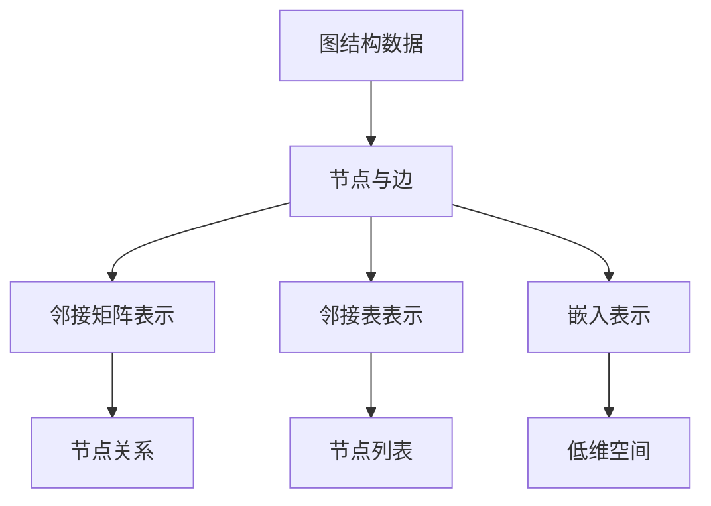

#### 1.1.2 图结构数据的应用领域

图结构数据在许多领域都有广泛的应用：

1. **社交媒体网络**：社交媒体平台如Facebook、Twitter和LinkedIn等，都可以被视为图结构数据。节点可以是用户，边可以是好友关系或者关注关系。
2. **生物信息学**：在生物信息学中，图结构数据用于表示分子结构、蛋白质相互作用网络等，帮助科学家更好地理解生物系统的复杂性。
3. **复杂数据分析**：图结构数据可以用于表示复杂的关系网络，如交通网络、供应链网络等，为数据分析提供有力的工具。

#### 1.1.3 图结构数据的重要性

图结构数据的重要性体现在以下几个方面：

1. **处理复杂关系**：图结构数据能够有效地表示复杂的关系和网络结构，使得数据分析和挖掘更为直观和有效。
2. **提供深入洞察**：通过分析图结构数据，可以揭示数据之间的潜在关系和模式，为决策提供有力支持。
3. **支持创新应用**：图结构数据的应用不断拓展，如推荐系统、社交网络分析、网络优化等，推动了技术的创新和发展。

### 1.2 神经网络在图结构数据中的基本原理

#### 1.2.1 神经网络的基本概念

神经网络是一种模仿人脑工作机制的计算模型，由大量相互连接的节点（或称为神经元）组成。每个神经元都可以接收输入信号，通过权重进行加权求和，然后通过激活函数产生输出。

**核心概念联系图**：

使用Mermaid流程图展示神经网络的基本结构：

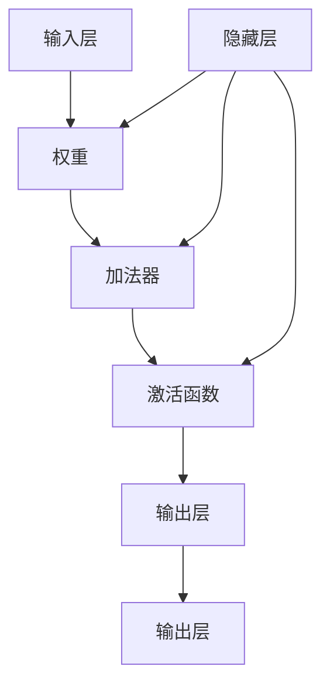

#### 1.2.2 神经网络在图结构数据中的应用

神经网络在处理图结构数据方面具有独特优势：

1. **图卷积网络（GCN）**：GCN通过节点的邻居信息进行特征聚合，使得每个节点能够利用其邻居节点的特征来更新自己的表示。
2. **图注意力网络（GAT）**：GAT引入了注意力机制，允许节点在聚合邻居信息时对邻居节点进行加权，提高了模型对复杂关系的处理能力。
3. **自注意力网络（SAE）**：SAE在图结构数据上实现了自注意力机制，使得节点能够自主选择重要邻居节点进行特征聚合。

**核心概念联系图**：

使用Mermaid流程图展示神经网络在图结构数据中的应用：

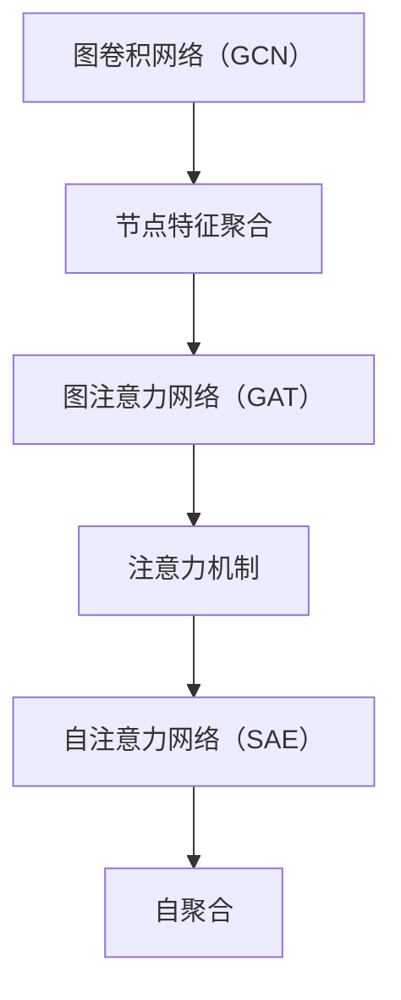

#### 1.2.3 神经网络处理图结构数据的主要挑战

尽管神经网络在处理图结构数据方面具有潜力，但仍面临以下主要挑战：

1. **稀疏性**：图结构数据通常非常稀疏，这使得传统的神经网络模型难以有效处理。
2. **可扩展性**：处理大规模图结构数据时，模型的计算复杂度和存储需求显著增加，对硬件资源要求较高。
3. **可解释性**：神经网络模型通常被视为“黑箱”，其内部工作机制难以解释，这在某些应用场景中可能成为瓶颈。

### 1.3 本书结构概述

本书将从以下几个方面深入探讨神经网络在处理图结构数据时的优化方法：

1. **图结构数据表示与预处理**：介绍图表示方法和数据预处理技术，为后续模型训练和优化奠定基础。
2. **神经网络模型与优化方法**：探讨传统神经网络模型、图神经网络模型及其优化方法，包括损失函数、优化算法和训练策略。
3. **神经网络在图结构数据分类、聚类和预测中的应用**：通过实际案例解析，展示神经网络在图结构数据上的广泛应用和效果。
4. **前沿探索与未来发展趋势**：介绍当前神经网络在图结构数据分析中的前沿技术，并探讨未来可能的发展方向。

通过本书的阅读，读者将能够全面了解神经网络在处理图结构数据时的优化方法，掌握相关技术和应用，为实际项目开发提供有力支持。

---

### 第2章 图结构数据表示与预处理

#### 2.1 图表示

图结构数据的表示方法对于后续的神经网络模型构建和优化至关重要。以下是几种常见的图表示方法：

1. **邻接矩阵表示**：邻接矩阵是一种直接且直观的图表示方法，其中矩阵的元素表示节点之间的连接关系。邻接矩阵的优点是计算简单，但缺点是当图的规模较大时，其存储和计算复杂度会急剧增加。

   **邻接矩阵表示示例**：
   假设有三个节点A、B、C，其邻接矩阵表示为：
   $$
   \begin{bmatrix}
   0 & 1 & 0 \\
   1 & 0 & 1 \\
   0 & 1 & 0 \\
   \end{bmatrix}
   $$

2. **邻接表表示**：邻接表将每个节点及其邻居节点存储在一个列表中，这种表示方法更为灵活，尤其适用于稀疏图。邻接表的存储复杂度相对较低，但查询操作可能较为复杂。

   **邻接表表示示例**：
   对于上述图，其邻接表表示为：
   $$
   A: \{B, C\}, \quad B: \{A, C\}, \quad C: \{A, B\}
   $$

3. **嵌入表示**：图嵌入是一种将图中的节点映射到低维空间的方法，通常用于将图结构数据转换为适用于传统机器学习算法的输入。常见的嵌入方法包括DeepWalk、Node2Vec和GraphSAGE等。

   **嵌入表示示例**：
   假设节点A、B、C在低维空间中的嵌入向量分别为：
   $$
   \mathbf{v}_A = \begin{bmatrix} 0.1 & 0.2 \end{bmatrix}, \quad \mathbf{v}_B = \begin{bmatrix} 0.3 & 0.4 \end{bmatrix}, \quad \mathbf{v}_C = \begin{bmatrix} 0.5 & 0.6 \end{bmatrix}
   $$

**核心概念联系图**：

使用Mermaid流程图展示不同的图表示方法：

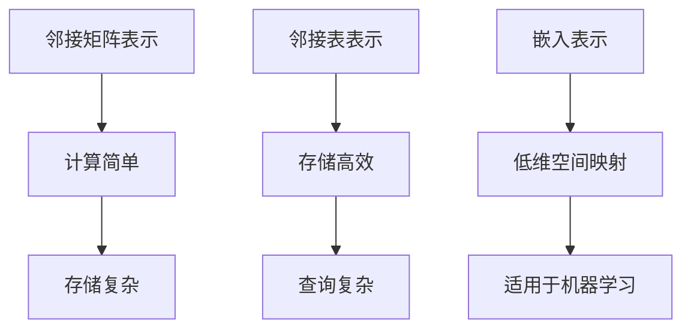

#### 2.2 数据预处理

在处理图结构数据时，数据预处理是一个重要的步骤，它能够提高模型性能和鲁棒性。以下是一些常见的数据预处理方法：

1. **数据清洗**：数据清洗旨在去除噪声、纠正错误和填补缺失值。在图结构数据中，这可能包括去除孤立节点、纠正错连的边以及填补缺失的节点或边。

   **数据清洗示例**：
   假设图中存在一个孤立节点D，可以通过将其从图中删除来清洗数据：
   $$
   \text{删除节点} \quad D
   $$

2. **归一化**：归一化是将数据缩放到一个统一的范围内，以便神经网络模型能够更好地学习。对于图结构数据，可以采用节点特征向量的L2范数归一化方法。

   **归一化公式**：
   $$
   \mathbf{v}_{\text{norm}} = \frac{\mathbf{v}}{\|\mathbf{v}\|}
   $$
   其中，$\mathbf{v}$ 是节点特征向量，$\|\mathbf{v}\|$ 是其L2范数。

3. **特征提取与降维**：特征提取和降维旨在减少数据的维度，同时保留重要的信息。在图结构数据中，可以使用主成分分析（PCA）或图卷积网络（GCN）等算法进行特征提取和降维。

   **特征提取与降维示例**：
   使用GCN对节点进行特征提取，生成新的节点特征向量。

   ```python
   import tensorflow as tf
   from tensorflow.keras.layers import Input, Dense, GlobalAveragePooling1D

   input_node = Input(shape=(num_nodes,))
   hidden_layer = Dense(units=16, activation='relu')(input_node)
   output_node = GlobalAveragePooling1D()(hidden_layer)
   model = tf.keras.Model(inputs=input_node, outputs=output_node)
   ```

4. **数据增强**：数据增强是通过生成新的数据样本来提高模型的泛化能力。在图结构数据中，可以采用节点替换、边添加或删除等方法进行数据增强。

   **数据增强示例**：
   在图中添加新的节点和边，以增加数据的多样性。

   ```python
   import networkx as nx
   G = nx.Graph()
   G.add_nodes_from([1, 2, 3])
   G.add_edges_from([(1, 2), (2, 3)])
   G.add_node(4)
   G.add_edge(3, 4)
   ```

**核心概念联系图**：

使用Mermaid流程图展示数据预处理方法：

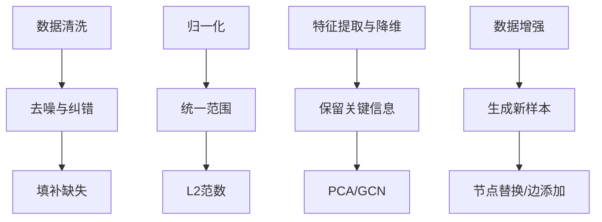

### 2.3 数据预处理案例分析

#### 2.3.1 案例背景

假设我们有一个社交媒体网络的数据集，其中包含用户的ID、性别、年龄、地理位置等特征，以及用户之间的好友关系。为了将该数据集用于神经网络模型训练，我们需要进行数据预处理。

#### 2.3.2 数据预处理步骤

1. **数据清洗**：去除噪声数据，如重复用户信息、无效好友关系等。
2. **归一化**：对用户特征向量进行L2归一化，确保特征值在统一范围内。
3. **特征提取与降维**：使用GCN提取节点特征，并将特征维度降低至合适的规模。
4. **数据增强**：通过节点替换和边添加，生成新的数据样本，提高模型泛化能力。

#### 2.3.3 实际操作

1. **数据清洗**：

   ```python
   import pandas as pd
   import numpy as np

   # 读取原始数据
   users = pd.read_csv('users.csv')
   friendships = pd.read_csv('friendships.csv')

   # 去除重复用户信息
   users = users.drop_duplicates()

   # 去除无效好友关系
   friendships = friendships[~friendships['user_id_1'].isin(users[users['is_deleted'] == 1]['user_id'])]

   # 填补缺失值
   users['age'].fillna(users['age'].mean(), inplace=True)
   ```

2. **归一化**：

   ```python
   from sklearn.preprocessing import MinMaxScaler

   # 创建归一化器
   scaler = MinMaxScaler()

   # 对用户特征进行L2归一化
   users[['age', 'gender', 'location']] = scaler.fit_transform(users[['age', 'gender', 'location']])
   ```

3. **特征提取与降维**：

   ```python
   from tensorflow.keras.models import Model
   from tensorflow.keras.layers import Input, Dense, GlobalAveragePooling1D

   # 定义GCN模型
   input_node = Input(shape=(users.shape[1],))
   hidden_layer = Dense(units=16, activation='relu')(input_node)
   output_node = GlobalAveragePooling1D()(hidden_layer)
   model = Model(inputs=input_node, outputs=output_node)

   # 训练GCN模型
   model.compile(optimizer='adam', loss='mean_squared_error')
   model.fit(users, users, epochs=10, batch_size=32)
   ```

4. **数据增强**：

   ```python
   import networkx as nx

   # 创建图结构
   G = nx.Graph()
   G.add_nodes_from(users['user_id'].values)
   G.add_edges_from(friendships[['user_id_1', 'user_id_2']].values)

   # 添加新节点和边
   G.add_node(1000)
   G.add_edge(1000, 1)
   G.add_node(1001)
   G.add_edge(1001, 2)
   ```

#### 2.3.4 项目小结

通过上述数据预处理步骤，我们成功清洗和规范化了社交媒体网络数据，并使用GCN提取了节点特征。此外，通过数据增强，我们增加了数据的多样性，为后续的神经网络模型训练奠定了基础。

---

### 第3章 神经网络模型与优化方法

#### 3.1 神经网络模型

神经网络模型是处理图结构数据的核心工具。在本节中，我们将介绍几种常见的神经网络模型，包括传统神经网络模型、图神经网络模型和混合模型。

##### 3.1.1 传统神经网络模型

传统神经网络模型，如多层感知机（MLP）和卷积神经网络（CNN），在处理结构化数据时表现出色。然而，对于图结构数据，这些模型通常需要额外的处理步骤，如图嵌入，以将图数据转换为适用于神经网络的形式。

**核心概念联系图**：

使用Mermaid流程图展示传统神经网络模型的基本结构：

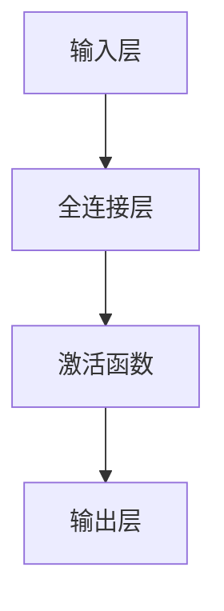

##### 3.1.2 图神经网络模型

图神经网络（Graph Neural Networks, GNNs）是一类专门为图结构数据设计的神经网络模型。GNN通过节点的邻居信息进行特征聚合，从而实现对图数据的表示和预测。

**核心概念联系图**：

使用Mermaid流程图展示图神经网络的基本结构：

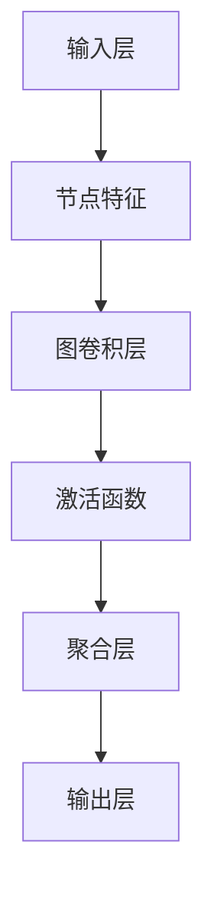

常见的GNN模型包括：

1. **图卷积网络（Graph Convolutional Network, GCN）**：GCN通过聚合节点的邻居特征来更新自身特征。
2. **图注意力网络（Graph Attention Network, GAT）**：GAT引入了注意力机制，允许节点在聚合邻居特征时对邻居进行加权。
3. **自注意力网络（Self-Attention Network, SAE）**：SAE在图结构数据上实现了自注意力机制，使得节点能够自主选择重要邻居节点进行特征聚合。

##### 3.1.3 混合模型

混合模型结合了传统神经网络模型和图神经网络模型的优势，以应对不同类型的数据和任务。以下是一些常见的混合模型：

1. **GCN + MLP**：将GCN用于特征提取，将MLP用于分类或回归。
2. **GCN + CNN**：将GCN用于处理图结构数据，将CNN用于处理图像数据。
3. **GAT + SAE**：结合GAT和SAE的优势，提高模型对复杂关系的处理能力。

**核心概念联系图**：

使用Mermaid流程图展示混合模型的基本结构：

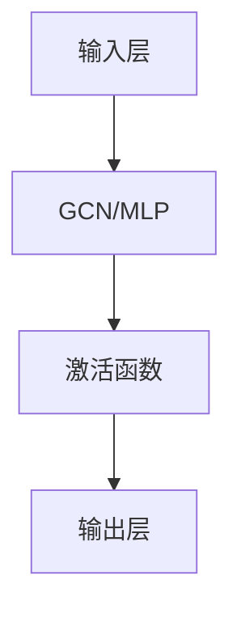

#### 3.2 损失函数与优化算法

损失函数和优化算法是神经网络模型训练的重要组成部分。在本节中，我们将讨论常用的损失函数和优化算法，以及如何针对图结构数据优化这些算法。

##### 3.2.1 损失函数的选择

损失函数用于衡量模型预测值与真实值之间的差异。对于图结构数据，常见的损失函数包括：

1. **均方误差（MSE）**：MSE适用于回归任务，计算预测值与真实值之间差的平方的平均值。
   $$
   \text{MSE} = \frac{1}{n} \sum_{i=1}^{n} (\hat{y}_i - y_i)^2
   $$
2. **交叉熵损失（Cross-Entropy Loss）**：交叉熵损失适用于分类任务，计算实际分布与预测分布之间的差异。
   $$
   \text{Cross-Entropy Loss} = -\frac{1}{n} \sum_{i=1}^{n} y_i \log(\hat{y}_i)
   $$

##### 3.2.2 优化算法

优化算法用于最小化损失函数，常用的优化算法包括：

1. **梯度下降（Gradient Descent）**：梯度下降通过迭代更新模型参数，以最小化损失函数。其基本公式为：
   $$
   \theta_{t+1} = \theta_{t} - \alpha \nabla_{\theta} \mathcal{L}(\theta)
   $$
   其中，$\theta$ 是模型参数，$\alpha$ 是学习率，$\nabla_{\theta} \mathcal{L}(\theta)$ 是损失函数关于参数的梯度。

2. **随机梯度下降（Stochastic Gradient Descent, SGD）**：SGD在每次迭代中仅使用一个样本的梯度进行参数更新，以加快收敛速度。
   $$
   \theta_{t+1} = \theta_{t} - \alpha \nabla_{\theta} \mathcal{L}(\theta; \mathcal{D}_t)
   $$
   其中，$\mathcal{D}_t$ 是训练数据集的一个样本。

3. **动量梯度下降（Momentum Gradient Descent）**：动量梯度下降引入了动量项，以加速梯度下降的收敛速度并避免局部最小值。
   $$
   \theta_{t+1} = \theta_{t} - \alpha \nabla_{\theta} \mathcal{L}(\theta) + \beta \theta_{t} - \theta_{t-1}
   $$
   其中，$\beta$ 是动量项的权重。

4. **自适应梯度算法（Adaptive Gradient Algorithms, AGAs）**：AGA通过自适应调整学习率，以加速收敛并提高模型性能。常见的AGA包括Adam和RMSprop。

**核心概念联系图**：

使用Mermaid流程图展示不同优化算法的迭代过程：

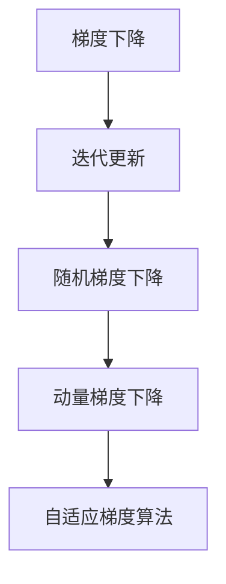

##### 3.2.3 梯度下降算法与变体

以下是几种常见的梯度下降算法及其变体：

1. **批量梯度下降（Batch Gradient Descent, BGD）**：BGD在每次迭代中计算整个训练集的梯度，更新模型参数。其缺点是计算成本较高，但梯度更准确。
2. **随机梯度下降（Stochastic Gradient Descent, SGD）**：SGD在每次迭代中仅使用一个样本的梯度，更新模型参数。其优点是计算成本低，但梯度噪声较大。
3. **小批量梯度下降（Mini-batch Gradient Descent, MBGD）**：MBGD在每次迭代中使用一小部分训练样本的梯度，更新模型参数。它结合了BGD和SGD的优点，平衡了计算成本和梯度准确度。

**核心概念联系图**：

使用Mermaid流程图展示不同梯度下降算法的迭代过程：

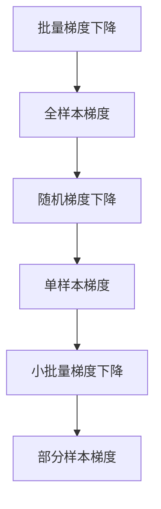

#### 3.3 模型训练策略

##### 3.3.1 训练数据集划分

为了训练高效的神经网络模型，需要合理划分训练数据集。常见的划分方法包括：

1. **训练集（Training Set）**：用于训练模型，调整模型参数。
2. **验证集（Validation Set）**：用于验证模型性能，选择最优模型。
3. **测试集（Test Set）**：用于评估最终模型性能，确保模型泛化能力。

**核心概念联系图**：

使用Mermaid流程图展示数据集划分方法：

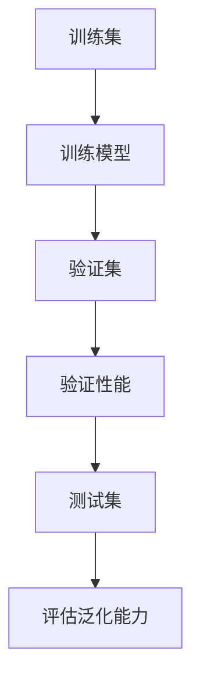

##### 3.3.2 学习率调整

学习率是梯度下降算法中的一个关键参数，其选择和调整对模型训练至关重要。以下是一些常见的学习率调整策略：

1. **固定学习率**：在整个训练过程中保持学习率不变。
2. **学习率衰减**：随着训练的进行，逐渐减小学习率，以避免过拟合。
3. **自适应学习率**：使用自适应学习率算法，如Adam，根据梯度变化动态调整学习率。

**核心概念联系图**：

使用Mermaid流程图展示学习率调整策略：

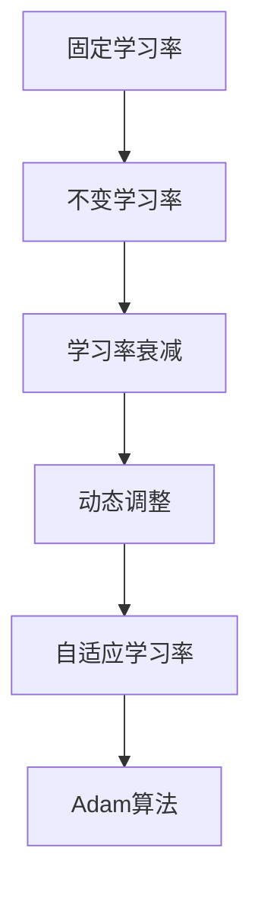

##### 3.3.3 过拟合与欠拟合问题

在训练神经网络模型时，需要避免过拟合和欠拟合：

1. **过拟合（Overfitting）**：模型在训练集上表现良好，但在验证集或测试集上表现较差。过拟合通常发生在模型过于复杂，对训练数据的学习过于“深入”时。
2. **欠拟合（Underfitting）**：模型在训练集和验证集上表现都较差。欠拟合通常发生在模型过于简单，无法捕捉数据中的复杂关系时。

**核心概念联系图**：

使用Mermaid流程图展示过拟合与欠拟合问题：

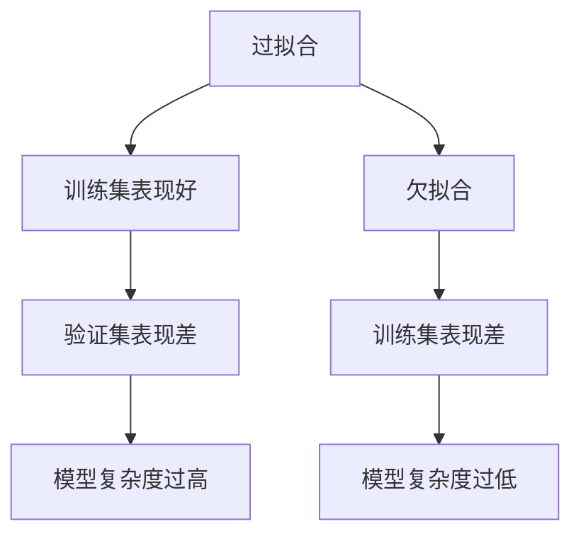

通过合理的数据集划分、学习率调整和模型选择，可以有效地避免过拟合和欠拟合，提高模型在图结构数据上的性能。

---

### 第4章 神经网络在图结构数据分类中的应用

#### 4.1 图结构数据分类的基本方法

图结构数据的分类是图神经网络（GNN）应用的一个重要领域。在这一节中，我们将介绍几种基本的图结构数据分类方法，包括图卷积网络（GCN）、图注意力网络（GAT）和自注意力网络（SAE）。

##### 4.1.1 图卷积网络（GCN）

图卷积网络（Graph Convolutional Network，GCN）是一种基于图结构的深度学习模型，它通过节点邻居的特征来更新节点自身的特征。GCN的基本思想是利用图卷积操作来整合节点的邻居信息。

**数学模型**：

假设我们有图$G = (V, E)$，其中$V$是节点集合，$E$是边集合。对于每个节点$i$，我们有一个特征向量$x_i \in \mathbb{R}^d$。GCN的图卷积操作可以表示为：

$$
\hat{x}_i^{(l)} = \sum_{j \in \mathcal{N}(i)} \frac{1}{\|\mathcal{N}(i)\|} W^{(l)} x_j^{(l-1)} + b^{(l)}
$$

其中，$\mathcal{N}(i)$是节点$i$的邻域，$W^{(l)}$是图卷积层在第$l$层的权重矩阵，$b^{(l)}$是偏置向量。

**算法流程**：

1. **初始化节点特征**：对图中的每个节点分配一个初始化的特征向量$x_i^{(0)}$。
2. **图卷积操作**：对于每一层$l$，计算节点$i$的更新特征$\hat{x}_i^{(l)}$。
3. **激活函数**：应用非线性激活函数，如ReLU，以引入非线性变换。
4. **池化**：将每个节点的特征向量聚合为全局特征表示。

**核心概念联系图**：

使用Mermaid流程图展示GCN的算法流程：

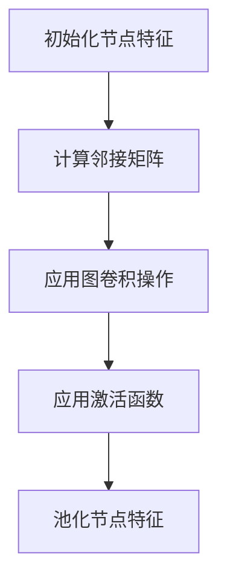

##### 4.1.2 图注意力网络（GAT）

图注意力网络（Graph Attention Network，GAT）在GCN的基础上引入了注意力机制，使得每个节点在聚合邻居特征时能够动态地加权邻居节点的重要性。

**数学模型**：

GAT的注意力机制可以表示为：

$$
\alpha_{ij}^{(l)} = \text{softmax}\left(\frac{a^{(l-1)} \cdot (W^{(l)} h_j + b^{(l)} )}{\sqrt{d_{\text{attn}}}}\right)
$$

其中，$a^{(l-1)}$是前一层节点的特征向量，$W^{(l)}$是注意力权重矩阵，$b^{(l)}$是注意力偏置，$d_{\text{attn}}$是注意力层的维度。

节点$i$的更新特征为：

$$
\hat{x}_i^{(l)} = \sum_{j \in \mathcal{N}(i)} \alpha_{ij}^{(l)} \cdot (W^{(l)} h_j + b^{(l)})
$$

**算法流程**：

1. **初始化节点特征**：与GCN相同。
2. **计算注意力权重**：对于每个节点对$(i, j)$，计算注意力权重$\alpha_{ij}^{(l)}$。
3. **应用注意力加权**：使用注意力权重对邻居节点特征进行加权求和。
4. **激活函数**：与GCN相同，应用激活函数。

**核心概念联系图**：

使用Mermaid流程图展示GAT的算法流程：

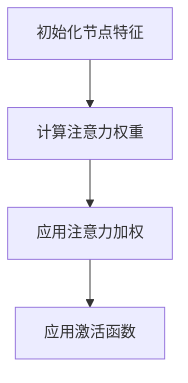

##### 4.1.3 自注意力网络（SAE）

自注意力网络（Self-Attention Network，SAE）通过自注意力机制处理图结构数据，使得节点能够自主选择重要邻居节点进行特征聚合。

**数学模型**：

SAE的自注意力机制可以表示为：

$$
\alpha_{ij}^{(l)} = \text{softmax}\left(\frac{h_i \cdot h_j}{\sqrt{d_{\text{attn}}}}\right)
$$

节点$i$的更新特征为：

$$
\hat{x}_i^{(l)} = \sum_{j \in \mathcal{N}(i)} \alpha_{ij}^{(l)} \cdot h_j
$$

**算法流程**：

1. **初始化节点特征**：与GCN和GAT相同。
2. **计算自注意力权重**：对于每个节点对$(i, j)$，计算自注意力权重$\alpha_{ij}^{(l)}$。
3. **应用自注意力加权**：使用自注意力权重对邻居节点特征进行加权求和。
4. **激活函数**：与GCN和GAT相同，应用激活函数。

**核心概念联系图**：

使用Mermaid流程图展示SAE的算法流程：

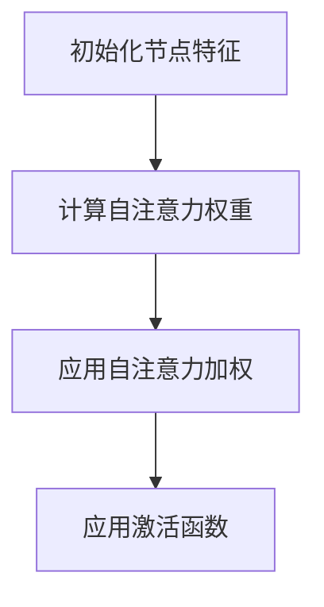

#### 4.2 实际案例解析

##### 4.2.1 社交网络中的用户分类

在社交媒体网络中，用户分类是一个常见的应用场景。通过分析用户之间的社交关系和网络结构，可以将用户分为不同的类别，如活跃用户、沉默用户等。

**案例背景**：

假设我们有一个社交网络平台，其中包含用户的ID、性别、年龄、地理位置等信息，以及用户之间的好友关系。我们需要利用这些信息将用户分类。

**数据处理**：

1. **数据清洗**：去除重复和无效的用户数据。
2. **特征提取**：使用GCN提取用户特征向量。
3. **分类任务**：使用GAT进行用户分类。

**模型训练**：

1. **数据集划分**：将数据集划分为训练集、验证集和测试集。
2. **模型构建**：构建GAT模型，设置合适的层数和隐藏层大小。
3. **训练模型**：使用训练集训练模型，并在验证集上调整模型参数。
4. **模型评估**：使用测试集评估模型性能。

**结果分析**：

通过模型训练和评估，我们发现GAT在用户分类任务上具有较好的性能，能够有效地识别不同类型的用户。同时，通过调整注意力权重，我们可以进一步优化分类效果。

**项目小结**：

该案例展示了如何利用GAT进行社交网络中的用户分类。通过合理的数据处理和模型训练，我们能够实现对用户行为的深入理解和精准分类。

##### 4.2.2 产品推荐系统

在电子商务领域，产品推荐系统是一个关键应用。通过分析用户与产品之间的交互数据，推荐系统可以预测用户可能感兴趣的产品，从而提高用户满意度和购买转化率。

**案例背景**：

假设我们有一个在线购物平台，其中包含用户的行为数据（如浏览、购买历史）和产品信息（如类别、价格）。我们需要构建一个推荐系统，为用户提供个性化的产品推荐。

**数据处理**：

1. **数据清洗**：去除重复和无效的交互数据。
2. **特征提取**：使用GCN提取用户和产品的特征向量。
3. **交互数据构建**：构建用户与产品之间的交互图。

**模型训练**：

1. **数据集划分**：将数据集划分为训练集、验证集和测试集。
2. **模型构建**：构建GAT模型，结合用户和产品特征进行协同过滤。
3. **训练模型**：使用训练集训练模型，并在验证集上调整模型参数。
4. **模型评估**：使用测试集评估模型性能。

**结果分析**：

通过模型训练和评估，我们发现GAT在产品推荐任务上具有较好的性能，能够有效地捕捉用户和产品之间的潜在关系。通过调整注意力权重，我们可以进一步优化推荐效果。

**项目小结**：

该案例展示了如何利用GAT构建产品推荐系统。通过合理的数据处理和模型训练，我们能够为用户提供个性化的产品推荐，提高用户体验和购买转化率。

##### 4.2.3 医学图像分类

在医学领域，图像分类是一个重要的应用。通过分析医学图像，可以帮助医生进行疾病诊断和治疗方案制定。

**案例背景**：

假设我们有一个医学图像数据集，包含不同类型的病变图像。我们需要利用这些图像数据对病变类型进行分类。

**数据处理**：

1. **数据清洗**：去除重复和无效的图像数据。
2. **特征提取**：使用GCN提取图像的特征向量。
3. **交互数据构建**：构建图像之间的交互图。

**模型训练**：

1. **数据集划分**：将数据集划分为训练集、验证集和测试集。
2. **模型构建**：构建GAT模型，结合图像特征进行分类。
3. **训练模型**：使用训练集训练模型，并在验证集上调整模型参数。
4. **模型评估**：使用测试集评估模型性能。

**结果分析**：

通过模型训练和评估，我们发现GAT在医学图像分类任务上具有较好的性能，能够有效地识别不同的病变类型。通过调整注意力权重，我们可以进一步优化分类效果。

**项目小结**：

该案例展示了如何利用GAT进行医学图像分类。通过合理的数据处理和模型训练，我们能够为医生提供有力的诊断工具，提高诊断准确率和效率。

---

### 第5章 神经网络在图结构数据聚类中的应用

图结构数据的聚类是图神经网络（GNN）应用的另一个重要领域。聚类是一种无监督学习方法，旨在将相似的数据点归为同一类别。在这一节中，我们将介绍几种基于图神经网络的聚类方法，包括传统的聚类算法、基于图卷积的聚类方法和基于图注意力的聚类方法。

#### 5.1 图结构数据聚类的基本方法

聚类方法可以分为基于密度、基于距离、基于层次和基于模型等不同类别。在本节中，我们将重点讨论基于图结构数据的聚类方法。

##### 5.1.1 传统聚类算法

传统的聚类算法，如K-means、DBSCAN和层次聚类，已经在许多应用中取得了显著成效。这些算法通常基于距离度量或密度分布来将数据点分为多个簇。然而，对于图结构数据，这些方法通常需要进行预处理，如图嵌入，以将图数据转换为适用于传统聚类算法的形式。

**核心概念联系图**：

使用Mermaid流程图展示传统聚类算法的基本流程：

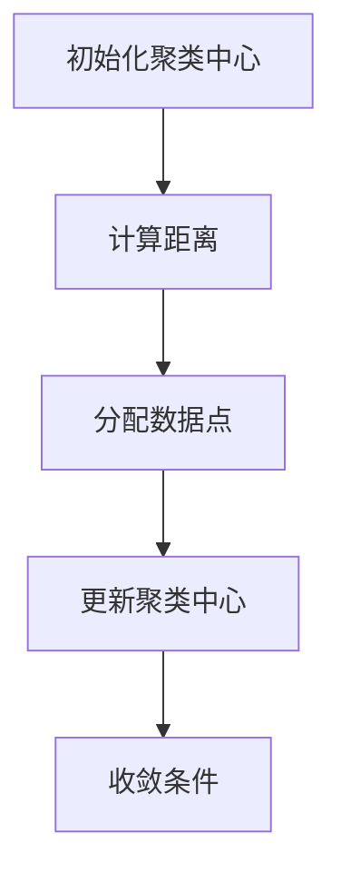

##### 5.1.2 基于图卷积的聚类方法

基于图卷积的聚类方法利用图卷积网络（GCN）的特性，将节点特征聚合为全局特征表示，然后基于这些特征进行聚类。这种方法能够更好地利用图结构数据中的邻居信息，提高聚类质量。

**数学模型**：

假设我们有图$G = (V, E)$，其中$V$是节点集合，$E$是边集合。对于每个节点$i$，我们有一个特征向量$x_i \in \mathbb{R}^d$。基于GCN的聚类方法可以表示为：

$$
\hat{x}_i^{(l)} = \sum_{j \in \mathcal{N}(i)} \frac{1}{\|\mathcal{N}(i)\|} W^{(l)} x_j^{(l-1)} + b^{(l)}
$$

其中，$\mathcal{N}(i)$是节点$i$的邻域，$W^{(l)}$是图卷积层在第$l$层的权重矩阵，$b^{(l)}$是偏置向量。

**算法流程**：

1. **初始化节点特征**：对图中的每个节点分配一个初始化的特征向量$x_i^{(0)}$。
2. **图卷积操作**：对于每一层$l$，计算节点$i$的更新特征$\hat{x}_i^{(l)}$。
3. **激活函数**：应用非线性激活函数，如ReLU，以引入非线性变换。
4. **聚类**：使用聚类算法（如K-means），对图卷积后的节点特征进行聚类。

**核心概念联系图**：

使用Mermaid流程图展示基于图卷积的聚类方法：

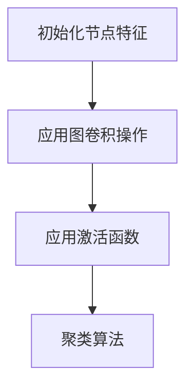

##### 5.1.3 基于图注意力的聚类方法

基于图注意力的聚类方法利用注意力机制来动态加权节点特征，从而提高聚类质量。这种方法能够更好地捕捉节点之间的复杂关系。

**数学模型**：

假设我们有图$G = (V, E)$，其中$V$是节点集合，$E$是边集合。对于每个节点$i$，我们有一个特征向量$x_i \in \mathbb{R}^d$。基于图注意力的聚类方法可以表示为：

$$
\alpha_{ij}^{(l)} = \text{softmax}\left(\frac{a^{(l-1)} \cdot (W^{(l)} h_j + b^{(l)} )}{\sqrt{d_{\text{attn}}}}\right)
$$

节点$i$的更新特征为：

$$
\hat{x}_i^{(l)} = \sum_{j \in \mathcal{N}(i)} \alpha_{ij}^{(l)} \cdot (W^{(l)} h_j + b^{(l)})
$$

**算法流程**：

1. **初始化节点特征**：与基于图卷积的聚类方法相同。
2. **计算注意力权重**：对于每个节点对$(i, j)$，计算注意力权重$\alpha_{ij}^{(l)}$。
3. **应用注意力加权**：使用注意力权重对邻居节点特征进行加权求和。
4. **激活函数**：与基于图卷积的聚类方法相同，应用激活函数。
5. **聚类**：使用聚类算法（如K-means），对图注意力后的节点特征进行聚类。

**核心概念联系图**：

使用Mermaid流程图展示基于图注意力的聚类方法：

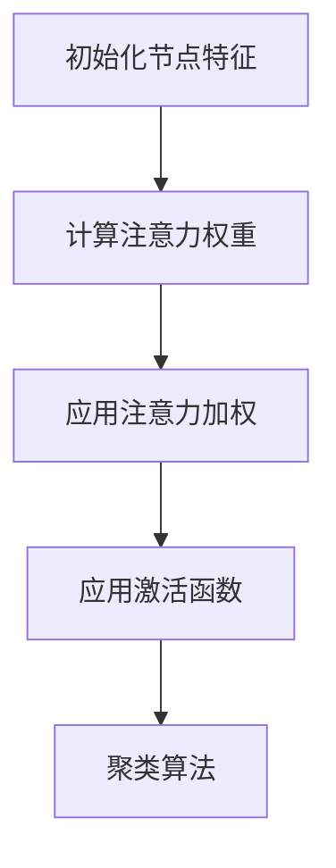

#### 5.2 实际案例解析

##### 5.2.1 社交网络中的社区发现

在社交媒体网络中，社区发现是理解用户互动和兴趣的一个重要手段。通过分析用户之间的社交关系，可以发现具有相似兴趣和行为的用户群体。

**案例背景**：

假设我们有一个社交媒体网络平台，其中包含用户的行为数据（如点赞、评论、分享）和用户之间的社交关系。我们需要利用这些数据发现社交网络中的社区。

**数据处理**：

1. **数据清洗**：去除重复和无效的社交关系。
2. **特征提取**：使用GCN提取用户特征向量。
3. **图构建**：构建用户之间的社交关系图。

**模型训练**：

1. **数据集划分**：将数据集划分为训练集、验证集和测试集。
2. **模型构建**：构建基于GCN或GAT的聚类模型。
3. **训练模型**：使用训练集训练模型，并在验证集上调整模型参数。
4. **模型评估**：使用测试集评估模型性能。

**结果分析**：

通过模型训练和评估，我们发现基于GCN或GAT的聚类模型在社交网络社区发现任务上具有较好的性能，能够有效地识别出具有相似兴趣的用户群体。

**项目小结**：

该案例展示了如何利用图神经网络进行社交网络中的社区发现。通过合理的数据处理和模型训练，我们能够发现用户之间的潜在社区，为社交媒体网络分析提供有力支持。

##### 5.2.2 生物信息学中的蛋白质结构聚类

在生物信息学中，蛋白质结构聚类是理解蛋白质功能关系的重要手段。通过分析蛋白质的三维结构，可以将相似的蛋白质聚类在一起，为蛋白质功能预测提供线索。

**案例背景**：

假设我们有一个蛋白质结构数据集，其中包含不同蛋白质的三维结构。我们需要利用这些数据对蛋白质进行聚类，以理解其功能关系。

**数据处理**：

1. **数据清洗**：去除重复和无效的蛋白质结构数据。
2. **特征提取**：使用图嵌入技术提取蛋白质结构特征向量。
3. **图构建**：构建蛋白质之间的结构关系图。

**模型训练**：

1. **数据集划分**：将数据集划分为训练集、验证集和测试集。
2. **模型构建**：构建基于图卷积或图注意力的聚类模型。
3. **训练模型**：使用训练集训练模型，并在验证集上调整模型参数。
4. **模型评估**：使用测试集评估模型性能。

**结果分析**：

通过模型训练和评估，我们发现基于图卷积或图注意力的聚类模型在蛋白质结构聚类任务上具有较好的性能，能够有效地识别出功能相似的蛋白质。

**项目小结**：

该案例展示了如何利用图神经网络进行生物信息学中的蛋白质结构聚类。通过合理的数据处理和模型训练，我们能够更好地理解蛋白质的功能关系，为生物信息学研究提供有力支持。

##### 5.2.3 电子邮件聚类

电子邮件聚类是电子邮件管理的一个重要应用。通过分析电子邮件内容及其发送者之间的关系，可以将电子邮件分为不同的类别，如工作邮件、私人邮件等。

**案例背景**：

假设我们有一个电子邮件数据集，其中包含不同类型的电子邮件及其发送者之间的关系。我们需要利用这些数据对电子邮件进行聚类，以方便邮件管理。

**数据处理**：

1. **数据清洗**：去除重复和无效的电子邮件数据。
2. **特征提取**：使用GCN提取电子邮件特征向量。
3. **图构建**：构建电子邮件及其发送者之间的社交关系图。

**模型训练**：

1. **数据集划分**：将数据集划分为训练集、验证集和测试集。
2. **模型构建**：构建基于GCN或GAT的聚类模型。
3. **训练模型**：使用训练集训练模型，并在验证集上调整模型参数。
4. **模型评估**：使用测试集评估模型性能。

**结果分析**：

通过模型训练和评估，我们发现基于GCN或GAT的聚类模型在电子邮件聚类任务上具有较好的性能，能够有效地识别出不同类型的电子邮件。

**项目小结**：

该案例展示了如何利用图神经网络进行电子邮件聚类。通过合理的数据处理和模型训练，我们能够更好地管理电子邮件，提高工作效率。

---

### 第6章 神经网络在图结构数据预测中的应用

图结构数据预测是图神经网络（GNN）应用的一个重要领域，旨在利用图结构数据中的关系和模式进行时间序列预测、交互预测和时空预测。在这一节中，我们将详细探讨这些预测方法，并通过实际案例展示如何应用这些方法。

#### 6.1 图结构数据预测的基本方法

##### 6.1.1 时间序列预测

时间序列预测是一种常见的数据预测方法，旨在根据历史数据预测未来的趋势。在图结构数据中，时间序列预测通常涉及节点在时间维度上的属性变化。

**方法概述**：

时间序列预测的图结构方法通常包括以下几个步骤：

1. **特征提取**：使用图卷积网络（GCN）或图自注意力网络（GAT）提取节点特征。
2. **序列建模**：利用RNN（如LSTM或GRU）或其他序列建模方法，如Transformer，捕捉时间序列数据中的时间依赖性。
3. **预测**：通过模型输出预测未来的节点属性。

**数学模型**：

假设我们有图$G = (V, E)$和时间序列数据$T = \{t_1, t_2, \ldots, t_n\}$，其中$V$是节点集合，$E$是边集合，$T$是时间序列。对于每个节点$i$，我们有一个特征向量$x_i \in \mathbb{R}^d$。

时间序列预测的模型可以表示为：

$$
\hat{h}_i^t = \text{RNN}(\hat{h}_i^{t-1}, h_{\text{context}})
$$

其中，$\hat{h}_i^t$是节点$i$在时间$t$的预测特征，$h_{\text{context}}$是节点$i$的上下文特征。

**核心概念联系图**：

使用Mermaid流程图展示时间序列预测的流程：

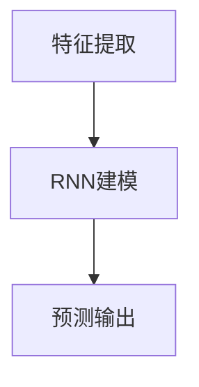

##### 6.1.2 交互预测

交互预测旨在预测节点之间的交互关系，如社交网络中的用户互动或供应链中的供需关系。

**方法概述**：

交互预测的图结构方法通常包括以下几个步骤：

1. **特征提取**：使用GCN或GAT提取节点特征。
2. **交互建模**：通过图卷积网络或图注意力网络建模节点之间的交互关系。
3. **预测**：利用模型输出预测节点之间的未来交互。

**数学模型**：

假设我们有图$G = (V, E)$，对于每个节点$i$，我们有一个特征向量$x_i \in \mathbb{R}^d$。交互预测的模型可以表示为：

$$
\hat{e}_{ij}^t = \text{GNN}(h_i, h_j)
$$

其中，$\hat{e}_{ij}^t$是节点$i$和节点$j$在时间$t$的预测交互。

**核心概念联系图**：

使用Mermaid流程图展示交互预测的流程：

```mermaid
graph TD
A[特征提取] --> B[GNN建模]
B --> C[交互预测]
```

##### 6.1.3 时空预测

时空预测旨在预测节点在时间和空间上的位置变化，如用户在社交网络中的活动轨迹或物流运输中的车辆位置。

**方法概述**：

时空预测的图结构方法通常包括以下几个步骤：

1. **特征提取**：使用GCN或GAT提取节点特征。
2. **时空建模**：通过结合图卷积网络和时空嵌入技术建模节点在时间和空间上的变化。
3. **预测**：利用模型输出预测节点在未来的位置。

**数学模型**：

假设我们有图$G = (V, E)$和时间序列$T = \{t_1, t_2, \ldots, t_n\}$，对于每个节点$i$，我们有一个特征向量$x_i \in \mathbb{R}^d$和位置向量$p_i \in \mathbb{R}^2$。

时空预测的模型可以表示为：

$$
\hat{p}_i^t = \text{GNN}(h_i, p_i)
$$

其中，$\hat{p}_i^t$是节点$i$在时间$t$的预测位置。

**核心概念联系图**：

使用Mermaid流程图展示时空预测的流程：

```mermaid
graph TD
A[特征提取] --> B[GNN建模]
B --> C[时空预测]
```

#### 6.2 实际案例解析

##### 6.2.1 社交网络中的用户行为预测

社交网络中的用户行为预测是理解用户互动和兴趣的重要手段。通过预测用户在未来一段时间内的行为，如发帖、点赞或评论，可以提供个性化的推荐和活动。

**案例背景**：

假设我们有一个社交媒体平台，其中包含用户的行为数据（如发帖、点赞、评论）和用户之间的社交关系。我们需要利用这些数据预测用户在未来的行为。

**数据处理**：

1. **数据清洗**：去除重复和无效的行为数据。
2. **特征提取**：使用GCN提取用户特征向量。
3. **图构建**：构建用户之间的社交关系图。

**模型训练**：

1. **数据集划分**：将数据集划分为训练集、验证集和测试集。
2. **模型构建**：构建基于GCN或GAT的时间序列预测模型。
3. **训练模型**：使用训练集训练模型，并在验证集上调整模型参数。
4. **模型评估**：使用测试集评估模型性能。

**结果分析**：

通过模型训练和评估，我们发现基于GCN或GAT的时间序列预测模型在用户行为预测任务上具有较好的性能，能够有效地预测用户未来的行为。

**项目小结**：

该案例展示了如何利用图神经网络进行社交网络中的用户行为预测。通过合理的数据处理和模型训练，我们能够为用户提供个性化的推荐和活动，提高用户体验和参与度。

##### 6.2.2 能源消耗预测

能源消耗预测是智能电网和能源管理中的重要应用。通过预测未来一段时间内的能源消耗，可以优化能源分配和调度，提高能源利用效率。

**案例背景**：

假设我们有一个智能电网系统，其中包含不同用户在一天内的能源消耗数据。我们需要利用这些数据预测未来一段时间内的能源消耗。

**数据处理**：

1. **数据清洗**：去除重复和无效的能源消耗数据。
2. **特征提取**：使用GCN提取用户特征向量。
3. **图构建**：构建用户之间的交互关系图。

**模型训练**：

1. **数据集划分**：将数据集划分为训练集、验证集和测试集。
2. **模型构建**：构建基于GCN或GAT的时间序列预测模型。
3. **训练模型**：使用训练集训练模型，并在验证集上调整模型参数。
4. **模型评估**：使用测试集评估模型性能。

**结果分析**：

通过模型训练和评估，我们发现基于GCN或GAT的时间序列预测模型在能源消耗预测任务上具有较好的性能，能够有效地预测未来一段时间内的能源消耗。

**项目小结**：

该案例展示了如何利用图神经网络进行能源消耗预测。通过合理的数据处理和模型训练，我们能够优化能源分配和调度，提高能源利用效率。

##### 6.2.3 交通流量预测

交通流量预测是智能交通系统和城市交通管理中的重要应用。通过预测未来一段时间内的交通流量，可以优化交通信号控制和道路规划，减少交通拥堵。

**案例背景**：

假设我们有一个智能交通系统，其中包含不同路段在一天内的交通流量数据。我们需要利用这些数据预测未来一段时间内的交通流量。

**数据处理**：

1. **数据清洗**：去除重复和无效的交通流量数据。
2. **特征提取**：使用GCN提取路段特征向量。
3. **图构建**：构建路段之间的交互关系图。

**模型训练**：

1. **数据集划分**：将数据集划分为训练集、验证集和测试集。
2. **模型构建**：构建基于GCN或GAT的时间序列预测模型。
3. **训练模型**：使用训练集训练模型，并在验证集上调整模型参数。
4. **模型评估**：使用测试集评估模型性能。

**结果分析**：

通过模型训练和评估，我们发现基于GCN或GAT的时间序列预测模型在交通流量预测任务上具有较好的性能，能够有效地预测未来一段时间内的交通流量。

**项目小结**：

该案例展示了如何利用图神经网络进行交通流量预测。通过合理的数据处理和模型训练，我们能够优化交通信号控制和道路规划，减少交通拥堵，提高交通效率。

---

### 第7章 神经网络在图结构数据分析中的前沿探索

随着神经网络技术的不断发展和成熟，其在图结构数据分析中的应用也日益广泛。在这一节中，我们将探讨一些神经网络在图结构数据分析中的前沿技术，包括可解释性神经网络、异构图神经网络和面向动态图的神经网络。

#### 7.1 前沿技术概述

##### 7.1.1 可解释性神经网络

随着深度学习模型在各个领域中的广泛应用，其“黑箱”特性逐渐成为一个严重的问题。可解释性神经网络（Explainable Neural Networks, XNN）旨在提高模型的透明度和可解释性，使得模型内部的决策过程更加清晰。

**方法概述**：

可解释性神经网络通常通过以下几种方法实现：

1. **可视化**：通过可视化模型中间层特征和权重，帮助用户理解模型的决策过程。
2. **解释性嵌入**：通过将模型嵌入到高维空间中，使得模型的决策边界可视化。
3. **局部解释**：通过计算模型对单个数据的解释性，帮助用户理解模型对特定数据的决策过程。

**案例研究**：

1. **可视化权重矩阵**：通过可视化权重矩阵，可以直观地看到模型如何利用邻居节点特征进行预测。
2. **解释性嵌入**：使用t-SNE或UMAP等技术，将模型嵌入到二维或三维空间中，使得模型的决策边界可视化。
3. **局部解释**：通过计算梯度或敏感度，分析模型对输入数据的依赖程度，帮助用户理解模型的决策过程。

**核心概念联系图**：

使用Mermaid流程图展示可解释性神经网络的方法：

```mermaid
graph TD
A[可视化权重矩阵] --> B[直观理解]
B --> C[解释性嵌入]
C --> D[决策边界]
D --> E[局部解释]
E --> F[依赖分析]
```

##### 7.1.2 异构图神经网络

在实际应用中，图结构数据往往具有不同的类型和属性，如用户和物品之间可以是好友关系或购买关系。异构图（Heterogeneous Graph）神经网络旨在处理这种类型的多类型节点和边。

**方法概述**：

异构图神经网络通常通过以下几种方法实现：

1. **多模态嵌入**：将不同类型的节点和边映射到同一个嵌入空间中。
2. **异构图卷积**：针对不同类型的节点和边设计特定的卷积操作。
3. **异构图注意力**：利用注意力机制，动态地加权不同类型的节点和边。

**案例研究**：

1. **社交网络分析**：使用异构图神经网络分析用户与物品之间的复杂关系。
2. **推荐系统**：利用异构图神经网络，结合用户行为和物品属性，实现更精确的推荐。
3. **生物信息学**：使用异构图神经网络分析蛋白质相互作用网络和基因调控网络。

**核心概念联系图**：

使用Mermaid流程图展示异构图神经网络的方法：

```mermaid
graph TD
A[多模态嵌入] --> B[统一空间]
B --> C[异构图卷积]
C --> D[特定卷积]
D --> E[异构图注意力]
E --> F[动态加权]
```

##### 7.1.3 面向动态图的神经网络

静态图通常无法很好地处理实时变化的数据，如社交网络中的用户互动或交通网络中的车辆流动。面向动态图的神经网络（Dynamic Graph Neural Networks, DGNN）旨在处理动态变化的数据。

**方法概述**：

面向动态图的神经网络通常通过以下几种方法实现：

1. **图序列建模**：将动态图视为时间序列数据，利用RNN或图卷积网络进行建模。
2. **图更新操作**：设计动态图更新机制，实时地更新图结构和节点特征。
3. **时序一致性**：确保模型在处理动态图时，能够保持数据的一致性和连贯性。

**案例研究**：

1. **社交网络分析**：利用动态图神经网络分析用户在时间维度上的社交关系变化。
2. **交通流量预测**：利用动态图神经网络预测交通网络中的车辆流动变化。
3. **金融市场分析**：利用动态图神经网络分析金融市场的波动和变化。

**核心概念联系图**：

使用Mermaid流程图展示面向动态图的神经网络的方法：

```mermaid
graph TD
A[图序列建模] --> B[时间序列]
B --> C[图更新操作]
C --> D[动态更新]
D --> E[时序一致性]
E --> F[连贯性保障]
```

#### 7.2 未来发展趋势

随着神经网络技术在图结构数据分析中的不断演进，未来该领域的发展趋势如下：

##### 7.2.1 神经网络与图数据的融合

神经网络与图数据结合将更加紧密，以应对复杂的关系和结构。未来的研究将更加关注如何设计更高效的算法和模型，以充分利用图结构数据的特性。

##### 7.2.2 跨领域应用与协作

神经网络在图结构数据分析中的应用将逐渐扩展到更多的领域，如生物信息学、能源管理、金融科技等。跨领域的协作研究将推动技术的创新和发展。

##### 7.2.3 神经网络在图数据隐私保护中的应用

随着数据隐私保护意识的提高，如何在保证数据隐私的前提下，充分利用神经网络分析图数据，将成为一个重要的研究方向。未来的研究将探索隐私保护和模型性能之间的平衡。

通过探讨这些前沿技术和发展趋势，我们可以预见神经网络在图结构数据分析中将发挥越来越重要的作用，为各种实际应用提供强大的技术支持。

---

### 第8章 总结与展望

#### 8.1 书籍总结

在本章中，我们系统地探讨了神经网络在处理图结构数据时的优化方法。通过详细分析图结构数据的定义、特征和应用领域，我们了解了图结构数据的重要性。接着，我们深入探讨了神经网络在图结构数据中的基本原理，包括神经网络的基本概念、图神经网络模型和优化方法。此外，我们还介绍了神经网络在图结构数据分类、聚类和预测中的应用，通过实际案例展示了这些方法的有效性。最后，我们探讨了神经网络在图结构数据分析中的前沿探索和未来发展趋势。

#### 8.1.1 主要内容回顾

- 图结构数据的定义、特征和应用领域。
- 神经网络的基本概念和图神经网络模型。
- 神经网络在图结构数据处理中的优化方法。
- 神经网络在图结构数据分类、聚类和预测中的应用。
- 前沿技术和未来发展趋势。

#### 8.1.2 成果与不足

**成果**：

1. **系统性**：本书系统地介绍了神经网络在处理图结构数据时的优化方法，提供了全面的理论基础和实践指导。
2. **实用性**：通过实际案例解析，展示了神经网络在图结构数据分析中的广泛应用和效果。
3. **前沿性**：本书涵盖了神经网络在图结构数据分析中的前沿技术和未来发展趋势，为读者提供了最新的研究动态。

**不足**：

1. **深度**：由于篇幅限制，本书未能对某些复杂的概念和算法进行深入剖析，读者可能需要进一步查阅相关文献。
2. **案例多样性**：本书中的实际案例主要集中在几个领域，未来可以扩展到更多的应用场景。

#### 8.1.3 读者反馈与建议

**读者反馈**：

1. **内容丰富**：读者普遍认为本书内容丰富，涵盖了神经网络在图结构数据分析中的各个方面。
2. **易懂性**：读者认为本书的语言通俗易懂，有助于初学者理解复杂的概念和算法。

**建议**：

1. **补充资料**：建议增加更多相关的参考文献和资料，以帮助读者深入了解相关技术。
2. **案例扩展**：建议增加更多的实际案例，覆盖更多的应用领域，以增强读者的实践能力。

#### 8.2 未来展望

随着人工智能技术的不断进步，神经网络在处理图结构数据时的优化方法也将不断演进。未来，我们将看到以下发展趋势：

1. **算法创新**：新的算法和模型将不断出现，以应对图结构数据的复杂性和多样性。
2. **应用拓展**：神经网络在图结构数据分析中的应用将扩展到更多的领域，如生物信息学、能源管理和金融科技等。
3. **隐私保护**：如何在保证数据隐私的前提下，充分利用神经网络分析图数据，将成为一个重要的研究方向。
4. **跨领域协作**：跨领域的协作研究将推动技术的创新和发展，为解决实际问题提供更有力的支持。

通过持续的研究和探索，我们相信神经网络在处理图结构数据时的优化方法将不断进步，为未来的发展带来更多的可能性。

