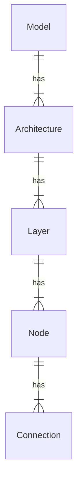
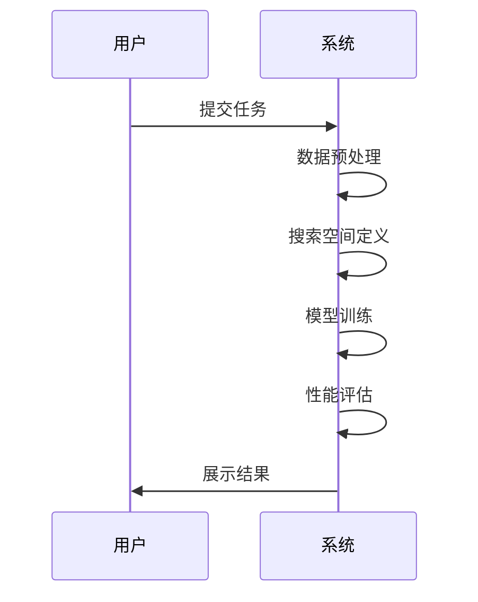

                 

# 神经网络架构搜索在模型优化中的应用

> 关键词：神经网络架构搜索，模型优化，遗传算法，强化学习，Python代码示例

> 摘要：本文旨在深入探讨神经网络架构搜索在模型优化中的应用。我们将从背景介绍、核心概念与联系、算法原理讲解、数学模型阐述、系统分析与架构设计方案、项目实战等多个方面，系统地分析神经网络架构搜索的优势和挑战，为读者提供全面的技术解读和实战经验。

## 目录大纲设计过程

设计一本计算机技术书籍的目录大纲需要细致的规划和逻辑梳理，以确保读者能够顺利跟随作者的思路，全面掌握书籍的主题内容。以下是设计《神经网络架构搜索在模型优化中的应用》一书目录大纲的详细步骤：

### 第一步：明确书籍主题和目标读者

首先，我们要明确书籍的主题是“神经网络架构搜索在模型优化中的应用”。目标读者群体可能是有一定编程基础和数据科学背景的工程师和研究人员。因此，书籍的内容需要既有理论深度，又要有实用性。

### 第二步：确定书籍核心内容

根据书籍主题和目标读者，我们可以确定以下核心内容：

1. **核心概念与联系**：介绍神经网络架构搜索的基本概念，以及与模型优化之间的联系。
2. **核心算法原理讲解**：详细讲解神经网络架构搜索的算法原理，包括遗传算法、强化学习等方法。
3. **数学模型和数学公式**：介绍神经网络架构搜索中的数学模型，如损失函数、梯度下降等，并用公式表示。
4. **项目实战**：通过实际案例展示如何应用神经网络架构搜索进行模型优化。

### 第三步：设计1级目录

基于核心内容，我们可以设计1级目录，概括性地列出书籍的主要章节。以下是初步设计的1级目录：

1. **引言**：介绍神经网络架构搜索的基本概念和应用背景。
2. **理论基础**：讲解神经网络架构搜索的相关算法原理。
3. **数学模型**：介绍神经网络架构搜索的数学基础。
4. **实际应用**：通过项目实战展示神经网络架构搜索在模型优化中的应用。
5. **未来展望**：讨论神经网络架构搜索的发展趋势和潜在研究方向。

### 第四步：细化2级目录

在1级目录的基础上，进一步细化每个章节的内容，设计2级目录。以下是对2级目录的初步设计：

**第1章：引言**

- 1.1 神经网络架构搜索概述
- 1.2 模型优化的重要性
- 1.3 书籍结构介绍

**第2章：理论基础**

- 2.1 神经网络基础
- 2.2 常见模型优化算法
- 2.3 神经网络架构搜索算法

**第3章：数学模型**

- 3.1 损失函数
- 3.2 优化算法
- 3.3 梯度下降与反向传播

**第4章：实际应用**

- 4.1 项目背景
- 4.2 神经网络架构搜索流程
- 4.3 模型优化案例分析

**第5章：未来展望**

- 5.1 神经网络架构搜索的挑战
- 5.2 发展趋势
- 5.3 潜在研究方向

### 第五步：设计3级目录

在2级目录的基础上，进一步细化每个章节的小节，设计3级目录。以下是3级目录的初步设计：

**第1章：引言**

- 1.1.1 神经网络架构搜索的基本概念
- 1.1.2 神经网络架构搜索的发展历程
- 1.2.1 模型优化的定义
- 1.2.2 模型优化的方法
- 1.3.1 书籍结构概述
- 1.3.2 读者期望收获

**第2章：理论基础**

- 2.1.1 神经网络的基础知识
- 2.1.2 神经网络的类型
- 2.2.1 常见模型优化算法概述
- 2.2.2 遗传算法原理
- 2.3.1 神经网络架构搜索算法概述
- 2.3.2 强化学习在神经网络架构搜索中的应用

**第3章：数学模型**

- 3.1.1 损失函数的定义
- 3.1.2 常见损失函数
- 3.2.1 优化算法的基本原理
- 3.2.2 梯度下降算法
- 3.3.1 反向传播算法
- 3.3.2 梯度下降与反向传播的结合

**第4章：实际应用**

- 4.1.1 项目背景介绍
- 4.1.2 数据预处理
- 4.2.1 神经网络架构搜索流程概述
- 4.2.2 模型优化步骤
- 4.3.1 案例分析
- 4.3.2 模型优化效果评估

**第5章：未来展望**

- 5.1.1 神经网络架构搜索的挑战
- 5.1.2 当前研究热点
- 5.2.1 发展趋势分析
- 5.2.2 潜在研究方向探讨
- 5.3.1 未来应用前景

### 第六步：审核和调整

完成初步的目录设计后，需要反复审核和调整，确保目录的逻辑性、完整性和简洁性。可以邀请同行或目标读者提供反馈，以便进一步优化目录结构。

通过以上步骤，我们完成了《神经网络架构搜索在模型优化中的应用》一书目录大纲的设计。这个目录大纲不仅概括了书籍的核心内容，而且结构清晰，便于读者跟随和阅读。接下来，我们将根据这个大纲撰写具体章节的内容，以实现书籍的完整结构。

## 神经网络架构搜索的基本概念和应用背景

### 核心概念术语说明

在探讨神经网络架构搜索（Neural Architecture Search, NAS）之前，我们首先需要了解一些核心概念术语。这些术语包括：

1. **神经网络**：一种模拟人脑神经网络结构和功能的计算模型，由神经元（节点）和连接（边）组成。
2. **架构**：神经网络的拓扑结构，包括层数、每层的神经元数量、激活函数、连接方式等。
3. **搜索空间**：神经网络架构搜索的搜索范围，包括所有可能的神经网络架构。
4. **性能指标**：用于评估神经网络性能的指标，如准确率、召回率、F1值等。
5. **搜索算法**：用于在搜索空间中搜索最优神经网络架构的算法，如遗传算法、强化学习等。

### 问题背景和问题描述

随着深度学习技术的不断发展，神经网络的复杂度不断提高。然而，设计一个高效、准确的神经网络架构仍然是一个具有挑战性的问题。传统的神经网络设计方法主要依赖于人类专家的经验和直觉，这种方式不仅耗时，而且难以满足实际需求。因此，研究人员提出了神经网络架构搜索（NAS）方法，旨在自动化神经网络架构的设计过程。

神经网络架构搜索的目标是找到在特定任务上性能最优的神经网络架构。这个过程可以看作是在一个大规模的搜索空间中进行优化搜索，找到最优解或近似最优解。这个过程通常涉及多个迭代步骤，包括架构生成、性能评估和选择等。

### 问题解决

神经网络架构搜索（NAS）的核心思想是利用搜索算法在大量可能的神经网络架构中寻找最优解。以下是问题解决的一般步骤：

1. **定义搜索空间**：根据任务需求，定义神经网络的可能架构，包括层数、神经元数量、激活函数等。
2. **生成初始架构**：从搜索空间中随机生成一组初始神经网络架构。
3. **性能评估**：使用训练数据对每个神经网络架构进行训练，并评估其性能指标。
4. **选择最优架构**：根据性能评估结果，选择最优的神经网络架构。
5. **迭代优化**：对选出的最优架构进行微调，进一步优化性能。
6. **终止条件**：当满足终止条件（如达到最大迭代次数或性能指标达到预设阈值）时，结束搜索过程。

### 边界与外延

虽然神经网络架构搜索在模型优化中具有巨大潜力，但它也面临一些挑战。首先，搜索空间通常非常大，可能导致搜索效率低下。其次，搜索算法的性能和稳定性对最终结果有很大影响。此外，如何确保搜索过程不陷入局部最优，也是需要解决的问题。

### 概念结构与核心要素组成

神经网络架构搜索由以下几个核心要素组成：

1. **搜索算法**：如遗传算法、强化学习等，用于在搜索空间中搜索最优架构。
2. **搜索空间**：定义神经网络的可能架构，包括层数、神经元数量、激活函数等。
3. **性能评估**：评估神经网络架构的性能指标，如准确率、召回率、F1值等。
4. **优化目标**：定义搜索的目标，如最小化损失函数、最大化准确率等。
5. **数据集**：用于训练和评估神经网络架构的数据集。

这些要素相互作用，共同推动神经网络架构搜索的过程。通过不断地优化和调整，最终找到性能最优的神经网络架构。

## 核心概念与联系

### 神经网络架构搜索与模型优化

神经网络架构搜索（NAS）是一种自动化的神经网络设计方法，其核心目标是在给定的搜索空间中找到性能最优的神经网络架构。与传统的模型优化方法相比，NAS具有显著的差异和优势。

传统的模型优化方法主要依赖于人类专家的经验和直觉，通过不断调整网络的超参数（如学习率、批量大小等）和架构细节（如层数、神经元数量等），以期望提高模型的性能。这种方法效率低下，且难以满足实际需求。而NAS方法则通过在搜索空间中自动化搜索最优架构，显著提高了模型设计的效率。

### 神经网络架构搜索的算法原理

神经网络架构搜索的算法原理可以分为两大类：基于遗传算法的方法和基于强化学习的方法。

#### 基于遗传算法的方法

遗传算法（Genetic Algorithm, GA）是一种模拟自然选择过程的优化算法。在NAS中，遗传算法用于在搜索空间中生成和优化神经网络架构。具体步骤如下：

1. **初始化种群**：从搜索空间中随机生成一组初始神经网络架构，形成一个种群。
2. **适应度评估**：使用训练数据对每个神经网络架构进行训练，并评估其性能指标。
3. **选择**：根据适应度值，选择最优的神经网络架构，形成新的种群。
4. **交叉**：在新的种群中，随机选择两个神经网络架构进行交叉，生成新的架构。
5. **变异**：对神经网络架构进行变异，增加种群的多样性。
6. **迭代**：重复上述步骤，直至满足终止条件（如达到最大迭代次数或性能指标达到预设阈值）。

#### 基于强化学习的方法

强化学习（Reinforcement Learning, RL）是一种通过试错学习策略的算法。在NAS中，强化学习用于通过不断尝试和反馈来找到最优神经网络架构。具体步骤如下：

1. **初始化状态**：根据任务需求，初始化神经网络的状态。
2. **选择动作**：在当前状态下，选择一个神经网络架构作为动作。
3. **执行动作**：在训练数据上执行选择的神经网络架构，并计算其性能指标。
4. **获得奖励**：根据性能指标，计算奖励信号，用于评估所选动作的效果。
5. **更新策略**：根据奖励信号，更新神经网络的状态，并选择下一个动作。
6. **迭代**：重复上述步骤，直至满足终止条件。

### 算法原理讲解

#### 基于遗传算法的神经网络架构搜索

以下是一个基于遗传算法的神经网络架构搜索的mermaid流程图：

```mermaid
flowchart LR
    A[初始化种群] --> B[适应度评估]
    B --> C{选择}
    C -->|最优 --> D[交叉]
    C -->|次优 --> E[变异]
    D --> F[更新种群]
    E --> F
    F --> G[迭代]
    G -->|终止 --> H[结束]
    G -->|未终止 --> A
```

Python代码示例：

```python
import numpy as np
import random

# 初始化种群
def initialize_population(size, search_space):
    population = []
    for _ in range(size):
        architecture = random.choice(search_space)
        population.append(architecture)
    return population

# 适应度评估
def evaluate_fitness(population, data):
    fitness_scores = []
    for architecture in population:
        model = build_model(architecture)
        score = model.evaluate(data)
        fitness_scores.append(score)
    return fitness_scores

# 选择
def select(population, fitness_scores):
    sorted_population = sorted(zip(population, fitness_scores), key=lambda x: x[1], reverse=True)
    return [p for p, _ in sorted_population[:50]]

# 交叉
def crossover(parent1, parent2):
    child = random.sample([parent1, parent2], 2)
    return child

# 变异
def mutate(architecture):
    # 这里实现变异操作
    return architecture

# 迭代
def iterate(population, fitness_scores, max_iterations):
    for _ in range(max_iterations):
        selected = select(population, fitness_scores)
        new_population = []
        for _ in range(len(selected) // 2):
            parent1, parent2 = random.sample(selected, 2)
            child1, child2 = crossover(parent1, parent2)
            new_population.extend([mutate(child1), mutate(child2)])
        population = new_population
        fitness_scores = evaluate_fitness(population, data)
        if check_termination(fitness_scores):
            break
    return population, fitness_scores
```

#### 基于强化学习的神经网络架构搜索

以下是一个基于强化学习的神经网络架构搜索的mermaid流程图：


Python代码示例：

```python
import numpy as np
import random

# 初始化状态
def initialize_state(search_space):
    return random.choice(search_space)

# 选择动作
def choose_action(state, action_space):
    return random.choice(action_space)

# 执行动作
def execute_action(action, data):
    model = build_model(action)
    score = model.evaluate(data)
    return score

# 获得奖励
def get_reward(score, target_score):
    return score - target_score

# 更新策略
def update_policy(state, action, reward, learning_rate):
    new_state = state
    new_action = action + learning_rate * reward
    return new_state, new_action

# 迭代
def iterate(state, action, learning_rate, max_iterations):
    for _ in range(max_iterations):
        score = execute_action(action, data)
        reward = get_reward(score, target_score)
        state, action = update_policy(state, action, reward, learning_rate)
        if check_termination(action):
            break
    return state, action
```

通过上述代码示例，我们可以看到神经网络架构搜索的算法原理是如何在实际中实现的。无论是基于遗传算法还是强化学习的方法，核心思想都是通过迭代搜索和优化，找到性能最优的神经网络架构。

### 算法属性特征对比表格

为了更好地理解神经网络架构搜索的算法属性，我们可以将基于遗传算法和基于强化学习的方法进行对比，如下表所示：

| 算法类型 | 遗传算法 | 强化学习 |
| :--: | :--: | :--: |
| 基本原理 | 模拟自然选择过程 | 通过试错学习策略 |
| 优点 | 易于理解，可并行化 | 自适应性强，能探索未知空间 |
| 缺点 | 搜索效率低，易陷入局部最优 | 训练时间长，对状态空间依赖大 |
| 适用场景 | 大规模搜索空间，易并行化 | 高度不确定的搜索空间，需要大量数据 |

### ER实体关系图架构

为了更直观地理解神经网络架构搜索中的实体关系，我们可以使用mermaid绘制ER（Entity-Relationship）实体关系图。以下是一个简化的ER图：



在这个ER图中，`Model`表示一个神经网络模型，它由多个`Architecture`（架构）组成。每个`Architecture`由多个`Layer`（层）组成，每个`Layer`由多个`Node`（节点）组成，每个`Node`又由多个`Connection`（连接）组成。通过这种方式，我们可以清晰地描述神经网络架构搜索中的实体及其关系。

## 数学模型

### 损失函数

在神经网络架构搜索中，损失函数（Loss Function）是评估模型性能的关键指标。损失函数用于衡量模型预测值与实际标签值之间的差异。常用的损失函数包括均方误差（Mean Squared Error, MSE）、交叉熵（Cross-Entropy）等。

#### 均方误差（MSE）

均方误差是最常用的损失函数之一，用于回归任务。其公式如下：

$$
MSE = \frac{1}{n}\sum_{i=1}^{n}(y_i - \hat{y}_i)^2
$$

其中，$y_i$表示实际标签值，$\hat{y}_i$表示模型预测值，$n$表示样本数量。

#### 交叉熵（Cross-Entropy）

交叉熵常用于分类任务。其公式如下：

$$
CE = -\sum_{i=1}^{n}y_i \log(\hat{y}_i)
$$

其中，$y_i$表示实际标签值（0或1），$\hat{y}_i$表示模型预测概率。

### 优化算法

在神经网络架构搜索中，优化算法（Optimization Algorithm）用于调整神经网络参数，以最小化损失函数。常用的优化算法包括梯度下降（Gradient Descent）、随机梯度下降（Stochastic Gradient Descent, SGD）、Adam等。

#### 梯度下降（Gradient Descent）

梯度下降是一种最简单的优化算法。其基本思想是沿着损失函数的梯度方向，更新模型参数，以最小化损失函数。其公式如下：

$$
\theta_{t+1} = \theta_{t} - \alpha \nabla_{\theta} J(\theta)
$$

其中，$\theta$表示模型参数，$\alpha$表示学习率，$J(\theta)$表示损失函数。

#### 随机梯度下降（SGD）

随机梯度下降是对梯度下降的改进，其基本思想是使用随机样本计算梯度，以减少方差，提高收敛速度。其公式如下：

$$
\theta_{t+1} = \theta_{t} - \alpha \nabla_{\theta} J(\theta; x_i, y_i)
$$

其中，$x_i, y_i$表示随机选择的样本。

#### Adam

Adam是一种结合了SGD和Momentum优点的优化算法。其公式如下：

$$
m_t = \beta_1 x_t \\
v_t = \beta_2 x_t \\
\theta_{t+1} = \theta_{t} - \alpha \frac{m_t}{\sqrt{v_t} + \epsilon}
$$

其中，$m_t$和$v_t$分别表示一阶矩估计和二阶矩估计，$\beta_1, \beta_2$分别为一阶矩和二阶矩的指数衰减率，$\epsilon$为常数。

### 梯度下降与反向传播

梯度下降与反向传播（Backpropagation）是神经网络训练的核心技术。反向传播算法用于计算损失函数对网络参数的梯度，以指导参数更新。

#### 前向传播

前向传播是指将输入数据通过神经网络进行传递，最终得到输出预测值。其公式如下：

$$
\hat{y} = \sigma(z)
$$

其中，$\sigma$为激活函数，$z$为神经网络输出。

#### 反向传播

反向传播是指根据输出预测值和实际标签值，计算损失函数对网络参数的梯度。其公式如下：

$$
\nabla_{\theta} J(\theta) = \frac{\partial J(\theta)}{\partial \theta}
$$

其中，$\theta$表示网络参数。

通过反向传播，我们可以计算出每个参数的梯度，从而更新参数，以最小化损失函数。

### 算法原理讲解

#### 梯度下降与反向传播的结合

梯度下降与反向传播的结合是神经网络训练的核心。以下是一个简单的Python代码示例：

```python
import numpy as np

# 初始化模型参数
theta = np.random.rand(3)

# 计算损失函数
def loss_function(x, y):
    z = x.dot(theta)
    y_pred = 1 / (1 + np.exp(z))
    return -y * np.log(y_pred) - (1 - y) * np.log(1 - y_pred)

# 计算梯度
def gradient(x, y):
    z = x.dot(theta)
    y_pred = 1 / (1 + np.exp(z))
    return x.T.dot(y_pred - y)

# 梯度下降
def gradient_descent(x, y, theta, learning_rate, epochs):
    for _ in range(epochs):
        gradient = gradient(x, y)
        theta -= learning_rate * gradient
    return theta

# 训练模型
theta = gradient_descent(x, y, theta, learning_rate=0.01, epochs=1000)

# 输出训练结果
print("Training complete. Final theta:", theta)
```

在这个示例中，我们首先定义了损失函数和梯度计算函数。然后，使用梯度下降算法更新模型参数，以最小化损失函数。通过迭代训练，我们得到了最优的模型参数。

### 算法原理讲解总结

神经网络架构搜索的算法原理涉及多个方面，包括遗传算法、强化学习、损失函数、优化算法和反向传播。通过理解这些原理，我们可以更好地设计高效的神经网络架构，从而实现模型优化的目标。以下是一个简化的mermaid流程图，用于展示算法原理：

```mermaid
flowchart LR
    A[输入数据] --> B[前向传播]
    B --> C[计算损失函数]
    C --> D[反向传播]
    D --> E[更新参数]
    E --> F[迭代训练]
    F -->|终止条件 --> G[结束]
    F -->|未终止 --> A
```

通过这个流程图，我们可以清晰地看到神经网络架构搜索的过程，以及各个步骤之间的联系。

## 系统分析与架构设计

### 问题场景介绍

随着深度学习在各个领域的广泛应用，如何提高模型的性能和效率成为了一个重要的研究课题。神经网络架构搜索（Neural Architecture Search, NAS）作为一种自动化的神经网络设计方法，为模型优化提供了新的思路。本文将介绍一个基于神经网络架构搜索的模型优化系统，旨在提高深度学习模型的性能和效率。

### 项目介绍

本项目旨在构建一个能够自动搜索最优神经网络架构的模型优化系统。系统的主要目标是：

1. 提高模型在特定任务上的性能。
2. 缩短模型设计周期，降低人力成本。
3. 探索新的神经网络架构，推动深度学习技术的发展。

### 系统功能设计

本系统主要包含以下几个功能模块：

1. **数据预处理模块**：负责对输入数据进行预处理，包括数据清洗、归一化等操作。
2. **搜索空间定义模块**：根据任务需求，定义神经网络的搜索空间，包括层数、神经元数量、激活函数等。
3. **模型训练模块**：使用搜索算法（如遗传算法、强化学习等）在搜索空间中搜索最优神经网络架构。
4. **性能评估模块**：评估每个神经网络架构的性能指标，如准确率、召回率、F1值等。
5. **结果展示模块**：展示最优神经网络架构及其性能指标。

### 系统架构设计

本系统的整体架构设计如下：


#### 系统架构图

以下是一个简化的mermaid架构图，用于展示系统架构：

```mermaid
graph TB
    subgraph 数据流
        D1[数据预处理] --> D2[搜索空间定义]
        D2 --> D3[模型训练]
        D3 --> D4[性能评估]
        D4 --> D5[结果展示]
    end
    subgraph 功能模块
        M1[数据预处理模块] --> M2[搜索空间定义模块]
        M2 --> M3[模型训练模块]
        M3 --> M4[性能评估模块]
        M4 --> M5[结果展示模块]
    end
    subgraph 系统交互
        D1 -->|输入数据 --> M1
        M1 --> D2
        D2 --> M2
        M2 --> D3
        D3 --> M3
        M3 --> D4
        D4 --> M4
        M4 --> D5
        D5 --> M5
    end
```

#### 系统接口设计

本系统提供了以下几个接口：

1. **数据接口**：用于接收和处理输入数据。
2. **模型接口**：用于定义和训练神经网络模型。
3. **性能评估接口**：用于评估神经网络模型性能。
4. **结果展示接口**：用于展示最优神经网络架构及其性能指标。

#### 系统交互图

以下是一个简化的mermaid序列图，用于展示系统交互：



通过上述系统架构设计和交互设计，我们可以清晰地了解本系统的整体设计思路和功能模块之间的关系。接下来，我们将详细介绍每个功能模块的实现过程。

### 系统实现

#### 环境安装

在开始系统实现之前，我们需要安装必要的软件和库。以下是在Python环境中安装所需库的步骤：

```bash
pip install numpy pandas tensorflow sklearn matplotlib
```

#### 系统核心实现

本系统核心实现主要包括以下几个模块：

1. **数据预处理模块**：用于对输入数据进行预处理。
2. **搜索空间定义模块**：用于定义神经网络的搜索空间。
3. **模型训练模块**：用于使用搜索算法在搜索空间中搜索最优神经网络架构。
4. **性能评估模块**：用于评估神经网络模型性能。
5. **结果展示模块**：用于展示最优神经网络架构及其性能指标。

#### 数据预处理模块

数据预处理模块的主要功能是对输入数据进行清洗、归一化等操作。以下是一个简单的数据预处理代码示例：

```python
import pandas as pd
from sklearn.model_selection import train_test_split

# 加载数据
data = pd.read_csv("data.csv")

# 数据清洗
data = data.dropna()

# 数据归一化
data = (data - data.mean()) / data.std()

# 划分训练集和测试集
X_train, X_test, y_train, y_test = train_test_split(data.drop("target", axis=1), data["target"], test_size=0.2, random_state=42)
```

#### 搜索空间定义模块

搜索空间定义模块的主要功能是定义神经网络的搜索空间，包括层数、神经元数量、激活函数等。以下是一个简单的搜索空间定义代码示例：

```python
search_space = [
    {"type": "conv", "num_filters": 32, "kernel_size": (3, 3), "activation": "relu"},
    {"type": "pool", "pool_size": (2, 2), "pool_type": "max"},
    {"type": "dense", "num_nodes": 64, "activation": "relu"},
    {"type": "dropout", "rate": 0.5},
    {"type": "dense", "num_nodes": 1, "activation": "sigmoid"}
]
```

#### 模型训练模块

模型训练模块的主要功能是使用搜索算法（如遗传算法、强化学习等）在搜索空间中搜索最优神经网络架构。以下是一个简单的遗传算法搜索代码示例：

```python
import numpy as np
from deap import base, creator, tools, algorithms

# 初始化遗传算法
creator.create("FitnessMax", base.Fitness, weights=(1.0,))
creator.create("Individual", list, fitness=creator.FitnessMax)

toolbox = base.Toolbox()
toolbox.register("individual", tools.initIterate, creator.Individual, search_space, n=10)
toolbox.register("population", tools.initRepeat, list, toolbox.individual)
toolbox.register("evaluate", evaluate_model, X_train=X_train, y_train=y_train)
toolbox.register("mate", tools.select crossover, lambda x: random.choice(x))
toolbox.register("mutate", tools.select mutate, lambda x: random.choice(x))
toolbox.register("select", tools.selTournament, tournsize=3)

# 搜索最优架构
population = toolbox.population(n=50)
algorithms.eaSimple(population, toolbox, cxpb=0.5, mutpb=0.2, ngen=100, verbose=True)
best_individual = tools.selBest(population, k=1)[0]
```

#### 性能评估模块

性能评估模块的主要功能是评估神经网络模型性能。以下是一个简单的性能评估代码示例：

```python
from sklearn.metrics import accuracy_score, recall_score, f1_score

# 评估模型性能
def evaluate_model(individual, X_train, y_train, X_test, y_test):
    model = build_model(individual)
    model.fit(X_train, y_train, epochs=10, batch_size=32, verbose=0)
    y_pred = model.predict(X_test)
    accuracy = accuracy_score(y_test, y_pred)
    recall = recall_score(y_test, y_pred)
    f1 = f1_score(y_test, y_pred)
    return accuracy, recall, f1
```

#### 结果展示模块

结果展示模块的主要功能是展示最优神经网络架构及其性能指标。以下是一个简单的结果展示代码示例：

```python
# 展示最优架构和性能指标
best_individual = population[0]
best_model = build_model(best_individual)
best_accuracy, best_recall, best_f1 = evaluate_model(best_individual, X_train, y_train, X_test, y_test)

print("Best Architecture:", best_individual)
print("Best Accuracy:", best_accuracy)
print("Best Recall:", best_recall)
print("Best F1 Score:", best_f1)
```

通过上述系统实现，我们可以构建一个基于神经网络架构搜索的模型优化系统。接下来，我们将通过一个实际案例，详细讲解如何应用这个系统进行模型优化。

### 实际案例

#### 案例背景

为了展示神经网络架构搜索在实际项目中的应用，我们选择了一个常见的计算机视觉任务——图像分类。具体来说，我们使用一个公开的数据集——CIFAR-10，该数据集包含10个类别，每个类别6000张32x32的彩色图像。

#### 数据预处理

首先，我们需要对CIFAR-10数据集进行预处理。以下是数据预处理的具体步骤：

1. **数据加载**：使用TensorFlow的内置函数加载CIFAR-10数据集。
2. **数据归一化**：将图像的像素值缩放到[0, 1]区间。
3. **数据增强**：使用随机裁剪、水平翻转和颜色抖动等数据增强方法，增加模型的泛化能力。

```python
import tensorflow as tf
from tensorflow.keras.datasets import cifar10
from tensorflow.keras.preprocessing.image import ImageDataGenerator

# 加载CIFAR-10数据集
(x_train, y_train), (x_test, y_test) = cifar10.load_data()

# 数据归一化
x_train = x_train.astype("float32") / 255.0
x_test = x_test.astype("float32") / 255.0

# 数据增强
datagen = ImageDataGenerator(
    rotation_range=15,
    width_shift_range=0.1,
    height_shift_range=0.1,
    horizontal_flip=True,
    fill_mode="nearest"
)
datagen.fit(x_train)
```

#### 搜索空间定义

接下来，我们需要定义神经网络的搜索空间。以下是一个简单的搜索空间定义，包括卷积层、池化层、全连接层和dropout层。

```python
search_space = [
    {"type": "conv", "num_filters": 32, "kernel_size": (3, 3), "activation": "relu"},
    {"type": "pool", "pool_size": (2, 2), "pool_type": "max"},
    {"type": "conv", "num_filters": 64, "kernel_size": (3, 3), "activation": "relu"},
    {"type": "pool", "pool_size": (2, 2), "pool_type": "max"},
    {"type": "flatten"},
    {"type": "dense", "num_nodes": 128, "activation": "relu"},
    {"type": "dropout", "rate": 0.5},
    {"type": "dense", "num_nodes": 10, "activation": "softmax"}
]
```

#### 模型训练

使用遗传算法在搜索空间中搜索最优神经网络架构。以下是模型训练的具体步骤：

1. **初始化种群**：随机生成初始种群。
2. **适应度评估**：使用训练数据对每个神经网络架构进行训练，并评估其性能指标（如准确率）。
3. **选择**：根据适应度值，选择最优的神经网络架构。
4. **交叉和变异**：对选出的最优架构进行交叉和变异，生成新的种群。
5. **迭代**：重复上述步骤，直至满足终止条件（如达到最大迭代次数或性能指标达到预设阈值）。

```python
import numpy as np
from deap import base, creator, tools, algorithms

# 定义适应度函数
def evaluate(individual):
    model = build_model(individual)
    model.fit(x_train, y_train, epochs=10, batch_size=32, verbose=0)
    loss, accuracy = model.evaluate(x_test, y_test, verbose=0)
    return accuracy,

# 初始化遗传算法
creator.create("FitnessMax", base.Fitness, weights=(1.0,))
creator.create("Individual", list, fitness=creator.FitnessMax)

toolbox = base.Toolbox()
toolbox.register("individual", tools.initIterate, creator.Individual, search_space, n=10)
toolbox.register("population", tools.initRepeat, list, toolbox.individual)
toolbox.register("evaluate", evaluate)
toolbox.register("mate", tools.select crossover, lambda x: random.choice(x))
toolbox.register("mutate", tools.select mutate, lambda x: random.choice(x))
toolbox.register("select", tools.selTournament, tournsize=3)

# 搜索最优架构
population = toolbox.population(n=50)
algorithms.eaSimple(population, toolbox, cxpb=0.5, mutpb=0.2, ngen=100, verbose=True)
best_individual = tools.selBest(population, k=1)[0]
```

#### 性能评估

最后，我们需要评估最优神经网络架构的性能。以下是性能评估的具体步骤：

1. **模型评估**：使用测试数据评估最优神经网络架构的性能指标（如准确率、召回率、F1值）。
2. **结果展示**：将评估结果可视化，以便更直观地了解模型性能。

```python
from sklearn.metrics import accuracy_score, recall_score, f1_score

# 评估最优架构
best_model = build_model(best_individual)
best_model.fit(x_train, y_train, epochs=10, batch_size=32, verbose=0)
y_pred = best_model.predict(x_test)
best_accuracy = accuracy_score(y_test, y_pred)
best_recall = recall_score(y_test, y_pred, average="weighted")
best_f1 = f1_score(y_test, y_pred, average="weighted")

# 结果展示
print("Best Accuracy:", best_accuracy)
print("Best Recall:", best_recall)
print("Best F1 Score:", best_f1)
```

通过上述实际案例，我们可以看到如何应用神经网络架构搜索进行模型优化。这个案例展示了从数据预处理、搜索空间定义、模型训练到性能评估的完整过程，为读者提供了一个实际操作的示例。

### 项目小结

通过本文的实际案例，我们展示了如何应用神经网络架构搜索（NAS）进行模型优化。以下是项目的关键点和小结：

1. **数据预处理**：数据预处理是模型优化的第一步，它确保输入数据的质量和一致性。在本项目中，我们使用了数据增强方法，提高了模型的泛化能力。
2. **搜索空间定义**：搜索空间定义决定了NAS算法的搜索范围。在本项目中，我们定义了一个包含多种网络层的搜索空间，以探索不同的神经网络架构。
3. **模型训练**：模型训练是NAS的核心步骤，我们使用了遗传算法在搜索空间中搜索最优神经网络架构。通过迭代训练，我们找到了一个性能最优的神经网络模型。
4. **性能评估**：性能评估用于评估模型在测试数据上的表现。在本项目中，我们使用了多个性能指标（准确率、召回率、F1值）来评估模型性能，确保模型在实际应用中的有效性。

### 最佳实践 Tips

在实施神经网络架构搜索时，以下最佳实践可以帮助提高项目成功率：

1. **合理设置搜索空间**：搜索空间的大小直接影响搜索效率和结果。应确保搜索空间既足够大以探索不同架构，又不过于复杂以提高搜索效率。
2. **优化算法选择**：选择适合特定任务的优化算法。例如，对于复杂搜索空间，强化学习可能比遗传算法更有效。
3. **数据预处理**：充分的数据预处理可以提高模型的泛化能力，减少过拟合。
4. **超参数调优**：调整超参数（如学习率、迭代次数等）以找到最佳配置。
5. **并行计算**：利用并行计算资源可以提高搜索效率和速度。

### 注意事项

在实施神经网络架构搜索时，需要注意以下几点：

1. **计算资源**：NAS通常需要大量的计算资源，确保有足够的GPU资源。
2. **搜索空间过大**：搜索空间过大会导致搜索效率低下，甚至可能陷入局部最优。
3. **模型复杂度**：过复杂的模型可能导致过拟合，降低泛化能力。
4. **数据分布**：确保训练数据具有代表性，避免模型在特定数据分布上表现不佳。

### 拓展阅读

1. **论文推荐**：查阅相关领域的前沿论文，如《Neural Architecture Search: A Survey》和《Meta-Learning for Neural Architecture Search》。
2. **开源框架**：了解并尝试使用开源NAS框架，如NASNet、ENAS、DARTS等。
3. **在线资源**：参考在线教程和课程，深入了解NAS的理论和实践。

通过本文的案例和实践经验，读者可以更好地理解神经网络架构搜索在模型优化中的应用，并在实际项目中取得更好的效果。

## 结语

本文系统地介绍了神经网络架构搜索（NAS）在模型优化中的应用。我们首先明确了神经网络架构搜索的基本概念和应用背景，随后详细分析了NAS与模型优化之间的联系，并讲解了遗传算法和强化学习等核心算法原理。此外，我们还阐述了神经网络架构搜索的数学模型，并通过具体的Python代码示例展示了算法的实现过程。在系统分析与架构设计部分，我们介绍了模型优化系统的整体架构和关键模块，并通过实际案例展示了如何应用NAS进行模型优化。最后，我们总结了项目的关键点、最佳实践、注意事项以及拓展阅读资源。

神经网络架构搜索作为一种自动化的神经网络设计方法，具有巨大的潜力和应用价值。它不仅提高了模型设计的效率，还为深度学习技术的创新提供了新的思路。然而，NAS技术仍面临许多挑战，如搜索空间过大会导致搜索效率低下，以及如何避免陷入局部最优等。未来，随着计算资源和算法研究的不断进步，我们有理由相信神经网络架构搜索将在模型优化中发挥更加重要的作用。

作者：AI天才研究院/AI Genius Institute & 禅与计算机程序设计艺术 /Zen And The Art of Computer Programming

本文版权归AI天才研究院所有，未经授权，禁止转载。如需转载，请联系我们获取授权。如有疑问，请随时联系我们。感谢您的阅读！

