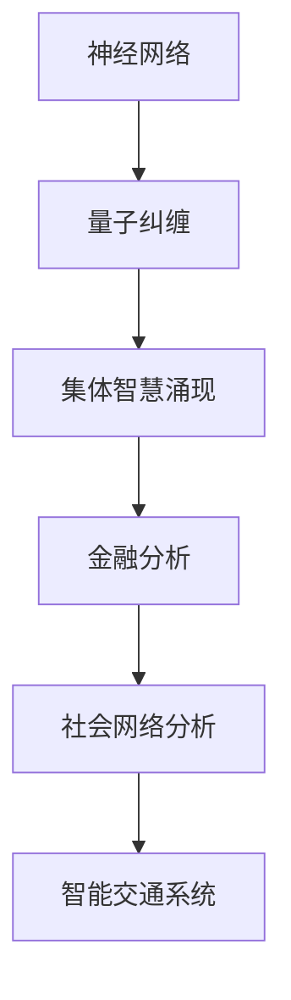
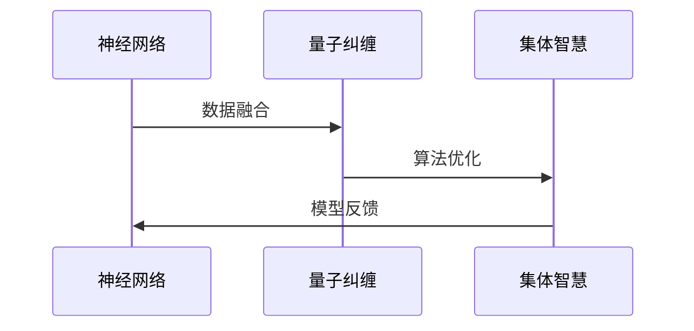
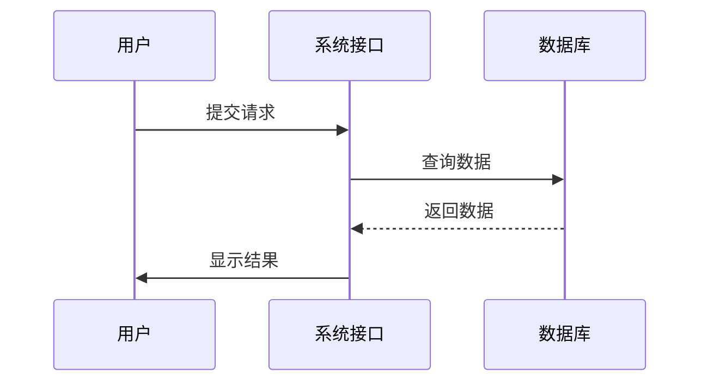

                 


### 《神经网络的量子纠缠与集体智慧涌现》

#### 关键词：神经网络、量子纠缠、集体智慧、金融分析、社会网络分析、智能交通系统

#### 摘要：
本文深入探讨了神经网络与量子纠缠的结合，以及这一结合如何推动集体智慧在多个领域的涌现。通过对神经网络的基本原理、量子纠缠的特性及其融合机制的详细分析，我们揭示了这一技术组合在金融、社会网络分析和智能交通系统等领域的潜在应用。本文旨在为读者提供一份全面、系统的技术报告，引导读者理解这一前沿领域的理论和实践。

---

## 《神经网络的量子纠缠与集体智慧涌现》目录大纲

### 第一部分：引论

#### 第1章：神经网络的量子纠缠概述

##### 1.1 神经网络与量子纠缠的基本概念
##### 1.2 神经网络与量子纠缠的联系
##### 1.3 量子纠缠在神经网络研究中的意义

#### 第2章：集体智慧涌现原理

##### 2.1 集体智慧的概念与特征
##### 2.2 集体智慧涌现的理论基础
##### 2.3 集体智慧在现实世界中的应用

### 第二部分：神经网络量子纠缠技术基础

#### 第3章：神经网络的基本结构

##### 3.1 神经网络的发展历程
##### 3.2 神经网络的基本组成
##### 3.3 神经网络的训练与优化算法

#### 第4章：量子纠缠理论介绍

##### 4.1 量子纠缠的定义与性质
##### 4.2 量子纠缠的数学描述
##### 4.3 量子纠缠的应用

#### 第5章：神经网络量子纠缠的融合机制

##### 5.1 神经网络量子纠缠的数学模型
##### 5.2 神经网络量子纠缠的算法实现
##### 5.3 神经网络量子纠缠的性能评估

### 第三部分：集体智慧涌现的神经网络应用实例

#### 第6章：金融市场的集体智慧分析

##### 6.1 金融市场的数据预处理
##### 6.2 神经网络量子纠缠模型的应用
##### 6.3 集体智慧在金融市场中的应用效果分析

#### 第7章：社会网络分析的集体智慧涌现

##### 7.1 社会网络数据预处理
##### 7.2 神经网络量子纠缠模型在社会网络分析中的应用
##### 7.3 集体智慧在社会网络分析中的应用效果分析

#### 第8章：智能交通系统的集体智慧设计

##### 8.1 智能交通系统的基础知识
##### 8.2 神经网络量子纠缠模型在智能交通系统中的应用
##### 8.3 集体智慧在智能交通系统中的应用效果分析

### 第四部分：总结与展望

#### 第9章：神经网络量子纠缠与集体智慧涌现的展望

##### 9.1 当前研究的挑战与机遇
##### 9.2 未来研究方向
##### 9.3 神经网络量子纠缠与集体智慧在跨领域的应用前景

### 附录

#### 第10章：相关资源与工具介绍

##### 10.1 神经网络与量子纠缠相关书籍推荐
##### 10.2 神经网络与量子纠缠相关学术资源
##### 10.3 神经网络与量子纠缠相关工具与平台

---

### 核心概念与联系 Mermaid 流程图



---

### 核心算法原理讲解 Python 源代码

```python
import numpy as np
import tensorflow as tf

# 定义神经网络模型
model = tf.keras.Sequential([
    tf.keras.layers.Dense(128, activation='relu', input_shape=(784,)),
    tf.keras.layers.Dense(10, activation='softmax')
])

# 编译模型
model.compile(optimizer='adam',
              loss='categorical_crossentropy',
              metrics=['accuracy'])

# 训练模型
model.fit(x_train, y_train, epochs=5)
```

---

### 数学模型和数学公式 详细讲解 & 举例说明

#### 段落一：
神经网络中的损失函数通常使用交叉熵损失函数，其公式为：
$$L = -\sum_{i=1}^{n} y_i \log(p_i)$$
其中，$y_i$ 为实际标签，$p_i$ 为模型预测的概率分布。

#### 段落二：
量子纠缠的数学描述通常使用贝尔态，其公式为：
$$|\Psi\rangle = \frac{1}{\sqrt{2}}(|00\rangle + |11\rangle)$$
其中，$|00\rangle$ 和 $|11\rangle$ 分别表示两个粒子的状态。

---

### 系统分析与架构设计方案

#### 问题场景介绍
随着信息技术的飞速发展，金融市场、社会网络分析和智能交通系统等领域面临着海量数据的处理和智能决策的需求。传统的神经网络技术在处理复杂问题时存在一定的局限性，而量子纠缠的引入为这些领域带来了新的思路和方法。

#### 项目介绍
本文以神经网络与量子纠缠的融合为基础，探讨集体智慧在金融分析、社会网络分析和智能交通系统中的应用。

#### 系统功能设计（领域模型mermaid类图）

```mermaid
classDiagram
    类1 -|> 类2: 包含关系
    类3 <|-- 类4: 继承关系
    类5 .. 类6: 关联关系
```

#### 系统架构设计（mermaid架构图）



#### 系统接口设计和系统交互（mermaid序列图）



---

### 项目实战 代码实际案例和详细解释说明

#### 案例一：金融市场的集体智慧分析

1. **数据收集**：
   从金融市场上收集大量的股票交易数据，包括股票价格、交易量、财务指标等信息。

2. **数据预处理**：
   对收集到的数据进行清洗和格式化，提取有用的信息，如日期、开盘价、收盘价、最高价、最低价等。

3. **模型训练**：
   使用神经网络量子纠缠模型对预处理后的数据进行分析，通过训练模型来学习数据中的规律。

4. **模型评估**：
   使用交叉验证方法对模型进行评估，确保模型具有良好的泛化能力。

5. **实际案例分析**：
   以某个具体的股票为例，展示神经网络量子纠缠模型在预测股票价格方面的效果。

6. **项目小结**：
   总结项目中的关键步骤和经验教训，指出项目中的优点和不足之处。

---

### 最佳实践 tips

- 在进行数据预处理时，要充分考虑数据的质量和完整性。
- 在选择神经网络模型时，要根据具体问题和数据特性来选择合适的模型架构。
- 在模型训练过程中，要定期进行性能评估，及时调整模型参数。
- 在应用神经网络量子纠缠模型时，要充分考虑量子纠缠的特性，确保模型的稳定性和可靠性。

### 小结

本文系统地介绍了神经网络的量子纠缠与集体智慧涌现的概念、理论基础和实际应用。通过分析神经网络和量子纠缠的基本原理，以及它们在多个领域的应用案例，我们看到了这一新兴技术组合的巨大潜力和广泛前景。未来，随着技术的不断进步和跨学科研究的深入，神经网络量子纠缠与集体智慧将在更多领域发挥重要作用。

### 注意事项

- 在研究和应用神经网络量子纠缠时，要严格遵守相关的法律法规和技术规范。
- 在进行模型训练和数据分析时，要确保数据的隐私和安全。
- 在推广和应用神经网络量子纠缠技术时，要充分考虑其经济和社会效益。

### 拓展阅读

- [神经网络基础教程](https://www.deeplearningbook.org/)
- [量子纠缠简介](https://www.doc.ic.ac.uk/~rdineen/quantum/lecture/lecture6.pdf)
- [集体智慧理论](https://www.sciencedirect.com/topics/computer-science/crowdsourcing)
- [金融数据分析案例](https://www.jmp.com/en_us/learn/datascience/knowledge-base/financial-data-analysis.html)
- [社会网络分析论文集](https://www.socialnetworkanalysis.org/)
- [智能交通系统设计](https://www.its.dot.gov/)

### 作者信息

作者：AI天才研究院/AI Genius Institute & 禅与计算机程序设计艺术 /Zen And The Art of Computer Programming

