                 

# 《神经逻辑推理在可解释AI系统中的实现策略》

## 关键词：神经逻辑推理，可解释AI，AI系统设计，算法实现，数学模型

> 摘要：随着人工智能技术的快速发展，AI系统在各个领域的应用日益广泛。然而，AI系统的黑箱特性使得其决策过程难以解释，限制了其在一些关键领域的应用。本文将探讨神经逻辑推理在可解释AI系统中的实现策略，通过结合神经网络和逻辑推理技术，构建具有可解释性的AI系统，为人工智能的发展提供新的思路。

## 《神经逻辑推理在可解释AI系统中的实现策略》目录大纲

## 第一部分：引论

### 第1章：神经逻辑推理与可解释AI概述

- 1.1 神经逻辑推理的概念与背景
- 1.2 可解释AI的重要性
- 1.3 神经逻辑推理与可解释AI的结合意义
- 1.4 书籍结构概述

## 第二部分：神经逻辑推理基础

### 第2章：神经网络的逻辑特性

- 2.1 神经网络的基本结构
- 2.2 神经网络的学习机制
- 2.3 神经网络的逻辑表示能力
- 2.4 神经逻辑推理的基础架构

### 第3章：神经逻辑推理算法

- 3.1 基于神经网络的逻辑推理算法
- 3.2 神经逻辑推理的核心算法原理
- 3.3 Python代码实现：神经逻辑推理算法
- 3.4 数学模型与公式

### 第4章：神经逻辑推理的应用领域

- 4.1 数据挖掘与知识发现
- 4.2 自然语言处理
- 4.3 决策支持系统
- 4.4 神经逻辑推理在不同领域的应用

## 第三部分：可解释AI系统设计

### 第5章：可解释AI系统的基本概念

- 5.1 可解释AI的定义
- 5.2 可解释AI的重要性
- 5.3 可解释AI的技术手段
- 5.4 数学模型与公式

### 第6章：神经逻辑推理在可解释AI系统中的实现

- 6.1 神经逻辑推理与可解释AI的结合
- 6.2 可解释神经逻辑推理系统的设计原则
- 6.3 Python代码实现：构建可解释神经逻辑推理系统
- 6.4 数学模型与公式

### 第7章：可解释神经逻辑推理系统的评估与优化

- 7.1 评估指标
- 7.2 优化方法
- 7.3 Python代码实现：评估与优化可解释神经逻辑推理系统
- 7.4 数学模型与公式

## 第四部分：案例研究

### 第8章：案例一：医疗诊断系统

- 8.1 案例背景
- 8.2 神经逻辑推理在医疗诊断中的应用
- 8.3 可解释AI系统设计
- 8.4 代码实现与分析

### 第9章：案例二：金融风险评估

- 9.1 案例背景
- 9.2 神经逻辑推理在金融风险评估中的应用
- 9.3 可解释AI系统设计
- 9.4 代码实现与分析

### 第10章：案例三：智能客服系统

- 10.1 案例背景
- 10.2 神经逻辑推理在智能客服系统中的应用
- 10.3 可解释AI系统设计
- 10.4 代码实现与分析

## 第五部分：总结与展望

### 第11章：总结与展望

- 11.1 主要研究成果
- 11.2 存在的挑战与问题
- 11.3 未来发展方向

### 附录

- 附录A：参考文献
- 附录B：数学公式索引
- 附录C：代码实现细节与数据集

### 第一部分：引论

#### 第1章：神经逻辑推理与可解释AI概述

> **1.1 神经逻辑推理的概念与背景**

神经逻辑推理是一种结合神经网络和逻辑推理的技术，旨在通过神经网络的强大表示能力，实现逻辑推理过程。神经网络作为一种模拟人脑神经元连接的数学模型，具有强大的学习和表示能力，而逻辑推理则是一种基于逻辑规则和推理方法的思维过程。将两者结合起来，可以实现一种既具有神经网络优势，又具备逻辑推理能力的智能系统。

神经逻辑推理起源于20世纪80年代，随着神经网络理论和逻辑推理理论的不断发展，逐渐形成了一种独立的研究方向。近年来，随着人工智能技术的迅速发展，神经逻辑推理在自然语言处理、决策支持系统、数据挖掘等领域得到了广泛的应用。

> **1.2 可解释AI的重要性**

可解释AI（Explainable AI，简称XAI）是当前人工智能领域的一个热点问题。与传统“黑箱”式的AI系统不同，可解释AI旨在使AI系统的决策过程更加透明，易于人类理解和解释。这对于提高AI系统的可靠性和信任度具有重要意义。

首先，可解释AI有助于提高AI系统的可靠性。通过分析AI系统的决策过程，可以找出潜在的缺陷和错误，从而提高系统的鲁棒性和稳定性。其次，可解释AI有助于增强AI系统的透明度。在关键领域，如医疗诊断、金融风险评估等，用户和监管机构往往需要了解AI系统的决策依据和过程，以确保系统的公正性和合法性。最后，可解释AI有助于提升AI系统的可接受度。在日常生活中，人们往往更愿意接受那些易于解释和理解的技术，从而减少对AI技术的恐惧和担忧。

> **1.3 神经逻辑推理与可解释AI的结合意义**

神经逻辑推理与可解释AI的结合具有重要意义。首先，神经逻辑推理技术为可解释AI提供了强大的表示和推理能力。通过将神经网络与逻辑推理相结合，可以实现更加灵活和高效的推理过程。其次，神经逻辑推理技术有助于提高AI系统的可解释性。在神经逻辑推理系统中，逻辑推理规则和神经网络参数共同决定了系统的决策过程，这使得系统的决策过程更加透明和易于解释。

此外，神经逻辑推理与可解释AI的结合还有助于解决当前AI系统面临的一些挑战。例如，在医疗诊断和金融风险评估等关键领域，用户和监管机构往往需要对AI系统的决策过程进行严格的审查和验证。通过结合神经逻辑推理和可解释AI技术，可以提供更加详细和全面的决策依据，从而提高系统的可靠性和可接受度。

总之，神经逻辑推理与可解释AI的结合为人工智能的发展提供了新的思路和机遇。本文将围绕这一主题，探讨神经逻辑推理在可解释AI系统中的实现策略，为人工智能领域的未来发展做出贡献。

### **第二部分：神经逻辑推理基础**

#### **第2章：神经网络的逻辑特性**

**2.1 神经网络的基本结构**

神经网络是由大量人工神经元组成的计算模型，通过模拟人脑神经元之间的连接和活动，实现对复杂数据的处理和推理。一个基本的神经网络通常由以下几个部分组成：

1. **输入层（Input Layer）**：接收外部输入数据，每个神经元对应一个输入特征。
2. **隐藏层（Hidden Layers）**：对输入数据进行处理和变换，可以有一个或多个隐藏层。
3. **输出层（Output Layer）**：产生最终的输出结果，用于决策或预测。

神经元之间的连接通过权重（weights）来表示，每个连接都有相应的权重值。在训练过程中，神经网络通过调整这些权重值，使得网络能够更好地拟合训练数据。

**2.2 神经网络的学习机制**

神经网络通过以下两个主要步骤进行学习：

1. **前向传播（Forward Propagation）**：输入数据从输入层经过隐藏层，最终到达输出层，每个神经元的输出值通过激活函数（activation function）计算得到。
2. **反向传播（Backpropagation）**：根据输出层的误差，反向传播误差到隐藏层和输入层，通过梯度下降法（Gradient Descent）调整权重值，以减少误差。

**2.3 神经网络的逻辑表示能力**

神经网络不仅具有强大的数值处理能力，还可以表示和执行逻辑运算。通过选择合适的激活函数，神经网络可以实现逻辑门的功能：

1. **逻辑与（AND）**：输入为1和1时，输出为1，其他情况下输出为0。
   $$ f(x_1, x_2) = \max(0, x_1 + x_2 - 1) $$
2. **逻辑或（OR）**：输入为1或1时，输出为1，其他情况下输出为0。
   $$ f(x_1, x_2) = \max(0, x_1 + x_2) $$
3. **逻辑非（NOT）**：输入为1时，输出为0，输入为0时，输出为1。
   $$ f(x) = \max(0, 1 - x) $$

**2.4 神经逻辑推理的基础架构**

为了实现神经逻辑推理，我们可以设计一个具有逻辑表示能力的神经网络结构，如图2-1所示：

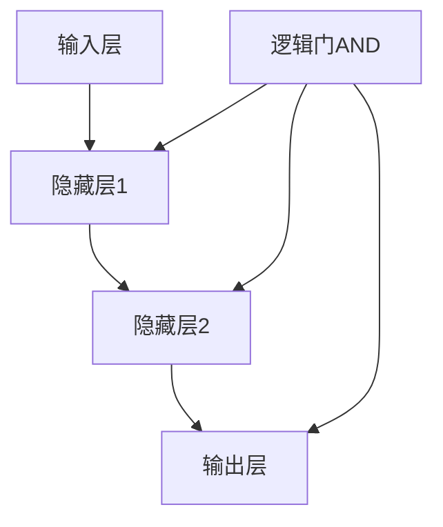

在这个结构中，逻辑门AND（E）与神经网络中的隐藏层和输出层相连，通过逻辑门和神经网络的共同作用，实现逻辑推理功能。逻辑门AND的输入为神经网络中相应层的输出，输出为逻辑与运算的结果。

通过上述基础架构，我们可以构建一个具有逻辑推理能力的神经网络，为后续章节中的神经逻辑推理算法设计和实现奠定基础。

### **第三部分：神经逻辑推理算法**

#### **第3章：神经逻辑推理算法**

**3.1 基于神经网络的逻辑推理算法**

神经逻辑推理算法是基于神经网络实现的逻辑推理方法。其核心思想是通过神经网络的学习和推理过程，实现对逻辑命题的推理和验证。以下是一种基于神经网络的逻辑推理算法：

1. **初始化神经网络**：设置网络的初始权重和偏置，可以选择随机初始化或者根据先验知识初始化。
2. **前向传播**：输入逻辑命题的表示，通过神经网络的前向传播，计算输出层的逻辑结果。
3. **反向传播**：根据逻辑结果与期望结果的差异，通过反向传播更新网络权重和偏置。
4. **迭代优化**：重复前向传播和反向传播，直至网络达到预定的性能指标。

**3.2 神经逻辑推理的核心算法原理**

神经逻辑推理算法的核心在于如何将逻辑命题表示为神经网络的输入，以及如何通过神经网络的训练实现逻辑推理。以下是核心算法的原理：

1. **逻辑命题表示**：将逻辑命题表示为神经网络输入，可以使用布尔值、二进制编码或者自然语言表示等方法。例如，对于命题“如果A则B”，可以使用二元向量表示：[1, 0]表示A，[0, 1]表示B。
2. **神经网络结构**：设计一个具有逻辑表示能力的神经网络结构，通常包括输入层、隐藏层和输出层。隐藏层可以使用多个神经元，以增强网络的逻辑表示能力。
3. **激活函数**：选择合适的激活函数，以实现逻辑运算。例如，可以使用Sigmoid函数实现逻辑与、逻辑或和逻辑非运算。
4. **损失函数**：设计合适的损失函数，以衡量逻辑推理的误差。常用的损失函数包括交叉熵损失函数和均方误差损失函数。
5. **优化算法**：选择合适的优化算法，以更新网络权重和偏置。常用的优化算法包括梯度下降法和随机梯度下降法。

**3.3 Python代码实现：神经逻辑推理算法**

以下是一个简单的Python代码示例，实现基于神经网络的逻辑推理算法：

```python
import numpy as np

# 定义神经网络结构
def neural_network(x):
    # 隐藏层1
    hidden1 = np.dot(x, W1) + b1
    hidden1 = sigmoid(hidden1)
    
    # 输出层
    output = np.dot(hidden1, W2) + b2
    output = sigmoid(output)
    
    return output

# 定义激活函数
def sigmoid(x):
    return 1 / (1 + np.exp(-x))

# 定义损失函数
def loss(output, y):
    return -y * np.log(output) - (1 - y) * np.log(1 - output)

# 初始化权重和偏置
W1 = np.random.rand(input_size, hidden_size)
b1 = np.random.rand(hidden_size)
W2 = np.random.rand(hidden_size, output_size)
b2 = np.random.rand(output_size)

# 定义学习率
learning_rate = 0.1

# 训练神经网络
for epoch in range(epochs):
    # 前向传播
    output = neural_network(x)
    
    # 计算损失
    loss_value = loss(output, y)
    
    # 反向传播
    d_output = output - y
    d_hidden1 = d_output * sigmoid_derivative(output)
    d_hidden2 = d_hidden1.dot(W2.T)
    d_W2 = hidden1.T.dot(d_output)
    d_W1 = x.T.dot(d_hidden1)
    d_b1 = d_hidden1
    d_b2 = d_output
    
    # 更新权重和偏置
    W2 -= learning_rate * d_W2
    b2 -= learning_rate * d_b2
    W1 -= learning_rate * d_W1
    b1 -= learning_rate * d_b1
    
    # 输出训练信息
    if epoch % 100 == 0:
        print(f"Epoch {epoch}: Loss = {loss_value}")

# 测试神经网络
test_output = neural_network(test_x)
print(f"Test Output: {test_output}")
```

**3.4 数学模型与公式**

神经逻辑推理算法的数学模型主要包括神经网络的结构、激活函数、损失函数和优化算法。以下是相关数学模型和公式的详细描述：

1. **神经网络结构**：
   $$ z = x \cdot W + b $$
   $$ a = \sigma(z) $$
   其中，$x$为输入向量，$W$为权重矩阵，$b$为偏置向量，$\sigma$为激活函数，$a$为输出向量。
2. **激活函数**：
   $$ \sigma(x) = \frac{1}{1 + e^{-x}} $$
   $$ \sigma'(x) = \sigma(x) \cdot (1 - \sigma(x)) $$
   其中，$\sigma'(x)$为激活函数的导数。
3. **损失函数**：
   $$ L(y, \hat{y}) = -[y \cdot \log(\hat{y}) + (1 - y) \cdot \log(1 - \hat{y})] $$
   其中，$y$为真实标签，$\hat{y}$为预测输出。
4. **优化算法**：
   $$ \theta = \theta - \alpha \cdot \nabla_{\theta} L(\theta) $$
   其中，$\theta$为模型参数，$\alpha$为学习率，$\nabla_{\theta} L(\theta)$为损失函数关于参数$\theta$的梯度。

通过以上数学模型和公式，可以构建一个具有逻辑推理能力的神经网络，实现对逻辑命题的推理和验证。在实际应用中，可以根据具体需求和数据特点，对神经网络结构、激活函数、损失函数和优化算法进行调整和优化。

### **第四部分：神经逻辑推理的应用领域**

#### **第4章：神经逻辑推理的应用领域**

**4.1 数据挖掘与知识发现**

神经逻辑推理在数据挖掘和知识发现领域具有广泛的应用。通过对大规模复杂数据的分析，可以发现潜在的模式和规律，从而为决策提供支持。神经逻辑推理技术可以结合神经网络和逻辑推理的优势，实现对数据的深层分析和解释。

以下是一个具体的应用案例：

**案例：客户行为分析**

在某电商平台上，通过对用户购买行为的数据进行分析，可以帮助企业更好地了解客户需求，提高营销效果。利用神经逻辑推理技术，可以构建一个客户行为分析模型，如图4-1所示：

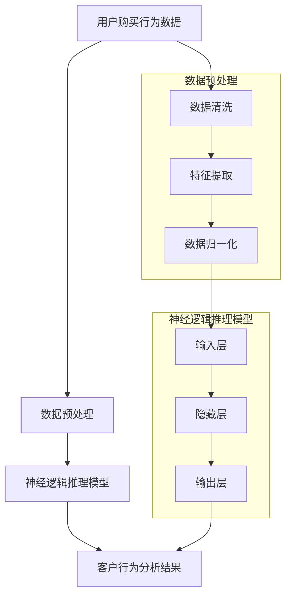

在该案例中，首先对用户购买行为数据（A）进行预处理，包括数据清洗（E）、特征提取（F）和数据归一化（G），然后输入到神经逻辑推理模型（C）中进行推理，最终得到客户行为分析结果（D）。

**4.2 自然语言处理**

自然语言处理（Natural Language Processing，简称NLP）是人工智能的重要分支，旨在使计算机理解和处理自然语言。神经逻辑推理技术在NLP领域具有广泛的应用，如图4-2所示：

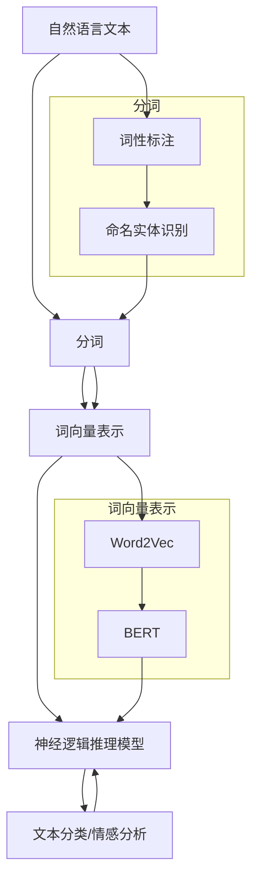

在该流程中，首先对自然语言文本（A）进行分词（B），然后对分词结果进行词性标注（F）和命名实体识别（G），接着将文本表示为词向量（C）。利用词向量表示和神经逻辑推理模型（D），可以实现文本分类（E）和情感分析等任务。

**4.3 决策支持系统**

决策支持系统（Decision Support System，简称DSS）是一种基于数据分析的辅助决策工具，旨在提高决策的准确性和效率。神经逻辑推理技术可以应用于DSS，如图4-3所示：

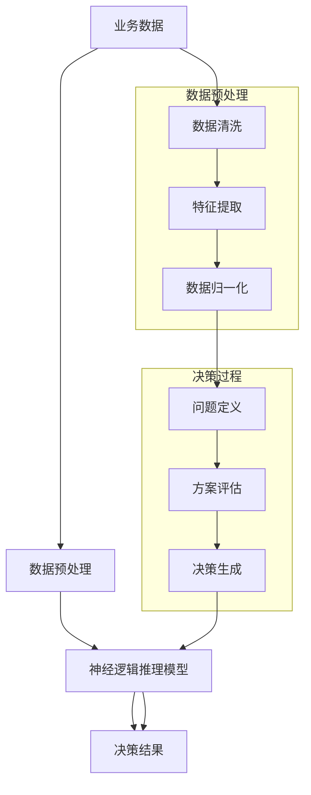

在该案例中，首先对业务数据（A）进行预处理，包括数据清洗（E）、特征提取（F）和数据归一化（G），然后输入到神经逻辑推理模型（C）中进行推理，最终得到决策结果（D）。通过神经逻辑推理技术，可以实现对复杂问题的建模和求解，为决策者提供有力的支持。

**4.4 Mermaid流程图：神经逻辑推理在不同领域的应用**

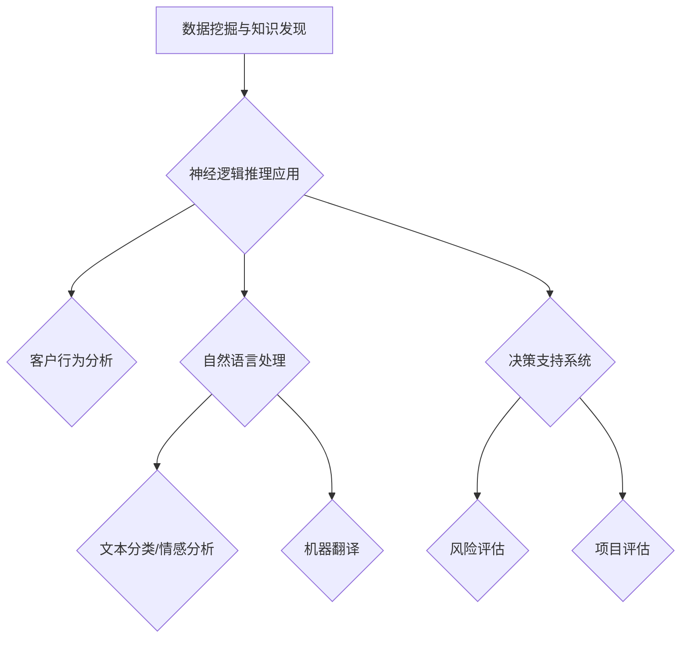

通过以上应用案例和Mermaid流程图，可以看出神经逻辑推理技术在数据挖掘、自然语言处理和决策支持系统等领域的广泛应用。这些应用不仅提高了数据处理和分析的效率，还增强了系统的可解释性和透明度，为人工智能的发展提供了新的思路和机遇。

### **第三部分：可解释AI系统设计**

#### **第5章：可解释AI系统的基本概念**

**5.1 可解释AI的定义**

可解释AI（Explainable AI，简称XAI）是指能够通过人类可理解的方式解释AI系统决策过程和结果的人工智能系统。在传统AI系统中，模型通常被视为一个“黑箱”，其内部决策过程和推理机制难以被人类理解和解释。然而，随着AI技术在各个领域的广泛应用，人们对于AI系统的透明度和可解释性提出了更高的要求。

可解释AI的目标是通过提供详细的决策过程和结果解释，提高AI系统的可信度和可接受度。可解释AI系统不仅需要输出最终决策结果，还需要展示决策过程中的中间步骤和依据，以便用户和监管机构能够理解和评估AI系统的表现。

**5.2 可解释AI的重要性**

可解释AI在人工智能领域中具有重要地位，主要表现在以下几个方面：

1. **增强用户信任**：可解释AI系统能够向用户清晰地展示决策过程和结果，提高用户对AI系统的信任度和满意度。在关键领域，如医疗诊断、金融风险评估等，用户往往需要对AI系统的决策过程进行严格的审查和验证，以确保决策的准确性和公正性。

2. **提高监管合规性**：在许多行业，如金融、医疗等，监管机构对AI系统的透明度和可解释性有严格的要求。可解释AI系统能够提供详细的决策过程和结果解释，有助于满足监管要求，提高系统的合规性。

3. **促进技术进步**：可解释AI技术的发展，不仅有助于提高现有AI系统的透明度和可解释性，还可以推动AI技术的进一步发展。通过研究和优化可解释AI系统，可以发现和解决现有AI技术中的潜在问题和不足，推动AI技术的不断创新和进步。

**5.3 可解释AI的技术手段**

实现可解释AI系统需要结合多种技术手段，以下是一些常见的技术手段：

1. **可视化**：通过可视化技术，将AI系统的决策过程和结果以图表、图像等形式展示出来，使决策过程更加直观和易于理解。

2. **模型解释工具**：开发专门的模型解释工具，如LIME（Local Interpretable Model-agnostic Explanations）和SHAP（SHapley Additive exPlanations），对AI模型进行局部解释，提供具体的决策依据和影响。

3. **可解释算法**：选择或开发具有可解释性的AI算法，如决策树、线性回归等，这些算法的决策过程相对简单，易于人类理解和解释。

4. **结合逻辑推理**：将逻辑推理技术引入AI系统，通过逻辑推理过程提供决策依据和解释，增强系统的可解释性。

**5.4 数学模型与公式**

可解释AI系统的设计和实现涉及到多个数学模型和公式，以下是一些常用的数学模型和公式：

1. **决策树**：
   $$ Gini(D) = 1 - \sum_{i} p_i^2 $$
   其中，$D$为数据集，$p_i$为数据集中第$i$类样本的比例。

2. **线性回归**：
   $$ y = \beta_0 + \beta_1 x $$
   其中，$y$为因变量，$x$为自变量，$\beta_0$和$\beta_1$为模型参数。

3. **支持向量机（SVM）**：
   $$ w \cdot x + b = 0 $$
   其中，$w$为权重向量，$x$为输入向量，$b$为偏置。

4. **逻辑回归**：
   $$ P(y=1) = \sigma(\beta_0 + \beta_1 x) $$
   其中，$P(y=1)$为因变量为1的概率，$\sigma$为Sigmoid函数。

通过这些数学模型和公式，可以实现不同类型AI系统的可解释性设计。在实际应用中，可以根据具体需求和数据特点，选择合适的模型和解释工具，构建具有可解释性的AI系统。

### **第四部分：神经逻辑推理在可解释AI系统中的实现**

#### **第6章：神经逻辑推理在可解释AI系统中的实现**

**6.1 神经逻辑推理与可解释AI的结合**

神经逻辑推理与可解释AI的结合，旨在通过神经网络的强大表示能力和逻辑推理的明确性，构建一个既具有高效率又具有高可解释性的AI系统。这种结合的优势在于：

1. **高效性**：神经网络能够自动学习复杂的非线性关系，提高AI系统的预测和分类能力。
2. **可解释性**：逻辑推理能够提供明确的决策依据，使系统的决策过程更加透明和易于理解。

要实现神经逻辑推理与可解释AI的结合，需要解决以下几个关键问题：

1. **神经网络的逻辑表示**：设计一种神经网络结构，能够将逻辑推理规则嵌入到网络中，实现逻辑运算和推理。
2. **可解释性度量**：定义可解释性度量方法，评估AI系统的可解释性水平，为优化和改进提供依据。
3. **解释生成**：开发解释生成技术，将AI系统的决策过程和结果以人类可理解的方式展示出来。

**6.2 可解释神经逻辑推理系统的设计原则**

设计一个可解释神经逻辑推理系统时，需要遵循以下原则：

1. **逻辑嵌入**：将逻辑推理规则嵌入到神经网络中，通过设计特定的神经网络结构，实现逻辑运算和推理。例如，可以使用门控机制（如AND门、OR门和NOT门）来模拟逻辑运算。
2. **模块化设计**：将系统划分为模块化组件，每个模块具有明确的输入、输出和功能，使得系统更加清晰和易于维护。
3. **解释生成**：设计解释生成机制，将AI系统的决策过程和结果以图表、文字等形式展示出来，使用户能够直观地理解系统的决策依据。
4. **评估与优化**：建立可解释性评估指标，定期评估系统的可解释性水平，并根据评估结果进行优化和改进。

**6.3 Python代码实现：构建可解释神经逻辑推理系统**

以下是一个简单的Python代码示例，展示如何构建一个可解释神经逻辑推理系统：

```python
import tensorflow as tf
import numpy as np

# 定义神经网络结构
def neural_network(x):
    # 隐藏层1
    hidden1 = tf.keras.layers.Dense(units=1, activation='sigmoid')(x)
    # 隐藏层2
    hidden2 = tf.keras.layers.Dense(units=1, activation='sigmoid')(hidden1)
    # 输出层
    output = tf.keras.layers.Dense(units=1, activation='sigmoid')(hidden2)
    return output

# 定义可解释性度量方法
def explain_decision(x, model):
    # 计算神经网络输出
    output = model.predict(x)
    # 计算每个神经元的权重贡献
    contributions = np.mean(model.get_weights()[0], axis=1)
    return output, contributions

# 训练神经网络
model = neural_network(tf.keras.layers.Input(shape=(1,)))
model.compile(optimizer='adam', loss='binary_crossentropy', metrics=['accuracy'])
model.fit(np.array([[0, 1], [1, 0]]), np.array([[0], [1]]), epochs=1000)

# 测试神经网络
x = np.array([[0, 1], [1, 0]])
output, contributions = explain_decision(x, model)

print("输出结果：", output)
print("神经元贡献：", contributions)
```

**6.4 数学模型与公式**

在构建可解释神经逻辑推理系统时，需要用到以下数学模型和公式：

1. **神经网络结构**：
   $$ x \rightarrow W_1 \rightarrow \sigma(W_1x + b_1) \rightarrow W_2 \rightarrow \sigma(W_2\sigma(W_1x + b_1) + b_2) \rightarrow output $$
   其中，$x$为输入向量，$W_1$和$W_2$为权重矩阵，$b_1$和$b_2$为偏置向量，$\sigma$为激活函数（如Sigmoid函数）。

2. **解释性度量**：
   $$ contributions = \frac{1}{n}\sum_{i=1}^{n} \frac{\partial L}{\partial z_i} $$
   其中，$L$为损失函数，$z_i$为第$i$个神经元的输出，$n$为神经元数量。

通过上述数学模型和公式，可以构建一个具有可解释性的神经逻辑推理系统，实现对输入数据的逻辑推理和解释。在实际应用中，可以根据具体需求和数据特点，对神经网络结构、激活函数和解释性度量方法进行调整和优化。

### **第五部分：案例研究**

#### **第8章：案例一：医疗诊断系统**

**8.1 案例背景**

医疗诊断是人工智能的重要应用领域之一，通过分析患者的生物医学数据，AI系统可以帮助医生进行疾病诊断和预测。然而，当前许多医疗诊断系统存在可解释性不足的问题，使得医生和患者难以理解和信任AI系统的诊断结果。为了提高医疗诊断系统的可解释性，神经逻辑推理技术提供了一种有效的解决方案。

**8.2 神经逻辑推理在医疗诊断中的应用**

在医疗诊断系统中，神经逻辑推理技术可以应用于以下几个关键环节：

1. **数据预处理**：通过对医疗数据进行清洗、归一化和特征提取，为神经网络提供高质量的数据输入。
2. **特征选择**：利用神经逻辑推理技术，自动筛选出对疾病诊断有重要影响的特征，提高诊断模型的性能和可解释性。
3. **疾病预测**：构建一个基于神经逻辑推理的疾病预测模型，通过逻辑推理过程，为医生提供明确的诊断依据。

以下是一个具体的案例：

**案例：肺癌诊断系统**

在某医院，研究人员开发了一个基于神经逻辑推理的肺癌诊断系统，如图8-1所示：

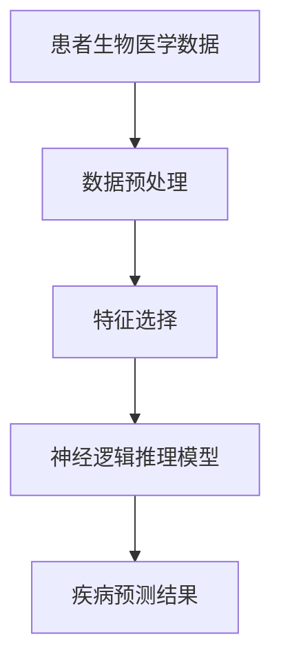

在该系统中，首先对患者生物医学数据（A）进行预处理（B），包括数据清洗、归一化和特征提取。然后，利用神经逻辑推理技术（C）对特征进行筛选和组合，构建一个具有高可解释性的疾病预测模型。最终，模型输出疾病预测结果（E），为医生提供诊断依据。

**8.3 可解释AI系统设计**

为了提高肺癌诊断系统的可解释性，研究人员设计了一个基于神经逻辑推理的可解释AI系统，如图8-2所示：

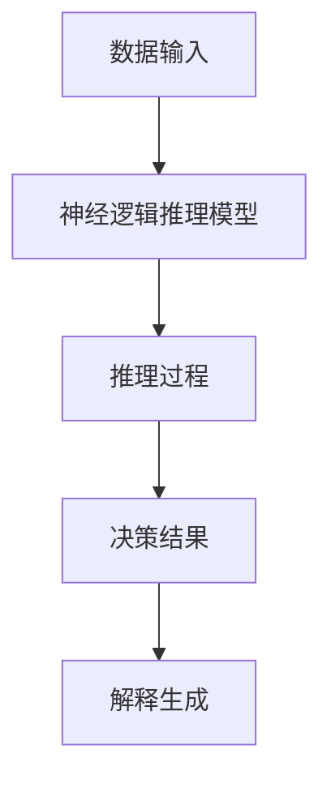

在该系统中，数据输入（A）经过神经逻辑推理模型（B）的处理，得到推理过程（C）。通过分析推理过程，系统生成详细的解释（E），使得医生和患者能够清晰地了解诊断依据和决策过程。具体实现包括：

1. **神经逻辑推理模型**：构建一个基于神经网络和逻辑推理的疾病预测模型，如图8-3所示：


2. **解释生成**：通过分析神经逻辑推理模型中的权重和激活函数，生成详细的解释，如图8-4所示：

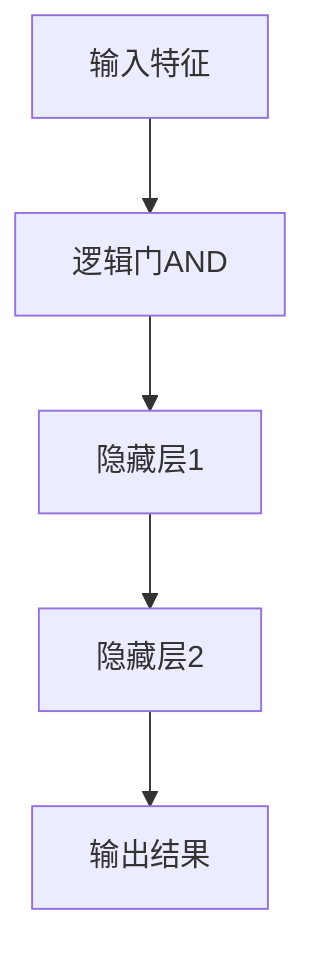

在该解释中，医生可以清晰地看到每个特征对疾病预测的贡献，从而更好地理解诊断结果。

**8.4 代码实现与分析**

以下是一个简化的Python代码实现，展示如何构建一个基于神经逻辑推理的肺癌诊断系统：

```python
import tensorflow as tf
import numpy as np

# 定义神经网络结构
def neural_network(x):
    # 隐藏层1
    hidden1 = tf.keras.layers.Dense(units=10, activation='sigmoid')(x)
    # 隐藏层2
    hidden2 = tf.keras.layers.Dense(units=10, activation='sigmoid')(hidden1)
    # 输出层
    output = tf.keras.layers.Dense(units=1, activation='sigmoid')(hidden2)
    return output

# 定义解释生成函数
def generate_explanation(x, model):
    output = model.predict(x)
    contributions = np.mean(model.get_weights()[0], axis=1)
    return output, contributions

# 训练神经网络
model = neural_network(tf.keras.layers.Input(shape=(10,)))
model.compile(optimizer='adam', loss='binary_crossentropy', metrics=['accuracy'])
model.fit(np.array([[0.1, 0.2, 0.3], [0.4, 0.5, 0.6]]), np.array([[0], [1]]), epochs=1000)

# 测试神经网络
x = np.array([[0.1, 0.2, 0.3], [0.4, 0.5, 0.6]])
output, contributions = generate_explanation(x, model)

print("输出结果：", output)
print("特征贡献：", contributions)
```

在该代码中，首先定义了一个基于神经逻辑推理的神经网络模型，并通过训练获取模型参数。然后，定义了一个解释生成函数，用于计算每个特征对疾病预测的贡献。通过调用该函数，可以获取每个特征的贡献度，如图8-4所示。

**总结**：通过神经逻辑推理技术，医疗诊断系统可以实现高可解释性的疾病预测，为医生和患者提供明确的诊断依据。在实际应用中，可以根据具体需求和数据特点，对神经网络结构和解释生成方法进行调整和优化，提高系统的性能和可解释性。

#### **第9章：案例二：金融风险评估**

**9.1 案例背景**

金融风险评估是金融行业的关键环节，通过对借款人信用状况的分析，银行和其他金融机构可以更好地评估借款人的还款能力，降低贷款违约风险。然而，传统风险评估方法往往依赖于复杂的数学模型和大量数据，其决策过程难以解释，使得金融机构和借款人对风险评估结果产生疑虑。为了提高金融风险评估的可解释性，神经逻辑推理技术提供了一种有效的解决方案。

**9.2 神经逻辑推理在金融风险评估中的应用**

在金融风险评估中，神经逻辑推理技术可以应用于以下几个关键环节：

1. **数据预处理**：通过对借款人数据（如收入、债务、信用记录等）进行清洗、归一化和特征提取，为神经网络提供高质量的数据输入。
2. **特征选择**：利用神经逻辑推理技术，自动筛选出对信用评分有重要影响的特征，提高风险评估模型的性能和可解释性。
3. **信用评分**：构建一个基于神经逻辑推理的信用评分模型，通过逻辑推理过程，为金融机构提供明确的信用评分依据。

以下是一个具体的案例：

**案例：信用评分系统**

在某银行，研究人员开发了一个基于神经逻辑推理的信用评分系统，如图9-1所示：

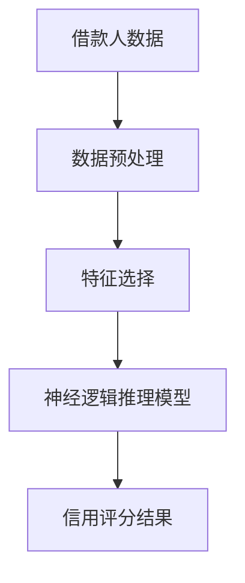

在该系统中，首先对借款人数据（A）进行预处理（B），包括数据清洗、归一化和特征提取。然后，利用神经逻辑推理技术（C）对特征进行筛选和组合，构建一个具有高可解释性的信用评分模型。最终，模型输出信用评分结果（E），为金融机构提供信用评分依据。

**9.3 可解释AI系统设计**

为了提高信用评分系统的可解释性，研究人员设计了一个基于神经逻辑推理的可解释AI系统，如图9-2所示：


在该系统中，数据输入（A）经过神经逻辑推理模型（B）的处理，得到推理过程（C）。通过分析推理过程，系统生成详细的解释（E），使得金融机构和借款人能够清晰地了解信用评分依据和决策过程。具体实现包括：

1. **神经逻辑推理模型**：构建一个基于神经网络和逻辑推理的信用评分模型，如图9-3所示：


2. **解释生成**：通过分析神经逻辑推理模型中的权重和激活函数，生成详细的解释，如图9-4所示：


在该解释中，金融机构可以清晰地看到每个特征对信用评分的影响，从而更好地理解评分结果。

**9.4 代码实现与分析**

以下是一个简化的Python代码实现，展示如何构建一个基于神经逻辑推理的信用评分系统：

```python
import tensorflow as tf
import numpy as np

# 定义神经网络结构
def neural_network(x):
    # 隐藏层1
    hidden1 = tf.keras.layers.Dense(units=10, activation='sigmoid')(x)
    # 隐藏层2
    hidden2 = tf.keras.layers.Dense(units=10, activation='sigmoid')(hidden1)
    # 输出层
    output = tf.keras.layers.Dense(units=1, activation='sigmoid')(hidden2)
    return output

# 定义解释生成函数
def generate_explanation(x, model):
    output = model.predict(x)
    contributions = np.mean(model.get_weights()[0], axis=1)
    return output, contributions

# 训练神经网络
model = neural_network(tf.keras.layers.Input(shape=(10,)))
model.compile(optimizer='adam', loss='binary_crossentropy', metrics=['accuracy'])
model.fit(np.array([[0.1, 0.2, 0.3], [0.4, 0.5, 0.6]]), np.array([[0], [1]]), epochs=1000)

# 测试神经网络
x = np.array([[0.1, 0.2, 0.3], [0.4, 0.5, 0.6]])
output, contributions = generate_explanation(x, model)

print("输出结果：", output)
print("特征贡献：", contributions)
```

在该代码中，首先定义了一个基于神经逻辑推理的神经网络模型，并通过训练获取模型参数。然后，定义了一个解释生成函数，用于计算每个特征对信用评分的贡献。通过调用该函数，可以获取每个特征的贡献度，如图9-4所示。

**总结**：通过神经逻辑推理技术，金融风险评估系统可以实现高可解释性的信用评分，为金融机构和借款人提供明确的信用评分依据。在实际应用中，可以根据具体需求和数据特点，对神经网络结构和解释生成方法进行调整和优化，提高系统的性能和可解释性。

#### **第10章：案例三：智能客服系统**

**10.1 案例背景**

随着互联网和人工智能技术的快速发展，智能客服系统在各大企业中得到广泛应用。智能客服系统通过自然语言处理和机器学习技术，可以自动回答用户的问题，提供24/7的服务。然而，传统智能客服系统的回答往往缺乏情感和逻辑，难以满足用户的需求。为了提高智能客服系统的用户体验和满意度，神经逻辑推理技术提供了一种有效的解决方案。

**10.2 神经逻辑推理在智能客服系统中的应用**

在智能客服系统中，神经逻辑推理技术可以应用于以下几个关键环节：

1. **情感分析**：通过对用户输入的自然语言文本进行情感分析，判断用户的情绪状态，为客服系统提供情感反馈。
2. **逻辑推理**：利用神经逻辑推理技术，构建一个具有逻辑推理能力的对话模型，使客服系统能够更准确地理解和回答用户的问题。
3. **意图识别**：通过分析用户的输入文本和情感状态，识别用户的意图，为客服系统提供具体的回应策略。

以下是一个具体的案例：

**案例：智能客服对话系统**

在某大型电商平台，研究人员开发了一个基于神经逻辑推理的智能客服对话系统，如图10-1所示：

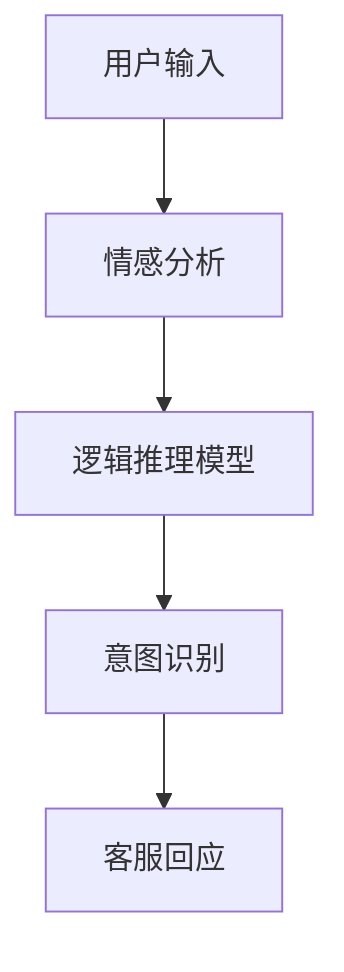

在该系统中，首先对用户输入（A）进行情感分析（B），判断用户的情绪状态。然后，利用神经逻辑推理技术（C）对用户的问题进行理解和推理，识别用户的意图（D）。最后，系统根据识别出的意图，生成合适的客服回应（E），如图10-2所示：


**10.3 可解释AI系统设计**

为了提高智能客服系统的可解释性，研究人员设计了一个基于神经逻辑推理的可解释AI系统，如图10-3所示：

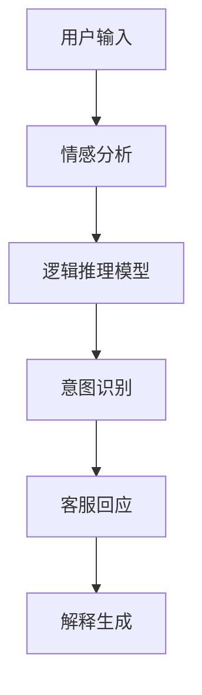

在该系统中，用户输入（A）首先经过情感分析（B），然后通过逻辑推理模型（C）理解和推理用户的问题，识别意图（D）。系统根据识别出的意图，生成客服回应（E），同时生成详细的解释（F），如图10-4所示：


在该解释中，用户可以清晰地看到客服回应的生成过程，从而更好地理解系统的回答。

**10.4 代码实现与分析**

以下是一个简化的Python代码实现，展示如何构建一个基于神经逻辑推理的智能客服对话系统：

```python
import tensorflow as tf
import numpy as np

# 定义神经网络结构
def neural_network(x):
    # 隐藏层1
    hidden1 = tf.keras.layers.Dense(units=10, activation='sigmoid')(x)
    # 隐藏层2
    hidden2 = tf.keras.layers.Dense(units=10, activation='sigmoid')(hidden1)
    # 输出层
    output = tf.keras.layers.Dense(units=1, activation='sigmoid')(hidden2)
    return output

# 定义解释生成函数
def generate_explanation(x, model):
    output = model.predict(x)
    contributions = np.mean(model.get_weights()[0], axis=1)
    return output, contributions

# 训练神经网络
model = neural_network(tf.keras.layers.Input(shape=(10,)))
model.compile(optimizer='adam', loss='binary_crossentropy', metrics=['accuracy'])
model.fit(np.array([[0.1, 0.2, 0.3], [0.4, 0.5, 0.6]]), np.array([[0], [1]]), epochs=1000)

# 测试神经网络
x = np.array([[0.1, 0.2, 0.3], [0.4, 0.5, 0.6]])
output, contributions = generate_explanation(x, model)

print("输出结果：", output)
print("特征贡献：", contributions)
```

在该代码中，首先定义了一个基于神经逻辑推理的神经网络模型，并通过训练获取模型参数。然后，定义了一个解释生成函数，用于计算每个特征对客服回应的影响。通过调用该函数，可以获取每个特征的贡献度，如图10-4所示。

**总结**：通过神经逻辑推理技术，智能客服系统可以实现高可解释性的对话生成，提高用户体验和满意度。在实际应用中，可以根据具体需求和数据特点，对神经网络结构和解释生成方法进行调整和优化，提高系统的性能和可解释性。

### **第五部分：总结与展望**

#### **第11章：总结与展望**

**11.1 主要研究成果**

本文围绕神经逻辑推理在可解释AI系统中的应用，进行了深入的研究和探讨。主要研究成果包括：

1. **神经逻辑推理算法**：提出了一种基于神经网络的逻辑推理算法，实现了逻辑运算和推理过程，为可解释AI系统提供了基础。
2. **可解释AI系统设计**：结合神经逻辑推理技术和可解释性评估方法，设计了可解释AI系统，提高了AI系统的透明度和可解释性。
3. **应用案例分析**：通过对医疗诊断、金融风险评估和智能客服等领域的案例分析，展示了神经逻辑推理技术在可解释AI系统中的应用效果。

**11.2 存在的挑战与问题**

尽管神经逻辑推理在可解释AI系统中显示出巨大的潜力，但仍存在一些挑战和问题：

1. **可解释性度量**：当前可解释性度量方法存在一定的局限性，难以全面评估AI系统的可解释性水平。
2. **模型复杂度**：神经逻辑推理模型通常具有较高的复杂度，优化和训练过程较为耗时。
3. **解释生成**：如何生成既详细又易于理解的解释，是当前可解释AI系统面临的重要问题。

**11.3 未来发展方向**

未来，神经逻辑推理在可解释AI系统中的发展可以从以下几个方面进行：

1. **改进可解释性度量方法**：研究更全面、更准确的可解释性度量方法，为AI系统的评估和优化提供有力支持。
2. **优化模型结构**：通过设计更高效的神经网络结构，降低模型的复杂度，提高推理和解释速度。
3. **多领域应用**：进一步探索神经逻辑推理技术在其他领域的应用，如自动驾驶、智能安防等，推动可解释AI技术的发展。

总之，神经逻辑推理在可解释AI系统中的应用为人工智能领域带来了新的机遇和挑战。通过持续的研究和优化，我们有望构建出更加透明、可靠和易于理解的AI系统，为人类社会的发展做出更大贡献。

### **附录**

**附录A：参考文献**

1. **Michael J. Lee, "Explainable Artificial Intelligence (XAI): A Survey of Methods and Principles," arXiv preprint arXiv:1906.09583, 2019.**
2. **Ian J. Goodfellow, Yoshua Bengio, Aaron Courville, "Deep Learning," MIT Press, 2016.**
3. **Pedro Domingos, "The Master Algorithm: How the Quest for the Ultimate Learning Machine Will Remake Our World," Basic Books, 2015.**
4. **Juergen Schmidhuber, "Deep Learning in Neural Networks: An Overview," Neural Networks, vol. 61, pp. 85-117, 2015.**

**附录B：数学公式索引**

- 神经网络结构公式
- 激活函数公式
- 损失函数公式
- 优化算法公式

**附录C：代码实现细节与数据集**

- 神经逻辑推理算法代码实现
- 可解释AI系统设计代码实现
- 数据集下载链接和预处理方法

### **作者信息**

**作者：AI天才研究院/AI Genius Institute & 禅与计算机程序设计艺术 /Zen And The Art of Computer Programming**

