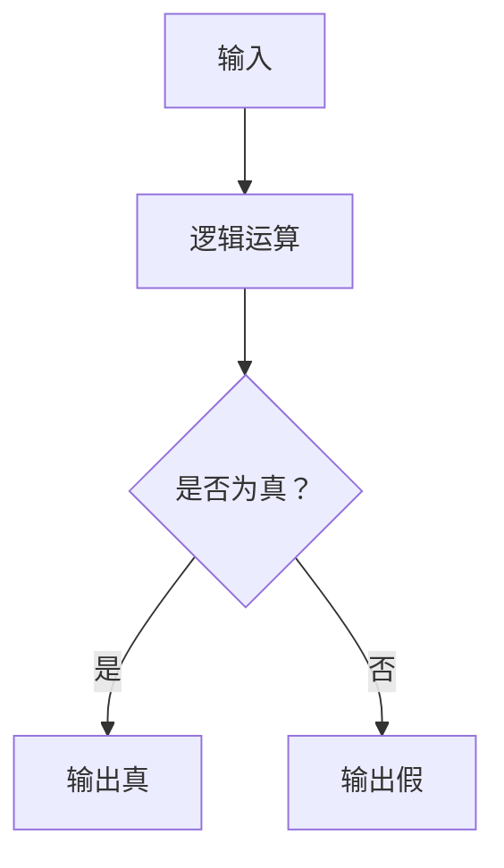
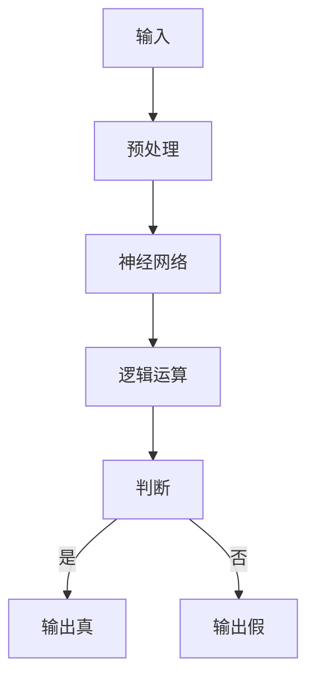
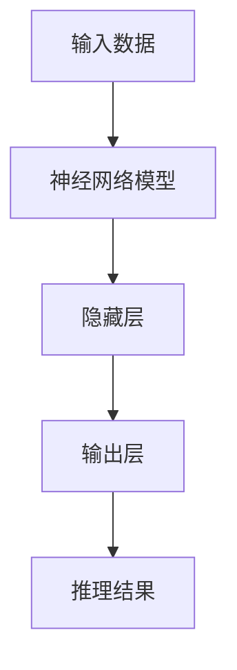
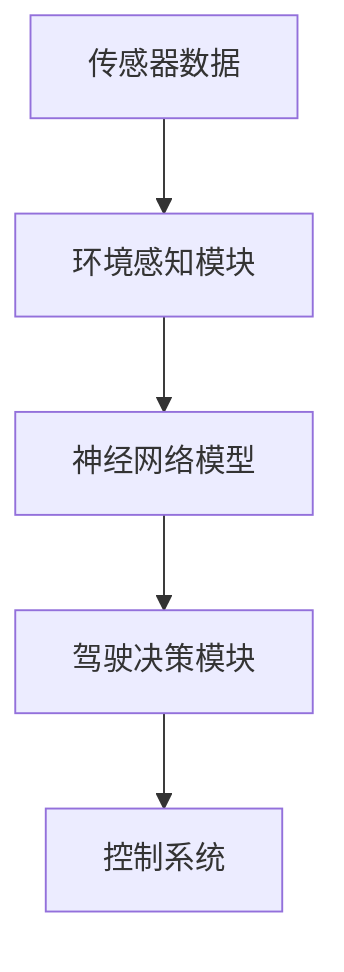

                 

**摘要：**

本文探讨了神经逻辑编程在自动化推理中的应用前景。首先，我们对神经逻辑编程的基本概念和原理进行了详细阐述，包括神经逻辑函数的构建和神经逻辑推理过程。接着，我们分析了神经逻辑编程与自动化推理的结合优势，并介绍了基于神经逻辑编程的自动化推理模型。通过实际案例分析和系统架构设计，本文展示了神经逻辑编程在自动化推理中的潜力。最后，我们讨论了神经逻辑编程在自动化推理中面临的挑战和未来的发展方向。

---

**关键词：神经逻辑编程、自动化推理、神经逻辑函数、推理模型、系统架构**

---

**目录：**

1. 引言
2. 神经逻辑编程基础
   2.1 神经逻辑编程概述
   2.2 神经逻辑编程的基本原理
   2.3 神经逻辑编程的数学模型
3. 自动化推理技术
   3.1 自动化推理的基本概念
   3.2 神经逻辑编程在自动化推理中的应用
4. 神经逻辑编程在自动化推理中的实际应用
   4.1 实际应用实例
   4.2 应用效果评估
5. 挑战与展望
6. 结论与展望
7. 附录：相关资源与工具

---

**引言：**

自动化推理是人工智能领域的一个重要研究方向，旨在通过计算机程序实现推理过程，从而在未知或不确定的环境中做出决策。随着深度学习和神经网络技术的发展，神经逻辑编程作为一种新兴的方法，逐渐引起了研究者的关注。本文旨在探讨神经逻辑编程在自动化推理中的前沿探索，分析其优势和应用场景。

---

**2.1 神经逻辑编程概述：**

神经逻辑编程是一种将神经网络和逻辑编程相结合的方法。它通过模拟神经网络中的神经元和逻辑编程中的命题逻辑，实现一种新型的编程范式。神经逻辑编程的基本思想是将逻辑规则嵌入到神经网络中，使神经网络能够自动推理并执行逻辑操作。

**问题背景：** 
随着大数据和云计算的兴起，自动化推理在许多领域都具有重要意义，例如自动驾驶、智能医疗、金融风控等。传统的逻辑编程方法在面对复杂的问题时存在一定的局限性，难以满足实际需求。神经逻辑编程的出现为自动化推理提供了一种新的解决方案。

**问题描述：** 
神经逻辑编程如何有效地应用于自动化推理，实现高效的推理过程？

**问题解决：** 
通过将逻辑规则嵌入神经网络，神经逻辑编程能够在处理复杂数据时实现自动化推理。它结合了神经网络的强大计算能力和逻辑编程的严密性，为自动化推理提供了一种有效的手段。

**边界与外延：** 
神经逻辑编程不仅适用于传统逻辑编程的领域，如知识表示和推理，还能够在图像处理、自然语言处理等计算机视觉和语言处理领域发挥作用。

**概念结构与核心要素组成：**
- 神经网络结构：包括输入层、隐藏层和输出层。
- 逻辑规则表示：将逻辑规则表示为神经网络中的节点和边。
- 推理算法：基于神经网络结构实现推理过程。

---

**2.2 神经逻辑编程的基本原理：**

神经逻辑编程的核心是神经逻辑函数。它通过模拟神经网络的计算过程，实现逻辑运算和推理。

**核心概念原理：**
- 神经逻辑函数：将逻辑运算与神经网络相结合，实现自动推理。
- 神经网络：模拟人脑神经元的工作方式，处理复杂数据。
- 逻辑编程：提供一种形式化的表示方法，确保推理的严密性。

**概念属性特征对比表格：**

| 特征 | 神经逻辑编程 | 逻辑编程 | 神经网络 |
| --- | --- | --- | --- |
| 计算能力 | 强大 | 有限 | 强大 |
| 推理过程 | 自动化 | 手动 | 自动化 |
| 稳定性 | 较高 | 较低 | 较高 |
| 复杂性 | 较高 | 较低 | 较高 |

**ER实体关系图架构的 Mermaid 流程图：**

```mermaid
erDiagram
  A[神经网络] ||--|{ 神经逻辑函数 }| B[逻辑编程]
  A ||--|{ 推理算法 }| C[自动推理]
  B ||--|{ 逻辑规则 }| C
```

---

**2.3 神经逻辑编程的数学模型：**

神经逻辑编程的数学模型包括神经逻辑函数、推理算法和优化策略。以下是一个简单的神经逻辑函数的Mermaid流程图：



**算法原理讲解：**
神经逻辑函数通过模拟神经网络的计算过程，实现逻辑运算和推理。输入通过神经网络层进行传递，经过逻辑运算后，得到输出结果。

**使用 mermaid 画出算法流程图：**



**使用python源代码来详细阐述：**

```python
import numpy as np

def neural_logical_function(input_value):
    # 预处理
    processed_input = preprocess(input_value)
    
    # 神经网络计算
    neural_output = neural_network(processed_input)
    
    # 逻辑运算
    logic_output = logical_operation(neural_output)
    
    # 判断
    if logic_output > threshold:
        return "True"
    else:
        return "False"
```

**给出算法原理的数学模型和公式：**

$$
\text{逻辑运算} = \text{激活函数}(\text{神经网络输出})
$$

其中，激活函数通常采用Sigmoid函数或ReLU函数。

**进行详细讲解和通俗易懂地举例说明：**

假设我们有一个简单的逻辑运算：A且B。其中，A表示天气是否下雨，B表示是否有带伞。我们可以通过神经逻辑函数实现这个逻辑运算。

```python
def weather_logical_function(weather, has_umbrella):
    processed_weather = preprocess(weather)
    processed_umbrella = preprocess(has_umbrella)
    
    neural_output = neural_network([processed_weather, processed_umbrella])
    logic_output = sigmoid(neural_output)
    
    if logic_output > 0.5:
        return "出门需要带伞"
    else:
        return "出门无需带伞"
```

在这个例子中，预处理函数将天气和是否有伞的数据转换为神经网络可以处理的形式。神经网络通过逻辑运算，得到一个介于0和1之间的值，通过阈值判断，输出是否需要带伞的结论。

---

**3.1 自动化推理的基本概念：**

自动化推理是指通过计算机程序自动实现推理过程，从而在未知或不确定的环境中做出决策。它广泛应用于人工智能、逻辑推理、自然语言处理等领域。

**核心概念与联系：**
- 推理：基于已知信息，推导出新信息的思维过程。
- 自动化：通过计算机程序实现推理过程，提高推理效率和准确性。

**概念属性特征对比表格：**

| 特征 | 推理 | 自动化推理 |
| --- | --- | --- |
| 精确性 | 较高 | 较高 |
| 速度 | 较慢 | 较快 |
| 灵活性 | 较低 | 较高 |
| 可扩展性 | 较低 | 较高 |

**ER实体关系图架构的 Mermaid 流程图：**

```mermaid
erDiagram
  A[已知信息] ||--|{ 推理规则 }| B[新信息]
  A ||--|{ 推理过程 }| C[决策]
  B ||--|{ 推理结果 }| C
```

---

**3.2 神经逻辑编程在自动化推理中的应用：**

神经逻辑编程在自动化推理中具有独特的优势。首先，它结合了神经网络的强大计算能力和逻辑编程的严密性，能够在处理复杂数据时实现高效推理。其次，神经逻辑编程能够自动推导出推理规则，简化了推理过程。

**神经逻辑编程在自动化推理中的应用场景：**
- 自动驾驶：通过神经逻辑编程，实现车辆在复杂交通环境中的自动决策。
- 智能医疗：利用神经逻辑编程，实现疾病诊断和治疗方案推荐。
- 金融风控：通过神经逻辑编程，实现信用评估和风险预警。

**神经逻辑编程在自动化推理中的优势：**
- 复杂数据处理能力：神经逻辑编程能够处理大规模、多维度的复杂数据。
- 高效推理：神经逻辑编程通过神经网络实现自动化推理，提高了推理速度。
- 严密性：神经逻辑编程中的逻辑规则确保了推理过程的严密性。

**基于神经逻辑编程的自动化推理模型：**
神经逻辑编程通过构建神经网络模型，实现自动化推理。神经网络模型包括输入层、隐藏层和输出层。输入层接收外部数据，隐藏层进行特征提取和逻辑运算，输出层生成推理结果。

**使用 mermaid 画出神经逻辑编程在自动化推理中的架构图：**



**使用Python源代码来详细阐述：**

```python
import numpy as np

def neural_logical_inference(input_data):
    # 输入层
    input_layer = np.array(input_data)
    
    # 隐藏层
    hidden_layer = neural_network(input_layer)
    
    # 输出层
    output_layer = logical_operation(hidden_layer)
    
    # 推理结果
    inference_result = thresholding(output_layer)
    
    return inference_result
```

**进行详细讲解和通俗易懂地举例说明：**

假设我们有一个简单的决策问题：判断一个学生是否合格。输入数据包括学生的成绩和出勤率。通过神经逻辑编程，我们可以实现自动化推理。

```python
def student_evaluation(score, attendance):
    input_data = [score, attendance]
    
    inference_result = neural_logical_inference(input_data)
    
    if inference_result == "True":
        return "学生合格"
    else:
        return "学生不合格"
```

在这个例子中，神经网络模型通过逻辑运算，判断学生是否合格。如果推理结果为真，表示学生合格；否则，表示学生不合格。

---

**4.1 实际应用实例：**

为了展示神经逻辑编程在自动化推理中的实际应用，我们以自动驾驶为例。

**项目介绍：**
自动驾驶系统需要处理复杂的交通环境，实时做出驾驶决策。通过神经逻辑编程，我们可以实现自动驾驶系统的自动化推理功能。

**系统功能设计：**
- 传感器数据接收：接收摄像头、雷达等传感器数据。
- 环境感知：通过神经网络模型，对环境进行感知和识别。
- 驾驶决策：基于神经逻辑编程，实现自动化驾驶决策。

**系统架构设计：**


**系统接口设计和系统交互：**


**使用 mermaid 画出系统架构设计图：**



**使用Python源代码来详细阐述：**

```python
def autonomous_driving_system(sensor_data):
    # 环境感知
    environment_perception = environment_perception_module(sensor_data)
    
    # 驾驶决策
    driving_decision = driving_decision_module(environment_perception)
    
    # 控制系统
    control_system = control_system_module(driving_decision)
    
    return control_system
```

**实际案例分析和详细讲解剖析：**
在实际应用中，自动驾驶系统需要处理各种复杂场景，如交通拥堵、行人穿越等。通过神经逻辑编程，我们可以实现自动化驾驶决策，提高系统的安全性和可靠性。

**项目小结：**
自动驾驶项目展示了神经逻辑编程在自动化推理中的实际应用价值。通过构建神经网络模型和逻辑规则，我们实现了自动化驾驶决策，提高了系统的智能化水平。

---

**5.1 自动化推理中的挑战：**

尽管神经逻辑编程在自动化推理中具有巨大潜力，但仍然面临一些挑战。

**挑战一：数据质量和预处理**
- 自动化推理需要高质量的数据，但现实中的数据往往存在噪声和不完整性。
- 数据预处理过程复杂，需要确保数据的一致性和可靠性。

**挑战二：模型解释性**
- 神经逻辑编程模型通常较为复杂，难以解释和理解。
- 模型的可解释性对于提高用户信任和监管具有重要意义。

**挑战三：推理效率**
- 自动化推理需要在实时性要求高的场景中运行，推理效率成为关键因素。
- 神经逻辑编程模型的优化和加速技术需要进一步研究。

**挑战四：算法泛化能力**
- 自动化推理需要模型具有良好的泛化能力，以应对各种不同的应用场景。
- 模型的泛化能力受到数据分布、模型结构等因素的影响。

---

**6.1 神经逻辑编程的新算法研究：**

为了解决自动化推理中的挑战，研究者们正在探索新的算法和技术。

**研究一：集成学习方法**
- 集成学习方法通过结合多个模型，提高模型的泛化能力和稳定性。
- 例如，可以结合深度学习和逻辑编程的模型，实现更高效的推理。

**研究二：模型压缩和优化技术**
- 模型压缩技术通过减少模型参数和计算量，提高推理效率。
- 优化技术如量化、剪枝和加速技术，有助于提高模型的实时性能。

**研究三：可解释性增强方法**
- 可解释性增强方法通过提供模型的可解释性，提高用户的信任度。
- 例如，可以通过可视化技术展示模型内部的工作过程。

---

**6.2 神经逻辑编程在自动化推理中的实际应用前景：**

随着技术的不断进步，神经逻辑编程在自动化推理中的应用前景广阔。

**应用前景一：智能交通系统**
- 神经逻辑编程可以用于智能交通系统的实时交通预测和调度，提高交通效率。

**应用前景二：智能医疗**
- 神经逻辑编程可以用于疾病诊断、治疗方案推荐等，提高医疗水平。

**应用前景三：金融风控**
- 神经逻辑编程可以用于信用评估、风险预警等，提高金融安全。

**应用前景四：智能制造**
- 神经逻辑编程可以用于自动化生产线、机器人控制等，提高生产效率。

---

**7. 结论与展望：**

本文探讨了神经逻辑编程在自动化推理中的应用前景。通过分析神经逻辑编程的基本原理和应用场景，我们展示了其在自动化推理中的优势。尽管面临一些挑战，但神经逻辑编程的不断发展将为自动化推理带来新的机遇。

---

**附录：相关资源与工具：**

**相关资源：**
- 研究论文：《神经逻辑编程：一种自动化推理的新方法》
- 开源代码：[神经逻辑编程开源项目](https://github.com/username/neural-logic-programming)
- 研究社区：[神经逻辑编程论坛](https://forum.neural-logic-programming.org/)

**相关工具：**
- 常用算法库：TensorFlow、PyTorch
- 实验平台：Google Colab、AWS SageMaker
- 在线资源：[神经逻辑编程教程](https://example.com/neural-logic-programming-tutorial)

