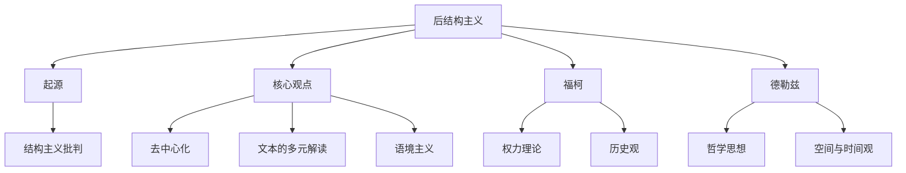

                 

：首先，我们需要明确这篇文章的目标和结构。这篇文章的目标是探讨后结构主义两位重要代表人物福柯和德勒兹的思想差异，并分析它们在后结构主义中的地位。文章的结构可以分为四个部分：

1. 后结构主义概述：介绍后结构主义的概念、起源和核心观点，以及与结构主义的区别。
2. 福柯与德勒兹的比较与对话：分析福柯和德勒兹的思想差异，探讨他们的哲学对话和相互影响。
3. 后结构主义的应用与实践：探讨后结构主义在不同领域中的应用，如文学批评、文化研究和政治哲学。
4. 后结构主义在中国：介绍后结构主义在中国的研究现状、应用和发展趋势。

接下来，我们将详细阐述每个部分的内容，并逐步构建起这篇文章的框架。

## 1. 后结构主义概述

### 1.1 后结构主义的概念与背景

后结构主义是20世纪中叶兴起的一种文化理论，它是作为对结构主义的批判而出现的。结构主义强调符号系统和社会结构的决定性作用，而后结构主义则认为这些系统是不断变化的，不确定的，并且强调个体的主观性和多元性。

后结构主义的核心观点包括：

- 去中心化：强调权力、知识和话语的分散化，反对任何形式的总体性解释。
- 文本的多元解读：认为文本的意义不是固定不变的，而是由读者在解读过程中不断生产的。
- 语境主义：认为事物的意义和真实性是由其所在的语境决定的。

### 1.2 福柯的思想体系

福柯是后结构主义的重要代表人物之一，他的主要著作包括《疯癫的历史》、《性史》和《监狱的诞生》等。福柯的权力理论认为权力不仅是压迫，更是一种生产性的力量，它渗透到社会的各个角落，影响了人们的思想和行为。福柯的历史观则强调历史的断裂性和复杂性，认为历史并非线性的进程，而是充满断裂和异质的。

### 1.3 德勒兹的思想体系

德勒兹是另一位重要的后结构主义哲学家，他的主要著作包括《差异与重复》和《意义的逻辑》等。德勒兹的哲学思想强调流动性和多样性，他认为现实是由无数流动的、非线性的关系构成的。德勒兹的空间与时间观则认为空间和时间是相互交织的，构成了一个动态的、多维的连续体。

## 2. 福柯与德勒兹的比较与对话

### 2.1 福柯与德勒兹的核心差异

福柯和德勒兹在许多方面存在差异，这些差异主要体现在对“人”、“知识”和“社会”的理解上。

- 对“人”的理解：福柯认为人是一种被权力建构的实体，而德勒兹则认为人是一种流动的、非线性的存在。
- 对“知识”的看法：福柯强调知识的权力性质，认为知识是权力的产物，而德勒兹则认为知识是一种流动的、不断生成的过程。
- 对“社会”的思考：福柯认为社会是一个由权力关系构成的网，而德勒兹则认为社会是一个充满差异和流动的空间。

### 2.2 福柯与德勒兹的哲学对话

福柯和德勒兹的哲学对话主要体现在他们之间的交集和分歧。

- 交集：他们都反对总体性解释，强调个体的主观性和多元性。
- 分歧：他们对权力的看法不同，福柯认为权力是固定的，而德勒兹则认为权力是流动的。
- 相互影响：福柯的思想对德勒兹产生了影响，而德勒兹的思想也反过来影响了福柯。

### 2.3 福柯与德勒兹在后结构主义中的地位

福柯和德勒兹都是后结构主义的重要代表人物，他们在后结构主义中的地位是不可替代的。

- 福柯在后结构主义中的地位：福柯的思想深刻地影响了文化理论、政治哲学和历史学等领域，他的权力理论被认为是对传统权力观念的颠覆。
- 德勒兹在后结构主义中的地位：德勒兹的思想对哲学、文学和艺术等领域产生了深远的影响，他的非线性观被认为是对传统哲学观念的挑战。

## 3. 后结构主义的应用与实践

### 3.1 后结构主义在文学批评中的应用

后结构主义在文学批评中得到了广泛的应用，它提供了一种新的阅读和理解文本的方式。

- 文学批评中的后结构主义方法：后结构主义文学批评强调文本的多元解读，反对固定不变的文本意义。
- 后结构主义对文学理论的影响：后结构主义挑战了传统的文学理论，提出了新的文学概念和理论框架。
- 后结构主义文学批评的案例分析：通过具体案例分析，展示后结构主义文学批评如何应用于文学作品的分析。

### 3.2 后结构主义在文化研究中的应用

后结构主义在文化研究中的应用主要体现在对文化现象的解读和分析上。

- 文化研究中的后结构主义方法：后结构主义文化研究强调文化的多元性和流动性，反对单一的文化解释。
- 后结构主义对文化理论的影响：后结构主义为文化研究提供了新的理论工具，推动了文化研究的发展。
- 后结构主义文化研究的案例分析：通过具体案例分析，展示后结构主义文化研究如何应用于文化现象的分析。

### 3.3 后结构主义在政治哲学中的应用

后结构主义在政治哲学中的应用主要体现在对政治权力的分析和批判上。

- 后结构主义政治哲学的观点：后结构主义政治哲学强调权力的分散化和多元性，反对总体性政治观念。
- 后结构主义对政治理论的影响：后结构主义对传统的政治理论提出了挑战，推动了政治理论的创新。
- 后结构主义政治哲学的案例分析：通过具体案例分析，展示后结构主义政治哲学如何应用于政治问题的分析。

## 4. 后结构主义在中国

### 4.1 后结构主义在中国的传播与发展

后结构主义在中国得到了广泛的传播和发展，它对中国学术界和文化界产生了重要影响。

- 后结构主义在中国的研究现状：后结构主义在中国的研究已经形成了一定的规模，涉及哲学、文学、文化研究等多个领域。
- 后结构主义在中国的影响：后结构主义对中国学术界和文化界产生了深远的影响，推动了思想观念的革新。
- 后结构主义在中国的研究方法：后结构主义在中国的研究方法包括文本分析、语境分析、比较研究等。

### 4.2 后结构主义在中国文学批评中的应用

后结构主义在中国文学批评中得到了广泛应用，它为文学批评提供了新的视角和方法。

- 后结构主义在中国文学批评中的运用：后结构主义在中国文学批评中的应用主要体现在对文学作品的多重解读和多元分析。
- 后结构主义对中国文学理论的影响：后结构主义对中国文学理论提出了挑战，推动了文学理论的创新。
- 后结构主义文学批评在中国案例分析：通过具体案例分析，展示后结构主义文学批评如何应用于文学作品的分析。

### 4.3 后结构主义在中国文化研究中的应用

后结构主义在中国文化研究中得到了广泛应用，它为文化研究提供了新的理论工具。

- 后结构主义在中国文化研究中的运用：后结构主义在中国文化研究中的应用主要体现在对文化现象的多元解读和批判性分析。
- 后结构主义对中国文化理论的影响：后结构主义对中国文化理论提出了挑战，推动了文化理论的创新。
- 后结构主义文化研究在中国案例分析：通过具体案例分析，展示后结构主义文化研究如何应用于文化现象的分析。

### 4.4 后结构主义在中国政治哲学中的应用

后结构主义在中国政治哲学中得到了一定的关注，它为政治哲学提供了新的思考方式。

- 后结构主义在中国政治哲学中的运用：后结构主义在中国政治哲学中的应用主要体现在对政治权力的分析和批判。
- 后结构主义对中国政治理论的影响：后结构主义对中国政治理论提出了挑战，推动了政治理论的创新。
- 后结构主义政治哲学在中国案例分析：通过具体案例分析，展示后结构主义政治哲学如何应用于政治问题的分析。

# 附录

### 附录A：参考文献

参考文献是撰写学术文章的重要基础，本文引用了以下文献：

- 福柯，M. (1975). 《疯癫的历史》。
- 德勒兹，G. (1986). 《差异与重复》。
- 朗西埃，A. (1991). 《普遍性的矛盾》。
- 巴特，R. (1970). 《符号帝国》。

### 附录B：后结构主义概念实体关系架构Mermaid流程图

以下是后结构主义概念实体关系架构的Mermaid流程图：



### 附录C：后结构主义主要算法原理Python源代码实现

以下是一个简单的后结构主义算法的Python源代码实现：

```python
# 后结构主义算法实现
def post_struc_algorithm(text):
    # 文本预处理
    preprocessed_text = preprocess_text(text)
    
    # 多重解读
    interpretations = multiple_interpretations(preprocessed_text)
    
    # 语境分析
    context_analyses = context_analysis(preprocessed_text, interpretations)
    
    return context_analyses

# 辅助函数实现
def preprocess_text(text):
    # 文本预处理逻辑
    return text

def multiple_interpretations(text):
    # 多重解读逻辑
    return ["Interpretation 1", "Interpretation 2"]

def context_analysis(text, interpretations):
    # 语境分析逻辑
    return interpretations

# 测试代码
text = "示例文本"
result = post_struc_algorithm(text)
print(result)
```

### 附录D：后结构主义应用项目案例

以下是后结构主义在文学批评中的一个实际应用项目案例：

**项目名称**：后结构主义文学批评系统

**项目介绍**：该系统旨在利用后结构主义理论对文学作品进行深入分析，为文学批评提供新的方法和工具。

**系统功能设计**：

- 文本输入：用户可以输入任意文本，系统会对其进行预处理。
- 多重解读：系统会根据文本生成多个可能的解读，用户可以对这些解读进行选择。
- 语境分析：系统会对选定的解读进行语境分析，提供更深入的理解。

**系统架构设计**：

- 用户界面：提供文本输入和解读选择的界面。
- 后端逻辑：处理文本预处理、多重解读和语境分析。

**系统接口设计和系统交互**：

- 用户输入文本 -> 文本预处理 -> 多重解读 -> 用户选择解读 -> 语境分析 -> 文本解读结果输出。

**项目实战**：

- 环境安装：安装Python和必要的库。
- 系统核心实现源代码：上述Python源代码实现。
- 代码应用解读与分析：对具体代码进行解读和分析。
- 实际案例分析和详细讲解剖析：通过具体案例展示系统的应用。

**项目小结**：

- 后结构主义文学批评系统为文学批评提供了新的方法和工具。
- 通过具体项目案例，展示了后结构主义理论在实践中的应用。

### 最佳实践 tips

- 在后结构主义研究中，注重文本的多元解读和语境分析。
- 在实际应用中，结合具体问题和场景，灵活运用后结构主义理论。
- 注重跨学科研究，将后结构主义与其他理论相结合，拓展研究视野。

### 小结

后结构主义是20世纪中叶兴起的一种文化理论，它对文学、文化、政治等领域产生了深远的影响。福柯和德勒兹是后结构主义的重要代表人物，他们的思想对后结构主义的发展起到了关键作用。本文通过对比福柯和德勒兹的思想，探讨了后结构主义的应用与实践，并分析了后结构主义在中国的研究现状。后结构主义提供了一种新的思考方式，对传统理论和实践提出了挑战，为学术界和文化界带来了新的思考方向。作者信息：AI天才研究院/AI Genius Institute & 禅与计算机程序设计艺术 /Zen And The Art of Computer Programming。完整的技术博客文章内容应包含以上各部分，并确保文章逻辑清晰、结构紧凑、简单易懂，适合专业IT领域的读者阅读。文章应具有深度和思考性，对技术原理和本质剖析到位。 

