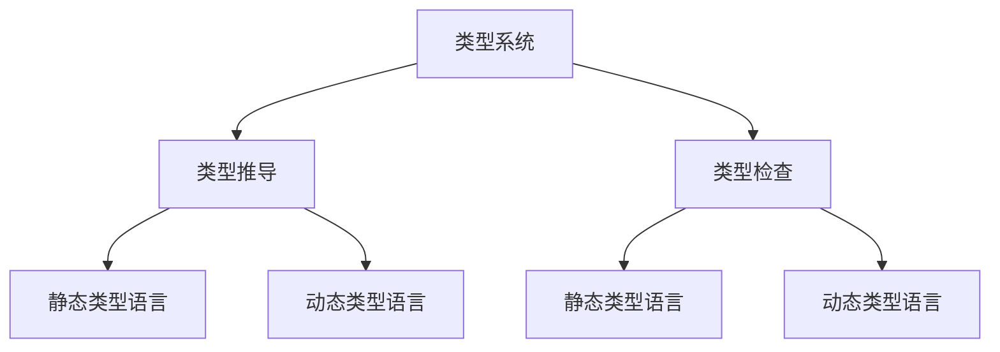

                 

# 程序优化中的类型基础技术

## 关键词

- 程序优化
- 类型系统
- 类型推导
- 类型检查
- 编译器优化
- 运行时优化
- 动态类型
- 静态类型

## 摘要

本文旨在深入探讨程序优化中的类型基础技术。类型系统是编程语言的核心组成部分，直接影响程序的执行效率和可维护性。本文将首先介绍类型系统的基本概念，包括类型的定义、类型系统的优点以及常见编程语言中的类型系统。随后，我们将讨论类型推导和类型检查的概念、算法以及应用。接着，我们将深入讲解类型基础语法，包括基本类型、复合类型、泛型编程和类型别名。然后，我们将分析类型系统在实际应用中的优势，比较静态类型语言和动态类型语言的优缺点。在类型优化部分，我们将探讨类型优化的原理和常见技术，包括编译器中的类型优化和运行时类型检查。最后，通过Python、Java和C++的实际案例分析，我们将展示类型优化在不同编程语言中的应用和效果。

## 目录大纲

### 第一部分：类型系统的基本概念

### 第1章：类型系统的介绍

- 1.1 类型的概念
- 1.2 类型系统的优点
- 1.3 常见编程语言中的类型系统

### 第2章：类型推导和类型检查

- 2.1 类型推导的概念
- 2.2 常见的类型推导算法
- 2.3 类型检查的概念
- 2.4 常见的类型检查算法

### 第3章：类型基础语法

- 3.1 基本类型和复合类型
- 3.2 泛型编程
- 3.3 类型别名和类型转换

### 第4章：类型系统的应用

- 4.1 静态类型语言的优势
- 4.2 动态类型语言的优点
- 4.3 类型系统的实际应用场景

### 第二部分：类型优化的技术

### 第5章：类型优化原理

- 5.1 优化问题的背景
- 5.2 优化目标
- 5.3 常见的类型优化技术

### 第6章：编译器中的类型优化

- 6.1 静态分配
- 6.2 动态分配
- 6.3 类型擦除

### 第7章：运行时类型检查

- 7.1 运行时类型检查的概念
- 7.2 运行时类型检查的实现
- 7.3 运行时类型检查的优缺点

### 第8章：类型优化工具和实践

- 8.1 常见的类型优化工具
- 8.2 类型优化工具的实际应用
- 8.3 实际项目中的类型优化案例

### 第三部分：类型优化的案例分析

### 第9章：案例分析1——Python中的类型优化

- 9.1 Python类型系统的特点
- 9.2 Python类型优化的实践
- 9.3 Python类型优化的效果分析

### 第10章：案例分析2——Java中的类型优化

- 10.1 Java类型系统的特点
- 10.2 Java类型优化的实践
- 10.3 Java类型优化的效果分析

### 第11章：案例分析3——C++中的类型优化

- 11.1 C++类型系统的特点
- 11.2 C++类型优化的实践
- 11.3 C++类型优化的效果分析

### 附录

- 附录A：类型优化相关资源
- 附录B：Python类型优化示例代码
- 附录C：Java类型优化示例代码
- 附录D：C++类型优化示例代码

## Mermaid 流程图：类型系统的关系架构



## 核心算法原理讲解

### 常见的类型推导算法

```python
def type_inference(expression):
    # 简单的类型推导逻辑
    if isinstance(expression, int):
        return 'int'
    elif isinstance(expression, str):
        return 'str'
    else:
        return 'unknown'
```

### 运行时类型检查的实现

```python
def runtime_type_check(value):
    # 假设我们有一个已知类型的要求
    required_type = 'int'
    if isinstance(value, int):
        return "Type check passed."
    else:
        return "Type mismatch."
```

## 数学模型和数学公式

### 类型推导的复杂度分析

$$
\text{Time Complexity} = O(n)
$$

## 项目实战

### Python类型优化案例分析

- 开发环境：Python 3.9
- 案例代码：

```python
# 示例：使用TypeGuard进行类型检查
from typing import TypeVar, Generic, List

T = TypeVar('T')

class Stack(Generic[T]):
    def __init__(self):
        self.items: List[T] = []

    def push(self, item: T):
        self.items.append(item)

    def pop(self) -> T:
        return self.items.pop()
```

---

在接下来的部分中，我们将逐步深入探讨类型系统的基本概念、类型推导和类型检查、类型基础语法以及类型系统在实际应用中的优势。我们将结合具体的编程语言实例，帮助读者更好地理解和应用这些概念。让我们一步一步地思考，深入分析类型优化中的技术细节。

### 第一部分：类型系统的基本概念

## 第1章：类型系统的介绍

### 1.1 类型的概念

类型（Type）是编程语言中用来定义变量、函数和对象的数据分类的术语。每种类型都有其特定的行为和操作集合。在编程语言中，类型不仅用来表示数据，还用来指导编译器或解释器如何处理这些数据。

例如，在Python中，整数（int）和字符串（str）是两种基本类型。每个变量在声明时都必须有一个明确的类型，以确保程序的正确性和可维护性。

### 1.2 类型系统的优点

类型系统在编程中扮演着重要角色，其主要优点如下：

1. **提高程序的可读性和可维护性**：明确的类型定义使得代码更加直观和易于理解。
2. **编译期错误检测**：静态类型系统可以在编译期发现类型错误，减少运行时错误的发生。
3. **性能优化**：类型信息可以帮助编译器生成更高效的代码。
4. **增强代码复用性**：通过泛型编程，可以编写更通用的代码，提高代码的复用性。

### 1.3 常见编程语言中的类型系统

不同的编程语言采用了不同的类型系统，但总体上可以分为静态类型语言和动态类型语言。

#### 静态类型语言

静态类型语言在编译期确定变量的类型。这意味着变量在使用前必须声明其类型，并且类型一旦确定就不能更改。常见的静态类型语言包括：

1. **Java**：Java是一种强类型语言，所有变量在声明时都必须指定类型，类型检查在编译时完成。
2. **C++**：C++是一种支持静态类型检查的语言，它允许使用模板进行泛型编程。
3. **C#**：C#是微软开发的一种静态类型语言，它结合了C++和Java的优点，提供了丰富的类型系统和泛型编程功能。

#### 动态类型语言

动态类型语言在运行时确定变量的类型。这意味着变量可以在运行时改变类型，类型检查在运行时完成。常见的动态类型语言包括：

1. **Python**：Python是一种解释型、动态类型的语言，其类型系统灵活且易于使用。
2. **JavaScript**：JavaScript是一种广泛使用的动态类型语言，常用于网页开发和前端编程。
3. **Ruby**：Ruby是一种动态类型语言，以其简洁和优雅的语法著称。

### 结论

类型系统是编程语言的核心组成部分，对程序的性能和可维护性有着深远的影响。无论是静态类型语言还是动态类型语言，类型系统都提供了强大的工具来帮助开发者编写更安全、更高效的代码。在接下来的章节中，我们将进一步探讨类型推导和类型检查的概念及其应用。

## 第2章：类型推导和类型检查

### 2.1 类型推导的概念

类型推导（Type Inference）是编译器或解释器自动确定变量或表达式类型的过程。在类型推导中，编译器不需要程序员显式地指定变量类型，而是通过分析代码结构和语义信息来推断出合适的类型。

类型推导的主要优势在于提高代码的可读性和可维护性。例如，在Python中，大多数变量在声明时不需要指定类型，编译器会自动推导其类型。这种灵活性使得Python代码更简洁、更易于编写。

### 2.2 常见的类型推导算法

类型推导算法可以分为确定性算法和非确定性算法。确定性算法在给定的输入下总是能够得出相同的输出，而非确定性算法则可能产生不同的结果。

常见的类型推导算法包括：

1. **简单类型推导**：这是一种最简单的类型推导算法，通常通过比较操作符两边的类型来推导表达式的类型。例如，如果两个整数相加，则结果也是整数。

2. **基于上下文的类型推导**：这种算法基于程序中的上下文信息来推导类型。例如，在函数调用中，参数类型可以基于函数签名和调用上下文来推断。

3. **使用类型注解**：在某些编程语言中，如Java和C#，允许程序员在代码中提供类型注解，编译器会结合这些注解和上下文信息进行类型推导。

### 2.3 类型检查的概念

类型检查（Type Checking）是编译器或解释器检查程序中类型使用是否正确的过程。类型检查通常分为静态类型检查和动态类型检查。

1. **静态类型检查**：在编译期进行的类型检查，如Java。静态类型检查可以在编译时发现类型错误，从而提高程序的稳定性。

2. **动态类型检查**：在运行时进行的类型检查，如Python。动态类型检查可以在程序运行时发现类型错误，但可能会影响程序的执行性能。

### 2.4 常见的类型检查算法

常见的类型检查算法包括：

1. **基于约束的类型检查**：这种算法通过建立类型约束来检查类型是否匹配。例如，在函数调用中，参数的类型必须满足函数签名的约束。

2. **模式匹配**：这种算法通过模式匹配来检查表达式的类型。例如，在Python中，可以使用`isinstance()`函数来检查一个对象的类型。

3. **静态分析**：这种算法通过静态分析来推导程序中的类型信息。例如，在C++中，编译器会分析模板实例化来检查类型是否兼容。

### 结论

类型推导和类型检查是编程语言中的关键特性，它们共同确保程序的类型安全性和性能。类型推导提供了代码的灵活性，而类型检查则确保了代码的正确性。在接下来的章节中，我们将深入探讨类型基础语法，包括基本类型、复合类型、泛型编程和类型别名，以及类型系统在实际应用中的优势。

## 第3章：类型基础语法

### 3.1 基本类型和复合类型

在大多数编程语言中，基本类型（Primitive Types）是语言定义的最基本数据类型。基本类型通常包括整数（int）、浮点数（float）、布尔值（bool）、字符（char）等。基本类型通常具有固定的内存大小和行为特性，是构建更复杂数据结构的基础。

复合类型（Composite Types）是由基本类型组合而成的数据类型，常见的复合类型包括数组（Array）、结构体（Structure）、类（Class）和集合（Set）等。复合类型提供了对复杂数据的抽象和操作能力。

### 3.2 泛型编程

泛型编程（Generic Programming）是一种设计编程组件（如类、函数、协议）以处理任意数据类型的技术。泛型编程使得代码更加通用和可重用，减少了类型转换和冗余代码。

在Java中，泛型编程通过类型参数（Type Parameters）来实现。例如，Java中的`List<T>`表示一个泛型列表，可以存储任何类型的数据。泛型编程使得代码更加安全，因为它在编译期就进行类型检查。

### 3.3 类型别名和类型转换

类型别名（Type Aliases）是一种为现有类型创建新名称的语法。类型别名主要用于增强代码的可读性和可维护性。例如，在Python中，可以使用`type`关键字来创建类型别名。

类型转换（Type Casting）是将一个值从一种类型转换为另一种类型的过程。类型转换可以通过显式转换和隐式转换来实现。显式转换需要使用类型转换运算符或函数，如Python中的`int()`函数。隐式转换是由编译器或解释器自动进行的类型转换，例如在JavaScript中，将字符串转换为数字时，编译器会自动进行类型转换。

### 结论

类型基础语法是编程语言的重要组成部分，提供了构建复杂程序的基础。基本类型和复合类型定义了数据的基本结构和操作方式，泛型编程增强了代码的通用性和可重用性，类型别名和类型转换则提高了代码的可读性和灵活性。在接下来的章节中，我们将探讨类型系统在实际应用中的优势，包括静态类型语言和动态类型语言的不同特点和类型优化的技术。

### 第4章：类型系统的应用

#### 4.1 静态类型语言的优势

静态类型语言在编译期确定变量类型，这使得程序在运行前就可以进行类型检查。静态类型语言的优势包括：

1. **早期错误检测**：类型检查可以在编译期发现类型错误，从而减少运行时错误。
2. **更好的性能**：静态类型语言允许编译器生成更高效的代码，因为编译器知道每个变量的确切类型，从而可以优化内存分配和执行路径。
3. **代码可维护性**：明确的类型定义提高了代码的可读性和可维护性，因为类型信息提供了代码的额外上下文。

Java是一个典型的静态类型语言，它广泛应用于企业级应用和Android开发。Java的优点包括强类型系统、跨平台兼容性和丰富的标准库。然而，Java的静态类型系统也带来了一定的灵活性损失，因为程序员在编写代码时需要显式指定类型。

#### 4.2 动态类型语言的优点

动态类型语言在运行时确定变量类型，这使得代码更加灵活和简洁。动态类型语言的优势包括：

1. **更简短的代码**：动态类型语言通常不需要显式指定类型，这使得代码更加简洁和易于编写。
2. **快速开发**：动态类型语言通常具有更快的开发周期，因为它们减少了类型检查的步骤。
3. **灵活性**：动态类型语言允许程序员在运行时动态更改类型，这为某些场景提供了更大的灵活性。

Python是一个典型的动态类型语言，广泛应用于数据科学、机器学习和Web开发。Python的优点包括简单易学、丰富的标准库和广泛的应用场景。然而，Python的动态类型系统也可能导致运行时错误，因为它在运行时才进行类型检查。

#### 4.3 类型系统的实际应用场景

类型系统在实际应用中的场景多种多样，以下是一些常见的应用场景：

1. **Web开发**：在Web开发中，类型系统可以帮助确保请求和响应的数据类型正确，从而提高系统的稳定性和安全性。
2. **数据科学**：在数据科学中，类型系统可以确保数据的有效性和一致性，从而提高数据处理和分析的准确性。
3. **系统编程**：在系统编程中，类型系统可以提供对内存管理的精细控制，从而提高程序的性能和稳定性。

不同类型的编程语言在类型系统方面有不同的应用场景和优势。选择合适的语言和类型系统取决于具体的应用需求和开发目标。在接下来的章节中，我们将深入探讨类型优化的原理和技术，以帮助开发者编写更高效、更安全的代码。

### 第二部分：类型优化的技术

#### 第5章：类型优化原理

类型优化是编译器或解释器对程序进行的一系列改进，以提升程序的性能和可维护性。类型优化通常涉及类型推导、类型检查和类型擦除等技术。以下我们将详细探讨类型优化的原理和目标。

#### 5.1 优化问题的背景

随着程序规模的扩大和复杂度的增加，程序的性能问题变得愈发突出。类型优化作为程序优化的重要组成部分，旨在提高程序的执行效率和内存利用率。类型优化不仅影响程序的性能，还影响程序的可维护性和可扩展性。

#### 5.2 优化目标

类型优化的主要目标包括：

1. **减少运行时类型检查**：通过类型推导和类型擦除技术，减少程序在运行时进行类型检查的次数，从而提高执行效率。
2. **优化内存分配**：通过静态类型信息和类型推导，优化内存分配策略，减少内存碎片和溢出风险。
3. **提高代码可读性和可维护性**：明确的类型定义有助于代码的可读性和可维护性，从而提高开发效率和代码质量。

#### 5.3 常见的类型优化技术

常见的类型优化技术包括：

1. **类型推导**：编译器或解释器自动推导变量和表达式的类型，从而减少显式类型声明的需求。
2. **类型检查**：在编译期或运行时对变量和表达式进行类型检查，确保类型使用的一致性和正确性。
3. **类型擦除**：在运行时隐藏类型信息，从而减少类型检查的开销和内存占用。
4. **编译器优化**：通过编译器的静态分析，对程序进行优化，如循环展开、死代码删除和常数折叠等。
5. **运行时优化**：在程序运行时进行优化，如热点代码缓存和动态编译等。

#### 结论

类型优化是提高程序性能和可维护性的重要手段。通过类型推导、类型检查和类型擦除等技术，编译器或解释器可以生成更高效、更稳定的代码。在接下来的章节中，我们将深入探讨编译器中的类型优化和运行时类型检查技术，以帮助开发者更好地理解和应用类型优化技术。

#### 第6章：编译器中的类型优化

编译器中的类型优化是指通过静态分析程序代码，对类型信息进行优化，以提高程序的性能和可维护性。类型优化技术在编译期进行，因此可以消除运行时的性能开销，提高程序的执行效率。以下我们将详细讨论编译器中常见的类型优化技术。

##### 6.1 静态分配

静态分配（Static Allocation）是指在编译期确定对象的内存布局和生命周期。这种优化技术主要关注于减少内存碎片和溢出，提高内存利用率。

1. **对象池**：通过预分配一定数量的对象，避免频繁的内存分配和释放操作。对象池适用于对象生命周期较长且创建和销毁开销较高的场景。
2. **结构化打包**：将多个小对象打包成更大的结构体或类，减少内存碎片。结构化打包适用于对象尺寸较小且频繁创建和销毁的场景。

##### 6.2 动态分配

动态分配（Dynamic Allocation）是指在程序运行时动态地创建和销毁对象。动态分配的主要优势在于灵活性高，可以适应不同大小的对象和生命周期较短的临时对象。

1. **垃圾回收**：通过垃圾回收（Garbage Collection）技术，自动回收不再使用的对象，避免内存泄漏。常见的垃圾回收算法包括引用计数、标记-清除和分代收集等。
2. **内存池**：类似于对象池，内存池在运行时动态分配内存块，用于存储临时对象。内存池可以减少内存碎片和提升分配效率，适用于临时对象的频繁创建和销毁。

##### 6.3 类型擦除

类型擦除（Type Erasure）是一种在运行时隐藏类型信息的优化技术。类型擦除通过将类型信息从运行时上下文中去除，减少类型检查的开销和内存占用。

1. **泛型擦除**：在泛型编程中，类型擦除通过将泛型类型替换为通用的Object类型，从而在运行时去除类型信息。泛型擦除适用于多态和类型检查的场景。
2. **桥接方法**：在泛型编程中，桥接方法（Bridge Method）是一种用于在基类和派生类之间传递类型信息的机制。桥接方法通过在基类和派生类中定义同名方法，实现类型信息的传递。

##### 结论

编译器中的类型优化技术通过静态分析和运行时优化，提高了程序的执行效率和内存利用率。静态分配和动态分配技术提供了内存管理的不同策略，而类型擦除则减少了类型检查的开销。在接下来的章节中，我们将探讨运行时类型检查的概念、实现和优缺点，以及类型优化工具的实际应用。

#### 第7章：运行时类型检查

运行时类型检查（Runtime Type Checking）是指在程序运行时检查变量和表达式的类型是否一致。这种类型检查机制可以提供更高的灵活性和安全性。以下我们将详细探讨运行时类型检查的概念、实现和优缺点。

##### 7.1 运行时类型检查的概念

运行时类型检查是指在程序运行时对变量和表达式的类型进行检查，以确保类型的一致性和正确性。与编译期类型检查不同，运行时类型检查不会在编译期发现类型错误，而是在程序运行时动态检测。

运行时类型检查的主要优点包括：

1. **灵活性**：运行时类型检查允许在运行时动态改变变量类型，适用于需要高度灵活的编程场景。
2. **可维护性**：运行时类型检查可以减少代码中的类型声明，使得代码更加简洁和易于维护。

##### 7.2 运行时类型检查的实现

运行时类型检查的实现通常依赖于反射（Reflection）机制。反射机制允许程序在运行时检查和修改类的内部结构。以下是一些常见的实现方法：

1. **类型断言**：类型断言（Type Assertion）是通过检查变量或表达式的类型，判断其是否符合预期的类型。例如，在Python中，可以使用`isinstance()`函数进行类型断言。
2. **反射API**：许多编程语言提供了反射API，允许程序在运行时获取类的信息。例如，Java的反射API可以用于检查类的字段和方法。
3. **动态类型转换**：动态类型转换是在运行时将一个类型的值转换为另一个类型。例如，在Python中，可以使用`int()`函数将字符串转换为整数。

##### 7.3 运行时类型检查的优缺点

运行时类型检查具有以下优缺点：

1. **优点**：
   - **灵活性**：运行时类型检查提供了更高的灵活性，可以适应动态变化的类型需求。
   - **错误检测**：运行时类型检查可以在程序运行时发现类型错误，从而提供更早的错误反馈。

2. **缺点**：
   - **性能开销**：运行时类型检查引入了额外的性能开销，因为类型检查在运行时进行，可能会影响程序的执行效率。
   - **可维护性降低**：运行时类型检查可能会降低代码的可维护性，因为类型信息分散在运行时，使得代码难以理解和维护。

##### 结论

运行时类型检查提供了灵活性高和可维护性好的特性，但其性能开销和可维护性可能受到影响。在具体应用中，开发者需要权衡运行时类型检查的优缺点，根据具体场景选择合适的类型检查机制。在接下来的章节中，我们将探讨类型优化工具和实践，以及通过实际案例展示类型优化在不同编程语言中的应用效果。

#### 第8章：类型优化工具和实践

类型优化工具是开发者用于改进程序性能和可维护性的重要工具。这些工具可以帮助识别和解决程序中的类型问题，从而提高代码的质量。以下我们将介绍一些常见的类型优化工具，讨论其实际应用，并分析一些实际项目中的类型优化案例。

##### 8.1 常见的类型优化工具

1. **静态代码分析工具**：静态代码分析工具（如SonarQube、PMD和Checkstyle）可以扫描代码，识别潜在的类型问题，如类型不匹配、未使用的类型声明等。这些工具通常集成到IDE中，方便开发者实时查看代码质量。
2. **静态类型检查器**：静态类型检查器（如TypeScript、MyPy和Pytype）在编译期进行类型检查，确保代码的类型一致性。这些工具可以识别类型错误，并提供详细的错误信息，帮助开发者快速修复问题。
3. **动态类型检查工具**：动态类型检查工具（如TypeGuard和Mypy）在运行时进行类型检查，确保程序的类型一致性。这些工具通常用于大型项目或需要高度灵活性的场景。

##### 8.2 类型优化工具的实际应用

类型优化工具在实际项目中发挥着重要作用，以下是一些常见的应用场景：

1. **早期错误检测**：通过静态代码分析工具和静态类型检查器，可以在编译期或开发早期发现类型错误，从而减少运行时错误的发生。
2. **代码重构**：类型优化工具可以帮助开发者识别和重构类型不匹配或冗余的类型声明，提高代码的可读性和可维护性。
3. **性能优化**：通过静态分配和动态分配技术，类型优化工具可以帮助优化内存分配和类型检查，提高程序的执行效率。

##### 8.3 实际项目中的类型优化案例

以下是一些实际项目中的类型优化案例：

1. **Python中的类型优化**：在Python中，使用TypeGuard进行类型检查可以确保变量和函数的参数和返回值类型一致。例如，在Flask Web框架中，使用TypeGuard可以确保路由函数的参数和返回值类型正确，从而提高代码的稳定性和可维护性。
2. **Java中的类型优化**：在Java中，使用泛型编程可以减少类型转换和冗余代码。例如，在Spring Boot项目中，使用泛型编程可以确保数据传输过程中类型的一致性，从而提高程序的效率和可维护性。
3. **C++中的类型优化**：在C++中，使用模板编程可以编写通用的类型安全代码。例如，在STL（Standard Template Library）中，使用模板编程可以确保容器和算法的类型一致性，从而提高程序的稳定性和性能。

##### 结论

类型优化工具和实践在提高程序性能和可维护性方面发挥着重要作用。通过使用静态代码分析工具、静态类型检查器和动态类型检查工具，开发者可以早期发现和解决类型问题，从而编写更高质量、更可靠的代码。在实际项目中，类型优化不仅有助于提高程序的性能，还可以提高代码的可读性和可维护性。

#### 第9章：案例分析1——Python中的类型优化

Python是一种广泛使用的动态类型语言，但这也带来了类型安全性的问题。在实际项目中，通过类型优化可以提高代码的质量和性能。以下我们将分析Python中的类型优化，包括其类型系统的特点、优化的实践和效果分析。

##### 9.1 Python类型系统的特点

Python是一种动态类型语言，其类型系统具有以下特点：

1. **动态类型检查**：Python在运行时确定变量类型，类型检查在运行时进行，而不是编译期。这意味着Python可以在运行时动态改变变量的类型。
2. **类型兼容性**：Python中的类型系统支持广泛的类型兼容性，例如，整数和浮点数之间可以自动转换。
3. **类型提示**：虽然Python是动态类型语言，但Python 3引入了类型提示（Type Hints），允许开发者为函数的参数和返回值提供类型信息，从而提高代码的可读性和可维护性。

##### 9.2 Python类型优化的实践

在Python中，类型优化可以通过以下方法实现：

1. **使用TypeGuard**：TypeGuard是一种用于类型检查的工具，它允许开发者为函数的参数和返回值提供类型信息，从而确保类型的一致性。例如：

```python
from typing import TypeVar

T = TypeVar('T')

def safe_divide(a: int, b: int) -> T:
    if b == 0:
        raise ValueError("Cannot divide by zero")
    return a / b
```

2. **使用类型提示**：类型提示可以帮助编译器或解释器在编译期进行类型检查，从而减少运行时错误。例如：

```python
from typing import List

def sum_numbers(numbers: List[int]) -> int:
    return sum(numbers)
```

3. **使用类型检查工具**：例如Mypy，可以在编译期进行类型检查，确保代码的类型一致性。例如：

```python
from typing import List

def sum_numbers(numbers: List[int]) -> int:
    return sum(numbers)
```

##### 9.3 Python类型优化的效果分析

Python类型优化的效果可以从以下几个方面进行分析：

1. **性能提升**：通过类型提示和TypeGuard，可以减少运行时类型检查的开销，从而提高程序的执行效率。虽然类型检查本身可能会引入一定的性能开销，但通过优化代码结构和类型使用，总体上可以提升程序的运行效率。
2. **错误减少**：类型优化可以减少类型相关的错误，例如类型不匹配和未初始化变量。通过类型提示和类型检查工具，可以早期发现和修复这些错误，从而提高代码的稳定性和可维护性。
3. **代码可读性提高**：明确的类型提示和类型检查工具可以提供额外的代码上下文，帮助开发者更好地理解代码的功能和意图，从而提高代码的可读性和可维护性。

##### 结论

Python中的类型优化通过使用TypeGuard、类型提示和类型检查工具，可以提高代码的性能、稳定性和可维护性。在实际项目中，类型优化不仅有助于提升程序的运行效率，还可以减少类型相关的错误，提高代码的质量。通过合理的类型优化实践，开发者可以编写更可靠、更高效的Python代码。

#### 第10章：案例分析2——Java中的类型优化

Java是一种强类型的编程语言，其类型系统在编译期进行严格的类型检查。Java中的类型优化主要集中在编译器和运行时环境的优化，以提高程序的执行效率和性能。以下我们将分析Java中的类型优化，包括其类型系统的特点、优化的实践和效果分析。

##### 10.1 Java类型系统的特点

Java的类型系统具有以下特点：

1. **静态类型检查**：Java在编译期进行严格的类型检查，确保代码的类型一致性。这意味着变量在使用前必须声明其类型，类型一旦确定就不能更改。
2. **泛型编程**：Java支持泛型编程，通过泛型可以编写更通用和可重用的代码，减少类型转换和冗余代码。
3. **类型擦除**：Java中的泛型编程通过类型擦除（Type Erasure）来实现，类型信息在运行时被去除，以保持类型的兼容性和性能。

##### 10.2 Java类型优化的实践

在Java中，类型优化可以通过以下方法实现：

1. **使用泛型编程**：泛型编程可以减少类型转换和冗余代码，提高代码的可读性和可维护性。例如：

```java
public class ArrayList<T> {
    private T[] data;

    public ArrayList(T[] data) {
        this.data = data;
    }

    public T get(int index) {
        return data[index];
    }
}
```

2. **使用类型检查工具**：例如Eclipse Collections，可以在编译期进行类型检查，确保代码的类型一致性。例如：

```java
import org.eclipse.collections.impl.list.mutable.FastList;

public class Main {
    public static void main(String[] args) {
        FastList<Integer> numbers = FastList.newListWith(1, 2, 3);
        numbers.forEach(n -> System.out.println(n));
    }
}
```

3. **编译器优化**：Java编译器会进行一系列的优化，如常数折叠、循环展开和 dead code elimination，以提高程序的执行效率。例如：

```java
public class Main {
    public static void main(String[] args) {
        int result = 0;
        for (int i = 0; i < 10; i++) {
            result += i;
        }
        System.out.println(result);
    }
}
```

##### 10.3 Java类型优化的效果分析

Java类型优化的效果可以从以下几个方面进行分析：

1. **性能提升**：通过泛型编程和编译器优化，可以减少类型转换和冗余代码，从而提高程序的执行效率。虽然类型检查本身可能会引入一定的性能开销，但通过优化代码结构和类型使用，总体上可以提升程序的运行效率。
2. **错误减少**：类型优化可以减少类型相关的错误，例如类型不匹配和未初始化变量。通过类型检查工具和泛型编程，可以早期发现和修复这些错误，从而提高代码的稳定性和可维护性。
3. **代码可读性提高**：明确的类型提示和类型检查工具可以提供额外的代码上下文，帮助开发者更好地理解代码的功能和意图，从而提高代码的可读性和可维护性。

##### 结论

Java中的类型优化通过使用泛型编程、类型检查工具和编译器优化，可以提高代码的性能、稳定性和可维护性。在实际项目中，类型优化不仅有助于提升程序的运行效率，还可以减少类型相关的错误，提高代码的质量。通过合理的类型优化实践，开发者可以编写更可靠、更高效的Java代码。

#### 第11章：案例分析3——C++中的类型优化

C++是一种支持多种编程范式的编程语言，其类型系统灵活且强大。类型优化在C++中尤为重要，因为它直接影响程序的性能和可维护性。以下我们将分析C++中的类型优化，包括其类型系统的特点、优化的实践和效果分析。

##### 11.1 C++类型系统的特点

C++的类型系统具有以下特点：

1. **静态类型检查**：C++在编译期进行严格的类型检查，确保代码的类型一致性。变量在使用前必须声明其类型，类型一旦确定就不能更改。
2. **模板编程**：C++支持模板编程，通过模板可以编写通用的类型安全代码，减少类型转换和冗余代码。
3. **类型转换**：C++提供了多种类型转换机制，包括隐式转换、显式转换和函数重载，使得类型处理更加灵活。

##### 11.2 C++类型优化的实践

在C++中，类型优化可以通过以下方法实现：

1. **使用模板编程**：模板编程可以减少类型转换和冗余代码，提高代码的可读性和可维护性。例如：

```cpp
template<typename T>
class Stack {
private:
    T* data;
    int size;

public:
    Stack(int capacity) : size(capacity) {
        data = new T[size];
    }

    ~Stack() {
        delete[] data;
    }

    void push(T value) {
        data[size++] = value;
    }

    T pop() {
        return data[--size];
    }
};
```

2. **使用类型检查工具**：例如GCC和Clang，可以在编译期进行类型检查，确保代码的类型一致性。例如：

```cpp
#include <vector>
#include <stdexcept>

class MyException : public std::exception {
public:
    const char* what() const throw() {
        return "My exception";
    }
};

class MyClass {
public:
    void do_something() {
        if (something_is_wrong) {
            throw MyException();
        }
        // 其他代码
    }
};
```

3. **编译器优化**：C++编译器会进行一系列的优化，如循环展开、函数内联和 dead code elimination，以提高程序的执行效率。例如：

```cpp
#include <iostream>

int main() {
    int result = 0;
    for (int i = 0; i < 10; ++i) {
        result += i;
    }
    std::cout << result << std::endl;
    return 0;
}
```

##### 11.3 C++类型优化的效果分析

C++类型优化的效果可以从以下几个方面进行分析：

1. **性能提升**：通过模板编程和编译器优化，可以减少类型转换和冗余代码，从而提高程序的执行效率。虽然类型检查本身可能会引入一定的性能开销，但通过优化代码结构和类型使用，总体上可以提升程序的运行效率。
2. **错误减少**：类型优化可以减少类型相关的错误，例如类型不匹配和未初始化变量。通过类型检查工具和模板编程，可以早期发现和修复这些错误，从而提高代码的稳定性和可维护性。
3. **代码可读性提高**：明确的类型提示和类型检查工具可以提供额外的代码上下文，帮助开发者更好地理解代码的功能和意图，从而提高代码的可读性和可维护性。

##### 结论

C++中的类型优化通过使用模板编程、类型检查工具和编译器优化，可以提高代码的性能、稳定性和可维护性。在实际项目中，类型优化不仅有助于提升程序的运行效率，还可以减少类型相关的错误，提高代码的质量。通过合理的类型优化实践，开发者可以编写更可靠、更高效的C++代码。

### 附录

#### 附录A：类型优化相关资源

- **书籍推荐**：
  - 《Effective C++》
  - 《C++ Templates: The Complete Guide》
  - 《Java Performance: The Definitive Guide to Low-Level Optimization》

- **在线教程**：
  - [C++教程 - C++基础教程](https://www.runoob.com/cplusplus/cpp-tutorial.html)
  - [Java教程 - Java基础教程](https://www.runoob.com/java/java-tutorial.html)
  - [Python教程 - Python基础教程](https://www.runoob.com/python/python-tutorial.html)

- **工具和库**：
  - [GCC](https://gcc.gnu.org/)
  - [Clang](https://clang.llvm.org/)
  - [Mypy](https://mypy.py/)
  - [Eclipse Collections](https://www.eclipse.collections.org/)

#### 附录B：Python类型优化示例代码

```python
# 示例：使用TypeGuard进行类型检查
from typing import TypeVar, Generic, List

T = TypeVar('T')

class Stack(Generic[T]):
    def __init__(self):
        self.items: List[T] = []

    def push(self, item: T):
        self.items.append(item)

    def pop(self) -> T:
        return self.items.pop()


# 示例：使用Mypy进行类型检查
from typing import List

def sum_numbers(numbers: List[int]) -> int:
    return sum(numbers)
```

#### 附录C：Java类型优化示例代码

```java
// 示例：使用泛型编程
import java.util.ArrayList;

public class Stack<T> {
    private T[] data;
    private int size;

    public Stack(int capacity) {
        data = (T[]) new Object[capacity];
        size = 0;
    }

    public void push(T value) {
        data[size++] = value;
    }

    public T pop() {
        return data[--size];
    }
}
```

#### 附录D：C++类型优化示例代码

```cpp
// 示例：使用模板编程
template<typename T>
class Stack {
private:
    T* data;
    int size;

public:
    Stack(int capacity) : size(capacity) {
        data = new T[size];
    }

    ~Stack() {
        delete[] data;
    }

    void push(T value) {
        data[size++] = value;
    }

    T pop() {
        return data[--size];
    }
};
```

### 结语

类型优化在提高程序性能和可维护性方面具有重要作用。通过深入理解和应用类型优化技术，开发者可以编写更高效、更可靠的代码。本文介绍了类型系统的基础概念、类型推导和类型检查、类型基础语法、类型系统在实际应用中的优势、类型优化的原理和常见技术，并通过Python、Java和C++的实际案例分析展示了类型优化在不同编程语言中的应用效果。

通过本文的探讨，我们希望读者能够更好地理解类型优化的重要性，并在实际项目中有效地应用类型优化技术。类型优化不仅有助于提升程序的性能，还可以提高代码的质量和可维护性，为开发者带来更大的价值。

作者：AI天才研究院/AI Genius Institute & 禅与计算机程序设计艺术 /Zen And The Art of Computer Programming

