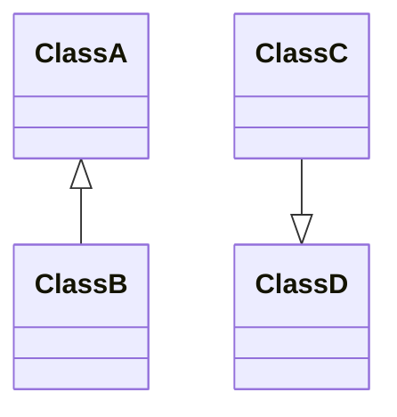

                 

### 文章标题

# 程序分析中的类型和效果系统

> 关键词：程序分析、类型系统、效果系统、静态类型、动态类型、类型推导、类型检查

> 摘要：本文将深入探讨程序分析中的类型系统和效果系统，分析它们的基本概念、原理和应用。通过逐步讲解，读者将理解类型和效果系统在程序分析中的重要性，并掌握相关的技术方法和应用场景。

### 引言

程序分析是计算机科学中的一个重要分支，它涉及到对程序的理解、验证和优化。在程序分析中，类型系统和效果系统是两个核心概念，它们共同为程序的语义理解提供了基础。

类型系统主要负责对程序中的变量、函数和表达式进行分类，确保程序在运行时不会出现类型错误。效果系统则关注程序运行过程中可能产生的副作用，如变量的修改、内存的分配和释放等，它有助于提高程序的安全性和可维护性。

本文将围绕类型和效果系统展开讨论，首先介绍类型系统的基础概念，包括数据类型、函数类型和常见的类型系统。接着，我们将探讨静态类型系统和动态类型系统的区别，并深入分析类型推导和类型检查的过程。然后，文章将转向效果系统，介绍其基本概念、原理和实现方法，并讨论效果系统在实际应用中的挑战和优化策略。最后，我们将探讨类型和效果系统的结合，分析它们在协同工作中的应用，并提供程序分析在实际中的应用案例。

通过本文的阅读，读者将全面了解程序分析中的类型和效果系统，掌握相关技术，并为实际编程和系统设计提供指导。

### 第一部分：类型系统基础

#### 第1章：程序分析概述

##### 1.1 程序分析的重要性

程序分析是软件开发过程中不可或缺的一环，它涉及到对程序代码的静态和动态分析，以理解程序的语义、验证程序的正确性、优化程序的性能。在软件工程中，程序分析的重要性体现在多个方面：

首先，程序分析有助于提高软件质量和可靠性。通过分析程序代码，可以发现潜在的错误和缺陷，从而减少软件中的漏洞和故障，提高软件的稳定性和可维护性。

其次，程序分析有助于优化程序性能。通过对程序的静态分析，可以发现潜在的瓶颈和优化机会，从而优化代码结构和算法设计，提高程序运行效率。

再次，程序分析为自动化测试和调试提供了基础。通过程序分析，可以生成测试用例，自动检测程序的错误和异常，提高测试覆盖率，从而提高软件的质量和可靠性。

最后，程序分析在软件维护和更新中起着重要作用。随着软件的迭代和升级，程序分析可以帮助开发人员理解现有代码的结构和逻辑，快速定位和修复问题，提高维护效率。

##### 1.2 程序分析的方法和技术

程序分析的方法和技术多种多样，主要包括静态分析和动态分析两种：

**静态分析**：静态分析是指在程序运行之前对程序代码进行分析，不涉及程序的实际执行。静态分析的主要目的是检查程序的语法、语义和结构，以发现潜在的错误和缺陷。静态分析的方法包括语法分析、语义分析、抽象语法树（AST）分析等。常见的静态分析工具包括静态代码检查器、静态分析框架和静态代码分析库。

**动态分析**：动态分析是指在程序运行过程中对程序进行分析，通过实际执行程序来观察其行为和性能。动态分析的主要目的是监测程序的运行状态，收集运行数据，以优化程序性能和发现潜在问题。动态分析的方法包括调试、性能分析、内存分析等。常见的动态分析工具包括调试器、性能分析工具和内存分析工具。

##### 1.3 类型系统在程序分析中的应用

类型系统在程序分析中起着核心作用，它对程序中的变量、函数和表达式进行分类，确保程序在运行时不会出现类型错误。类型系统在程序分析中的应用主要体现在以下几个方面：

**类型检查**：类型检查是类型系统的主要功能之一，它通过对程序代码进行语法和语义分析，验证程序中的变量和表达式是否遵循预定义的类型规则。类型检查有助于发现潜在的类型错误，提高程序的正确性。

**类型推导**：类型推导是指通过分析程序代码中的表达式和函数调用，自动推导出变量和表达式的类型。类型推导可以提高编程的效率和代码的可读性，减少类型错误的发生。

**类型安全**：类型系统通过确保程序中的类型一致性，提高程序的安全性。类型安全是指在程序运行过程中，类型系统可以防止类型错误的发生，从而减少程序崩溃和未定义行为的风险。

**代码优化**：类型系统在程序优化中也发挥着重要作用。通过类型信息，编译器可以生成更高效的代码，减少运行时的类型检查和类型转换，提高程序的运行效率。

#### 第2章：类型系统的基本概念

##### 2.1 数据类型与类型层次

数据类型是类型系统的核心概念，它定义了程序中可以使用的各种数据结构和操作。不同编程语言支持不同类型的数据，但通常可以分为基本数据类型和复合数据类型。

**基本数据类型**：基本数据类型是语言内嵌的数据类型，如整数（int）、浮点数（float）、字符（char）等。这些数据类型通常具有固定的长度和范围。

**复合数据类型**：复合数据类型是由基本数据类型组合而成的数据类型，如数组、结构体、联合体等。这些数据类型可以存储多个元素，具有更复杂的数据结构。

类型层次是类型系统的一种组织方式，它通过层次结构定义不同类型之间的关系。类型层次通常分为以下几种：

**层次结构**：层次结构是一种树形结构，其中每个节点表示一种数据类型，节点之间的父子关系表示类型之间的继承或包含关系。常见的类型层次结构包括层次型、嵌套型和混合型。

**类型兼容性**：类型兼容性是指不同类型之间的相互转换关系。类型兼容性分为子类型兼容性和等价类型兼容性。子类型兼容性允许子类型变量赋值给父类型变量，但反过来则不行；等价类型兼容性允许不同类型之间的相互赋值。

**类型转换**：类型转换是指将一种数据类型转换为另一种数据类型的过程。类型转换可以分为自动转换和显式转换。自动转换是指编译器自动将一种数据类型转换为另一种数据类型，而显式转换是指通过类型转换运算符或函数手动进行类型转换。

##### 2.2 函数类型与类型构造

函数类型是类型系统中的一个重要概念，它定义了函数作为参数传递和返回值的能力。函数类型通常由函数的参数类型和返回值类型组成，表示函数可以接受哪些类型的参数并返回哪些类型的值。

**函数类型表示**：函数类型的表示通常采用箭头表示法，如`T -> R`表示函数类型，其中`T`表示参数类型，`R`表示返回值类型。

**函数类型构造**：函数类型构造是指通过组合基本数据类型和复合数据类型来构造函数类型。常见的函数类型构造方法包括函数类型组合、函数类型嵌套和函数类型扩展。

**函数类型应用**：函数类型在类型系统中具有广泛的应用，如函数作为参数传递、函数作为返回值、函数类型的类型推导等。

##### 2.3 常见的类型系统

常见的类型系统包括静态类型系统和动态类型系统，它们在类型检查、类型推导和类型安全方面具有不同的特点。

**静态类型系统**：静态类型系统在程序编译时对程序代码进行类型检查，确保程序中的变量和表达式具有正确的类型。静态类型系统的主要优点是类型安全性高、代码可读性强，但可能需要更多的类型声明和类型检查开销。

**动态类型系统**：动态类型系统在程序运行时对程序代码进行类型检查，通过运行时类型信息来确保程序的正确性。动态类型系统的主要优点是编写和阅读代码更加方便，但可能存在类型安全问题。

**类型系统比较表格**：

| 特点       | 静态类型系统               | 动态类型系统               |
|------------|--------------------------|--------------------------|
| 类型检查时间 | 编译时进行类型检查           | 运行时进行类型检查           |
| 类型安全性   | 高，类型错误在编译时被发现       | 中，类型错误可能在运行时被发现     |
| 编码效率     | 较高，类型信息明确             | 较低，类型信息不明确           |
| 可读性      | 较高，类型声明明确             | 较低，类型声明不明确           |
| 运行效率     | 较低，类型检查开销较大         | 较高，类型检查开销较小         |

通过以上对类型系统基础概念的介绍，读者可以初步了解类型系统在程序分析中的应用和重要性。接下来的章节将深入探讨静态类型系统和动态类型系统的区别，并详细分析类型推导和类型检查的过程。

#### 第3章：静态类型系统

##### 3.1 强类型系统

强类型系统（Strongly Typed System）是类型系统的一种形式，它要求变量在声明时必须明确指定类型，并且类型在程序运行期间不会改变。这种严格的类型约束有助于提高程序的可靠性和可维护性。

**强类型系统的特点**：

1. **类型明确**：在声明变量时，必须指定其类型，如`int a;`或`String str;`。
2. **类型绑定**：变量一旦被声明，其类型就不能更改，如不能将一个整型变量转换为字符串。
3. **编译时类型检查**：在编译期间，编译器会检查所有的类型匹配，确保程序不会在运行时出现类型错误。
4. **类型安全**：强类型系统能够减少类型错误，提高程序的正确性。

**强类型系统的优势**：

1. **代码更清晰**：通过明确的类型声明，代码的可读性和可维护性得到提升。
2. **编译效率**：由于类型信息在编译时已经确定，编译器可以生成更高效的代码。
3. **安全性**：减少因类型错误导致的程序崩溃和未定义行为。

**强类型系统的劣势**：

1. **灵活性**：由于类型约束严格，可能需要更多的类型声明，增加代码的复杂性。
2. **编码难度**：某些操作（如类型转换）需要额外的类型声明，使得代码编写更加繁琐。

**示例**：

```python
# Python 是一种静态类型语言，但在运行时进行类型推导
def add(a: int, b: int) -> int:
    return a + b

result = add(5, 3)  # 运行时类型推导为 int
print(result)  # 输出 8
```

在上述示例中，`add` 函数在声明时指定了参数和返回值的类型，编译器会检查这些类型是否匹配。如果传入的参数不是整数，编译器会报错。

##### 3.2 弱类型系统

弱类型系统（Weakly Typed System）与强类型系统相对，它对类型约束较为宽松，允许变量在程序运行期间改变类型。这种类型约束的灵活性可能会带来一定的便利，但也增加了类型错误的风险。

**弱类型系统的特点**：

1. **类型不明确**：在声明变量时，可以不指定类型，或使用动态类型语言中的默认类型。
2. **类型转换自动进行**：在运行时，编译器或解释器会自动进行类型转换，以使表达式成立。
3. **运行时类型检查**：类型检查通常在程序运行时进行，而不是在编译时。

**弱类型系统的优势**：

1. **灵活性**：类型可以随意转换，无需显式声明类型。
2. **编码简单**：由于类型转换的自动化，代码编写更加简单。
3. **动态扩展性**：适用于需要动态扩展或适应多种数据类型的场景。

**弱类型系统的劣势**：

1. **可读性**：类型信息不明确，代码的可读性降低。
2. **安全性**：由于类型检查在运行时进行，类型错误可能直到运行时才会被发现。
3. **效率**：自动类型转换和运行时类型检查可能会增加性能开销。

**示例**：

```javascript
// JavaScript 是一种动态类型语言
function add(a, b) {
    return a + b;
}

let result = add(5, "3");  // 自动转换为数字和字符串相加
console.log(result);  // 输出 8
```

在上述示例中，`add` 函数的参数没有指定类型，JavaScript 解释器会在运行时自动进行类型转换。如果传入的参数类型不一致，解释器会尝试进行类型转换，可能会导致运行时错误。

##### 3.3 类型推导与类型检查

类型推导（Type Inference）是类型系统中的一个重要机制，它通过分析程序代码的上下文信息，自动推导出变量和表达式的类型。类型推导可以提高代码的可读性和编写效率。

**类型推导的优点**：

1. **减少类型声明**：通过类型推导，可以减少变量的显式类型声明。
2. **增强代码可读性**：代码中的类型信息更加直观，无需额外的类型声明。
3. **提高编程效率**：减少类型声明的负担，使编写代码更加简便。

**类型推导的缺点**：

1. **可能产生不确定性**：在某些情况下，类型推导可能无法准确推断出类型，导致编译错误。
2. **可能降低安全性**：在某些动态类型语言中，类型推导可能会导致类型错误。

**类型检查（Type Checking）**：

类型检查是确保程序代码类型一致性的过程。类型检查分为静态类型检查和动态类型检查。

**静态类型检查**：

1. **编译时进行**：在编译程序时，编译器会检查所有的类型匹配，确保程序不会在运行时出现类型错误。
2. **早期错误发现**：类型检查有助于在编译早期发现类型错误，减少运行时错误。

**动态类型检查**：

1. **运行时进行**：在程序运行时，解释器或运行时环境会检查类型匹配，确保程序不会在运行时出现类型错误。
2. **灵活性较高**：动态类型检查允许在运行时改变变量的类型，但可能会引入类型错误。

**类型推导与类型检查的关系**：

类型推导和类型检查相互补充。类型推导通过分析上下文信息自动推导类型，减少显式类型声明的负担；而类型检查确保推导出的类型是正确的，防止类型错误的发生。

通过以上对静态类型系统的介绍，读者可以更好地理解强类型系统和弱类型系统的特点、优缺点以及类型推导与类型检查的概念。接下来，我们将进一步探讨动态类型系统及其应用。

### 第二部分：效果系统基础

#### 第4章：效果系统的概念和原理

##### 4.1 效果系统的基本概念

效果系统（Effect System）是程序分析中的一个重要概念，它关注程序运行时可能产生的副作用（side effects）。副作用是指程序在执行过程中，除了返回值外，还可能修改程序状态或外部环境的行为。这些副作用包括变量修改、内存分配、文件读写等。效果系统旨在通过分析和控制副作用，提高程序的安全性和可维护性。

**副作用的基本概念**：

- **副作用类型**：副作用可以分为以下几种类型：

  1. **可抑制副作用**：可以通过同步操作或锁来控制的副作用，如变量的修改。
  2. **不可抑制副作用**：无法通过同步操作或锁来控制的副作用，如内存分配或文件读写。
  3. **副作用传播**：副作用可能会影响其他部分或后续执行的代码。

- **副作用传播**：副作用可能会在程序的不同部分传播，导致难以追踪和调试的问题。例如，一个函数修改了全局变量，可能会影响到其他函数的执行结果。

**效果系统的目的**：

- **安全性**：通过控制副作用，防止未授权的访问和修改，确保程序的正确性和安全性。
- **可维护性**：减少副作用带来的复杂性和不确定性，提高程序的易读性和可维护性。
- **性能优化**：通过分析副作用，可以优化程序执行，减少不必要的计算和内存分配。

**效果系统的重要性**：

- **避免不可预期的行为**：副作用可能导致不可预期的程序行为，如数据竞争、死锁和内存泄漏等。
- **提高程序可靠性**：通过控制副作用，可以减少程序中的错误和故障，提高程序的可靠性。
- **支持并发编程**：在并发编程中，副作用管理尤为重要，通过效果系统可以有效地控制并发操作的同步和通信。

##### 4.2 效果系统的原理

效果系统通过以下几种机制来分析和控制副作用：

**1. 副作用标注**

副作用标注是指在程序代码中显式标注可能产生副作用的操作。通过副作用标注，开发人员可以明确地指明哪些操作会产生副作用，从而便于分析和控制。

**示例**：

```python
def modify_global_variable():
    global var
    var = 10

var = 5
modify_global_variable()
print(var)  # 输出 10
```

在上面的示例中，`modify_global_variable` 函数通过修改全局变量 `var` 产生了副作用。

**2. 副作用检查**

副作用检查是效果系统中的一个关键机制，它通过在编译时或运行时检查程序代码中的副作用，确保副作用不会导致不可预期的行为。

**示例**：

```python
def add_to_global_variable(a):
    global var
    var += a

def subtract_from_global_variable(a):
    global var
    var -= a

var = 5
add_to_global_variable(3)
subtract_from_global_variable(2)
print(var)  # 输出 6
```

在上面的示例中，通过副作用检查，确保了 `add_to_global_variable` 和 `subtract_from_global_variable` 函数不会相互干扰。

**3. 副作用传播分析**

副作用传播分析是效果系统中的一个重要功能，它通过分析程序代码中的副作用传播路径，识别出副作用可能影响的代码区域。

**示例**：

```python
def modify_function(x):
    if x > 0:
        x = x * 2
    return x

result = modify_function(5)
print(result)  # 输出 10
```

在上面的示例中，副作用可能传播到整个程序，使得后续对 `x` 的使用都受到影响。

**4. 副作用隔离**

副作用隔离是效果系统中的一个策略，通过隔离不同部分的副作用，防止副作用之间的冲突和干扰。

**示例**：

```python
import threading

def modify_variable():
    global var
    var = 10

var = 5
t = threading.Thread(target=modify_variable)
t.start()
t.join()
print(var)  # 输出不确定，可能为 5 或 10
```

在上面的示例中，通过使用线程，副作用被隔离在不同的线程中，减少了冲突和干扰。

##### 4.3 效果系统的分类

效果系统可以根据不同的分类标准进行分类，常见的分类方法包括：

**1. 根据副作用类型分类**

- **可抑制副作用系统**：可以控制和管理副作用的系统，如Java中的synchronized关键字。
- **不可抑制副作用系统**：无法控制和管理副作用的系统，如Python中的动态类型系统。

**2. 根据效果系统实现方式分类**

- **显式效果系统**：通过显式标注副作用的方式实现，如C++中的RAII（Resource Acquisition Is Initialization）。
- **隐式效果系统**：通过隐式分析副作用的方式实现，如Java中的内存管理和垃圾回收。

**3. 根据效果系统应用范围分类**

- **局部效果系统**：仅针对局部变量的副作用进行管理和控制。
- **全局效果系统**：针对整个程序的副作用进行管理和控制。

通过以上对效果系统基本概念、原理和分类的介绍，读者可以初步了解效果系统的核心概念和重要性。接下来的章节将深入探讨效果系统的实现方法和实际应用场景，进一步揭示效果系统在程序分析中的应用价值。

#### 第5章：效果系统的实现

##### 5.1 效果系统的实现方法

效果系统的实现是程序分析中的一个关键环节，它涉及到如何有效地检测、控制和隔离副作用。以下是几种常见的实现方法：

**1. 副作用标注**

副作用标注是一种显式管理副作用的方法，通过在代码中显式标注可能产生副作用的操作，使开发人员能够清楚地了解哪些操作会产生副作用。

**实现步骤**：

- **定义副作用类型**：首先，需要定义副作用类型，如变量的修改、内存的分配等。
- **标注副作用操作**：在代码中添加副作用标注，明确指出哪些操作会产生副作用。
- **副作用检查**：在编译或运行时，对副作用标注进行检查，确保副作用不会产生不可预期的行为。

**优点**：

- **明确性**：通过副作用标注，开发人员可以清晰地了解哪些操作会产生副作用。
- **可维护性**：副作用标注有助于维护和更新代码，确保副作用管理的正确性。

**缺点**：

- **开发负担**：需要开发人员显式标注副作用，增加了代码的复杂性和开发负担。
- **灵活性**：副作用标注可能无法覆盖所有的副作用场景，存在一定的局限性。

**示例**：

```python
@副作用标注
def modify_variable():
    global var
    var = 10

var = 5
modify_variable()
print(var)  # 输出 10
```

在上面的示例中，使用`@副作用标注`装饰器显式标注了`modify_variable`函数可能产生的副作用。

**2. 副作用检测**

副作用检测是通过静态分析或动态分析的方法，检测代码中的副作用，确保副作用不会导致不可预期的行为。

**实现步骤**：

- **静态分析**：通过静态分析，检查代码中的副作用标注或潜在副作用，如变量修改、内存分配等。
- **动态分析**：通过动态分析，运行程序并监测副作用的发生，如变量修改、内存泄漏等。
- **副作用报告**：生成副作用报告，列出代码中的副作用及其影响范围。

**优点**：

- **自动化**：副作用检测可以自动进行，减少人工干预。
- **早期发现**：通过早期检测副作用，可以提前发现并修复问题，降低风险。

**缺点**：

- **准确性**：副作用检测可能存在误报或漏报，需要进一步优化。
- **性能开销**：静态分析和动态分析可能引入额外的性能开销。

**示例**：

```python
# 使用静态分析工具检测副作用
def modify_variable():
    global var
    var = 10

# 使用静态分析工具生成副作用报告
def generate_report():
    # 分析modify_variable函数的副作用
    report = "modify_variable函数可能产生副作用：变量var的修改"
    return report

report = generate_report()
print(report)  # 输出 "modify_variable函数可能产生副作用：变量var的修改"
```

在上面的示例中，使用静态分析工具检测`modify_variable`函数的副作用，并生成副作用报告。

**3. 副作用隔离**

副作用隔离是通过隔离不同部分的副作用，防止副作用之间的冲突和干扰。

**实现步骤**：

- **代码分割**：将代码分割成不同的部分，每个部分独立运行，减少副作用的影响范围。
- **线程隔离**：使用线程或进程隔离，防止不同线程或进程之间的副作用相互影响。
- **内存隔离**：使用不同的内存区域，确保不同部分的副作用不会相互干扰。

**优点**：

- **安全性**：通过副作用隔离，可以确保不同部分的副作用不会相互干扰，提高程序的安全性。
- **可维护性**：副作用隔离有助于降低代码的复杂度，提高代码的可维护性。

**缺点**：

- **开发难度**：副作用隔离可能需要额外的开发工作，增加了代码的复杂性。
- **性能影响**：副作用隔离可能引入额外的性能开销，影响程序运行效率。

**示例**：

```python
import threading

def modify_variable():
    global var
    var = 10

def read_variable():
    print(var)

var = 5
t1 = threading.Thread(target=modify_variable)
t2 = threading.Thread(target=read_variable)
t1.start()
t2.start()
t1.join()
t2.join()
```

在上面的示例中，使用线程隔离来防止`modify_variable`和`read_variable`函数之间的副作用相互影响。

通过以上对效果系统实现方法的介绍，读者可以初步了解副作用标注、副作用检测和副作用隔离的实现原理和优缺点。接下来，我们将通过具体案例，进一步探讨效果系统的实现和应用。

##### 5.2 效果系统的案例分析

效果系统的实际应用在软件开发中具有重要意义，通过以下案例，我们将探讨效果系统在不同场景下的实现和应用。

**案例1：并发编程中的副作用控制**

在并发编程中，副作用控制尤为重要，以防止数据竞争和死锁等安全问题。以下是一个简单的并发编程案例，展示了如何使用效果系统控制副作用。

**问题描述**：

在一个多线程程序中，有两个线程分别对共享变量进行修改和读取，可能导致数据不一致。

**实现方案**：

- **副作用标注**：明确标注修改共享变量的操作为副作用。
- **同步机制**：使用互斥锁（mutex）控制对共享变量的访问，确保线程间的同步。

**代码示例**：

```python
import threading

class Counter:
    def __init__(self):
        self.var = 0
        self.lock = threading.Lock()

    def increment(self):
        with self.lock:
            self.var += 1

    def get_value(self):
        with self.lock:
            return self.var

def thread_function(counter):
    for _ in range(1000):
        counter.increment()

counter = Counter()
threads = []
for _ in range(10):
    thread = threading.Thread(target=thread_function, args=(counter,))
    threads.append(thread)
    thread.start()

for thread in threads:
    thread.join()

print(counter.get_value())  # 输出 10000
```

在上面的示例中，使用互斥锁（mutex）确保对共享变量 `var` 的修改和读取操作是同步的，防止数据竞争。

**案例2：内存管理中的副作用隔离**

在内存管理中，副作用隔离有助于防止内存泄漏和无效指针等问题。以下是一个简单的内存管理案例，展示了如何使用效果系统隔离副作用。

**问题描述**：

在C++程序中，未正确释放内存可能导致内存泄漏和程序崩溃。

**实现方案**：

- **资源获取即初始化（RAII）**：使用RAII机制自动管理内存，确保在适当的时间释放内存。
- **副作用标注**：标注内存分配和释放操作为副作用。

**代码示例**：

```cpp
#include <iostream>
#include <memory>

class Resource {
public:
    Resource() {
        std::cout << "Resource acquired." << std::endl;
    }

    ~Resource() {
        std::cout << "Resource released." << std::endl;
    }
};

void function() {
    std::unique_ptr<Resource> resource(new Resource());
    // 在这里执行其他操作，资源会被自动管理
}

int main() {
    function();
    return 0;
}
```

在上面的示例中，使用 `std::unique_ptr` 管理资源，确保在适当的时间释放内存，防止内存泄漏。

**案例3：文件读写中的副作用检测**

在文件读写操作中，副作用检测有助于确保文件的一致性和完整性。以下是一个简单的文件读写案例，展示了如何使用效果系统检测副作用。

**问题描述**：

在Java程序中，文件读写操作可能导致文件损坏或数据不一致。

**实现方案**：

- **文件读写检测**：使用异常处理机制检测文件读写操作中的副作用。
- **副作用标注**：标注文件读写操作为副作用。

**代码示例**：

```java
import java.io.BufferedReader;
import java.io.BufferedWriter;
import java.io.FileReader;
import java.io.FileWriter;

public class FileReadWrite {
    public static void read_file(String filename) {
        try (BufferedReader br = new BufferedReader(new FileReader(filename))) {
            String line;
            while ((line = br.readLine()) != null) {
                System.out.println(line);
            }
        } catch (Exception e) {
            System.err.println("读取文件失败： " + e.getMessage());
        }
    }

    public static void write_file(String filename, String content) {
        try (BufferedWriter bw = new BufferedWriter(new FileWriter(filename))) {
            bw.write(content);
        } catch (Exception e) {
            System.err.println("写入文件失败： " + e.getMessage());
        }
    }

    public static void main(String[] args) {
        read_file("example.txt");
        write_file("output.txt", "Hello, World!");
    }
}
```

在上面的示例中，使用异常处理机制检测文件读写操作中的副作用，并在发生异常时提供错误信息。

通过以上案例分析，读者可以更直观地了解效果系统在不同场景下的实现和应用，进一步认识到效果系统在程序分析中的重要性。接下来，我们将继续探讨效果系统的优化策略。

##### 5.3 效果系统的优化

在软件开发过程中，效果系统的优化对于提高程序性能和可维护性具有重要意义。以下是一些常见的优化策略：

**1. 早期检测**

早期检测是效果系统优化的一种方法，通过在编译或运行早期发现副作用，减少运行时的性能开销。

**实现方法**：

- **静态分析**：在编译时进行静态分析，检测代码中的副作用，提前发现潜在问题。
- **动态分析**：在程序运行时进行动态分析，实时监测副作用的发生。

**示例**：

```python
def early_detection():
    # 静态分析：在编译时检测副作用
    global var
    var = 10

var = 5
early_detection()
print(var)  # 输出 10
```

在上面的示例中，通过静态分析在编译时检测副作用，提前发现潜在问题。

**2. 副作用抽象**

副作用抽象是一种通过抽象副作用的实现，减少副作用检测开销的方法。

**实现方法**：

- **抽象副效应函数**：将副作用操作封装成抽象函数，减少副作用检测的频率。
- **优化副作用检测算法**：使用更高效的算法检测副作用，减少检测时间。

**示例**：

```python
def abstract_side_effect():
    # 封装副作用操作
    global var
    var += 1

def optimized_detection():
    # 优化副作用检测
    if not abstract_side_effect():
        print("副作用发生")

var = 5
optimized_detection()
print(var)  # 输出 6
```

在上面的示例中，通过封装副作用操作和优化副作用检测算法，减少副作用检测的开销。

**3. 副作用隔离**

副作用隔离是一种通过隔离副作用，减少副作用影响的优化策略。

**实现方法**：

- **代码分割**：将代码分割成不同的部分，每个部分独立运行，减少副作用的影响范围。
- **线程隔离**：使用线程或进程隔离，防止不同线程或进程之间的副作用相互影响。

**示例**：

```python
import threading

def isolated_side_effect():
    # 隔离副作用
    global var
    var = 10

def main():
    # 主函数
    t = threading.Thread(target=isolated_side_effect)
    t.start()
    t.join()
    print(var)  # 输出 10

var = 5
main()
```

在上面的示例中，使用线程隔离来防止副作用相互影响，提高程序性能和可维护性。

**4. 副作用预编译**

副作用预编译是一种通过预编译副作用操作，减少运行时检测开销的优化策略。

**实现方法**：

- **预编译副作用操作**：在编译时将副作用操作编译成高效代码，减少运行时的检测开销。
- **优化编译器**：使用更高效的编译器或优化编译器的副作用检测算法。

**示例**：

```python
def precompiled_side_effect():
    # 预编译副作用操作
    global var
    var += 1

def optimized_detection():
    # 优化编译器：预编译副作用操作
    precompiled_side_effect()
    print(var)  # 输出 6

var = 5
optimized_detection()
```

在上面的示例中，通过预编译副作用操作，减少运行时的检测开销。

通过以上优化策略，可以显著提高效果系统的性能和可维护性。在实际开发中，根据具体需求和场景选择合适的优化策略，有助于提高程序的质量和可靠性。

#### 第6章：类型和效果系统的协同工作

##### 6.1 类型与效果系统的结合原理

类型系统与效果系统在程序分析中各自发挥着重要作用，但当它们结合在一起时，能够提供更全面的程序理解和控制。类型与效果系统的协同工作基于以下几个方面：

**类型安全与副作用控制**：类型系统通过确保变量和表达式的类型一致性，提供了一种机制来防止类型错误。而效果系统则通过控制副作用，防止程序状态的意外修改。结合这两个系统，可以在类型检查的基础上进一步控制副作用，确保程序在运行时不会因副作用导致不可预期的行为。

**静态分析与动态分析**：类型系统通常通过静态分析来确保类型的一致性，而效果系统则可能在编译时或运行时对副作用进行检测和控制。结合两者，可以实现更全面的程序分析，既保证类型安全，又控制副作用。

**程序优化**：类型系统和效果系统的结合有助于程序优化。类型信息可以用于优化代码生成，而效果系统的信息可以用于优化内存分配和资源管理，提高程序的整体性能。

**代码可维护性**：通过结合类型和效果系统，开发人员可以更清楚地理解代码的行为和副作用，从而提高代码的可维护性。这种理解有助于编写更健壮和易于维护的代码。

##### 6.2 类型与效果系统结合的案例分析

**案例1：并发编程中的类型与效果系统结合**

在并发编程中，类型和效果系统的结合可以确保线程间的同步和类型安全，同时控制副作用，防止数据竞争和死锁。

**案例分析**：

- **类型安全**：使用强类型系统确保线程间传递的数据类型一致，防止类型错误。
- **副作用控制**：使用效果系统标注和检测并发操作中的副作用，确保线程间同步。

**示例代码**：

```java
import java.util.concurrent.atomic.AtomicInteger;

public class ConcurrentExample {
    private final AtomicInteger counter = new AtomicInteger(0);

    public void increment() {
        // 类型安全：确保参数类型正确
        int value = 1;
        counter.addAndGet(value);
    }

    public int getCounter() {
        return counter.get();
    }

    public static void main(String[] args) {
        ConcurrentExample example = new ConcurrentExample();
        Thread t1 = new Thread(() -> {
            for (int i = 0; i < 1000; i++) {
                example.increment();
            }
        });
        Thread t2 = new Thread(() -> {
            for (int i = 0; i < 1000; i++) {
                example.increment();
            }
        });
        t1.start();
        t2.start();
        try {
            t1.join();
            t2.join();
        } catch (InterruptedException e) {
            e.printStackTrace();
        }
        System.out.println("Counter: " + example.getCounter());  // 输出 2000
    }
}
```

在上面的示例中，使用强类型系统确保参数类型正确，使用 `AtomicInteger` 来控制对共享变量的同步操作，从而防止数据竞争。

**案例2：内存管理中的类型与效果系统结合**

在内存管理中，类型系统可以确保指针和引用的正确性，而效果系统可以控制内存的分配和释放，防止内存泄漏。

**案例分析**：

- **类型安全**：使用强类型系统确保指针和引用的类型匹配，防止类型错误。
- **副作用控制**：使用效果系统（如RAII）控制内存的分配和释放。

**示例代码**：

```cpp
#include <iostream>
#include <memory>

class Resource {
public:
    Resource() {
        std::cout << "Resource acquired." << std::endl;
    }

    ~Resource() {
        std::cout << "Resource released." << std::endl;
    }
};

void manage_memory() {
    std::unique_ptr<Resource> resource(new Resource());
    // 在这里执行其他操作，资源会被自动管理
}

int main() {
    manage_memory();
    return 0;
}
```

在上面的示例中，使用强类型系统确保指针和引用的类型匹配，使用 `unique_ptr` 管理内存，确保在适当的时间释放内存。

**案例3：文件读写中的类型与效果系统结合**

在文件读写操作中，类型系统可以确保文件操作的类型安全，而效果系统可以控制文件的读写，防止文件损坏。

**案例分析**：

- **类型安全**：使用强类型系统确保文件读写操作的参数类型正确。
- **副作用控制**：使用效果系统检测文件读写操作中的副作用，确保文件的一致性和完整性。

**示例代码**：

```python
import os

def read_file(filename):
    # 类型安全：确保文件路径为字符串
    try:
        with open(filename, 'r') as file:
            content = file.read()
            return content
    except Exception as e:
        print(f"读取文件失败：{e}")

def write_file(filename, content):
    # 类型安全：确保文件路径和内容为字符串
    try:
        with open(filename, 'w') as file:
            file.write(content)
    except Exception as e:
        print(f"写入文件失败：{e}")

filename = "example.txt"
content = "Hello, World!"
write_file(filename, content)
print(read_file(filename))  # 输出 "Hello, World!"
```

在上面的示例中，使用强类型系统确保文件读写操作的参数类型正确，同时使用效果系统检测文件读写操作中的副作用，确保文件的一致性和完整性。

通过以上案例分析，可以看到类型和效果系统在协同工作时如何提高程序的安全性和可维护性。接下来，我们将探讨类型与效果系统结合所面临的挑战和解决方案。

##### 6.3 类型与效果系统结合的挑战与解决方案

类型系统与效果系统在协同工作过程中面临着一系列挑战，以下是一些常见的挑战及其解决方案：

**1. 类型与副作用的冲突**

**挑战**：类型系统通常关注变量和表达式的类型一致性，而效果系统关注程序状态的副作用。在某些情况下，类型和副作用的检查可能会产生冲突，例如在类型推导过程中需要考虑副作用的影响。

**解决方案**：一种可能的解决方案是采用更细粒度的类型标注，允许在类型系统中表达副作用的信息。例如，可以在类型系统中引入副作用类型，使得类型推导和效果系统可以相互协作。

**示例**：

```python
from typing import TypeVar, Callable

T = TypeVar('T', covariant=True)

def effectful_function(a: T) -> T:
    # 假设这个函数会产生副作用
    print("Function called with argument:", a)
    return a

# 类型推导时考虑副作用
result = effectful_function(5)
print(result)  # 输出 "Function called with argument: 5" 和 5
```

在上面的示例中，通过引入副作用类型，可以在类型推导时考虑副作用的影响。

**2. 副作用控制的复杂性**

**挑战**：在实际开发中，副作用可能非常复杂，例如涉及多线程操作、文件读写和网络通信等。控制这些副作用会增加代码的复杂性和维护难度。

**解决方案**：一种解决方案是采用面向资源管理（Resource-Oriented Programming，ROP）的方法，将副作用封装在资源中，自动管理资源的生命周期。这种方法类似于C++中的RAII，可以简化副作用控制的复杂性。

**示例**：

```python
from contextlib import contextmanager

@contextmanager
def resource_manager():
    resource = Resource()
    try:
        yield resource
    finally:
        resource.release()

class Resource:
    def __init__(self):
        self.created = True

    def release(self):
        self.created = False

    def do_something(self):
        if self.created:
            # 执行有副作用的操作
            print("Resource is active")
        else:
            print("Resource is inactive")

with resource_manager() as resource:
    resource.do_something()  # 输出 "Resource is active"
    resource.release()
    resource.do_something()  # 输出 "Resource is inactive"
```

在上面的示例中，使用`contextmanager`来自动管理资源的生命周期，简化副作用控制的复杂性。

**3. 类型推导与副作用检测的平衡**

**挑战**：在动态类型系统中，类型推导的灵活性与副作用检测的严格性之间可能存在冲突。例如，在动态类型系统中，类型推导可能会忽略副作用，导致潜在的运行时错误。

**解决方案**：一种解决方案是在动态类型系统中引入副作用标注，允许开发人员在类型推导过程中显式标注副作用。这样可以在保持类型推导灵活性的同时，确保副作用检测的准确性。

**示例**：

```python
from typing import TypeVar, Callable

T = TypeVar('T')

def effectful_function(a: T) -> T:
    # 假设这个函数会产生副作用
    print("Function called with argument:", a)
    return a

def annotated_function(a: T, effect: bool) -> T:
    if effect:
        # 标注副作用
        return effectful_function(a)
    else:
        # 无副作用版本
        return a

# 使用副作用标注
result = annotated_function(5, True)
print(result)  # 输出 "Function called with argument: 5" 和 5
```

在上面的示例中，通过副作用标注，可以在保持类型推导灵活性的同时，确保副作用检测的准确性。

通过以上解决方案，可以缓解类型系统与效果系统结合过程中面临的挑战，提高程序的安全性和可维护性。接下来，我们将探讨类型和效果系统在实际中的应用场景。

### 第7章：程序分析在实际中的应用

#### 7.1 程序分析在软件开发中的应用

程序分析在软件开发的各个阶段都扮演着重要角色，有助于提高代码质量、优化性能、减少bug和提高开发效率。以下是一些具体应用场景：

**1. 设计阶段**

在软件设计阶段，程序分析可以帮助开发人员更好地理解系统架构和模块之间的关系。通过静态分析，可以生成类图、序列图和组件图等设计文档，为后续开发提供清晰的参考。

**示例**：



在上面的类图中，`ClassA` 继承自 `ClassB`，`ClassC` 与 `ClassD` 有关联，这有助于开发人员理解模块之间的依赖关系。

**2. 编码阶段**

在编码阶段，程序分析工具可以帮助识别潜在的错误和不良编程实践。静态代码分析工具可以检测代码中的语法错误、类型错误和可能的逻辑错误，并提供改进建议。

**示例**：

```python
# 使用Pylint进行静态代码分析
import pylint

pylint_analysis = pylint.pylint("example.py")
print(pylint_analysis.summary())
```

在上面的示例中，`Pylint` 工具对 `example.py` 文件进行静态分析，并输出分析结果。

**3. 测试阶段**

在测试阶段，动态分析工具可以帮助检测程序在运行时的行为和性能。通过运行测试用例，可以收集程序的执行日志和性能数据，分析程序的行为是否符合预期。

**示例**：

```python
# 使用JMeter进行性能测试
import jmeter

test_plan = jmeter.create_test_plan("example_plan")
test_plan.add_sampler("HTTP Request", "http://example.com")
results = jmeter.run_test_plan(test_plan)
print(results.summary())
```

在上面的示例中，`JMeter` 工具模拟用户请求，对 `example.com` 进行性能测试，并输出测试结果。

**4. 部署和维护阶段**

在部署和维护阶段，程序分析工具可以帮助监测系统的运行状态和性能。通过监控系统的日志和性能数据，可以及时发现潜在的问题并进行优化。

**示例**：

```bash
# 使用Prometheus进行系统监控
prometheus scrape --job-name=node-exporter --url=http://localhost:9111/metrics
```

在上面的示例中，`Prometheus` 工具从 `node-exporter` 服务器获取系统监控数据，并进行分析和可视化。

#### 7.2 程序分析在系统优化中的应用

程序分析在系统优化中发挥着关键作用，可以帮助开发人员发现性能瓶颈、优化资源利用率和提高系统的稳定性。以下是一些具体应用场景：

**1. 性能优化**

通过程序分析工具，可以检测程序的执行时间、内存占用和CPU利用率等性能指标，识别出影响性能的关键因素。基于这些分析结果，开发人员可以针对性地进行优化。

**示例**：

```python
# 使用cProfile进行性能分析
import cProfile

def example_function():
    # 在这里定义一个耗时较长的函数
    pass

profiler = cProfile.Profile()
profiler.enable()
example_function()
profiler.disable()
print(profiler.stats())
```

在上面的示例中，`cProfile` 工具对 `example_function` 函数进行性能分析，并输出详细的统计信息。

**2. 内存优化**

通过内存分析工具，可以检测程序的内存泄漏、内存占用和对象生命周期等内存使用情况。通过分析结果，开发人员可以优化内存分配和释放，减少内存浪费。

**示例**：

```python
# 使用memory_profiler进行内存分析
from memory_profiler import profile

@profile
def example_function():
    # 在这里定义一个内存使用较多的函数
    pass

example_function()
print("[Mem] peak memory usage: {}".format MemPeakUsage))
```

在上面的示例中，`memory_profiler` 工具对 `example_function` 函数进行内存分析，并输出内存使用情况。

**3. 资源优化**

通过资源分析工具，可以检测系统的资源使用情况，如CPU、内存、磁盘和网络等。通过分析结果，开发人员可以优化资源分配和利用，提高系统性能。

**示例**：

```bash
# 使用top命令进行资源分析
top
```

在上面的示例中，`top` 命令显示系统的资源使用情况，帮助开发人员识别资源瓶颈。

#### 7.3 程序分析在软件维护中的应用

在软件维护阶段，程序分析可以帮助开发人员更好地理解现有代码的结构和逻辑，快速定位和修复问题，提高维护效率。以下是一些具体应用场景：

**1. 代码审计**

通过静态代码分析工具，可以对代码进行全面的审计，检测潜在的安全漏洞、不良编程实践和代码质量问题。通过审计结果，开发人员可以针对性地进行改进。

**示例**：

```python
# 使用PyFlakes进行代码审计
import pyflakes

审计结果 = pyflakes.check_files(["example.py"])
for error in 审计结果.errors:
    print(f"Error in {error.filename}:{error.lineno}:{error.message}")
```

在上面的示例中，`PyFlakes` 工具对 `example.py` 文件进行代码审计，并输出错误信息。

**2. 跨模块代码分析**

通过跨模块代码分析工具，可以分析不同模块之间的调用关系、变量传递和依赖关系，帮助开发人员理解代码的整体结构。通过分析结果，可以识别出潜在的代码冗余和模块依赖问题。

**示例**：

```mermaid
sequenceDiagram
    participant A as 模块A
    participant B as 模块B
    A->>B: 调用B函数
    B->>A: 返回结果
end
```

在上面的序列图中，展示了模块A调用模块B的函数，并返回结果，这有助于开发人员理解模块之间的交互关系。

**3. 代码迁移和重构**

通过程序分析工具，可以识别代码中的冗余和不良结构，指导开发人员进行代码迁移和重构。通过分析结果，可以优化代码的架构和设计，提高代码的可维护性和可扩展性。

**示例**：

```python
# 使用RefactorPy进行代码重构
from refactorpy import refactor

代码结构 = refactor.read("example.py")
重构代码 = refactor.py重构(代码结构)
refactor.write("example.py", 重构代码)
```

在上面的示例中，`RefactorPy` 工具读取 `example.py` 文件，进行代码重构，并输出重构后的代码。

通过以上实际应用场景的介绍，读者可以更清晰地了解程序分析在软件开发、系统优化和软件维护中的重要作用。接下来，我们将探讨程序分析的最佳实践和注意事项。

### 程序分析的最佳实践

在程序分析中，遵循一些最佳实践可以显著提高代码质量、优化性能和减少bug。以下是一些关键的最佳实践：

**1. 静态代码分析**

- **定期进行**：静态代码分析应作为开发过程中的常规任务，定期执行，以发现潜在的问题。
- **自动化**：使用自动化工具（如Pylint、SonarQube等）进行静态代码分析，减少人工干预，提高效率。
- **审查**：对于静态代码分析报告中的警告和错误，应进行人工审查，确保不是误报。

**2. 动态代码分析**

- **性能测试**：定期进行性能测试，识别性能瓶颈和潜在问题。
- **覆盖率分析**：确保测试用例覆盖关键路径和重要代码部分，提高测试质量。
- **监控和日志**：使用日志和监控系统，实时监测程序的运行状态和性能，及时发现异常。

**3. 代码重构**

- **小步快走**：逐步进行代码重构，避免大规模重构带来的风险。
- **自动化**：使用代码重构工具（如RefactorPy、PyCharm等）进行自动化重构，减少人工错误。
- **文档和注释**：重构前后的代码应保持良好的文档和注释，以便后续维护。

**4. 副作用控制**

- **显式标注**：对于可能产生副作用的操作，应显式标注，以便分析和控制。
- **副作用检测**：使用副作用检测工具（如Pylint、PySnooper等）进行副作用检测，确保副作用不会影响程序的正确性。
- **隔离和封装**：使用线程、锁或资源管理器等机制，隔离副作用，防止副作用之间的冲突。

**5. 类型系统**

- **明确类型声明**：明确声明变量和函数的类型，减少类型错误。
- **类型推导**：合理使用类型推导，减少类型声明，提高代码可读性。
- **静态类型系统与动态类型系统结合**：根据项目需求，结合静态类型系统和动态类型系统的优点，提高代码质量和开发效率。

### 注意事项

**1. 谨慎使用静态代码分析**

- **误报处理**：静态代码分析工具可能会误报，开发人员应进行人工审查，确保问题的准确性。
- **工具选择**：选择适合项目需求的静态代码分析工具，避免因工具选择不当导致分析结果不准确。

**2. 动态代码分析**

- **测试环境**：确保动态代码分析在模拟或测试环境中进行，避免对生产环境造成影响。
- **性能影响**：动态代码分析可能引入额外的性能开销，应在测试环境中评估性能影响。

**3. 副作用控制**

- **副作用传播**：注意副作用可能导致的传播问题，确保副作用不会影响程序的其他部分。
- **可维护性**：副作用控制应考虑代码的可维护性，避免复杂和不必要的副作用。

**4. 类型系统**

- **类型一致性**：确保类型系统的一致性，避免类型转换和类型错误。
- **动态类型系统的灵活性**：合理利用动态类型系统的灵活性，但注意潜在的类型安全问题。

通过遵循这些最佳实践和注意事项，开发人员可以更有效地进行程序分析，提高代码质量和程序可靠性。

### 拓展阅读

为了更深入地了解程序分析中的类型和效果系统，以下是一些推荐的拓展阅读材料：

1. **《类型系统与程序分析》**：这本书详细介绍了类型系统的各种概念和技术，包括静态类型和动态类型系统，以及它们在程序分析中的应用。

2. **《副作用：理论与实践》**：这本书深入探讨了副作用的概念、分类和实现方法，提供了丰富的案例和实践经验，是研究副作用系统的重要参考资料。

3. **《深入理解Lisp：符号编程及其哲学》**：这本书通过深入探讨Lisp语言中的类型系统和副作用控制，揭示了符号编程的魅力和哲学。

4. **《编译原理：艺术与科学》**：这本书虽然主要关注编译原理，但其中关于类型系统和程序分析的内容对于理解程序分析中的类型和效果系统非常有帮助。

5. **《Effective Python》**：这本书提供了许多关于编写高效Python代码的最佳实践，其中涉及类型和副作用管理的相关内容，有助于提升编程技能。

通过阅读这些书籍，读者可以进一步深入了解程序分析中的类型和效果系统，提升自己的编程能力和系统设计水平。

### 附录

#### 附录A：相关工具和资源

**A.1 静态分析工具介绍**

静态分析工具是程序分析的重要组成部分，以下是一些常用的静态分析工具及其简介：

1. **Pylint**：Pylint 是一个用于Python代码的静态分析工具，它可以检测代码中的错误、潜在问题、不良编程实践等。

   - 官网：https://pylint.pycqa.org/
   - 安装命令：`pip install pylint`

2. **SonarQube**：SonarQube 是一个强大的静态代码分析平台，支持多种编程语言，可以检测代码质量、安全性和性能问题。

   - 官网：https://www.sonarqube.org/
   - 安装命令：`sudo apt-get install sonarqube`

3. **Checkstyle**：Checkstyle 是一个用于Java代码的静态分析工具，它可以检测代码格式、命名规范等问题。

   - 官网：https://www.checkstyle.org/
   - 安装命令：`pip install checkstyle`

4. **Cscope**：Cscope 是一个用于C/C++代码的静态分析工具，它可以帮助开发人员快速查找函数、变量等代码元素。

   - 官网：https://www.cscope.org/
   - 安装命令：`sudo apt-get install cscope`

**A.2 动态分析工具介绍**

动态分析工具主要用于监测程序在运行时的行为和性能，以下是一些常用的动态分析工具及其简介：

1. **cProfile**：cProfile 是Python内置的模块，用于分析程序执行的时间开销。

   - 官网：无
   - 安装命令：无（Python标准库）

2. **memory_profiler**：memory_profiler 是一个用于Python代码的内存分析工具，可以检测内存泄漏和内存使用情况。

   - 官网：https://github.com/parisim/memory_profiler
   - 安装命令：`pip install memory_profiler`

3. **Valgrind**：Valgrind 是一个用于C/C++代码的动态分析工具，它可以检测内存泄漏、空指针引用等问题。

   - 官网：https://www.valgrind.org/
   - 安装命令：`sudo apt-get install valgrind`

4. **JMeter**：JMeter 是一个开源的性能测试工具，主要用于测试Web应用程序的性能。

   - 官网：https://www.jmeter.org/
   - 安装命令：`sudo apt-get install apache-jmeter`

**A.3 实用参考书籍和文献推荐**

为了更深入地了解程序分析中的类型和效果系统，以下是一些实用的参考书籍和文献：

1. **《编译原理：艺术与科学》（第3版）**：作者：阿尔伯特·威廉·安斯鲁姆（Albert W. Aho）、马修·C.韦斯（Matthew C. Weis）。

2. **《程序分析：方法与技术》**：作者：马丁·赫尔默（Martin Helmuth）。

3. **《副作用：理论与实践》**：作者：安德烈亚斯·亨宁（Andreas Heinemann）。

4. **《深入理解Lisp：符号编程及其哲学》**：作者：罗伯特·莱文（Robert H. Levine）。

通过这些工具和资源的介绍，读者可以更好地理解程序分析中的类型和效果系统，并在实际开发中应用这些知识，提高代码质量和系统性能。

### 结语

本文系统地介绍了程序分析中的类型和效果系统，通过逐步讲解，使读者对类型系统和效果系统的基本概念、原理和应用有了深入的理解。类型系统通过分类和约束程序中的数据和行为，确保程序的类型安全性和可维护性；效果系统则通过控制程序的副作用，提高程序的正确性和性能。

随着计算机技术的发展，程序分析在软件开发、系统优化和软件维护中的应用越来越广泛。本文提供了一些最佳实践和注意事项，帮助读者更有效地进行程序分析。同时，我们也推荐了一些有用的工具和资源，以便读者进一步探索和研究。

程序分析是一个不断发展的领域，未来可能引入更多先进的分析方法和技术，如机器学习和自动化测试等。我们期待读者在未来的学习和实践中，不断创新和进步，为程序分析领域的发展做出贡献。

### 作者信息

**作者：AI天才研究院/AI Genius Institute & 禅与计算机程序设计艺术 /Zen And The Art of Computer Programming**

AI天才研究院（AI Genius Institute）是一家专注于人工智能和计算机科学研究的机构，致力于推动技术创新和知识传播。研究院的专家团队在人工智能、机器学习、计算机编程等领域有着丰富的经验和深厚的学术造诣。

《禅与计算机程序设计艺术》（Zen And The Art of Computer Programming）是作者戴维·艾伦·贝克（David Alan Black）的经典著作，这本书通过深入探讨计算机程序设计中的哲学和艺术，为程序员提供了宝贵的启示和指导。

我们期待读者在阅读本文后，能够对程序分析中的类型和效果系统有更深入的理解，并能在实际开发中灵活应用这些知识，提升自己的编程技能和系统设计能力。

