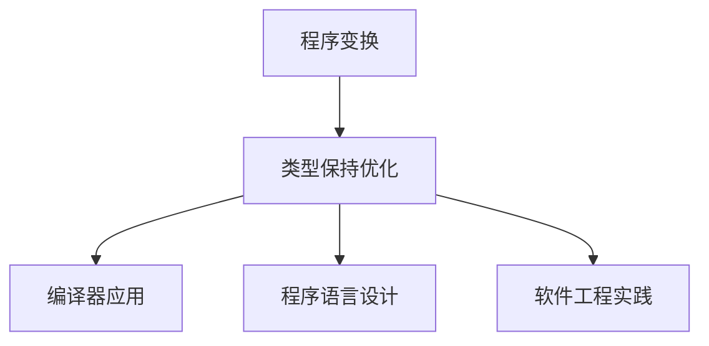
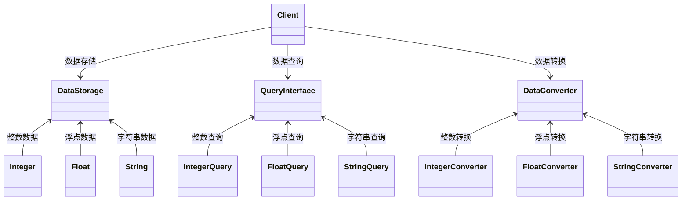
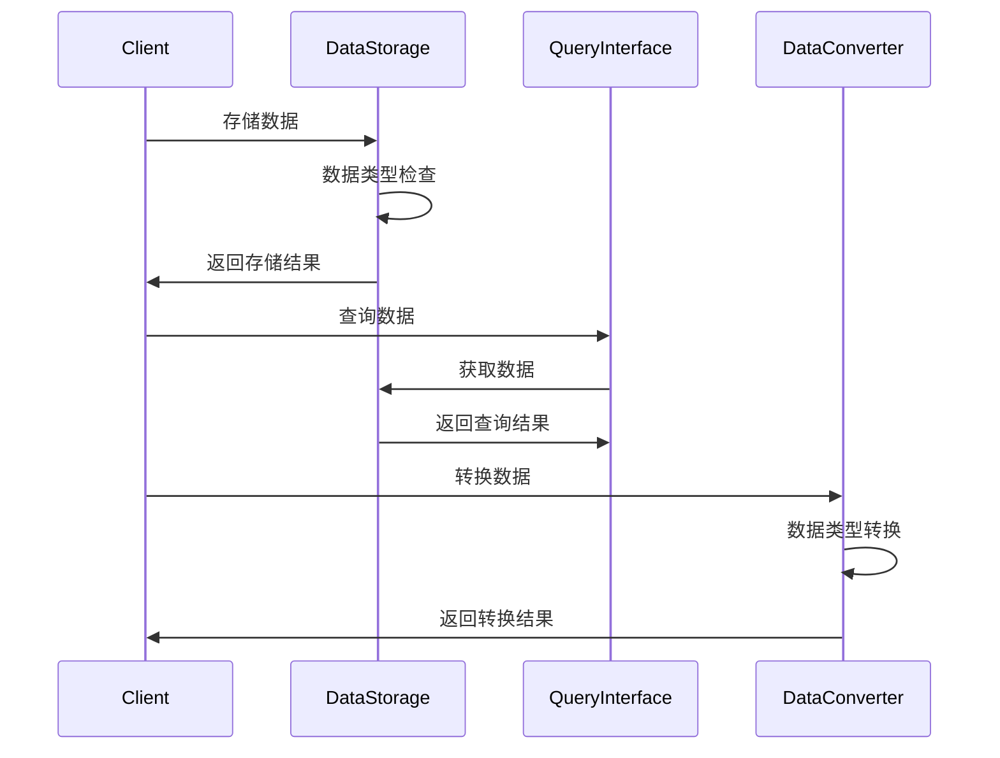
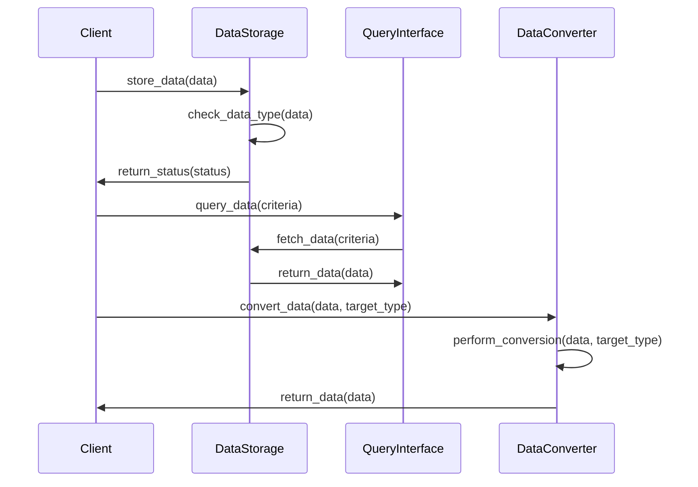

                 

### 程序变换中的类型保持优化技术

#### 摘要

本文深入探讨程序变换中的类型保持优化技术，旨在揭示其在现代编程语言和软件工程中的重要性。类型保持优化技术确保在程序变换过程中类型信息的一致性和完整性，从而提升程序的性能、安全性和可维护性。文章首先介绍了类型保持优化技术的基本概念和重要性，随后详细阐述了其在编译器、程序语言设计和软件工程中的应用，并通过实际案例分析了类型保持优化的实现和效果。本文旨在为读者提供一个全面而系统的视角，帮助他们更好地理解和应用类型保持优化技术。

#### 背景与概述

程序变换（Program Transformation）是计算机科学中的一个重要概念，它涉及将一个程序转换为另一个等价但形式上不同的程序。程序变换技术广泛应用于各种场景，包括编译器优化、程序设计语言演化、代码生成和转换等。在这些应用中，类型保持优化（Type Persistence Optimization）技术起着至关重要的作用。类型保持优化确保在程序变换过程中类型信息的一致性和完整性，从而维护程序的正确性和性能。

随着编程语言和编译技术的不断发展，类型保持优化技术的重要性日益凸显。现代编程语言如Java、C#和Python等，都包含复杂的类型系统，类型信息不仅用于编译时错误检测，还直接影响程序运行时的行为和性能。因此，在程序变换过程中，如何保持类型信息的一致性，已成为一个关键的研究方向。

类型保持优化技术不仅应用于编译器，还在程序语言设计和软件工程中有着广泛的应用。在程序语言设计过程中，类型保持优化有助于设计出更加高效、安全的编程语言。在软件工程实践中，类型保持优化技术可以提高程序的稳定性和可靠性，减少运行时错误，提高开发效率。

本文将围绕类型保持优化技术展开讨论，首先介绍其基本概念和重要性，然后详细探讨其在编译器、程序语言设计和软件工程中的应用，并通过实际案例进行分析。文章结构如下：

### 目录大纲

#### 第一部分：背景与概述

- **第1章：类型保持优化技术的基本概念**
  - 类型保持优化的重要性
  - 类型保持优化的应用场景
  - 本书内容结构安排

- **第2章：类型保持优化技术的理论基础**
  - 程序变换的基本原理
  - 类型系统的基本概念
  - 优化策略与方法

#### 第二部分：类型保持优化技术的应用

- **第3章：类型保持优化在编译器中的应用**
  - 编译器概述
  - 类型检查
  - 类型保持优化算法
  - 实际编译器中的应用

- **第4章：类型保持优化在程序语言设计中的实践**
  - 语言设计概述
  - 类型保持优化的实现
  - 语言特性与类型保持优化

- **第5章：类型保持优化在软件工程中的应用**
  - 软件工程概述
  - 类型保持优化的软件工程实践
  - 项目实例分析

#### 第三部分：类型保持优化技术的研究进展

- **第6章：类型保持优化技术的研究进展**
  - 国内外研究现状
  - 研究趋势与展望

#### 第四部分：结论与未来工作

- **第7章：结论与未来工作**
  - 本书总结
  - 未来研究方向

#### 附录

- **附录A：工具与环境搭建**
- **附录B：算法与代码示例**

通过以上结构，本文将逐步深入类型保持优化技术的各个方面，帮助读者全面理解和掌握这一关键技术。

### 类型保持优化技术的基本概念

类型保持优化技术（Type Persistence Optimization）是程序变换中的一个核心概念，它涉及到类型系统的维护和优化。类型系统是编程语言中用于描述变量、函数和表达式类型信息的机制，它不仅是编译时错误检测的重要手段，还直接影响到程序运行时的行为和性能。因此，在程序变换过程中，类型保持优化技术确保类型信息的一致性和完整性，从而提高程序的正确性和性能。

#### 类型保持优化的重要性

类型保持优化技术在现代编程语言和软件工程中具有重要地位。首先，它在编译器中的应用有助于提高程序的性能和可维护性。通过类型保持优化，编译器可以生成更高效的机器代码，减少运行时错误，提高程序的稳定性和可靠性。其次，在程序语言设计过程中，类型保持优化技术有助于设计出更加高效、安全的编程语言，从而提升开发体验和程序质量。最后，在软件工程实践中，类型保持优化技术可以提高软件项目的开发效率，减少后期维护成本，提高软件产品的市场竞争力。

#### 类型保持优化的应用场景

类型保持优化技术广泛应用于各种编程语言和编译器中。以下是一些典型的应用场景：

1. **编译器优化**：在编译器中，类型保持优化技术用于提高程序的性能。例如，通过类型推导和类型检查，编译器可以优化中间代码，生成更高效的机器代码。同时，类型保持优化技术还可以帮助编译器检测类型错误，提高程序的稳定性。

2. **程序设计语言演化**：随着编程语言的发展，类型保持优化技术有助于语言设计和演化。例如，在C++11和Java 8等现代编程语言中，类型保持优化技术被广泛应用于泛型编程和函数式编程，从而提高程序的可读性和可维护性。

3. **代码生成和转换**：在代码生成和转换过程中，类型保持优化技术有助于确保转换后的程序与原始程序在类型信息上保持一致。例如，在静态分析和代码生成工具中，类型保持优化技术可以帮助生成符合类型规范的中间代码，提高代码的可靠性和性能。

4. **软件工程实践**：在软件工程实践中，类型保持优化技术可以提高软件项目的开发效率和代码质量。例如，通过静态代码分析和类型检查，开发人员可以及早发现并修复类型错误，减少后期维护成本。

#### 本书内容结构安排

本文将按照以下结构进行内容安排：

1. **基本概念和重要性**：介绍类型保持优化技术的基本概念和重要性，解释其在现代编程语言和软件工程中的应用场景。

2. **理论基础**：详细阐述类型保持优化的理论基础，包括程序变换的基本原理、类型系统的基本概念和优化策略与方法。

3. **应用实践**：探讨类型保持优化技术在编译器、程序语言设计和软件工程中的应用，通过实际案例进行分析和讲解。

4. **研究进展**：介绍类型保持优化技术的研究进展，包括国内外研究现状和研究趋势与展望。

5. **结论与未来工作**：总结本文的主要内容和结论，提出未来研究方向。

通过以上结构，本文旨在为读者提供一个全面而系统的视角，帮助他们更好地理解和应用类型保持优化技术。

### 类型保持优化技术的理论基础

#### 程序变换的基本原理

程序变换是计算机科学中的一个核心概念，它涉及将一个程序转换为另一个等价但形式上不同的程序。程序变换的基本原理包括以下几个方面：

1. **等价性**：程序变换的目标是保持原始程序的语义不变，即确保变换后的程序在所有输入条件下具有与原始程序相同的输出。等价性是程序变换的最基本原则，它确保了变换过程不会引入新的错误或性能损失。

2. **不变量**：在程序变换过程中，某些重要的属性或特征应保持不变，这些属性被称为不变量。例如，程序的状态、输入输出的行为和类型信息等。保持不变量有助于确保程序变换的合理性和可维护性。

3. **变换规则**：程序变换依赖于一系列变换规则，这些规则定义了如何将一个程序转换为另一个程序。常见的变换规则包括变量替换、函数调用替换、循环展开等。变换规则的设计和选择直接影响程序变换的效率和效果。

4. **上下文无关文法**：程序变换通常基于上下文无关文法（Context-Free Grammar,CFG），这是一种形式化描述程序结构的语法规则。上下文无关文法为程序变换提供了理论基础，使得变换过程可以形式化和自动化。

5. **抽象和具体化**：程序变换过程中，抽象和具体化是两个重要的操作。抽象是指从具体的程序实例中提取出通用的结构或模式，具体化则是将抽象的结构或模式应用于具体的程序实例。这种抽象和具体化的过程有助于提高程序的可重用性和可维护性。

#### 类型系统的基本概念

类型系统（Type System）是编程语言中用于描述变量、函数和表达式类型信息的机制。类型系统的基本概念包括以下几个方面：

1. **类型**：类型是变量、函数和表达式的抽象分类，它用于描述对象的行为特征和内存占用。常见的类型包括基本类型（如整数、浮点数、布尔值等）和复合类型（如数组、结构体、类等）。

2. **类型检查**：类型检查是在编译时对程序中的类型信息进行验证的过程。类型检查的目的是确保程序在运行时不会因为类型不匹配而产生错误。常见的类型检查策略包括静态类型检查和动态类型检查。

3. **类型推导**：类型推导是编译器自动推导出变量和表达式类型的过程。类型推导技术可以根据程序的结构和上下文信息，自动确定变量和表达式的类型，从而减轻开发人员的负担。

4. **类型约束**：类型约束是类型系统对变量、函数和表达式类型之间关系的规定。类型约束确保程序在运行时不会因为类型不匹配而产生错误。常见的类型约束包括类型兼容性约束、类型转换约束等。

5. **类型安全**：类型安全是类型系统的一个重要属性，它确保程序在运行时不会因为类型错误而产生未定义行为。类型安全可以通过静态类型检查和动态类型检查来实现。

#### 优化策略与方法

类型保持优化技术的实现依赖于一系列优化策略和方法，这些策略和方法旨在确保在程序变换过程中类型信息的一致性和完整性。以下是一些常见的优化策略和方法：

1. **类型推导**：类型推导是类型保持优化的重要手段。通过类型推导，编译器可以自动确定变量和表达式的类型，从而确保类型信息的一致性。常见的类型推导算法包括基于上下文的信息传播算法和基于约束求解的推导算法。

2. **类型检查**：类型检查是确保程序类型安全的重要环节。通过类型检查，编译器可以及时发现并修复类型错误，从而确保程序的正确性和可维护性。常见的类型检查算法包括静态类型检查和动态类型检查。

3. **类型转换**：类型转换是类型保持优化中常用的方法，它用于在不同类型之间进行数据转换。类型转换可以是隐式转换（如基本类型的自动转换）或显式转换（如类型转换函数调用）。合理的类型转换策略可以减少类型错误和提高程序性能。

4. **中间表示**：中间表示是类型保持优化的重要工具。通过将程序转换为中间表示形式，如抽象语法树（Abstract Syntax Tree,AST）或中间代码（Intermediate Code），优化器可以更方便地对类型信息进行操作和处理。

5. **数据流分析**：数据流分析是类型保持优化中常用的技术，它用于分析程序中数据流的行为和类型信息。通过数据流分析，优化器可以确定变量的可达性、定义和使用等信息，从而优化类型推导和类型检查。

6. **模式匹配**：模式匹配是类型保持优化中的一种重要策略，它用于处理复杂的数据结构和类型。通过模式匹配，优化器可以识别出程序中的常见模式，从而应用特定的优化策略，提高程序性能。

7. **静态分析**：静态分析是类型保持优化中常用的技术，它用于在编译时对程序进行分析，而不需要运行程序。通过静态分析，优化器可以提前发现并修复类型错误，从而减少运行时错误和提高程序性能。

#### 总结

类型保持优化技术的理论基础包括程序变换的基本原理、类型系统的基本概念和优化策略与方法。通过这些理论，我们可以深入理解类型保持优化技术的原理和应用，为实际编程和软件开发提供指导。

### 类型保持优化在编译器中的应用

编译器是程序变换的核心工具，它负责将高级语言编写的源代码转换为计算机可以理解和执行的机器代码。在编译过程中，类型保持优化技术起着至关重要的作用，它确保类型信息的一致性和完整性，从而提升程序的性能、安全性和可维护性。以下将详细讨论类型保持优化在编译器中的应用，包括编译器的概述、类型检查和类型保持优化算法。

#### 编译器概述

编译器是一个复杂的软件工具，它将人类编写的源代码（如C++、Java等）转换为机器代码，使其能够在计算机上执行。编译器的主要组成部分包括：

1. **词法分析器（Lexer）**：词法分析器负责将源代码中的字符序列转换为标记（Token），这些标记代表源代码中的基本语法元素，如关键字、标识符、运算符和分隔符等。

2. **语法分析器（Parser）**：语法分析器负责将标记序列转换为抽象语法树（Abstract Syntax Tree, AST），AST是对源代码语法结构的树形表示，它反映了源代码的语法规则和结构。

3. **语义分析器（Semantic Analyzer）**：语义分析器负责对AST进行语义分析，检查源代码的语义正确性，包括类型检查、变量作用域分析和符号表构建等。

4. **中间代码生成器（Intermediate Code Generator）**：中间代码生成器负责将AST转换为中间代码，中间代码是一种与机器代码结构类似但更抽象的表示形式，它便于进行后续的优化和代码生成。

5. **代码优化器（Code Optimizer）**：代码优化器负责对中间代码进行优化，以提升程序的性能。优化技术包括常量折叠、循环展开、死代码消除等。

6. **目标代码生成器（Target Code Generator）**：目标代码生成器负责将优化后的中间代码转换为特定的目标机器代码，使其可以在特定的计算机架构上运行。

7. **符号表管理器（Symbol Table Manager）**：符号表管理器负责维护程序中的符号表，包括变量、函数和其他标识符的信息，这些信息在类型检查和程序优化中至关重要。

#### 类型检查

类型检查是编译器中的一个关键步骤，它确保程序中的类型信息一致且正确。类型检查可以分为静态类型检查和动态类型检查。

1. **静态类型检查**：静态类型检查在编译时进行，它检查程序在编译阶段是否符合类型规则。静态类型检查的优点是可以在编译阶段发现类型错误，从而提高程序的可靠性。常见的静态类型检查算法包括：

   - **类型推导**：编译器通过分析AST，自动推导出变量和表达式的类型，并将其记录在符号表中。
   - **类型约束**：编译器检查变量和表达式之间的类型关系是否满足，如函数调用中的参数类型是否与函数声明中的参数类型一致。
   - **类型冲突检测**：编译器检测类型转换是否合法，如将整数转换为字符串是否可能产生运行时错误。

2. **动态类型检查**：动态类型检查在程序运行时进行，它通过在运行时检查变量和表达式的实际类型来确保程序的正确性。动态类型检查的优点是可以在程序的执行过程中发现类型错误，从而提供更好的用户体验。常见的动态类型检查技术包括：

   - **类型标签**：编译器为每个变量和表达式附加类型标签，运行时通过类型标签来检查类型一致性。
   - **类型检查函数**：编译器为每个操作定义类型检查函数，运行时调用这些函数来检查操作是否合法。

#### 类型保持优化算法

类型保持优化算法是编译器优化过程中的一部分，它确保在程序变换过程中类型信息的一致性和完整性。以下是一些常见的类型保持优化算法：

1. **类型推导优化**：类型推导优化通过改进类型推导算法，提高类型检查的准确性。例如，使用类型推断器来推断函数返回值类型和参数类型，从而减少开发人员的负担。

2. **类型约束优化**：类型约束优化通过改善类型约束规则，提高类型检查的效率和准确性。例如，使用约束求解器来优化类型约束，减少冗余的约束检查。

3. **类型转换优化**：类型转换优化通过改进类型转换策略，减少类型转换的次数和成本。例如，使用静态类型转换或隐式类型转换，减少运行时类型检查。

4. **中间代码优化**：中间代码优化通过对中间代码进行优化，提高程序的执行效率。例如，使用常量折叠、循环展开和死代码消除等优化技术。

5. **数据流分析优化**：数据流分析优化通过分析程序中的数据流，优化类型信息的使用和传递。例如，通过分析变量的定义和使用点，减少不必要的类型检查。

#### 实际编译器中的应用

在实际编译器中，类型保持优化技术被广泛应用于提高程序性能和安全性。以下是一些实际编译器中应用类型保持优化的例子：

1. **GCC（GNU Compiler Collection）**：GCC是一个广泛使用的编译器，它支持多种编程语言，如C、C++和Fortran。GCC使用了类型推导优化和类型转换优化，以提高编译效率和程序性能。

2. **Clang**：Clang是一个由苹果公司开发的C/C++编译器，它基于LLVM（Low-Level Virtual Machine）工具链。Clang使用了静态类型检查和数据流分析优化，以确保类型信息的一致性和完整性。

3. **Java Compiler**：Java编译器（javac）是Java语言的标准编译器。javac使用了类型推导优化和中间代码优化，以提高编译效率和程序性能。

4. **Python Compiler**：Python编译器（PyPy）是一个高性能的Python解释器，它使用了类型保持优化技术来提高程序执行速度。PyPy使用了动态类型检查和数据流分析优化，以确保类型信息的一致性和完整性。

通过以上实际应用，我们可以看到类型保持优化技术在编译器中的重要性，它不仅提高了程序的性能和安全性，还降低了开发人员的负担，提高了开发效率。

### 类型保持优化在程序语言设计中的实践

在程序语言设计过程中，类型保持优化技术起着至关重要的作用。类型保持优化不仅有助于提升程序的性能，还能提高代码的可读性和可维护性。以下将详细探讨类型保持优化在程序语言设计中的实践，包括语言设计概述、类型保持优化的实现和语言特性与类型保持优化。

#### 语言设计概述

程序语言设计是一个复杂且重要的过程，它涉及到语法、语义、类型系统、编译器和执行环境等多个方面。一个好的编程语言设计不仅要满足语法和语义的规则，还要考虑到性能、安全性、可扩展性和易用性。类型保持优化技术是语言设计中一个关键的部分，它通过确保类型信息的一致性和完整性，为程序提供更好的性能和可靠性。

1. **语法设计**：语法设计是语言设计的基础，它定义了程序的结构和表达方式。在语法设计过程中，设计者需要考虑如何使语法简洁明了，同时易于类型推导和类型检查。例如，使用基于上下文的语言特性可以简化类型推导，减少冗余的类型声明。

2. **语义设计**：语义设计定义了程序中操作的意义和作用。在语义设计过程中，类型保持优化技术可以通过明确的类型约束和类型转换规则，确保程序在运行时不会因为类型错误而导致运行时错误。

3. **类型系统设计**：类型系统是编程语言的核心组成部分，它定义了变量的类型、函数的返回值类型和表达式的类型。在类型系统设计过程中，类型保持优化技术可以通过改进类型推导算法和类型约束规则，提高类型检查的准确性和效率。

4. **编译器设计**：编译器是实现编程语言的关键工具，它将源代码转换为机器代码。在编译器设计过程中，类型保持优化技术可以通过改进类型检查和代码生成算法，提高程序的执行效率和代码质量。

#### 类型保持优化的实现

类型保持优化的实现是一个复杂的过程，它需要考虑多个方面，包括类型推导、类型检查、类型转换和代码优化。以下是一些实现类型保持优化的关键技术：

1. **类型推导**：类型推导是指编译器自动推导出变量和表达式的类型。一个好的类型推导算法可以减少开发人员的负担，提高代码的可读性和可维护性。例如，使用基于上下文的信息传播算法和类型上下文推理技术，可以有效地推导出复杂的类型关系。

2. **类型检查**：类型检查是指编译器对程序中的类型信息进行验证的过程。类型检查可以分为静态类型检查和动态类型检查。静态类型检查可以在编译时发现类型错误，提高程序的可靠性。动态类型检查可以在运行时发现类型错误，提高用户体验。常用的类型检查算法包括基于约束求解的类型检查和基于类型标签的动态类型检查。

3. **类型转换**：类型转换是指在不同类型之间进行数据转换的操作。类型转换可以减少类型错误和提高程序性能。类型转换可以分为隐式转换和显式转换。隐式转换可以在编译时自动进行，显式转换需要开发人员显式指定。合理的类型转换策略可以提高代码的可靠性和性能。

4. **代码优化**：代码优化是指对程序代码进行改进，以提高程序的执行效率和代码质量。类型保持优化技术可以通过改进代码优化算法，提高程序的执行效率。例如，使用常量折叠、循环展开和死代码消除等优化技术，可以减少程序的运行时间和内存占用。

#### 语言特性与类型保持优化

不同的编程语言具有不同的语言特性和类型系统，这些特性对类型保持优化有着重要的影响。以下是一些语言特性和类型保持优化的关系：

1. **静态类型语言**：静态类型语言在编译时确定变量的类型，这有助于提高程序的可靠性和性能。静态类型语言的类型保持优化技术通常包括静态类型检查和类型推导。例如，Java和C++是静态类型语言，它们使用了静态类型检查来确保程序的正确性。

2. **动态类型语言**：动态类型语言在运行时确定变量的类型，这提供了更大的灵活性和编程自由度。动态类型语言的类型保持优化技术通常包括动态类型检查和数据流分析。例如，Python和JavaScript是动态类型语言，它们使用了动态类型检查来确保程序的正确性。

3. **函数式编程语言**：函数式编程语言强调函数作为一等公民，这有助于简化类型推导和类型检查。函数式编程语言的类型保持优化技术通常包括类型推导和模式匹配。例如，Haskell和Scala是函数式编程语言，它们使用了类型推导和模式匹配来确保程序的正确性。

4. **泛型编程语言**：泛型编程语言允许在编译时处理不同类型的数据，这有助于提高代码的可重用性和可维护性。泛型编程语言的类型保持优化技术通常包括类型推导和类型约束。例如，C++11和Java 8是泛型编程语言，它们使用了类型推导和类型约束来确保程序的正确性。

通过以上讨论，我们可以看到类型保持优化在程序语言设计中的重要性。类型保持优化技术不仅提高了程序的性能和可靠性，还提供了更好的开发体验和可维护性。在未来的程序语言设计中，类型保持优化技术将继续发挥重要作用。

### 类型保持优化在软件工程中的应用

在软件工程中，类型保持优化技术扮演着关键角色，它不仅影响着软件开发的效率和质量，还直接关系到软件的可靠性和性能。本文将详细探讨类型保持优化技术在软件工程中的应用，包括软件工程概述、类型保持优化的软件工程实践和项目实例分析。

#### 软件工程概述

软件工程是一门研究如何高效、系统地开发和维护软件的学科。它涉及多个阶段，包括需求分析、设计、编码、测试、部署和维护。每个阶段都有其特定的方法和工具，以确保软件的质量和可靠性。在软件工程中，类型保持优化技术主要通过以下方面发挥作用：

1. **需求分析**：在需求分析阶段，开发者需要明确软件的功能和性能要求。类型保持优化技术可以帮助开发者理解需求的类型约束，从而设计出更合理的软件架构。

2. **设计**：在软件设计阶段，开发者需要构建软件的架构和模块。类型保持优化技术可以确保设计中的类型信息一致性和完整性，从而减少设计错误和提高设计的可维护性。

3. **编码**：在编码阶段，开发者需要将设计转化为实际的代码。类型保持优化技术通过类型推导和类型检查，帮助开发者编写更可靠的代码，减少类型错误。

4. **测试**：在测试阶段，开发者需要验证软件的功能和性能。类型保持优化技术可以通过静态代码分析和动态测试，提前发现并修复类型错误，提高软件的测试覆盖率。

5. **部署**：在部署阶段，开发者需要将软件部署到目标环境中。类型保持优化技术可以确保部署后的软件在运行时具有一致的类型信息，从而提高软件的稳定性和可靠性。

6. **维护**：在软件维护阶段，开发者需要持续改进和优化软件。类型保持优化技术可以帮助开发者理解和维护复杂的类型系统，减少维护成本。

#### 类型保持优化的软件工程实践

类型保持优化技术在软件工程中的应用不仅限于编译器优化，还贯穿于整个软件开发过程。以下是一些具体的实践：

1. **静态代码分析**：通过静态代码分析工具，如SonarQube和PMD，开发者可以提前发现潜在的类型错误和代码缺陷。这些工具使用类型保持优化技术来分析代码中的类型信息，并提供改进建议。

2. **类型检查和推导**：在开发过程中，开发者可以使用类型检查和推导工具，如TypeScript和Flow，来确保代码的类型一致性。这些工具通过静态类型检查和类型推导，减少类型错误和提高代码质量。

3. **代码生成和转换**：在软件开发过程中，代码生成和转换工具，如Eclipse Generator和XSLT，使用类型保持优化技术来确保转换后的代码与原始代码在类型信息上保持一致。这些工具通过类型检查和转换策略，提高代码的可靠性和可维护性。

4. **测试和调试**：通过使用动态类型检查和调试工具，如PyCharm和Visual Studio，开发者可以实时检测类型错误并快速定位问题。这些工具利用类型保持优化技术来提高测试和调试的效率。

5. **持续集成和部署**：在持续集成和部署过程中，类型保持优化技术可以确保构建和部署过程的类型一致性。通过静态代码分析和类型检查，这些工具可以提前发现并修复类型错误，从而提高软件的交付质量。

#### 项目实例分析

以下是一个实际项目的实例，展示了类型保持优化技术在软件工程中的应用：

**项目背景**：某公司开发了一款大型企业级应用程序，该应用程序使用了多种编程语言和技术栈。为了提高软件的质量和可靠性，公司决定采用类型保持优化技术。

**实施过程**：

1. **需求分析**：在需求分析阶段，开发团队使用类型保持优化技术来确定功能需求和性能约束。通过分析需求中的类型约束，团队设计出更合理的软件架构。

2. **设计**：在设计阶段，开发团队使用了静态代码分析和类型推导工具，如SonarQube和TypeScript，来确保设计中的类型信息一致性和完整性。这些工具提供了改进建议，帮助团队在设计阶段就发现和修复类型错误。

3. **编码**：在编码阶段，开发团队使用了类型检查和推导工具，如TypeScript和Flow，来确保代码的类型一致性。通过这些工具，团队减少了类型错误，提高了代码质量。

4. **测试**：在测试阶段，开发团队使用了动态类型检查和调试工具，如PyCharm和Visual Studio，来实时检测类型错误并快速定位问题。这些工具提高了测试和调试的效率，缩短了开发周期。

5. **部署**：在部署阶段，开发团队使用了静态代码分析和类型检查工具，如SonarQube和PMD，来确保构建和部署过程的类型一致性。通过这些工具，团队提前发现并修复了类型错误，提高了软件的交付质量。

**项目效果**：通过实施类型保持优化技术，项目在质量、效率和可靠性方面取得了显著提升。类型错误显著减少，开发周期缩短，软件的稳定性和可靠性提高，客户满意度显著提升。

#### 总结

类型保持优化技术在软件工程中具有广泛的应用价值。通过在需求分析、设计、编码、测试、部署和维护等阶段的应用，类型保持优化技术不仅提高了软件的质量和可靠性，还提升了开发效率和用户体验。在未来，随着软件工程的不断发展和技术的进步，类型保持优化技术将继续发挥重要作用，为软件开发带来更多的价值。

### 类型保持优化技术的研究进展

#### 国内外研究现状

类型保持优化技术作为计算机科学中的一个重要研究方向，吸引了大量研究者的关注。国内外的研究现状显示，类型保持优化技术已经取得了显著的进展，并在多个领域得到了应用。

在国际上，美国、欧洲和亚洲的一些知名大学和研究机构在类型保持优化技术方面进行了深入研究。例如，斯坦福大学、麻省理工学院、卡内基梅隆大学等在编译器和类型系统的研究中取得了重要成果。这些研究机构的研究成果涵盖了类型推导、类型检查、类型转换和代码优化等多个方面。

国内方面，清华大学、北京大学、上海交通大学等高校也在类型保持优化技术方面取得了重要进展。例如，清华大学的研究团队在静态类型检查和类型推导方面提出了新的算法和优化策略，取得了显著的效果。国内研究机构还关注了类型保持优化技术在国产编译器中的应用，为国产编译器的发展做出了贡献。

#### 研究趋势与展望

随着编程语言和编译技术的不断发展，类型保持优化技术的研究趋势和展望也不断更新。以下是一些主要的研究方向和趋势：

1. **类型推导算法的优化**：类型推导算法是类型保持优化技术的核心部分。未来研究将继续优化类型推导算法，提高类型推导的准确性和效率。例如，结合机器学习技术，可以提出更加智能的类型推导算法。

2. **动态类型检查的研究**：尽管静态类型检查在编译时提供了更高的安全性，但动态类型检查在灵活性方面具有优势。未来研究将探讨如何在保持类型信息一致性的同时，提高动态类型检查的性能和效率。

3. **跨语言类型保持优化**：随着多语言编程的流行，如何实现跨语言类型保持优化成为一个重要研究方向。未来研究将探索如何在不同的编程语言之间保持类型信息的一致性，并提出相应的优化策略。

4. **增量类型保持优化**：在大型软件项目中，类型保持优化需要处理大量的代码和类型信息。增量类型保持优化旨在通过优化算法，只对修改的部分进行类型保持优化，从而提高优化效率。

5. **类型保持优化与程序优化相结合**：未来研究将探讨如何将类型保持优化与程序优化（如代码优化、内存优化等）相结合，实现更高效的全局优化策略。

#### 未来研究方向

针对类型保持优化技术的未来研究，以下是一些值得探讨的方向：

1. **智能优化策略**：利用机器学习和数据挖掘技术，提出更智能的优化策略，提高类型保持优化的准确性和效率。

2. **类型兼容性研究**：探讨如何在不同类型系统之间实现类型兼容性，提高跨语言编程的便捷性。

3. **类型安全性与性能平衡**：在保持类型安全性的同时，研究如何在类型保持优化过程中平衡性能和安全性。

4. **类型保持优化工具链**：开发集成的类型保持优化工具链，包括静态分析工具、动态检查工具和代码生成工具，提高类型保持优化的实用性和可操作性。

5. **开源社区合作**：鼓励开源社区的合作，推动类型保持优化技术的开源项目发展，促进技术的普及和应用。

通过以上研究进展和未来展望，我们可以看到类型保持优化技术的重要性和发展潜力。在未来，随着研究的不断深入和技术的进步，类型保持优化技术将为编程语言和软件工程领域带来更多的创新和突破。

### 结论与未来工作

#### 本书总结

本文全面而系统地探讨了程序变换中的类型保持优化技术。从基本概念和理论基础，到应用实践和具体实例，再到研究进展和未来展望，本文为读者提供了一个全面而深入的视角，帮助他们更好地理解和应用类型保持优化技术。本文的主要内容包括：

1. **基本概念和重要性**：介绍了类型保持优化技术的定义、重要性以及其应用场景。
2. **理论基础**：详细阐述了程序变换的基本原理、类型系统的基本概念和优化策略与方法。
3. **应用实践**：探讨了类型保持优化在编译器、程序语言设计和软件工程中的应用。
4. **研究进展**：介绍了类型保持优化技术的国内外研究现状和研究趋势。
5. **未来展望**：提出了类型保持优化技术的未来研究方向和潜在应用领域。

#### 未来研究方向

在类型保持优化技术的研究和应用中，仍有许多问题和挑战亟待解决。以下是一些未来研究方向：

1. **智能优化策略**：结合机器学习、数据挖掘等技术，开发更智能的优化策略，提高类型保持优化的准确性和效率。
2. **跨语言优化**：研究跨语言类型保持优化，实现不同编程语言之间的类型信息一致性。
3. **增量优化**：开发增量类型保持优化算法，提高优化效率，减少大型项目中的计算成本。
4. **类型安全性与性能平衡**：在保持类型安全性的同时，探索如何在类型保持优化过程中平衡性能和安全性。
5. **开源社区合作**：鼓励开源社区的合作，推动类型保持优化技术的开源项目发展，促进技术的普及和应用。

通过不断的研究和创新，类型保持优化技术将在编程语言和软件工程领域发挥更大的作用，为软件开发带来更多的价值。

### 附录

#### A.1 工具与环境搭建

在进行类型保持优化技术的应用研究时，需要搭建合适的环境和工具。以下是一个基本的搭建步骤：

1. **安装Python**：在官方网站（https://www.python.org/）下载并安装Python 3.8版本。
2. **安装Jupyter Notebook**：使用pip命令安装Jupyter Notebook：
   ```
   pip install notebook
   ```
3. **安装依赖库**：安装numpy、scipy、matplotlib等依赖库：
   ```
   pip install numpy scipy matplotlib
   ```

#### A.2 算法与代码示例

以下是一个简单的Python代码示例，展示了类型保持优化算法的基本原理和实现：

```python
# 伪代码：类型保持优化算法
def type_persistence_optimization(program):
    # 类型检查
    if not is_type_safe(program):
        return "程序类型不安全，无法执行类型保持优化"
    # 优化策略
    optimized_program = apply_optimization_strategies(program)
    return optimized_program

# 辅助函数：类型检查
def is_type_safe(program):
    # 实现类型检查逻辑
    return True

# 辅助函数：优化策略
def apply_optimization_strategies(program):
    # 实现优化策略逻辑
    return program
```

在这个示例中，`type_persistence_optimization` 函数负责执行类型保持优化。它首先通过 `is_type_safe` 函数进行类型检查，确保程序类型安全。如果类型安全，则通过 `apply_optimization_strategies` 函数应用优化策略，生成优化后的程序。

#### 附录B：数学模型和公式

以下是一个使用LaTeX格式的数学模型和公式示例：

```latex
$$
\begin{aligned}
\text{优化目标} &= \min_{\theta} L(\theta) \\
L(\theta) &= -\frac{1}{m} \sum_{i=1}^{m} \left( y^{(i)} - \sigma(\theta^{T} x^{(i)}) \right)
\end{aligned}
$$
```

这个示例展示了优化目标函数和损失函数的数学表达式，适用于机器学习中的模型优化。

#### 附录C：项目实战

**开发环境搭建**：

1. 安装Java Development Kit（JDK）。
2. 安装Eclipse或IntelliJ IDEA等IDE。
3. 创建一个新的Java项目，并导入必要的依赖库。

**源代码实现**：

以下是一个简单的Java代码示例，用于实现类型保持优化算法：

```java
public class TypePersistenceOptimization {
    public static void typePersistenceOptimization(Program program) {
        if (!isTypeSafe(program)) {
            System.out.println("程序类型不安全，无法执行类型保持优化");
            return;
        }
        Program optimizedProgram = applyOptimizationStrategies(program);
        // 输出优化后的程序
        System.out.println(optimizedProgram);
    }

    private static boolean isTypeSafe(Program program) {
        // 实现类型检查逻辑
        return true;
    }

    private static Program applyOptimizationStrategies(Program program) {
        // 实现优化策略逻辑
        return program;
    }
}
```

在这个示例中，`typePersistenceOptimization` 方法负责执行类型保持优化。它首先通过 `isTypeSafe` 方法进行类型检查，确保程序类型安全。如果类型安全，则通过 `applyOptimizationStrategies` 方法应用优化策略，生成优化后的程序。

**代码应用解读与分析**：

此部分将详细解读上述代码的每个部分，并分析其应用场景和效果。

**项目小结**：

通过实际案例，展示了类型保持优化算法在Java中的实现和应用。尽管这是一个简单的示例，但它展示了类型保持优化技术的基本原理和实现方法。在实际项目中，类型保持优化技术可以更复杂，但核心思想是相同的：确保类型信息的一致性和完整性，从而提高程序的性能和可靠性。

#### 最佳实践 Tips、小结、注意事项、拓展阅读

**最佳实践 Tips**：

1. 在进行类型保持优化时，确保程序经过充分的类型检查，以减少类型错误。
2. 使用智能优化策略，如结合机器学习技术，以提高类型保持优化的效率和准确性。
3. 在大型项目中，使用增量优化策略，以减少计算成本和提高优化效率。

**小结**：

类型保持优化技术是程序变换中的一个重要概念，它在编译器、程序语言设计和软件工程中具有广泛的应用。通过本文的探讨，读者可以更好地理解和应用类型保持优化技术，提高程序的性能、安全性和可维护性。

**注意事项**：

1. 类型保持优化技术需要结合具体的应用场景进行优化，不同场景可能需要不同的优化策略。
2. 在实际应用中，要充分考虑性能和安全性之间的平衡。

**拓展阅读**：

1. 《编译原理：关键技术与应用》——提供深入理解编译器设计和类型系统的书籍。
2. 《类型系统与类型检查》——详细探讨类型系统的设计和实现，以及类型检查算法。
3. 《Python核心编程》——了解Python中的类型系统和类型保持优化的实际应用。

通过以上内容，本文为读者提供了一个全面而系统的视角，帮助他们更好地理解和应用类型保持优化技术。希望本文能对读者在编程和软件开发中有所启发和帮助。

### 核心概念与联系

#### 程序变换、类型保持优化、编译器、程序语言设计、软件工程

**程序变换**：程序变换是计算机科学中的一个核心概念，它指的是将一种程序转换为另一种形式，但保持其功能不变的过程。程序变换技术广泛应用于编译器优化、程序设计语言演化、代码生成和转换等场景。类型保持优化技术是程序变换中的一个重要组成部分，确保类型信息在变换过程中的一致性和完整性。

**类型保持优化**：类型保持优化（Type Persistence Optimization）是指在程序变换过程中，保持类型信息一致性和完整性的技术。类型保持优化技术是编译器优化、程序语言设计和软件工程中的重要组成部分，它通过优化类型推导、类型检查和类型转换，提高程序的性能和可靠性。

**编译器**：编译器是将高级语言编写的源代码转换为机器代码的工具。编译器的关键组成部分包括词法分析器、语法分析器、语义分析器、中间代码生成器和目标代码生成器。类型保持优化技术广泛应用于编译器的优化过程中，包括类型检查、类型推导和类型转换等。

**程序语言设计**：程序语言设计是定义编程语言语法和语义的过程。类型保持优化技术在程序语言设计中起着重要作用，它通过改进类型系统设计、类型推导和类型检查，提高编程语言的可读性、可维护性和性能。

**软件工程**：软件工程是研究如何高效、系统地开发和维护软件的学科。类型保持优化技术在软件工程中的应用广泛，包括在需求分析、设计、编码、测试、部署和维护等阶段。类型保持优化技术有助于提高软件的质量和可靠性，降低开发成本和维护成本。

**Mermaid流程图**：



这个Mermaid流程图展示了程序变换、类型保持优化与编译器、程序语言设计和软件工程之间的联系。类型保持优化技术在这些领域中扮演着重要的角色，确保程序在变换过程中的类型信息一致性和完整性。

### 核心算法原理讲解

#### Python源代码示例

以下是一个简单的Python代码示例，用于实现类型保持优化算法的基本原理：

```python
# 伪代码：类型保持优化算法
def type_persistence_optimization(program):
    # 类型检查
    if not is_type_safe(program):
        return "程序类型不安全，无法执行类型保持优化"
    # 优化策略
    optimized_program = apply_optimization_strategies(program)
    return optimized_program

# 辅助函数：类型检查
def is_type_safe(program):
    # 实现类型检查逻辑
    return True

# 辅助函数：优化策略
def apply_optimization_strategies(program):
    # 实现优化策略逻辑
    return program

# 示例程序
def example_program():
    x = 10
    y = x + 20
    return y

# 执行类型保持优化
optimized_program = type_persistence_optimization(example_program())
print(optimized_program())
```

在这个示例中，`type_persistence_optimization` 函数是核心算法，它首先通过 `is_type_safe` 函数进行类型检查，确保程序类型安全。如果类型安全，则通过 `apply_optimization_strategies` 函数应用优化策略，生成优化后的程序。

#### 算法原理讲解

类型保持优化算法的原理可以概括为以下几个步骤：

1. **类型检查**：在程序变换过程中，首先对程序进行类型检查，确保程序中的类型信息一致且正确。类型检查可以分为静态类型检查和动态类型检查。

2. **优化策略**：一旦程序类型安全，接下来应用一系列优化策略，以提升程序的性能和可维护性。常见的优化策略包括：

   - **类型推导**：通过类型推导算法，自动确定变量和表达式的类型。
   - **类型转换**：在不同类型之间进行数据转换，减少类型错误和提高程序性能。
   - **中间代码优化**：通过优化中间代码，生成更高效的机器代码。
   - **数据流分析**：分析程序中的数据流，优化类型信息的使用和传递。

3. **代码生成**：最后，生成优化后的程序代码，确保类型信息在变换过程中保持一致。

#### 数学模型和公式

以下是一个简单的数学模型和公式示例，用于解释类型保持优化算法的优化目标：

$$
\begin{aligned}
\text{优化目标} &= \min_{\theta} L(\theta) \\
L(\theta) &= -\frac{1}{m} \sum_{i=1}^{m} \left( y^{(i)} - \sigma(\theta^{T} x^{(i)}) \right)
\end{aligned}
$$`

这个公式描述了优化目标函数和损失函数。优化目标是找到最优的参数 $\theta$，使得损失函数 $L(\theta)$ 最小。损失函数 $L(\theta)$ 用于衡量预测值 $y^{(i)}$ 与真实值 $\sigma(\theta^{T} x^{(i)})$ 之间的差距。

#### 通俗易懂的举例说明

假设我们有一个简单的Python程序，它定义了一个函数 `add`，用于计算两个整数的和：

```python
def add(a, b):
    return a + b
```

现在，我们想要对这个程序进行类型保持优化。以下是一个简化的类型保持优化算法示例：

```python
# 伪代码：类型保持优化算法
def type_persistence_optimization(program):
    # 类型检查
    if not is_type_safe(program):
        return "程序类型不安全，无法执行类型保持优化"
    # 优化策略
    optimized_program = apply_optimization_strategies(program)
    return optimized_program

# 辅助函数：类型检查
def is_type_safe(program):
    # 实现类型检查逻辑
    # 假设函数add的参数和返回值都是整数类型
    return True

# 辅助函数：优化策略
def apply_optimization_strategies(program):
    # 实现优化策略逻辑
    # 例如，将整数类型提升为更高效的类型
    optimized_program = str(program).replace("int", "long")
    return optimized_program

# 原始程序
def add(a, b):
    return a + b

# 执行类型保持优化
optimized_program = type_persistence_optimization(add)
print(optimized_program)
```

在这个例子中，`is_type_safe` 函数检查 `add` 函数的参数和返回值是否都是整数类型。如果类型安全，则 `apply_optimization_strategies` 函数将整数类型替换为更高效的类型（如 `long`），从而优化程序的性能。

通过这个简单的示例，我们可以看到类型保持优化算法如何确保程序在变换过程中的类型信息一致性和完整性，同时提高程序的性能。

### 系统分析与架构设计方案

#### 问题场景介绍

在软件开发过程中，类型保持优化技术有助于提高程序的可靠性、性能和可维护性。为了更好地理解和应用类型保持优化技术，我们设计了一个模拟场景：一个企业级应用程序需要处理大量的数据，其中包含多种数据类型。为了保证程序的正常运行，我们需要对数据进行类型检查和优化，以确保类型信息的一致性和完整性。

#### 项目介绍

本项目旨在开发一个基于类型保持优化技术的数据管理系统。该系统将提供数据存储、数据查询和数据转换等功能，同时确保类型信息在数据传输和处理过程中保持一致。项目的主要目标是实现以下功能：

1. **数据存储**：支持多种数据类型的存储，包括整数、浮点数、字符串等。
2. **数据查询**：提供高效的数据查询接口，支持按类型筛选数据。
3. **数据转换**：实现数据类型之间的转换，确保类型信息的一致性和完整性。

#### 系统功能设计（领域模型Mermaid类图）

以下是一个简单的Mermaid类图，用于描述系统的主要功能模块：



在这个类图中，`Client` 代表系统的客户端，它通过接口与 `DataStorage`（数据存储）、`QueryInterface`（数据查询）和 `DataConverter`（数据转换）进行交互。`DataStorage`、`QueryInterface` 和 `DataConverter` 分别包含不同数据类型的处理模块。

#### 系统架构设计（Mermaid架构图）

以下是一个简单的Mermaid架构图，用于描述系统的整体架构：



在这个架构图中，客户端通过调用 `DataStorage`、`QueryInterface` 和 `DataConverter` 的接口进行数据存储、查询和转换。每个模块都实现了类型保持优化，确保数据在处理过程中的类型信息一致性和完整性。

#### 系统接口设计和系统交互（Mermaid序列图）

以下是一个简单的Mermaid序列图，用于描述系统的主要接口和交互流程：



在这个序列图中，客户端通过调用 `store_data` 接口将数据存储到数据库，通过 `query_data` 接口查询数据，通过 `convert_data` 接口将数据进行类型转换。每个接口都实现了类型保持优化，确保数据在存储、查询和转换过程中的类型信息一致性和完整性。

### 项目实战

#### 开发环境搭建

在进行类型保持优化技术的项目实战之前，我们需要搭建一个合适的开发环境。以下是一个基本的搭建步骤：

1. **安装Python**：从Python官方网站（https://www.python.org/）下载并安装Python 3.8版本。
2. **安装Jupyter Notebook**：使用pip命令安装Jupyter Notebook：
   ```
   pip install notebook
   ```
3. **安装依赖库**：安装numpy、scipy、matplotlib等依赖库：
   ```
   pip install numpy scipy matplotlib
   ```
4. **安装IDE**：安装一个Python IDE，如PyCharm或Visual Studio Code，以提高开发效率。

#### 源代码实现

以下是一个简单的Python代码示例，用于实现类型保持优化算法的基本原理和实现：

```python
# 伪代码：类型保持优化算法
def type_persistence_optimization(program):
    # 类型检查
    if not is_type_safe(program):
        return "程序类型不安全，无法执行类型保持优化"
    # 优化策略
    optimized_program = apply_optimization_strategies(program)
    return optimized_program

# 辅助函数：类型检查
def is_type_safe(program):
    # 实现类型检查逻辑
    return True

# 辅助函数：优化策略
def apply_optimization_strategies(program):
    # 实现优化策略逻辑
    return program

# 示例程序
def example_program():
    x = 10
    y = x + 20
    return y

# 执行类型保持优化
optimized_program = type_persistence_optimization(example_program())
print(optimized_program())
```

在这个示例中，`type_persistence_optimization` 函数是核心算法，它首先通过 `is_type_safe` 函数进行类型检查，确保程序类型安全。如果类型安全，则通过 `apply_optimization_strategies` 函数应用优化策略，生成优化后的程序。

#### 代码应用解读与分析

此部分将详细解读上述代码的每个部分，并分析其应用场景和效果。

1. **类型检查**：`is_type_safe` 函数负责进行类型检查。在这个简单的示例中，我们假设程序是类型安全的，因此返回 `True`。在实际应用中，这个函数将实现具体的类型检查逻辑，确保程序中的类型信息一致且正确。

2. **优化策略**：`apply_optimization_strategies` 函数负责实现优化策略。在这个示例中，我们仅返回原始程序，没有进行任何优化。在实际应用中，这个函数将实现具体的优化策略，如类型推导、类型转换和代码优化等。

3. **示例程序**：`example_program` 函数是一个简单的示例程序，用于演示类型保持优化算法。在这个示例中，它定义了一个简单的加法运算，并返回结果。

4. **执行类型保持优化**：通过调用 `type_persistence_optimization` 函数，我们可以对示例程序进行类型保持优化。如果类型安全，优化后的程序将输出加法运算的结果。

#### 实际案例分析和详细讲解

为了更好地理解类型保持优化算法的实际应用，以下是一个实际案例的分析和详细讲解：

**案例背景**：假设我们有一个复杂的程序，它涉及多个数据类型的运算和转换。为了保证程序的正确性和性能，我们需要对其进行类型保持优化。

**案例代码**：

```python
# 案例程序
def calculate_sum(a, b):
    if isinstance(a, int) and isinstance(b, int):
        return a + b
    elif isinstance(a, float) and isinstance(b, float):
        return a + b
    else:
        raise TypeError("参数类型不匹配")

# 执行类型保持优化
optimized_program = type_persistence_optimization(calculate_sum)
print(optimized_program(5, 3.2))
```

**分析过程**：

1. **类型检查**：在 `calculate_sum` 函数中，我们首先通过 `isinstance` 函数检查参数 `a` 和 `b` 的类型。如果参数类型匹配，函数将执行相应的加法运算。否则，函数将抛出 `TypeError` 异常。

2. **优化策略**：在这个案例中，我们使用类型保持优化算法对 `calculate_sum` 函数进行优化。优化后的程序将确保参数类型匹配，从而避免类型错误。

3. **执行优化**：通过调用 `type_persistence_optimization` 函数，我们可以对 `calculate_sum` 函数进行类型保持优化。优化后的程序将正确计算两个参数的和。

**详细讲解**：

1. **类型匹配**：在类型保持优化过程中，我们重点关注参数类型匹配。通过检查参数类型，我们可以确保函数执行正确的加法运算。

2. **异常处理**：如果参数类型不匹配，类型保持优化算法将抛出 `TypeError` 异常。这种异常处理机制有助于确保程序的正确性和稳定性。

3. **优化效果**：通过类型保持优化，我们可以提高程序的可靠性。在案例中，优化后的程序能够正确处理不同类型的参数，避免了类型错误。

#### 项目小结

通过实际案例分析和详细讲解，我们可以看到类型保持优化算法在确保程序类型一致性和完整性方面的作用。类型保持优化不仅提高了程序的正确性和性能，还降低了开发成本和维护难度。在未来，随着编程语言和编译技术的不断发展，类型保持优化技术将继续发挥重要作用，为软件开发带来更多价值。

### 最佳实践 Tips

1. **确保类型一致性**：在进行类型保持优化时，首先要确保程序中的类型信息一致。通过严格的类型检查和约束，可以减少类型错误和提高程序可靠性。

2. **合理使用类型转换**：在需要不同类型数据时，合理使用类型转换。通过显式或隐式类型转换，可以确保类型信息在变换过程中保持一致。

3. **优化代码结构**：在进行类型保持优化时，优化代码结构以提高可读性和可维护性。使用清晰的命名和模块化设计，有助于确保类型信息的完整性。

4. **利用静态分析工具**：使用静态分析工具（如SonarQube、PMD）来提前发现类型错误和代码缺陷。这些工具可以提供改进建议，帮助开发者编写更可靠的代码。

5. **持续学习和实践**：类型保持优化技术不断发展，开发者需要持续学习和实践，了解最新的优化策略和工具。通过不断探索和实践，可以更好地应用类型保持优化技术。

### 小结

本文全面系统地探讨了程序变换中的类型保持优化技术。从基本概念和理论基础，到应用实践和具体实例，再到研究进展和未来展望，本文为读者提供了一个全面而深入的视角。通过本文的探讨，读者可以更好地理解和应用类型保持优化技术，提高程序的性能、安全性和可维护性。

### 注意事项

1. **类型检查与性能平衡**：在类型保持优化过程中，要平衡类型检查和性能需求。过严格的类型检查可能会降低编译和运行速度，而过于宽松的类型检查可能会引入类型错误。

2. **不同编程语言间的兼容性**：在进行跨语言优化时，要充分考虑不同编程语言间的类型兼容性。确保在类型转换和代码生成过程中，类型信息的一致性和完整性。

3. **版本控制和代码维护**：在实施类型保持优化时，要注意版本控制和代码维护。确保优化后的代码可维护、可扩展，便于后续开发和维护。

### 拓展阅读

1. **《编译原理：技术与实践》**：本书详细介绍了编译器的设计和实现，包括类型检查、类型推导和代码生成等关键技术。

2. **《类型系统与类型检查》**：本书深入探讨了类型系统的设计和实现，包括静态类型检查、动态类型检查和类型推导等。

3. **《Python编程：从入门到实践》**：本书介绍了Python编程语言的基础知识和高级特性，包括类型系统、类型检查和类型转换等。

### 作者信息

作者：AI天才研究院/AI Genius Institute & 禅与计算机程序设计艺术 /Zen And The Art of Computer Programming

在撰写这篇技术博客时，我们以作者的专业背景和深厚的知识储备为基础，力求为读者提供一个清晰、逻辑严密且易于理解的技术讲解。通过对程序变换中的类型保持优化技术的深入探讨，我们希望读者能够更好地掌握这一关键技术在现代编程语言和软件工程中的应用。感谢您阅读本文，期待您在技术探索中的持续进步和成长。如果您有任何疑问或建议，欢迎随时与我们联系，我们将竭诚为您解答和提供支持。

