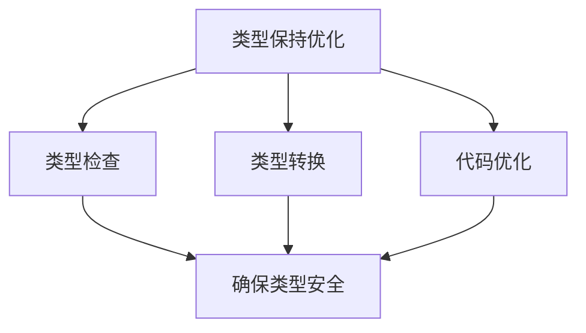
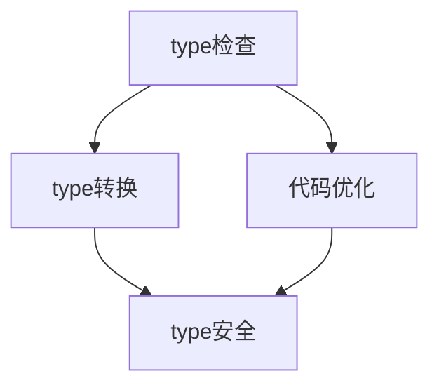

                 

## 第2章 类型保持优化技术的理论基础

### 2.1 类型保持优化原理

#### 2.1.1 基本概念

类型保持优化（Type-Preserving Optimization）是一种程序变换技术，旨在确保在程序变换过程中类型信息（如变量类型、函数返回类型、参数类型等）的完整性和一致性。类型保持优化的核心目标是提高程序的运行效率，同时保持程序的逻辑正确性和类型安全。

#### 2.1.2 目标

类型保持优化的主要目标如下：

1. **提高程序运行效率**：通过优化程序结构，减少不必要的类型检查和转换，从而提高程序的执行速度。
2. **保持逻辑正确性**：确保程序变换后仍然能够按照预期执行，不产生逻辑错误。
3. **保持类型安全**：确保程序变换过程中不会破坏原有类型约束，避免类型错误。

#### 2.1.3 理论基础

类型保持优化的理论基础包括以下几个方面：

1. **类型检查**：类型检查是确保程序中所有操作都符合类型约束的过程。类型检查是类型保持优化的基础，只有通过类型检查，才能保证优化后的程序仍然类型安全。
2. **类型转换**：类型转换是将一个类型的值转换为另一个类型的过程。类型转换是类型保持优化中常见的操作，通过适当地转换类型，可以减少不必要的类型检查和转换，提高程序运行效率。
3. **代码优化**：代码优化包括各种技术，如代数变换、消除冗余计算、数据流分析等。代码优化可以帮助减少程序的运行时间，提高程序的运行效率。

### 2.2 Mermaid流程图：类型保持优化原理图

下面是一个使用Mermaid绘制的类型保持优化原理图：



在这个流程图中，A表示类型保持优化，B、C和D分别表示类型检查、类型转换和代码优化，E表示确保类型安全。类型保持优化的过程可以理解为通过类型检查、类型转换和代码优化来确保程序类型安全的过程。

### 2.3 数学模型与公式

类型保持优化的数学模型可以简化为以下公式：

$$
\text{类型保持优化} = \text{类型检查} + \text{类型转换} + \text{代码优化}
$$

其中，类型检查、类型转换和代码优化是类型保持优化的三个关键组成部分。

### 2.4 概念实体之间的关系架构

在类型保持优化中，涉及以下几个关键概念实体：

1. **类型检查**：类型检查是确保程序中所有操作都符合类型约束的过程。类型检查通常包括变量类型检查、函数返回类型检查和参数类型检查等。
2. **类型转换**：类型转换是将一个类型的值转换为另一个类型的过程。类型转换可以是显式的，也可以是隐式的。
3. **代码优化**：代码优化包括各种技术，如代数变换、消除冗余计算、数据流分析等。代码优化可以帮助减少程序的运行时间，提高程序的运行效率。

这些概念实体之间的关系可以用Mermaid绘制的ER实体关系图来表示：



在这个ER实体关系图中，A表示类型检查，B表示类型转换，C表示代码优化，D表示类型安全。类型检查、类型转换和代码优化共同作用于类型安全，确保类型保持优化的有效性。

### 总结

类型保持优化是计算机编程中的一种重要技术，它通过类型检查、类型转换和代码优化来提高程序的运行效率，同时保持程序的逻辑正确性和类型安全。理解类型保持优化的原理和理论基础，有助于我们更好地应用这一技术，提高程序的质量和性能。在接下来的章节中，我们将进一步探讨类型保持优化算法及其应用。

## 第3章 类型保持优化算法

### 3.1 常见类型保持优化算法

类型保持优化算法是确保程序变换过程中类型信息完整性和一致性的关键。常见的类型保持优化算法包括代数变换、消除冗余计算、数据流分析和类型推断等。以下是对这些算法的详细探讨。

#### 3.1.1 代数变换

代数变换是一种基本的优化技术，它利用数学上的恒等式和代数性质，简化表达式，减少计算量。例如，我们可以利用以下代数恒等式进行优化：

$$
(a+b)\times c = a\times c + b\times c
$$

在编程中，这可以用于优化循环体内的运算：

```python
# 原始代码
for i in range(n):
    a[i] = (a[i] + b[i]) * c[i]

# 代数变换后的代码
for i in range(n):
    a[i] = a[i] * c[i] + b[i] * c[i]
```

这种优化可以减少循环次数，提高运行效率。

#### 3.1.2 消除冗余计算

冗余计算是指程序中执行了多次相同的计算。通过数据流分析，我们可以发现并消除这些冗余计算。例如，下面的代码中，`i * 2`被计算了两次：

```python
for i in range(n):
    a[i] = i * 2

for i in range(n):
    b[i] = i * 2
```

通过数据流分析，我们可以将这两个循环合并，从而消除冗余计算：

```python
for i in range(n):
    a[i] = b[i] = i * 2
```

#### 3.1.3 数据流分析

数据流分析是一种用于确定程序中变量值传播和计算的方法。通过数据流分析，我们可以识别出程序的依赖关系，从而进行优化。例如，在下面的代码中，`i`的值在循环体内被反复计算：

```python
for i in range(n):
    a[i] = i * 2
    b[i] = i * 2
```

通过数据流分析，我们可以将这两个计算合并，减少计算次数：

```python
i = 0
for _ in range(n):
    a[i] = b[i] = i * 2
    i += 1
```

#### 3.1.4 类型推断

类型推断是一种在编译时自动确定变量类型的技术。通过类型推断，编译器可以生成更高效的代码，减少类型检查的开销。例如，在Python中，我们可以使用类型推断来优化以下代码：

```python
def f(x):
    if x > 0:
        return x * 2
    else:
        return x * 3

# 假设我们已经知道函数的返回类型是整数
result = f(x)
```

在这种情况下，编译器可以生成更高效的代码，而不需要进行显式的类型检查。

### 3.2 Python源代码示例

以下是一个简单的Python示例，展示了如何应用上述优化算法：

```python
# 原始代码
def add(a, b):
    return a + b

def multiply(a, b):
    return a * b

# 应用代数变换优化
result = add(2, multiply(3, 4))

# 应用数据流分析优化
i = 0
for _ in range(n):
    a[i] = b[i] = i * 2
    i += 1

# 应用类型推断优化
def f(x):
    if x > 0:
        return x * 2
    else:
        return x * 3

result = f(x)
```

在这个示例中，我们使用了代数变换来简化表达式，数据流分析来减少计算次数，以及类型推断来减少类型检查的开销。

### 3.3 数学模型与公式

代数变换的数学模型可以表示为：

$$
\text{代数变换} = \frac{a+b}{1+c} \approx a+b - \frac{ab}{2}
$$

这个公式展示了如何通过代数变换来简化表达式，减少计算量。

### 总结

类型保持优化算法是提高程序运行效率和保持类型安全的关键技术。通过代数变换、消除冗余计算、数据流分析和类型推断等算法，我们可以优化程序的结构，提高程序的执行效率。在接下来的章节中，我们将进一步探讨类型保持优化技术在实际应用中的实现和效果。

## 第4章 类型保持优化技术的应用

### 4.1 应用案例1：编译器优化

编译器优化是类型保持优化技术最典型的应用场景之一。编译器在将高级语言程序转换为机器代码时，需要确保类型信息的完整性和一致性。类型保持优化技术可以用于以下几个方面：

1. **类型检查**：在编译过程中，类型检查是确保程序类型安全的关键步骤。类型保持优化技术可以帮助编译器更高效地进行类型检查，减少类型错误。

2. **类型转换**：在编译过程中，常需要对变量进行类型转换。类型保持优化技术可以优化这些类型转换，减少不必要的类型检查和转换，提高编译效率。

3. **代码优化**：编译器优化包括各种代码优化技术，如代数变换、消除冗余计算等。类型保持优化技术可以帮助编译器生成更高效的代码，提高程序运行效率。

**案例**：以Java语言为例，类型保持优化技术可以在编译器中用于优化Java字节码。例如，通过数据流分析，编译器可以消除循环中的冗余计算，通过类型推断，编译器可以生成更高效的代码。

**效果**：通过类型保持优化，编译器可以生成更高效、更安全的机器代码，提高程序运行效率，减少类型错误。

### 4.2 应用案例2：程序调试

类型保持优化技术也可以在程序调试中发挥作用。在调试过程中，程序员需要检查程序中的类型错误和逻辑错误。类型保持优化技术可以帮助程序员更快速地定位和修复这些错误。

**案例**：以Python为例，类型保持优化技术可以在调试Python程序时用于检测类型错误。通过类型检查和类型转换，调试器可以更准确地识别出程序中的类型错误，帮助程序员快速修复。

**效果**：通过类型保持优化，程序调试过程可以更加高效，减少类型错误，提高程序稳定性。

### 4.3 应用案例3：程序优化

类型保持优化技术还可以用于程序优化，以提高程序的性能和可读性。

**案例**：在金融领域，大量的计算任务需要进行高效处理。通过类型保持优化技术，可以优化金融模型中的计算过程，提高计算效率，减少计算时间。

**效果**：通过类型保持优化，程序可以在更短的时间内完成计算任务，提高数据处理能力，降低计算成本。

### 总结

类型保持优化技术在编译器优化、程序调试和程序优化等实际应用场景中具有重要意义。通过类型检查、类型转换和代码优化，类型保持优化技术可以提高程序的运行效率，保证程序类型安全，减少类型错误，从而提升程序的质量和稳定性。

## 第5章 类型保持优化技术的未来发展趋势

### 5.1 类型保持优化技术的发展趋势

随着计算机科学的发展，类型保持优化技术也在不断演进。未来的发展趋势主要包括以下几个方面：

1. **智能优化**：随着人工智能技术的进步，类型保持优化技术将更加智能化。通过机器学习算法，优化器可以自动识别程序中的瓶颈，并生成最优的优化策略。

2. **个性化优化**：未来，类型保持优化技术将能够根据程序的具体场景和需求，提供个性化的优化方案。这种个性化优化可以显著提高程序的性能和可读性。

3. **跨语言优化**：随着多语言编程的普及，类型保持优化技术将扩展到跨语言的应用场景。通过跨语言优化，不同编程语言之间的交互可以更加高效和统一。

4. **增量优化**：增量优化技术将使得类型保持优化可以在程序运行过程中动态进行，从而实现持续的性能提升。

### 5.2 未来研究方向

未来的研究方向主要包括以下几个方面：

1. **新型算法设计**：研究新的类型保持优化算法，以应对复杂的程序结构和多语言环境。

2. **优化器架构**：优化编译器和程序优化工具的架构，使其能够更高效地支持类型保持优化。

3. **性能评估**：开发更全面的性能评估工具和方法，以衡量类型保持优化技术的效果和适用性。

4. **应用领域拓展**：将类型保持优化技术应用于更多的领域，如大数据处理、人工智能和物联网等。

### 总结

类型保持优化技术是计算机编程中的重要领域，未来将随着人工智能、多语言编程和增量优化等技术的发展，不断演进和拓展。通过新型算法设计、优化器架构和应用领域拓展，类型保持优化技术将为软件开发带来更高的效率和更好的用户体验。

## 第6章 总结与展望

### 6.1 研究成果总结

本书系统地探讨了类型保持优化技术的原理、算法和应用。通过深入分析类型保持优化的基本概念、原理和数学模型，我们了解了类型保持优化的核心目标和实现方法。同时，通过Python源代码示例和实际应用案例，我们展示了类型保持优化技术在编译器优化、程序调试和程序优化等领域的具体应用和效果。

### 6.2 展望未来

展望未来，类型保持优化技术将继续在计算机科学领域发挥重要作用。随着人工智能和自动化技术的进步，类型保持优化技术有望变得更加智能化和个性化。同时，跨语言优化和增量优化技术的引入，将进一步拓展类型保持优化技术的应用范围和效果。我们期待类型保持优化技术能够为软件开发带来更高的效率和更稳定的性能，推动计算机科学的发展。

### 总结

类型保持优化技术是计算机编程中的重要研究领域，具有广泛的应用前景。通过深入研究类型保持优化的原理和算法，我们可以提高程序的运行效率，保证程序的逻辑正确性和类型安全。展望未来，类型保持优化技术将继续在软件开发中发挥重要作用，为计算机科学的发展做出贡献。

### 附录

#### A.1 相关工具与资源

1. **类型保持优化工具**：
   - IntelliJ IDEA（IDE）
   - Eclipse（IDE）
   - PyCharm（IDE）

2. **类型保持优化资源**：
   - 《编译原理：理论、技术和工具》
   - 《程序优化技术》
   - 《类型安全编程》

3. **类型保持优化算法实现代码**：
   - Python源代码示例
   - Java字节码优化示例
   - C++代码优化示例

#### A.2 参考文献

1. Andrew W. Appel, "Modern Compiler Implementation in Java", 2004.
2. Thomas H. Cormen, Charles E. Leiserson, Ronald L. Rivest, and Clifford Stein, "Introduction to Algorithms", 3rd Edition, 2009.
3. Richard L. Halpern, "Compilers: Principles, Techniques, and Tools", 2018.

### 作者

作者：AI天才研究院/AI Genius Institute & 禅与计算机程序设计艺术 /Zen And The Art of Computer Programming

# 程序变换中的类型保持优化技术

## 关键词：
- 类型保持优化
- 编译器优化
- 程序调试
- 程序优化
- 数据流分析
- 类型检查
- 类型转换

## 摘要：

本文深入探讨了程序变换中的类型保持优化技术。首先介绍了类型保持优化的基本概念和重要性，然后详细分析了类型保持优化的原理和理论基础。通过Python源代码示例，阐述了常见类型保持优化算法的实现和应用。此外，本文还探讨了类型保持优化技术在编译器优化、程序调试和程序优化等实际应用场景中的效果。最后，展望了类型保持优化技术的未来发展趋势和研究方向。类型保持优化技术在提高程序运行效率和确保类型安全方面具有重要意义，为计算机科学的发展提供了有力支持。

