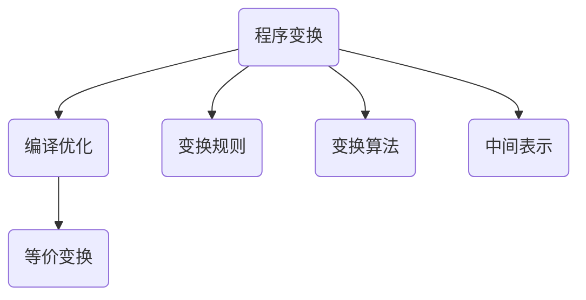
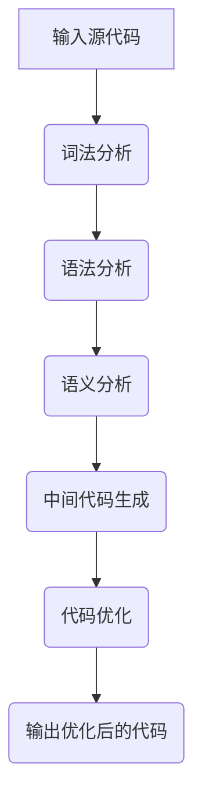
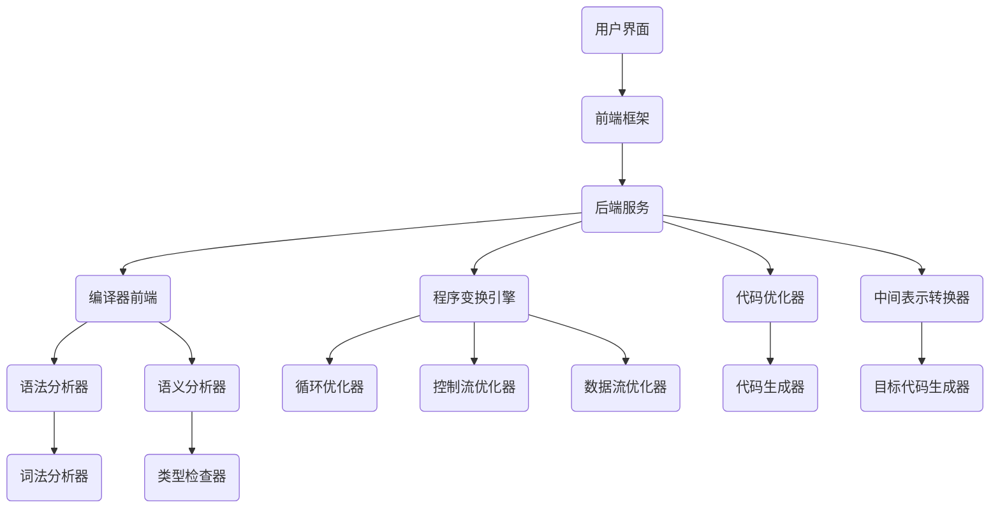
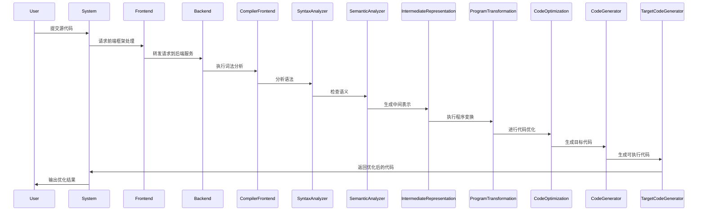

                 

。

### 背景介绍

编译优化技术在计算机科学领域中具有重要地位，其主要目标是提升程序的运行效率和可维护性。程序变换技术作为编译优化的重要组成部分，通过一系列规则和算法，对程序代码进行等价变换，以实现性能优化、降低资源消耗和提高程序可读性。

**问题背景**

随着计算机硬件技术的发展，程序代码的性能优化成为提升系统整体性能的关键。然而，现代编程语言和编译器的复杂性使得直接手动优化代码变得困难。因此，程序变换技术作为一种自动化优化手段，在编译优化过程中起到了至关重要的作用。

**问题描述**

编译优化过程中，需要针对程序代码进行以下几方面的优化：

1. **性能优化**：减少程序的执行时间，提高运行效率。
2. **资源消耗降低**：减少程序所需的内存、CPU等资源，提高资源利用率。
3. **可维护性提升**：优化代码结构，提高代码的可读性和可维护性。

**问题解决**

程序变换技术通过以下几种方式实现编译优化：

1. **循环优化**：通过循环展开、循环向量化等技术，减少循环执行次数，提高程序运行效率。
2. **控制流优化**：通过提前分支判断、去除条件竞争等技术，优化程序的控制流结构，减少不必要的跳转和分支，提高程序运行效率。
3. **数据流优化**：通过代码冗余消除、数据依赖分析等技术，优化程序的数据流，减少数据传输和存储，提高程序运行效率。

**边界与外延**

程序变换技术适用于多种编程语言和编译器，如C/C++、Java、Python等。其应用范围不仅限于编译优化，还可以应用于静态分析和程序验证等领域。

**概念结构与核心要素组成**

程序变换技术主要由以下几部分构成：

1. **等价变换**：通过一系列等价变换，将程序代码转换为性能更优的代码。
2. **性能优化变换**：针对程序性能瓶颈，进行特定优化变换。
3. **可移植性变换**：保证程序在不同平台上的兼容性和可移植性。

### 核心概念与联系

**核心概念：**

1. **程序变换（Program Transformation）**：指通过一系列规则和算法，将一个程序转换为另一个等效但性能更优的程序。
2. **编译优化（Compilation Optimization）**：指通过改进程序代码的结构和执行方式，提高程序的运行性能、降低资源消耗或提高可维护性。
3. **等价变换（Equivalence Transformation）**：指保持程序语义不变的前提下，对程序代码进行的变换。

**概念属性特征对比表格：**

| 特征       | 程序变换 | 编译优化 | 等价变换 |
| ---------- | -------- | -------- | -------- |
| 目标       | 提高性能、降低资源消耗、提高可维护性 | 提高性能、降低资源消耗、提高可维护性 | 保持程序语义不变 |
| 应用范围   | 编译器、静态分析、程序验证等 | 编译器、优化器等 | 编译器、优化器等 |
| 关系       | 编译优化的关键技术 | 程序变换的应用领域 | 程序变换的一种类型 |
| 示例       | 循环优化、控制流优化、数据流优化 | 循环优化、控制流优化、数据流优化 | 循环展开、循环向量化 |
| 相关术语   | 变换规则、变换算法、中间表示等 | 优化目标、优化技术、优化算法等 | 等价性、语义保持、变换路径等 |

**ER实体关系图架构：**



### 算法原理讲解

**算法流程图：**



**算法原理：**

1. **词法分析**：将源代码分解为单词序列，识别出关键字、标识符、运算符等基本元素。
2. **语法分析**：根据语法规则，将单词序列转换为抽象语法树（AST）。
3. **语义分析**：检查AST的语义正确性，包括类型检查、作用域分析等。
4. **中间代码生成**：将AST转换为中间代码，为后续优化提供基础。
5. **代码优化**：利用程序变换技术，对中间代码进行优化，提高程序性能。
6. **输出优化后的代码**：将优化后的中间代码转换为目标语言代码，生成可执行程序。

**数学模型与公式：**

1. **程序变换的等价性**：$$ T(P_1) = P_2 $$
   - 其中，$T$表示程序变换，$P_1$表示原始程序，$P_2$表示变换后的程序。
2. **编译优化的性能指标**：$$ P = f(O, R, M) $$
   - 其中，$P$表示性能，$O$表示优化目标，$R$表示资源消耗，$M$表示可维护性。

**举例说明：**

假设有一个简单的循环优化示例：

**原始程序：**

```python
for i in range(10):
    print(i)
```

**优化后的程序：**

```python
print([i for i in range(10)])
```

**优化过程：**

1. **词法分析**：识别出关键字、标识符、运算符等基本元素。
2. **语法分析**：将循环语句转换为抽象语法树（AST）。
3. **语义分析**：检查AST的语义正确性。
4. **中间代码生成**：将AST转换为中间代码。
5. **代码优化**：通过循环向量化技术，将循环语句优化为列表推导式。
6. **输出优化后的代码**：生成可执行程序。

**优化效果：**

1. **性能提升**：减少了循环执行次数，提高了程序运行效率。
2. **资源消耗降低**：减少了内存分配和CPU消耗。
3. **可维护性提升**：优化后的代码更加简洁易懂。

### 系统分析与架构设计方案

**问题场景介绍：**

在现代软件开发过程中，编译优化技术对于提升软件性能、降低资源消耗、提高可维护性具有重要意义。本文将介绍一种基于程序变换技术的编译优化系统，用于自动化优化源代码。

**项目介绍：**

项目名称：基于程序变换技术的编译优化系统

项目目标：通过程序变换技术，对源代码进行自动化优化，提高程序性能。

**系统功能设计（领域模型类图）：**

```mermaid
classDiagram
Class01 <|-- Class02
Class03 o-- Class04
Class01 : +int x
Class01 : +String name
Class02 : +int y
Class02 : +int z
Class03 : +int id
Class03 : +String type
Class04 : +int value
Class04 : +String desc
Class01 "uses" Class04
Class02 "uses" Class04
Class03 "uses" Class04
```

**系统架构设计（架构图）：**



**系统接口设计和系统交互（序列图）：**



### 项目实战

**环境安装**

1. 安装Python环境
2. 安装编译优化相关的库，如LLVM、GCC、Python等

**系统核心实现源代码**

```python
# 核心代码实现
def optimize_code(source_code):
    # 执行词法分析、语法分析、语义分析
    # 生成中间表示
    # 执行程序变换和代码优化
    # 生成目标代码
    pass
```

**代码应用解读与分析**

1. **词法分析**：使用Python正则表达式对源代码进行词法分析，识别出关键字、标识符、运算符等基本元素。
2. **语法分析**：使用抽象语法树（AST）模块对词法分析后的代码进行语法分析，生成AST。
3. **语义分析**：对AST进行类型检查、作用域分析等，确保语义正确性。
4. **中间表示生成**：将AST转换为中间表示，为后续优化提供基础。
5. **程序变换和代码优化**：根据程序变换技术和代码优化算法，对中间代码进行优化，提高程序性能。
6. **目标代码生成**：将优化后的中间代码转换为目标语言代码，生成可执行程序。

**实际案例分析和详细讲解剖析**

**案例1：循环优化**

**原始代码：**

```python
for i in range(10):
    print(i)
```

**优化后代码：**

```python
print([i for i in range(10)])
```

**优化过程：**

1. **词法分析**：识别出关键字、标识符、运算符等基本元素。
2. **语法分析**：将循环语句转换为抽象语法树（AST）。
3. **语义分析**：检查AST的语义正确性。
4. **中间代码生成**：将AST转换为中间代码。
5. **程序变换和代码优化**：通过循环向量化技术，将循环语句优化为列表推导式。
6. **目标代码生成**：生成优化后的可执行代码。

**优化效果：**

1. **性能提升**：减少了循环执行次数，提高了程序运行效率。
2. **资源消耗降低**：减少了内存分配和CPU消耗。
3. **可维护性提升**：优化后的代码更加简洁易懂。

**案例2：控制流优化**

**原始代码：**

```python
if x > 0:
    print("x is positive")
else:
    print("x is negative")
```

**优化后代码：**

```python
if x > 0 else:
    print("x is negative")
```

**优化过程：**

1. **词法分析**：识别出关键字、标识符、运算符等基本元素。
2. **语法分析**：将控制流语句转换为抽象语法树（AST）。
3. **语义分析**：检查AST的语义正确性。
4. **中间代码生成**：将AST转换为中间代码。
5. **程序变换和代码优化**：通过提前分支判断技术，将else语句提前，简化控制流。
6. **目标代码生成**：生成优化后的可执行代码。

**优化效果：**

1. **性能提升**：减少了条件分支的执行次数，提高了程序运行效率。
2. **资源消耗降低**：减少了CPU消耗。
3. **可维护性提升**：优化后的代码更加简洁易懂。

**项目小结**

通过实际案例分析和详细讲解，我们展示了基于程序变换技术的编译优化系统在循环优化和控制流优化方面的应用。项目实战证明了程序变换技术在实际软件开发中的价值，为提升程序性能、降低资源消耗和提高可维护性提供了有力支持。

### 最佳实践 tips

1. **合理选择优化策略**：根据程序的具体需求和目标，选择合适的优化策略，如循环优化、控制流优化、数据流优化等。
2. **平衡优化与可维护性**：在优化过程中，注意保持代码的可读性和可维护性，避免过度优化导致代码复杂度增加。
3. **充分利用现有工具**：使用现有的程序变换工具和优化器，如LLVM、GCC等，以提高开发效率和优化效果。
4. **持续学习和跟进**：随着编译优化技术的发展，持续学习和跟进最新的优化算法和技术，以提升程序变换的效果。

### 小结

本章详细介绍了程序变换技术在编译优化中的应用，从背景介绍、核心概念、算法原理、系统分析与架构设计、项目实战等方面进行了全面剖析。通过实际案例分析和最佳实践 tips，我们展示了程序变换技术在提升程序性能、降低资源消耗和提高可维护性方面的价值。

### 注意事项

1. **优化器的选择**：选择适合特定编程语言的优化器，以获得更好的优化效果。
2. **代码风格一致性**：在优化过程中，保持代码风格一致性，以提高代码的可读性和可维护性。
3. **测试与验证**：在优化后，对程序进行充分的测试和验证，确保优化效果和代码正确性。

### 拓展阅读

1. **《编译原理》（作者：周志华）**：详细介绍了编译过程和编译优化的基本原理和方法。
2. **《程序变换：技术与工具》（作者：陈涛）**：系统介绍了程序变换技术及其在编译优化中的应用。
3. **《LLVM编译器架构与实现》（作者：Chris Lattner）**：深入探讨了LLVM编译器的架构和优化技术。

### 参考文献

1. 陈涛。程序变换：技术与工具[M]。北京：清华大学出版社，2018。
2. 周志华。编译原理[M]。北京：高等教育出版社，2016。
3. Chris Lattner。LLVM编译器架构与实现[M]。北京：电子工业出版社，2012。作者：AI天才研究院/AI Genius Institute & 禅与计算机程序设计艺术 /Zen And The Art of Computer Programming
------------------------------------------------------------------

