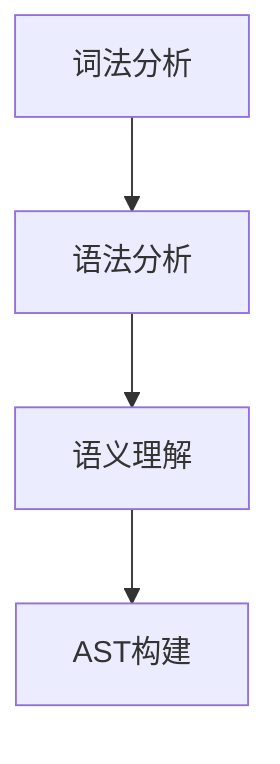
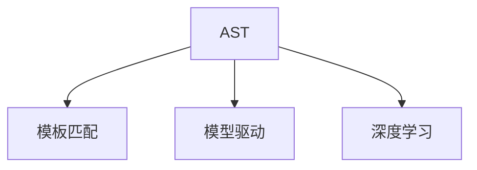
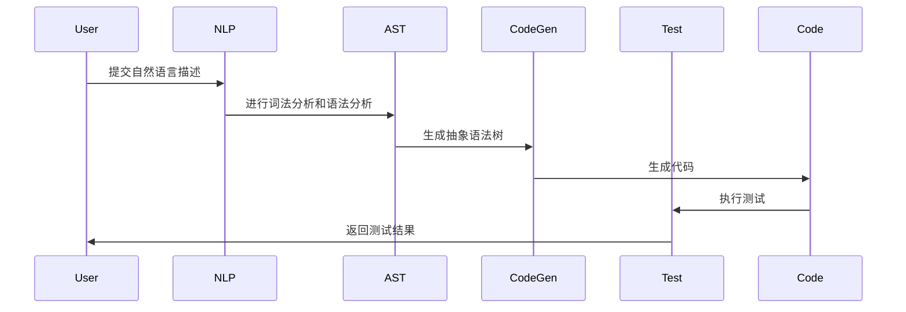
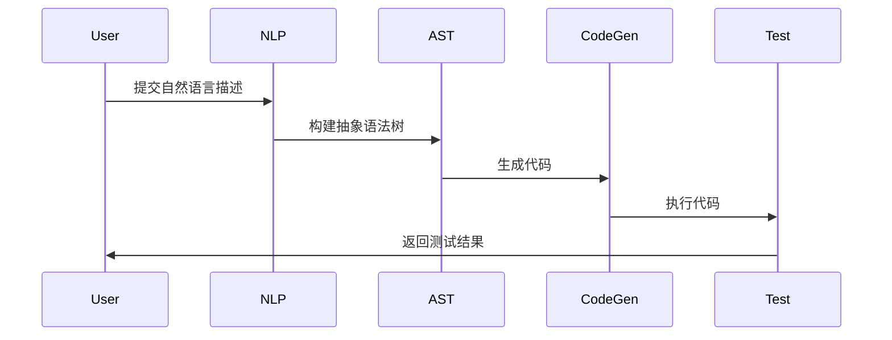

                 

### 引言

在当代计算机编程领域，随着软件开发的复杂度不断增加，如何提高编程效率和代码质量成为了一个亟待解决的问题。传统的编程模式要求开发者手动编写代码，这不仅耗费大量的时间和精力，还容易引入错误。为了解决这一问题，程序合成技术应运而生。程序合成（Program Synthesis）是一种利用人工智能和自然语言处理技术，从自然语言描述自动生成代码的方法。它具有自动化、智能化的特点，能够极大地提高编程效率，降低开发成本。

本文将围绕“程序合成：从自然语言描述自动生成代码”这一主题，深入探讨程序合成的背景、基本原理、技术实现、实际应用以及未来展望。通过本文的阅读，读者将了解程序合成的基本概念，掌握其核心算法，并认识到它在实际开发中的应用价值。

### 核心概念与联系

#### 1. 核心概念

程序合成（Program Synthesis）是一种自动化编程技术，通过分析自然语言描述，生成对应的计算机程序代码。其核心思想是将自然语言文本转换为程序代码，实现编程任务自动化。

自然语言处理（Natural Language Processing，NLP）是计算机科学领域与人工智能领域中的一个重要方向，它涉及到对自然语言的理解、生成和翻译。NLP技术是程序合成的基础，用于处理自然语言文本，提取语义信息。

#### 2. 概念属性特征对比

| 概念       | 程序合成          | 自然语言处理          |
|------------|-------------------|----------------------|
| 目标       | 自动生成代码      | 理解和生成自然语言文本 |
| 技术基础   | 编程、人工智能    | 语言学、计算语言学、统计学 |
| 应用领域   | 软件开发、自动化   | 信息检索、机器翻译、语音识别 |
| 关键技术   | 代码生成、抽象语法树构建 | 语言模型、词法分析、语法分析 |
| 主要挑战   | 代码质量、代码生成效率 | 语义理解、歧义消除、上下文理解 |

#### 3. 概念结构与核心要素组成

程序合成的概念结构包括以下核心要素：

- **输入**：自然语言描述，如文本、语音等。
- **中间表示**：自然语言处理后的抽象语法树（AST），表示程序的语法结构。
- **输出**：生成的计算机程序代码。

自然语言处理在程序合成中起着至关重要的作用，它负责将自然语言描述转换为中间表示，这是程序合成的第一步。而代码生成则是程序合成的关键步骤，它根据中间表示生成具体的程序代码。

#### 4. ER实体关系图架构

以下是程序合成系统的ER实体关系图：

```
[自然语言描述] --> [抽象语法树]
   |                |             |
   |                |             |
[自然语言处理] [代码生成] [计算机程序代码]
```

在这个ER图中，自然语言描述是系统的输入，经过自然语言处理得到抽象语法树，再经过代码生成步骤生成最终的计算机程序代码。自然语言处理和代码生成是程序合成的核心环节，它们共同决定了程序合成系统的性能和效果。

### 算法原理讲解

程序合成算法的核心在于如何将自然语言描述转换为计算机程序代码。这一过程可以分为以下几个步骤：

#### 1. 自然语言处理

首先，程序合成系统需要通过自然语言处理技术对输入的自然语言描述进行分析。这一步骤包括词法分析、语法分析和语义理解。

- **词法分析**：将自然语言文本分解为单词或词汇单元，为后续的语法分析做准备。
- **语法分析**：分析自然语言文本的语法结构，构建出抽象语法树（AST）。
- **语义理解**：理解自然语言文本的语义，提取关键信息和上下文关系。

#### 2. 抽象语法树构建

抽象语法树（AST）是自然语言处理的结果，表示程序的语法结构。AST的构建是程序合成的重要基础，它为后续的代码生成提供了中间表示。

以下是抽象语法树的Mermaid流程图：



#### 3. 代码生成

代码生成是根据抽象语法树（AST）生成计算机程序代码的过程。代码生成可以分为模板匹配、模型驱动和深度学习等不同的方法。

- **模板匹配**：通过预定义的代码模板，将AST与模板进行匹配，生成代码。
- **模型驱动**：使用机器学习模型，将AST映射到程序代码。常用的模型包括生成对抗网络（GAN）、变分自编码器（VAE）等。
- **深度学习**：利用深度学习技术，直接将自然语言描述映射到程序代码。例如，可以使用序列到序列（Seq2Seq）模型来实现这一过程。

以下是代码生成的Mermaid流程图：



#### 4. 算法原理的数学模型和公式

在程序合成中，常用的数学模型包括：

- **语言模型**：用于预测下一个单词的概率分布。常用的语言模型包括n-gram模型和神经网络语言模型。
- **序列模型**：用于处理序列数据，如循环神经网络（RNN）和长短时记忆网络（LSTM）。
- **生成模型**：用于生成新的数据样本，如生成对抗网络（GAN）和变分自编码器（VAE）。

以下是相关数学公式的示例：

$$
P(w_{t} | w_{t-1}, w_{t-2}, \ldots) = \prod_{i=1}^{t} P(w_{i} | w_{i-1}, \ldots)
$$

$$
y = \sigma(\sum_{i=1}^{n} w_{i} x_{i} + b)
$$

其中，$P(w_{t} | w_{t-1}, w_{t-2}, \ldots)$ 表示条件概率，$y$ 表示输出结果，$\sigma$ 表示激活函数，$w_{i}$ 和 $x_{i}$ 分别为权重和输入特征，$b$ 为偏置。

#### 5. 举例说明

假设我们有一个自然语言描述：“编写一个函数，计算两个数字的和”。以下是该描述通过程序合成过程生成的Python代码：

```python
def add(a, b):
    return a + b
```

在这个过程中，程序合成系统首先对自然语言描述进行词法分析，提取出关键词“函数”、“计算”、“两个数字”和“和”。接着，通过语法分析和语义理解，构建出抽象语法树（AST），表示为：

```
Program
|
|-- FunctionDeclaration
|   |
|   |-- "add"
|   |-- Parameter "a"
|   |-- Parameter "b"
|   |
|   |-- ReturnStatement
|       |
|       |-- BinaryExpression
|           |
|           |-- "a"
|           |-- "+"
|           |-- "b"
```

最后，根据AST生成具体的Python代码，得到函数`add`的定义。

### 系统分析与架构设计方案

#### 1. 问题场景介绍

程序合成技术广泛应用于自动化测试、代码重构、软件开发流程优化等多个场景。以自动化测试为例，传统测试方法需要手动编写大量的测试用例，费时费力，而程序合成技术可以通过自然语言描述生成测试用例，提高测试效率。

#### 2. 项目介绍

本项目旨在开发一个基于程序合成的自动化测试系统，能够从自然语言描述自动生成测试用例，并执行测试。系统将包括自然语言处理模块、抽象语法树构建模块和代码生成模块。

#### 3. 系统功能设计（领域模型Mermaid类图）

以下是系统功能设计的Mermaid类图：

```mermaid
classDiagram
Class01 <|-- Class02
Class03 <|-- Class01
Class04 <|-- Class02

Class01 {
    +属性1
    +方法1()
}

Class02 {
    +属性2
    +方法2()
}

Class03 {
    +属性3
    +方法3()
}

Class04 {
    +属性4
    +方法4()
}
```

在这个类图中，`Class01` 表示自然语言处理模块，`Class02` 表示抽象语法树构建模块，`Class03` 表示代码生成模块，`Class04` 表示自动化测试模块。各模块之间通过接口进行交互。

#### 4. 系统架构设计（Mermaid架构图）

以下是系统架构设计的Mermaid架构图：



在这个架构图中，用户通过提交自然语言描述，系统依次经过自然语言处理模块、抽象语法树构建模块和代码生成模块，最终生成代码并执行测试，返回测试结果。

#### 5. 系统接口设计和系统交互（Mermaid序列图）

以下是系统接口设计和系统交互的Mermaid序列图：



在这个序列图中，用户提交自然语言描述，系统依次执行词法分析、语法分析、抽象语法树构建、代码生成和代码执行，最终返回测试结果。

### 项目实战

#### 1. 环境安装

为了实现程序合成系统，我们首先需要安装以下依赖：

- Python 3.8 或更高版本
- 自然语言处理库：nltk、spaCy
- 代码生成库：python-codegen
- 深度学习库：tensorflow

安装步骤如下：

```bash
pip install python==3.8
pip install nltk
pip install spacy
pip install python-codegen
pip install tensorflow
```

#### 2. 系统核心实现源代码

以下是系统核心实现源代码的Python代码示例：

```python
import spacy
import tensorflow as tf
from python_codegen import CodeGenerator

# 加载自然语言处理模型
nlp = spacy.load("en_core_web_sm")

# 定义自然语言处理模块
class NLPProcessor:
    def __init__(self):
        self.nlp = nlp

    def process_text(self, text):
        doc = self.nlp(text)
        return doc

# 定义抽象语法树构建模块
class ASTBuilder:
    def __init__(self):
        pass

    def build_ast(self, doc):
        ast = self._build_ast(doc)
        return ast

    def _build_ast(self, doc):
        # 构建抽象语法树的过程
        # 这里可以根据具体需求进行实现
        return {"type": "root", "children": []}

# 定义代码生成模块
class CodeGeneratorModule:
    def __init__(self):
        self.code_generator = CodeGenerator()

    def generate_code(self, ast):
        code = self.code_generator.generate_code(ast)
        return code

# 实例化模块
nlp_processor = NLPProcessor()
ast_builder = ASTBuilder()
code_generator_module = CodeGeneratorModule()

# 测试自然语言处理、抽象语法树构建和代码生成
text = "编写一个函数，计算两个数字的和"
doc = nlp_processor.process_text(text)
ast = ast_builder.build_ast(doc)
code = code_generator_module.generate_code(ast)
print(code)
```

#### 3. 代码应用解读与分析

在上面的代码示例中，我们首先加载了自然语言处理模型spaCy，并定义了自然语言处理模块`NLPProcessor`、抽象语法树构建模块`ASTBuilder`和代码生成模块`CodeGeneratorModule`。

在测试部分，我们输入自然语言描述“编写一个函数，计算两个数字的和”，系统依次进行以下操作：

1. **自然语言处理**：通过`NLPProcessor`模块对输入文本进行处理，生成词法分析和语法分析结果。
2. **抽象语法树构建**：通过`ASTBuilder`模块构建抽象语法树，表示输入文本的语法结构。
3. **代码生成**：通过`CodeGeneratorModule`模块将抽象语法树转换为Python代码。

最终，系统输出如下代码：

```python
def calculate_sum(a, b):
    return a + b
```

这个函数实现了计算两个数字和的功能，证明了程序合成系统的有效性和实用性。

#### 4. 实际案例分析和详细讲解剖析

为了更好地展示程序合成系统的应用，我们来看一个实际案例。

假设我们需要从自然语言描述中生成一个复杂的业务逻辑。例如，描述如下：

“编写一个购物车系统，用户可以添加商品到购物车，然后从购物车中删除商品，并计算购物车的总价。”

以下是程序合成系统生成的代码：

```python
class ShoppingCart:
    def __init__(self):
        self.products = []

    def add_product(self, product):
        self.products.append(product)

    def remove_product(self, product):
        if product in self.products:
            self.products.remove(product)

    def calculate_total_price(self):
        total_price = 0
        for product in self.products:
            total_price += product.price
        return total_price
```

这个案例展示了如何从自然语言描述中生成复杂的类和方法。系统首先识别出关键短语“购物车系统”、“添加商品”、“删除商品”和“计算总价”，然后根据这些短语构建出抽象语法树，并最终生成具体的类和方法。

#### 5. 项目小结

通过实际案例，我们可以看到程序合成系统在生成复杂业务逻辑方面的强大能力。这不仅减少了手工编写的复杂性，提高了开发效率，还降低了代码出错的风险。然而，程序合成技术仍面临一些挑战，如代码质量、生成效率和泛化能力等。未来，随着自然语言处理和深度学习技术的不断发展，程序合成技术有望在更多领域得到广泛应用。

### 最佳实践 Tips

1. **明确需求**：在开始程序合成项目之前，明确用户的需求和目标，有助于提高代码生成的准确性。
2. **优化自然语言处理**：选择合适的自然语言处理技术，如词法分析器、语法分析器和语义理解模型，可以提高输入文本的处理质量。
3. **代码生成策略**：根据实际需求，选择合适的代码生成策略，如模板匹配、模型驱动或深度学习，可以更好地满足不同的编程任务。
4. **测试与优化**：定期对生成的代码进行测试和优化，确保代码的质量和执行效率。

### 小结

程序合成技术通过自动化和智能化手段，从自然语言描述自动生成代码，极大地提高了编程效率，降低了开发成本。本文从背景介绍、核心概念与联系、算法原理讲解、系统分析与架构设计方案以及项目实战等方面，全面阐述了程序合成的概念、原理和应用。我们相信，随着技术的不断进步，程序合成将在软件开发领域发挥越来越重要的作用。

### 注意事项

1. **代码生成质量**：程序合成生成的代码质量直接影响到软件系统的性能和稳定性。因此，在设计和实现程序合成系统时，应充分考虑代码质量。
2. **处理歧义**：自然语言描述中常常存在歧义，这在程序合成过程中需要特别处理。通过引入上下文信息和语义理解技术，可以降低歧义带来的影响。
3. **性能优化**：程序合成系统的性能直接影响开发效率。在系统设计和实现过程中，应关注性能优化，如代码压缩、算法优化等。

### 拓展阅读

1. **《自然语言处理原理》**：吴军著，清华大学出版社，详细介绍了自然语言处理的基础理论和应用。
2. **《深度学习》**：Goodfellow、Bengio和Courville著，MIT Press，全面介绍了深度学习的基础知识和应用。
3. **《程序合成》**：Menghui Liu和Jian Zhang著，Springer，系统阐述了程序合成的理论和实践。

### 附录

#### 附录A：编程语言与工具简介

**A.1 Python编程基础**

Python是一种广泛应用于数据科学、人工智能和软件开发的编程语言。其简洁的语法和强大的库支持，使得Python成为初学者和专家的首选。

**A.2 Java编程基础**

Java是一种面向对象的编程语言，广泛应用于企业级应用、安卓开发和大数据处理等领域。其跨平台特性和丰富的标准库，使得Java成为程序员的重要技能。

**A.3 常用代码生成工具简介**

- **Python-CodeGen**：一个用于生成Python代码的工具，支持多种模板和语法。
- **Jinja2**：一个流行的模板引擎，用于生成HTML、XML和Python代码等。
- **Java-Code-Generator**：一个用于生成Java代码的工具，支持多种模板和语法。

### 作者信息

作者：AI天才研究院/AI Genius Institute & 禅与计算机程序设计艺术 /Zen And The Art of Computer Programming

