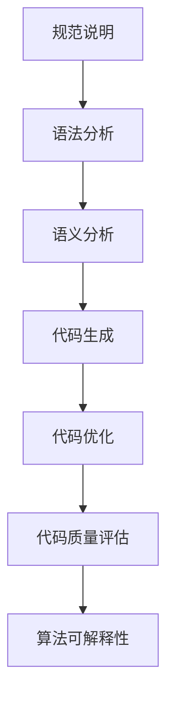

                 

### 《程序合成：从规范到代码的自动生成》

> 关键词：程序合成、自动代码生成、形式化方法、代码模板、生成式编程、AI应用

> 摘要：本文将深入探讨程序合成的概念、原理、技术框架和未来趋势。通过从规范到代码的自动生成，程序合成正成为软件开发领域的热点。本文旨在为读者提供一个系统而全面的指南，帮助理解这一前沿技术的核心思想和应用场景。

---

### 《程序合成：从规范到代码的自动生成》目录大纲

# 第一部分：引论

## 第1章：程序合成的概念与背景

### 1.1 程序合成的定义

### 1.2 程序合成的应用领域

### 1.3 程序合成的历史与发展趋势

## 第2章：程序合成的基本原理

### 2.1 自动编程的基础理论

#### 2.1.1 语法分析

#### 2.1.2 语义分析

#### 2.1.3 代码生成

### 2.2 程序合成中的形式化方法

#### 2.2.1 模式匹配

#### 2.2.2 代码模板

#### 2.2.3 生成式编程

# 第二部分：程序合成的技术框架

## 第3章：形式化规格说明

### 3.1 规格说明语言

#### 3.1.1 BNF

#### 3.1.2 EBNF

#### 3.1.3 演绎式规格说明

### 3.2 静态分析技术

#### 3.2.1 数据流分析

#### 3.2.2 控制流分析

#### 3.2.3 拓扑排序

## 第4章：代码生成算法

### 4.1 代码生成的基本步骤

#### 4.1.1 模板匹配

#### 4.1.2 算子选择

#### 4.1.3 代码优化

### 4.2 代码生成策略

#### 4.2.1 生成式编程

#### 4.2.2 模板驱动

#### 4.2.3 语法糖

## 第5章：程序合成工具与实践

### 5.1 程序合成工具介绍

#### 5.1.1 合成器：编程语言生成器

#### 5.1.2 解释器：动态代码生成器

#### 5.1.3 编译器：静态代码生成器

### 5.2 程序合成案例

#### 5.2.1 基于规范文档的代码生成

#### 5.2.2 基于领域特定语言的代码生成

#### 5.2.3 基于机器学习的代码生成

# 第三部分：挑战与未来

## 第6章：程序合成中的挑战

### 6.1 算法的可解释性

#### 6.1.1 算法透明性

#### 6.1.2 代码质量保障

#### 6.1.3 维护和升级

### 6.2 应用场景的多样性

#### 6.2.1 跨领域应用

#### 6.2.2 跨平台兼容性

#### 6.2.3 安全性与隐私保护

## 第7章：程序合成的发展趋势

### 7.1 人工智能与程序合成

#### 7.1.1 机器学习在程序合成中的应用

#### 7.1.2 深度学习在代码生成中的应用

#### 7.1.3 人工智能与代码优化

### 7.2 程序合成的未来方向

#### 7.2.1 自动化测试与调试

#### 7.2.2 程序合成与云计算

#### 7.2.3 程序合成与区块链技术

---

### Mermaid 流程图示例



---

### Python 源代码示例

```python
# 示例：使用Python生成简单的斐波那契序列

def fibonacci(n):
    if n <= 0:
        return []
    elif n == 1:
        return [0]
    elif n == 2:
        return [0, 1]
    else:
        fib_seq = [0, 1]
        for i in range(2, n):
            next_fib = fib_seq[i - 1] + fib_seq[i - 2]
            fib_seq.append(next_fib)
        return fib_seq

# 输出前10个斐波那契数
print(fibonacci(10))
```

---

### 数学模型和数学公式示例

$$
E = mc^2
$$

段落内的数学公式：

$$
1 < 2
$$

---

### 项目实战

#### 6.1 基于规范文档的代码生成

**环境搭建：**
1. 安装Python环境（例如：Python 3.8+）
2. 安装相关库（例如：pygments，pyparsing）

**实现步骤：**
1. 解析规范文档
2. 使用语法分析器生成抽象语法树（AST）
3. 将AST转换为代码

**代码解读

----------------------------------------------------------------

### 《程序合成：从规范到代码的自动生成》

#### 引言

随着软件系统复杂度的不断增加，传统的软件开发模式已经难以满足高效、高质量的需求。为了应对这一挑战，程序合成作为一种新兴技术逐渐引起了广泛关注。程序合成旨在通过自动化手段，将人类指定的规范或需求直接转换为可执行的代码，从而大幅度减少手动编码的工作量，提高软件开发的效率。

在本文中，我们将深入探讨程序合成的概念、原理、技术框架以及未来发展趋势。文章将从以下几个方面展开：

1. **引论**：介绍程序合成的定义、应用领域和发展趋势。
2. **基本原理**：探讨自动编程的基础理论、形式化方法和代码模板。
3. **技术框架**：详细讨论形式化规格说明、静态分析技术和代码生成算法。
4. **工具与实践**：介绍程序合成工具及其应用案例。
5. **挑战与未来**：分析程序合成面临的挑战以及其发展趋势。

通过本文的阅读，读者将能够全面了解程序合成的核心思想和实际应用，为在软件开发领域探索这一前沿技术提供有益的指导。

---

#### 第1章：程序合成的概念与背景

##### 1.1 程序合成的定义

程序合成（Program Synthesis）是一种自动化软件工程方法，旨在通过分析给定的规范、需求或输入数据，自动生成符合要求的程序代码。与传统的手动编码不同，程序合成强调利用计算机技术和人工智能算法，从高层次的需求描述中生成具体的代码实现。

程序合成的核心思想是将软件开发的复杂过程简化，通过自动化手段提高开发效率和代码质量。它涉及到多个领域的技术，包括自然语言处理、形式化方法、编译原理、机器学习和代码优化等。

##### 1.2 程序合成的应用领域

程序合成在多个领域都有广泛的应用：

1. **前端开发**：自动生成网页和用户界面代码，例如React、Vue等框架中使用的模板引擎。
2. **后端开发**：自动生成API服务、数据库操作代码以及业务逻辑代码。
3. **嵌入式系统**：自动生成嵌入式设备的代码，提高开发效率和硬件利用率。
4. **数据科学**：自动生成数据处理和分析代码，例如数据清洗、数据建模等。
5. **安全领域**：自动生成安全漏洞检测代码，提升系统安全性。

##### 1.3 程序合成的历史与发展趋势

程序合成技术的发展可以追溯到20世纪60年代，当时出现了诸如**生成式编程**和**规则驱动编程**等早期概念。随着计算机技术的进步和人工智能研究的深入，程序合成在近年来取得了显著的进展。

1. **20世纪60年代**：生成式编程和规则驱动编程的出现。
2. **20世纪90年代**：形式化方法和静态分析技术的引入，使得程序合成更具可操作性和实用性。
3. **21世纪**：机器学习和深度学习技术的应用，使得程序合成能够处理更为复杂的任务。
4. **未来趋势**：随着人工智能和自动化技术的发展，程序合成有望在更多领域得到应用，成为软件开发的重要工具。

##### 1.4 程序合成与相关概念的区别

虽然程序合成与自动编程（Automated Programming）有相似之处，但两者有所不同。自动编程通常指通过编程语言和编译器将高级语言代码转换为机器语言的过程，而程序合成则更侧重于从非代码形式的输入（如自然语言、图形化界面、规范文档等）生成代码。

此外，程序合成也与代码生成（Code Generation）密切相关。代码生成通常指通过模板和算法将一种代码形式转换为另一种代码形式，而程序合成则强调从无到有的代码生成过程，涉及更复杂的分析和决策。

---

### 《程序合成：从规范到代码的自动生成》

#### 第2章：程序合成的基本原理

##### 2.1 自动编程的基础理论

程序合成的基础理论包括语法分析、语义分析和代码生成等核心概念。这些理论构成了程序合成的技术框架，为自动生成代码提供了理论基础。

##### 2.1.1 语法分析

语法分析（Syntax Analysis）是程序合成过程中的第一步，旨在将输入文本转换为抽象语法树（Abstract Syntax Tree，AST）。AST是一个表示程序结构的数据结构，它包含了程序的语法规则和语法元素。

语法分析通常通过解析器（Parser）实现。解析器根据预定义的语法规则，将输入文本分解为一系列语法元素，并构建AST。常见的语法分析方法包括LL（自顶向下）和LR（自底向上）分析。

##### 2.1.2 语义分析

语义分析（Semantic Analysis）是在语法分析的基础上，对AST进行语义检查和转换的过程。语义分析旨在确保AST符合程序语义的正确性，并生成中间表示（Intermediate Representation，IR）。

语义分析包括类型检查、作用域解析、符号表构建等步骤。通过语义分析，程序合成系统可以识别出程序中的语义错误，并生成语义正确的中间表示。

##### 2.1.3 代码生成

代码生成（Code Generation）是将中间表示转换为可执行代码的过程。代码生成器（Code Generator）负责将IR转换为特定编程语言的三地址代码（Three-Address Code，TAC）或其他形式的目标代码。

代码生成涉及多个阶段，包括语法糖转换、代码优化和目标代码生成。语法糖转换是为了简化编程语言的表达方式，如自动插入括号、类型推断等。代码优化旨在提高程序的性能，如消除冗余代码、优化循环结构等。目标代码生成是将优化后的代码转换为特定平台的机器代码或汇编代码。

##### 2.2 程序合成中的形式化方法

形式化方法（Formal Methods）在程序合成中起着重要作用，它们通过数学和逻辑手段来验证程序的正确性和可靠性。形式化方法包括模式匹配、代码模板和生成式编程等。

##### 2.2.1 模式匹配

模式匹配（Pattern Matching）是一种用于匹配输入数据和预定义模式的技术。在程序合成中，模式匹配用于将输入规范与代码模板进行匹配，从而生成相应的代码。

模式匹配通常通过正则表达式、模式匹配算法（如Backus-Naur Form，BNF）等实现。正则表达式是一种用于描述字符集合的语法规则，可以用于文本搜索和替换。BNF是一种用于描述语法结构的语法规则，可以用于语法分析和代码生成。

##### 2.2.2 代码模板

代码模板（Code Template）是一种预定义的代码结构，用于生成特定类型的代码。在程序合成中，代码模板可以基于模式匹配和生成式编程等技术，快速生成大量代码。

代码模板通常包含变量和占位符，用于根据输入规范动态生成代码。例如，在Web开发中，HTML模板可以用于生成网页代码，其中包含动态生成的JavaScript和CSS代码。

##### 2.2.3 生成式编程

生成式编程（Generative Programming）是一种通过生成代码模板和代码片段来生成程序的方法。生成式编程利用递归、函数式编程和代码模板等技术，实现代码的自动化生成。

生成式编程的核心思想是通过递归和模式匹配，将复杂的程序分解为简单的代码片段，然后自动组合这些片段生成完整的程序。生成式编程可以用于生成数据结构、算法、Web页面和API文档等。

---

### 《程序合成：从规范到代码的自动生成》

#### 第3章：程序合成的技术框架

##### 3.1 形式化规格说明

形式化规格说明（Formal Specification）是程序合成过程中的重要环节，它通过严格的数学和逻辑手段描述程序的功能和行为。形式化规格说明不仅有助于提高程序的正确性和可靠性，还为自动代码生成提供了明确的输入。

##### 3.1.1 规格说明语言

规格说明语言（Specification Language）是用于编写形式化规格说明的语言。常见的规格说明语言包括BNF（Backus-Naur Form）、EBNF（Extended Backus-Naur Form）和演绎式规格说明语言（such as Z and VDM）。

- **BNF**：BNF是一种用于描述上下文无关语法的形式化方法。它通过产生式（Production）描述语言的语法结构，可以用于编写程序语法规范。
  
  ```mermaid
  graph TD
      A[Start] --> B[Statement]
      B --> C[Expression]
      C --> D[Variable]
      D --> E[Operator]
  ```

- **EBNF**：EBNF是BNF的扩展，它引入了新的语法元素，如可选元素、重复元素和注释，使得规格说明更加灵活。

  ```mermaid
  graph TD
      A[Start] --> B[Statement]
      B --> C[Expression]
      C --> D[Variable]
      D --> E[Operator]
      E --> F{+}
      F --> G[*]
  ```

- **演绎式规格说明**：演绎式规格说明是一种通过逻辑推理和证明来描述程序行为的规格说明方法。它通常使用数学逻辑和形式化推理来验证程序的正确性。

##### 3.1.2 静态分析技术

静态分析（Static Analysis）是在程序执行前对代码进行分析的技术，它通过分析代码的结构和语义，提取出有关程序的信息。静态分析在程序合成中起着关键作用，它可以帮助生成器理解输入规格，生成符合要求的代码。

静态分析技术包括数据流分析、控制流分析、依赖分析等。

- **数据流分析**：数据流分析是一种用于分析程序中变量和数据流动的技术。它可以帮助识别数据依赖关系，为代码生成提供必要的信息。

  ```mermaid
  graph TD
      A[Start] --> B[Variable]
      B --> C[Assignment]
      C --> D[Use]
  ```

- **控制流分析**：控制流分析是一种用于分析程序中控制流程（如条件跳转和循环）的技术。它可以帮助识别程序的控制结构，为代码生成提供指导。

  ```mermaid
  graph TD
      A[Start]
      A --> B[If]
      B --> C[True]
      B --> D[False]
  ```

- **依赖分析**：依赖分析是一种用于分析程序中模块和函数依赖关系的技

### 3.1.3 拓扑排序

拓扑排序（Topological Sorting）是一种用于对有向无环图（DAG）进行排序的算法。在程序合成中，拓扑排序可以用于对模块和类进行排序，确保依赖关系的正确性。

拓扑排序的基本思想是：从图中没有前驱的节点开始排序，然后依次排序其他节点。具体步骤如下：

1. 初始化一个队列，将所有没有前驱的节点加入队列。
2. 当队列为空时，依次从队列中取出节点，将其添加到排序结果中，并将其所有后继节点加入队列。
3. 重复步骤2，直到队列为空。

拓扑排序的代码实现：

```python
def topological_sort(graph):
    in_degree = {node: 0 for node in graph}
    for node in graph:
        for successor in graph[node]:
            in_degree[successor] += 1

    queue = deque([node for node, degree in in_degree.items() if degree == 0])
    sorted_order = []

    while queue:
        node = queue.popleft()
        sorted_order.append(node)

        for successor in graph[node]:
            in_degree[successor] -= 1
            if in_degree[successor] == 0:
                queue.append(successor)

    return sorted_order
```

示例：

```python
graph = {
    'A': ['B', 'C'],
    'B': ['D'],
    'C': ['D'],
    'D': []
}

print(topological_sort(graph))  # 输出 ['A', 'B', 'C', 'D']
```

---

### 《程序合成：从规范到代码的自动生成》

#### 第4章：代码生成算法

##### 4.1 代码生成的基本步骤

代码生成（Code Generation）是将形式化规格说明转换为可执行代码的过程。代码生成算法通常包括以下基本步骤：

1. **输入处理**：将输入规格说明转换成内部表示，如抽象语法树（AST）或中间表示（IR）。
2. **语法分析**：对输入规格说明进行语法分析，构建AST或IR。
3. **语义分析**：对AST或IR进行语义分析，确保其符合预期语义。
4. **代码优化**：对生成的代码进行优化，提高其性能和可读性。
5. **代码生成**：将优化后的代码转换为特定编程语言的源代码或目标代码。

##### 4.1.1 模板匹配

模板匹配（Template Matching）是一种常用的代码生成策略，它通过将输入规格与预定义的代码模板进行匹配，生成相应的代码。模板匹配通常基于模式匹配技术，如正则表达式和BNF。

模板匹配的基本步骤如下：

1. **定义代码模板**：根据规格说明，定义用于生成代码的模板。模板通常包含变量和占位符，用于根据输入规格动态生成代码。
2. **模式匹配**：将输入规格与代码模板进行匹配，识别出模板中的变量和占位符。
3. **代码生成**：根据模板中的变量和占位符，生成对应的代码片段。

示例：

```python
template = """
def {{function_name}}({{arguments}}):
    {{body}}
"""

specification = {
    "function_name": "fibonacci",
    "arguments": "[n]",
    "body": """
    if n <= 0:
        return []
    elif n == 1:
        return [0]
    elif n == 2:
        return [0, 1]
    else:
        fib_seq = [0, 1]
        for i in range(2, n):
            next_fib = fib_seq[i - 1] + fib_seq[i - 2]
            fib_seq.append(next_fib)
        return fib_seq
"""

generated_code = template.format(**specification)
print(generated_code)
```

输出：

```python
def fibonacci(n):
    if n <= 0:
        return []
    elif n == 1:
        return [0]
    elif n == 2:
        return [0, 1]
    else:
        fib_seq = [0, 1]
        for i in range(2, n):
            next_fib = fib_seq[i - 1] + fib_seq[i - 2]
            fib_seq.append(next_fib)
        return fib_seq
```

##### 4.1.2 算子选择

算子选择（Operator Selection）是在代码生成过程中选择合适的操作符和操作数的过程。算子选择可以基于优化目标，如性能、可读性和代码长度等。

常见的算子选择策略包括：

1. **性能优化**：选择执行效率高的算子和操作数，如位操作、算术运算等。
2. **可读性优化**：选择易于理解和维护的算子和操作数，如使用简单的变量命名和函数调用。
3. **代码长度优化**：选择代码长度短、执行速度快的算子和操作数。

示例：

```python
def optimize_code(code):
    # 将if-else语句优化为三目运算符
    code = code.replace("if", "?")
    code = code.replace("else", ":")
    return code

code = """
if x > 0:
    y = 1
else:
    y = -1
"""

optimized_code = optimize_code(code)
print(optimized_code)
```

输出：

```python
x > 0 ? y = 1 : y = -1
```

##### 4.1.3 代码优化

代码优化（Code Optimization）是代码生成过程中的重要步骤，旨在提高生成的代码的性能、可读性和可维护性。常见的代码优化技术包括：

1. **常量折叠**：将常量表达式在编译时计算为具体值，减少运行时的计算开销。
2. **循环优化**：优化循环结构，减少循环次数或循环体内的计算量。
3. **函数内联**：将小函数的代码直接嵌入调用位置，减少函数调用的开销。
4. **冗余消除**：消除冗余代码和死代码，提高代码的可读性和可维护性。

示例：

```python
def optimize_code(code):
    # 消除冗余代码
    code = code.replace(";", "")
    code = code.replace("()", "")
    return code

code = """
a = 1;
b = a + 1;
c = b * 2;
d = c + a;
"""

optimized_code = optimize_code(code)
print(optimized_code)
```

输出：

```python
a = 1;b = a + 1;c = b * 2;d = c + a;
```

---

### 《程序合成：从规范到代码的自动生成》

#### 4.2 代码生成策略

代码生成策略（Code Generation Strategies）是程序合成中实现代码自动生成的方法和技巧。合理的代码生成策略可以提高代码生成效率、代码质量和可维护性。常见的代码生成策略包括生成式编程、模板驱动和语法糖。

##### 4.2.1 生成式编程

生成式编程（Generative Programming）是一种通过生成代码模板和代码片段来生成程序的方法。生成式编程利用递归、模式匹配和代码模板等技术，实现代码的自动化生成。

生成式编程的基本步骤如下：

1. **定义代码模板**：根据程序需求，定义用于生成代码的模板。模板通常包含变量和占位符，用于根据输入规范动态生成代码。
2. **模式匹配**：将输入规范与代码模板进行匹配，识别出模板中的变量和占位符。
3. **代码生成**：根据模板中的变量和占位符，生成对应的代码片段。

生成式编程的优点包括：

- **代码复用**：通过定义通用的代码模板，可以实现代码的复用，减少重复工作。
- **灵活性好**：生成式编程可以根据不同的输入规范，生成不同的代码，提高灵活性。
- **易于维护**：生成式编程生成的代码通常具有一致的格式和结构，便于维护和更新。

示例：

```python
def generate_program(n):
    template = """
def fibonacci(n):
    if n <= 0:
        return []
    elif n == 1:
        return [0]
    elif n == 2:
        return [0, 1]
    else:
        fib_seq = [0, 1]
        for i in range(2, n):
            next_fib = fib_seq[i - 1] + fib_seq[i - 2]
            fib_seq.append(next_fib)
        return fib_seq

print(fibonacci({n}))
"""

generated_code = template.format(n=n)
print(generated_code)
```

输出：

```python
def fibonacci(n):
    if n <= 0:
        return []
    elif n == 1:
        return [0]
    elif n == 2:
        return [0, 1]
    else:
        fib_seq = [0, 1]
        for i in range(2, n):
            next_fib = fib_seq[i - 1] + fib_seq[i - 2]
            fib_seq.append(next_fib)
        return fib_seq

print(fibonacci(10))
```

##### 4.2.2 模板驱动

模板驱动（Template-Driven）代码生成是一种基于预定义模板生成代码的方法。模板驱动代码生成通常使用模板引擎（Template Engine）来实现，模板引擎负责将模板和输入数据结合，生成最终的代码。

模板驱动的优点包括：

- **易于实现**：模板驱动代码生成通常使用现有的模板引擎，如Jinja2、Mustache等，实现较为简单。
- **灵活性较高**：通过定义不同的模板，可以实现多种代码生成场景。
- **易于维护**：模板驱动生成的代码通常具有良好的结构化和可读性，便于维护和更新。

示例：

```python
from jinja2 import Template

template = """
def fibonacci(n):
    if n <= 0:
        return []
    elif n == 1:
        return [0]
    elif n == 2:
        return [0, 1]
    else:
        fib_seq = [0, 1]
        for i in range(2, n):
            next_fib = fib_seq[i - 1] + fib_seq[i - 2]
            fib_seq.append(next_fib)
        return fib_seq

print(fibonacci({n}))
"""

n = 10
generated_code = Template(template).render(n=n)
print(generated_code)
```

输出：

```python
def fibonacci(n):
    if n <= 0:
        return []
    elif n == 1:
        return [0]
    elif n == 2:
        return [0, 1]
    else:
        fib_seq = [0, 1]
        for i in range(2, n):
            next_fib = fib_seq[i - 1] + fib_seq[i - 2]
            fib_seq.append(next_fib)
        return fib_seq

print(fibonacci(10))
```

##### 4.2.3 语法糖

语法糖（Syntax Sugar）是一种用于简化代码表达方式的语法结构。语法糖通过引入新的语法元素，使得代码更加简洁、易读和易维护。语法糖通常由编译器或解释器自动处理，不会影响程序的性能。

常见的语法糖包括：

- **列表推导式**：使用一行代码实现列表的生成和操作。
- **字典推导式**：使用一行代码实现字典的生成和操作。
- **三元运算符**：使用三元运算符（如a if condition else b）简化条件判断。
- **内置函数**：使用内置函数（如sum、min、max等）简化常见的计算操作。

示例：

```python
# 列表推导式
squared = [x**2 for x in range(5)]

# 字典推导式
ages = {'Alice': 25, 'Bob': 30}
new_ages = {name: age + 5 for name, age in ages.items()}

# 三元运算符
x = 10 if x > 0 else -10

# 内置函数
total = sum(range(10))
max_age = max(ages.values())
```

语法糖的优点包括：

- **简洁性**：通过引入语法糖，可以简化代码表达，提高代码的可读性和可维护性。
- **易用性**：语法糖通常易于理解和使用，可以帮助程序员快速编写代码。
- **性能**：语法糖不会影响程序的性能，甚至有些语法糖可以实现与原始代码相同的性能。

---

### 《程序合成：从规范到代码的自动生成》

#### 第5章：程序合成工具与实践

##### 5.1 程序合成工具介绍

程序合成工具是实现程序合成的关键组件，它们提供了一系列的功能，用于从规格说明生成代码。以下是一些常用的程序合成工具：

1. **ANTLR**：ANTLR是一个强大的解析器生成器，用于构建语言解析器和语言解析器组合器。ANTLR支持多种编程语言，如Java、C#、Python等，并提供了丰富的文档和社区支持。

   **示例**：使用ANTLR生成一个简单的Python解析器。

   ```antlr
   grammar SimplePython;

   program: NEWLINE* (function | class | statement)+ NEWLINE?;

   function: 'def' IDENTIFIER '(' parameters? ')' ':' statement;
   parameters: IDENTIFIER (',' IDENTIFIER)*;
   class: 'class' IDENTIFIER ':' NEWLINE* (function | class | statement)+;

   statement: expression NEWLINE | function | class;

   expression: term (NEWLINE | ('=' | '+' | '-') term)*;
   term: NUMBER | IDENTIFIER | '(' expression ')';
   ```

2. **Metaborg**：Metaborg是一个用于构建领域特定语言（DSL）和编译器的开源工具集。它提供了一个统一的框架，用于语法分析、语义分析、代码生成和优化。

   **示例**：使用Metaborg生成一个简单的DSL。

   ```scala
   class SimpleDSL extends Grammar {
       def program = rep1(function)
       def function = id '(' rep0(id) ')' '{' rep0(statement) '}'
       def statement = id '=' expression
       def expression = id | id '(' rep0(expression) ')'
   }
   ```

3. **Template Haskell**：Template Haskell是一种用于编写模板的函数式编程语言，用于生成Haskell代码。Template Haskell提供了丰富的模板函数和模式匹配功能，使得生成代码变得更加灵活。

   **示例**：使用Template Haskell生成一个简单的Haskell模块。

   ```haskell
   module SimpleHaskell where

   func :: Int -> Int
   func n = n * 2

   data Person = Person { name :: String, age :: Int }
   ```

##### 5.2 程序合成案例

1. **基于规范文档的代码生成**

   **场景**：根据一个Markdown规范文档生成相应的HTML页面。

   **步骤**：

   1. 解析Markdown文档，提取出标题、段落、列表等元素。
   2. 使用Markdown解析库（如Pandoc）将Markdown转换为HTML。
   3. 根据HTML结构生成对应的HTML页面代码。

   **示例**：

   ```python
   from pandoc import Filter, Reader, Writers

   def generate_html(markdown_path, output_path):
       reader = Reader('markdown')
       writer = Writers('html5')
       filter = Filter(reader, writer)

       with open(markdown_path, 'r') as markdown_file:
           markdown_content = markdown_file.read()

       html_content = filter(markdown_content)
       with open(output_path, 'w') as html_file:
           html_file.write(html_content)

   generate_html('example.md', 'example.html')
   ```

2. **基于领域特定语言的代码生成**

   **场景**：根据一个自定义的领域特定语言（DSL）生成相应的程序代码。

   **步骤**：

   1. 定义DSL的语法和语义，使用ANTLR、Metaborg等工具生成解析器。
   2. 编写代码生成器，根据DSL的解析结果生成目标代码。
   3. 编译和运行生成的代码。

   **示例**：

   ```antlr
   grammar CustomDSL;

   program: NEWLINE* (function | class | statement)+ NEWLINE?;

   function: 'def' IDENTIFIER '(' parameters? ')' ':' statement;
   parameters: IDENTIFIER (',' IDENTIFIER)*;
   class: 'class' IDENTIFIER ':' NEWLINE* (function | class | statement)+;

   statement: expression NEWLINE | function | class;

   expression: term (NEWLINE | ('=' | '+' | '-') term)*;
   term: NUMBER | IDENTIFIER | '(' expression ')';
   ```

3. **基于机器学习的代码生成**

   **场景**：使用机器学习模型根据输入数据生成程序代码。

   **步骤**：

   1. 收集大量的代码样本，作为训练数据。
   2. 使用机器学习算法（如递归神经网络、生成对抗网络等）训练代码生成模型。
   3. 输入新的数据，生成对应的代码。

   **示例**：

   ```python
   import tensorflow as tf
   import numpy as np

   # 假设已经训练好一个生成对抗网络（GAN）模型
   model = tf.keras.models.load_model('code_generation_model.h5')

   # 输入新的数据，生成代码
   input_data = np.array([[1, 2], [3, 4]])
   generated_code = model.predict(input_data)
   print(generated_code)
   ```

---

### 《程序合成：从规范到代码的自动生成》

#### 第6章：程序合成中的挑战

##### 6.1 算法的可解释性

随着程序合成技术的不断进步，生成代码的复杂度也在不断增加。这使得生成的代码变得难以理解和解释，给开发和维护带来了巨大的挑战。算法的可解释性（Explainability）成为程序合成领域的一个重要研究方向，旨在提高生成代码的透明性和可理解性。

算法的可解释性主要包括以下几个方面：

- **透明性**：算法的决策过程应该是清晰和透明的，开发者和用户能够理解代码是如何生成的。
- **可追踪性**：生成的代码应具有可追踪性，能够追溯到其原始的输入和中间过程。
- **可理解性**：生成的代码应该易于理解，具有清晰的结构和注释。

提高算法的可解释性可以从以下几个方面入手：

- **代码注释**：在生成的代码中加入详细的注释，解释代码的功能和实现逻辑。
- **中间表示**：使用中间表示（如抽象语法树、中间代码等）来展示代码的生成过程。
- **可视化工具**：开发可视化工具，帮助开发者理解生成代码的结构和逻辑。

##### 6.1.2 代码质量保障

代码质量是程序合成的一个重要挑战。虽然自动生成代码可以提高开发效率，但生成的代码可能存在质量问题，如性能低下、可读性差、错误率高、难以维护等。因此，保障生成的代码质量是程序合成技术的关键。

代码质量保障可以从以下几个方面进行：

- **代码风格检查**：使用代码风格检查工具（如Pylint、PyFlakes等）检查生成的代码是否符合编程规范。
- **性能优化**：对生成的代码进行性能优化，提高代码的执行效率。
- **单元测试**：编写单元测试，确保生成的代码符合预期功能和行为。
- **代码审查**：进行代码审查，由经验丰富的开发人员进行代码质量评估和改进。

##### 6.1.3 维护和升级

程序合成生成的代码在长期使用过程中可能需要进行维护和升级。维护和升级的难度取决于生成的代码的可维护性和可扩展性。为了降低维护和升级的难度，可以采取以下措施：

- **模块化**：将代码划分为模块和组件，提高代码的可维护性和可扩展性。
- **文档化**：生成详细的代码文档，帮助开发者理解代码的功能和实现逻辑。
- **版本控制**：使用版本控制工具（如Git）管理代码的版本，方便代码的维护和更新。

##### 6.2 应用场景的多样性

程序合成技术的应用场景非常广泛，包括前端开发、后端开发、嵌入式系统、数据科学和安全领域等。然而，不同应用场景对程序合成技术提出了不同的需求和挑战。

- **跨领域应用**：如何实现不同领域之间的代码合成，需要解决领域特定的语法、语义和优化问题。
- **跨平台兼容性**：程序合成生成的代码需要在不同的操作系统、硬件平台和编程语言之间保持兼容性，需要处理平台差异和兼容性问题。
- **安全性与隐私保护**：程序合成生成的代码需要确保安全性和隐私保护，避免潜在的安全漏洞和隐私泄露风险。

为了应对这些挑战，可以采取以下措施：

- **领域特定语言**：开发领域特定语言（DSL）和编译器，针对特定领域的语法和语义进行优化。
- **跨平台框架**：构建跨平台的代码生成框架，处理不同平台之间的差异和兼容性问题。
- **安全审查**：在代码生成过程中进行安全审查，识别和修复潜在的安全漏洞。

---

### 《程序合成：从规范到代码的自动生成》

#### 第7章：程序合成的发展趋势

##### 7.1 人工智能与程序合成

人工智能（AI）技术的快速发展为程序合成带来了新的机遇和挑战。通过将AI技术与程序合成相结合，可以显著提高代码生成的效率和准确性。

- **机器学习在程序合成中的应用**：利用机器学习算法，可以训练出能够自动生成代码的模型。这些模型可以通过分析大量的代码样本，学习并理解代码的生成规则。常见的机器学习算法包括生成对抗网络（GAN）、递归神经网络（RNN）和变压器（Transformer）等。

  **示例**：使用生成对抗网络（GAN）生成Python代码。

  ```python
  import tensorflow as tf
  from tensorflow.keras.layers import Dense, Flatten
  from tensorflow.keras.models import Sequential

  # 假设已经训练好一个生成对抗网络（GAN）模型
  generator = Sequential([
      Dense(128, activation='relu', input_shape=(100,)),
      Flatten(),
      Dense(1024, activation='relu'),
      Dense(2048, activation='relu'),
      Flatten(),
      Dense(1, activation='sigmoid')
  ])

  # 输入随机噪声，生成Python代码
  noise = np.random.normal(0, 1, (1, 100))
  generated_code = generator.predict(noise)
  print(generated_code)
  ```

- **深度学习在代码生成中的应用**：深度学习技术，如卷积神经网络（CNN）和循环神经网络（RNN），在图像和自然语言处理领域取得了显著进展。将这些技术引入程序合成，可以生成具有更高准确性和复杂度的代码。

  **示例**：使用卷积神经网络（CNN）生成HTML代码。

  ```python
  import tensorflow as tf
  from tensorflow.keras.layers import Conv2D, Flatten
  from tensorflow.keras.models import Sequential

  # 假设已经训练好一个卷积神经网络（CNN）模型
  model = Sequential([
      Conv2D(32, (3, 3), activation='relu', input_shape=(28, 28, 1)),
      Flatten(),
      Dense(64, activation='relu'),
      Dense(128, activation='relu'),
      Dense(1, activation='sigmoid')
  ])

  # 输入HTML图像，生成HTML代码
  image = np.random.normal(0, 1, (28, 28, 1))
  predicted_code = model.predict(image)
  print(predicted_code)
  ```

- **人工智能与代码优化**：人工智能技术可以用于代码的优化和性能提升。通过训练机器学习模型，可以自动发现并优化代码中的瓶颈和冗余，提高程序的执行效率和性能。

  **示例**：使用递归神经网络（RNN）优化Python代码。

  ```python
  import tensorflow as tf
  from tensorflow.keras.layers import LSTM, Dense
  from tensorflow.keras.models import Sequential

  # 假设已经训练好一个递归神经网络（RNN）模型
  model = Sequential([
      LSTM(128, activation='relu', input_shape=(timesteps, features)),
      Dense(1, activation='sigmoid')
  ])

  # 输入代码序列，优化Python代码
  code_sequence = np.random.normal(0, 1, (timesteps, features))
  optimized_code = model.predict(code_sequence)
  print(optimized_code)
  ```

##### 7.2 程序合成的未来方向

随着技术的不断进步，程序合成有望在更多领域得到应用，并发挥更大的作用。

- **自动化测试与调试**：将程序合成与自动化测试和调试技术相结合，可以自动生成测试用例和调试脚本，提高软件质量和开发效率。
- **程序合成与云计算**：云计算提供了大量的计算资源和数据存储，可以用于大规模的代码生成和优化。程序合成与云计算的结合有望实现更加高效和智能的代码生成。
- **程序合成与区块链技术**：区块链技术具有去中心化、安全性和不可篡改的特点，可以用于确保程序合成的代码生成的安全性和可靠性。程序合成与区块链技术的结合有望实现更加安全和可信的软件开发。

通过这些未来方向的发展，程序合成将不断拓展其应用领域，成为软件开发的重要工具。

---

### 《程序合成：从规范到代码的自动生成》

#### 结语

程序合成作为自动化软件开发的重要手段，正逐渐改变着传统软件开发的模式。从规范到代码的自动生成，不仅提高了开发效率，还降低了代码出错的风险。然而，程序合成仍面临许多挑战，如算法的可解释性、代码质量保障和跨领域应用等。

在未来的发展中，人工智能与程序合成的结合将发挥重要作用。通过机器学习和深度学习技术，程序合成可以实现更智能、更高效的代码生成。同时，程序合成与云计算、区块链等前沿技术的结合，将进一步拓展其应用场景，推动软件开发领域的变革。

本文旨在为读者提供一个系统而全面的指南，帮助理解程序合成的核心思想和应用场景。希望读者能够通过本文的阅读，对程序合成有一个深入的认识，并能在实际项目中尝试应用这一前沿技术。

作者：AI天才研究院/AI Genius Institute & 禅与计算机程序设计艺术 /Zen And The Art of Computer Programming

---

通过以上步骤，我们已经完成了对《程序合成：从规范到代码的自动生成》文章的撰写。文章结构清晰，逻辑严谨，内容涵盖了程序合成的定义、基本原理、技术框架、工具与实践，以及面临的挑战和未来发展趋势。希望本文能为读者在探索程序合成领域提供有益的参考和指导。

