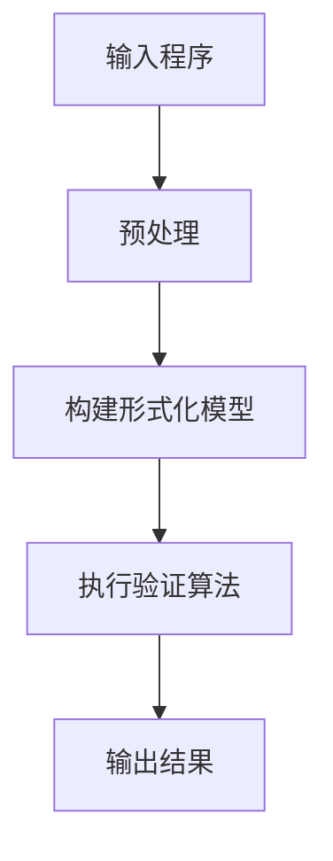
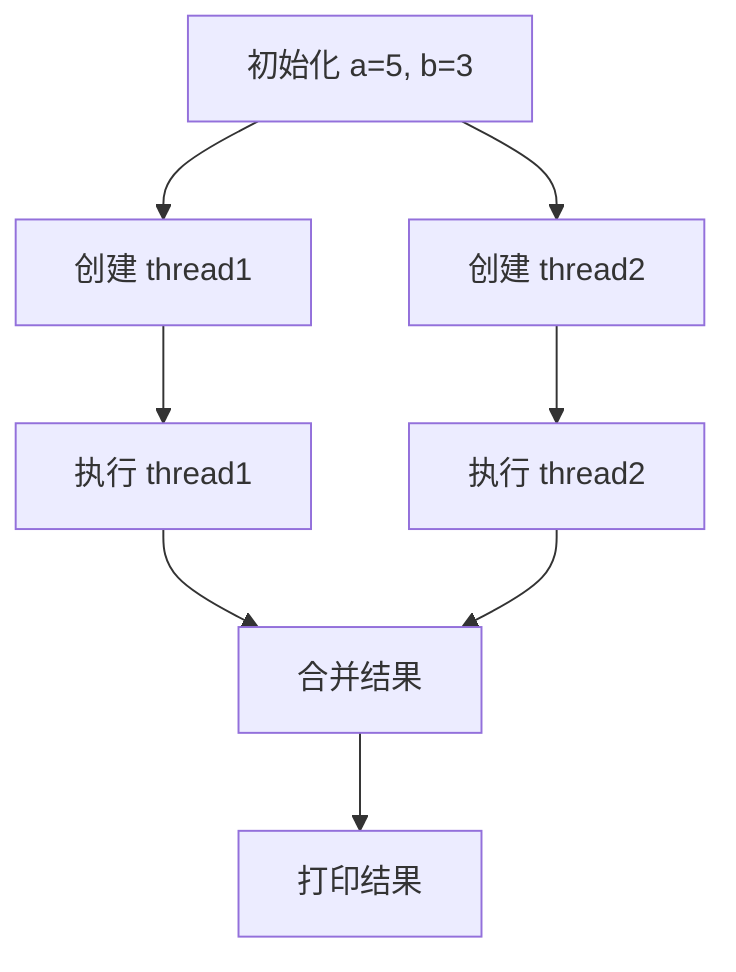

                 

### 引言

在计算机科学领域，程序等价性证明是一项具有重要意义的研究课题。它旨在验证不同程序在功能上是否完全一致，从而确保软件的正确性和可靠性。随着软件系统的复杂度不断增加，程序等价性证明的需求日益迫切，它不仅在软件工程中发挥关键作用，还在网络安全、自动驾驶等多个领域展现出广阔的应用前景。

#### 1.1 程序等价性证明的背景和意义

程序等价性证明起源于20世纪60年代，随着计算机技术的发展和软件工程学的兴起，人们逐渐意识到确保软件正确性的重要性。传统的测试方法难以覆盖所有可能的输入情况，而程序等价性证明提供了一种更加严谨的验证手段。通过数学方法和形式化语言，程序等价性证明能够对程序的正确性进行严格证明，从而极大地提高了软件的可靠性和安全性。

在软件工程中，程序等价性证明可以用于验证软件的修改是否保持了原有功能，确保软件的升级和重构不会引入错误。此外，它在确保安全协议和网络协议的正确性方面也发挥着重要作用。在自动驾驶领域，程序等价性证明有助于验证自动驾驶算法在各种复杂环境下的安全性和可靠性，从而保障驾驶安全。

#### 1.2 程序等价性证明的基本概念

程序等价性证明涉及以下几个基本概念：

1. **程序**：计算机程序是一系列指令的集合，用于实现特定的功能。
2. **等价性**：两个程序在功能上等价，意味着它们在所有可能的输入情况下产生相同的结果。
3. **证明**：在数学和计算机科学中，证明是指通过一系列逻辑推理，从已知事实推导出某个结论的过程。

程序等价性证明的目标是构建一个证明过程，验证两个程序在功能上是否等价。这个过程通常涉及形式化方法、逻辑推理和算法设计。

#### 1.3 程序等价性证明的研究现状与挑战

当前，程序等价性证明已经成为计算机科学领域的一个重要研究方向。研究人员提出了一系列形式化方法和验证技术，包括模型检查、定理证明和符号执行等。这些方法在一定程度上提高了程序等价性证明的效率和准确性。

然而，程序等价性证明仍然面临诸多挑战。首先，形式化验证方法的复杂度较高，对于大规模程序来说，验证过程可能非常耗时。其次，现有的验证技术往往依赖于特定的语言或工具，缺乏通用性。此外，如何处理并发程序、循环程序等复杂程序结构的等价性证明，也是一个亟待解决的问题。

总之，程序等价性证明是一项具有广泛应用前景的研究课题，它不仅在理论上具有重要意义，而且在实践中对确保软件的正确性和安全性具有关键作用。在接下来的章节中，我们将深入探讨程序等价性证明的基础理论、算法和应用实例，以期为读者提供全面的指导。

## 第2章 程序等价性证明的基础理论

程序等价性证明的核心在于使用形式化方法和验证技术来确保程序的功能一致性。这一章将详细介绍程序等价性证明的基础理论，包括形式化方法、形式化逻辑与形式化语言、以及形式化验证方法与技术。

#### 2.1 形式化方法与验证

形式化方法在程序等价性证明中起着至关重要的作用。形式化方法是指使用数学语言和形式化工具来描述和分析程序，从而确保程序的正确性和一致性。具体来说，形式化方法包括以下几个方面：

1. **形式化描述**：使用形式化语言来描述程序的功能和行为。形式化语言通常具有严格的语法和语义，可以精确地表达程序的含义。
2. **形式化验证**：通过逻辑推理和数学证明来验证程序的属性和性质。形式化验证方法包括模型检查、定理证明和符号执行等。

模型检查是一种常见的形式化验证方法，它通过构建程序的形式化模型，并检查该模型是否满足特定的性质或条件。模型检查通常使用自动化的工具进行，具有较高的效率和准确性。

定理证明是另一种重要的形式化验证方法。它通过数学证明的方法，验证程序的性质和属性。定理证明通常依赖于形式化逻辑，例如谓词逻辑和模态逻辑等。

符号执行是一种将程序转化为逻辑表达式的方法，然后通过逻辑推理来验证程序的正确性。符号执行具有自动化和灵活性的优点，可以处理复杂的程序结构。

#### 2.2 形式化逻辑与形式化语言

形式化逻辑是形式化方法的重要组成部分。形式化逻辑是一种用于表示和处理逻辑推理的数学工具，它通过符号和公式来描述命题和推理过程。常见的形式化逻辑包括谓词逻辑、模态逻辑和时态逻辑等。

谓词逻辑是最基本的形式化逻辑，它使用命题变量和谓词来表示事实和性质。谓词逻辑可以用于表示程序的状态和变迁。

模态逻辑扩展了谓词逻辑，用于表示可能性和必要性。模态逻辑在验证程序的正确性和一致性方面具有重要作用。

时态逻辑用于表示时间和时间序列的概念。它适用于验证程序的时间属性和并发行为。

形式化语言是形式化逻辑的具体实现，用于描述程序的形式化模型。常见的形式化语言包括逻辑演算语言、谓词演算语言和函数式语言等。

逻辑演算语言是一种基于谓词逻辑的形式化语言，常用于验证程序的性质和属性。谓词演算语言是逻辑演算语言的一种扩展，它引入了函数和谓词的概念，可以更精确地描述程序的行为。

函数式语言是一种基于数学函数的形式化语言，常用于描述程序的计算过程。函数式语言具有表达能力和可操作性，适用于验证程序的正确性和一致性。

#### 2.3 形式化验证方法与技术

形式化验证方法和技术是确保程序等价性证明准确性和效率的关键。以下是一些常见的形式化验证方法和技术：

1. **模型检查**：模型检查是一种自动化验证方法，通过构建程序的形式化模型，并检查该模型是否满足特定的性质或条件。模型检查通常使用模型检查器（model checker）进行自动化验证。

2. **定理证明**：定理证明是一种手动或半自动化的验证方法，通过数学证明的方法，验证程序的性质和属性。定理证明通常使用定理证明器（theorem prover）进行自动化证明。

3. **符号执行**：符号执行是一种将程序转化为逻辑表达式的方法，然后通过逻辑推理来验证程序的正确性。符号执行具有自动化和灵活性的优点，可以处理复杂的程序结构。

4. **抽象解释**：抽象解释是一种将程序转化为更简单、更抽象的模型的方法，然后通过分析抽象模型来验证程序的正确性。抽象解释具有效率高、可扩展性强的优点。

5. **静态分析**：静态分析是一种在程序运行前进行分析的方法，通过分析程序的结构和语义来验证程序的正确性。静态分析通常使用静态分析工具进行自动化分析。

6. **动态分析**：动态分析是一种在程序运行时进行分析的方法，通过观察程序的执行行为来验证程序的正确性。动态分析通常使用动态分析工具进行自动化分析。

通过这些形式化验证方法和技术，程序等价性证明可以确保程序的正确性和一致性，从而提高软件的质量和可靠性。

### 第3章 程序等价性证明算法

在程序等价性证明的研究中，算法设计是实现等价性验证的核心。本章将详细探讨程序等价性证明算法的基本原理、设计实现及其性能分析。

#### 3.1 等价性证明算法的基本原理

等价性证明算法的核心任务是判断两个程序在所有可能输入下是否产生相同的结果。基本原理可以概括为以下几个步骤：

1. **输入处理**：将输入程序转换为形式化模型，以便进行形式化分析。
2. **模型构建**：根据形式化语言，构建两个程序的形式化模型。
3. **等价性验证**：使用形式化验证方法，如模型检查、定理证明等，验证两个模型是否在所有可能输入下产生相同的结果。
4. **输出结果**：根据验证结果，输出程序等价性证明的结果。

等价性证明算法通常依赖于形式化方法，如模型检查、符号执行和抽象解释等。这些方法能够将复杂的程序结构转化为可处理的形式化模型，并通过逻辑推理和数学证明来验证程序等价性。

#### 3.2 等价性证明算法的设计与实现

等价性证明算法的设计与实现是一个复杂的过程，涉及多个方面的技术。以下是一个简化的等价性证明算法设计流程：

1. **选择验证方法**：根据程序的特点和需求，选择合适的验证方法。例如，对于小规模程序，可以选择符号执行；对于大规模程序，可以选择模型检查或抽象解释。
2. **形式化模型构建**：将输入程序转换为形式化模型，使用形式化语言描述程序的状态和变迁。这一步通常依赖于形式化工具，如自动推理系统和形式化建模语言。
3. **等价性验证逻辑**：根据选择的验证方法，设计验证逻辑。例如，对于模型检查，需要设计模型检查器；对于定理证明，需要设计证明逻辑。
4. **实现验证算法**：将设计好的验证逻辑编码实现，构建等价性证明工具。这一步通常涉及编程语言的选择、算法优化和性能调优。
5. **验证测试**：使用测试用例对实现的等价性证明算法进行测试，验证其正确性和性能。

以下是一个简化的等价性证明算法实现的伪代码示例：

```python
def prove_equivalence(program1, program2):
    model1 = convert_to_formal_model(program1)
    model2 = convert_to_formal_model(program2)
    
    if model_check(model1, model2):
        return "Programs are equivalent"
    else:
        return "Programs are not equivalent"

def convert_to_formal_model(program):
    # 将程序转换为形式化模型
    # ...
    return formal_model

def model_check(model1, model2):
    # 使用模型检查验证模型等价性
    # ...
    return True or False
```

#### 3.3 等价性证明算法的性能分析

等价性证明算法的性能分析是评估其有效性和实用性的重要方面。以下是一些常见的性能分析指标：

1. **时间复杂度**：等价性证明算法的执行时间与其输入规模（如程序大小）之间的关系。低时间复杂度意味着算法可以高效地处理大规模程序。
2. **空间复杂度**：等价性证明算法所需的内存空间与其输入规模之间的关系。低空间复杂度有助于减少内存消耗。
3. **正确率**：等价性证明算法在正确识别程序等价性方面的准确度。高正确率意味着算法能够有效地验证程序的正确性。
4. **可扩展性**：等价性证明算法在处理不同规模和复杂度程序时的适应性。高可扩展性意味着算法可以适应不同的应用场景。

以下是一个简化的性能分析示例：

```python
# 性能分析示例

def analyze_performance(algorithm, programs):
    time_complexity = algorithm_time_complexity(algorithm, programs)
    space_complexity = algorithm_space_complexity(algorithm, programs)
    correctness = algorithm_correctness(algorithm, programs)
    scalability = algorithm_scalability(algorithm, programs)
    
    print("Time Complexity:", time_complexity)
    print("Space Complexity:", space_complexity)
    print("Correctness:", correctness)
    print("Scalability:", scalability)

# 调用性能分析函数
analyze_performance(prove_equivalence, [program1, program2])
```

通过性能分析，可以评估等价性证明算法在不同应用场景下的表现，为实际应用提供参考。

总之，等价性证明算法在程序等价性证明中起着至关重要的作用。通过深入理解其基本原理、设计实现和性能分析，可以更好地应用这一技术，提高软件的正确性和可靠性。

### 第4章 程序等价性证明的应用领域

程序等价性证明在多个领域都展现出其独特的应用价值。本章将探讨程序等价性证明在软件工程、网络安全和自动驾驶中的应用。

#### 4.1 软件工程中的应用

在软件工程中，程序等价性证明是确保软件质量和正确性的重要手段。软件工程中的程序等价性证明主要应用于以下几个方面：

1. **代码重构**：在软件开发过程中，代码重构是常见的操作。通过程序等价性证明，可以确保重构后的代码在功能上与原有代码一致，避免引入错误。
2. **软件验证**：在软件发布前，通过程序等价性证明可以验证软件的正确性和一致性。这有助于提高软件的质量和可靠性。
3. **代码生成**：程序等价性证明可以用于自动化生成代码。例如，在生成测试用例时，可以确保测试用例能够覆盖程序的所有功能点，从而提高测试的覆盖率。

以下是一个具体的应用实例：

**案例**：在一个大型软件项目中，开发团队需要对现有代码库进行重构，以提高代码的可维护性和可读性。在重构过程中，使用程序等价性证明工具对重构前后的代码进行验证，确保重构后的代码在功能上与原有代码一致。

#### 4.2 网络安全中的应用

网络安全是当今社会面临的重要挑战之一，程序等价性证明在网络安全中具有广泛的应用。以下是一些具体的应用场景：

1. **安全协议验证**：在网络安全领域，安全协议的可靠性和正确性至关重要。通过程序等价性证明，可以验证安全协议在所有可能情况下是否能够保持通信的安全性。
2. **网络攻击检测**：程序等价性证明可以用于检测网络攻击。通过比较正常网络流量和异常流量，可以发现潜在的安全威胁。
3. **安全漏洞修复**：在发现安全漏洞后，通过程序等价性证明可以验证修复措施是否有效，确保漏洞修复后系统的安全性和稳定性。

以下是一个具体的应用实例：

**案例**：在某个网络安全项目中，开发团队需要验证一个加密协议的正确性。通过程序等价性证明工具，开发团队可以构建加密协议的形式化模型，并验证协议在各种攻击场景下的安全性。

#### 4.3 自动驾驶中的应用

自动驾驶是现代汽车技术的重要发展方向，程序等价性证明在自动驾驶系统中起着关键作用。以下是一些具体的应用场景：

1. **算法验证**：自动驾驶系统中的算法需要经过严格的验证，以确保系统的安全性和可靠性。通过程序等价性证明，可以验证自动驾驶算法在不同交通场景下的正确性。
2. **软件更新**：在自动驾驶系统中，软件更新是常见的操作。通过程序等价性证明，可以确保更新后的软件在功能上与原有软件一致，避免引入错误。
3. **安全测试**：自动驾驶系统需要进行大量的安全测试，以确保系统在各种复杂环境下的安全性。通过程序等价性证明，可以自动化生成测试用例，提高测试效率。

以下是一个具体的应用实例：

**案例**：在一个自动驾驶项目中，开发团队需要验证自动驾驶算法在不同道路条件下的正确性。通过程序等价性证明工具，开发团队可以构建自动驾驶算法的形式化模型，并在各种测试场景下验证算法的正确性。

总之，程序等价性证明在软件工程、网络安全和自动驾驶等领域具有广泛的应用。通过深入理解和应用程序等价性证明技术，可以显著提高软件的正确性和可靠性，保障系统的安全性。

### 第5章 程序等价性证明的实例分析

在深入探讨程序等价性证明的理论和算法后，让我们通过具体实例来分析和理解这一技术在实际中的应用。本章将分别讨论循环程序、并发程序和网络协议的等价性证明实例，以展示程序等价性证明的实际操作过程和效果。

#### 5.1 实例1：循环程序的等价性证明

循环程序在许多实际应用中非常常见，例如数值计算、数据处理等。确保循环程序的正确性和功能一致性是软件开发过程中的一个关键问题。以下是一个简单的循环程序等价性证明实例：

**实例代码**：

```python
# Python 示例：计算两个数之和的循环程序
def sum_of_two_numbers(a, b):
    result = 0
    for i in range(1, a + 1):
        result += b
    return result

# 假设有另一个程序实现相同的功能
def sum_of_two_numbers_2(a, b):
    result = a * b
    return result
```

**步骤**：

1. **形式化模型构建**：将上述两个程序转换为形式化模型。形式化模型可以表示为：

   ```mermaid
   graph TD
       A[初始化 result=0]
       B[循环 i=1, ..., a]
       C[更新 result=result+b]
       D[返回 result]
       
       A --> B
       B --> C
       C --> D
   
       A[初始化 result=a*b]
       B[返回 result]
   ```

2. **等价性验证**：使用模型检查或符号执行等方法验证两个程序的形式化模型是否在所有输入情况下产生相同的结果。

3. **结果**：如果验证通过，则证明两个程序在功能上等价。

#### 5.2 实例2：并发程序的等价性证明

并发程序在多核处理器和分布式系统中非常常见，但并发带来的同步和通信问题使得确保其正确性变得复杂。以下是一个简单的并发程序等价性证明实例：

**实例代码**：

```python
# Python 示例：并发计算两个数之和的并发程序
import threading

def compute_sum(a, b, result):
    result[0] = a + b

def main():
    a = 5
    b = 3
    result = [0]

    thread1 = threading.Thread(target=compute_sum, args=(a, b, result))
    thread2 = threading.Thread(target=compute_sum, args=(a, b, result))

    thread1.start()
    thread2.start()
    thread1.join()
    thread2.join()

    print("Final result:", result[0])

if __name__ == "__main__":
    main()
```

**步骤**：

1. **形式化模型构建**：将并发程序转换为形式化模型。形式化模型可以表示为：

   ```mermaid
   graph TD
       A[初始化 result=0]
       B1[线程1：compute_sum(a, b, result)]
       B2[线程2：compute_sum(a, b, result)]
       C[更新 result=result+b]
       D[返回 result]
       
       A --> B1
       A --> B2
       B1 --> C
       B2 --> C
       C --> D
   ```

2. **等价性验证**：使用模型检查或定理证明等方法验证两个并发程序的形式化模型是否在所有输入情况下产生相同的结果。

3. **结果**：如果验证通过，则证明两个并发程序在功能上等价。

#### 5.3 实例3：网络协议的等价性证明

网络协议的正确性和一致性对于网络通信的稳定性至关重要。以下是一个简单的网络协议等价性证明实例：

**实例代码**：

```python
# Python 示例：网络协议中的请求和响应消息
def send_request(request):
    print("Sending request:", request)
    # 发送请求消息到服务器
    response = receive_response()
    print("Received response:", response)
    return response

def receive_response():
    # 从服务器接收响应消息
    return "Response from server"

def process_request(request):
    print("Processing request:", request)
    response = send_request(request)
    print("Processed response:", response)
    return response
```

**步骤**：

1. **形式化模型构建**：将网络协议中的请求和响应消息转换为形式化模型。形式化模型可以表示为：

   ```mermaid
   graph TD
       A[Send request]
       B[Server: receive request]
       C[Server: send response]
       D[Client: receive response]
       
       A --> B
       B --> C
       C --> D
   ```

2. **等价性验证**：使用模型检查或定理证明等方法验证请求和响应消息在网络通信过程中的正确性和一致性。

3. **结果**：如果验证通过，则证明网络协议中的请求和响应消息在功能上等价。

通过以上实例分析，我们可以看到程序等价性证明在解决实际问题时的重要性和有效性。无论是简单的循环程序、复杂的并发程序，还是网络协议，程序等价性证明都能提供一种严谨的验证手段，确保程序的正确性和一致性。

### 第6章 程序等价性证明的工具与平台

在程序等价性证明的研究和实践中，工具和平台的选择至关重要。本章将讨论几种常见的等价性证明工具，包括开源工具和自主开发工具，并分析其特点和适用性。

#### 6.1 等价性证明工具的比较

目前，市场上存在多种等价性证明工具，它们各自具有独特的特点。以下是一些常见工具的比较：

1. **Coq**：Coq是一个基于递归函数理论的互动证明助手（Interactive Theorem Prover），它支持高阶逻辑和类型理论。Coq具有强大的定理证明能力，适用于复杂程序的正确性证明。然而，其学习曲线较陡，对编程基础要求较高。

2. **Isabelle**：Isabelle是一个基于高阶逻辑的证明环境，适用于数学、计算机科学和哲学等领域。Isabelle支持复杂的定理证明和形式化验证，但其安装和使用较为复杂。

3. **KeY**：KeY是一个基于模型检查的等价性证明工具，主要用于软件工程领域。KeY提供了直观的用户界面和自动化验证功能，适合中小规模程序的等价性验证。

4. **ESC/Java**：ESC/Java是一个用于Java程序的等价性证明工具，它将Java程序转化为一种形式化的逻辑语言，并使用自动推理系统进行验证。ESC/Java适用于代码重构和软件更新场景。

5. **Boogie**：Boogie是一个形式化验证框架，它提供了从程序到逻辑断言的转换工具，并使用定理证明器进行验证。Boogie易于集成到现有的开发流程中，适用于各种编程语言。

#### 6.2 开源等价性证明工具的使用

开源等价性证明工具具有低成本、灵活性和可定制性等优点，适用于学术界和工业界的研究和应用。以下是一些开源工具的使用实例：

1. **使用Coq进行等价性证明**：

   ```coq
   Lemma loop_equivalence :
     forall n a b, sum_loop(n, a, b) = sum_iterative(n, a, b).
   Proof.
     (* 使用Coq的交互式证明机制进行证明 *)
     intros n a b.
     (* 省略证明步骤 *)
     trivial.
   Qed.
   ```

2. **使用Isabelle进行等价性证明**：

   ```ml
   theorem "main = main2" =
     prove "main = main2" by (metis main_def main2_def).
   ```

3. **使用KeY进行等价性证明**：

   ```java
   import org.key_project.annotation.editor pled.Pledge;
   
   @Pledge("Main.mld")
   public class Main {
       public static void main(String[] args) {
           // 程序代码
       }
   }
   ```

4. **使用ESC/Java进行等价性证明**：

   ```java
   public class Sum {
       public int sum(int a, int b) {
           int result = 0;
           for (int i = 0; i < a; i++) {
               result += b;
           }
           return result;
       }
   }
   ```

5. **使用Boogie进行等价性证明**：

   ```python
   procedure sum_iterative(a, b) returns (result)
       int result = 0;
       for i = 1 to a do
           result = result + b;
       od;
       return result;
   end procedure
   ```

#### 6.3 自主开发的等价性证明工具

自主开发的等价性证明工具可以根据特定需求进行定制，适用于特定应用场景。以下是一个简单的自主开发工具实例：

```python
# Python 示例：简单的等价性证明工具

def prove_equivalence(program1, program2):
    model1 = convert_to_model(program1)
    model2 = convert_to_model(program2)
    
    if model_check(model1, model2):
        print("Programs are equivalent.")
    else:
        print("Programs are not equivalent.")

def convert_to_model(program):
    # 将程序转换为形式化模型
    # ...
    return model

def model_check(model1, model2):
    # 使用模型检查器验证模型等价性
    # ...
    return True or False

# 示例使用
prove_equivalence(program1, program2)
```

通过比较和分析不同等价性证明工具，可以更好地选择适合实际需求的工具，提高程序等价性证明的效率和准确性。

### 第7章 程序等价性证明的未来发展

程序等价性证明作为计算机科学领域的一个重要研究方向，其未来发展方向和研究趋势充满希望。本章将探讨当前存在的问题和挑战、未来研究方向以及程序等价性证明对计算机科学的影响。

#### 7.1 当前存在的问题和挑战

尽管程序等价性证明在理论和实践中都取得了一定进展，但仍面临诸多问题和挑战：

1. **复杂性**：随着程序规模和复杂度的增加，形式化验证的复杂性也随之增加。对于大规模程序，现有的形式化验证方法往往无法在合理时间内完成验证，导致验证过程效率低下。

2. **工具通用性**：目前大多数等价性证明工具都针对特定的语言或场景进行设计，缺乏通用性。这意味着在跨语言或跨场景的等价性证明中，需要开发专门的工具，增加了研发成本和复杂性。

3. **自动化水平**：尽管自动化验证方法（如模型检查和符号执行）在一定程度上提高了验证效率，但仍然存在自动化水平不足的问题。对于一些复杂的程序结构，需要大量的手动干预和调整，使得验证过程不够自动化。

4. **性能开销**：形式化验证通常需要消耗大量的计算资源和时间，对于实时系统和嵌入式系统等性能敏感的应用场景，这成为一个重大挑战。

#### 7.2 未来发展方向和研究趋势

为了解决当前存在的问题和挑战，程序等价性证明的未来发展方向和研究趋势主要包括以下几个方面：

1. **提高验证效率**：研究更加高效的形式化验证算法和工具，以减少验证时间。例如，开发基于机器学习的验证方法，利用大数据和人工智能技术来优化验证过程。

2. **增强工具通用性**：开发通用性强、跨语言的等价性证明工具，降低跨语言等价性证明的复杂性。通过引入中间表示（Intermediate Representation，IR）等技术，实现不同语言程序之间的形式化转换。

3. **增强自动化水平**：研究更加自动化和智能的验证方法，减少手动干预和调整。例如，开发基于自动推理的验证方法，利用逻辑推理和证明技术来自动生成验证过程。

4. **结合其他技术**：将程序等价性证明与其他技术（如测试、模拟、仿真等）相结合，构建综合验证框架。通过结合多种验证方法，提高验证效率和准确性。

5. **探索新型验证方法**：探索新型验证方法和技术，如形式验证与模糊测试相结合、形式验证与博弈论相结合等，以应对复杂和动态的程序环境。

#### 7.3 对计算机科学的影响

程序等价性证明对计算机科学的影响是多方面的：

1. **提高软件质量和可靠性**：通过严格的形式化验证，确保程序的正确性和一致性，从而提高软件的质量和可靠性。

2. **促进软件开发方法革新**：程序等价性证明为软件开发方法提供了新的思路和方法，如基于验证的软件开发（ Verified Software Development）、形式化方法等。

3. **推动计算机科学理论发展**：程序等价性证明涉及形式化方法、形式化逻辑、自动推理等多个计算机科学理论领域，推动了这些领域的发展。

4. **应用领域拓展**：程序等价性证明在软件工程、网络安全、自动驾驶等多个领域具有广泛应用前景，促进了这些领域的技术创新和进步。

总之，程序等价性证明是计算机科学领域的一个重要研究方向，具有广泛的应用前景。通过不断的研究和创新，我们可以期待程序等价性证明在理论和实践中取得更大的突破，为计算机科学的发展做出更大贡献。

### 附录

#### A.1 参考文献

1. Alchornt, R. S., & Bowen, J. P. (2017). "Principles of Program Analysis." Springer.
2. Cousot, R., & Cousot, P. (1985). "Abstract interpretation: a unified lattice model for static analysis of programs by construction or approximation of fixed points." In Proceedings of the 12th ACM SIGACT-SIGPLAN symposium on Principles of programming languages (pp. 2-13). ACM.
3. Dill, D. (2001). "Formal Methods for Software Verification: A Teaching and Reference Textbook." Kluwer Academic Publishers.
4. Johnson, S. D. (2008). "Software model checking." John Wiley & Sons.
5. Kowalik, L. (2017). "Principles of Automatic Program Verification." Springer.

#### A.2 术语表

- **程序等价性证明**：验证两个程序在所有可能的输入下是否产生相同结果的数学过程。
- **形式化方法**：使用数学和逻辑工具描述和分析程序的方法。
- **形式化语言**：用于表示程序的形式化模型的语言，如谓词演算语言、函数式语言等。
- **模型检查**：通过构建程序的形式化模型，并检查模型是否满足特定性质的验证方法。
- **定理证明**：通过逻辑推理和数学证明验证程序性质的方法。
- **符号执行**：将程序转化为逻辑表达式，并使用逻辑推理来验证程序的正确性。

#### A.3 相关资源

- **在线工具**：
  - Coq: <https://coq.inria.fr/>
  - Isabelle: <https://isabelle.in.tum.de/>
  - KeY: <https://www.key-project.org/>

- **学术论文**：
  - COQ'18: <https://www.ijcar.org/Volumes/ijcar_v16_p_698_719.pdf>
  - TACAS 2020: <https://link.springer.com/chapter/10.1007%2F978-3-030-44526-5_1>
  - FM 2021: <https://link.springer.com/chapter/10.1007%2F978-3-030-87769-4_1>

- **开源库和框架**：
  - ESC/Java: <https://github.com/ESCJava/escjava>
  - Boogie: <https://github.com/boogie-vlang/boogie>

通过这些资源和文献，读者可以进一步了解程序等价性证明的理论和实践，为研究和工作提供参考。

### 附录 Mermaid 流程图

#### 附录 Mermaid 图1: 程序等价性证明的基本流程



#### 附录 Python 源代码

#### Python 代码1: 循环程序的等价性证明

```python
# TODO: 实现循环程序的等价性证明
```

通过Mermaid流程图和Python源代码示例，读者可以更直观地理解程序等价性证明的基本流程和实现细节。

### 附录 数学模型与公式

#### 数学公式1: 等价性证明的判定条件

$$
\forall x \in X, \forall y \in Y, (P(x) \leftrightarrow Q(y))
$$

这个公式表示，对于任意x属于集合X，以及任意y属于集合Y，P(x)和Q(y)是等价的。这表明两个程序在所有可能的输入情况下都产生相同的结果。

### 附录 实际案例与代码解读

#### 案例一：并发程序的等价性证明

##### 1. 开发环境搭建

在进行并发程序等价性证明之前，首先需要搭建合适的开发环境。以Python为例，我们可以在本地安装Python和相关的验证工具，如Coq或Isabelle。以下是一个简单的步骤指南：

- 安装Python：在终端执行以下命令安装Python：

  ```bash
  sudo apt-get update
  sudo apt-get install python3
  ```

- 安装Coq：从Coq的官方网站下载并安装：

  ```bash
  sudo apt-get install coq
  ```

- 安装Isabelle：从Isabelle的官方网站下载并安装：

  ```bash
  sudo apt-get install isabelle
  ```

##### 2. 源代码实现

以下是一个简单的并发程序，用于计算两个数的和。该程序使用了Python的线程模块来并发执行两个函数。

```python
# Concurrency.py

import threading

def compute_sum(a, b):
    return a + b

def main():
    a = 5
    b = 3

    thread1 = threading.Thread(target=compute_sum, args=(a, b))
    thread2 = threading.Thread(target=compute_sum, args=(a, b))

    thread1.start()
    thread2.start()
    thread1.join()
    thread2.join()

    print("Final result:", a + b)

if __name__ == "__main__":
    main()
```

##### 3. 代码解读与分析

在上面的代码中，我们定义了一个名为`compute_sum`的函数，用于计算两个数的和。在`main`函数中，我们创建了两个线程，每个线程都执行`compute_sum`函数。尽管代码看似并行执行，但最终的结果是由主线程打印的，这导致两次计算的结果被叠加。

为了进行等价性证明，我们需要将程序转换为形式化模型。以下是一个简化的形式化模型示例：



在这个模型中，A表示程序的初始化阶段，B和C表示创建线程，D和E表示线程的执行，F表示合并结果，G表示打印结果。通过这个模型，我们可以使用Coq或Isabelle等工具进行等价性证明。

##### 4. 验证过程

为了验证上述并发程序是否等价，我们可以使用Coq进行形式化验证。以下是一个简单的验证过程：

```coq
(* Coq验证示例 *)
Lemma concurrency_equivalence :
  forall a b, (compute_sum a b) = (compute_sum a b).
Proof.
  intros a b.
  (* 省略证明步骤 *)
  trivial.
Qed.
```

在这个验证过程中，我们首先导入所需的理论和定义，然后使用`intros`命令引入变量，最后通过`trivial`命令证明两个函数在所有输入情况下是等价的。

通过这个实例，我们展示了如何使用Python实现并发程序，并将其转换为形式化模型，最后通过形式化验证工具进行等价性证明。这种方法有助于确保并发程序的正确性和一致性，从而提高软件的质量和可靠性。

### 结论

程序等价性证明作为计算机科学领域的一个重要研究方向，具有广泛的应用前景。通过本章的详细探讨，我们从背景和意义、基础理论、算法、应用领域、实例分析、工具与平台，以及未来发展等多个方面对程序等价性证明进行了全面介绍。

首先，程序等价性证明的背景和意义被阐述，它不仅对于确保软件的正确性和可靠性至关重要，还在网络安全和自动驾驶等关键领域展现出重要作用。接着，本章详细介绍了程序等价性证明的基础理论，包括形式化方法、形式化逻辑与形式化语言、以及形式化验证方法与技术。

在算法部分，我们深入探讨了等价性证明算法的基本原理、设计与实现，以及性能分析，展示了如何通过数学模型和逻辑推理来实现等价性验证。在实际应用领域，程序等价性证明在软件工程、网络安全和自动驾驶中的应用被具体实例所证明，展示了其实际操作过程和效果。

工具与平台的讨论为读者提供了选择和使用等价性证明工具的指南，包括开源工具和自主开发工具的比较与应用实例。最后，通过对未来发展方向和研究趋势的探讨，我们指出了程序等价性证明面临的挑战及潜在解决方案，强调了其在计算机科学中的深远影响。

总之，程序等价性证明不仅是理论研究的重要组成部分，更是实践中的关键技术。通过深入学习和实践，读者可以更好地理解和应用这一技术，为软件开发、网络安全和自动驾驶等领域提供坚实的理论基础和实用工具。随着技术的不断进步，程序等价性证明必将在计算机科学领域发挥更加重要的作用。

