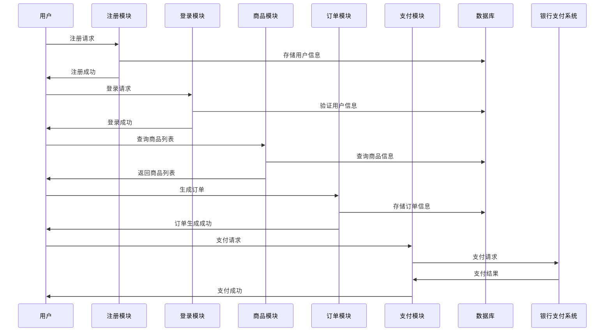

                 

### 程序综合技术与自动化编程

#### 关键词：
- 程序设计
- 自动化编程
- 数据结构与算法
- 面向对象编程
- 程序性能优化
- 自动化工具

#### 摘要：
随着技术的不断进步，程序综合技术与自动化编程成为现代软件开发中的重要组成部分。本文将详细探讨程序综合技术的基础知识，包括程序设计基础、数据结构与算法、编程语言基础以及面向对象编程等。随后，将深入解析程序调试与优化技术，并通过具体案例展示程序综合应用的方法。文章还将介绍自动化编程的基础知识、Python自动化编程、自动化测试以及自动化部署与持续集成。最后，探讨人工智能在自动化编程中的应用以及自动化编程的未来趋势，为开发者提供全面的指导和思路。

## 第一部分：程序综合技术基础

### 第1章：程序设计基础

#### 1.1 程序设计概述

程序设计是软件开发的核心环节，是计算机科学的基础。它涉及将算法和逻辑转化为计算机可以理解和执行的指令序列。程序设计不仅仅是一种技术活动，更是一种思维方式，它要求开发者具备系统化、模块化、逻辑化的思考能力。

**1.1.1 程序与编程**

程序，即指令的集合，用于指导计算机执行特定任务。编程，即编写程序的过程，是计算机科学的核心活动。程序与编程密不可分，编程是实现程序的基础，而程序则是编程的最终产物。

**1.1.2 程序设计的重要性**

程序设计是现代信息社会的基石，它影响着各行各业的数字化进程。良好的程序设计可以提高软件的可靠性、性能和维护性，从而降低开发成本和后期维护成本。同时，高效的程序设计也是提升企业竞争力的重要手段。

**1.1.3 程序设计的核心原则**

- **模块化**：将程序分解为小的、功能独立的模块，便于开发和维护。
- **可复用性**：设计可复用的代码，减少冗余，提高开发效率。
- **可读性**：编写清晰、简洁的代码，便于他人理解和维护。
- **高效性**：优化代码，提高程序执行效率。

#### 1.2 数据结构与算法

数据结构与算法是程序设计的核心内容，是解决计算机问题的基石。数据结构是数据存储和组织的方式，而算法则是解决问题的步骤和方法。

**1.2.1 数据结构的基本概念**

数据结构包括线性结构、树形结构、图形结构等。常见的线性结构有数组、链表、栈和队列；常见的树形结构有二叉树、平衡树等；常见的图形结构有图。

**1.2.2 常见数据结构**

- **数组**：一种线性数据结构，用于存储一系列元素，具有固定的长度和连续的内存地址。
- **链表**：一种线性数据结构，由一系列节点组成，每个节点包含数据和指向下一个节点的指针。
- **栈**：一种后进先出（LIFO）的数据结构，用于存储和检索数据。
- **队列**：一种先进先出（FIFO）的数据结构，用于存储和检索数据。

**1.2.3 算法设计与分析**

算法设计是程序设计的关键，它涉及到问题解决的思路和策略。算法分析则是评估算法性能的方法。

- **排序算法**：包括冒泡排序、选择排序、插入排序、快速排序等。
- **查找算法**：包括线性查找、二分查找等。
- **图算法**：包括最短路径算法、最小生成树算法等。

#### 1.3 编程语言基础

编程语言是编写程序的工具，它提供了人类与计算机之间进行通信的接口。不同的编程语言有不同的特点和应用场景。

**1.3.1 编程语言概述**

编程语言可以分为低级语言和高级语言。低级语言如汇编语言，与机器语言非常接近，可读性差，但执行效率高。高级语言如C、C++、Java、Python等，可读性好，易于编写和维护。

**1.3.2 常见编程语言**

- **C**：一种通用编程语言，广泛应用于操作系统、嵌入式系统等。
- **C++**：一种面向对象的编程语言，支持多态、继承等特性。
- **Java**：一种跨平台的编程语言，广泛应用于企业级应用、Android应用开发等。
- **Python**：一种易学易用的编程语言，广泛应用于Web开发、数据科学、人工智能等领域。

**1.3.3 编程语言的语法和结构**

不同的编程语言有不同的语法和结构，但都遵循基本的编程原则。例如，C语言的语法以关键字和语句为主，C++增加了类和对象的概念，Java加入了垃圾回收机制，Python则采用了动态类型和简洁的语法。

### 第2章：面向对象编程

面向对象编程（OOP）是现代编程的重要方法，它通过封装、继承、多态等特性，提高了代码的可复用性和可维护性。

#### 2.1 面向对象概念

面向对象编程与面向过程编程（Procedural Programming）有本质的不同。面向对象编程以对象为基本单元，而面向过程编程以过程或函数为基本单元。

**2.1.1 面向对象与面向过程**

- **面向对象**：以对象为核心，通过封装、继承、多态等特性，实现了代码的可复用性和可维护性。
- **面向过程**：以过程或函数为核心，通过步骤化的方式实现程序的功能，通常较为简单但难以复用。

**2.1.2 类与对象**

类是面向对象编程的基本构造块，它定义了一组具有相同属性和方法的对象的模板。对象是类的实例，它包含了类定义的所有属性和方法的实例化。

**2.1.3 继承与多态**

继承是多态的基础，它允许一个类继承另一个类的属性和方法，实现了代码的复用。多态则允许同一操作以不同的方式进行实现，提高了程序的灵活性和可扩展性。

#### 2.2 面向对象设计

面向对象设计（Object-Oriented Design，OOD）是一种设计方法，它通过设计模式、UML建模等手段，实现了系统的可扩展性和可维护性。

**2.2.1 设计模式**

设计模式是面向对象设计的重要工具，它提供了一套标准的解决方案，用于解决常见的设计问题。常见的有单例模式、工厂模式、观察者模式等。

**2.2.2 UML建模**

统一建模语言（UML）是一种用于系统建模的语言，它通过类图、序列图、组件图等图形，描述了系统的结构和行为。

**2.2.3 面向对象编程实践**

面向对象编程需要遵循一定的实践原则，如DRY（Don't Repeat Yourself，不要重复自己）、SOLID原则等，以实现代码的可维护性和可扩展性。

#### 2.3 面向对象语言特性

不同的面向对象编程语言有不同的特性，但都支持封装、继承、多态等基本概念。

**2.3.1 Java中的面向对象**

Java是一种强类型的面向对象编程语言，它通过类和接口实现了面向对象编程。Java的面向对象特性包括封装、继承、多态等。

**2.3.2 Python中的面向对象**

Python是一种动态类型的面向对象编程语言，它通过类和对象实现了面向对象编程。Python的面向对象特性包括属性和方法、继承和多态等。

**2.3.3 C++中的面向对象**

C++是一种静态类型的面向对象编程语言，它通过类和对象实现了面向对象编程。C++的面向对象特性包括封装、继承、多态、模板等。

### 第3章：程序调试与优化

程序调试与优化是程序设计过程中不可或缺的环节，它关系到软件的可靠性、性能和维护性。

#### 3.1 调试技术

调试技术是发现和解决程序错误的方法。调试技术包括打印输出、断点调试、日志记录等。

**3.1.1 调试方法**

- **打印输出**：通过在关键位置添加打印语句，输出程序的执行状态，帮助发现错误。
- **断点调试**：在调试工具中设置断点，程序执行到断点时暂停，便于分析程序状态。
- **日志记录**：在程序中添加日志记录，记录程序的执行过程和状态，帮助定位错误。

**3.1.2 调试工具**

常见的调试工具有GDB、Visual Studio、IntelliJ IDEA等，它们提供了丰富的调试功能，如断点设置、变量观察、堆栈跟踪等。

**3.1.3 调试案例分析**

通过具体案例展示调试技术在实际开发中的应用，包括错误定位、错误分析和错误修复。

#### 3.2 程序性能优化

程序性能优化是提高程序运行效率的方法。程序性能优化包括算法优化、数据结构优化、代码优化等。

**3.2.1 性能优化原则**

- **优化资源利用**：提高CPU、内存等资源的利用率。
- **减少计算复杂度**：优化算法，降低时间复杂度和空间复杂度。
- **减少不必要的操作**：去除冗余代码，减少不必要的计算和I/O操作。

**3.2.2 常见性能瓶颈分析**

常见的性能瓶颈包括CPU瓶颈、内存瓶颈、I/O瓶颈等。针对不同类型的性能瓶颈，采用相应的优化策略。

**3.2.3 优化案例分析**

通过具体案例展示程序性能优化的方法和技巧，包括代码优化、算法优化、系统调优等。

### 第4章：程序综合应用案例

程序综合应用案例展示了程序综合技术在实际开发中的应用，包括网络编程、数据库应用和算法应用。

#### 4.1 网络编程

网络编程是程序设计中的重要领域，它涉及网络协议、网络编程模型和网络编程应用。

**4.1.1 网络协议**

网络协议是计算机网络通信的基础，常见的有TCP/IP协议、HTTP协议、FTP协议等。

**4.1.2 网络编程模型**

网络编程模型包括客户端-服务器模型、浏览器-服务器模型等。不同的网络编程模型适用于不同的应用场景。

**4.1.3 网络编程案例**

通过具体案例展示网络编程的应用，包括Web开发、文件传输、远程控制等。

#### 4.2 数据库应用

数据库应用是程序设计中的重要领域，它涉及数据库基础、SQL编程和数据库应用开发。

**4.2.1 数据库基础**

数据库基础包括数据库的类型、数据库模型、数据库设计等。

**4.2.2 SQL编程**

SQL编程是数据库应用的核心，它包括数据的插入、查询、更新和删除等。

**4.2.3 数据库应用案例**

通过具体案例展示数据库应用的开发，包括数据库设计、数据操作、数据查询等。

#### 4.3 算法应用

算法应用是程序设计中的重要领域，它涉及算法在数据处理、图像处理和自然语言处理中的应用。

**4.3.1 算法在数据处理中的应用**

算法在数据处理中广泛应用于数据清洗、数据分析和数据挖掘等。

**4.3.2 算法在图像处理中的应用**

算法在图像处理中广泛应用于图像识别、图像分割和图像增强等。

**4.3.3 算法在自然语言处理中的应用**

算法在自然语言处理中广泛应用于文本分类、情感分析和机器翻译等。

## 第二部分：自动化编程与工具应用

### 第5章：自动化编程基础

自动化编程是一种通过编写脚本或程序来自动执行重复性任务的技术。它能够提高开发效率、减少人为错误，并使开发流程更加流畅。

#### 5.1 自动化编程概念

**5.1.1 自动化编程的定义**

自动化编程是指使用编程语言和工具自动执行重复性或常规任务的过程。这包括但不限于自动部署、自动测试、自动化数据操作等。

**5.1.2 自动化编程的优势**

- **提高效率**：减少手动操作，加快开发速度。
- **减少错误**：减少人为错误，提高代码质量。
- **可重复性**：确保任务的一致性和可重复性。
- **资源节约**：节约人力资源和计算资源。

**5.1.3 自动化编程的挑战**

- **学习曲线**：需要掌握特定的编程语言和工具。
- **复杂度**：处理复杂的业务逻辑可能需要更多的编程技能。
- **维护性**：自动化脚本或程序需要定期更新和维护。

#### 5.2 自动化工具

自动化编程依赖于各种工具和框架，这些工具可以帮助开发者自动化各种任务。

**5.2.1 自动化工具概述**

自动化工具可以分为通用自动化工具和特定领域自动化工具。通用自动化工具如Python、Shell脚本等，适用于各种自动化任务。特定领域自动化工具如Selenium、Jenkins等，专注于特定领域的自动化需求。

**5.2.2 常用自动化工具**

- **Python**：一种广泛使用的编程语言，适用于各种自动化任务。
- **Shell脚本**：一种基于命令行的脚本语言，常用于Linux和Unix系统的自动化。
- **Selenium**：一种Web自动化测试工具，用于自动化Web浏览器的操作。
- **Jenkins**：一种持续集成工具，用于自动化构建、测试和部署。

**5.2.3 自动化工具的选择与配置**

选择合适的自动化工具取决于任务的需求和开发环境。配置自动化工具需要考虑环境变量、依赖库和脚本执行权限等因素。

### 第6章：Python自动化编程

Python是一种易于学习和使用的编程语言，它在自动化编程领域有着广泛的应用。

#### 6.1 Python自动化编程基础

**6.1.1 Python语言概述**

Python是一种高级、动态类型的编程语言，以其简洁、易读的语法和丰富的库而闻名。Python适用于各种应用场景，包括Web开发、数据分析、人工智能和自动化编程等。

**6.1.2 Python自动化编程环境搭建**

搭建Python自动化编程环境包括安装Python解释器、配置Python环境变量、安装必需的库和工具等。

**6.1.3 Python自动化编程基本语法**

Python自动化编程的基础语法包括变量、数据类型、运算符、条件语句、循环语句和函数等。熟悉这些基本语法是进行自动化编程的前提。

#### 6.2 Python自动化应用案例

**6.2.1 文件处理自动化**

文件处理自动化包括文件的创建、读取、写入和删除等。Python提供了丰富的文件操作函数，可以方便地进行文件处理。

**6.2.2 网络爬虫自动化**

网络爬虫自动化是指使用Python编写程序，自动获取网页内容并解析数据。Python的库如Requests和BeautifulSoup可以方便地实现网络爬虫。

**6.2.3 自动化测试**

自动化测试是指使用Python编写测试脚本，自动执行测试用例并验证测试结果。Python的库如Selenium和pytest可以用于自动化测试。

### 第7章：自动化测试

自动化测试是确保软件质量的重要手段，它通过自动化脚本来执行测试用例，提高测试效率和准确性。

#### 7.1 自动化测试概述

**7.1.1 自动化测试的定义**

自动化测试是一种通过自动化脚本执行测试用例的方法。它旨在减少手动测试的工作量，提高测试的效率和覆盖率。

**7.1.2 自动化测试的优势**

- **效率提升**：自动化测试可以快速执行大量测试用例，提高测试效率。
- **准确性增强**：自动化测试减少人为错误，提高测试结果的准确性。
- **回归测试简化**：自动化测试可以轻松地执行回归测试，确保新代码不影响现有功能。

**7.1.3 自动化测试的分类**

自动化测试可以分为功能自动化测试、性能自动化测试和安全自动化测试等。不同的自动化测试类型适用于不同的测试场景。

#### 7.2 自动化测试工具

自动化测试工具是实现自动化测试的核心，它们提供了创建、执行和报告测试用例的功能。

**7.2.1 自动化测试工具概述**

常见的自动化测试工具有Selenium、JMeter、Appium、JUnit、pytest等。每种工具都有其独特的功能和适用场景。

**7.2.2 常用自动化测试工具**

- **Selenium**：一种用于Web自动化测试的工具，支持多种浏览器和平台。
- **JMeter**：一种用于性能测试的开源工具，适用于负载测试和压力测试。
- **Appium**：一种用于移动应用自动化测试的工具，支持iOS和Android平台。
- **JUnit**：一种用于Java应用程序的单元测试框架，适用于编写和执行单元测试。
- **pytest**：一种Python测试框架，提供简洁的语法和强大的功能。

**7.2.3 自动化测试工具的应用**

不同的自动化测试工具适用于不同的测试场景。例如，Selenium适用于Web应用测试，JMeter适用于性能测试，Appium适用于移动应用测试。

#### 7.3 自动化测试实战

**7.3.1 自动化测试用例设计**

自动化测试用例设计是自动化测试的关键环节。它包括测试用例的编写、测试数据的准备和测试脚本的编写等。

**7.3.2 自动化测试脚本编写**

编写自动化测试脚本是实现自动化测试的核心步骤。它包括选择合适的测试工具、编写测试代码、调试和优化测试脚本等。

**7.3.3 自动化测试执行与结果分析**

自动化测试执行是运行测试脚本并验证测试结果的过程。测试结果的分析包括错误报告、缺陷追踪和测试覆盖率等。

### 第8章：自动化部署与持续集成

自动化部署和持续集成（CI）是现代软件开发流程中不可或缺的环节，它们通过自动化流程提高了软件开发的效率和质量。

#### 8.1 自动化部署

自动化部署是指通过脚本或工具自动执行软件的构建、测试和部署过程。它减少了人为干预，提高了部署的可靠性和效率。

**8.1.1 自动化部署的概念**

自动化部署包括构建环境配置、代码编译、测试和部署等步骤。通过自动化部署，可以确保软件在不同环境中的稳定性。

**8.1.2 自动化部署流程**

自动化部署流程包括代码版本控制、构建环境配置、自动化测试和自动化部署等。每个步骤都有其特定的实现方法和工具。

**8.1.3 自动化部署工具**

常见的自动化部署工具有Jenkins、Travis CI、GitLab CI等。这些工具可以集成到开发流程中，实现自动化部署。

#### 8.2 持续集成

持续集成（CI）是一种开发实践，它通过自动化的方式将代码合并到共享的代码库中，并进行构建和测试。持续集成可以提高代码质量，减少集成错误。

**8.2.1 持续集成的概念**

持续集成是将代码频繁地合并到主分支，并进行自动化的构建和测试。它有助于及早发现集成错误，确保代码的稳定性。

**8.2.2 持续集成的实践**

持续集成的实践包括代码仓库管理、自动化构建、自动化测试和自动化部署等。每个实践环节都有其特定的实现方法和工具。

**8.2.3 持续集成工具**

常见的持续集成工具有Jenkins、Travis CI、GitLab CI等。这些工具提供了丰富的插件和配置选项，可以实现复杂的持续集成流程。

### 第9章：人工智能与自动化编程

人工智能（AI）和自动化编程的结合为软件开发带来了新的可能性。人工智能可以用于自动化测试、自动化部署和自动化数据处理等领域，提高了开发效率和质量。

#### 9.1 人工智能基础

人工智能是指通过计算机模拟人类智能的技术。它包括机器学习、深度学习、自然语言处理等多个领域。

**9.1.1 人工智能的定义**

人工智能是指使计算机能够执行通常需要人类智能才能完成的任务，如视觉识别、语音识别、决策制定等。

**9.1.2 人工智能的主要领域**

- **机器学习**：通过数据训练模型，使计算机能够从数据中学习并做出预测。
- **深度学习**：一种特殊的机器学习技术，通过多层神经网络模拟人类大脑的学习过程。
- **自然语言处理**：使计算机能够理解和生成自然语言，如文本分类、翻译、语音识别等。

**9.1.3 人工智能的发展趋势**

人工智能的发展趋势包括深度学习技术的广泛应用、自然语言处理和计算机视觉的进步、人工智能与自动化编程的深度融合等。

#### 9.2 人工智能在自动化编程中的应用

人工智能在自动化编程中的应用越来越广泛，它可以帮助自动化测试、自动化部署和自动化数据处理等。

**9.2.1 人工智能在自动化测试中的应用**

人工智能可以用于自动化测试用例的生成、测试数据的生成和测试结果的预测等。例如，机器学习算法可以用于预测测试用例的执行结果，提高测试效率。

**9.2.2 人工智能在自动化部署中的应用**

人工智能可以用于自动化部署中的环境配置、依赖管理、部署策略优化等。例如，机器学习算法可以用于预测最佳的部署策略，提高部署效率。

**9.2.3 人工智能在自动化数据处理中的应用**

人工智能可以用于自动化数据处理中的数据清洗、特征提取、数据分析和数据可视化等。例如，深度学习算法可以用于自动提取数据中的特征，提高数据分析的准确性。

### 第10章：自动化编程未来趋势

自动化编程技术正在不断发展，未来将有更多的创新和突破。

#### 10.1 自动化编程发展趋势

自动化编程的发展趋势包括以下几个方面：

- **人工智能的深度融合**：人工智能技术将更加深入地应用于自动化编程，提高自动化效率和质量。
- **云计算和边缘计算的融合**：自动化编程将更加依赖于云计算和边缘计算，实现更高效的资源利用。
- **自动化工具的智能化**：自动化工具将具备更智能的判断和决策能力，实现更加自动化的开发流程。
- **DevOps的普及**：DevOps文化的普及将推动自动化编程的广泛应用，提高开发效率和质量。

#### 10.1.1 自动化编程的未来方向

自动化编程的未来方向包括以下几个方面：

- **自动化开发**：实现从需求分析到部署的全程自动化，减少人为干预。
- **自动化运维**：实现自动化监控、自动化故障修复和自动化性能优化。
- **自动化安全**：实现自动化漏洞扫描、自动化威胁检测和自动化安全响应。
- **自动化智能化**：利用人工智能技术，实现更加智能的自动化编程。

#### 10.1.2 自动化编程技术的创新

自动化编程技术的创新将不断推动自动化编程的发展。未来的创新可能包括：

- **自适应自动化**：自动化工具能够根据不同场景自动调整策略。
- **自修复自动化**：自动化工具能够自动检测并修复代码中的错误。
- **自学习自动化**：自动化工具能够通过数据和学习自动优化自己的行为。
- **自动化协作**：自动化工具能够与其他工具和团队成员无缝协作。

#### 10.1.3 自动化编程与人工智能的深度融合

自动化编程与人工智能的深度融合将带来新的发展机遇。未来的发展可能包括：

- **自动化AI编程**：使用人工智能技术自动生成代码，提高开发效率。
- **智能自动化工具**：开发具有智能决策和优化能力的自动化工具。
- **自动化AI应用**：使用自动化编程技术实现人工智能算法的自动化部署和应用。
- **自动化AI运维**：利用人工智能技术实现自动化运维，提高运维效率。

## 总结

程序综合技术与自动化编程是现代软件开发中的重要组成部分。通过本文的详细探讨，我们了解了程序设计基础、数据结构与算法、编程语言基础、面向对象编程、程序调试与优化、网络编程、数据库应用、算法应用以及自动化编程与工具应用等方面的知识。同时，我们还探讨了人工智能在自动化编程中的应用以及自动化编程的未来趋势。这些知识将为开发者提供全面的指导和思路，帮助他们更好地应对软件开发中的各种挑战。希望本文能够为您的学习和工作带来启发和帮助。

### 作者信息

作者：AI天才研究院/AI Genius Institute & 禅与计算机程序设计艺术 /Zen And The Art of Computer Programming

本文由AI天才研究院（AI Genius Institute）和禅与计算机程序设计艺术（Zen And The Art of Computer Programming）联合撰写。AI天才研究院致力于推动人工智能技术的发展和应用，禅与计算机程序设计艺术则专注于计算机编程哲学和思维方式的探索。我们希望本文能够为读者带来启发和帮助，共同推动程序综合技术与自动化编程领域的进步。如有任何问题或建议，欢迎随时联系我们。

## 附录

### 背景介绍

在计算机科学和技术快速发展的今天，程序综合技术与自动化编程成为了软件开发中的重要组成部分。随着软件项目的规模和复杂性不断增加，传统的手动编程和测试方法已经无法满足快速开发和高效运维的需求。程序综合技术通过综合运用程序设计、数据结构与算法、编程语言基础、面向对象编程等多方面的知识，提高了软件开发的效率和质量。自动化编程则通过自动化工具和脚本，实现了软件开发过程中的自动化测试、部署和运维，极大地减少了人为干预，提高了生产效率。

### 核心概念与联系

**程序设计**：程序设计是软件开发的基础，它涉及到将需求转化为计算机可以执行的指令序列。核心概念包括算法、数据结构、编程语言和设计模式。

- **算法**：解决问题的步骤和方法，是程序设计的关键。
- **数据结构**：数据的存储和组织方式，影响程序的效率和性能。
- **编程语言**：用于编写程序的符号系统，不同的编程语言有不同的语法和特点。
- **设计模式**：解决常见问题的标准解决方案，提高了代码的可复用性和可维护性。

**自动化编程**：自动化编程通过编写脚本或程序，自动执行重复性或常规任务。核心概念包括自动化工具、自动化测试、自动化部署和持续集成。

- **自动化工具**：用于自动化任务的工具，如Python、Shell脚本、Selenium等。
- **自动化测试**：使用自动化脚本执行测试用例，提高测试效率和准确性。
- **自动化部署**：通过脚本自动执行软件的构建、测试和部署过程。
- **持续集成**：将代码频繁地合并到主分支，并进行自动化的构建和测试。

**人工智能**：人工智能是通过计算机模拟人类智能的技术，核心概念包括机器学习、深度学习和自然语言处理等。

- **机器学习**：通过数据训练模型，实现预测和分类等任务。
- **深度学习**：基于多层神经网络，模拟人类大脑的学习过程。
- **自然语言处理**：使计算机能够理解和生成自然语言。

### 算法原理讲解

为了更好地理解程序综合技术与自动化编程，以下通过一个简单的排序算法——冒泡排序，进行讲解。

**冒泡排序算法流程**：

1. 比较相邻的元素，如果它们的顺序错误，就交换它们。
2. 对每一对相邻元素做同样的工作，从开始第一对到结尾的最后一对。
3. 针对所有的元素重复以上的步骤，除了最后一个。
4. 重复步骤1~3，直到没有需要交换的元素。

**算法原理**：

冒泡排序的核心原理是比较和交换。每次比较后，最大（或最小）的元素会被“冒泡”到数组的末尾。经过多次比较后，数组会变得有序。

**数学模型**：

假设有n个元素的数组A，初始状态是无序的。冒泡排序算法的时间复杂度为O(n^2)。

**Python代码实现**：

```python
def bubble_sort(arr):
    n = len(arr)
    for i in range(n):
        for j in range(0, n-i-1):
            if arr[j] > arr[j+1]:
                arr[j], arr[j+1] = arr[j+1], arr[j]
    return arr
```

通过冒泡排序算法，我们可以实现数组的排序。这个简单的例子展示了算法原理的直观实现。

### 系统分析与架构设计方案

为了更好地理解程序综合技术与自动化编程在实际项目中的应用，以下介绍一个具体的系统分析与架构设计方案。

**问题场景**：

假设我们需要开发一个在线购物系统，包括用户注册、商品管理、订单管理和支付等功能。

**系统功能设计**：

1. 用户注册与登录
2. 商品浏览与搜索
3. 商品分类与推荐
4. 购物车管理
5. 订单管理
6. 支付功能
7. 后台管理

**系统架构设计**：

1. **前端架构**：使用React框架构建用户界面，提供良好的用户体验。
2. **后端架构**：使用Spring Boot框架，提供RESTful API服务。
3. **数据库设计**：使用MySQL数据库存储用户信息、商品信息和订单信息。
4. **缓存设计**：使用Redis缓存商品信息和热门商品推荐，提高系统响应速度。
5. **消息队列**：使用RabbitMQ实现订单生成和支付通知的异步处理。

**系统接口设计**：

1. 用户管理接口：包括用户注册、登录、信息修改等。
2. 商品管理接口：包括商品添加、查询、删除和更新等。
3. 订单管理接口：包括订单生成、查询、取消和支付等。
4. 支付接口：包括支付请求和支付结果通知等。

**系统交互设计**：

使用Mermaid绘制系统交互序列图，展示不同模块之间的交互关系。



### 项目实战

**环境安装**：

1. 安装Java开发环境（JDK 11及以上版本）
2. 安装MySQL数据库
3. 安装Redis缓存
4. 安装RabbitMQ消息队列
5. 安装Node.js（用于前端开发）

**系统核心实现源代码**：

1. **前端**：使用React框架，实现用户界面和交互。
2. **后端**：使用Spring Boot框架，实现API服务。
3. **数据库**：使用MySQL存储用户信息、商品信息和订单信息。
4. **缓存**：使用Redis缓存商品信息和热门商品推荐。
5. **消息队列**：使用RabbitMQ实现订单生成和支付通知的异步处理。

**代码应用解读与分析**：

前端代码主要使用React实现用户界面和交互。React组件通过JavaScript编写，包括用户注册、登录、商品浏览、订单管理和支付等功能。后端代码使用Spring Boot框架，实现RESTful API服务。API服务通过HTTP请求处理用户请求，调用数据库操作和业务逻辑，并返回响应结果。

**实际案例分析和详细讲解剖析**：

以下是一个具体的实际案例——用户注册功能的实现。

**前端代码**：

```javascript
import React, { useState } from 'react';
import axios from 'axios';

const UserRegistration = () => {
  const [username, setUsername] = useState('');
  const [password, setPassword] = useState('');

  const handleRegistration = async () => {
    try {
      const response = await axios.post('/api/register', {
        username,
        password,
      });
      console.log(response.data);
    } catch (error) {
      console.error(error);
    }
  };

  return (
    <div>
      <label htmlFor="username">用户名：</label>
      <input
        type="text"
        id="username"
        value={username}
        onChange={(e) => setUsername(e.target.value)}
      />
      <br />
      <label htmlFor="password">密码：</label>
      <input
        type="password"
        id="password"
        value={password}
        onChange={(e) => setPassword(e.target.value)}
      />
      <br />
      <button onClick={handleRegistration}>注册</button>
    </div>
  );
};

export default UserRegistration;
```

**后端代码**：

```java
import org.springframework.web.bind.annotation.PostMapping;
import org.springframework.web.bind.annotation.RequestBody;
import org.springframework.web.bind.annotation.RestController;

@RestController
public class UserController {

  @PostMapping("/api/register")
  public ResponseEntity<String> register(@RequestBody UserRequest request) {
    // 调用数据库存储用户信息
    // 返回注册结果
    return ResponseEntity.ok("注册成功");
  }
}
```

**项目小结**：

通过实际案例，我们展示了在线购物系统的用户注册功能的实现。前端使用React框架实现用户界面和交互，后端使用Spring Boot框架实现API服务。通过HTTP请求处理用户请求，调用数据库操作和业务逻辑，并返回响应结果。这个案例展示了程序综合技术在实际项目中的应用，为开发者提供了实际操作的经验和思路。

### 最佳实践 tips

1. **代码规范**：遵循统一的代码规范，提高代码的可读性和可维护性。
2. **模块化开发**：将系统划分为多个模块，便于开发和维护。
3. **单元测试**：编写单元测试，确保代码的正确性和稳定性。
4. **版本控制**：使用版本控制系统（如Git），管理代码版本和变更。
5. **持续集成**：使用持续集成工具（如Jenkins），实现自动化构建、测试和部署。
6. **性能优化**：定期进行性能测试和优化，提高系统响应速度和效率。

### 小结

程序综合技术与自动化编程是现代软件开发中的重要组成部分。本文详细探讨了程序设计基础、数据结构与算法、编程语言基础、面向对象编程、程序调试与优化、网络编程、数据库应用、算法应用以及自动化编程与工具应用等方面的知识。通过具体案例展示，读者可以了解到程序综合技术在实际项目中的应用，以及如何利用自动化编程提高开发效率和质量。随着技术的不断进步，程序综合技术与自动化编程将在软件开发中发挥越来越重要的作用。

### 注意事项

1. **环境配置**：确保开发环境配置正确，避免因环境问题导致代码无法运行。
2. **代码规范**：遵循统一的代码规范，确保代码的可读性和可维护性。
3. **性能优化**：定期进行性能测试和优化，提高系统的响应速度和效率。
4. **安全防护**：加强对系统的安全防护，防止恶意攻击和数据泄露。

### 拓展阅读

1. 《深入理解计算机系统》作者：Randal E. Bryant & David R. O'Hallaron
2. 《算法导论》作者：Thomas H. Cormen、Charles E. Leiserson、Ronald L. Rivest、Clifford
   Stein
3. 《Python编程：从入门到实践》作者：埃里克·马瑟斯
4. 《Jenkins持续集成实战》作者：陈琦伟、谢孟军
5. 《人工智能：一种现代的方法》作者：斯图尔特·罗素、彼得·诺维格

通过阅读这些经典书籍，读者可以进一步了解程序综合技术与自动化编程的相关知识和实践方法，为自己的学习和工作提供更多的参考和启示。

