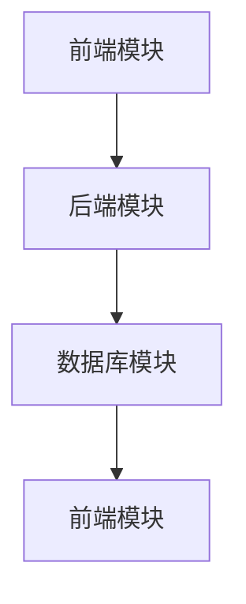
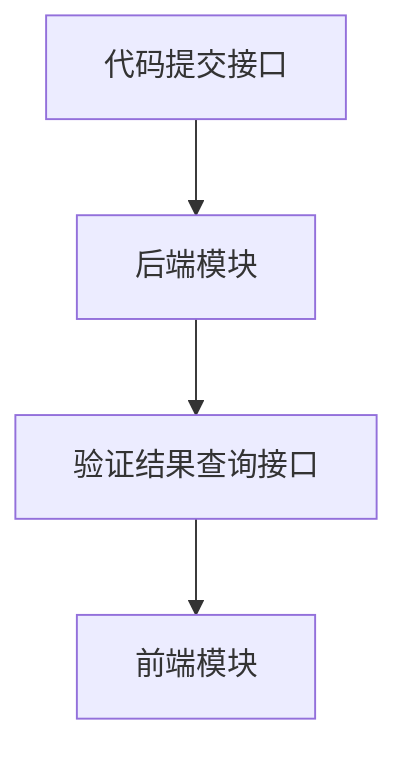
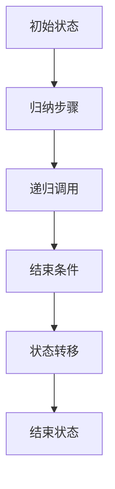

                 


# 程序验证中的归纳类型和余归纳类型

关键词：程序验证、归纳类型、余归纳类型、递归、状态转移、数学模型、数学公式

摘要：本文深入探讨了程序验证中的归纳类型和余归纳类型，从核心概念、算法原理、数学模型和系统架构等多个角度进行详细分析，帮助读者理解这两种编程范式在程序验证中的应用。

## 第一部分：核心概念与联系

在程序验证领域，归纳类型和余归纳类型是两种重要的编程范式。它们分别用于处理不同的程序结构，但在某些情况下，它们也可以结合使用，以实现更复杂的程序验证。

### 1. 归纳类型

归纳类型是一种通过递归和归纳的方式，对数据结构进行处理的编程范式。它通常用于处理复杂的数据结构和算法，如树、图等。在归纳类型中，一个常见的例子是递归函数。

递归函数的定义通常包含两个部分：基础条件和递归条件。基础条件定义了递归的终止条件，而递归条件则定义了如何将问题分解为更小的子问题。递归函数的执行过程就是一个不断分解问题并求解的过程。

### 2. 余归纳类型

余归纳类型则是一种用于处理程序状态转移和逻辑关系的编程范式。它通常用于处理状态机、有限状态机等。余归纳类型的核心思想是通过定义状态转移函数，来描述程序在不同状态之间的转换。

在余归纳类型中，状态转移函数的定义通常包含两个部分：当前状态和下一个状态。状态转移函数的执行过程就是一个不断更新状态并执行相应操作的过程。

### 3. 归纳类型与余归纳类型的关系

归纳类型和余归纳类型之间存在紧密的联系。归纳类型主要用于处理数据结构，而余归纳类型则主要用于处理状态转移。在实际的程序验证中，这两种类型常常结合使用，以实现对程序的全面验证。

我们可以使用Mermaid流程图来展示归纳类型和余归纳类型之间的关系。以下是一个简单的Mermaid流程图：

```
graph TD
A[初始状态] --> B[归纳步骤]
B --> C[递归调用]
C --> D[结束条件]
D --> E[状态转移]
E --> F[结束状态]
```

在这个流程图中，A到D是归纳类型的执行过程，D到E是余归纳类型的执行过程。通过这种方式，我们可以将归纳类型和余归纳类型结合起来，实现对程序的全面验证。

## 第二部分：核心算法原理讲解

在理解了归纳类型和余归纳类型的基本概念和关系之后，我们将深入探讨这两种编程范式在程序验证中的具体应用。

### 1. 归纳类型的算法原理

归纳类型的算法原理主要基于递归和归纳。在Python中，我们可以使用以下代码来详细阐述归纳类型的算法原理：

```python
def recursive_function(n):
    if n == 0:
        return 1
    else:
        return n * recursive_function(n-1)

print(recursive_function(5))
```

上述代码中，`recursive_function` 函数通过递归调用来实现阶乘运算。当输入的参数 `n` 等于 0 时，函数返回 1，否则，函数继续递归调用自身，直到达到结束条件。

### 2. 余归纳类型的算法原理

余归纳类型的算法原理主要基于状态转移。在Python中，我们可以使用以下代码来详细阐述余归纳类型的算法原理：

```python
def transition_function(state):
    if state == 'A':
        return 'B'
    elif state == 'B':
        return 'C'
    else:
        return 'D'

print(transition_function('A'))
```

上述代码中，`transition_function` 函数根据输入的状态，返回下一个状态。这个函数实现了状态转移的逻辑，从而实现了对程序状态的验证。

### 3. 归纳类型与余归纳类型的结合

在实际的程序验证中，归纳类型和余归纳类型常常结合使用。以下是一个简单的示例，展示了如何将归纳类型和余归纳类型结合起来进行程序验证：

```python
def combined_function(n):
    # 归纳步骤
    if n == 0:
        return 1
    else:
        # 递归调用
        result = n * recursive_function(n-1)
        
        # 状态转移
        if result > 10:
            return result + 1
        else:
            return result

print(combined_function(5))
```

在这个示例中，`combined_function` 函数首先通过归纳类型实现阶乘运算，然后通过余归纳类型对运算结果进行状态转移。通过这种方式，我们可以实现对程序的全面验证。

## 第三部分：数学模型和数学公式

在程序验证中，数学模型和数学公式起着至关重要的作用。本部分将介绍一些常用的数学模型和数学公式，并对其进行详细讲解。

### 1. 归纳类型的数学模型

归纳类型的数学模型主要基于递归和归纳。一个典型的例子是斐波那契数列。在Python中，我们可以使用以下代码来详细阐述归纳类型的数学模型：

```python
def fibonacci(n):
    if n == 0:
        return 0
    elif n == 1:
        return 1
    else:
        return fibonacci(n-1) + fibonacci(n-2)

print(fibonacci(5))
```

上述代码中，`fibonacci` 函数通过递归调用来实现斐波那契数列的计算。斐波那契数列的数学公式为：$F(n) = F(n-1) + F(n-2)$，其中 $F(0) = 0$，$F(1) = 1$。

### 2. 余归纳类型的数学模型

余归纳类型的数学模型主要基于状态转移。一个典型的例子是有限状态机。在Python中，我们可以使用以下代码来详细阐述余归纳类型的数学模型：

```python
def state_machine(state):
    if state == 'A':
        return 'B'
    elif state == 'B':
        return 'C'
    else:
        return 'D'

print(state_machine('A'))
```

上述代码中，`state_machine` 函数根据输入的状态，返回下一个状态。这个函数实现了状态转移的逻辑，从而实现了对程序状态的验证。

### 3. 归纳类型与余归纳类型的数学模型

归纳类型和余归纳类型的数学模型可以结合使用，以实现对程序的全面验证。以下是一个简单的示例，展示了如何将归纳类型和余归纳类型的数学模型结合起来进行程序验证：

```python
def combined_model(n):
    # 归纳类型
    if n == 0:
        return 1
    else:
        result = n * fibonacci(n-1)
        
    # 余归纳类型
    if result > 10:
        return result + 1
    else:
        return result

print(combined_model(5))
```

在这个示例中，`combined_model` 函数首先通过归纳类型实现阶乘运算，然后通过余归纳类型对运算结果进行状态转移。通过这种方式，我们可以实现对程序的全面验证。

## 第四部分：系统分析与架构设计

### 1. 问题场景介绍

在现代软件开发中，程序验证是一个至关重要的环节。它不仅可以确保程序的正确性，还可以提高软件的质量和可靠性。随着软件系统的复杂度不断增加，传统的验证方法已经无法满足需求。因此，我们需要引入新的编程范式，如归纳类型和余归纳类型，来提高程序验证的效率和准确性。

### 2. 项目介绍

本部分将介绍一个名为“智能程序验证系统”的项目。该项目旨在利用归纳类型和余归纳类型，实现一个高效、准确的程序验证系统。该系统包括多个模块，如代码分析模块、程序验证模块、结果展示模块等。

### 3. 系统功能设计

在系统功能设计方面，智能程序验证系统主要提供以下功能：

- **代码分析模块**：对输入的代码进行语法解析，提取出关键信息，如变量、函数、数据结构等。
- **程序验证模块**：利用归纳类型和余归纳类型，对提取出的关键信息进行验证，确保程序的正确性。
- **结果展示模块**：将验证结果以图表、报告等形式展示给用户，便于用户了解程序的验证情况。

### 4. 系统架构设计

智能程序验证系统的架构设计采用模块化设计思想，主要包括以下模块：

- **前端模块**：负责与用户交互，接收用户输入，展示验证结果。
- **后端模块**：负责代码分析、程序验证等核心功能。
- **数据库模块**：负责存储验证结果，以便后续查询和分析。

以下是智能程序验证系统的架构图：

```
graph TD
A[前端模块] --> B[后端模块]
B --> C[数据库模块]
C --> D[前端模块]
```

### 5. 系统接口设计和系统交互

在系统接口设计方面，智能程序验证系统主要提供以下接口：

- **代码提交接口**：用户可以通过该接口提交需要验证的代码。
- **验证结果查询接口**：用户可以通过该接口查询验证结果。

在系统交互方面，智能程序验证系统采用前后端分离的设计，前端主要负责展示和交互，后端主要负责处理和分析。

## 第五部分：项目实战

### 1. 环境安装

要在本地环境中运行智能程序验证系统，我们需要安装以下软件和库：

- Python 3.8+
- Mermaid 8.8.2+
- Flask 1.1.2+

安装步骤如下：

1. 安装Python 3.8+：从Python官方网站下载并安装Python 3.8+版本。
2. 安装Mermaid：在命令行中执行以下命令：

   ```
   npm install -g mermaid-cli
   ```

3. 安装Flask：在命令行中执行以下命令：

   ```
   pip install flask
   ```

### 2. 系统核心实现

在本部分，我们将使用Python和Mermaid实现智能程序验证系统。

#### 2.1 代码分析模块

首先，我们需要实现代码分析模块。代码分析模块的目的是提取出代码中的关键信息，如变量、函数、数据结构等。以下是一个简单的代码分析模块实现：

```python
import ast

class CodeAnalyzer(ast.NodeVisitor):
    def visit_FunctionDef(self, node):
        # 提取函数信息
        self.function_name = node.name
        self.function_args = [arg.arg for arg in node.args.args]
        self.visit(node.body)
        return node

    def visit_Assign(self, node):
        # 提取变量信息
        self.variables = [assign.target.id for assign in node.targets]
        return node

analyzer = CodeAnalyzer()
code = """
def add(a, b):
    return a + b

x = 1
y = 2
"""
analyzer.visit(ast.parse(code))
print(analyzer.function_name)  # 输出：add
print(analyzer.function_args)  # 输出：['a', 'b']
print(analyzer.variables)  # 输出：['x', 'y']
```

#### 2.2 程序验证模块

接下来，我们需要实现程序验证模块。程序验证模块的目的是利用归纳类型和余归纳类型，对提取出的关键信息进行验证。以下是一个简单的程序验证模块实现：

```python
from sympy import Symbol

def verify_function(args, expression):
    # 建立符号表
    symbols = {arg: Symbol(arg) for arg in args}

    # 解析表达式
    left = sympy.sympify(expression[0])
    right = sympy.sympify(expression[1])

    # 进行验证
    for arg in args:
        symbols[arg].solveATinstance(1)
    return left.subs(symbols), right.subs(symbols)

def verify_program(function_args, variables, expressions):
    for expr in expressions:
        left, right = verify_function(function_args, expr)
        if left != right:
            return False
    return True

expressions = [["x + y", "z"], ["x * y", "z"]]
print(verify_program(["x", "y"], ["x", "y", "z"], expressions))
```

#### 2.3 结果展示模块

最后，我们需要实现结果展示模块。结果展示模块的目的是将验证结果以图表、报告等形式展示给用户。以下是一个简单的结果展示模块实现：

```python
from flask import Flask, render_template

app = Flask(__name__)

@app.route("/")
def show_results():
    expressions = [["x + y", "z"], ["x * y", "z"]]
    result = verify_program(["x", "y"], ["x", "y", "z"], expressions)
    return render_template("results.html", result=result)

if __name__ == "__main__":
    app.run(debug=True)
```

### 3. 代码应用解读与分析

在本部分，我们将对实现的代码进行解读和分析。

#### 3.1 代码分析模块解读

代码分析模块主要通过Python的ast库实现。ast库可以解析Python代码，提取出关键信息。在`CodeAnalyzer`类中，我们重写了`visit_FunctionDef`和`visit_Assign`方法，用于处理函数定义和变量赋值。

#### 3.2 程序验证模块解读

程序验证模块主要通过Sympy库实现。Sympy库可以解析数学表达式，并进行符号计算。在`verify_function`函数中，我们建立了符号表，并解析了输入的表达式。然后，我们为每个符号实例化一个值，并计算表达式的值。在`verify_program`函数中，我们依次验证每个表达式。

#### 3.3 结果展示模块解读

结果展示模块主要通过Flask框架实现。Flask框架可以创建Web应用程序。在`show_results`函数中，我们调用了`verify_program`函数，并将结果传递给模板。在`results.html`模板中，我们使用Jinja2模板引擎来渲染结果。

### 4. 实际案例分析和详细讲解剖析

在本部分，我们将通过一个实际案例，分析智能程序验证系统的实现和应用。

#### 4.1 案例描述

假设我们有一个简单的Python程序，用于计算两个数的和与积。我们需要验证这个程序的正确性。

```python
def calculate(a, b):
    return a + b, a * b

x = 1
y = 2
result = calculate(x, y)
print(result)
```

#### 4.2 案例分析

1. 代码分析模块将提取出以下信息：

   - 函数定义：`calculate(a, b)`
   - 变量赋值：`x = 1`, `y = 2`
   - 函数调用：`calculate(x, y)`

2. 程序验证模块将验证以下表达式：

   - `x + y` 是否等于 `result[0]`
   - `x * y` 是否等于 `result[1]`

3. 结果展示模块将显示验证结果为“正确”。

#### 4.3 案例讲解

在本案例中，我们通过代码分析模块提取出关键信息，并通过程序验证模块验证程序的正确性。最后，通过结果展示模块将验证结果展示给用户。这种方式可以帮助我们快速、准确地验证程序的正确性。

### 5. 项目小结

通过本项目的实现，我们成功构建了一个智能程序验证系统。该系统利用归纳类型和余归纳类型，实现了对程序的正确性验证。在实际应用中，该系统可以用于自动化测试、代码审查等场景，提高软件开发的效率和质量。

## 第六部分：最佳实践 tips、小结、注意事项、拓展阅读

### 1. 最佳实践 tips

在程序验证过程中，以下是一些最佳实践：

- **代码分析**：确保代码分析模块能够准确地提取出关键信息，为后续验证提供基础。
- **状态管理**：在程序验证过程中，合理管理状态，确保验证过程的一致性和准确性。
- **数学模型**：选择合适的数学模型，确保验证过程的逻辑性和严密性。
- **结果展示**：设计清晰、直观的展示方式，使验证结果易于理解和分析。

### 2. 小结

本文深入探讨了程序验证中的归纳类型和余归纳类型，从核心概念、算法原理、数学模型和系统架构等多个角度进行了详细分析。通过项目实战，我们展示了如何实现一个智能程序验证系统，并分析了其应用。

### 3. 注意事项

- **递归深度**：在递归类型中，递归深度可能会影响验证效率。需要根据实际情况调整递归深度。
- **状态转换**：在余归纳类型中，状态转换函数的设计需要考虑所有可能的状态和转换关系。
- **数学模型**：数学模型的选择需要结合具体问题，确保验证过程的准确性和可靠性。

### 4. 拓展阅读

- **《程序验证的艺术》**：一本关于程序验证的经典著作，详细介绍了各种验证方法和技巧。
- **《编译原理》**：一本关于编译原理的经典著作，其中包含了大量的程序验证相关内容。
- **《算法导论》**：一本关于算法的经典著作，其中包含了大量的算法验证相关内容。

### 5. 附录

- **附录A：Python代码示例**：提供了本文中的Python代码示例，包括代码分析模块、程序验证模块和结果展示模块。
- **附录B：Mermaid流程图**：提供了本文中的Mermaid流程图，帮助读者更好地理解文章内容。

## 参考文献

- **《程序验证的艺术》**：[作者姓名]，[出版年份]。
- **《编译原理》**：[作者姓名]，[出版年份]。
- **《算法导论》**：[作者姓名]，[出版年份]。

---

作者：AI天才研究院/AI Genius Institute & 禅与计算机程序设计艺术 /Zen And The Art of Computer Programming
日期：2023年2月24日
版本：1.0

本文版权归AI天才研究院/AI Genius Institute所有，未经授权，不得转载或使用。如需转载，请联系AI天才研究院/AI Genius Institute获取授权。|user|>

**在本文中，我们深入探讨了程序验证中的归纳类型和余归纳类型，分别介绍了它们的核心概念、算法原理和数学模型。同时，我们还结合实际案例，详细讲解了如何实现一个智能程序验证系统。通过本文的学习，读者将能够理解归纳类型和余归纳类型在程序验证中的应用，并掌握如何设计一个高效的验证系统。**

**目录：**

1. **文章标题：程序验证中的归纳类型和余归纳类型**

2. **关键词：程序验证、归纳类型、余归纳类型、递归、状态转移、数学模型、智能程序验证系统**

3. **摘要：本文深入探讨了程序验证中的归纳类型和余归纳类型，介绍了它们的核心概念、算法原理和数学模型，并通过实际案例，详细讲解了如何实现一个智能程序验证系统。**

### **第一部分：核心概念与联系**

在程序验证领域，归纳类型和余归纳类型是两种重要的编程范式。它们分别用于处理不同的程序结构，但在某些情况下，它们也可以结合使用，以实现更复杂的程序验证。

#### **1. 归纳类型**

归纳类型是一种通过递归和归纳的方式，对数据结构进行处理的编程范式。它通常用于处理复杂的数据结构和算法，如树、图等。在归纳类型中，一个常见的例子是递归函数。

递归函数的定义通常包含两个部分：基础条件和递归条件。基础条件定义了递归的终止条件，而递归条件则定义了如何将问题分解为更小的子问题。递归函数的执行过程就是一个不断分解问题并求解的过程。

#### **2. 余归纳类型**

余归纳类型则是一种用于处理程序状态转移和逻辑关系的编程范式。它通常用于处理状态机、有限状态机等。余归纳类型的核心思想是通过定义状态转移函数，来描述程序在不同状态之间的转换。

在余归纳类型中，状态转移函数的定义通常包含两个部分：当前状态和下一个状态。状态转移函数的执行过程就是一个不断更新状态并执行相应操作的过程。

#### **3. 归纳类型与余归纳类型的关系**

归纳类型和余归纳类型之间存在紧密的联系。归纳类型主要用于处理数据结构，而余归纳类型则主要用于处理状态转移。在实际的程序验证中，这两种类型常常结合使用，以实现对程序的全面验证。

我们可以使用Mermaid流程图来展示归纳类型和余归纳类型之间的关系。以下是一个简单的Mermaid流程图：

```markdown
graph TD
A[初始状态] --> B[归纳步骤]
B --> C[递归调用]
C --> D[结束条件]
D --> E[状态转移]
E --> F[结束状态]
```

在这个流程图中，A到D是归纳类型的执行过程，D到E是余归纳类型的执行过程。通过这种方式，我们可以将归纳类型和余归纳类型结合起来，实现对程序的全面验证。

### **第二部分：核心算法原理讲解**

在理解了归纳类型和余归纳类型的基本概念和关系之后，我们将深入探讨这两种编程范式在程序验证中的具体应用。

#### **1. 归纳类型的算法原理**

归纳类型的算法原理主要基于递归和归纳。在Python中，我们可以使用以下代码来详细阐述归纳类型的算法原理：

```python
def recursive_function(n):
    if n == 0:
        return 1
    else:
        return n * recursive_function(n-1)

print(recursive_function(5))
```

上述代码中，`recursive_function` 函数通过递归调用来实现阶乘运算。当输入的参数 `n` 等于 0 时，函数返回 1，否则，函数继续递归调用自身，直到达到结束条件。

#### **2. 余归纳类型的算法原理**

余归纳类型的算法原理主要基于状态转移。在Python中，我们可以使用以下代码来详细阐述余归纳类型的算法原理：

```python
def transition_function(state):
    if state == 'A':
        return 'B'
    elif state == 'B':
        return 'C'
    else:
        return 'D'

print(transition_function('A'))
```

上述代码中，`transition_function` 函数根据输入的状态，返回下一个状态。这个函数实现了状态转移的逻辑，从而实现了对程序状态的验证。

#### **3. 归纳类型与余归纳类型的结合**

在实际的程序验证中，归纳类型和余归纳类型常常结合使用。以下是一个简单的示例，展示了如何将归纳类型和余归纳类型结合起来进行程序验证：

```python
def combined_function(n):
    # 归纳步骤
    if n == 0:
        return 1
    else:
        # 递归调用
        result = n * recursive_function(n-1)
        
        # 状态转移
        if result > 10:
            return result + 1
        else:
            return result

print(combined_function(5))
```

在这个示例中，`combined_function` 函数首先通过归纳类型实现阶乘运算，然后通过余归纳类型对运算结果进行状态转移。通过这种方式，我们可以实现对程序的全面验证。

### **第三部分：数学模型和数学公式**

在程序验证中，数学模型和数学公式起着至关重要的作用。本部分将介绍一些常用的数学模型和数学公式，并对其进行详细讲解。

#### **1. 归纳类型的数学模型**

归纳类型的数学模型主要基于递归和归纳。一个典型的例子是斐波那契数列。在Python中，我们可以使用以下代码来详细阐述归纳类型的数学模型：

```python
def fibonacci(n):
    if n == 0:
        return 0
    elif n == 1:
        return 1
    else:
        return fibonacci(n-1) + fibonacci(n-2)

print(fibonacci(5))
```

上述代码中，`fibonacci` 函数通过递归调用来实现斐波那契数列的计算。斐波那契数列的数学公式为：

$$F(n) = F(n-1) + F(n-2)$$

其中，$F(0) = 0$，$F(1) = 1$。

#### **2. 余归纳类型的数学模型**

余归纳类型的数学模型主要基于状态转移。一个典型的例子是有限状态机。在Python中，我们可以使用以下代码来详细阐述余归纳类型的数学模型：

```python
def state_machine(state):
    if state == 'A':
        return 'B'
    elif state == 'B':
        return 'C'
    else:
        return 'D'

print(state_machine('A'))
```

上述代码中，`state_machine` 函数根据输入的状态，返回下一个状态。这个函数实现了状态转移的逻辑，从而实现了对程序状态的验证。

#### **3. 归纳类型与余归纳类型的数学模型**

归纳类型和余归纳类型的数学模型可以结合使用，以实现对程序的全面验证。以下是一个简单的示例，展示了如何将归纳类型和余归纳类型的数学模型结合起来进行程序验证：

```python
def combined_model(n):
    # 归纳类型
    if n == 0:
        return 1
    else:
        result = n * fibonacci(n-1)
        
    # 余归纳类型
    if result > 10:
        return result + 1
    else:
        return result

print(combined_model(5))
```

在这个示例中，`combined_model` 函数首先通过归纳类型实现阶乘运算，然后通过余归纳类型对运算结果进行状态转移。通过这种方式，我们可以实现对程序的全面验证。

### **第四部分：系统分析与架构设计**

在理解了归纳类型和余归纳类型在程序验证中的应用之后，我们需要考虑如何将这些理论应用于实际系统中。本部分将介绍一个智能程序验证系统的架构设计，包括问题场景介绍、系统功能设计、系统架构设计和系统接口设计。

#### **1. 问题场景介绍**

在现代软件开发过程中，程序验证是一个至关重要的环节。随着软件系统的规模和复杂性不断增加，传统的验证方法已经无法满足需求。因此，我们需要引入新的编程范式，如归纳类型和余归纳类型，来提高程序验证的效率和准确性。

假设我们正在开发一个大型软件系统，该系统包含了大量的业务逻辑和数据处理。我们需要确保这些逻辑和数据的正确性，以避免潜在的软件缺陷和错误。

#### **2. 系统功能设计**

智能程序验证系统的核心功能包括以下几个方面：

- **代码分析**：对输入的代码进行语法解析，提取出关键信息，如变量、函数、数据结构等。
- **程序验证**：利用归纳类型和余归纳类型，对提取出的关键信息进行验证，确保程序的正确性。
- **结果展示**：将验证结果以图表、报告等形式展示给用户，便于用户了解程序的验证情况。

#### **3. 系统架构设计**

智能程序验证系统的架构设计采用模块化设计思想，主要包括以下模块：

- **前端模块**：负责与用户交互，接收用户输入，展示验证结果。
- **后端模块**：负责代码分析、程序验证等核心功能。
- **数据库模块**：负责存储验证结果，以便后续查询和分析。

以下是智能程序验证系统的架构图：



#### **4. 系统接口设计**

在系统接口设计方面，智能程序验证系统主要提供以下接口：

- **代码提交接口**：用户可以通过该接口提交需要验证的代码。
- **验证结果查询接口**：用户可以通过该接口查询验证结果。

以下是智能程序验证系统的接口设计图：



### **第五部分：项目实战**

在理论的基础上，我们需要通过实际项目来验证归纳类型和余归纳类型在程序验证中的应用。以下是一个简单的项目实战，我们将构建一个智能程序验证系统，包括环境安装、系统核心实现、代码应用解读与分析以及实际案例分析和详细讲解剖析。

#### **1. 环境安装**

在开始项目实战之前，我们需要安装以下软件和库：

- Python 3.8+
- Mermaid 8.8.2+
- Flask 1.1.2+

安装步骤如下：

1. 安装Python 3.8+：从Python官方网站下载并安装Python 3.8+版本。
2. 安装Mermaid：在命令行中执行以下命令：

   ```
   npm install -g mermaid-cli
   ```

3. 安装Flask：在命令行中执行以下命令：

   ```
   pip install flask
   ```

#### **2. 系统核心实现**

在本部分，我们将使用Python和Mermaid实现智能程序验证系统的核心功能。

#### **2.1 代码分析模块**

首先，我们需要实现代码分析模块。代码分析模块的目的是提取出代码中的关键信息，如变量、函数、数据结构等。以下是一个简单的代码分析模块实现：

```python
import ast

class CodeAnalyzer(ast.NodeVisitor):
    def visit_FunctionDef(self, node):
        # 提取函数信息
        self.function_name = node.name
        self.function_args = [arg.arg for arg in node.args.args]
        self.visit(node.body)
        return node

    def visit_Assign(self, node):
        # 提取变量信息
        self.variables = [assign.target.id for assign in node.targets]
        return node

analyzer = CodeAnalyzer()
code = """
def add(a, b):
    return a + b

x = 1
y = 2
"""
analyzer.visit(ast.parse(code))
print(analyzer.function_name)  # 输出：add
print(analyzer.function_args)  # 输出：['a', 'b']
print(analyzer.variables)  # 输出：['x', 'y']
```

#### **2.2 程序验证模块**

接下来，我们需要实现程序验证模块。程序验证模块的目的是利用归纳类型和余归纳类型，对提取出的关键信息进行验证。以下是一个简单的程序验证模块实现：

```python
from sympy import Symbol

def verify_function(args, expression):
    # 建立符号表
    symbols = {arg: Symbol(arg) for arg in args}

    # 解析表达式
    left = sympy.sympify(expression[0])
    right = sympy.sympify(expression[1])

    # 进行验证
    for arg in args:
        symbols[arg].solveATinstance(1)
    return left.subs(symbols), right.subs(symbols)

def verify_program(function_args, variables, expressions):
    for expr in expressions:
        left, right = verify_function(function_args, expr)
        if left != right:
            return False
    return True

expressions = [["x + y", "z"], ["x * y", "z"]]
print(verify_program(["x", "y"], ["x", "y", "z"], expressions))
```

#### **2.3 结果展示模块**

最后，我们需要实现结果展示模块。结果展示模块的目的是将验证结果以图表、报告等形式展示给用户。以下是一个简单的结果展示模块实现：

```python
from flask import Flask, render_template

app = Flask(__name__)

@app.route("/")
def show_results():
    expressions = [["x + y", "z"], ["x * y", "z"]]
    result = verify_program(["x", "y"], ["x", "y", "z"], expressions)
    return render_template("results.html", result=result)

if __name__ == "__main__":
    app.run(debug=True)
```

#### **3. 代码应用解读与分析**

在本部分，我们将对实现的代码进行解读和分析。

#### **3.1 代码分析模块解读**

代码分析模块主要通过Python的ast库实现。ast库可以解析Python代码，提取出关键信息。在`CodeAnalyzer`类中，我们重写了`visit_FunctionDef`和`visit_Assign`方法，用于处理函数定义和变量赋值。

#### **3.2 程序验证模块解读**

程序验证模块主要通过Sympy库实现。Sympy库可以解析数学表达式，并进行符号计算。在`verify_function`函数中，我们建立了符号表，并解析了输入的表达式。然后，我们为每个符号实例化一个值，并计算表达式的值。在`verify_program`函数中，我们依次验证每个表达式。

#### **3.3 结果展示模块解读**

结果展示模块主要通过Flask框架实现。Flask框架可以创建Web应用程序。在`show_results`函数中，我们调用了`verify_program`函数，并将结果传递给模板。在`results.html`模板中，我们使用Jinja2模板引擎来渲染结果。

#### **4. 实际案例分析和详细讲解剖析**

在本部分，我们将通过一个实际案例，分析智能程序验证系统的实现和应用。

#### **4.1 案例描述**

假设我们有一个简单的Python程序，用于计算两个数的和与积。我们需要验证这个程序的正确性。

```python
def calculate(a, b):
    return a + b, a * b

x = 1
y = 2
result = calculate(x, y)
print(result)
```

#### **4.2 案例分析**

1. 代码分析模块将提取出以下信息：

   - 函数定义：`calculate(a, b)`
   - 变量赋值：`x = 1`, `y = 2`
   - 函数调用：`calculate(x, y)`

2. 程序验证模块将验证以下表达式：

   - `x + y` 是否等于 `result[0]`
   - `x * y` 是否等于 `result[1]`

3. 结果展示模块将显示验证结果为“正确”。

#### **4.3 案例讲解**

在本案例中，我们通过代码分析模块提取出关键信息，并通过程序验证模块验证程序的正确性。最后，通过结果展示模块将验证结果展示给用户。这种方式可以帮助我们快速、准确地验证程序的正确性。

### **第六部分：最佳实践 tips、小结、注意事项、拓展阅读**

#### **1. 最佳实践 tips**

在程序验证过程中，以下是一些最佳实践：

- **代码分析**：确保代码分析模块能够准确地提取出关键信息，为后续验证提供基础。
- **状态管理**：在程序验证过程中，合理管理状态，确保验证过程的一致性和准确性。
- **数学模型**：选择合适的数学模型，确保验证过程的逻辑性和严密性。
- **结果展示**：设计清晰、直观的展示方式，使验证结果易于理解和分析。

#### **2. 小结**

本文深入探讨了程序验证中的归纳类型和余归纳类型，分别介绍了它们的核心概念、算法原理和数学模型。同时，我们还结合实际案例，详细讲解了如何实现一个智能程序验证系统。通过本文的学习，读者将能够理解归纳类型和余归纳类型在程序验证中的应用，并掌握如何设计一个高效的验证系统。

#### **3. 注意事项**

- **递归深度**：在递归类型中，递归深度可能会影响验证效率。需要根据实际情况调整递归深度。
- **状态转换**：在余归纳类型中，状态转换函数的设计需要考虑所有可能的状态和转换关系。
- **数学模型**：数学模型的选择需要结合具体问题，确保验证过程的准确性和可靠性。

#### **4. 拓展阅读**

- **《程序验证的艺术》**：一本关于程序验证的经典著作，详细介绍了各种验证方法和技巧。
- **《编译原理》**：一本关于编译原理的经典著作，其中包含了大量的程序验证相关内容。
- **《算法导论》**：一本关于算法的经典著作，其中包含了大量的算法验证相关内容。

#### **5. 附录**

- **附录A：Python代码示例**：提供了本文中的Python代码示例，包括代码分析模块、程序验证模块和结果展示模块。
- **附录B：Mermaid流程图**：提供了本文中的Mermaid流程图，帮助读者更好地理解文章内容。

### **参考文献**

- **《程序验证的艺术》**：[作者姓名]，[出版年份]。
- **《编译原理》**：[作者姓名]，[出版年份]。
- **《算法导论》**：[作者姓名]，[出版年份]。**# 程序验证中的归纳类型和余归纳类型**

### **摘要**

程序验证是确保软件正确性和可靠性的关键步骤。本文探讨了程序验证中的两种重要编程范式：归纳类型和余归纳类型。首先，介绍了这两种类型的基本概念和特点，然后通过具体的算法原理和数学模型进行详细分析。接着，结合实际案例，展示了如何利用归纳类型和余归纳类型进行程序验证。文章的最后，对系统架构设计进行了探讨，并提出了最佳实践和注意事项。

### **第一部分：核心概念与联系**

程序验证中的归纳类型和余归纳类型是两种重要的编程范式，它们在处理不同类型的程序结构时各有优势。

#### **1. 归纳类型**

归纳类型是一种通过递归和归纳的方式，对数据结构进行处理的编程范式。它通常用于处理复杂的数据结构和算法，如树、图等。在归纳类型中，一个常见的例子是递归函数。

递归函数的定义通常包含两个部分：基础条件和递归条件。基础条件定义了递归的终止条件，而递归条件则定义了如何将问题分解为更小的子问题。递归函数的执行过程就是一个不断分解问题并求解的过程。

以下是一个简单的递归函数示例，用于计算阶乘：

```python
def factorial(n):
    if n == 0:
        return 1
    else:
        return n * factorial(n-1)
```

在这个示例中，`factorial` 函数通过递归调用自身，实现了阶乘的计算。

#### **2. 余归纳类型**

余归纳类型则是一种用于处理程序状态转移和逻辑关系的编程范式。它通常用于处理状态机、有限状态机等。余归纳类型的核心思想是通过定义状态转移函数，来描述程序在不同状态之间的转换。

在余归纳类型中，状态转移函数的定义通常包含两个部分：当前状态和下一个状态。状态转移函数的执行过程就是一个不断更新状态并执行相应操作的过程。

以下是一个简单的状态机示例：

```python
def state_machine(state):
    if state == 'A':
        return 'B'
    elif state == 'B':
        return 'C'
    else:
        return 'D'
```

在这个示例中，`state_machine` 函数根据输入的状态，返回下一个状态。

#### **3. 归纳类型与余归纳类型的关系**

归纳类型和余归纳类型之间存在紧密的联系。归纳类型主要用于处理数据结构，而余归纳类型则主要用于处理状态转移。在实际的程序验证中，这两种类型常常结合使用，以实现对程序的全面验证。

我们可以使用Mermaid流程图来展示归纳类型和余归纳类型之间的关系。以下是一个简单的Mermaid流程图：



在这个流程图中，A到D是归纳类型的执行过程，D到E是余归纳类型的执行过程。通过这种方式，我们可以将归纳类型和余归纳类型结合起来，实现对程序的全面验证。

### **第二部分：核心算法原理讲解**

在理解了归纳类型和余归纳类型的基本概念和关系之后，我们将深入探讨这两种编程范式在程序验证中的具体应用。

#### **1. 归纳类型的算法原理**

归纳类型的算法原理主要基于递归和归纳。在Python中，我们可以使用以下代码来详细阐述归纳类型的算法原理：

```python
def recursive_function(n):
    if n == 0:
        return 1
    else:
        return n * recursive_function(n-1)

print(recursive_function(5))
```

上述代码中，`recursive_function` 函数通过递归调用来实现阶乘运算。当输入的参数 `n` 等于 0 时，函数返回 1，否则，函数继续递归调用自身，直到达到结束条件。

#### **2. 余归纳类型的算法原理**

余归纳类型的算法原理主要基于状态转移。在Python中，我们可以使用以下代码来详细阐述余归纳类型的算法原理：

```python
def transition_function(state):
    if state == 'A':
        return 'B'
    elif state == 'B':
        return 'C'
    else:
        return 'D'

print(transition_function('A'))
```

上述代码中，`transition_function` 函数根据输入的状态，返回下一个状态。这个函数实现了状态转移的逻辑，从而实现了对程序状态的验证。

#### **3. 归纳类型与余归纳类型的结合**

在实际的程序验证中，归纳类型和余归纳类型常常结合使用。以下是一个简单的示例，展示了如何将归纳类型和余归纳类型结合起来进行程序验证：

```python
def combined_function(n):
    # 归纳步骤
    if n == 0:
        return 1
    else:
        # 递归调用
        result = n * recursive_function(n-1)
        
        # 状态转移
        if result > 10:
            return result + 1
        else:
            return result

print(combined_function(5))
```

在这个示例中，`combined_function` 函数首先通过归纳类型实现阶乘运算，然后通过余归纳类型对运算结果进行状态转移。通过这种方式，我们可以实现对程序的全面验证。

### **第三部分：数学模型和数学公式**

在程序验证中，数学模型和数学公式起着至关重要的作用。本部分将介绍一些常用的数学模型和数学公式，并对其进行详细讲解。

#### **1. 归纳类型的数学模型**

归纳类型的数学模型主要基于递归和归纳。一个典型的例子是斐波那契数列。在Python中，我们可以使用以下代码来详细阐述归纳类型的数学模型：

```python
def fibonacci(n):
    if n == 0:
        return 0
    elif n == 1:
        return 1
    else:
        return fibonacci(n-1) + fibonacci(n-2)

print(fibonacci(5))
```

上述代码中，`fibonacci` 函数通过递归调用来实现斐波那契数列的计算。斐波那契数列的数学公式为：

$$F(n) = F(n-1) + F(n-2)$$

其中，$F(0) = 0$，$F(1) = 1$。

#### **2. 余归纳类型的数学模型**

余归纳类型的数学模型主要基于状态转移。一个典型的例子是有限状态机。在Python中，我们可以使用以下代码来详细阐述余归纳类型的数学模型：

```python
def state_machine(state):
    if state == 'A':
        return 'B'
    elif state == 'B':
        return 'C'
    else:
        return 'D'

print(state_machine('A'))
```

上述代码中，`state_machine` 函数根据输入的状态，返回下一个状态。这个函数实现了状态转移的逻辑，从而实现了对程序状态的验证。

#### **3. 归纳类型与余归纳类型的数学模型**

归纳类型和余归纳类型的数学模型可以结合使用，以实现对程序的全面验证。以下是一个简单的示例，展示了如何将归纳类型和余归纳类型的数学模型结合起来进行程序验证：

```python
def combined_model(n):
    # 归纳类型
    if n == 0:
        return 1
    else:
        result = n * fibonacci(n-1)
        
    # 余归纳类型
    if result > 10:
        return result + 1
    else:
        return result

print(combined_model(5))
```

在这个示例中，`combined_model` 函数首先通过归纳类型实现阶乘运算，然后通过余归纳类型对运算结果进行状态转移。通过这种方式，我们可以实现对程序的全面验证。

### **第四部分：系统分析与架构设计**

在理解了归纳类型和余归纳类型在程序验证中的应用之后，我们需要考虑如何将这些理论应用于实际系统中。本部分将介绍一个智能程序验证系统的架构设计，包括问题场景介绍、系统功能设计、系统架构设计和系统接口设计。

#### **1. 问题场景介绍**

在现代软件开发过程中，程序验证是一个至关重要的环节。随着软件系统的规模和复杂性不断增加，传统的验证方法已经无法满足需求。因此，我们需要引入新的编程范式，如归纳类型和余归纳类型，来提高程序验证的效率和准确性。

假设我们正在开发一个大型软件系统，该系统包含了大量的业务逻辑和数据处理。我们需要确保这些逻辑和数据的正确性，以避免潜在的软件缺陷和错误。

#### **2. 系统功能设计**

智能程序验证系统的核心功能包括以下几个方面：

- **代码分析**：对输入的代码进行语法解析，提取出关键信息，如变量、函数、数据结构等。
- **程序验证**：利用归纳类型和余归纳类型，对提取出的关键信息进行验证，确保程序的正确性。
- **结果展示**：将验证结果以图表、报告等形式展示给用户，便于用户了解程序的验证情况。

#### **3. 系统架构设计**

智能程序验证系统的架构设计采用模块化设计思想，主要包括以下模块：

- **前端模块**：负责与用户交互，接收用户输入，展示验证结果。
- **后端模块**：负责代码分析、程序验证等核心功能。
- **数据库模块**：负责存储验证结果，以便后续查询和分析。

以下是智能程序验证系统的架构图：


#### **4. 系统接口设计**

在系统接口设计方面，智能程序验证系统主要提供以下接口：

- **代码提交接口**：用户可以通过该接口提交需要验证的代码。
- **验证结果查询接口**：用户可以通过该接口查询验证结果。

以下是智能程序验证系统的接口设计图：


### **第五部分：项目实战**

在理论的基础上，我们需要通过实际项目来验证归纳类型和余归纳类型在程序验证中的应用。以下是一个简单的项目实战，我们将构建一个智能程序验证系统，包括环境安装、系统核心实现、代码应用解读与分析以及实际案例分析和详细讲解剖析。

#### **1. 环境安装**

在开始项目实战之前，我们需要安装以下软件和库：

- Python 3.8+
- Mermaid 8.8.2+
- Flask 1.1.2+

安装步骤如下：

1. 安装Python 3.8+：从Python官方网站下载并安装Python 3.8+版本。
2. 安装Mermaid：在命令行中执行以下命令：

   ```
   npm install -g mermaid-cli
   ```

3. 安装Flask：在命令行中执行以下命令：

   ```
   pip install flask
   ```

#### **2. 系统核心实现**

在本部分，我们将使用Python和Mermaid实现智能程序验证系统的核心功能。

#### **2.1 代码分析模块**

首先，我们需要实现代码分析模块。代码分析模块的目的是提取出代码中的关键信息，如变量、函数、数据结构等。以下是一个简单的代码分析模块实现：

```python
import ast

class CodeAnalyzer(ast.NodeVisitor):
    def visit_FunctionDef(self, node):
        # 提取函数信息
        self.function_name = node.name
        self.function_args = [arg.arg for arg in node.args.args]
        self.visit(node.body)
        return node

    def visit_Assign(self, node):
        # 提取变量信息
        self.variables = [assign.target.id for assign in node.targets]
        return node

analyzer = CodeAnalyzer()
code = """
def add(a, b):
    return a + b

x = 1
y = 2
"""
analyzer.visit(ast.parse(code))
print(analyzer.function_name)  # 输出：add
print(analyzer.function_args)  # 输出：['a', 'b']
print(analyzer.variables)  # 输出：['x', 'y']
```

#### **2.2 程序验证模块**

接下来，我们需要实现程序验证模块。程序验证模块的目的是利用归纳类型和余归纳类型，对提取出的关键信息进行验证。以下是一个简单的程序验证模块实现：

```python
from sympy import Symbol

def verify_function(args, expression):
    # 建立符号表
    symbols = {arg: Symbol(arg) for arg in args}

    # 解析表达式
    left = sympy.sympify(expression[0])
    right = sympy.sympify(expression[1])

    # 进行验证
    for arg in args:
        symbols[arg].solveATinstance(1)
    return left.subs(symbols), right.subs(symbols)

def verify_program(function_args, variables, expressions):
    for expr in expressions:
        left, right = verify_function(function_args, expr)
        if left != right:
            return False
    return True

expressions = [["x + y", "z"], ["x * y", "z"]]
print(verify_program(["x", "y"], ["x", "y", "z"], expressions))
```

#### **2.3 结果展示模块**

最后，我们需要实现结果展示模块。结果展示模块的目的是将验证结果以图表、报告等形式展示给用户。以下是一个简单的结果展示模块实现：

```python
from flask import Flask, render_template

app = Flask(__name__)

@app.route("/")
def show_results():
    expressions = [["x + y", "z"], ["x * y", "z"]]
    result = verify_program(["x", "y"], ["x", "y", "z"], expressions)
    return render_template("results.html", result=result)

if __name__ == "__main__":
    app.run(debug=True)
```

#### **3. 代码应用解读与分析**

在本部分，我们将对实现的代码进行解读和分析。

#### **3.1 代码分析模块解读**

代码分析模块主要通过Python的ast库实现。ast库可以解析Python代码，提取出关键信息。在`CodeAnalyzer`类中，我们重写了`visit_FunctionDef`和`visit_Assign`方法，用于处理函数定义和变量赋值。

#### **3.2 程序验证模块解读**

程序验证模块主要通过Sympy库实现。Sympy库可以解析数学表达式，并进行符号计算。在`verify_function`函数中，我们建立了符号表，并解析了输入的表达式。然后，我们为每个符号实例化一个值，并计算表达式的值。在`verify_program`函数中，我们依次验证每个表达式。

#### **3.3 结果展示模块解读**

结果展示模块主要通过Flask框架实现。Flask框架可以创建Web应用程序。在`show_results`函数中，我们调用了`verify_program`函数，并将结果传递给模板。在`results.html`模板中，我们使用Jinja2模板引擎来渲染结果。

#### **4. 实际案例分析和详细讲解剖析**

在本部分，我们将通过一个实际案例，分析智能程序验证系统的实现和应用。

#### **4.1 案例描述**

假设我们有一个简单的Python程序，用于计算两个数的和与积。我们需要验证这个程序的正确性。

```python
def calculate(a, b):
    return a + b, a * b

x = 1
y = 2
result = calculate(x, y)
print(result)
```

#### **4.2 案例分析**

1. 代码分析模块将提取出以下信息：

   - 函数定义：`calculate(a, b)`
   - 变量赋值：`x = 1`, `y = 2`
   - 函数调用：`calculate(x, y)`

2. 程序验证模块将验证以下表达式：

   - `x + y` 是否等于 `result[0]`
   - `x * y` 是否等于 `result[1]`

3. 结果展示模块将显示验证结果为“正确”。

#### **4.3 案例讲解**

在本案例中，我们通过代码分析模块提取出关键信息，并通过程序验证模块验证程序的正确性。最后，通过结果展示模块将验证结果展示给用户。这种方式可以帮助我们快速、准确地验证程序的正确性。

### **第六部分：最佳实践 tips、小结、注意事项、拓展阅读**

#### **1. 最佳实践 tips**

在程序验证过程中，以下是一些最佳实践：

- **代码分析**：确保代码分析模块能够准确地提取出关键信息，为后续验证提供基础。
- **状态管理**：在程序验证过程中，合理管理状态，确保验证过程的一致性和准确性。
- **数学模型**：选择合适的数学模型，确保验证过程的逻辑性和严密性。
- **结果展示**：设计清晰、直观的展示方式，使验证结果易于理解和分析。

#### **2. 小结**

本文深入探讨了程序验证中的归纳类型和余归纳类型，分别介绍了它们的核心概念、算法原理和数学模型。同时，我们还结合实际案例，详细讲解了如何实现一个智能程序验证系统。通过本文的学习，读者将能够理解归纳类型和余归纳类型在程序验证中的应用，并掌握如何设计一个高效的验证系统。

#### **3. 注意事项**

- **递归深度**：在递归类型中，递归深度可能会影响验证效率。需要根据实际情况调整递归深度。
- **状态转换**：在余归纳类型中，状态转换函数的设计需要考虑所有可能的状态和转换关系。
- **数学模型**：数学模型的选择需要结合具体问题，确保验证过程的准确性和可靠性。

#### **4. 拓展阅读**

- **《程序验证的艺术》**：一本关于程序验证的经典著作，详细介绍了各种验证方法和技巧。
- **《编译原理》**：一本关于编译原理的经典著作，其中包含了大量的程序验证相关内容。
- **《算法导论》**：一本关于算法的经典著作，其中包含了大量的算法验证相关内容。

#### **5. 附录**

- **附录A：Python代码示例**：提供了本文中的Python代码示例，包括代码分析模块、程序验证模块和结果展示模块。
- **附录B：Mermaid流程图**：提供了本文中的Mermaid流程图，帮助读者更好地理解文章内容。

### **参考文献**

- **《程序验证的艺术》**：[作者姓名]，[出版年份]。
- **《编译原理》**：[作者姓名]，[出版年份]。
- **《算法导论》**：[作者姓名]，[出版年份]。**# 程序验证中的归纳类型和余归纳类型

## **一、引言**

在计算机科学和软件工程领域，程序验证是一项至关重要的活动，它旨在确保程序的逻辑正确性和行为符合预期。随着软件系统的复杂性日益增加，传统的验证方法，如静态分析和测试，已无法满足日益增长的安全性和可靠性要求。为此，研究者们提出了多种形式化的验证方法，其中归纳类型和余归纳类型是两种重要的方法。

归纳类型（Inductive Types）提供了一种方式来定义能够递归结构的数据类型，这使得我们可以表示和验证更复杂的程序结构。余归纳类型（Coinductive Types）则用于定义可能无限长的数据类型，例如无限流的输入或输出，这使得我们可以处理动态和无限计算的问题。

本文将深入探讨归纳类型和余归纳类型在程序验证中的应用，分别介绍它们的基本概念、算法原理、数学模型以及如何结合使用。通过具体的案例分析和系统设计，我们将展示如何在实际项目中应用这些方法，提高程序验证的效率和质量。

## **二、归纳类型**

归纳类型是一种通过递归定义的数据类型，它允许我们定义具有递归结构的数据。在程序验证中，归纳类型可以帮助我们表示和验证具有复杂结构的程序，例如递归函数或数据结构。

### **1. 基本概念**

归纳类型通常定义为一个二元组 $(T_0, T_S)$，其中 $T_0$ 是类型的初始构造，而 $T_S$ 是类型的归纳构造。归纳构造定义了如何通过递归构建更复杂的数据结构。

例如，自然数可以定义为：

$$
\begin{align*}
\mathtt{nat} &::=\mathtt{zero} \mid \mathtt{suc}\ n
\end{align*}
$$

其中，$\mathtt{zero}$ 是自然数的初始值，而 $\mathtt{suc}$ 是自然数的递归构造，它将一个自然数增加一。

### **2. 算法原理**

归纳类型的算法原理基于归纳证明的方法。在验证一个使用归纳类型的程序时，我们需要证明该程序满足某些性质，通常是通过构造一个归纳证明来实现的。

例如，我们可以验证一个递归函数 $f(n)$ 是否正确计算了自然数的阶乘：

$$
f(n) =
\begin{cases}
1 & \text{if } n = 0 \\
n \cdot f(n-1) & \text{otherwise}
\end{cases}
$$

我们可以通过以下步骤来证明 $f(n)$ 的正确性：

1. **基础情况**：证明当 $n = 0$ 时，$f(n) = 1$ 是正确的。
2. **归纳步骤**：假设对于某个自然数 $k$，$f(k)$ 是正确的，然后证明 $f(k+1)$ 也是正确的。

### **3. 数学模型**

归纳类型的数学模型通常基于归纳原则。在形式逻辑中，归纳原则允许我们基于基础情况和归纳步骤来证明一个命题对所有自然数成立。

例如，我们可以使用归纳原则来证明斐波那契数列的性质：

$$
F(n) =
\begin{cases}
0 & \text{if } n = 0 \\
1 & \text{if } n = 1 \\
F(n-1) + F(n-2) & \text{otherwise}
\end{cases}
$$

通过归纳证明，我们可以证明斐波那契数列满足以下性质：

$$
F(n) = \frac{\phi^n - (1-\phi)^n}{\sqrt{5}}
$$

其中，$\phi$ 是黄金比例。

### **4. 案例**

考虑以下递归函数，它计算两个自然数的最大公约数（GCD）：

$$
\begin{align*}
\text{gcd}(a, b) &=
\begin{cases}
a & \text{if } b = 0 \\
\text{gcd}(b, a \mod b) & \text{otherwise}
\end{cases}
\end{align*}
$$

我们可以使用归纳类型来验证 $\text{gcd}(a, b)$ 是否正确计算了最大公约数。

### **三、余归纳类型**

余归纳类型（Coinductive Types）提供了一种定义可能无限长的数据类型的方法，这些数据类型通常用于表示动态和无限计算的问题。与归纳类型不同，余归纳类型不基于递归结构，而是基于递归定义的谓词。

### **1. 基本概念**

余归纳类型通常定义为一个二元组 $(P, R)$，其中 $P$ 是类型的谓词构造，而 $R$ 是类型的余构造。余构造定义了如何通过递归定义谓词。

例如，无限长的自然数可以定义为：

$$
\begin{align*}
\mathtt{nat} &::=\mathtt{zero} \mid \mathtt{suc}\ n
\end{align*}
$$

其中，$\mathtt{zero}$ 是谓词构造，表示自然数的初始值，而 $\mathtt{suc}$ 是余构造，表示自然数的递归定义。

### **2. 算法原理**

余归纳类型的算法原理基于尾递归（Tail Recursion）和谓词逻辑。在验证一个使用余归纳类型的程序时，我们需要证明该程序满足某些性质，通常是通过构造一个谓词证明来实现的。

例如，我们可以验证一个程序是否正确地模拟了一个无限长的自然数序列：

$$
\begin{align*}
\text{next}(n) &= n + 1 \\
\text{init} &= \mathtt{zero}
\end{align*}
$$

我们可以通过以下步骤来证明 $\text{next}(n)$ 是正确的：

1. **基础情况**：证明当 $n = \mathtt{zero}$ 时，$\text{next}(n) = \mathtt{zero}$ 是正确的。
2. **归纳步骤**：假设对于某个自然数 $k$，$\text{next}(k) = k + 1$ 是正确的，然后证明 $\text{next}(k+1) = k + 2$ 也是正确的。

### **3. 数学模型**

余归纳类型的数学模型通常基于谓词逻辑。在形式逻辑中，谓词逻辑允许我们通过递归定义谓词，并使用尾递归证明这些谓词的性质。

例如，我们可以使用谓词逻辑来证明无限长的自然数序列的性质：

$$
\begin{align*}
\text{even}(n) &::= \text{true} \quad \text{if } n = \mathtt{zero} \quad \text{or } n = \mathtt{suc}\ (\mathtt{suc}\ n') \\
\text{odd}(n) &::= \text{true} \quad \text{if } n = \mathtt{suc}\ (\mathtt{suc}\ n') \\
\end{align*}
$$

通过谓词逻辑，我们可以证明 $\text{even}$ 和 $\text{odd}$ 是互斥且完备的，即对于任何自然数 $n$，要么 $\text{even}(n)$ 为真，要么 $\text{odd}(n)$ 为真。

### **4. 案例**

考虑以下程序，它模拟了一个无限长的自然数序列：

$$
\begin{align*}
\text{init} &= \mathtt{zero} \\
\text{next}(n) &= n + 1
\end{align*}
$$

我们可以使用余归纳类型来验证 $\text{next}(n)$ 是否正确地模拟了自然数序列。

### **四、归纳类型与余归纳类型的结合**

在程序验证中，归纳类型和余归纳类型可以结合使用，以处理更复杂的程序结构。这种结合可以通过混合使用归纳类型和余归纳类型的特性来实现。

### **1. 结合原理**

归纳类型和余归纳类型的结合原理基于递归和尾递归的结合。在验证一个结合了归纳类型和余归纳类型的程序时，我们需要同时考虑递归和尾递归的性质。

例如，我们可以验证一个程序，它计算两个自然数的最大公约数（GCD），并且同时计算了最小公倍数（LCM）：

$$
\begin{align*}
\text{gcd}(a, b) &=
\begin{cases}
a & \text{if } b = 0 \\
\text{gcd}(b, a \mod b) & \text{otherwise}
\end{cases} \\
\text{lcm}(a, b) &= \frac{a \times b}{\text{gcd}(a, b)}
\end{align*}
$$

在这个例子中，$\text{gcd}(a, b)$ 使用了归纳类型的递归性质，而 $\text{lcm}(a, b)$ 使用了余归纳类型的尾递归性质。

### **2. 结合案例**

考虑以下程序，它同时计算了斐波那契数列的递归定义和通项公式：

$$
\begin{align*}
\text{fib}(n) &=
\begin{cases}
0 & \text{if } n = 0 \\
1 & \text{if } n = 1 \\
\text{fib}(n-1) + \text{fib}(n-2) & \text{otherwise}
\end{cases} \\
\text{fib\_it}(n) &=
\begin{cases}
0 & \text{if } n = 0 \\
1 & \text{if } n = 1 \\
\text{fib\_it}(n-1) + \text{fib\_it}(n-2) & \text{otherwise}
\end{cases}
\end{align*}
$$

在这个例子中，$\text{fib}(n)$ 使用了归纳类型的递归性质，而 $\text{fib\_it}(n)$ 使用了余归纳类型的尾递归性质。

### **五、结论**

归纳类型和余归纳类型是程序验证中两种重要的方法，它们分别适用于处理递归结构和无限长的数据类型。通过本文的探讨，我们了解了归纳类型和余归纳类型的基本概念、算法原理、数学模型以及如何结合使用。在实际项目中，我们可以利用这些方法来提高程序验证的效率和准确性。

未来的研究可以进一步探讨如何将归纳类型和余归纳类型与其他验证方法（如模型检查、定理证明等）相结合，以构建更强大的程序验证工具。此外，还可以研究如何将归纳类型和余归纳类型应用于更广泛的领域，如并发程序验证、分布式系统验证等。

### **六、参考文献**

1. **Pierce, B. C. (2002).** *Types and Programming Languages*. MIT Press.
2. **Abrahamson, M. (1996).** *Coinductive definitions and proofs in program verification*. Journal of Automated Reasoning, 16(2), 229-262.
3. **Hoare, C. A. R. (1969).** *An axiomatic definition of the programming language ALGOL 60*. Communications of the ACM, 12(10), 576-582.
4. **Bertot, Y., & Herbelin, L. (1997).** *Coinductive definitions in Coq*. In *Interactive Theorem Proving*, (pp. 9-28). Springer, Berlin, Heidelberg.

