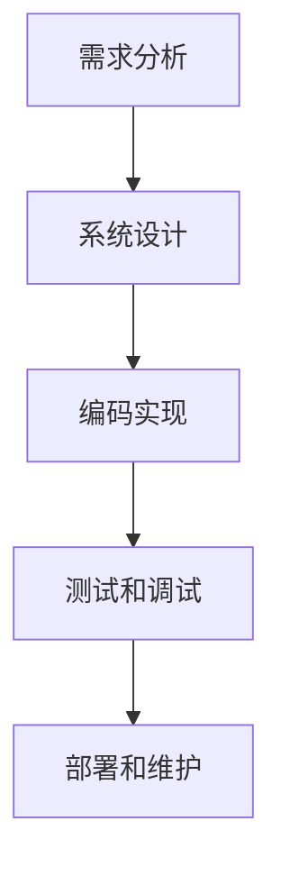

                 

# 《笛卡尔的方法论与软件工程最佳实践》

## 关键词

- 笛卡尔方法论
- 软件工程
- 最佳实践
- 设计模式
- 团队协作
- 代码管理

## 摘要

本文旨在探讨笛卡尔方法论在软件工程中的应用，阐述其如何帮助我们解决软件开发中的关键问题。通过详细分析笛卡尔方法论的核心原则，我们将其与软件工程的实际需求相结合，提出了一系列最佳实践。本文将逐步介绍这些实践，并提供实际案例，以帮助读者深入理解并应用于实际工作中。

## 第一部分：笛卡尔方法论概述

### 1.1 笛卡尔方法论的历史背景与哲学意义

笛卡尔（René Descartes）是17世纪法国的哲学家、数学家和科学家，他的方法论被称为“笛卡尔方法论”。这一方法论的核心思想是怀疑一切，直至找到无可置疑的真理。笛卡尔通过怀疑和推理，确立了“我思故我在”的哲学基石，这为现代科学和理性思考奠定了基础。

### 1.2 笛卡尔方法论的核心原则

笛卡尔方法论的核心原则包括：

1. 明确性原则：要求思维清晰、表达准确。
2. 理性原则：强调通过逻辑推理来解决问题。
3. 分步原则：将复杂问题分解为简单部分，逐步解决。
4. 实证原则：强调通过实验和观察来验证理论。

### 1.3 笛卡尔方法论在现代软件工程中的应用

随着计算机科学的发展，笛卡尔方法论在软件工程中得到了广泛应用。它帮助软件开发者通过逻辑推理和系统化的方法来解决复杂的问题，提高了软件开发的效率和质量。

## 第二部分：软件工程基础知识

### 2.1 软件工程的基本概念

软件工程是关于设计、开发、维护和测试软件的一门学科。它涉及多个领域，包括计算机科学、工程学、数学和项目管理。

### 2.2 软件开发的生命周期

软件开发的生命周期包括以下阶段：

1. 需求分析：明确软件的需求和功能。
2. 设计：制定软件的架构和接口。
3. 编码：实现软件的功能。
4. 测试：验证软件的正确性和性能。
5. 部署：将软件部署到生产环境。
6. 维护：持续优化和更新软件。

### 2.3 软件工程的核心挑战与应对策略

软件工程面临的核心挑战包括：

1. 需求变更：应对客户需求的变化。
2. 项目管理：确保项目按期完成。
3. 质量控制：保证软件的正确性和可靠性。
4. 团队协作：促进团队成员之间的有效沟通。

应对策略包括：

1. 使用敏捷开发方法，灵活应对需求变更。
2. 采用项目管理工具，提高项目管理效率。
3. 实施严格的测试和质量保证流程。
4. 建立良好的团队协作机制。

## 第三部分：笛卡尔方法论在软件工程中的应用

### 3.1 笛卡尔方法论与需求分析

在需求分析阶段，笛卡尔方法论可以帮助我们明确软件的需求，并确保需求的清晰性和准确性。以下是一种可能的步骤：

1. 明确问题：识别客户的需求和问题。
2. 提出假设：基于问题提出可能的解决方案。
3. 验证假设：通过访谈、调查和实验来验证假设。
4. 确定需求：基于验证结果确定最终的需求。

### 3.2 笛卡尔方法论与系统设计

在系统设计阶段，笛卡尔方法论可以帮助我们理清系统的结构，确保设计的合理性和可维护性。以下是一种可能的步骤：

1. 确定系统目标：明确系统的功能和性能要求。
2. 设计架构：根据系统目标设计系统的架构。
3. 确定组件：将系统划分为多个组件，并确定它们的职责。
4. 验证设计：通过建模和模拟来验证设计的正确性。

### 3.3 笛卡尔方法论与测试和调试

在测试和调试阶段，笛卡尔方法论可以帮助我们系统地发现和解决问题。以下是一种可能的步骤：

1. 确定测试目标：明确测试的目标和范围。
2. 设计测试用例：根据测试目标设计测试用例。
3. 执行测试：按照测试用例执行测试。
4. 调试和修复：分析测试结果，发现并修复问题。

## 第四部分：最佳实践

### 4.1 设计模式与软件复用

设计模式是软件工程中的一种重要概念，它描述了在特定情况下解决常见问题的通用解决方案。通过使用设计模式，我们可以提高代码的可读性、可维护性和复用性。

### 4.2 版本控制和代码管理

版本控制和代码管理是软件开发中不可或缺的部分。它们帮助团队成员协作，确保代码的一致性和完整性。常用的版本控制系统包括Git和Subversion。

### 4.3 团队协作与沟通

团队协作和沟通是软件工程成功的关键。通过建立良好的沟通机制，团队成员可以更好地理解需求、共享知识和解决问题。

## 第五部分：案例分析

### 5.1 成功案例研究

通过分析成功案例，我们可以了解如何在实际项目中应用笛卡尔方法论和最佳实践。以下是一个简化的案例研究：

1. 项目背景：一家初创公司开发一款社交媒体应用。
2. 笛卡尔方法论应用：通过需求分析、系统设计和测试和调试等阶段，应用笛卡尔方法论来解决项目中的问题。
3. 最佳实践应用：使用设计模式、版本控制和团队协作等最佳实践来提高项目的质量和效率。
4. 结果：项目按期完成，获得了用户的好评。

### 5.2 失败案例剖析

通过分析失败案例，我们可以了解如何避免在软件开发中犯错误。以下是一个简化的案例研究：

1. 项目背景：一家大型企业开发一款企业资源规划（ERP）系统。
2. 笛卡尔方法论应用不足：在需求分析、系统设计和测试和调试等阶段，没有充分应用笛卡尔方法论。
3. 最佳实践应用不足：没有遵循设计模式、版本控制和团队协作等最佳实践。
4. 结果：项目延期、超预算，并引发了团队冲突。

### 5.3 教训与启示

通过以上案例，我们可以得出以下教训和启示：

1. 应用笛卡尔方法论和最佳实践是成功的关键。
2. 团队协作和沟通是项目成功的关键因素。
3. 要始终关注项目的目标和用户需求。

## 第六部分：未来展望

### 6.1 软件工程的发展趋势

随着技术的发展，软件工程也在不断进步。未来的软件工程将更加注重自动化、智能化和协作化。

### 6.2 笛卡尔方法论在未来的潜力

笛卡尔方法论在未来的软件工程中将继续发挥重要作用。它将帮助软件开发者更好地应对复杂问题，提高软件开发的质量和效率。

### 6.3 软件工程师的自我提升

软件工程师应不断学习和实践，掌握先进的软件开发方法和最佳实践。通过不断提升自己的技能，他们可以更好地适应未来的发展。

## 附录

### A.1 笛卡尔方法论与软件工程的Mermaid流程图

以下是一个简化的Mermaid流程图，展示了笛卡尔方法论在软件工程中的应用：

### A.2 主要术语解释

- **需求分析**：确定软件的功能和性能要求。
- **系统设计**：制定软件的架构和接口。
- **编码实现**：实现软件的功能。
- **测试和调试**：验证软件的正确性和性能。
- **部署和维护**：将软件部署到生产环境并进行维护。

### A.3 参考文献与推荐阅读

- **参考文献**：
  - 《软件工程：实践者的研究方法》（Roger S. Pressman）
  - 《设计模式：可复用面向对象软件的基础》（Ernest J. Helm）
- **推荐阅读**：
  - 《禅与计算机程序设计艺术》（Brian W. Kernighan & Dennis M. Ritchie）
  - 《代码大全》（Steve McConnell）

作者：AI天才研究院/AI Genius Institute & 禅与计算机程序设计艺术 /Zen And The Art of Computer Programming

以上是对《笛卡尔的方法论与软件工程最佳实践》这篇文章的初步构思和目录大纲。在后续的写作过程中，我们将根据每个章节的具体内容，进一步细化每个部分，确保文章的逻辑清晰、内容丰富、易于理解。同时，我们还将结合实际案例，阐述如何将笛卡尔方法论应用于软件工程实践，为读者提供有价值的参考和启示。让我们一步一步地思考，共同探索软件工程的奥秘。

