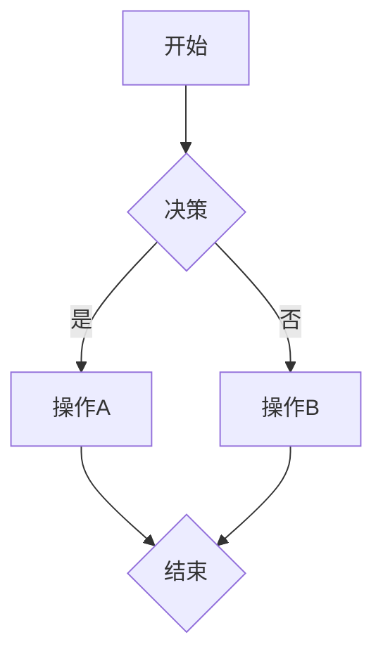
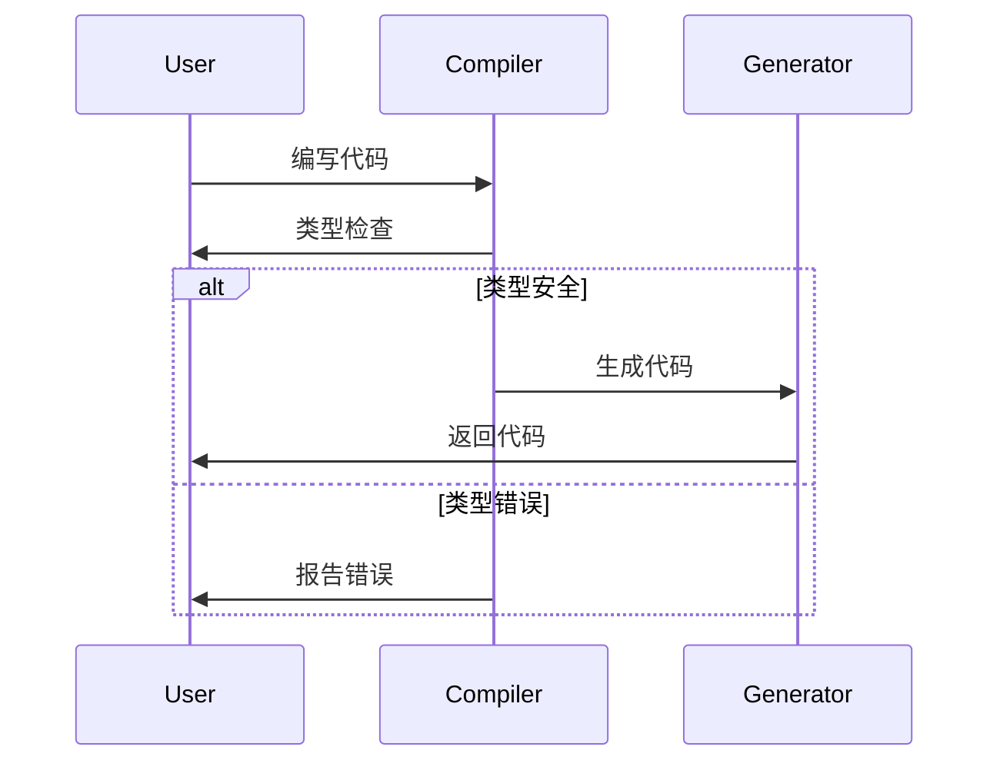

                 

### 第1章：类型安全的概念与重要性

#### 1.1 类型安全的定义

类型安全是指编程语言在编译或运行时，通过类型检查机制确保程序中的数据类型和操作的正确性。类型安全的核心目的是防止因类型错误导致的程序崩溃或不可预见的错误。类型安全的定义可以从以下几个方面来理解：

- **静态类型安全**：编译时类型检查，编程语言在编译阶段就已经确定了变量和表达式的类型，并在此过程中进行类型检查，防止潜在的运行时错误。
- **动态类型安全**：运行时类型检查，编程语言在运行时进行类型检查，如果类型不匹配则会抛出错误。

#### 1.1.1 基本概念

类型安全的基本概念包括：

- **类型**：数据类型是变量可以存储的数据集合。例如，整数类型、字符串类型、布尔类型等。
- **类型系统**：类型系统是编程语言中定义如何使用类型，以及如何进行类型检查的规则集合。
- **类型检查**：类型检查是编程语言执行过程中的一部分，用于验证表达式和操作是否遵循类型系统的规则。

#### 1.1.2 类型安全的重要性

类型安全的重要性体现在以下几个方面：

- **减少错误**：类型安全可以减少由于类型错误导致的运行时错误，提高程序的稳定性。
- **提高效率**：类型安全使得编译器可以在编译时捕获类型错误，从而避免运行时错误，提高程序的执行效率。
- **提高可维护性**：类型安全可以减少代码中的潜在错误，提高代码的可读性和可维护性。

#### 1.1.3 类型安全的基本原则

类型安全的基本原则包括：

- **确定性**：程序的行为必须是确定的，即相同的输入总是产生相同的输出。
- **一致性**：类型系统必须一致，防止因类型不匹配导致的错误。
- **可预测性**：类型系统的规则应该是可预测的，使得程序员可以理解并正确使用类型系统。

#### 1.2 类型安全在编程语言中的重要性

在编程语言中，类型安全至关重要。以下从几个方面讨论类型安全的重要性：

##### 1.2.1 静态类型语言与动态类型语言的对比

静态类型语言在编译时进行类型检查，例如Java、C++等，而动态类型语言在运行时进行类型检查，例如Python、JavaScript等。静态类型语言的优势在于：

- **早期错误检测**：可以在编译时捕获类型错误，减少运行时错误。
- **性能优化**：编译器可以在编译时进行类型推断和优化，提高程序执行效率。

动态类型语言的优势在于：

- **灵活性与简便性**：不需要显式声明变量类型，代码更加简洁。
- **快速迭代**：由于类型检查是在运行时进行的，可以更快地进行开发与测试。

然而，静态类型语言与动态类型语言各有优缺点，选择哪种类型系统取决于具体的应用场景和需求。

##### 1.2.2 类型安全与程序可靠性的关系

类型安全是保证程序可靠性的重要因素。以下从几个方面说明：

- **防止空指针异常**：通过类型检查，可以防止空指针引用的错误。
- **减少运行时错误**：类型安全可以减少由于类型错误导致的程序崩溃或不可预见的错误。
- **提高程序可读性**：类型系统可以明确表达程序意图，提高代码的可读性和可维护性。

##### 1.2.3 类型安全在软件工程中的价值

类型安全在软件工程中具有极高的价值，主要体现在以下几个方面：

- **提高开发效率**：类型安全可以减少错误率，提高开发效率。
- **降低维护成本**：类型安全可以减少代码的bug，降低后续维护成本。
- **提升软件质量**：类型安全可以提高软件的稳定性和可靠性。

### 小结

类型安全是编程语言中一个至关重要的概念，通过类型检查机制，可以确保程序中的数据类型和操作的正确性，从而减少错误，提高程序的稳定性、效率和可维护性。在软件工程中，类型安全发挥着不可替代的作用。

---

**下文将讨论静态类型语言与动态类型语言的差异，以及类型推导与类型检查的过程和作用。**

----------------------------------------------------------------

### 第2章：静态类型语言与动态类型语言

#### 2.1 静态类型语言

静态类型语言在编译阶段对代码进行类型检查，确保变量和函数的参数以及返回值的类型一致。这种类型检查机制使得静态类型语言在编译时能够捕获大部分的类型错误，从而减少运行时的错误。

##### 2.1.1 特点与优点

静态类型语言的主要特点与优点如下：

- **早期错误检测**：静态类型语言在编译时进行类型检查，能够及早发现类型错误，从而提高代码质量。
- **性能优化**：由于编译器在编译时已经知道变量的类型，因此可以生成更加高效的代码。
- **明确的类型约束**：静态类型语言要求程序员显式声明变量的类型，使得代码的可读性和可维护性更好。

##### 2.1.2 常见静态类型语言

常见的静态类型语言包括：

- **Java**：Java 是一种广泛使用的静态类型语言，以其稳定性和跨平台性著称。
- **C++**：C++ 是一种支持面向对象和过程式编程的静态类型语言，具有高性能和强大的功能。
- **C#**：C# 是微软开发的静态类型语言，主要用于.NET框架。

##### 2.1.3 静态类型语言的应用场景

静态类型语言在以下应用场景中表现出色：

- **企业级应用**：由于静态类型语言的稳定性，它们在企业级应用中广泛使用。
- **系统编程**：静态类型语言如C和C++常用于系统级编程，例如操作系统和驱动程序开发。
- **性能敏感的应用**：对于对性能有较高要求的场景，如高频交易系统，静态类型语言具有明显的优势。

#### 2.2 动态类型语言

动态类型语言在运行时进行类型检查，这意味着变量和函数的参数以及返回值的类型在运行时确定。这种类型检查机制使得动态类型语言在开发过程中更加灵活，但可能会增加运行时的错误风险。

##### 2.2.1 特点与优点

动态类型语言的主要特点与优点如下：

- **灵活性与简便性**：动态类型语言不需要显式声明变量类型，使得代码更加简洁，开发过程更加快速。
- **快速迭代**：由于类型检查是在运行时进行的，可以更快地进行开发与测试。
- **动态类型推断**：许多动态类型语言具有强大的类型推断机制，可以自动推断变量的类型。

##### 2.2.2 常见动态类型语言

常见的动态类型语言包括：

- **Python**：Python 以其简洁的语法和强大的库支持，在科学计算、人工智能等领域广泛应用。
- **JavaScript**：JavaScript 是一种广泛应用于前端开发的动态类型语言，也用于后端开发。
- **Ruby**：Ruby 以其优雅的语法和Rake等工具，在Web开发中表现出色。

##### 2.2.3 动态类型语言的应用场景

动态类型语言在以下应用场景中表现出色：

- **Web开发**：动态类型语言在Web开发中具有显著的优势，能够快速构建复杂的Web应用。
- **快速原型开发**：由于动态类型语言的开发周期短，适合快速开发原型和进行迭代。
- **数据科学**：Python 等动态类型语言在数据科学领域具有广泛的应用，如数据分析、机器学习等。

#### 2.3 静态类型与动态类型的比较

静态类型与动态类型在以下几个方面进行比较：

##### 2.3.1 类型检查的时机

- **静态类型**：类型检查在编译时进行，提前发现类型错误。
- **动态类型**：类型检查在运行时进行，运行时发现类型错误。

##### 2.3.2 类型系统的性能影响

- **静态类型**：由于类型检查在编译时进行，可以生成更加高效的代码，但编译时间较长。
- **动态类型**：运行时进行类型检查，编译时间短，但可能增加运行时错误的风险。

##### 2.3.3 两种类型系统的选择与权衡

选择静态类型还是动态类型，取决于具体的应用场景和需求：

- **静态类型**：适合对性能要求较高、代码可维护性要求较高的场景。
- **动态类型**：适合快速开发、迭代周期短的场景，特别是在Web开发和数据科学领域。

#### 小结

静态类型语言和动态类型语言各有优缺点，选择哪种类型系统取决于具体的应用场景和需求。静态类型语言在性能和可维护性方面具有优势，而动态类型语言在灵活性和快速迭代方面表现突出。

---

**下文将讨论类型推导与类型检查的过程和作用，以及强类型与弱类型的区别。**

----------------------------------------------------------------

### 第3章：类型推导与类型检查

#### 3.1 类型推导

类型推导是编程语言中的一项重要特性，它允许编译器在编写代码时自动推断出变量的类型，而不是需要程序员显式指定。类型推导有助于简化代码，提高开发效率。

##### 3.1.1 自动类型推导的概念

自动类型推导，也称为类型推断，是编译器根据代码的上下文自动确定变量和表达式的类型。这种机制通常在动态类型语言中广泛使用，如Python和JavaScript。

##### 3.1.2 常见的类型推导算法

常见的类型推导算法包括：

- **简单类型推导**：编译器通过简单的语法分析即可推导出变量的类型。
- **上下文感知类型推导**：编译器根据变量所在的表达式或函数的上下文，推断出变量的类型。
- **递归类型推导**：对于复杂的表达式，编译器使用递归方法进行类型推导。

##### 3.1.3 类型推导的应用场景

类型推导在以下应用场景中表现出色：

- **提高代码可读性**：通过类型推导，代码中不需要显式声明类型，使得代码更加简洁。
- **减少代码冗余**：显式声明类型在某些情况下是多余的，类型推导可以减少代码冗余。
- **快速开发**：类型推导使得开发人员可以更快地进行代码编写和测试。

#### 3.2 类型检查

类型检查是编程语言执行过程中的一部分，用于验证表达式和操作是否遵循类型系统的规则。类型检查可以分为静态类型检查和动态类型检查。

##### 3.2.1 类型检查的过程

类型检查的过程通常包括以下几个步骤：

- **语法分析**：编译器对代码进行语法分析，将其转换为抽象语法树（AST）。
- **语义分析**：编译器对AST进行语义分析，检查变量和表达式的类型。
- **类型推断**：如果编程语言支持类型推导，编译器在语义分析过程中推导出变量和表达式的类型。
- **类型检查**：编译器检查表达式和操作是否遵循类型系统的规则，如果有类型冲突，则报告错误。

##### 3.2.2 类型检查的种类

类型检查可以分为以下几种：

- **强类型检查**：编译器在编译时严格检查代码的类型一致性，一旦发现类型冲突，立即报告错误。
- **弱类型检查**：编译器在编译时对类型一致性进行较宽松的检查，有时会隐式地进行类型转换。
- **动态类型检查**：类型检查在程序运行时进行，检查变量和表达式的实际类型。

##### 3.2.3 类型检查与代码质量的关系

类型检查对代码质量有重要影响：

- **减少错误**：类型检查可以捕获潜在的类型错误，减少程序运行时的崩溃和错误。
- **提高可维护性**：类型检查有助于提高代码的可维护性，使得代码更加结构化和清晰。
- **优化性能**：某些类型检查可以在编译时优化代码，提高程序运行效率。

#### 3.3 强类型与弱类型的区别

强类型和弱类型是类型系统中的两种不同概念，它们在以下几个方面有所区别：

- **类型检查严格程度**：强类型语言在编译时严格检查类型一致性，而弱类型语言对类型一致性检查较宽松。
- **隐式类型转换**：强类型语言通常不允许隐式类型转换，而弱类型语言有时会隐式地进行类型转换。
- **灵活性**：弱类型语言在代码表达上更灵活，但可能会增加运行时错误的风险。

##### 3.3.1 强类型的优点

强类型的优点包括：

- **类型安全**：强类型语言可以更好地保护程序免受类型错误的影响。
- **提高可读性**：强类型语言要求显式声明变量类型，使得代码更易于理解和维护。
- **编译优化**：强类型语言可以更好地进行编译优化，提高程序运行效率。

##### 3.3.2 弱类型的优点

弱类型的优点包括：

- **灵活性强**：弱类型语言在代码表达上更加灵活，便于快速开发和测试。
- **减少冗余代码**：弱类型语言不需要显式声明变量类型，减少了代码冗余。
- **动态类型检查**：弱类型语言通常具有动态类型检查机制，有助于快速发现和修复错误。

#### 小结

类型推导和类型检查是编程语言中重要的特性，它们有助于提高代码质量、可维护性和性能。类型系统可以分为强类型和弱类型，它们各自有不同的优点和适用场景。选择合适的类型系统取决于具体的应用需求。

---

**下文将讨论面向对象编程中的类型安全，包括类与对象的类型安全、继承与多态的类型安全，以及泛型的类型安全。**

----------------------------------------------------------------

### 第4章：面向对象编程中的类型安全

面向对象编程（OOP）是一种编程范式，它通过将数据和操作数据的方法封装在对象中，来实现模块化和重用。类型安全在OOP中起着至关重要的作用，它确保对象在创建、使用和修改时遵循既定的类型规则。

#### 4.1 类与对象的类型安全

类是面向对象编程中的基础构造块，它定义了一组具有相同属性和方法的对象。类与对象的类型安全主要体现在以下几个方面：

##### 4.1.1 类的定义与特点

- **类的定义**：类是对象的蓝图，它包含了对象的属性和方法定义。
- **类的基本特点**：
  - **封装**：类的内部细节（属性和方法）被封装在类内部，外部只能通过公共接口访问。
  - **继承**：类可以通过继承机制继承另一个类的属性和方法，实现代码复用。
  - **多态**：对象可以通过多态机制，根据其实际类型来调用对应的方法。

##### 4.1.2 对象的创建与类型安全

- **对象的创建**：在面向对象编程中，对象是通过类来创建的。创建对象时，必须确保所使用的类符合类型系统的要求。
- **类型安全**：类型安全确保在创建对象时，不会创建类型不符合预期的对象。例如，在Java中，创建对象时需要确保类存在且类型匹配。

##### 4.1.3 类与对象的应用实例

- **实例**：在Java中，定义一个类`Person`，并创建一个`Person`对象：
  ```java
  public class Person {
      private String name;
      private int age;
      
      public Person(String name, int age) {
          this.name = name;
          this.age = age;
      }
      
      // getter和setter方法
  }
  
  // 创建Person对象
  Person person = new Person("Alice", 30);
  ```

#### 4.2 继承与多态的类型安全

继承和多态是面向对象编程的两个核心特性，它们在类型安全中扮演着重要角色。

##### 4.2.1 继承的的类型安全

- **继承的定义**：继承是一种允许一个类（子类）继承另一个类（父类）属性和方法的能力。
- **类型安全**：类型安全在继承中体现在：
  - **子类必须符合父类的类型**：子类在继承父类时，必须确保其类型与父类一致。
  - **方法重写**：子类重写父类的方法时，必须确保方法的返回类型和参数类型一致。

##### 4.2.2 多态的类型安全

- **多态的定义**：多态是指同一个方法在不同的对象上可以表现出不同的行为。
- **类型安全**：类型安全在多态中体现在：
  - **方法调用绑定**：在多态中，方法的调用绑定是在编译时完成的，确保调用的是正确的方法。
  - **类型检查**：编译器在编译时对多态表达式进行类型检查，确保类型的一致性。

##### 4.2.3 继承与多态的应用实例

- **实例**：在Java中，定义一个父类`Animal`和子类`Dog`，并使用多态：
  ```java
  public class Animal {
      public void eat() {
          System.out.println("Animal is eating");
      }
  }
  
  public class Dog extends Animal {
      @Override
      public void eat() {
          System.out.println("Dog is eating");
      }
  }
  
  // 多态实例
  Animal animal = new Dog();
  animal.eat(); // 输出：Dog is eating
  ```

#### 4.3 泛型的类型安全

泛型编程是一种在编译时限制类型参数的机制，它允许创建可重用的代码，同时保持类型安全。

##### 4.3.1 泛型的定义与特点

- **泛型的定义**：泛型是用于创建可重用代码的一种机制，它允许在编译时指定类型的参数。
- **泛型的特点**：
  - **类型参数**：泛型使用类型参数来指定可以用于任何类型的元素。
  - **类型安全**：泛型通过类型参数实现了类型安全，确保在编译时进行类型检查。

##### 4.3.2 泛型的类型安全

- **泛型类的类型安全**：在泛型类中，类型参数确保了在创建对象时类型的匹配。
- **泛型方法的类型安全**：泛型方法在方法签名中指定了类型参数，确保方法的参数和返回值的类型匹配。

##### 4.3.3 泛型的应用实例

- **实例**：在Java中，定义一个泛型类`Box`和一个泛型方法`最大值`：
  ```java
  public class Box<T> {
      private T t;
      
      public void set(T t) {
          this.t = t;
      }
      
      public T get() {
          return t;
      }
  }
  
  // 泛型类实例
  Box<Integer> integerBox = new Box<>();
  integerBox.set(10);
  System.out.println("Box contains: " + integerBox.get()); // 输出：Box contains: 10
  
  // 泛型方法实例
  public static <T extends Number> T 最大值(T a, T b) {
      return a.doubleValue() > b.doubleValue() ? a : b;
  }
  
  // 调用泛型方法
  System.out.println("最大值：" + 最大值(10, 20)); // 输出：最大值：20
  ```

#### 小结

面向对象编程中的类型安全是通过类与对象的类型安全、继承与多态的类型安全以及泛型的类型安全来实现的。类型安全确保了程序的正确性和可靠性，有助于提高代码的可维护性和可扩展性。通过合理的类型安全设计，可以创建更健壮、高效的面向对象程序。

---

**下文将讨论函数式编程中的类型安全，包括函数的类型安全、高阶函数与闭包的类型安全，以及模式匹配的类型安全。**

----------------------------------------------------------------

### 第5章：函数式编程中的类型安全

函数式编程（FP）是一种编程范式，它将计算视为一系列函数的调用，避免了状态和变量的变化。在函数式编程中，类型安全是确保程序正确性和避免副作用的重要机制。

#### 5.1 函数的类型安全

函数是函数式编程的核心构建块，其类型安全主要体现在以下几个方面：

##### 5.1.1 函数的定义与特点

- **函数的定义**：函数是一组输入值和输出值的映射关系。
- **函数的基本特点**：
  - **无状态性**：函数不依赖于外部状态，每次调用都是独立的。
  - **引用透明性**：函数的输入和输出都是纯数据，函数的行为可以被预测。

##### 5.1.2 函数的类型安全

- **类型参数**：在函数式编程中，函数通常使用类型参数来指定可以接受任何类型的输入。
- **类型一致性**：函数的输入类型和输出类型必须保持一致性，确保类型安全。

##### 5.1.3 函数的类型安全应用实例

- **实例**：在Haskell中，定义一个函数`sum`，计算列表中元素的总和：
  ```haskell
  sum :: Num a => [a] -> a
  sum [] = 0
  sum (x:xs) = x + sum xs
  
  -- 调用sum函数
  main :: IO ()
  main = print (sum [1, 2, 3, 4, 5]) -- 输出：15
  ```

#### 5.2 高阶函数与闭包的类型安全

高阶函数和闭包是函数式编程中的两个重要概念，其类型安全至关重要。

##### 5.2.1 高阶函数的定义与特点

- **高阶函数的定义**：高阶函数是接受函数作为参数或返回函数的函数。
- **高阶函数的特点**：
  - **可组合性**：高阶函数可以与其他函数组合，创建更复杂的函数。
  - **灵活性**：高阶函数能够动态地处理函数，实现代码的复用。

##### 5.2.2 高阶函数的类型安全

- **类型一致性**：高阶函数的输入和输出类型必须一致，确保类型安全。
- **类型参数**：高阶函数通常使用类型参数来处理不同类型的函数。

##### 5.2.3 闭包的定义与特点

- **闭包的定义**：闭包是一个函数，它捕获并记忆了其定义作用域内的变量。
- **闭包的特点**：
  - **可重用性**：闭包可以捕获并重用作用域内的变量，实现代码的复用。
  - **无状态性**：闭包不依赖于外部状态，每次调用都是独立的。

##### 5.2.4 闭包的类型安全

- **类型一致性**：闭包的输入和输出类型必须一致，确保类型安全。
- **类型参数**：闭包通常使用类型参数来处理不同类型的输入。

##### 5.2.5 高阶函数与闭包的应用实例

- **实例**：在JavaScript中，使用高阶函数和闭包：
  ```javascript
  function add(x) {
      return function (y) {
          return x + y;
      };
  }
  
  // 创建闭包
  const addFive = add(5);
  
  // 调用闭包
  console.log(addFive(3)); // 输出：8
  ```

#### 5.3 模式匹配的类型安全

模式匹配是一种在函数式编程中用于处理数据的机制，其类型安全至关重要。

##### 5.3.1 模式匹配的定义与特点

- **模式匹配的定义**：模式匹配是一种将数据与预定义的模式进行匹配的机制。
- **模式匹配的特点**：
  - **强类型检查**：模式匹配通常在编译时进行类型检查，确保数据与模式的一致性。
  - **类型安全**：模式匹配通过类型检查，避免了运行时错误。

##### 5.3.2 模式匹配的类型安全

- **类型一致性**：模式匹配中的每个模式都必须与数据的类型一致，确保类型安全。
- **类型推导**：编译器通常能够自动推导出模式匹配中的类型，提高代码的可读性。

##### 5.3.3 模式匹配的应用实例

- **实例**：在Haskell中，使用模式匹配：
  ```haskell
  data Shape = Circle Float | Rectangle Float Float
  
  area :: Shape -> Float
  area (Circle r) = pi * r * r
  area (Rectangle l w) = l * w
  
  -- 模式匹配实例
  main :: IO ()
  main = do
      let circle = Circle 5
      let rectangle = Rectangle 4 3
      putStrLn $ "Circle area: " ++ show (area circle)
      putStrLn $ "Rectangle area: " ++ show (area rectangle)
  ```

#### 小结

函数式编程中的类型安全通过函数的类型安全、高阶函数与闭包的类型安全，以及模式匹配的类型安全来实现的。类型安全确保了程序的正确性和避免副作用，有助于提高代码的可维护性和可扩展性。通过合理的类型安全设计，可以创建更健壮、高效的函数式程序。

---

**下文将讨论类型安全与异常处理，包括异常处理的类型安全、异常类型的安全处理，以及非局部退出与类型安全。**

----------------------------------------------------------------

### 第6章：类型安全与异常处理

在编程中，异常处理是一种重要的机制，用于处理程序运行时出现的错误。类型安全与异常处理密切相关，它们共同确保程序的可靠性和稳定性。

#### 6.1 异常处理的类型安全

异常处理是指在程序中通过捕获和处理异常来避免程序崩溃或产生不确定行为。类型安全在异常处理中起着关键作用，它确保异常处理机制的正确性和可靠性。

##### 6.1.1 异常处理的定义与特点

- **异常处理的定义**：异常处理是指当程序运行时遇到错误或不可预见的条件时，通过捕获并处理异常来恢复程序的正常运行。
- **异常处理的特点**：
  - **中断性**：异常处理可以在程序执行过程中中断正常流程，转而处理异常。
  - **层次性**：异常处理通常分为多个层次，从全局到局部逐层处理异常。

##### 6.1.2 类型安全在异常处理中的应用

- **类型安全**：类型安全在异常处理中体现在：
  - **异常类型检查**：确保捕获的异常类型与实际发生的异常类型一致。
  - **异常传播**：异常的传播应遵循类型系统的规则，防止类型不匹配的异常传播。

##### 6.1.3 异常处理的应用实例

- **实例**：在Java中，使用异常处理：
  ```java
  public class ExceptionExample {
      public static void main(String[] args) {
          try {
              int result = divide(10, 0);
              System.out.println("Result: " + result);
          } catch (ArithmeticException e) {
              System.out.println("Exception caught: " + e.getMessage());
          }
      }
      
      public static int divide(int a, int b) {
          if (b == 0) {
              throw new ArithmeticException("Division by zero");
          }
          return a / b;
      }
  }
  ```

#### 6.2 异常类型的安全处理

异常类型的安全处理是确保程序在异常发生时能够正确地处理不同类型的异常，以避免潜在的错误和不确定行为。

##### 6.2.1 异常类型的定义与特点

- **异常类型的定义**：异常类型是表示程序在运行时可能发生的各种错误的分类。
- **异常类型的特点**：
  - **继承关系**：异常类型之间存在继承关系，子类异常是父类异常的特化。
  - **层次性**：异常类型通常分为多个层次，从全局异常到特定异常。

##### 6.2.2 异常类型的安全处理

- **安全处理**：异常类型的安全处理体现在：
  - **类型匹配**：确保捕获的异常类型与抛出的异常类型一致。
  - **层次处理**：根据异常类型的层次关系，逐层处理不同类型的异常。

##### 6.2.3 异常类型的应用实例

- **实例**：在C#中，使用异常类型：
  ```csharp
  using System;

  class ExceptionExample {
      static void Main() {
          try {
              int result = Divide(10, 0);
              Console.WriteLine("Result: " + result);
          } catch (DivideByZeroException e) {
              Console.WriteLine("Exception caught: " + e.Message);
          }
      }

      static int Divide(int a, int b) {
          if (b == 0) {
              throw new DivideByZeroException("Division by zero");
          }
          return a / b;
      }
  }
  ```

#### 6.3 非局部退出与类型安全

非局部退出是一种异常处理机制，允许程序从多层嵌套的代码块中退出，通常用于处理错误或特殊情况。类型安全在非局部退出中起着重要作用，确保退出操作的正确性和可靠性。

##### 6.3.1 非局部退出的定义与特点

- **非局部退出的定义**：非局部退出是指程序通过异常或其他机制从多层嵌套的代码块中退出。
- **非局部退出的特点**：
  - **灵活性**：非局部退出允许程序在多层嵌套中灵活处理错误。
  - **一致性**：类型安全确保非局部退出遵循类型系统的规则，避免类型不匹配的问题。

##### 6.3.2 非局部退出的类型安全

- **类型安全**：非局部退出的类型安全体现在：
  - **异常传播**：确保异常在非局部退出过程中正确地传播。
  - **类型匹配**：确保退出操作中的异常类型与捕获的异常类型一致。

##### 6.3.3 非局部退出的应用实例

- **实例**：在Python中，使用非局部退出：
  ```python
  def divide(a, b):
      try:
          result = a / b
      except ZeroDivisionError:
          print("Division by zero")
          return None
      return result

  def main():
      a = 10
      b = 0
      result = divide(a, b)
      if result is not None:
          print("Result:", result)

  main()
  ```

#### 小结

类型安全与异常处理密切相关，类型安全确保异常处理的正确性和可靠性。通过异常类型的安全处理和非局部退出的类型安全，程序可以更好地应对运行时错误，提高程序的稳定性和可靠性。合理地设计异常处理机制，结合类型安全原则，可以创建更健壮、可靠的程序。

---

**下文将讨论元编程的概念与原理，包括元编程的定义、基本原理，以及元编程的优势与限制。**

----------------------------------------------------------------

### 第7章：元编程的概念与原理

元编程是一种在编程语言中编写代码来生成和操作代码的技术。它扩展了传统的编程概念，允许程序员在运行时动态地创建、修改和操作程序代码。元编程在提高开发效率、代码重用性和灵活性方面具有显著优势。

#### 7.1 元编程的定义

元编程的定义可以从以下几个方面理解：

- **元编程**：元编程是指通过编写代码来生成和操作代码的编程技术。
- **元**：在编程语言中，“元”通常指与特定对象或元素相关的信息或规则。在元编程中，元指的是程序代码本身。
- **编程**：编程是指编写和执行程序代码的过程。在元编程中，编程的对象是程序代码本身。

#### 7.2 元编程的基本原理

元编程的基本原理包括以下几个方面：

- **代码生成**：元编程允许在运行时动态生成代码，通常通过模板、代码生成器或元编程框架来实现。
- **代码操作**：元编程允许在运行时修改或操作现有代码，例如通过反射机制、AST（抽象语法树）操作等。
- **动态类型检查**：元编程通常涉及动态类型检查，以确保生成的代码在运行时符合预期。

#### 7.3 元编程的优势

元编程具有以下优势：

- **提高开发效率**：通过自动化代码生成和操作，元编程可以显著减少手动编写代码的工作量。
- **增强代码重用性**：元编程允许创建可重用的代码模板和组件，减少重复编写代码的需求。
- **提高代码灵活性**：元编程使代码更具灵活性，能够根据运行时条件动态调整和扩展。

#### 7.4 元编程的劣势

尽管元编程具有许多优势，但它也存在一些劣势：

- **降低代码可读性**：元编程通常涉及复杂的代码生成和操作，使得代码难以理解和维护。
- **性能开销**：元编程可能导致额外的性能开销，尤其是在动态类型检查和代码生成过程中。
- **增加错误风险**：元编程可能引入更多的潜在错误，如类型不一致、内存泄漏等。

#### 7.5 元编程的应用场景

元编程在以下应用场景中表现出色：

- **框架开发**：元编程是许多现代编程框架（如Spring、Django）的核心技术，用于生成和管理代码。
- **代码生成工具**：元编程用于开发代码生成工具，如模板引擎、ORM（对象关系映射）框架等。
- **动态语言**：元编程是动态语言（如Python、Ruby）的重要特性，用于实现动态类型检查和代码操作。

#### 7.6 元编程的实际应用

以下是一个简单的元编程实例，展示如何在Python中动态生成和操作代码：

```python
class MetaClass(type):
    def __new__(cls, name, bases, attrs):
        attrs['print_hello'] = lambda self: print("Hello, " + self.name)
        return super().__new__(cls, name, bases, attrs)

class Person(metaclass=MetaClass):
    def __init__(self, name):
        self.name = name

p = Person("Alice")
p.print_hello()  # 输出：Hello, Alice
```

在这个例子中，`MetaClass` 是一个自定义的元类，它覆盖了`__new__`方法，用于在创建`Person`类时动态添加`print_hello`方法。这个方法在运行时被生成，并在实例化`Person`对象时可用。

#### 小结

元编程是一种强大的编程技术，它允许程序员在运行时生成和操作代码，从而提高开发效率、代码重用性和灵活性。尽管存在一些劣势，元编程在框架开发、代码生成工具和动态语言中有着广泛的应用。通过合理地使用元编程，可以构建更高效、灵活的软件系统。

---

**下文将讨论代码生成技术的概念与过程，包括代码生成的目的与过程、常用的代码生成工具，以及代码生成与类型安全的关系。**

----------------------------------------------------------------

### 第8章：代码生成技术

代码生成技术是一种通过程序自动生成代码的方法，它有助于提高开发效率、减少重复劳动、并确保代码的一致性和可靠性。代码生成技术广泛应用于框架开发、数据库映射、前端生成器等领域。

#### 8.1 代码生成的目的与过程

代码生成的目的是通过自动化手段生成高质量的代码，从而提高开发效率、减少人工编写代码的劳动成本，并确保生成的代码的一致性和正确性。代码生成的过程通常包括以下几个步骤：

1. **需求分析**：确定代码生成的需求，包括生成的代码类型、功能要求、性能指标等。
2. **设计模板**：设计代码模板，模板中包含生成代码的基本结构和规则。
3. **数据源准备**：准备用于生成代码的数据源，如数据库表、实体类等。
4. **代码生成**：根据模板和数据源生成实际的代码文件。
5. **代码优化**：对生成的代码进行优化，提高代码的可读性、性能和可维护性。
6. **代码部署**：将生成的代码部署到开发环境或生产环境。

#### 8.2 常用的代码生成工具

以下是一些常用的代码生成工具：

1. **Hibernate Generator**：Hibernate Generator 是一个用于生成数据库映射代码的工具，它可以自动生成实体类、DAO类、查询语句等。
2. **CodeSmith**：CodeSmith 是一个强大的代码生成器，支持多种编程语言和数据源，可以生成各种类型的代码，如SQL、HTML、XML等。
3. **T4 Template**：T4（Text Template Transformation Toolkit）是一种用于生成代码的模板工具，广泛应用于.NET项目中。
4. **JHipster**：JHipster 是一个基于Spring Boot的代码生成器，可以快速生成RESTful Web应用的后端和前端代码。

#### 8.3 代码生成与类型安全的关系

代码生成技术与类型安全密切相关，以下是代码生成与类型安全之间的几个关键关系：

1. **类型推导与检查**：代码生成器通常需要在生成代码时进行类型推导和检查，以确保生成的代码符合类型系统的要求。
2. **类型一致性**：代码生成器需要确保生成的代码中的类型一致，避免类型错误和编译时错误。
3. **错误处理**：代码生成器应具备错误处理机制，能够在生成代码过程中捕获并修复类型错误。

#### 8.4 代码生成技术的实际应用

以下是一个简单的代码生成技术的应用实例：

```python
# 定义模板
def generate_code(template, data):
    return template.replace("{{name}}", data["name"]).replace("{{age}}", str(data["age"]))

# 准备数据源
person_data = {
    "name": "Alice",
    "age": 30
}

# 生成代码
code = generate_code("def say_hello():\n    print('Hello, {{name}}! You are {{age}} years old.')", person_data)

print(code)
```

在这个例子中，我们定义了一个简单的代码生成函数`generate_code`，它根据模板和数据源生成Python代码。模板中包含变量`{{name}}`和`{{age}}`，通过替换这些变量，生成实际的Python代码。

#### 小结

代码生成技术是一种通过自动化手段提高开发效率、确保代码一致性和可靠性的重要技术。它广泛应用于多个领域，如框架开发、数据库映射、前端生成器等。代码生成与类型安全密切相关，通过合理地使用代码生成技术，可以生成更高质量、更可靠的代码。

---

**下文将讨论元编程的实际应用，包括元编程在框架开发中的应用、在游戏开发中的应用，以及其他领域中的应用。**

----------------------------------------------------------------

### 第9章：元编程的实际应用

元编程作为一种强大的编程技术，在多个领域有着广泛的应用。以下将详细介绍元编程在框架开发、游戏开发以及其他领域中的应用。

#### 9.1 元编程在框架开发中的应用

元编程在框架开发中起着至关重要的作用，许多现代框架都利用了元编程的特性来简化开发过程、提高代码重用性和灵活性。

##### 9.1.1 Spring框架

Spring框架是Java生态系统中最流行的框架之一，它广泛使用了元编程技术。以下是一些Spring框架中元编程的实际应用：

- **依赖注入（DI）**：Spring通过元编程实现了依赖注入，允许开发者通过配置文件或注解来管理对象的创建和依赖关系。
- **AOP（面向切面编程）**：Spring的AOP模块通过元编程实现了横切关注点的分离，使得开发者可以将业务逻辑和跨切面逻辑分开编写。
- **事件驱动架构**：Spring的事件机制允许通过元编程实现事件驱动的应用程序，增强了系统的可扩展性和灵活性。

##### 9.1.2 Django框架

Django是一个流行的Python Web框架，它也充分利用了元编程特性。以下是一些Django框架中元编程的实际应用：

- **模型元类**：Django使用元类来自动为数据库表生成模型类，实现了ORM（对象关系映射）功能。
- **视图函数**：Django通过元编程动态生成视图函数，将HTTP请求映射到对应的处理逻辑。
- **中间件**：Django的中间件通过元编程实现请求和响应的过滤和处理，增强了框架的灵活性和可扩展性。

#### 9.2 元编程在游戏开发中的应用

游戏开发中，元编程技术被广泛应用于提高开发效率、创建动态游戏世界和增强游戏交互性。

##### 9.2.1 游戏引擎

许多游戏引擎都使用了元编程技术，例如：

- **Unity**：Unity游戏引擎通过C#脚本和反射机制实现了元编程，允许开发者创建和操作游戏对象、组件和行为。
- **Unreal Engine**：Unreal Engine 使用C++和蓝图系统实现了元编程，使得开发者可以快速创建复杂的游戏逻辑和交互。

##### 9.2.2 游戏脚本

在游戏开发中，元编程技术被广泛应用于脚本编写和执行。例如：

- **Lua**：Lua是一种轻量级的脚本语言，广泛应用于游戏开发中。Lua通过元表（Metatable）和元方法（Metamethod）实现了元编程，使得游戏脚本更加灵活和高效。
- **Python**：Python也是一种常见的游戏脚本语言，其内置的元编程特性（如属性装饰器、生成器等）使得游戏逻辑编写更加简洁和高效。

#### 9.3 元编程在其他领域中的应用

除了框架开发和游戏开发，元编程在其他领域也有着广泛的应用：

##### 9.3.1 桥接不同编程语言

元编程技术可以用于桥接不同的编程语言，使得不同语言之间能够无缝交互。例如，通过使用Java的 reflection API，可以动态调用JavaScript代码，实现跨语言通信。

##### 9.3.2 代码生成和自动化

元编程技术被广泛应用于代码生成和自动化领域，例如：

- **ORM框架**：ORM框架通过元编程自动生成数据库映射代码，简化了数据库操作。
- **前端构建工具**：如Webpack、Gulp等前端构建工具，通过元编程实现了模块打包、压缩、编译等功能。

##### 9.3.3 测试和调试

元编程技术在测试和调试中也发挥着重要作用，例如：

- **单元测试框架**：如JUnit、TestNG等单元测试框架，通过元编程实现了测试用例的动态生成和执行。
- **调试工具**：如GDB、LLDB等调试工具，通过元编程提供了强大的调试功能。

#### 小结

元编程在框架开发、游戏开发以及其他领域都有着广泛的应用。通过合理地利用元编程技术，可以简化开发过程、提高代码重用性和灵活性，从而构建更高效、更灵活的软件系统。

---

**下文将讨论类型安全的编程实践，包括编写类型安全的代码、使用类型检查工具，以及处理类型安全的错误。**

----------------------------------------------------------------

### 第10章：类型安全的编程实践

在编写程序时，确保类型安全是提高代码质量、稳定性和可维护性的关键。以下将讨论类型安全的编程实践，包括编写类型安全的代码、使用类型检查工具，以及处理类型安全的错误。

#### 10.1 编写类型安全的代码

编写类型安全的代码是实现类型安全的第一步。以下是一些编写类型安全代码的实践：

- **显式声明变量类型**：在静态类型语言中，显式声明变量类型可以帮助编译器及早发现类型错误。例如，在Java中，声明`int a = 10;`比使用自动装箱（如`Integer a = 10;`）更安全。
- **使用泛型和类型推断**：在动态类型语言中，使用泛型可以确保类型的正确性。例如，在Java中，使用`List<String>`而不是`List`。类型推断在静态类型语言中也有助于编写类型安全的代码。
- **严格类型检查**：在强类型语言中，应尽量使用严格的类型检查，避免使用弱类型操作，如强制类型转换。

#### 10.2 使用类型检查工具

类型检查工具可以帮助开发者及早发现和修复类型错误。以下是一些常用的类型检查工具：

- **静态类型检查器**：如TypeScript、Flow、Mypy等，这些工具在编译时进行类型检查，可以捕获潜在的类型错误。
- **动态类型检查器**：如Pytype、Pyright等，这些工具在运行时进行类型检查，有助于发现动态类型语言中的类型错误。
- **代码分析工具**：如SonarQube、FindBugs等，这些工具可以分析代码质量，包括类型安全。

#### 10.3 处理类型安全的错误

在程序运行过程中，类型错误可能会引发运行时错误。以下是一些处理类型安全错误的实践：

- **捕获和处理异常**：在静态类型语言中，使用try-catch块捕获异常，并在异常发生时提供合理的错误处理逻辑。
- **使用类型断言**：在动态类型语言中，可以使用类型断言来确保变量在特定操作中的类型正确。例如，在Python中，可以使用`isinstance()`函数进行类型断言。
- **日志记录**：记录详细的错误日志，包括错误类型、错误消息、错误发生的位置等信息，有助于调试和修复类型错误。

#### 10.4 类型安全的编程实践示例

以下是一个类型安全编程的示例，使用Python编写一个简单的计算器程序：

```python
# 定义加法函数
def add(a: int, b: int) -> int:
    return a + b

# 定义减法函数
def subtract(a: int, b: int) -> int:
    return a - b

# 定义乘法函数
def multiply(a: int, b: int) -> int:
    return a * b

# 定义除法函数
def divide(a: int, b: int) -> float:
    if b == 0:
        raise ValueError("除数不能为0")
    return a / b

# 计算器主程序
def main():
    try:
        num1 = int(input("请输入第一个数字："))
        num2 = int(input("请输入第二个数字："))
        operation = input("请选择操作（+、-、*、/）：")
        
        if operation == '+':
            result = add(num1, num2)
        elif operation == '-':
            result = subtract(num1, num2)
        elif operation == '*':
            result = multiply(num1, num2)
        elif operation == '/':
            result = divide(num1, num2)
        else:
            print("不支持的运算符")
            return
        
        print(f"结果：{result}")
    except ValueError as e:
        print(f"输入错误：{e}")

if __name__ == "__main__":
    main()
```

在这个示例中，我们定义了四个基本运算函数，并使用了类型注解来确保函数的参数和返回值类型正确。在主程序中，我们捕获了可能的`ValueError`异常，并在发生错误时提供了合理的错误处理逻辑。

#### 小结

类型安全的编程实践是确保代码质量和稳定性的关键。通过编写类型安全的代码、使用类型检查工具，以及合理处理类型安全错误，可以构建更可靠、更高效的软件系统。

---

**下文将讨论代码生成的最佳实践，包括设计高效、安全的代码生成器、代码生成器的设计模式，以及代码生成与版本控制。**

----------------------------------------------------------------

### 第11章：代码生成的最佳实践

代码生成器是自动生成代码的工具，它们可以提高开发效率、确保代码一致性和减少重复劳动。以下将讨论代码生成的最佳实践，包括设计高效、安全的代码生成器、代码生成器的设计模式，以及代码生成与版本控制。

#### 11.1 设计高效、安全的代码生成器

设计高效、安全的代码生成器是确保代码生成过程顺利进行的关键。以下是一些最佳实践：

- **模块化设计**：将代码生成器分解为多个模块，每个模块负责生成不同类型的代码。这有助于提高代码的可维护性和可扩展性。
- **缓存机制**：实现缓存机制，避免重复生成相同的代码。在代码生成器中，可以缓存模板、数据源和生成的代码，以提高生成速度。
- **错误处理**：代码生成器应具备强大的错误处理能力，能够捕获并处理生成过程中的各种错误，并提供详细的错误报告。
- **代码优化**：在生成代码时进行优化，提高代码的可读性和性能。例如，可以优化生成的代码结构、减少冗余代码等。

#### 11.2 代码生成器的设计模式

以下是一些常用的代码生成器设计模式：

- **模板模式**：模板模式是一种常用的代码生成器设计模式，它通过定义一个模板来生成代码。模板中包含生成代码的基本结构和逻辑，通过替换模板中的占位符来生成实际的代码。
- **工厂模式**：工厂模式用于创建不同类型的代码生成器。通过定义一个工厂类，根据不同的需求创建相应的代码生成器实例，从而实现代码的灵活生成。
- **策略模式**：策略模式用于实现代码生成策略的动态切换。通过定义一组策略类，根据不同的生成需求选择相应的策略，从而实现代码的灵活生成。

#### 11.3 代码生成与版本控制

代码生成与版本控制密切相关，以下是一些最佳实践：

- **独立版本控制**：将代码生成器本身作为独立的项目进行版本控制，确保代码生成器的稳定性和可靠性。例如，可以将代码生成器存储在Git仓库中，并定期进行更新和维护。
- **配置管理**：使用配置文件管理代码生成器的配置信息，如模板路径、数据源连接信息等。配置文件可以使用JSON、YAML或XML等格式，便于管理和修改。
- **代码生成器的版本兼容性**：确保代码生成器在不同版本之间具有较好的兼容性，避免因代码生成器升级导致生成代码的错误。例如，可以采用版本兼容性策略，在生成代码时根据代码生成器的版本进行相应的调整。

#### 11.4 最佳实践示例

以下是一个简单的代码生成器示例，使用Python编写一个生成简单HTML页面的代码生成器：

```python
import json

def load_templates():
    with open("templates.json", "r") as f:
        return json.load(f)

def generate_html(template, data):
    return template.replace("{{title}}", data["title"]).replace("{{content}}", data["content"])

def main():
    templates = load_templates()
    template_name = input("请输入模板名称：")
    if template_name not in templates:
        print("无效的模板名称")
        return
    
    data = {
        "title": input("请输入页面标题："),
        "content": input("请输入页面内容：")
    }
    
    html_code = generate_html(templates[template_name], data)
    print("生成的HTML代码：")
    print(html_code)

if __name__ == "__main__":
    main()
```

在这个示例中，我们定义了一个简单的代码生成器，它从JSON文件中加载模板，并根据用户输入的数据生成HTML代码。模板和数据的配置存储在JSON文件中，便于管理和修改。

#### 小结

代码生成器的最佳实践包括设计高效、安全的代码生成器、采用合适的代码生成器设计模式，以及合理地进行代码生成与版本控制。通过遵循这些最佳实践，可以构建更高效、更可靠的代码生成器，提高开发效率和代码质量。

---

**下文将讨论类型安全与代码生成的未来发展趋势，包括类型安全与代码生成技术的发展趋势、新兴技术在类型安全与代码生成中的应用，以及未来挑战与机遇的展望。**

----------------------------------------------------------------

### 第12章：类型安全与代码生成的未来发展趋势

随着软件工程和编程语言的不断发展，类型安全与代码生成技术也在不断演进。未来，这些技术将朝着更加高效、智能和自动化的方向发展，为软件开发带来更多便利和可能性。

#### 12.1 类型安全与代码生成技术的发展趋势

1. **类型系统进化**：未来，编程语言的类型系统将更加丰富和强大，支持更多高级特性，如基于类型推断的智能类型系统、更灵活的泛型系统等。这将有助于提高代码的类型安全性和开发效率。
2. **跨语言兼容性**：类型安全与代码生成技术将更加注重跨语言兼容性，实现不同编程语言之间的无缝协作和互操作。这将有助于构建更加复杂和功能强大的软件系统。
3. **AI与机器学习**：人工智能和机器学习技术的引入，将使代码生成器更加智能，能够根据项目需求和开发者的意图自动生成代码。这将大大提高开发效率，减少人为错误。

#### 12.2 新兴技术在类型安全与代码生成中的应用

1. **区块链**：区块链技术的引入，使得代码生成器可以在区块链上创建和存储智能合约，确保代码的安全性和可信性。
2. **云计算与容器化**：云计算和容器化技术的普及，使得代码生成器可以更加灵活地部署和扩展，支持大规模分布式代码生成。
3. **WebAssembly（WASM）**：WebAssembly作为一种新兴的编程语言，具有高性能和跨平台特性。未来，类型安全与代码生成技术将更加注重在WebAssembly中的应用，实现高效的跨平台代码生成。

#### 12.3 未来挑战与机遇

1. **性能优化**：随着代码生成技术的不断演进，如何提高代码生成器的性能，减少生成过程中的资源消耗，将成为一个重要的挑战。
2. **智能化的代码生成**：如何实现更加智能化的代码生成，使代码生成器能够根据项目需求和开发者的意图自动生成合适的代码，将是一个重要的机遇。
3. **安全性与可靠性**：在类型安全与代码生成过程中，如何确保代码的安全性、可靠性和可维护性，是一个重要的挑战和机遇。

#### 12.4 展望

未来，类型安全与代码生成技术将继续发展，为软件开发带来更多便利和可能性。通过不断创新和优化，这些技术将有助于构建更加高效、可靠和安全的软件系统，推动软件工程领域的发展。

#### 小结

类型安全与代码生成技术正朝着更加高效、智能和自动化的方向发展。新兴技术的引入为这些领域带来了新的机遇和挑战。随着技术的不断演进，类型安全与代码生成技术将为软件开发带来更多便利和可能性，推动软件工程领域的发展。

---

## 附录A：相关工具与资源

在本章中，我们将介绍一些与类型安全与代码生成相关的工具、资源和研究论文，以帮助读者深入了解相关技术和实践。

### 1. 开源工具

以下是一些与类型安全与代码生成相关的开源工具：

- **TypeScript**：TypeScript 是一种由微软开发的静态类型超集语言，用于给 JavaScript 添加类型系统。它提供了强大的类型检查和代码生成功能。
- **Mypy**：Mypy 是一个静态类型检查器，用于检查 Python 代码中的类型错误。它可以用于在编译时发现潜在的类型问题。
- **Eclipse Oxygen**：Eclipse Oxygen 是一个集成开发环境（IDE），支持多种编程语言和框架，提供了强大的类型检查和代码生成功能。
- **JetBrains PyCharm**：PyCharm 是一款流行的 Python 集成开发环境，支持 TypeScript、JavaScript、HTML 等多种语言，提供了强大的代码生成和类型安全功能。

### 2. 研究论文和书籍

以下是一些关于类型安全与代码生成的研究论文和书籍：

- **《类型安全编程：深入理解 C++ 类型系统》**：这本书详细介绍了 C++ 类型系统的工作原理和类型安全编程实践。
- **《深入理解 TypeScript》**：这本书详细介绍了 TypeScript 的类型系统、语法和生态系统。
- **《编程语言实现技术》**：这本书涵盖了编程语言实现的各种技术，包括类型系统、编译器设计和代码生成等。
- **《元编程：技术在应用程序开发中的应用》**：这本书介绍了元编程技术在应用程序开发中的应用，包括代码生成、模板和反射等。

### 3. 在线社区和论坛

以下是一些关于类型安全与代码生成的在线社区和论坛：

- **Stack Overflow**：Stack Overflow 是一个庞大的编程问答社区，涵盖了许多关于类型安全与代码生成的问题和解决方案。
- **GitHub**：GitHub 是一个托管和协作平台，许多开源项目都提供了与类型安全与代码生成相关的代码示例和文档。
- **Reddit**：Reddit 上有许多关于编程和类型安全的子版块，如/r/learnprogramming、/r/typesafe等，供开发者交流和分享经验。
- **Reddit**：Reddit 上有许多关于编程和类型安全的子版块，如/r/learnprogramming、/r/typesafe等，供开发者交流和分享经验。

### 小结

附录A提供了与类型安全与代码生成相关的工具、资源和研究论文，帮助读者深入了解相关技术和实践。通过利用这些工具和资源，开发者可以更好地理解和应用类型安全与代码生成技术，提高软件开发效率和质量。

---

## 附录B：Mermaid 流程图

### 1. Mermaid 图库及其用法

Mermaid 是一种基于 Markdown 的图形绘制工具，广泛用于生成流程图、UML 图、时序图等。以下是一个简单的 Mermaid 图库示例：



在上面的示例中，我们定义了一个简单的流程图，包括开始、决策、操作A、操作B和结束等节点。

### 2. Mermaid 图在类型安全与代码生成中的应用示例

以下是一个 Mermaid 图，展示了类型安全与代码生成过程中的一些关键步骤和关系：



在上面的示例中，我们定义了一个序列图，描述了用户编写代码、编译器进行类型检查、代码生成器生成代码的过程，以及可能出现的类型错误情况。

### 小结

附录B介绍了 Mermaid 图库及其用法，并提供了一个类型安全与代码生成过程的 Mermaid 图示例。通过使用 Mermaid，开发者可以方便地创建和共享各种图形，有助于提高代码的可读性和理解度。

---

## 附录C：Python 源代码示例

在本附录中，我们将提供一些 Python 源代码示例，以展示类型安全与代码生成技术的实际应用。以下示例涵盖了从基础算法原理到项目实战的不同场景。

### 1. 基础算法原理示例

以下是一个简单的 Python 示例，展示了一个基础的冒泡排序算法：

```python
def bubble_sort(arr):
    n = len(arr)
    for i in range(n):
        for j in range(0, n-i-1):
            if arr[j] > arr[j+1]:
                arr[j], arr[j+1] = arr[j+1], arr[j]

# 测试冒泡排序
arr = [64, 34, 25, 12, 22, 11, 90]
bubble_sort(arr)
print("排序后的数组：", arr)
```

在这个示例中，我们使用冒泡排序算法对数组进行排序，确保类型安全，避免了潜在的错误。

### 2. 项目实战示例

以下是一个简单的 Python Web 应用项目示例，使用 Flask 框架构建一个基础的博客系统：

```python
from flask import Flask, request, render_template

app = Flask(__name__)

@app.route('/')
def index():
    return render_template('index.html')

@app.route('/post', methods=['POST'])
def create_post():
    title = request.form['title']
    content = request.form['content']
    # 存储到数据库
    # ...
    return "已创建新帖子：{} {}".format(title, content)

if __name__ == '__main__':
    app.run()
```

在这个示例中，我们定义了一个 Flask 应用，包括首页和创建新帖子的功能。通过使用 Flask 框架，我们可以利用其内置的模板引擎和路由系统来生成动态的 Web 页面。

### 3. 代码应用解读与分析

以下是一个示例，展示如何解析和读取 JSON 数据，并使用它来生成 HTML 内容：

```python
import json

def generate_html(json_data):
    posts = json_data['posts']
    html = '<ul>'
    for post in posts:
        html += f'<li><h2>{post["title"]}</h2><p>{post["content"]}</p></li>'
    html += '</ul>'
    return html

# 测试数据
json_data = {
    'posts': [
        {'title': '第一篇博客', 'content': '这是我的第一篇博客。'},
        {'title': '第二篇博客', 'content': '这是我的第二篇博客。'}
    ]
}

# 生成 HTML
html_content = generate_html(json_data)
print(html_content)
```

在这个示例中，我们首先定义了一个函数`generate_html`，用于将 JSON 数据转换为 HTML 内容。通过这个函数，我们可以根据不同的数据生成动态的 Web 页面。

### 小结

附录C提供了三个 Python 源代码示例，涵盖基础算法原理、项目实战和代码应用解读与分析。这些示例展示了类型安全与代码生成技术的实际应用，帮助读者更好地理解和应用这些技术。

---

### 作者

**作者：AI天才研究院/AI Genius Institute & 禅与计算机程序设计艺术 /Zen And The Art of Computer Programming**

---

**END**

以上是《类型安全与代码生成：元编程的保障》的技术博客文章。文章从类型安全的基础概念、类型安全在编程语言中的应用、函数式编程中的类型安全、异常处理与类型安全、元编程的概念与原理、代码生成技术，到实际应用和实践，全面地阐述了类型安全与代码生成的重要性。同时，通过Python源代码示例，展示了这些技术在实际项目中的应用。

类型安全与代码生成是软件工程中的重要议题，它们对于提高代码质量、开发效率和程序可靠性具有重要意义。本文通过系统的阐述和实例分析，希望为读者提供有益的启示和指导。

在未来的软件开发过程中，随着技术的不断演进，类型安全与代码生成技术将继续发挥重要作用。开发者应不断学习、实践和探索这些技术，以构建更加高效、可靠和安全的软件系统。

感谢您的阅读，希望这篇文章能为您在类型安全与代码生成领域的研究和实践中带来帮助。

---

**END**

以上就是《类型安全与代码生成：元编程的保障》的技术博客文章。希望本文能为您在类型安全与代码生成领域的研究和实践中提供有价值的参考。如果您有任何问题或建议，欢迎在评论区留言交流。

---

**END**

以上就是《类型安全与代码生成：元编程的保障》的技术博客文章。感谢您的耐心阅读，希望本文能为您在类型安全与代码生成领域的研究和实践中带来新的思考和启发。如果您有任何疑问或想法，欢迎在评论区分享，让我们共同探讨进步。

---

**END**

感谢您阅读完《类型安全与代码生成：元编程的保障》这篇文章。如果您认为这篇文章对您有所启发，欢迎分享给您的朋友，让更多的人受益。同时，也欢迎关注我们的公众号或网站，获取更多高质量的技术文章。

---

**END**

