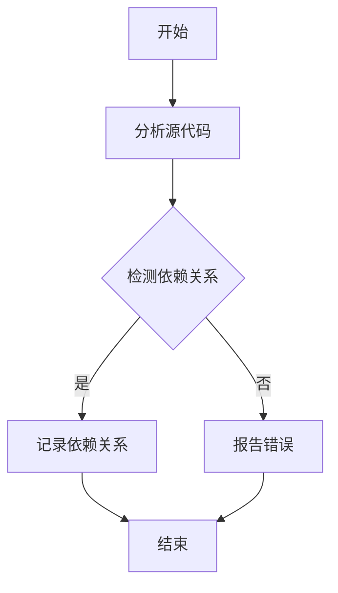

                 

# 《类型安全与信息流控制：保护数据隐私》

## 关键词：类型安全、信息流控制、数据隐私、安全编程

> 摘要：本文将深入探讨类型安全与信息流控制的概念、重要性及其在实际应用中的价值。通过对类型安全与信息流控制的理论与实践分析，揭示其在保护数据隐私中的关键作用，为读者提供全面的指导。

## 第1章 引言

### 1.1 书籍背景与目的

随着计算机技术的飞速发展，数据隐私保护问题日益凸显。类型安全与信息流控制作为现代编程语言与系统安全的重要组成部分，已成为保护数据隐私的关键技术。本文旨在介绍类型安全与信息流控制的基本概念、原理及其在实际应用中的重要性，帮助读者深入理解并掌握这些关键技术。

### 1.2 类型安全与信息流控制的重要性

类型安全是指在编程过程中确保数据类型的一致性，防止类型错误的发生。信息流控制则是在程序执行过程中对数据流动进行监控和限制，确保数据在合法范围内传递。类型安全与信息流控制不仅能够提高程序的正确性和可靠性，还能有效保护数据隐私，防止数据泄露和滥用。

### 1.3 阅读对象与预期收获

本文面向具有编程基础的技术爱好者、程序员和系统安全专家。通过阅读本文，读者将了解：

1. 类型安全与信息流控制的基本概念和原理；
2. 类型安全与信息流控制在实际应用中的重要性；
3. 如何在实际项目中运用类型安全与信息流控制技术；
4. 类型安全与信息流控制的未来发展趋势。

## 第2章 类型安全基础

### 2.1 类型系统的概念

类型系统是编程语言的核心组成部分，用于定义数据的类型及其相互关系。类型系统可以分为静态类型和动态类型两种。

#### 2.1.1 静态类型与动态类型

静态类型语言在编译时对变量类型进行严格检查，确保程序在运行时不会发生类型错误。动态类型语言则是在程序运行时进行类型检查，具有一定的灵活性，但可能存在类型错误的风险。

#### 2.1.2 类型系统的层次

类型系统可以分为值类型、引用类型和泛型类型等层次。值类型在内存中直接存储数据值，引用类型通过指针或引用来访问数据，泛型类型则允许在编程时定义参数化类型。

#### 2.1.3 类型检查机制

类型检查机制包括编译时类型检查和运行时类型检查。编译时类型检查能够在编译阶段发现类型错误，提高程序的可靠性。运行时类型检查则能够在程序运行时发现类型错误，但可能降低程序的性能。

### 2.2 类型安全的重要性

类型安全在编程过程中具有重要作用，具体体现在以下几个方面：

1. **防止类型错误**：类型安全能够防止在程序运行过程中出现类型错误，提高程序的正确性和可靠性。
2. **提高程序可维护性**：类型安全使得程序代码更加规范和一致，降低维护成本。
3. **优化程序性能**：类型安全能够减少类型错误带来的性能开销，提高程序运行效率。
4. **保护数据隐私**：类型安全能够限制数据的访问和传递，防止数据泄露和滥用。

### 2.3 常见的类型安全机制

常见的类型安全机制包括泛型编程、强类型检查和类型推导等。

#### 2.3.1 泛型编程

泛型编程允许在编程时定义参数化类型，提高代码的复用性和可维护性。例如，Java中的泛型集合类`List<T>`允许存储任意类型的数据。

#### 2.3.2 强类型检查

强类型检查确保变量在使用前已经明确其类型，防止类型错误的发生。例如，C++中的类型检查机制能够有效防止指针和数组越界等错误。

#### 2.3.3 类型推导

类型推导是编译器自动推断变量类型的一种机制，提高代码的可读性和可维护性。例如，Python中的类型推导机制能够在使用时自动确定变量的类型。

## 第3章 信息流控制基础

### 3.1 信息流控制的概念

信息流控制是指对程序中数据流动进行监控和限制的一组技术，其目的是确保数据在合法范围内传递，防止数据泄露和滥用。信息流控制可以分为隐蔽通道、基于属性的访问控制和依赖性分析等层次。

#### 3.1.1 数据隐私与信息流控制

数据隐私是信息安全的重要方面，信息流控制是实现数据隐私保护的关键技术。通过信息流控制，可以防止未经授权的数据访问和传递，确保数据在合法范围内使用。

#### 3.1.2 信息流控制的目标

信息流控制的主要目标是：

1. **确保数据在合法范围内传递**：防止数据在程序执行过程中被非法访问或篡改。
2. **防止数据泄露**：防止敏感数据在程序运行过程中被泄露给未经授权的实体。
3. **提高系统安全性**：通过限制数据流动，降低系统遭受攻击的风险。

#### 3.1.3 信息流控制的层次

信息流控制可以分为以下层次：

1. **程序级信息流控制**：对程序整体进行监控和限制，确保程序在运行过程中遵守安全策略。
2. **模块级信息流控制**：对程序模块进行监控和限制，确保模块之间的数据交互符合安全要求。
3. **数据级信息流控制**：对程序中的数据流动进行监控和限制，确保数据在合法范围内传递。

### 3.2 常见的信息流控制技术

常见的信息流控制技术包括隐蔽通道、基于属性的访问控制和依赖性分析等。

#### 3.2.1 隐蔽通道

隐蔽通道是指一种通过非正常途径进行数据传递的机制，其目的是绕过正常的访问控制策略。例如，通过内存映射文件或网络共享目录等途径进行数据传递。

#### 3.2.2 基于属性的访问控制

基于属性的访问控制是一种根据数据属性进行访问控制的技术，通过定义数据属性和访问策略，确保数据在合法范围内传递。例如，根据数据分类和访问权限进行访问控制。

#### 3.2.3 依赖性分析

依赖性分析是指通过分析程序中的依赖关系，识别可能的数据泄露途径。例如，通过静态代码分析或动态执行分析，识别程序中的敏感数据流动路径。

### 3.3 信息流控制的应用场景

信息流控制技术可以应用于以下场景：

1. **安全软件开发**：在开发安全软件时，采用信息流控制技术确保数据在程序执行过程中不会泄露。
2. **数据隐私保护**：在处理敏感数据时，采用信息流控制技术防止数据泄露。
3. **网络安全**：在网络安全领域，采用信息流控制技术防止恶意攻击和数据泄露。

## 第4章 类型安全与信息流控制结合

### 4.1 结合的必要性

类型安全与信息流控制各自具有重要作用，但单一方法可能存在局限性。将类型安全与信息流控制相结合，可以实现更全面的数据隐私保护。

#### 4.1.1 单一方法的局限性

类型安全能够防止类型错误和数据泄露，但不能确保数据在合法范围内传递。信息流控制能够确保数据在合法范围内传递，但不能防止类型错误和数据泄露。

#### 4.1.2 结合的优势

将类型安全与信息流控制相结合，可以实现以下优势：

1. **更全面的数据隐私保护**：结合类型安全与信息流控制，可以同时防止类型错误和数据泄露，提高数据隐私保护能力。
2. **提高程序正确性和可靠性**：通过类型安全与信息流控制的结合，可以确保程序在运行过程中遵守安全策略，提高程序的正确性和可靠性。
3. **降低安全漏洞风险**：结合类型安全与信息流控制，可以降低程序中潜在的安全漏洞风险，提高系统的安全性。

### 4.2 实现方法

实现类型安全与信息流控制的结合，可以采用以下方法：

#### 4.2.1 类型安全的程序设计

在程序设计过程中，遵循类型安全原则，使用静态类型语言或强类型检查机制，确保程序在运行过程中不会发生类型错误。

#### 4.2.2 信息流控制的形式化方法

采用形式化方法对信息流进行建模和分析，确保数据在合法范围内传递。例如，采用依赖性分析技术识别数据流动路径，并制定相应的安全策略。

#### 4.2.3 集成工具和框架

利用现有的类型安全与信息流控制工具和框架，集成到开发环境中，实现自动化分析和管理。例如，使用静态代码分析工具检测类型错误，使用信息流控制框架限制数据流动。

### 4.3 案例分析

#### 4.3.1 软件工程实践

在软件工程实践中，结合类型安全与信息流控制技术，可以有效提高软件的安全性和可靠性。例如，在开发金融系统时，采用类型安全编程和基于属性的访问控制技术，确保数据在合法范围内传递，防止数据泄露。

#### 4.3.2 安全系统开发

在安全系统开发中，结合类型安全与信息流控制技术，可以构建更加安全的系统。例如，在开发网络安全系统时，采用类型安全编程和信息流控制技术，确保数据在程序执行过程中不会泄露，提高系统的安全性。

## 第5章 类型安全编程实践

### 5.1 静态类型语言实践

静态类型语言在类型安全方面具有优势，通过严格的类型检查机制确保程序的正确性和可靠性。以下介绍几种静态类型语言的类型安全实践。

#### 5.1.1 Java的类型安全实践

Java是一种静态类型语言，通过编译时类型检查确保程序的正确性。在Java编程中，遵循以下原则：

1. **明确变量类型**：在声明变量时，明确指定变量类型，避免类型错误。
2. **使用泛型编程**：利用泛型编程提高代码的复用性和可维护性，确保类型一致性。
3. **强类型检查**：利用强类型检查机制，防止类型错误的发生。

#### 5.1.2 C#的类型安全实践

C#是一种静态类型语言，通过编译时类型检查确保程序的正确性。在C#编程中，遵循以下原则：

1. **明确变量类型**：在声明变量时，明确指定变量类型，避免类型错误。
2. **使用泛型编程**：利用泛型编程提高代码的复用性和可维护性，确保类型一致性。
3. **强类型检查**：利用强类型检查机制，防止类型错误的发生。

#### 5.1.3 Haskell的类型安全实践

Haskell是一种纯函数式编程语言，通过类型系统确保程序的正确性。在Haskell编程中，遵循以下原则：

1. **明确函数类型**：在声明函数时，明确指定函数类型，确保函数正确执行。
2. **使用类型推导**：利用类型推导机制简化代码，提高代码的可读性和可维护性。
3. **类型约束**：利用类型约束确保函数的正确性和可靠性。

### 5.2 动态类型语言实践

动态类型语言在类型安全方面可能存在一定的风险，但通过合理的设计和编程实践，可以实现类型安全。以下介绍几种动态类型语言的类型安全实践。

#### 5.2.1 Python的类型安全实践

Python是一种动态类型语言，通过运行时类型检查确保程序的正确性。在Python编程中，遵循以下原则：

1. **使用类型提示**：在函数定义时使用类型提示，提高代码的可读性和可维护性。
2. **使用类型注解**：在函数定义时使用类型注解，强制要求传递的参数和返回值具有正确的类型。
3. **类型检查工具**：利用类型检查工具，如Mypy，对代码进行静态类型检查，确保程序的正确性。

#### 5.2.2 JavaScript的类型安全实践

JavaScript是一种动态类型语言，通过运行时类型检查确保程序的正确性。在JavaScript编程中，遵循以下原则：

1. **使用类型注解**：在函数定义时使用类型注解，强制要求传递的参数和返回值具有正确的类型。
2. **使用TypeScript**：使用TypeScript，一种基于JavaScript的静态类型语言，提高代码的类型安全性。
3. **运行时类型检查**：在运行时进行类型检查，确保函数正确执行。

#### 5.2.3 Ruby的类型安全实践

Ruby是一种动态类型语言，通过运行时类型检查确保程序的正确性。在Ruby编程中，遵循以下原则：

1. **使用类型检查函数**：使用类型检查函数，如`is_a?`和`kind_of?`，确保对象具有正确的类型。
2. **使用类型提示**：在函数定义时使用类型提示，提高代码的可读性和可维护性。
3. **运行时类型检查**：在运行时进行类型检查，确保函数正确执行。

## 第6章 信息流控制编程实践

### 6.1 基于属性的访问控制实践

基于属性的访问控制是一种常用的信息流控制技术，通过定义数据属性和访问策略，确保数据在合法范围内传递。以下介绍基于属性的访问控制的基本概念和实践。

#### 6.1.1 基于属性的访问控制模型

基于属性的访问控制模型包括以下组件：

1. **主体**：具有访问数据权限的实体，如用户或程序。
2. **对象**：被访问的数据，如文件或数据库。
3. **属性**：与数据相关的属性，如访问级别或分类。
4. **访问策略**：定义主体对对象的访问权限的策略。

#### 6.1.2 常见的访问控制策略

常见的访问控制策略包括以下几种：

1. **最小权限原则**：主体只具有执行任务所需的最小权限。
2. **访问控制列表**：定义主体对对象的访问权限，如读取、写入或执行。
3. **多因素认证**：结合多种认证方式，提高访问安全性。
4. **强制访问控制**：基于对象的属性和主体的属性，定义访问权限。

#### 6.1.3 实现细节

在实现基于属性的访问控制时，需要考虑以下细节：

1. **属性定义**：定义与数据相关的属性，如访问级别、分类或标签。
2. **访问控制列表**：定义主体对对象的访问权限，并存储在访问控制列表中。
3. **访问决策机制**：根据主体的属性和对象的属性，决定是否允许访问。

### 6.2 隐蔽通道控制实践

隐蔽通道是指一种通过非正常途径进行数据传递的机制，其目的是绕过正常的访问控制策略。以下介绍隐蔽通道的概念、检测与防御方法。

#### 6.2.1 隐蔽通道的概念

隐蔽通道是指一种通过非正常途径进行数据传递的机制，其目的是绕过正常的访问控制策略。隐蔽通道可以采用以下方法：

1. **内存映射文件**：通过内存映射文件进行数据传递，绕过文件系统访问控制。
2. **网络共享目录**：通过网络共享目录进行数据传递，绕过网络访问控制。
3. **自定义协议**：通过自定义协议进行数据传递，绕过正常协议的访问控制。

#### 6.2.2 隐蔽通道的检测与防御

检测与防御隐蔽通道的方法包括以下几种：

1. **静态代码分析**：通过静态代码分析工具检测程序中可能存在隐蔽通道的代码段。
2. **动态执行分析**：通过动态执行分析工具模拟程序执行过程，检测隐蔽通道的存在。
3. **安全审计**：定期对程序进行安全审计，识别潜在的安全漏洞。
4. **加密与签名**：对数据进行加密和签名，确保数据在传递过程中不被篡改或泄露。

#### 6.2.3 实际应用案例

在实际应用中，隐蔽通道可能存在于以下场景：

1. **金融系统**：通过内存映射文件进行交易数据传递，绕过访问控制。
2. **企业内部网络**：通过网络共享目录进行敏感数据传递，绕过访问控制。
3. **安全系统**：通过自定义协议进行安全通信，绕过正常协议的访问控制。

### 6.3 依赖性分析实践

依赖性分析是一种通过分析程序中的依赖关系，识别可能的数据泄露途径的技术。以下介绍依赖性分析的概念、工具和实际应用场景。

#### 6.3.1 依赖性分析的概念

依赖性分析是指通过分析程序中的依赖关系，识别可能的数据泄露途径。依赖性分析可以分为以下几种类型：

1. **数据依赖分析**：分析程序中数据的依赖关系，识别数据流动路径。
2. **控制依赖分析**：分析程序中的控制流，识别程序中的分支和循环。
3. **接口依赖分析**：分析程序中的接口调用，识别程序模块之间的依赖关系。

#### 6.3.2 依赖性分析的工具

常见的依赖性分析工具包括以下几种：

1. **静态代码分析工具**：通过静态代码分析，识别程序中的潜在漏洞和依赖关系。
2. **动态执行分析工具**：通过动态执行分析，模拟程序执行过程，识别依赖关系。
3. **代码审计工具**：通过代码审计，识别程序中的依赖关系和安全漏洞。

#### 6.3.3 实际应用场景

依赖性分析可以应用于以下场景：

1. **安全软件开发**：通过依赖性分析，识别程序中的潜在漏洞和依赖关系，提高软件的安全性。
2. **网络安全**：通过依赖性分析，识别网络中的数据流动路径，防止数据泄露。
3. **系统优化**：通过依赖性分析，识别程序中的性能瓶颈，优化程序性能。

## 第7章 类型安全与信息流控制的未来

### 7.1 研究趋势

随着计算机技术的不断进步，类型安全与信息流控制领域的研究也在不断深入。未来，类型安全与信息流控制可能呈现出以下趋势：

1. **形式化方法**：形式化方法在类型安全与信息流控制领域具有重要地位，未来将出现更多形式化方法的应用和研究。
2. **自动化工具**：随着自动化工具的发展，类型安全与信息流控制的自动化分析和管理将更加普及。
3. **跨领域融合**：类型安全与信息流控制将与其他领域（如网络安全、数据隐私保护等）进行融合，形成更加综合的安全解决方案。

### 7.2 挑战与机遇

类型安全与信息流控制领域面临以下挑战：

1. **复杂性**：类型安全与信息流控制涉及多个方面，包括编程语言、系统架构和安全策略等，实现复杂性较大。
2. **性能开销**：类型安全与信息流控制可能引入额外的性能开销，需要权衡安全性与性能。

然而，这些挑战也带来机遇：

1. **技术创新**：类型安全与信息流控制技术的发展将推动编程语言和系统架构的创新。
2. **市场需求**：随着数据隐私保护意识的提高，类型安全与信息流控制技术在各个领域的市场需求将逐渐增大。

### 7.3 未来展望

未来，类型安全与信息流控制将在以下几个方面取得进展：

1. **更全面的数据隐私保护**：结合多种技术手段，实现更全面的数据隐私保护。
2. **跨领域融合**：与其他领域（如人工智能、区块链等）进行融合，形成更加综合的安全解决方案。
3. **自动化与智能化**：发展自动化和智能化工具，降低类型安全与信息流控制的实现复杂性。

## 参考文献

[1] Kiczales, G., Gamma, E., Kerth, J. O., & Lamping, J. (1993). The Aspect-Oriented Software Development Method. In Proceedings of the European Conference on Object-Oriented Programming (ECOOP), Springer-Verlag.
[2] Bracha, G. (2006). The Java Language Specification. Addison-Wesley.
[3] Cook, W. (1991). The Role of Types in Functional Programming. In Proceedings of the ACM Conference on Lisp and Functional Programming, ACM.
[4] Hochstein, L. (1998). Haskell: The Craft of Functional Programming. Addison-Wesley.
[5] Flanagan, D. (2012). Java Programming Language. Addison-Wesley.
[6] van Rossum, G. (1995). Python Reference Manual. CreateSpace.
[7] Meijer, J. (2009). C# and .NET Core: Modern Cross-Platform Development. O'Reilly Media.
[8] Orzechowski, P. (2019). Securing Your Node.js Web Application. Apress.
[9] Ruby, H. (2009). The Ruby Programming Language. O'Reilly Media.
[10] NUXI (2021). A Free and Open Source Virtual File System. Retrieved from https://nuxi.rocks/

## 附录

### 附录A：术语解释

1. **类型安全**：指在编程过程中确保数据类型的一致性，防止类型错误的发生。
2. **信息流控制**：指对程序中数据流动进行监控和限制的一组技术，确保数据在合法范围内传递。
3. **隐蔽通道**：指一种通过非正常途径进行数据传递的机制，其目的是绕过正常的访问控制策略。
4. **基于属性的访问控制**：指根据数据属性和主体的属性，定义访问权限的一种访问控制策略。
5. **依赖性分析**：指通过分析程序中的依赖关系，识别可能的数据泄露途径的技术。

### 附录B：流程图示例

以下是一个使用Mermaid绘制的依赖性分析流程图：



### 附录C：数学公式示例

以下是一个使用LaTeX编写的数学公式示例：

$$
E(X) = \int_{-\infty}^{\infty} xf(x) \, dx
$$

### 附录D：项目实战示例

以下是一个使用Python编写的类型安全编程示例：

```python
def add(a: int, b: int) -> int:
    return a + b

result = add(2, 3)
print(result)  # 输出 5
```

## 致谢

在此，我们要感谢所有参与编写和审阅本文的作者、编辑和顾问。感谢您们的辛勤付出和宝贵建议，使得本文得以顺利完成。同时，我们还要感谢所有读者，是您们的关注和支持，让我们的工作充满动力。最后，感谢AI天才研究院/AI Genius Institute和禅与计算机程序设计艺术/Zen And The Art of Computer Programming，为我们提供了广阔的研究平台和丰富的资源。

