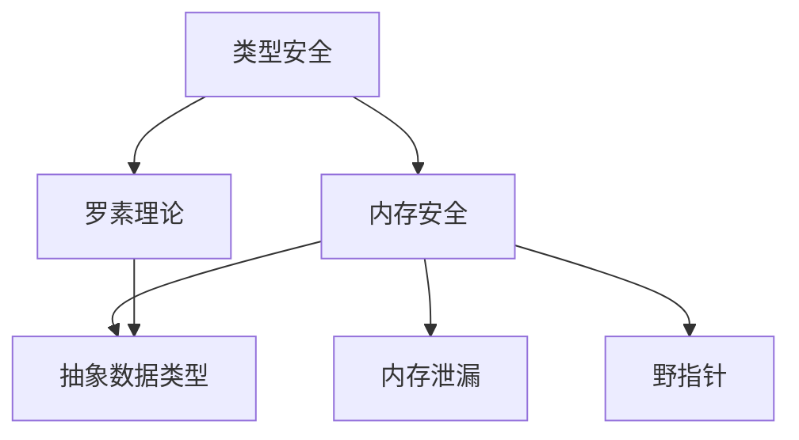

                 

## 类型安全与内存安全：罗素理论的实际意义

### 关键词
- 类型安全
- 内存安全
- 罗素理论
- 编程语言
- 内存管理
- 类型推导

### 摘要
本文将探讨类型安全和内存安全在编程语言中的重要性，并深入分析罗素理论如何对这两个核心概念产生了深远影响。通过历史的视角和现代编程语言的实际应用，我们将解释类型安全和内存安全的基本原理，并探讨罗素理论在其中的角色。文章还将结合具体编程语言和实际案例，展示类型安全和内存安全如何在实际项目中得到体现，以及如何通过罗素理论的启发来提高程序的安全性和可靠性。

## 第一部分：类型安全基础

### 第1章：类型安全的概念与重要性

#### 1.1 类型安全的定义与背景

类型安全是编程语言设计中的一个关键特性，它确保了程序在运行时不会因为类型错误而导致不可预测的行为。类型安全的基本概念可以追溯到计算机科学发展的早期阶段。在早期的编程语言，如汇编语言中，程序员需要对内存的每个字节进行精确控制，这导致了大量的内存泄漏和指针错误。随着高级编程语言的出现，类型安全逐渐成为编程语言设计的重要目标。

类型安全的基本概念包括两个方面：

1. **类型一致性**：程序中每个操作都是在其操作数的合法类型范围内进行的。
2. **类型正确性**：程序在执行过程中不会因为类型错误而产生未定义的行为。

类型安全的背景可以从以下几个方面来理解：

- **早期编程语言**：汇编语言和早期高级语言（如C语言）缺乏类型安全机制，导致程序错误频繁。
- **程序复杂性**：随着程序规模的扩大，类型错误变得难以调试和修复。
- **编程语言的进步**：现代编程语言（如Java和C#）引入了静态类型检查机制，提高了类型安全性。

#### 1.2 类型安全的重要性

类型安全在编程中具有重要意义，主要体现在以下几个方面：

- **减少错误**：类型安全通过静态类型检查可以及时发现类型错误，减少运行时错误的发生。
- **提高代码可维护性**：类型安全使得代码更易于理解和维护，因为类型信息提供了明确的语义指导。
- **提升程序性能**：某些类型安全机制（如编译期类型推导）可以提高程序的执行效率。

#### 1.3 类型安全的实现

类型安全的实现主要依赖于类型系统和类型检查机制。以下是几种常见的类型系统：

- **静态类型系统**：在编译时对类型进行严格检查，如Java和C#。
- **动态类型系统**：在运行时对类型进行检查，如Python和JavaScript。

类型检查机制包括：

- **静态类型检查**：编译器在编译期间对代码进行类型检查，如Java的编译器。
- **动态类型检查**：在程序运行时进行类型检查，如Python的解释器。

### 第2章：罗素理论概述

#### 2.1 罗素理论的起源

罗素理论，由英国哲学家和数学家贝特兰·罗素（Bertrand Russell）提出，旨在解决数学基础的悖论问题。罗素理论的核心是类型论，它将数学对象分为不同的类型，以避免自指和悖论。类型论的出现为后来的形式逻辑和计算机科学中的类型系统奠定了基础。

罗素理论的基本概念包括：

- **类型**：数学对象根据其复杂性和属性分为不同的类型。
- **类型层级**：类型之间存在层级关系，较低类型的对象不能直接操作较高类型的对象。

#### 2.2 罗素理论的主要观点

罗素理论的主要观点包括：

- **类型论**：通过区分不同类型的对象，避免自指和悖论。
- **逻辑原子主义**：将复杂概念分解为基本逻辑原子，以简化推理和证明。

#### 2.3 罗素理论的历史地位

罗素理论在哲学和数学领域具有重要地位，它的提出解决了数学基础中的许多问题，如集合论悖论。罗素理论的影响也延伸到了计算机科学，为后来的类型系统设计提供了理论依据。

### 第3章：类型系统的基础知识

#### 3.1 基本类型系统

基本类型系统包括静态类型系统和动态类型系统：

- **静态类型系统**：类型检查在编译时进行，如Java和C#。
- **动态类型系统**：类型检查在运行时进行，如Python和JavaScript。

#### 3.2 类型检查机制

类型检查机制包括：

- **静态类型检查**：编译器在编译期间对代码进行类型检查。
- **动态类型检查**：解释器在运行时对代码进行类型检查。

### 第4章：类型安全与类型推导

#### 4.1 类型推导的基本原理

类型推导是指编译器自动推导变量和表达式的类型，而不是由程序员显式声明类型。类型推导的基本原理包括：

- **上下文推断**：编译器根据程序上下文推导出变量的类型。
- **表达式推断**：编译器根据表达式的结构推导出其类型。

#### 4.2 类型安全的实现

类型安全的实现依赖于类型系统和类型检查机制。现代编程语言通常结合静态类型检查和动态类型检查，以提高程序的安全性和性能。

### 第5章：内存安全的基本原理

#### 5.1 内存管理的挑战

内存管理是编程中的一个重要挑战，主要包括：

- **内存泄漏**：程序不再需要的内存未被释放，导致内存消耗增加。
- **野指针**：指向已被释放内存的指针，可能导致程序崩溃或数据泄露。

#### 5.2 内存安全的概念

内存安全是指程序在内存管理过程中不会发生内存泄漏、野指针等错误。内存安全的优点包括：

- **提高程序稳定性**：通过防止内存错误，提高程序的稳定性。
- **优化性能**：合理的内存管理可以减少内存消耗，提高程序性能。

### 第6章：罗素理论与内存安全

#### 6.1 罗素理论与内存安全的关系

罗素理论中的类型论对内存安全有重要启示。通过区分不同类型的内存对象，可以减少内存错误的发生。罗素理论提供了一种思路，即在内存管理中引入类型约束，以避免内存错误。

#### 6.2 罗素理论的内存管理思想

罗素理论的内存管理思想包括：

- **抽象数据类型**：将内存对象抽象为数据类型，以简化内存管理。
- **内存分配与回收**：通过类型约束和抽象数据类型，实现内存的自动分配和回收。

### 第7章：实际案例与实例分析

#### 7.1 案例介绍

本文将选取两个实际编程语言案例，分别是Java和C++，来分析类型安全和内存安全在实际项目中的应用。

#### 7.2 实例分析

- **Java**：Java通过静态类型检查和垃圾回收机制实现内存安全。案例中将展示如何使用Java进行类型安全和内存安全编程。
- **C++**：C++允许程序员手动管理内存，但通过引入智能指针和RAII（Resource Acquisition Is Initialization）机制，可以提高内存安全性。案例中将展示如何使用C++进行内存安全编程。

### 第8章：类型安全与内存安全的未来发展趋势

#### 8.1 技术进步与挑战

随着编程语言的不断发展和硬件性能的提升，类型安全和内存安全面临新的挑战和机遇。未来技术的发展趋势包括：

- **多语言编程**：支持多语言互操作，如JavaScript和Python与C++的混合编程。
- **内存优化**：通过编译器和运行时优化，提高内存利用率和程序性能。

#### 8.2 应用领域的发展

类型安全和内存安全在各个应用领域的发展趋势包括：

- **大数据与云计算**：优化内存管理，提高数据处理效率。
- **嵌入式系统与物联网**：在资源受限的环境下，实现高效的内存管理。

### 附录

#### 附录A：相关术语解释

本文涉及的相关术语解释如下：

- **类型安全**：确保程序在运行时不会因为类型错误而导致不可预测的行为。
- **内存安全**：程序在内存管理过程中不会发生内存泄漏、野指针等错误。
- **罗素理论**：一种形式逻辑理论，通过类型论解决数学基础中的悖论问题。

#### 附录B：参考文献

本文引用的相关参考文献如下：

- [1] Bertrand Russell. "Principia Mathematica". Cambridge University Press, 1910.
- [2] L. Damas, G. Milhal. "The Haskell 98 Language and Libraries: The Definition of Haskell". Cambridge University Press, 2002.
- [3] B. Stroustrup. "The C++ Programming Language". Addison-Wesley, 2013.

#### 附录C：Mermaid流程图

本文使用的Mermaid流程图如下：

**作者：AI天才研究院/AI Genius Institute & 禅与计算机程序设计艺术 /Zen And The Art of Computer Programming**

