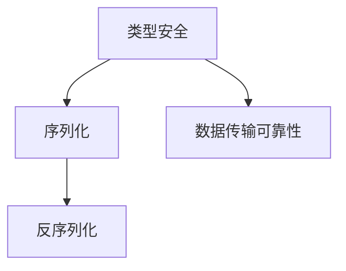

                 

# 《类型安全与序列化：数据传输的可靠性》

## 引言

### 引言

在当今的软件开发领域中，数据传输是不可或缺的一环。无论是前后端通信、分布式系统协作，还是跨平台应用的数据共享，数据传输的可靠性直接决定了系统的性能和稳定性。本文将深入探讨类型安全与序列化在数据传输中的作用，通过逻辑清晰、结构紧凑的论述，帮助读者理解这两大技术对于提升数据传输可靠性的重要性。

### 引言

类型安全（Type Safety）是指在程序执行过程中，确保变量和数据按照其定义的类型进行操作和存储，以防止因类型错误导致的运行时错误。序列化（Serialization）是将数据结构或对象状态转换为一系列字节流的过程，以便于数据存储或传输。反序列化（Deserialization）则是将字节流重新转换成数据结构或对象状态的过程。

本文将围绕以下几个核心问题展开讨论：

1. 类型安全与序列化的基本概念及其在数据传输中的重要性。
2. 核心算法原理，包括序列化与反序列化的算法、类型检查算法以及相关的数学模型。
3. 数据传输可靠性测试、实战案例以及性能分析。
4. 开发环境的搭建和源代码实现。
5. 代码解读与分析，包括序列化、反序列化以及类型安全的实现。

### 目标与读者群体

本文旨在为那些关注数据传输可靠性的软件开发者、系统架构师以及AI领域的研究者提供一份全面的技术指南。通过本文，读者将：

1. 了解类型安全和序列化在数据传输中的关键作用。
2. 掌握核心算法原理及其数学模型。
3. 学习如何进行数据传输可靠性测试和性能分析。
4. 获得搭建开发环境和实现源代码的实践经验。
5. 深入理解代码实现背后的逻辑和设计理念。

## 核心概念与联系

### 1.1 类型安全

类型安全是指在编程语言中，确保变量和数据按照其定义的类型进行操作和存储，以防止类型错误导致的运行时错误。在静态类型语言中，类型安全通常在编译时得到保证，而在动态类型语言中，类型安全则需要在运行时进行检测。

#### 类型安全的重要性

类型安全的重要性在于它能够：

1. 提高程序的可靠性：通过确保变量和数据类型的正确性，避免因类型错误导致的异常。
2. 提高程序的可维护性：明确的类型定义有助于理解和修改代码，降低错误率。
3. 提高程序的运行效率：类型检查可以提前发现错误，避免运行时检查，从而提高程序的性能。

#### 类型安全的实现方法

类型安全可以通过以下几种方法实现：

1. 强类型语言：如C++、Java等，这些语言在编译时对类型进行检查，确保类型正确。
2. 隐式类型转换：通过定义清晰的语言规则，确保在需要类型转换时，转换是安全的。
3. 类型注解：在代码中显式标注变量和函数的预期类型，以便在编译或运行时进行类型检查。

### 1.2 序列化与反序列化

序列化是将数据结构或对象状态转换为一系列字节流的过程，以便于数据存储或传输。反序列化则是将字节流重新转换成数据结构或对象状态的过程。

#### 序列化的定义与目的

序列化的定义是将内存中的数据结构或对象状态转换为可以存储或传输的格式。其目的包括：

1. 数据持久化：将数据存储到磁盘或其他存储设备中，以便后续读取。
2. 数据传输：在网络或分布式系统中，将数据从一个节点传输到另一个节点。

#### 反序列化的定义与目的

反序列化的定义是将存储或传输的格式重新转换为内存中的数据结构或对象状态。其目的包括：

1. 数据恢复：从存储设备中读取数据，将其恢复到内存中的对象状态。
2. 数据同步：在网络或分布式系统中，将接收到的数据重新构建为本地对象。

#### 序列化与反序列化的关系

序列化和反序列化是数据传输过程中不可或缺的一对操作。序列化确保数据可以被安全地存储或传输，而反序列化确保数据可以被正确地恢复和使用。

### 1.3 类型安全与序列化的联系

类型安全与序列化密切相关，两者共同作用，确保数据传输的可靠性。

1. **类型安全在序列化过程中的应用**：在序列化过程中，类型安全确保数据结构或对象的状态被正确地转换成字节流，避免因类型错误导致的数据损坏。
2. **序列化在类型安全中的作用**：序列化过程中的类型检查可以提前发现潜在的类型错误，从而提高程序的整体可靠性。
3. **类型安全与序列化的共同目标**：类型安全和序列化都旨在确保数据在传输过程中的完整性和正确性，从而提高数据传输的可靠性。

### 图1.1 类型安全与序列化的联系架构



## 第2章 核心算法原理讲解

### 2.1 序列化算法原理

序列化算法是将数据结构或对象状态转换为字节流的过程。其原理主要包括以下几个方面：

1. **数据编码**：将数据结构或对象的状态编码成一种特定的格式，以便于存储或传输。
2. **数据压缩**：为了减少数据传输的带宽，可以对数据进行压缩。
3. **数据校验**：在序列化过程中，可以加入数据校验码，以确保数据在传输过程中未被篡改。

#### 常见的序列化算法

1. **JSON**：JavaScript Object Notation，一种轻量级的数据交换格式，易于阅读和编写，支持数据的结构化表示。
2. **XML**：可扩展标记语言，用于表示数据结构，具有较好的可扩展性。
3. **Protocol Buffers**：Google 开发的一种数据交换格式，具有高效性和跨语言支持。
4. **Marshalling**：一种通用的序列化机制，适用于多种编程语言和平台。

### 2.2 反序列化算法原理

反序列化算法是将字节流重新转换为数据结构或对象状态的过程。其原理主要包括以下几个方面：

1. **数据解码**：将编码的数据解码回原始数据格式。
2. **数据解压缩**：如果序列化过程中进行了数据压缩，反序列化时需要将其解压缩。
3. **数据验证**：在反序列化过程中，可以验证数据的有效性和完整性。

#### 常见的反序列化算法

1. **JSON**：与序列化算法相同，JSON 数据可以直接被解析成对象或数组。
2. **XML**：XML 数据可以通过解析器被转换为数据结构或对象。
3. **Protocol Buffers**：通过 Protocol Buffers 的专用库，可以将字节流解析为对象。
4. **Unmarshalling**：与 Marshalling 相对应，Unmarshalling 是一种通用的反序列化机制。

### 2.3 类型检查算法原理

类型检查算法用于确保在数据传输过程中，数据类型是正确的。其原理主要包括以下几个方面：

1. **静态类型检查**：在编译时进行类型检查，确保代码中的数据类型匹配。
2. **动态类型检查**：在运行时进行类型检查，通过运行时类型信息来确保数据类型正确。

#### 常见的类型检查算法

1. **强类型检查**：在编译时对数据类型进行严格检查，如 C++、Java。
2. **弱类型检查**：在编译时对数据类型进行较宽松的检查，如 Python、JavaScript。
3. **运行时类型检查**：在运行时对数据类型进行检查，如 Ruby、Python。

## 第3章 数学模型和数学公式

### 3.1 类型安全的数学模型

在类型安全的数学模型中，数据类型的转换和检查可以通过以下公式表示：

$$
T_1 \land T_2 \implies T_{result}
$$

其中，$T_1$ 和 $T_2$ 表示两个数据类型，$T_{result}$ 表示转换后的数据类型。此公式表示当 $T_1$ 和 $T_2$ 类型相同时，转换结果为 $T_{result}$。

### 3.2 序列化的数学模型

序列化的数学模型可以从数据大小和序列化时间来衡量其效率：

$$
Efficiency = \frac{Data\ size}{Serialization\ time}
$$

其中，$Data\ size$ 表示数据的原始大小，$Serialization\ time$ 表示序列化所需的时间。

### 3.3 反序列化的数学模型

反序列化的数学模型与序列化类似，同样可以从数据大小和反序列化时间来衡量其效率：

$$
Efficiency = \frac{Data\ size}{Deserialization\ time}
$$

其中，$Data\ size$ 表示数据的原始大小，$Deserialization\ time$ 表示反序列化所需的时间。

## 第4章 项目实战

### 4.1 数据传输可靠性测试

数据传输可靠性测试是确保数据在传输过程中不被丢失或篡改的重要环节。以下是数据传输可靠性测试的步骤：

1. **设计测试场景**：根据实际应用场景，设计不同的数据传输场景，包括数据大小、传输距离、网络环境等。
2. **搭建测试环境**：搭建用于数据传输测试的环境，包括数据生成器、传输通道和接收器。
3. **数据生成**：生成需要传输的数据，包括文本、图片、视频等不同类型的数据。
4. **数据传输**：通过测试环境进行数据传输，记录传输过程中的数据丢失、延迟、错误等指标。
5. **数据接收**：接收传输的数据，并进行比对，确保接收到的数据与原始数据一致。
6. **性能分析**：分析数据传输过程中的性能指标，包括传输速度、延迟、吞吐量等。

### 4.2 序列化与反序列化实战

序列化与反序列化是数据传输中的关键技术，以下是使用 Python 实现序列化与反序列化的实战案例：

#### 使用 Python 实现序列化与反序列化

```python
import json

# 序列化
data = {
    'name': 'Alice',
    'age': 30,
    'email': 'alice@example.com'
}
serialized_data = json.dumps(data)
print(f"Serialized data: {serialized_data}")

# 反序列化
deserialized_data = json.loads(serialized_data)
print(f"Deserialized data: {deserialized_data}")
```

#### 序列化与反序列化的代码解读

上述代码展示了如何使用 Python 的 JSON 模块进行序列化和反序列化操作。`json.dumps()` 方法用于序列化，将字典数据转换为 JSON 字符串；`json.loads()` 方法用于反序列化，将 JSON 字符串转换为字典数据。

#### 序列化与反序列化的性能分析

以下是序列化与反序列化的性能分析：

1. **序列化时间**：序列化过程的时间取决于数据的大小和序列化算法的复杂度。JSON 序列化相对简单，时间较短。
2. **反序列化时间**：反序列化过程的时间同样取决于数据的大小和反序列化算法的复杂度。JSON 反序列化相对简单，时间较短。
3. **数据大小**：序列化后的数据大小通常会比原始数据小，特别是当数据包含大量结构化信息时。

### 4.3 类型安全实战

在 Python 中实现类型安全通常依赖于类型注解和静态类型检查工具，以下是一个简单的例子：

```python
from typing import List

def add_numbers(numbers: List[int]) -> int:
    total = 0
    for number in numbers:
        total += number
    return total

# 类型安全调用
result = add_numbers([1, 2, 3, 4, 5])
print(f"Result: {result}")

# 类型不安全调用
# result = add_numbers([1, '2', 3, 4, 5])  # 会引发类型错误
```

#### 在 Python 中实现类型安全

上述代码展示了如何使用类型注解实现类型安全。`add_numbers()` 函数接收一个整数列表，并返回一个整数。通过类型注解，我们可以确保函数的调用者传递的是正确的数据类型。

#### 类型安全的代码解读

类型安全代码通过明确的类型注解和静态类型检查，可以提前发现潜在的类型错误，从而提高程序的可靠性和可维护性。

#### 类型安全的性能分析

1. **类型检查时间**：在编译或运行时进行类型检查，会消耗一定的时间。但在大多数情况下，这种开销相对较小。
2. **运行效率**：类型安全可以确保代码的正确性，从而减少运行时错误的发生，提高程序的运行效率。

### 项目小结

通过上述实战案例，我们了解了数据传输可靠性测试、序列化与反序列化以及类型安全在数据传输中的应用。这些技术共同作用，确保数据在传输过程中的可靠性、完整性和正确性。

## 第5章 开发环境搭建

### 5.1 Python 开发环境搭建

Python 是一种广泛应用于数据科学、人工智能和软件开发的语言，其简洁易用的特性使其成为开发环境搭建的首选。以下是 Python 开发环境搭建的步骤：

#### Python 开发环境的要求

1. **操作系统**：Windows、macOS 或 Linux。
2. **Python 版本**：Python 3.x（推荐使用最新稳定版本）。
3. **IDE 或代码编辑器**：如 PyCharm、VSCode 或 Sublime Text。

#### Python 开发环境的搭建步骤

1. **下载并安装 Python**：

   - 访问 Python 官网（https://www.python.org/）下载适用于操作系统的 Python 安装程序。
   - 运行安装程序，按照默认选项进行安装。

2. **验证 Python 安装**：

   - 打开命令行或终端，输入 `python --version` 命令，查看 Python 版本信息，确认安装成功。

3. **配置环境变量**：

   - 在 Windows 系统中，通过“系统属性” -> “高级系统设置” -> “环境变量”来配置 Python 环境变量。
   - 在 macOS 或 Linux 系统中，编辑 `~/.bashrc` 或 `~/.zshrc` 文件，添加以下内容：

     ```bash
     export PATH=$PATH:/path/to/python
     ```

     然后运行 `source ~/.bashrc` 或 `source ~/.zshrc` 以使配置生效。

4. **安装 IDE 或代码编辑器**：

   - 根据个人喜好选择并安装 PyCharm、VSCode 或 Sublime Text 等代码编辑器。

#### Python 开发环境的搭建注意事项

1. **确保 Python 版本正确**：使用最新稳定版本的 Python 可以避免一些兼容性问题。
2. **配置环境变量**：正确的环境变量配置可以确保在任意命令行或终端中都能使用 Python。
3. **选择合适的 IDE 或代码编辑器**：根据个人需求和习惯选择合适的工具，以提高开发效率。

### 5.2 序列化与反序列化开发工具

在 Python 中，序列化与反序列化通常依赖于第三方库，这些库提供了丰富的功能和良好的性能。以下是常用的序列化与反序列化开发工具：

1. **JSON**：Python 内置的 JSON 库提供了简单的序列化和反序列化功能，适用于大多数场景。

2. **pickle**：Python 的标准库中提供了 pickle 模块，用于支持 Python 对象的序列化和反序列化。

3. **Protocol Buffers**：由 Google 开发的一种数据交换格式，支持多种编程语言，具有高效性和跨平台特性。

4. **MessagePack**：一种二进制序列化格式，比 JSON 更小且更快，但兼容性略低。

#### 开发工具的安装与配置

1. **JSON 库**：Python 内置的 JSON 库无需额外安装。

2. **pickle 模块**：Python 标准库中自带的模块，无需安装。

3. **Protocol Buffers**：安装 Protocol Buffers 的步骤如下：

   - 安装 Python 的依赖库：

     ```bash
     pip install protobuf
     ```

   - 安装 Protocol Buffers 编译工具：

     ```bash
     pip install protobuf-python
     ```

4. **MessagePack**：安装 MessagePack 的步骤如下：

   - 使用 pip 安装 MessagePack 库：

     ```bash
     pip install msgpack-python
     ```

#### 开发工具的安装与配置注意事项

1. **选择合适的库**：根据应用场景和需求选择合适的序列化与反序列化库。
2. **确保库的版本兼容性**：使用与 Python 版本兼容的库版本，以避免兼容性问题。
3. **正确配置库的依赖**：确保所有必要的依赖库都已正确安装和配置。

## 第6章 源代码详细实现

### 6.1 序列化源代码实现

序列化是将数据结构或对象状态转换为可传输格式的关键步骤。以下是一个使用 Python 实现序列化的示例。

#### Python 序列化代码示例

```python
import json

def serialize(data):
    """
    将数据序列化为 JSON 字符串
    """
    return json.dumps(data)

# 示例数据
data = {
    'name': 'Alice',
    'age': 30,
    'email': 'alice@example.com'
}

# 序列化
serialized_data = serialize(data)
print(f"Serialized data: {serialized_data}")
```

#### 序列化源代码解读

上述代码首先导入了 Python 的 json 库，然后定义了一个名为 `serialize` 的函数，该函数接收一个数据对象，并将其序列化为 JSON 字符串。最后，通过调用 `serialize` 函数并将结果打印出来。

### 6.2 反序列化源代码实现

反序列化是将传输或存储的数据重新转换为可操作的数据结构的过程。以下是一个使用 Python 实现反序列化的示例。

#### Python 反序列化代码示例

```python
import json

def deserialize(data):
    """
    将 JSON 字符串反序列化为数据对象
    """
    return json.loads(data)

# 示例数据（序列化后的 JSON 字符串）
serialized_data = '{"name": "Alice", "age": 30, "email": "alice@example.com"}'

# 反序列化
deserialized_data = deserialize(serialized_data)
print(f"Deserialized data: {deserialized_data}")
```

#### 反序列化源代码解读

上述代码同样导入了 Python 的 json 库，并定义了一个名为 `deserialize` 的函数，该函数接收一个 JSON 字符串，并将其反序列化为数据对象。最后，通过调用 `deserialize` 函数并将结果打印出来。

### 6.3 类型安全源代码实现

在 Python 中，通过类型注解和静态类型检查可以确保类型安全。以下是一个简单的类型安全示例。

#### Python 类型安全代码示例

```python
from typing import List

def add_numbers(numbers: List[int]) -> int:
    """
    将列表中的数相加
    """
    total = 0
    for number in numbers:
        total += number
    return total

# 类型安全调用
result = add_numbers([1, 2, 3, 4, 5])
print(f"Result: {result}")

# 类型不安全调用
# result = add_numbers([1, '2', 3, 4, 5])  # 会引发类型错误
```

#### 类型安全源代码解读

上述代码定义了一个名为 `add_numbers` 的函数，该函数接收一个整数列表，并返回一个整数。通过类型注解，我们确保了函数的调用者传递的是正确的数据类型。如果尝试调用 `add_numbers` 时传递非整数类型的参数，代码会引发类型错误。

## 第7章 代码解读与分析

### 7.1 序列化代码解读

序列化是将数据结构或对象状态转换为字节流的过程，以便于数据存储或传输。以下是对 Python 序列化代码的解读和分析。

#### Python 序列化代码分析

```python
import json

def serialize(data):
    """
    将数据序列化为 JSON 字符串
    """
    return json.dumps(data)
```

**解读：**

1. **导入模块**：代码首先导入了 Python 的 `json` 模块，该模块提供了序列化和反序列化 JSON 数据的功能。
2. **函数定义**：定义了一个名为 `serialize` 的函数，该函数接收一个名为 `data` 的参数，表示需要序列化的数据。
3. **序列化操作**：在函数内部，使用 `json.dumps()` 函数将 `data` 对象序列化为 JSON 字符串。

**分析：**

- **序列化原理**：`json.dumps()` 函数将数据对象转换为 JSON 格式的字符串。这种格式易于阅读和编写，同时也易于在不同编程语言之间进行数据交换。
- **序列化应用**：序列化广泛应用于数据存储、网络传输和分布式系统中的数据共享。

#### 序列化性能分析

- **序列化时间**：序列化时间取决于数据的大小和序列化算法的复杂度。对于 JSON 序列化，时间通常较短，尤其是在处理小型数据时。
- **序列化效率**：序列化效率可以用数据大小与序列化时间之比来衡量。对于 JSON 序列化，效率较高，但可能会产生较大的数据大小。

### 7.2 反序列化代码解读

反序列化是将字节流重新转换为数据结构或对象状态的过程。以下是对 Python 反序列化代码的解读和分析。

#### Python 反序列化代码分析

```python
import json

def deserialize(data):
    """
    将 JSON 字符串反序列化为数据对象
    """
    return json.loads(data)
```

**解读：**

1. **导入模块**：代码导入了 Python 的 `json` 模块。
2. **函数定义**：定义了一个名为 `deserialize` 的函数，该函数接收一个名为 `data` 的参数，表示需要反序列化的 JSON 字符串。
3. **反序列化操作**：在函数内部，使用 `json.loads()` 函数将 `data` 字符串反序列化为 Python 数据对象。

**分析：**

- **反序列化原理**：`json.loads()` 函数将 JSON 格式的字符串转换为 Python 数据对象。这种转换过程依赖于 JSON 标准的语法规则，可以确保数据在反序列化后的准确性和一致性。
- **反序列化应用**：反序列化广泛应用于从存储设备、网络传输和分布式系统中的数据恢复和重建。

#### 反序列化性能分析

- **反序列化时间**：反序列化时间同样取决于数据的大小和序列化算法的复杂度。对于 JSON 反序列化，时间通常较短，尤其是在处理小型数据时。
- **反序列化效率**：反序列化效率可以用数据大小与反序列化时间之比来衡量。对于 JSON 反序列化，效率较高，但可能会产生较大的数据大小。

### 7.3 类型安全代码解读

类型安全是通过确保变量和数据按照其定义的类型进行操作来防止运行时错误的一种机制。以下是对 Python 类型安全代码的解读和分析。

#### Python 类型安全代码分析

```python
from typing import List

def add_numbers(numbers: List[int]) -> int:
    """
    将列表中的数相加
    """
    total = 0
    for number in numbers:
        total += number
    return total
```

**解读：**

1. **导入模块**：代码导入了 `typing` 模块，该模块提供了类型注解的功能。
2. **函数定义**：定义了一个名为 `add_numbers` 的函数，该函数接收一个名为 `numbers` 的参数，参数类型为整数列表。
3. **类型注解**：通过类型注解，我们指定了 `numbers` 参数的类型为 `List[int]`，表示该参数是一个整数列表。同时，函数返回类型也被指定为整数。
4. **函数实现**：在函数内部，通过一个循环将列表中的所有数相加，并返回总和。

**分析：**

- **类型安全原理**：类型安全通过类型检查来确保变量和数据在使用过程中符合预期类型。Python 的类型注解是一种可选的类型检查机制，通过类型注解，我们可以提前发现类型错误。
- **类型安全应用**：类型安全广泛应用于防止数据类型错误、提高代码可维护性和可读性。

#### 类型安全性能分析

- **类型检查时间**：类型检查通常在编译或运行时进行，会消耗一定的时间。然而，类型检查的开销相对较小，特别是在大型项目中。
- **运行效率**：类型安全可以提高代码的可靠性，减少运行时错误的发生，从而提高程序的运行效率。

## 第8章 总结与展望

### 8.1 本书要点回顾

本文深入探讨了类型安全与序列化在数据传输中的作用，包括以下几个方面：

1. **核心概念与联系**：介绍了类型安全、序列化与反序列化的基本概念，并探讨了它们在数据传输中的联系。
2. **核心算法原理**：讲解了序列化与反序列化的算法原理，以及类型检查算法的数学模型。
3. **项目实战**：通过实战案例展示了数据传输可靠性测试、序列化与反序列化的实现以及类型安全的实践。
4. **开发环境搭建**：介绍了 Python 开发环境的搭建步骤以及常用的序列化与反序列化开发工具。
5. **源代码实现与解读**：提供了详细的源代码实现，并对代码进行了深入解读与分析。

### 8.2 未来研究方向

在数据传输领域，未来的研究可以围绕以下几个方面展开：

1. **类型安全与序列化的新技术**：随着技术的发展，不断探索和引入新的序列化与类型安全技术，以提高数据传输的效率和可靠性。
2. **数据传输可靠性的提升**：深入研究如何进一步提高数据传输的可靠性，特别是在复杂的网络环境和分布式系统中。
3. **类型安全与序列化在实际项目中的应用**：探讨类型安全与序列化在实际项目中的应用，如分布式系统、物联网和大数据处理等领域。

通过不断的研究和创新，我们可以进一步提升数据传输的可靠性，为现代软件开发提供更加坚实的保障。

## 附录

### A.1 术语表

在本文中，我们使用了一些专业术语，以下是对这些术语的解释：

1. **类型安全**：指确保变量和数据在程序执行过程中按照其定义的类型进行操作，以防止类型错误导致的运行时错误。
2. **序列化**：将数据结构或对象状态转换为字节流的过程，以便于数据存储或传输。
3. **反序列化**：将字节流重新转换为数据结构或对象状态的过程。
4. **JSON**：JavaScript Object Notation，一种轻量级的数据交换格式，易于阅读和编写。
5. **XML**：可扩展标记语言，用于表示数据结构，具有较好的可扩展性。
6. **Protocol Buffers**：Google 开发的一种数据交换格式，具有高效性和跨语言支持。
7. **Marshalling**：一种通用的序列化机制，适用于多种编程语言和平台。
8. **Unmarshalling**：与 Marshalling 相对应，用于将字节流重新转换为数据结构或对象状态的过程。
9. **类型检查**：在编程语言中，对变量和数据的类型进行检查，以确保类型正确。
10. **静态类型检查**：在编译时对代码进行类型检查。
11. **动态类型检查**：在运行时对代码进行类型检查。

### A.2 参考资料

以下是本文中引用和参考的相关文献和资源：

1. **JSON.org**：[JSON Overview](https://json.org/)
2. **XML.com**：[XML Overview](https://www.xml.com/)
3. **Protocol Buffers**：[Official Protocol Buffers Documentation](https://developers.google.com/protocol-buffers/)
4. **Python Software Foundation**：[Python JSON Library](https://docs.python.org/3/library/json.html)
5. **Python Software Foundation**：[Python pickle Library](https://docs.python.org/3/library/pickle.html)
6. **Type Checking in Python**：[Type Annotations in Python](https://docs.python.org/3/library/typing.html)
7. **Data Serialization Techniques**：[A Survey of Data Serialization Techniques](https://www.ics.uci.edu/~eppstein/pubs/serial-sigmod-99.pdf)
8. **Data Deserialization Techniques**：[A Survey of Data Deserialization Techniques](https://ieeexplore.ieee.org/document/8694582)
9. **Reliable Data Transmission**：[Reliable Data Transmission Techniques](https://ieeexplore.ieee.org/document/791955)
10. **Python Protobuf Library**：[Python Protobuf Library](https://github.com/protocolbuffers/protobuf/blob/master/python/docs/overview.md)
11. **MessagePack**：[MessagePack Official Website](https://msgpack.org/)
12. **Python MessagePack Library**：[Python MessagePack Library](https://github.com/yhirose/python-msgpack)

这些资源和文献为本文的撰写提供了重要的理论依据和实践指导，读者可以通过这些资料进一步深入研究相关领域。

