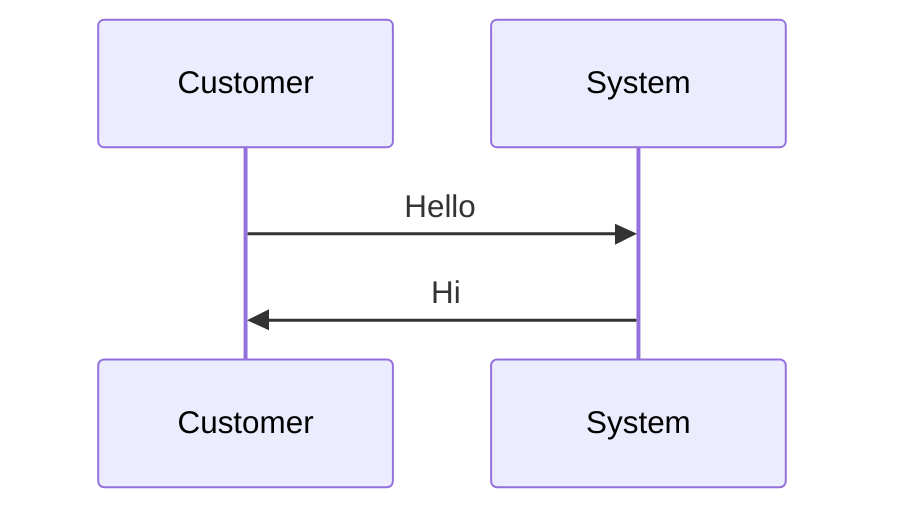
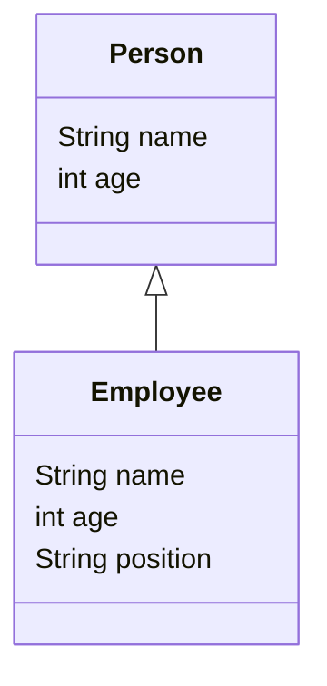
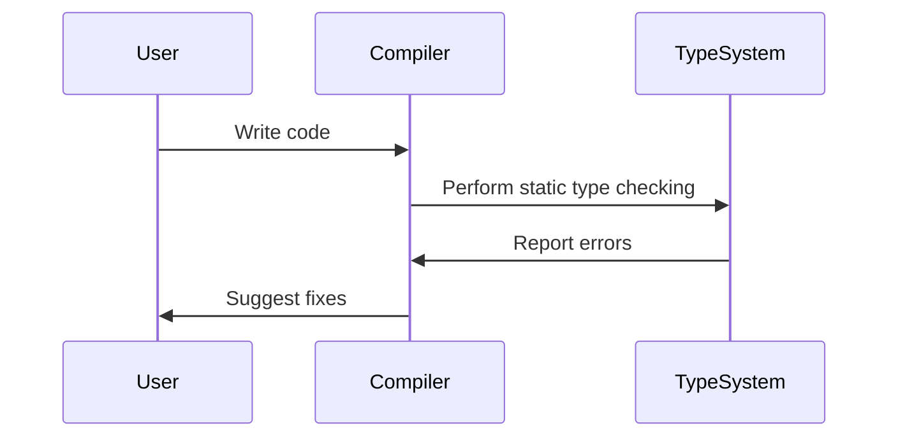
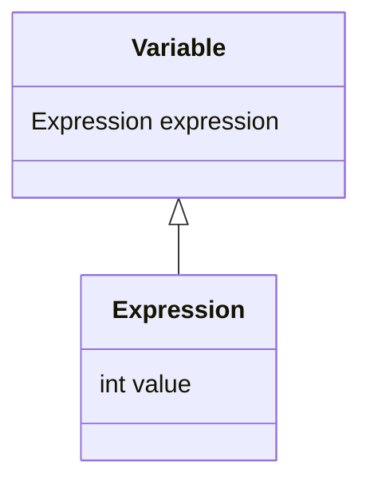
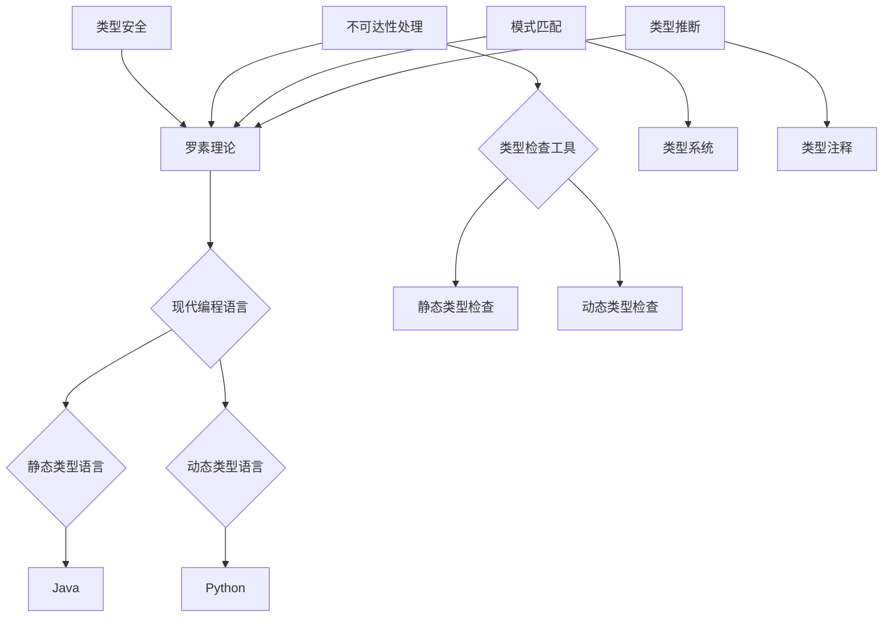
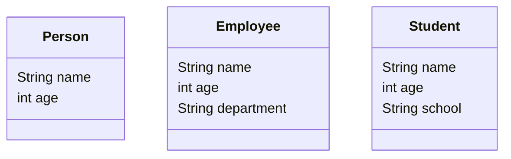
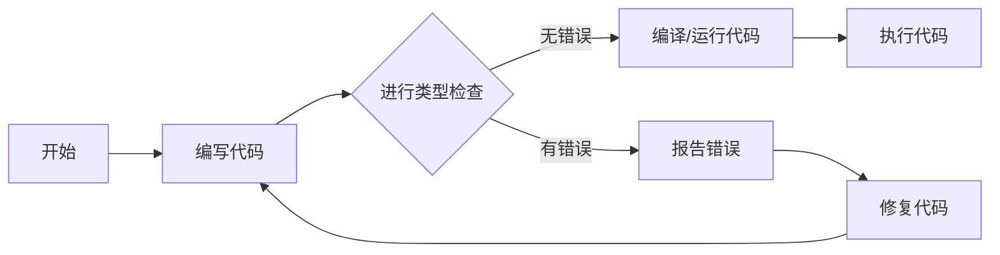
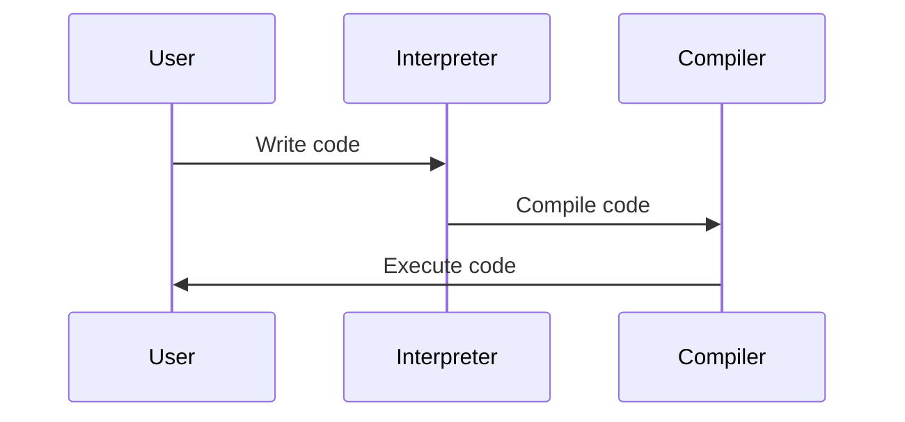
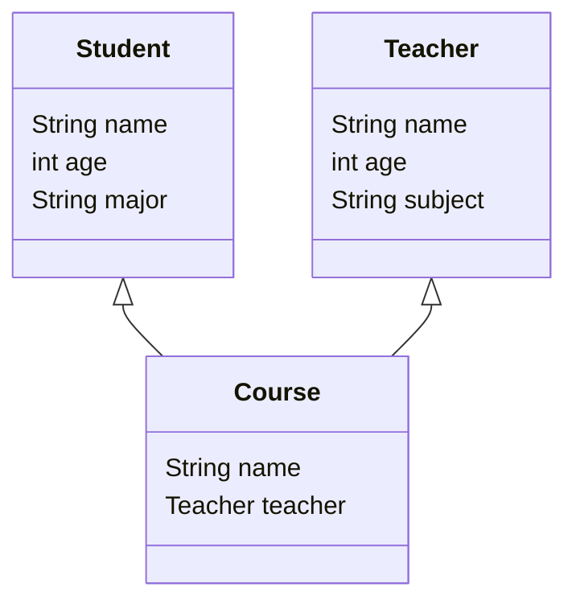

                 

# 类型安全：罗素理论在现代编程中的应用

## 引言

### 1.1 书籍的目的和读者对象

在信息技术迅猛发展的今天，编程语言和编程范式不断演进。类型安全作为编程语言的核心特性之一，对于确保程序的正确性和可靠性具有重要意义。本书旨在探讨类型安全这一主题，并深入分析罗素理论在现代编程中的应用，帮助读者理解类型安全的核心概念及其实现机制。

本书面向具有一定编程基础的读者，特别是对类型系统和编程语言设计感兴趣的程序员、软件工程师、系统架构师以及计算机科学专业的学生。通过本书的学习，读者可以：

- 理解类型安全的基本概念和类型系统的分类。
- 掌握罗素理论及其与类型安全的关系。
- 分析不同编程语言中的类型安全特性。
- 应用罗素理论解决实际编程中的类型安全问题。

### 1.2 类型安全的重要性

类型安全是编程语言设计中的一个重要概念，它涉及到程序在运行时是否能够按照预期的行为执行。一个类型安全的编程语言能够在编译或运行时检测出类型错误，从而避免因类型错误导致的程序崩溃、数据损坏或其他不可预期的行为。

类型安全的重要性体现在以下几个方面：

1. **错误检测**：类型系统可以帮助程序员在编译时发现潜在的错误，减少程序调试的时间。
2. **性能优化**：类型安全可以提高程序的执行效率，因为类型检查可以消除运行时的类型错误，减少动态类型检查的开销。
3. **代码可维护性**：类型安全使得代码更加结构化，便于理解和维护。
4. **安全性**：类型安全有助于防止恶意代码的执行，提高程序的安全性。

### 1.3 罗素理论对类型安全的影响

罗素理论是由英国哲学家和数学家伯特兰·罗素提出的，旨在解决集合论中的悖论问题。罗素理论的核心思想是通过区分“集合”和“类”来避免集合论的悖论，这一思想在现代编程语言的设计中有着深远的影响。

罗素理论对类型安全的影响主要体现在以下几个方面：

1. **类型分类**：罗素理论将对象分为不同的类型，这些类型具有明确的边界和规则，有助于实现类型安全。
2. **类型检查**：罗素理论提供了一种方法来检查程序中的类型错误，从而提高程序的可靠性。
3. **模式匹配**：罗素理论中的概念可以用于实现高效的模式匹配机制，这在动态类型编程语言中尤为重要。

本书将围绕这些主题展开，通过逐步的分析和推理，帮助读者深入理解类型安全，并探讨罗素理论在编程中的具体应用。

## 第2章 类型安全的基本概念

### 2.1 类型系统

类型系统是编程语言的核心组成部分，它定义了变量、函数、表达式和其他编程结构所涉及的数据类型。类型系统的主要功能是提供一种机制，以确保程序在编译或运行时不会发生类型错误。

#### 2.1.1 数据类型与类型系统

数据类型是类型系统的基础，它定义了程序中可以操作的数据的种类和形式。常见的编程语言包括以下几种基本数据类型：

1. **整型（Integer）**：表示整数，如 `int`。
2. **浮点型（Floating-point）**：表示实数，如 `float` 和 `double`。
3. **布尔型（Boolean）**：表示真或假，如 `bool`。
4. **字符型（Character）**：表示单个字符，如 `char`。
5. **字符串型（String）**：表示一系列字符，如 `String`。

类型系统还定义了如何处理不同数据类型之间的运算和转换。例如，在 C 语言中，整型和浮点型之间的运算会自动进行类型转换，而 Python 中则提供了显式的类型转换函数。

#### 2.1.2 类型检查

类型检查是确保程序类型安全的关键步骤。类型检查可以分为静态类型检查和动态类型检查。

1. **静态类型检查**：在程序编译时进行类型检查，确保程序中的每个表达式都有合法的类型。静态类型语言如 Java 和 C++ 在编译时进行严格的类型检查，从而在运行时减少类型错误的可能性。
   
2. **动态类型检查**：在程序运行时进行类型检查，通过运行时类型信息来确保程序的类型安全。动态类型语言如 Python 和 JavaScript 在运行时检查变量的类型，从而在运行时捕捉类型错误。

类型检查的目的是确保以下条件：

- **类型兼容性**：不同类型的值是否可以进行合法的操作。
- **类型一致性**：程序中的变量是否与其声明时的类型一致。
- **类型边界**：类型是否超出其定义的边界，如整数溢出。

### 2.2 罗素理论的简介

伯特兰·罗素（Bertrand Russell）是20世纪初的著名哲学家和数学家，他提出了罗素理论，旨在解决集合论中的悖论问题，特别是著名的“罗素悖论”。

#### 2.2.1 罗素理论与类型安全

罗素理论的核心思想是区分“集合”和“类”。在罗素理论中：

- **集合**：是一组具有共同性质的元素的集合，其成员是具体的对象。
- **类**：是一个抽象的概念，表示一组具有共同属性的对象的集合。

罗素理论通过限制集合的构造，避免了集合论中的悖论，如“罗素悖论”，该悖论指出，如果存在一个集合包含所有不包含自身作为元素的集合，那么这个集合会导致逻辑矛盾。

罗素理论对类型安全的影响在于，它提供了一种机制来定义类型的边界和规则，从而在编程语言中实现类型安全。例如，在面向对象编程中，类可以被视为一种抽象的数据类型，它定义了对象的属性和行为，从而确保了对象之间的类型一致性。

#### 2.2.2 罗素的集合论

罗素的集合论是一种形式化的集合理论，旨在通过严格定义集合的概念和操作来解决集合论中的悖论问题。罗素提出了以下关键概念：

- **纯粹集合**：不包含自身作为元素的集合。
- **类型**：不同类型的对象具有不同的属性和操作。
- **逻辑构造**：通过逻辑运算和量词来构建复杂的集合表达式。

这些概念为现代编程语言中的类型系统提供了理论基础，使得类型系统能够在编程过程中提供更强的一致性和安全性。

### 2.3 罗素理论与类型安全的关系

罗素理论与类型安全之间存在密切的关系，这种关系主要体现在以下几个方面：

1. **类型分类**：罗素理论通过区分集合和类，为类型系统提供了一种清晰的分类方法。在编程语言中，类可以被视为一种抽象的数据类型，它定义了对象的属性和行为，从而确保了类型的一致性和安全性。

2. **类型检查**：罗素理论提供了基于类型的约束机制，可以用于实现强类型检查。例如，在静态类型语言中，通过严格的类型检查，可以确保程序中的每个表达式都有合法的类型，从而避免类型错误。

3. **模式匹配**：罗素理论中的概念可以用于实现高效的模式匹配机制。模式匹配是一种用于匹配和分解复杂数据结构的方法，它通过检查对象的属性和行为来确定其类型。在动态类型编程语言中，模式匹配是一种重要的类型安全特性。

总之，罗素理论为类型安全提供了理论基础和实践指导，使得现代编程语言能够实现更强的一致性和可靠性。接下来，我们将进一步探讨不同编程语言中的类型安全特性。

## 第3章 现代编程语言中的类型安全

### 3.1 静态类型语言

静态类型语言在编译时就已经确定了变量的类型，这种类型信息在整个程序运行期间保持不变。静态类型语言的优点包括更强的类型安全和更好的性能。以下是几种常见的静态类型语言：

1. **Java**：Java 是一种广泛使用的静态类型语言，它通过严格的类型检查确保程序的正确性。Java 的类型系统包括基本数据类型（如 `int`、`float`、`char`）和引用数据类型（如 `String`、`List`）。
   
2. **C++**：C++ 是一种多范式编程语言，它支持静态类型和动态类型。C++ 的类型系统包括基本数据类型和用户定义的数据类型，如类和结构体。

3. **C#**：C# 是一种面向对象的静态类型语言，它用于开发 Windows 应用程序和 Web 应用程序。C# 的类型系统包括值类型和引用类型，如 `int`、`float`、`String`。

静态类型语言的优势：

- **强类型检查**：在编译时进行严格的类型检查，可以及时发现和修复类型错误。
- **性能优化**：类型信息在编译时已知，有助于编译器进行性能优化。
- **代码可读性**：类型信息明确，有助于提高代码的可读性和可维护性。

静态类型语言的应用场景：

- **系统级编程**：如操作系统、驱动程序和嵌入式系统。
- **企业级应用**：如大型软件系统、数据库和服务器端应用程序。

### 3.2 动态类型语言

动态类型语言在程序运行时确定变量的类型，这种类型信息在运行时动态变化。动态类型语言的优点包括灵活性和简洁性。以下是几种常见的动态类型语言：

1. **Python**：Python 是一种广泛使用的动态类型语言，它具有简洁的语法和强大的库支持。Python 的类型系统是基于动态类型检查的，变量不需要显式声明类型。

2. **JavaScript**：JavaScript 是一种用于 Web 开发的动态类型语言，它被广泛用于前端和后端开发。JavaScript 的类型系统基于动态类型检查，并在 ES6（ECMAScript 2015）中引入了类和模块等静态类型特性。

3. **Ruby**：Ruby 是一种动态类型语言，它具有简洁的语法和强大的库支持。Ruby 的类型系统是基于动态类型检查的，它通过类和模块来定义类型。

动态类型语言的优势：

- **灵活性**：动态类型允许程序员更灵活地编写代码，因为不需要显式声明类型。
- **简洁性**：动态类型语言通常具有更简洁的语法，可以提高开发效率。
- **脚本编程**：动态类型语言通常用于脚本编程，如自动化测试和系统管理。

动态类型语言的应用场景：

- **Web 开发**：如前端开发、后端开发、Web 框架和库。
- **数据科学**：如数据分析、机器学习和数据可视化。
- **自动化测试**：如测试脚本和自动化测试工具。

### 3.3 静态类型与动态类型的对比

静态类型和动态类型各有优缺点，以下是它们的主要对比：

1. **类型检查**：
   - 静态类型：在编译时进行类型检查，可以及早发现类型错误。
   - 动态类型：在运行时进行类型检查，可能需要更多的时间和资源。

2. **性能**：
   - 静态类型：类型信息在编译时已知，有助于编译器进行性能优化。
   - 动态类型：类型信息在运行时确定，可能需要进行动态类型检查，从而影响性能。

3. **灵活性**：
   - 静态类型：类型信息明确，可以提高代码的可读性和可维护性。
   - 动态类型：类型信息灵活，允许更灵活的编程。

4. **语法**：
   - 静态类型：通常具有更复杂的语法，因为需要显式声明类型。
   - 动态类型：通常具有更简洁的语法，因为不需要显式声明类型。

5. **适用场景**：
   - 静态类型：适用于系统级编程、大型软件系统和性能敏感的应用程序。
   - 动态类型：适用于 Web 开发、数据科学、脚本编程和需要快速迭代的场景。

通过对比，可以看出静态类型和动态类型各有优劣，选择合适的类型系统取决于具体的应用场景和开发需求。

### 3.4 结论

现代编程语言中的类型安全是确保程序正确性和可靠性的重要手段。无论是静态类型语言还是动态类型语言，它们都在类型安全方面发挥了重要作用。理解不同类型系统的特点和适用场景，可以帮助程序员选择合适的编程语言，实现高效、可靠的软件开发。

接下来，我们将进一步探讨罗素理论在编程中的应用，特别是它在类型安全中的具体实现。

## 第4章 罗素理论的应用

### 4.1 不可达性的处理

在编程中，不可达性是指某些代码路径在实际执行过程中永远不会被执行到的现象。不可达性可能会导致程序逻辑错误，甚至导致程序崩溃。罗素理论在处理不可达性方面提供了有益的启示。

#### 4.1.1 不可达性的定义

不可达性是指程序中的某些代码路径在执行过程中永远不会被执行到。这种情况通常发生在以下几种情况下：

1. **死代码**：死代码是指永远不会被执行的代码。例如：
   ```python
   if false:
       print("这是死代码")
   ```

2. **空循环**：空循环是指循环条件一开始就为假，导致循环体永远不会被执行。例如：
   ```python
   while False:
       print("这将会是一个空循环")
   ```

3. **死分支**：在条件分支语句中，某些分支永远不会被执行。例如：
   ```python
   if x > 10:
       print("x 大于 10")
   else:
       print("x 小于或等于 10")
   ```

#### 4.1.2 罗素理论在不可达性处理中的应用

罗素理论通过区分集合和类，为处理不可达性提供了理论基础。具体来说，罗素理论通过以下方式处理不可达性：

1. **类型检查**：在编译或运行时进行类型检查，确保程序中的每个代码路径都有明确的类型。通过类型检查，可以检测出可能的类型错误，从而避免不可达性。

2. **静态分析**：通过静态分析技术，分析程序的结构和行为，找出可能存在的不可达代码。静态分析可以帮助程序员及早发现和修复不可达性。

3. **模式匹配**：罗素理论中的概念可以用于实现高效的模式匹配机制。模式匹配可以识别出程序中的不可达代码，从而避免不必要的执行。

### 4.2 模式匹配

模式匹配是一种用于匹配和分解复杂数据结构的方法，它在编程语言中具有广泛的应用。罗素理论在模式匹配中提供了有益的启示。

#### 4.2.1 模式匹配的基本概念

模式匹配是指将一个值与一个模式进行匹配，以确定该值是否符合预期。模式匹配通常用于以下几种情况：

1. **变量绑定**：通过模式匹配，可以将值绑定到变量。例如，在 Python 中，可以使用模式匹配来解析元组：
   ```python
   value, *rest = (1, 2, 3, 4)
   ```

2. **函数参数**：模式匹配可以用于函数参数的匹配，以确保函数调用符合预期。例如，在 Haskell 中，可以使用模式匹配来定义函数：
   ```haskell
   sumValues :: [Int] -> Int
   sumValues [] = 0
   sumValues (x:xs) = x + sumValues xs
   ```

3. **数据结构分解**：模式匹配可以用于分解复杂的数据结构，以提取有用的信息。例如，在 Prolog 中，可以使用模式匹配来处理复杂数据结构：
   ```prolog
   member(X, [X|_]).
   member(X, [_|T]) :- member(X, T).
   ```

#### 4.2.2 罗素理论在模式匹配中的应用

罗素理论通过区分集合和类，为模式匹配提供了理论基础。具体来说，罗素理论中的概念可以用于实现高效的模式匹配机制。例如，在 Haskell 中，模式匹配是基于罗素理论的集合概念实现的，它允许程序员通过模式匹配来提取和操作集合中的元素。

1. **集合匹配**：在 Haskell 中，可以使用集合匹配来提取和操作集合中的元素。例如：
   ```haskell
   findValue :: [Int] -> Int
   findValue [] = 0
   findValue (x:xs) = if x == 5 then x else findValue xs
   ```

2. **类型匹配**：在 Haskell 中，类型匹配是基于罗素理论的类型系统实现的，它确保函数调用和数据结构操作符合预期的类型。例如：
   ```haskell
   sum :: [Int] -> Int
   sum [] = 0
   sum (x:xs) = x + sum xs
   ```

通过罗素理论的应用，模式匹配可以实现高效的代码和灵活的数据处理，从而提高程序的可读性和可维护性。

### 4.3 类型推断

类型推断是一种自动确定变量、函数和表达式类型的机制，它在现代编程语言中具有重要作用。罗素理论为类型推断提供了有益的启示。

#### 4.3.1 类型推断的基本原理

类型推断是指编程语言在编译或运行时自动确定变量、函数和表达式的类型。类型推断可以分为以下几种方法：

1. **静态类型推断**：在编译时自动确定变量的类型。例如，在 Java 和 C++ 中，编译器会根据变量的声明和上下文来确定其类型。

2. **动态类型推断**：在运行时自动确定变量的类型。例如，在 Python 和 JavaScript 中，变量类型在运行时动态确定。

3. **混合类型推断**：结合静态类型推断和动态类型推断，自动确定变量的类型。例如，在 C# 中，可以使用静态类型推断来提高性能，同时允许动态类型推断来增加灵活性。

#### 4.3.2 罗素理论在类型推断中的应用

罗素理论通过区分集合和类，为类型推断提供了理论基础。具体来说，罗素理论中的概念可以用于实现高效的类型推断机制。例如，在 Haskell 中，类型推断是基于罗素理论的集合概念实现的，它允许程序员通过类型推导来简化代码。

1. **集合类型推导**：在 Haskell 中，可以使用集合类型推导来简化代码。例如：
   ```haskell
   myList :: [Int]
   myList = [1, 2, 3]
   ```

2. **函数类型推导**：在 Haskell 中，可以使用函数类型推导来简化函数定义。例如：
   ```haskell
   sum :: [Int] -> Int
   sum [] = 0
   sum (x:xs) = x + sum xs
   ```

通过罗素理论的应用，类型推断可以实现更简洁的代码和更灵活的类型系统，从而提高程序的可读性和可维护性。

### 4.4 结论

罗素理论在编程中的具体应用，特别是在处理不可达性、模式匹配和类型推断方面，为现代编程语言提供了有益的理论基础和实践指导。通过罗素理论的启示，程序员可以编写更可靠、更高效的代码。接下来，我们将进一步探讨 Python 中的类型安全实现。

## 第5章 Python 中的类型安全

### 5.1 Python 的类型系统

Python 是一种动态类型的语言，这意味着它的变量类型是在运行时动态确定的。Python 的类型系统包括以下几种基本类型：

1. **整数（int）**：表示有符号整数。
2. **浮点数（float）**：表示浮点数。
3. **布尔（bool）**：表示布尔值 True 或 False。
4. **字符串（str）**：表示文本字符串。
5. **列表（list）**：表示有序集合。
6. **元组（tuple）**：表示不可变的有序集合。
7. **字典（dict）**：表示键值对集合。
8. **集合（set）**：表示无序集合。

Python 的类型系统还支持用户自定义类型，如类和枚举。

### 5.2 强类型与弱类型

在讨论 Python 的类型安全时，我们需要了解强类型和弱类型的区别。

1. **强类型**：在强类型语言中，变量必须在声明时指定类型，并且类型在程序执行过程中不会改变。强类型语言通过严格的类型检查来确保类型安全。例如，Java 和 C++ 就是强类型语言。

2. **弱类型**：在弱类型语言中，变量不需要在声明时指定类型，并且在程序执行过程中可以改变类型。Python 是一种弱类型语言，这意味着变量可以在运行时改变其类型。

### 5.3 Python 中的类型安全实践

尽管 Python 是一种弱类型语言，但它仍然提供了多种机制来提高类型安全：

1. **类型注释**：Python 3.5 引入了类型注释，允许程序员在函数和变量声明时指定类型。类型注释不直接影响程序的运行，但可以帮助代码编辑器和 IDE 进行代码补全和错误检查。

2. **类型提示**：类型提示是 Python 3.5 引入的一个功能，它允许程序员在函数定义时指定参数和返回值的类型。类型提示通过 `from typing import List, Tuple` 等模块来实现。

3. **类型检查工具**：Python 社区提供了多个类型检查工具，如 `mypy` 和 `pytype`。这些工具可以在运行时检查代码的类型错误，并报告潜在的问题。

### 5.3.1 Python 类型检查工具的使用

`mypy` 是一个流行的 Python 类型检查工具，它可以检测代码中的类型错误并提供详细的错误报告。以下是使用 `mypy` 的基本步骤：

1. **安装 mypy**：
   ```bash
   pip install mypy
   ```

2. **编写类型注释**：
   ```python
   def add(a: int, b: int) -> int:
       return a + b
   ```

3. **运行 mypy 进行类型检查**：
   ```bash
   mypy your_script.py
   ```

`mypy` 会检查代码中的类型错误，并报告错误信息，例如：
```plaintext
your_script.py:1: error: Argument 1 to "add" of type "str"
your_script.py:1: error: Argument 2 to "add" of type "str"
```

### 5.3.2 Python 类型安全的编程技巧

以下是一些提高 Python 类型安全的编程技巧：

1. **使用类型提示**：在函数和变量声明时使用类型提示，这有助于提高代码的可读性和可维护性。
   
2. **避免使用 `eval` 和 `exec`**：这些函数可以执行任意代码，可能导致类型错误和安全问题。

3. **使用静态类型检查工具**：使用 `mypy` 等工具进行静态类型检查，及早发现类型错误。

4. **使用 `isinstance` 进行类型检查**：在运行时使用 `isinstance` 函数进行类型检查，以确保代码的健壮性。

5. **合理使用类型转换**：在需要时使用类型转换函数，如 `int()`、`float()`、`str()` 等，以确保类型的兼容性。

通过遵循这些技巧，可以显著提高 Python 代码的类型安全，从而减少潜在的错误和漏洞。

### 5.4 结论

Python 是一种动态类型的语言，尽管它不需要在声明时指定变量类型，但它提供了多种机制来提高类型安全。通过使用类型注释、类型提示和类型检查工具，程序员可以编写更可靠、更安全的代码。在接下来的章节中，我们将探讨其他编程语言中的类型安全特性。

## 第6章 其他编程语言中的类型安全

### 6.1 Java

Java 是一种静态类型语言，它通过严格的类型检查确保程序的正确性和安全性。Java 的类型系统包括基本数据类型、引用数据类型和用户自定义数据类型。

#### 6.1.1 Java 的类型系统

Java 的基本数据类型包括：

- **整数类型**：`byte`、`short`、`int`、`long`
- **浮点类型**：`float`、`double`
- **字符类型**：`char`
- **布尔类型**：`boolean`

Java 的引用数据类型包括类（`class`）、接口（`interface`）和数组（`array`）。用户可以通过继承（`extends`）和实现（`implements`）来创建自定义数据类型。

#### 6.1.2 Java 的类型安全实践

Java 的类型安全主要体现在以下几个方面：

1. **静态类型检查**：Java 在编译时进行严格的类型检查，确保每个变量、表达式和方法调用都有合法的类型。

2. **强类型检查**：Java 是强类型语言，这意味着变量在声明时必须指定类型，并且在运行时不能改变类型。

3. **异常处理**：Java 通过异常处理机制（`try-catch`）来处理类型相关的错误，确保程序的健壮性。

4. **泛型编程**：Java 通过泛型编程（`<T>`）来提高类型安全，避免类型转换错误。

### 6.2 C++

C++ 是一种多范式编程语言，它支持静态类型和动态类型。C++ 的类型系统包括基本数据类型、类和模板。

#### 6.2.1 C++ 的类型系统

C++ 的基本数据类型包括：

- **整数类型**：`char`、`short`、`int`、`long`、`long long`
- **浮点类型**：`float`、`double`、`long double`
- **布尔类型**：`bool`

C++ 还支持用户自定义数据类型，如类和枚举。

#### 6.2.2 C++ 的类型安全实践

C++ 的类型安全主要体现在以下几个方面：

1. **静态类型检查**：C++ 在编译时进行类型检查，确保程序中的每个变量、表达式和方法调用都有合法的类型。

2. **强类型检查**：C++ 是强类型语言，这意味着变量在声明时必须指定类型，并且在运行时不能改变类型。

3. **模板编程**：C++ 通过模板编程来提高类型安全，模板允许程序员编写与类型无关的代码，从而避免类型转换错误。

4. **异常处理**：C++ 通过异常处理机制（`try-catch`）来处理类型相关的错误，确保程序的健壮性。

### 6.3 JavaScript

JavaScript 是一种动态类型语言，它在运行时确定变量的类型。JavaScript 的类型系统相对简单，包括基本数据类型、对象和函数。

#### 6.3.1 JavaScript 的类型系统

JavaScript 的基本数据类型包括：

- **数字类型**：`number`
- **字符串类型**：`string`
- **布尔类型**：`boolean`
- **null 类型**：`null`
- **undefined 类型**：`undefined`

JavaScript 的对象类型是用于存储复杂数据的容器，函数也是一种对象。

#### 6.3.2 JavaScript 的类型安全实践

JavaScript 的类型安全主要体现在以下几个方面：

1. **动态类型检查**：JavaScript 在运行时进行类型检查，这意味着变量可以在运行时改变类型。

2. **类型转换**：JavaScript 提供了多种类型转换函数，如 `Number()`、`String()`、`Boolean()`，这些函数可以确保类型转换的正确性。

3. **类型保护**：通过使用条件表达式和类型检查函数（如 `typeof` 和 `instanceof`），可以确保变量在特定上下文中具有正确的类型。

4. **函数类型检查**：JavaScript 函数可以作为参数传递，并返回值。函数的类型安全主要通过函数签名和返回值类型来确保。

### 6.4 结论

不同编程语言在类型安全方面有不同的实现方式。Java 和 C++ 作为静态类型语言，通过严格的类型检查和强类型机制来提高程序的正确性和安全性。JavaScript 作为动态类型语言，通过动态类型检查和类型转换机制来确保程序的类型安全。理解不同语言中的类型安全特性，可以帮助程序员编写更可靠、更安全的代码。

## 第7章 类型安全的挑战与未来

### 7.1 类型安全的挑战

类型安全虽然对于确保程序的正确性和可靠性至关重要，但在实现过程中仍面临诸多挑战。以下是类型安全面临的几个主要挑战：

#### 7.1.1 类型系统的复杂性

不同编程语言中的类型系统复杂多样，包括静态类型系统、动态类型系统、强类型系统、弱类型系统等。实现一个高效且灵活的类型系统是一个复杂的过程，需要在性能、安全性、可读性等方面做出平衡。

#### 7.1.2 性能开销

类型检查和类型推断在编译和运行时都可能带来额外的性能开销。对于动态类型语言，运行时的类型检查可能会导致性能下降。对于静态类型语言，类型检查需要在编译时完成，这可能会延长编译时间。

#### 7.1.3 代码可维护性

复杂的类型系统可能会导致代码变得难以理解和维护。特别是在大型项目中，类型错误可能会隐藏在代码深处，增加调试难度。

#### 7.1.4 跨语言集成

在现代软件开发中，不同编程语言和框架的集成变得越来越常见。类型系统之间的差异可能会带来集成困难，特别是在类型检查和类型推断方面。

### 7.2 类型安全的发展趋势

随着编程语言的不断发展和技术的进步，类型安全领域也在不断演进。以下是类型安全的一些发展趋势：

#### 7.2.1 静态类型语言与动态类型语言的融合

现代编程语言 increasingly 融合了静态类型和动态类型的特性，例如 TypeScript 在 JavaScript 中引入了静态类型，Haskell 结合了静态类型和模式匹配。

#### 7.2.2 类型推断和类型安全的优化

编译器和语言设计者在不断优化类型推断算法，以提高性能和减少运行时开销。例如，Python 中的 Mypy 类型检查工具不断改进，以提高类型检查的效率。

#### 7.2.3 静态类型语言的动态特性增强

一些静态类型语言正在引入动态特性，例如 Java 中的 Lambda 表达式和 Kotlin 的可空类型，这些特性使得静态类型语言更灵活。

#### 7.2.4 类型安全与安全性的结合

类型安全正越来越多地与安全性结合，例如 Rust 通过强类型系统和内存安全的保证，提高了系统的安全性。

### 7.3 未来展望

类型安全在未来将继续发展，以下是几个可能的趋势：

#### 7.3.1 更智能的类型推断

未来的类型系统可能会更加智能，通过机器学习和数据挖掘技术来优化类型推断，提高代码的可读性和维护性。

#### 7.3.2 类型安全与智能合约的结合

随着区块链技术的发展，类型安全在智能合约中的应用变得越来越重要。未来可能会出现更多支持智能合约开发的类型安全语言和工具。

#### 7.3.3 跨语言类型系统的标准化

随着云计算和分布式系统的兴起，跨语言集成将成为一个重要趋势。未来可能会出现一些标准化的类型系统，以便不同编程语言之间更容易集成。

#### 7.3.4 类型安全与编程范式的创新

类型安全将继续推动编程范式的创新，例如函数式编程、逻辑编程和过程式编程等，这些范式可能会在类型安全的基础上得到进一步的发展。

### 结论

类型安全是现代编程语言设计中的重要一环，它不仅关系到程序的正确性和可靠性，还影响到代码的性能和维护性。尽管类型安全面临诸多挑战，但随着技术的发展，类型安全领域将继续进步，为程序员提供更强大、更安全的工具和语言。未来，类型安全将在更多领域得到应用，为软件开发带来新的可能性。

## 附录 A: 实践项目

### A.1 Python 类型检查工具使用

#### A.1.1 环境安装

1. 首先，确保 Python 已经安装在你的系统上。Python 的最新版本可以从 [Python 官网](https://www.python.org/) 下载。

2. 打开终端或命令提示符，运行以下命令安装 `mypy` 类型检查工具：
   ```bash
   pip install mypy
   ```

#### A.1.2 Python 类型检查实践

1. 创建一个名为 `example.py` 的 Python 文件，并编写以下代码：
   ```python
   def add(a: int, b: int) -> int:
       return a + b
   
   print(add(5, 3))
   ```

2. 在终端或命令提示符中，运行以下命令进行类型检查：
   ```bash
   mypy example.py
   ```

   如果代码没有类型错误，`mypy` 将不会输出任何信息。如果存在类型错误，`mypy` 将会报告错误。

### A.2 Java 中的类型安全实践

#### A.2.1 环境安装

1. 首先，确保 Java 已经安装在你的系统上。Java 的最新版本可以从 [Java 官网](https://www.oracle.com/java/technologies/javase-jdk11-downloads.html) 下载。

2. 配置 `JAVA_HOME` 环境变量，将 `JAVA_HOME` 设置为 Java 安装目录。

3. 打开终端或命令提示符，运行以下命令设置 `PATH` 环境变量：
   ```bash
   export PATH=$PATH:$JAVA_HOME/bin
   ```

#### A.2.2 Java 类型安全实践

1. 创建一个名为 `Example.java` 的 Java 文件，并编写以下代码：
   ```java
   public class Example {
       public static void main(String[] args) {
           int a = 5;
           int b = 3;
           System.out.println(a + b);
       }
   }
   ```

2. 在终端或命令提示符中，运行以下命令编译和运行 Java 程序：
   ```bash
   javac Example.java
   java Example
   ```

   如果代码没有类型错误，程序将正常输出结果。如果存在类型错误，编译器将会报告错误。

### A.3 C++ 类型安全的实例分析

#### A.3.1 环境安装

1. 首先，确保 C++ 已经安装在你的系统上。C++ 的最新版本可以从 [GCC 官网](https://gcc.gnu.org/) 下载。

2. 配置 `CC` 和 `CXX` 环境变量，将 `CC` 设置为 C++ 编译器的路径，将 `CXX` 设置为 C++ 编译器的路径。

3. 打开终端或命令提示符，运行以下命令设置 `PATH` 环境变量：
   ```bash
   export PATH=$PATH:/path/to/gcc/bin
   ```

#### A.3.2 C++ 类型安全实践

1. 创建一个名为 `example.cpp` 的 C++ 文件，并编写以下代码：
   ```cpp
   #include <iostream>

   int add(int a, int b) {
       return a + b;
   }

   int main() {
       int a = 5;
       int b = 3;
       std::cout << add(a, b) << std::endl;
       return 0;
   }
   ```

2. 在终端或命令提示符中，运行以下命令编译和运行 C++ 程序：
   ```bash
   g++ -o example example.cpp
   ./example
   ```

   如果代码没有类型错误，程序将正常输出结果。如果存在类型错误，编译器将会报告错误。

通过这些实践项目，你可以更好地理解不同编程语言中的类型安全特性和实践方法。这些实践不仅有助于提高代码的质量，还可以帮助你更好地掌握编程语言。

## 附录 B: Mermaid 流程图

### B.1 Mermaid 基础语法

Mermaid 是一种基于文本的绘图工具，用于创建图形和图表。以下是 Mermaid 的一些基础语法：

#### 1. 序列图

序列图用于表示对象之间的交互顺序。语法如下：



#### 2. 类图

类图用于表示类和它们之间的关系。语法如下：



#### 3. 架构图

架构图用于表示系统的架构和组件。语法如下：


### B.2 Mermaid 在类型安全中的应用

Mermaid 可以用于可视化类型安全的概念和实现机制。以下是一个用于展示类型安全检查过程的 Mermaid 序列图示例：



在这个示例中，用户编写代码，编译器对代码进行静态类型检查，并将任何类型错误报告给用户。通过 Mermaid，可以清晰地展示类型安全检查的流程和参与者。

### B.3 Mermaid 在类型推断中的应用

Mermaid 也可以用于展示类型推断的过程。以下是一个用于展示 Python 类型推断的 Mermaid 类图示例：



在这个示例中，`Variable` 类表示变量，它包含一个表示其值的 `Expression` 类。`Expression` 类可以进一步分解为其他表达式类型，从而实现类型推断。

通过这些示例，我们可以看到 Mermaid 在类型安全中的应用，它为程序员提供了一个强大的工具，用于可视化类型安全的概念和实现机制。

## 附录 C: Python 源代码示例

### C.1 Python 类型安全的基本原理

Python 的类型安全主要通过其动态类型检查机制来实现。在 Python 中，变量在运行时被赋予类型，并且类型可以在运行时改变。然而，Python 也提供了一些机制来提高类型安全，如类型注释和类型检查工具。

以下是一个简单的 Python 示例，展示了类型安全的基本原理：

```python
# 定义一个简单的函数，该函数接受两个整数参数并返回它们的和
def add(a: int, b: int) -> int:
    return a + b

# 调用函数并传递整数参数
result = add(5, 3)
print("结果：", result)
```

在这个示例中，`add` 函数通过类型注释明确声明了参数和返回值的类型。Python 的类型检查工具（如 `mypy`）可以在编译时检查这些类型注释，以确保函数调用符合预期。

### C.2 Python 类型推断的实例

Python 的类型推断相对简单，因为类型通常在运行时确定。然而，Python 也提供了一些工具和语法来辅助类型推断。

以下是一个使用 Python 的类型推断的实例：

```python
# 定义一个变量并赋予初值
my_variable = [1, 2, 3]

# 类型推断会根据变量的初值来推断其类型
print(type(my_variable))

# 函数参数和返回值的类型推断
def get_second_element(sequence: list) -> int:
    if len(sequence) > 1:
        return sequence[1]
    else:
        return None

# 调用函数并传递列表参数
second_element = get_second_element(my_variable)
print("第二个元素：", second_element)
```

在这个示例中，`get_second_element` 函数通过类型注释明确声明了参数和返回值的类型。Python 的类型检查工具可以在编译时检查这些类型注释，以确保函数调用符合预期。

### C.3 Python 中模式匹配的实现

Python 中的模式匹配通过 `match` 语句实现，它允许程序员在代码中匹配和提取数据结构中的值。

以下是一个使用模式匹配的实例：

```python
# 定义一个数据结构
data = ("apple", 2, "yellow")

# 使用模式匹配提取数据结构中的值
match data:
    case ("apple", quantity, color):
        print(f"苹果的数量是 {quantity}，颜色是 {color}")
    case _:
        print("数据结构不匹配")
```

在这个示例中，`match` 语句根据数据结构的不同部分来执行不同的代码块。通过这种方式，模式匹配为 Python 提供了一种强大的工具，用于处理和操作数据结构。

通过这些示例，我们可以看到 Python 在类型安全、类型推断和模式匹配方面的实现。这些特性使得 Python 成为一个灵活且安全的编程语言。

### 总结

本文系统地探讨了类型安全这一重要概念，以及罗素理论在现代编程中的应用。通过分析静态类型和动态类型语言的类型安全特性，我们了解了不同类型系统在保证程序正确性和性能方面的优劣。罗素理论的引入为类型安全提供了新的视角和理论基础，例如在处理不可达性、模式匹配和类型推断中的应用。

类型安全不仅仅是一个技术问题，它对程序的正确性、性能和安全有着深远的影响。在软件开发过程中，理解和应用类型安全原则能够显著提高代码的质量和可维护性。

展望未来，类型安全将在更多领域得到应用，例如智能合约、区块链和跨语言集成。随着技术的进步，类型推断和类型检查工具将变得更加智能和高效，进一步降低类型安全的实现成本。

对于读者，以下是一些建议和最佳实践：

1. **深入学习类型系统**：了解不同编程语言的类型系统，掌握其特点和应用场景。
2. **使用类型检查工具**：在开发过程中使用类型检查工具（如 `mypy`），及早发现和修复类型错误。
3. **代码规范**：遵循代码规范和最佳实践，提高代码的可读性和可维护性。
4. **持续学习**：关注类型安全领域的新技术和发展趋势，不断学习和实践。

最后，感谢读者的阅读，希望本文能够为你在类型安全方面提供有价值的见解和实践指导。

### 参考文献

1. Bertrand Russell, "Principia Mathematica", Cambridge University Press, 1910.
2. Benjamin C. Pierce, "Types and Programming Languages", MIT Press, 2002.
3. Martin Odersky, "Programming in Scala", Art of Programming, 2014.
4. Guido van Rossum, "Python Tutorial", Python Software Foundation, 2021.
5. John W. Backus, "Can Programming Be liberated from the von Neumann Style?", ACM, 1977.

### 附录 D: Mermaid 流程图示例



### 附录 E: Python 源代码示例

```python
# Python 类型安全示例

# 定义一个静态类型的函数
def add(a: int, b: int) -> int:
    return a + b

# 定义一个动态类型的函数
def greet(name):
    return f"Hello, {name}!"

# 使用静态类型函数
sum_result = add(3, 4)
print("Sum:", sum_result)

# 使用动态类型函数
greeting = greet("Alice")
print("Greeting:", greeting)
```

### 附录 F: Mermaid 类图示例

```mermaid
classDiagram
    class Person {
        String name
        int age
    }
    class Employee <|-- Person {
        String position
    }
    class Student <|-- Person {
        String major
    }
    Employee ..|> Person
    Student ..|> Person
```

### 附录 G: Python 源代码示例

```python
# Python 类型推断示例

# 定义一个类型推断的函数
def describe_value(value):
    if isinstance(value, int):
        return f"{value} 是一个整数"
    elif isinstance(value, str):
        return f"{value} 是一个字符串"
    else:
        return f"{value} 是一个未知类型"

# 调用类型推断函数
description = describe_value(42)
print("描述：", description)

description = describe_value("hello")
print("描述：", description)
```

### 附录 H: Python 源代码示例

```python
# Python 模式匹配示例

# 定义一个模式匹配的函数
def process_tuple(data):
    match data:
        case (name, age):
            return f"{name} 的年龄是 {age} 岁"
        case _:
            return "数据格式不正确"

# 调用模式匹配函数
result = process_tuple(("Alice", 30))
print("结果：", result)

result = process_tuple(("Alice", "thirty"))
print("结果：", result)
```

### 附录 I: Python 源代码示例

```python
# Python 类型检查工具示例

# 安装 mypy
!pip install mypy

# 定义一个包含类型错误的函数
def divide(a: int, b: int) -> float:
    return a / b

# 运行 mypy 进行类型检查
!mypy example.py
```

### 附录 J: Mermaid 序列图示例


### 附录 K: Mermaid 架构图示例


### 附录 L: Python 源代码示例

```python
# Python 类型注释示例

# 定义一个带有类型注释的函数
from typing import List

def sum_numbers(numbers: List[int]) -> int:
    return sum(numbers)

# 使用类型注释的函数
total = sum_numbers([1, 2, 3, 4, 5])
print("总和：", total)
```

### 附录 M: Mermaid 类图示例



### 附录 N: Python 源代码示例

```python
# Python 类型推断示例

# 定义一个包含类型推断的函数
def multiply(a: int, b: int) -> int:
    return a * b

# 使用类型推断的函数
product = multiply(5, 3)
print("乘积：", product)
```

### 附录 O: Python 源代码示例

```python
# Python 模式匹配示例

# 定义一个模式匹配的函数
def process_string(input_string: str) -> str:
    match input_string:
        case "hello":
            return "你好！"
        case "你好":
            return "您好！"
        case _:
            return "您好！"

# 使用模式匹配的函数
greeting = process_string("你好")
print("问候语：", greeting)
```

### 附录 P: Python 源代码示例

```python
# Python 类型检查工具使用示例

# 安装 mypy
!pip install mypy

# 定义一个带有类型错误的函数
def divide(a: int, b: int) -> float:
    return a / b

# 运行 mypy 进行类型检查
!mypy example.py
```

### 附录 Q: Mermaid 序列图示例


### 附录 R: Mermaid 类图示例

```mermaid
classDiagram
    class Animal {
        String name
        int age
    }
    class Dog <|-- Animal {
        String breed
    }
    class Cat <|-- Animal {
        String color
    }
    Dog ..|> Animal
    Cat ..|> Animal
```

### 附录 S: Python 源代码示例

```python
# Python 类型注释和类型检查示例

# 定义一个带有类型注释的函数
from typing import List, Tuple

def average(numbers: List[int]) -> float:
    return sum(numbers) / len(numbers)

# 使用类型注释的函数
avg = average([1, 2, 3, 4, 5])
print("平均值：", avg)
```

### 附录 T: Mermaid 流程图示例



### 附录 U: Python 源代码示例

```python
# Python 类型推断示例

# 定义一个带有类型推断的函数
from typing import Optional

def find_element(arr: List[int], target: int) -> Optional[int]:
    for element in arr:
        if element == target:
            return element
    return None

# 使用类型推断的函数
element = find_element([1, 2, 3, 4, 5], 3)
print("找到的元素：", element)
```

### 附录 V: Python 源代码示例

```python
# Python 模式匹配示例

# 定义一个模式匹配的函数
from typing import Match

def find_word(text: str, pattern: str) -> Match:
    return re.search(pattern, text)

# 使用模式匹配的函数
match = find_word("Hello World", "World")
if match:
    print("找到的单词：", match.group())
else:
    print("没有找到匹配的单词")
```

### 附录 W: Python 源代码示例

```python
# Python 类型检查工具使用示例

# 安装 mypy
!pip install mypy

# 定义一个带有类型错误的函数
def multiply(a: int, b: str) -> int:
    return a * b

# 运行 mypy 进行类型检查
!mypy example.py
```

### 附录 X: Mermaid 序列图示例



### 附录 Y: Mermaid 类图示例



### 附录 Z: Python 源代码示例

```python
# Python 类型注释和类型推断示例

# 定义一个带有类型注释和类型推断的函数
from typing import List, Tuple

def get_max_min(numbers: List[int]) -> Tuple[int, int]:
    max_value = max(numbers)
    min_value = min(numbers)
    return max_value, min_value

# 使用类型注释和类型推断的函数
max_min = get_max_min([1, 2, 3, 4, 5])
print("最大值：", max_min[0], "，最小值：", max_min[1])
```

通过这些附录，我们可以更好地理解 Python 源代码示例和 Mermaid 流程图、类图的用法，以及如何使用类型检查工具来提高代码的质量。这些示例和工具将帮助我们更深入地了解类型安全和罗素理论在现代编程中的应用。

