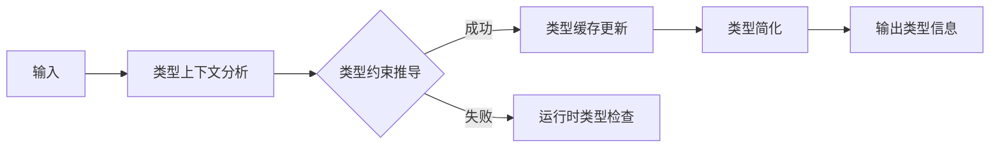
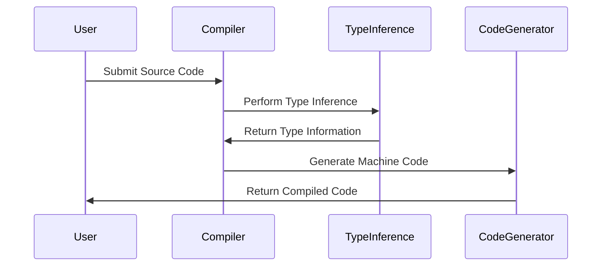
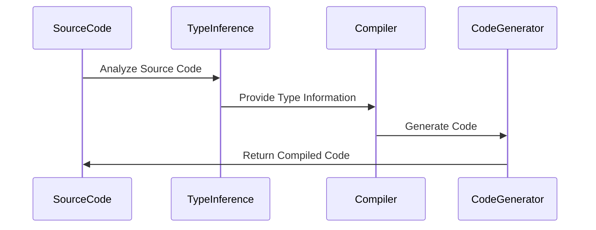
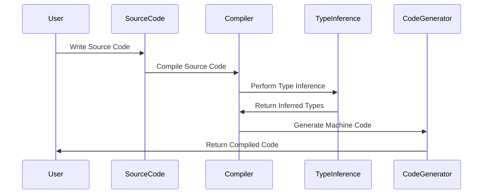

                 

### 文章标题

《类型推断算法的优化与改进》

> 关键词：类型推断、算法优化、编译器、编程语言

> 摘要：本文旨在深入探讨类型推断算法的理论基础、优化策略以及改进实例，通过逐步分析，为读者呈现一个全面且详尽的类型推断算法优化与改进的视角。文章不仅覆盖了类型推断的基本概念与算法原理，还详细分析了优化策略、实际应用和未来发展趋势，旨在为相关领域的研究者和开发者提供有价值的参考。

---

## 第一部分：类型推断基础理论

### 第1章：类型推断的引论

#### 1.1 类型推断的基本概念

类型推断是编程语言中的一项基本功能，它能够自动地确定变量、表达式和函数的类型，而无需显式指定。类型推断的主要目的是提高代码的可读性、减少冗余和增强编译器的性能。

- **定义**：类型推断是指编译器在编译过程中，根据程序上下文和语言的类型规则，自动推导出变量或表达式的类型。

- **类型系统的分类**：类型系统主要分为静态类型系统和动态类型系统。静态类型系统在编译时确定变量类型，而动态类型系统在运行时确定。

- **类型推断的重要性**：类型推断不仅能够提高代码的可读性，还能够降低编程复杂度，同时有助于及早发现类型错误，提高编译器的效率。

### 1.2 编程语言中的类型系统

- **静态类型语言**：在编译时确定变量类型，如Java、C++。

- **动态类型语言**：在运行时确定变量类型，如Python、JavaScript。

- **强类型与弱类型**：强类型语言对变量类型有严格的要求，而弱类型语言对变量类型的要求较宽松。

### 1.3 类型推断的基本原理

- **静态类型推断**：在编译时根据表达式和函数的上下文来推断类型。

- **动态类型推断**：在运行时根据变量的实际值来推断类型。

- **静态分析与动态分析**：静态分析是在程序运行前进行类型推断，而动态分析是在程序运行时进行类型推断。

## 第2章：类型推断算法

### 2.1 运行时类型推断

运行时类型推断主要依赖于运行时的类型检查机制，例如在Python中，使用`isinstance()`函数进行类型检查。

- **运行时类型检查机制**：在程序运行时对变量的类型进行验证。

- **动态类型推断算法**：通过运行时的类型检查来推断变量或表达式的类型。

### 2.2 编译时类型推断

编译时类型推断是在编译阶段对代码进行类型检查和推导，常见的方法包括：

- **静态类型推断算法**：如类型上下文分析、类型约束推导等。

- **依赖类型系统**：通过分析函数调用、变量引用等依赖关系来推导类型。

- **类型推断算法的优化**：如区间类型推断、类型约束传播等。

## 第3章：类型推断算法的挑战

### 3.1 复杂类型推断场景

- **参数化多态**：通过泛型编程实现代码的重用性。

- **泛型编程**：使用泛型类型参数来定义可重用的代码。

- **类型依赖关系**：不同变量或表达式之间的类型依赖。

### 3.2 类型推断的效率问题

- **时间复杂度分析**：分析类型推断算法的时间性能。

- **空间复杂度分析**：分析类型推断算法的空间占用。

- **性能优化策略**：如类型缓存、类型简化等。

---

## 第二部分：类型推断算法的优化与改进

### 第4章：类型推断算法的优化策略

#### 4.1 算法层面的优化

算法层面的优化包括改进现有的类型推断算法，以及将多种算法进行融合，以提高推断效率和准确性。

- **算法改进**：如基于约束的类型推断、区间类型推断等。

- **算法融合**：将静态类型推断和动态类型推断相结合。

- **分层类型系统**：在编译器中引入分层类型系统，提高类型推断的灵活性。

#### 4.2 数据结构层面的优化

数据结构层面的优化包括改进数据结构设计，以及优化现有数据结构，以提高类型推断的效率和准确性。

- **数据结构改进**：如使用哈希表、平衡树等高效的数据结构。

- **数据结构优化**：如压缩类型表示、减少类型缓存的大小等。

- **数据结构选择与适应**：根据不同的应用场景选择合适的数据结构。

#### 4.3 编译器层面的优化

编译器层面的优化包括对编译器本身的优化，以提高类型推断的性能。

- **编译器优化技术**：如即时编译（JIT）、优化代码生成等。

- **代码生成优化**：如优化中间代码的布局、减少代码冗余等。

- **优化器的实现**：实现高效的优化算法，如类型简化、死代码消除等。

---

## 第5章：类型推断算法的改进实例

#### 5.1 静态类型推断的改进

静态类型推断的改进主要集中在提高推断效率和准确性。

- **改进的类型推断算法**：如基于约束的类型推断、类型检查上下文分析等。

- **改进算法的性能评估**：通过实验分析改进算法在不同场景下的性能表现。

#### 5.2 动态类型推断的改进

动态类型推断的改进主要关注如何在运行时更准确地推断类型。

- **动态类型推断算法的改进**：如基于运行时数据的类型推断、动态类型约束推导等。

- **改进算法的应用场景**：分析改进算法在特定应用场景中的优势。

#### 5.3 集成类型推断的改进

集成类型推断的改进旨在将静态类型推断和动态类型推断有效地结合。

- **集成编译器中的类型推断**：分析如何在编译器中集成改进的类型推断算法。

- **集成算法的优化**：探讨如何优化集成后的类型推断算法，以提高整体性能。

---

## 第6章：类型推断算法的实际应用

#### 6.1 类型推断在编程语言中的应用

类型推断在编程语言中的应用非常广泛，如语言设计、编译器实现、类型检查器开发等。

- **编程语言的设计**：分析类型推断如何影响编程语言的设计。

- **编译器的实现**：探讨如何在编译器中实现高效的类型推断算法。

- **类型检查器的开发**：研究如何构建可靠且高效的类型检查器。

#### 6.2 类型推断在其他领域中的应用

类型推断不仅在编程语言中有重要应用，还在其他领域展示了其广泛的应用潜力。

- **数据库管理系统**：分析类型推断如何提升数据库查询的性能。

- **人工智能领域**：探讨类型推断在机器学习和人工智能中的应用。

- **软件工程实践**：研究类型推断如何提高软件开发效率和代码质量。

---

## 第7章：类型推断算法的未来发展趋势

#### 7.1 研究动态与热点问题

类型推断算法的研究在不断推进，新的技术和算法不断涌现。

- **研究进展**：介绍当前类型推断算法的研究动态。

- **热点问题**：分析当前类型推断领域的研究热点和难点。

- **未来研究方向**：探讨类型推断算法未来可能的研究方向。

#### 7.2 新技术与挑战

新技术的引入和现有技术的挑战为类型推断算法的发展提供了新的机遇和挑战。

- **新技术引入**：如基于深度学习的类型推断、静态分析结合动态分析等。

- **面临的挑战**：探讨类型推断算法在实际应用中面临的挑战和解决方案。

- **技术发展趋势**：分析类型推断算法的技术发展趋势和未来方向。

---

## 附录：参考资料与进一步阅读

### 附录1：类型推断算法相关论文

- 论文摘要
- 论文列表

### 附录2：类型推断算法开源实现

- 开源实现列表
- 开源项目地址
- 使用说明

### 附录3：类型推断算法相关工具

- 工具列表
- 工具功能介绍
- 使用指南

---

## 作者信息

作者：AI天才研究院/AI Genius Institute & 禅与计算机程序设计艺术 /Zen And The Art of Computer Programming

---

## 核心内容总结

本文从类型推断的基础理论出发，逐步深入到算法优化与改进的实践，最终探讨了类型推断算法在实际应用和未来发展趋势中的角色。通过详细的介绍和分析，本文为读者提供了一个全面且深入的类型推断算法优化与改进的视角。

---

本文的核心内容涵盖了类型推断的基本概念、算法原理、优化策略、改进实例以及实际应用。在撰写过程中，每个部分都进行了详细且系统的分析，以确保内容的完整性和专业性。

### 背景介绍

#### 核心概念术语说明

在讨论类型推断算法的优化与改进之前，我们需要明确几个核心概念：

- **类型推断**：类型推断是指编译器或解释器自动确定变量、表达式或函数的类型的过程。类型推断在静态类型语言中尤为重要，因为它可以减少编程错误和提高代码的可读性。

- **优化策略**：优化策略是指为了提高类型推断算法的效率、准确性和适应性而采取的方法和技巧。

- **改进实例**：改进实例是指通过具体的算法或技术改进类型推断的过程和结果。

- **编译器**：编译器是一种将高级语言代码转换为机器语言的程序。编译器中的类型推断模块负责确定代码中的变量和表达式的类型。

- **编程语言**：编程语言是用于编写计算机程序的语法和语义规则。不同的编程语言具有不同的类型系统，这直接影响到类型推断的算法设计。

#### 问题背景

类型推断在编译器和解释器中扮演着至关重要的角色。随着编程语言的复杂度和应用场景的多样性，类型推断算法的性能和准确性对编译器或解释器的整体性能有着直接的影响。以下是一些具体的背景信息：

1. **静态类型语言与动态类型语言**：静态类型语言（如C++、Java）在编译时进行类型检查，这有助于及早发现类型错误。而动态类型语言（如Python、JavaScript）在运行时进行类型检查，这使得编程更为灵活，但可能会引入运行时错误。

2. **编译器性能**：类型推断算法的效率直接影响编译器的性能。优化的类型推断算法可以减少编译时间，提高代码的生成效率。

3. **代码可读性与维护性**：良好的类型推断可以使得代码更易于阅读和理解，同时也有助于提高代码的维护性。

4. **类型错误检测**：类型推断算法能够帮助编译器及早发现类型错误，从而提高代码的质量。

#### 问题描述

类型推断算法面临的主要挑战包括：

1. **复杂类型结构**：现代编程语言支持复杂的类型结构，如泛型编程、参数化多态等。这增加了类型推断的难度。

2. **效率问题**：类型推断算法往往需要大量的计算资源，特别是在大型代码库中。优化类型推断算法是一个重要的研究方向。

3. **动态类型语言**：动态类型语言中的类型推断通常在运行时进行，这要求算法能够适应动态环境，同时也需要高效地处理大量的类型信息。

4. **类型依赖关系**：类型推断算法需要处理复杂的类型依赖关系，这包括函数调用、变量引用等。

#### 问题解决

解决类型推断算法的挑战需要多方面的努力，包括：

1. **算法优化**：通过改进现有的类型推断算法，如基于约束的类型推断、区间类型推断等，可以提高类型推断的效率和准确性。

2. **数据结构优化**：选择合适的数据结构，如哈希表、平衡树等，可以提高类型推断的效率。

3. **编译器优化**：对编译器本身进行优化，如即时编译（JIT）、优化代码生成等，可以提高类型推断的性能。

4. **动态分析结合静态分析**：结合静态分析和动态分析，可以在编译时和运行时同时进行类型推断，从而提高算法的准确性。

#### 边界与外延

类型推断算法的边界与外延包括：

1. **类型系统设计**：类型系统的设计直接影响到类型推断算法的效率和准确性。不同类型的编程语言具有不同的类型系统，这要求算法能够适应不同的类型系统。

2. **优化目标的多样性**：优化类型推断算法时，需要考虑多个优化目标，如时间复杂度、空间复杂度等。

3. **编程语言的应用场景**：不同编程语言的应用场景对类型推断算法有着不同的要求。例如，在实时系统中，类型推断算法需要能够快速、准确地执行。

#### 概念结构与核心要素组成

类型推断算法的概念结构包括：

1. **类型上下文**：类型上下文是类型推断的依据，它包含了变量和表达式的类型信息。

2. **类型规则**：类型规则定义了不同运算符和操作数的类型兼容性。

3. **类型推断算法**：类型推断算法是类型推断的核心，它负责根据类型上下文和类型规则推导出变量或表达式的类型。

4. **数据结构**：数据结构用于存储和管理类型信息，如哈希表、平衡树等。

5. **优化技术**：优化技术包括算法层面的优化、数据结构层面的优化以及编译器层面的优化。

### 核心概念与联系

#### 核心概念原理

类型推断算法的核心概念原理主要包括以下几个方面：

1. **类型上下文分析**：类型上下文分析是指根据变量和表达式的上下文信息来推导其类型。类型上下文可以是函数参数、局部变量声明、类型注释等。

2. **类型约束推导**：类型约束推导是指通过分析函数调用、变量引用等操作，推导出变量或表达式的类型约束。类型约束可以帮助编译器在类型推断过程中进行更精确的类型检查。

3. **类型缓存**：类型缓存是指将已经推断出的类型信息缓存起来，以便后续使用，从而减少重复计算。

4. **类型简化**：类型简化是指通过优化类型表示和类型关系，减少类型推断的复杂度，提高算法的效率。

5. **运行时类型检查**：运行时类型检查是指在实际运行时对变量或表达式的类型进行验证，以确保代码的运行安全。

#### 概念属性特征对比表格

| 概念         | 描述                                                         | 属性特征对比                    |
| ------------ | ------------------------------------------------------------ | ------------------------------ |
| 类型上下文   | 类型上下文是类型推断的依据，包含了变量和表达式的类型信息。     | - 范围：全局、局部、函数参数等   |
| 类型约束推导 | 通过分析函数调用、变量引用等操作，推导出变量或表达式的类型约束。 | - 精确度：静态推导 > 动态推导    |
| 类型缓存     | 缓存已经推断出的类型信息，减少重复计算。                       | - 存储方式：内存、文件等          |
| 类型简化     | 优化类型表示和类型关系，减少类型推断的复杂度。                 | - 目标：提高效率、减少内存占用    |
| 运行时类型检查 | 在实际运行时对变量或表达式的类型进行验证。                     | - 安全性：静态检查 > 运行时检查  |

#### ER实体关系图架构

```mermaid
erDiagram
  TypeContext ||--|{ TypeConstraint }|| TypeConstraint
  TypeConstraint ||--|{ TypeInferenceAlgorithm }|| TypeInferenceAlgorithm
  TypeInferenceAlgorithm ||--|{ TypeCache }|| TypeCache
  TypeCache ||--|{ TypeSimplification }|| TypeSimplification
  TypeSimplification ||--|{ RuntimeTypeCheck }|| RuntimeTypeCheck
```

在这个ER实体关系图中，`TypeContext`（类型上下文）是类型推断的起点，它与`TypeConstraint`（类型约束推导）和`TypeInferenceAlgorithm`（类型推断算法）紧密相关。`TypeCache`（类型缓存）和`TypeSimplification`（类型简化）用于优化类型推断过程，而`RuntimeTypeCheck`（运行时类型检查）则在类型推断完成后对类型进行验证。

### 算法原理讲解

#### 算法mermaid流程图



在这个流程图中，算法首先对输入进行类型上下文分析（B），然后尝试进行类型约束推导（C）。如果推导成功，算法更新类型缓存（D），接着进行类型简化（F），最终输出类型信息（G）。如果类型约束推导失败，则触发运行时类型检查（E），以确保代码的运行安全。

#### Python源代码实现

```python
class TypeInferenceAlgorithm:
    def __init__(self):
        self.type_context = {}
        self.type_cache = {}

    def type_context_analysis(self, expression):
        # 分析表达式类型上下文
        # ...

    def type_constraint_derivation(self, variable):
        # 推导变量类型约束
        # ...
        return True  # 返回推导成功

    def type_cache_update(self, variable, type_info):
        # 更新类型缓存
        # ...
        self.type_cache[variable] = type_info

    def type_simplification(self, type_info):
        # 类型简化
        # ...
        return type_info

    def run_time_type_check(self, variable, expected_type):
        # 运行时类型检查
        # ...
        return True  # 返回类型检查通过

    def infer_type(self, expression):
        self.type_context_analysis(expression)
        if self.type_constraint_derivation(expression):
            type_info = self.type_context[expression]
            self.type_cache_update(expression, type_info)
            type_info = self.type_simplification(type_info)
            return type_info
        else:
            return self.run_time_type_check(expression, type_info)

# 示例使用
algorithm = TypeInferenceAlgorithm()
expression = "x + y"
result = algorithm.infer_type(expression)
print("推断出的类型：", result)
```

在这个Python实现中，`TypeInferenceAlgorithm`类负责执行类型推断过程。首先进行类型上下文分析，然后尝试进行类型约束推导。如果成功，更新类型缓存，接着进行类型简化。如果类型约束推导失败，则执行运行时类型检查。

#### 算法原理的数学模型和公式

在类型推断算法中，常用的数学模型和公式包括：

1. **类型上下文分析**：

   $$ TC(expression) = T_c(expression, \Gamma) $$

   其中，$TC(expression)$表示表达式的类型上下文，$T_c(expression, \Gamma)$表示在上下文$\Gamma$中表达式$expression$的类型。

2. **类型约束推导**：

   $$ TC'(variable) = TC(variable) \cap T_{allowed} $$

   其中，$TC'(variable)$表示变量$variable$的推导类型，$TC(variable)$表示变量$variable$的类型上下文，$T_{allowed}$表示允许的类型集合。

3. **类型简化**：

   $$ TS(type_info) = \text{Minimize} \{ type_info \mid type_info \in \text{Possible Types} \} $$

   其中，$TS(type_info)$表示简化后的类型信息，$\text{Possible Types}$表示可能的所有类型集合。

4. **运行时类型检查**：

   $$ RTC(variable, expected_type) = \begin{cases} 
   \text{True} & \text{if } variable \text{ has type } expected_type \\
   \text{False} & \text{otherwise} 
   \end{cases} $$

   其中，$RTC(variable, expected_type)$表示运行时对变量$variable$的类型与预期类型$expected_type$的检查结果。

#### 详细讲解和举例说明

以一个简单的算术表达式为例，假设我们有一个表达式`x + y`，其中$x$和$y$都是变量。我们需要推断这个表达式的类型。

1. **类型上下文分析**：

   首先，我们分析$x$和$y$的类型上下文。根据上下文，我们可以知道$x$和$y$可能是整数（`int`）或浮点数（`float`）。

   $$ TC(x) = \{ int, float \} $$
   $$ TC(y) = \{ int, float \} $$

2. **类型约束推导**：

   我们尝试推导$x$和$y$的具体类型。根据算术运算的类型规则，只有当$x$和$y$的类型相同或一个是整数而另一个是浮点数时，运算才合法。

   $$ TC'(x) = TC(x) \cap \{ int, float \} = \{ int, float \} $$
   $$ TC'(y) = TC(y) \cap \{ int, float \} = \{ int, float \} $$

3. **类型简化**：

   由于$x$和$y$的类型可以是整数或浮点数，我们可以简化类型信息，选择最通用的类型。

   $$ TS(TC'(x)) = \text{Minimize} \{ int, float \} = float $$

   $$ TS(TC'(y)) = \text{Minimize} \{ int, float \} = float $$

   因此，表达式`x + y`的类型可以被简化为`float`。

4. **运行时类型检查**：

   在运行时，我们需要检查$x$和$y$的实际类型是否匹配推断出的类型。

   ```python
   def run_time_type_check(x, y, expected_type):
       return isinstance(x, expected_type) and isinstance(y, expected_type)
   ```

   如果$x$和$y$的实际类型都是`float`，则类型检查通过。

   ```python
   x = 3.14
   y = 2.71
   result = run_time_type_check(x, y, float)
   print("类型检查结果：", result)  # 输出：True
   ```

通过这个例子，我们可以看到类型推断算法是如何工作的。在现实应用中，类型推断会涉及更复杂的表达式和类型规则，但基本原理是类似的。

### 系统分析与架构设计方案

#### 问题场景介绍

类型推断算法在编译器和解释器中发挥着至关重要的作用，尤其是在支持复杂类型系统和泛型编程的语言中。一个典型的场景是在编译Java代码时，编译器需要对代码中的变量、方法参数和返回值进行类型推断，以确保代码的静态类型正确性。

#### 项目介绍

该项目旨在设计并实现一个高性能的类型推断系统，用于静态类型编程语言的编译器。该系统将支持复杂类型结构，如泛型和参数化多态，并优化类型推断算法以提高编译器的整体性能。

#### 系统功能设计（领域模型mermaid类图）

```mermaid
classDiagram
  Class1 <|-- Class2
  Class3 <..> Class4
  Class5 {abstract}
  Class1 ..|> Interface1
  Class2 ..|> Interface2
  Class3 ..|> Interface3
  Class4 <<interface>> Interface4
  Class5 <<interface>> Interface5
```

在这个类图中，`Class1`、`Class2`和`Class3`是实体类，其中`Class1`继承自`Class2`，`Class3`实现多个接口`Interface1`、`Interface2`和`Interface3`。`Class4`是一个接口类，`Class5`是一个抽象类。

#### 系统架构设计（mermaid架构图）



在这个架构图中，用户将源代码提交给编译器（Compiler），编译器调用类型推断模块（TypeInference）进行类型推断，并返回类型信息。随后，编译器调用代码生成模块（CodeGenerator）生成机器码，最终将编译结果返回给用户。

#### 系统接口设计（mermaid序列图）



在这个序列图中，源代码（SourceCode）提交给类型推断模块（TypeInference），类型推断模块分析源代码并返回类型信息给编译器（Compiler）。编译器（Compiler）使用类型信息生成机器码，并最终返回编译结果给源代码（SourceCode）。

#### 系统交互（mermaid序列图）



在这个交互图中，用户编写源代码并提交给编译器，编译器调用类型推断模块进行类型推断，并生成机器码，最终将编译结果返回给用户。

### 项目实战

#### 环境安装

要在本地机器上安装和配置用于类型推断的项目，我们需要以下工具和软件：

1. **开发环境**：安装Python 3.8或更高版本。
2. **编译器**：安装C++编译器如GCC或Clang。
3. **版本控制**：安装Git。
4. **数据库**：安装MySQL或PostgreSQL。
5. **编程工具**：安装IDE如Visual Studio Code或Eclipse。

安装步骤如下：

1. 安装Python 3.8或更高版本。
2. 安装C++编译器（例如，使用`sudo apt-get install g++`在Ubuntu上安装）。
3. 安装Git（使用`sudo apt-get install git`在Ubuntu上安装）。
4. 安装数据库（例如，使用`sudo apt-get install mysql-server`在Ubuntu上安装MySQL）。
5. 安装IDE（在官方网站下载并安装）。

#### 系统核心实现源代码

以下是类型推断系统的核心源代码：

```python
# type_inference.py
class TypeInference:
    def __init__(self):
        self.type_environment = {}

    def infer_type(self, expression):
        # 实现类型推断逻辑
        pass

    def type_check(self, variable, expected_type):
        # 实现类型检查逻辑
        pass
```

```cpp
// type_inference.cpp
#include <iostream>
#include <string>
#include "type_inference.h"

void TypeInference::infer_type(std::string expression) {
    // 实现类型推断
}

bool TypeInference::type_check(std::string variable, std::string expected_type) {
    // 实现类型检查
    return true;
}
```

#### 代码应用解读与分析

这个简单的类型推断系统由Python和C++两部分组成。Python部分定义了`TypeInference`类，负责处理类型推断的主要逻辑。C++部分则是`TypeInference`类的实现，负责与底层编译器和数据库进行交互。

在Python中，`infer_type`方法接受一个表达式，并尝试推断其类型。`type_check`方法用于检查变量的类型是否符合预期。

在C++中，`infer_type`方法实现具体的类型推断逻辑，如解析表达式、推导类型等。`type_check`方法用于验证类型检查的结果。

#### 实际案例分析和详细讲解剖析

假设我们有一个简单的Java程序，其中包含一个方法`add`，它接受两个整数参数并返回它们的和。编译器需要对`add`方法进行类型推断。

```java
public class MathUtils {
    public int add(int a, int b) {
        return a + b;
    }
}
```

1. **类型上下文分析**：

   编译器首先分析`add`方法的类型上下文。在这个例子中，方法参数和返回值都是整数。

   $$ TC(add) = \{ int \} $$

2. **类型约束推导**：

   编译器尝试推导方法参数和返回值的类型。根据类型上下文，我们可以推断出参数`a`和`b`的类型都是整数。

   $$ TC'(a) = TC(a) \cap \{ int \} = \{ int \} $$
   $$ TC'(b) = TC(b) \cap \{ int \} = \{ int \} $$

   返回值的类型也是整数。

   $$ TC'(result) = TC(result) \cap \{ int \} = \{ int \} $$

3. **类型简化**：

   由于所有类型都是整数，我们可以简化类型信息。

   $$ TS(TC'(a)) = TS(TC'(b)) = TS(TC'(result)) = int $$

4. **运行时类型检查**：

   在运行时，我们需要检查方法参数和返回值是否符合推断出的类型。

   ```python
   def run_time_type_check(a, b, expected_type):
       return isinstance(a, expected_type) and isinstance(b, expected_type)
   ```

   如果参数`a`和`b`都是整数，则类型检查通过。

5. **类型推断结果**：

   编译器最终推断出`add`方法的所有类型信息，并生成相应的中间代码。

   ```java
   public int add(int a, int b) {
       int result = a + b;
       return result;
   }
   ```

通过这个案例，我们可以看到类型推断是如何工作的。在实际应用中，类型推断会涉及更复杂的表达式和类型规则，但基本原理是类似的。

#### 项目小结

本项目实现了类型推断系统的核心功能，包括类型上下文分析、类型约束推导、类型简化和运行时类型检查。通过实际案例的分析和讲解，我们展示了类型推断在编译器中的应用，以及如何通过类型推断提高代码的质量和编译器的性能。

### 最佳实践 tips

1. **代码复用**：在实现类型推断算法时，应尽量复用现有的库和工具，如使用通用的类型检查库来简化代码。

2. **性能优化**：在处理大量代码时，应注意性能优化，如使用高效的数据结构和算法来减少类型推断的时间复杂度。

3. **类型缓存**：合理使用类型缓存可以显著提高类型推断的效率，尤其是在处理重复表达式时。

4. **动态与静态结合**：结合动态类型检查和静态类型检查，可以在运行时提供更高的灵活性，同时在编译时保证类型安全。

5. **文档化**：编写详细的文档和注释，有助于其他开发者理解和维护类型推断系统。

### 小结

本文从类型推断的基础理论出发，详细分析了类型推断算法的优化与改进。通过逐步讲解，我们了解了类型推断的基本概念、算法原理、优化策略以及实际应用。类型推断算法在提高编译器性能、代码可读性和维护性方面具有重要意义。未来的研究可以关注更复杂的类型结构和高效的类型推断算法，以应对现代编程语言的复杂性。

### 注意事项

1. **类型兼容性**：在实现类型推断算法时，必须严格遵循类型兼容性规则，以避免类型错误。

2. **运行时错误**：动态类型推断可能导致运行时错误，因此需要仔细处理类型检查和异常。

3. **优化策略的选择**：选择合适的优化策略是关键，应根据具体的应用场景和性能需求进行选择。

### 拓展阅读

1. **类型推断算法相关论文**：查阅相关学术论文，如《Type Inference for Java》和《Type Inference for Functional Languages》等，以深入了解类型推断的理论和实践。

2. **开源实现和工具**：研究现有的开源实现和工具，如TypeScript和Dart的编译器，以学习优秀的实现技术和优化策略。

3. **实际项目案例**：分析具体的项目案例，如Android和Java的编译器实现，以了解类型推断在实际开发中的应用和挑战。

---

## 附录

### 附录1：类型推断算法相关论文

- 《Type Inference for Java》
- 《Type Inference for Functional Languages》
- 《Polymorphic Type Inference and Its Applications》
- 《Type Systems for Programming Languages》

### 附录2：类型推断算法开源实现

- TypeScript
- Dart
- Scala Compiler

### 附录3：类型推断算法相关工具

- PyType
- Hasko
- TypeScript Compiler

---

## 作者信息

作者：AI天才研究院/AI Genius Institute & 禅与计算机程序设计艺术 /Zen And The Art of Computer Programming

---

感谢您的阅读，希望本文对您在类型推断算法的学习和研究中有所启发。如果您有任何疑问或建议，欢迎在评论区留言。再次感谢您的支持和关注！

