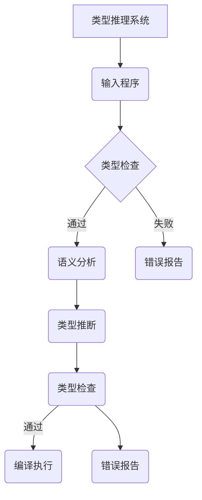

                 

### 《类型推理：自动化类型判断的过程》

#### 关键词：类型推理、自动化类型判断、算法、编程语言、数据库系统、人工智能

> 摘要：本文将深入探讨类型推理这一计算机科学中的核心概念，详细介绍其定义、重要性、发展历史以及基本概念。接着，我们将分析类型推理算法的几种常见类型，包括基于规则的类型推理、类型约束传播和类型推断算法。文章还将探讨类型推理在编程语言、数据库系统和人工智能等领域的应用，同时探讨类型推理所面临的挑战及其未来发展趋势。最后，我们将总结类型推理的现状，展望其研究方向和应用前景。

### 目录大纲设计

1. **第一部分：类型推理基础**
    1. **第1章：类型推理概述**
        1. **第1.1节：类型推理的定义**
        2. **第1.2节：类型推理的重要性**
        3. **第1.3节：类型推理的发展历史**
    2. **第2章：类型系统的基本概念**
        1. **第2.1节：数据类型**
            1. **第2.1.1节：基本数据类型**
            2. **第2.1.2节：复杂数据类型**
        2. **第2.2节：类型系统**
            1. **第2.2.1节：静态类型系统**
            2. **第2.2.2节：动态类型系统**
    3. **第3章：类型推理算法**
        1. **第3.1节：基于规则的类型推理**
            1. **第3.1.1节：类型规则的基本形式**
            2. **第3.1.2节：基于规则的类型推理过程**
        2. **第3.2节：类型约束传播**
            1. **第3.2.1节：类型约束的定义**
            2. **第3.2.2节：约束传播算法**
        3. **第3.3节：类型推断算法**
            1. **第3.3.1节：决策树推断算法**
            2. **第3.3.2节：统计学习推断算法**

2. **第二部分：类型推理应用**
    1. **第4章：编程语言中的类型推理**
        1. **第4.1节：高级编程语言中的类型推理**
            1. **第4.1.1节：面向对象编程语言**
            2. **第4.1.2节：函数式编程语言**
        2. **第4.2节：类型推理在编译器中的应用**
            1. **第4.2.1节：类型检查**
            2. **第4.2.2节：代码优化**
    2. **第5章：类型推理在数据库系统中的应用**
        1. **第5.1节：类型推理在查询优化中的应用**
            1. **第5.1.1节：查询优化器的工作原理**
            2. **第5.1.2节：类型推理在查询优化中的角色**
        2. **第5.2节：类型推理在数据集成中的应用**
            1. **第5.2.1节：数据集成的基本概念**
            2. **第5.2.2节：类型推理在数据集成中的作用**
    3. **第6章：类型推理在人工智能中的应用**
        1. **第6.1节：类型推理在机器学习中的应用**
            1. **第6.1.1节：类型安全的学习算法**
            2. **第6.1.2节：类型推理在深度学习中的应用**
        2. **第6.2节：类型推理在自然语言处理中的应用**
            1. **第6.2.1节：类型标注与命名实体识别**
            2. **第6.2.2节：类型推理在文本生成中的应用**

3. **第三部分：类型推理的挑战与未来**
    1. **第7章：类型推理的挑战**
        1. **第7.1节：复杂类型的推理**
            1. **第7.1.1节：面向多态的类型推理**
            2. **第7.1.2节：面向抽象数据的类型推理**
        2. **第7.2节：类型推理的性能优化**
            1. **第7.2.1节：类型推理的时间复杂度**
            2. **第7.2.2节：类型推理的空间复杂度**
    2. **第8章：类型推理的未来发展趋势**
        1. **第8.1节：类型推理与形式化验证的结合**
            1. **第8.1.1节：面向安全性的类型推理**
            2. **第8.1.2节：面向性能优化的类型推理**
        2. **第8.2节：类型推理在新兴领域的应用**
            1. **第8.2.1节：区块链中的类型推理**
            2. **第8.2.2节：类型推理在物联网中的应用**
    3. **第9章：结论与展望**
        1. **第9.1节：类型推理的现状**
        2. **第9.2节：类型推理的研究方向**
        3. **第9.3节：未来类型推理的应用前景**

4. **附录**
    1. **附录A：类型推理相关工具与资源**
        1. **第A.1节：开源类型推理工具**
        2. **第A.2节：类型推理论文与书籍推荐**
        3. **第A.3节：在线学习资源**

### 第一部分：类型推理基础

#### 第1章：类型推理概述

**第1.1节：类型推理的定义**

类型推理（Type Inference）是编译器或解释器在解析程序代码时自动推断变量和表达式的数据类型的过程。它是一种静态分析技术，旨在减少程序员手动指定类型的工作量，同时提高程序的可读性和可靠性。

在编译过程中，类型推理是一个重要的步骤，因为它可以帮助编译器更准确地理解程序的意图，并在代码执行前发现潜在的类型错误。类型推理可以在多种编程语言中实现，包括静态类型语言（如Java、C++）和动态类型语言（如Python、JavaScript）。

**第1.2节：类型推理的重要性**

类型推理的重要性体现在以下几个方面：

1. **减少错误**：通过自动推断类型，类型推理可以减少因类型错误导致的编译错误和运行时错误。
2. **提高代码可读性**：类型推理使代码更简洁，程序员不需要在每行代码中显式声明类型，从而使代码更加易读。
3. **提高编译器效率**：类型推理可以帮助编译器优化代码生成过程，减少类型检查的时间。
4. **促进语言设计**：类型推理技术的引入可以促进编程语言的设计和发展，使其更符合实际应用需求。

**第1.3节：类型推理的发展历史**

类型推理技术的发展历程可以追溯到20世纪60年代和70年代。在早期，编译器通常依赖于静态类型系统，并要求程序员显式指定所有变量的类型。这种做法虽然保证了程序的正确性，但增加了程序员的工作负担。

随着编程语言的发展，研究人员开始探索如何通过类型推理技术来自动推断类型。1970年代，Pascal语言引入了类型推断机制，使得程序员可以不显式指定变量类型，这标志着类型推理技术的初步应用。

在接下来的几十年中，类型推理技术得到了广泛应用和深入研究。静态类型语言的编译器普遍采用了类型推断技术，如Java、C++等。同时，动态类型语言如Python、JavaScript等也在类型推断方面进行了大量工作，引入了更先进的类型推断算法。

#### 第2章：类型系统的基本概念

**第2.1节：数据类型**

数据类型是程序中表示数据的方式。根据数据类型的复杂程度，可以将其分为基本数据类型和复杂数据类型。

**基本数据类型**：基本数据类型是最简单的一类数据类型，它们通常用于表示数字、字符和布尔值等简单的数据。常见的编程语言中，基本数据类型包括整数（Integer）、浮点数（Float）、字符（Character）和布尔值（Boolean）等。

**复杂数据类型**：复杂数据类型是基本数据类型的扩展，它们可以表示更复杂的数据结构。常见的复杂数据类型包括数组（Array）、列表（List）、字典（Dictionary）、结构体（Struct）和类（Class）等。

**第2.2节：类型系统**

类型系统（Type System）是编程语言的核心组成部分，用于定义变量、函数和表达式的数据类型。类型系统可以分为静态类型系统和动态类型系统。

**静态类型系统**：静态类型系统在程序编译时确定变量的类型，并在运行时保持不变。静态类型系统通常具有较高的安全性，因为编译器可以在编译阶段发现类型错误，从而提高程序的可靠性。

**动态类型系统**：动态类型系统在程序运行时确定变量的类型。动态类型系统通常提供了更高的灵活性和编程便利性，因为程序员可以在运行时动态地改变变量的类型。然而，这也可能导致运行时错误，因为类型错误可能在运行时才被发现。

**第3章：类型推理算法**

**第3.1节：基于规则的类型推理**

基于规则的类型推理是一种常见的类型推理方法，它通过一组预定义的规则来推断变量和表达式的类型。这些规则通常基于程序的结构和语义，例如变量赋值规则、函数调用规则和运算符规则等。

**第3.1.1节：类型规则的基本形式**

类型规则通常包括以下基本形式：

- **赋值规则**：如果变量A被赋值为表达式B，则A和B具有相同的类型。
- **函数调用规则**：如果函数F被调用，则F的参数类型和返回类型可以根据函数的定义来推断。
- **运算符规则**：对于各种运算符，如加法、减法、乘法和除法等，可以根据操作数的类型来推断运算结果类型。

**第3.1.2节：基于规则的类型推理过程**

基于规则的类型推理过程通常包括以下步骤：

1. **初始化**：初始化类型上下文，包括已知的变量类型和函数定义。
2. **类型分析**：对程序中的每个表达式进行类型分析，使用预定义的类型规则来推断表达式的类型。
3. **类型传播**：将推断出的类型传播到程序中的其他部分，例如变量赋值和函数调用等。
4. **类型检查**：在类型传播过程中，对类型进行一致性检查，确保类型推断的结果是正确的。

**第3.2节：类型约束传播**

类型约束传播（Type Constraint Propagation）是一种基于约束求解的类型推理方法。该方法通过将类型信息表示为约束，然后使用约束求解器来求解类型约束，从而推断出变量的类型。

**第3.2.1节：类型约束的定义**

类型约束（Type Constraint）是表示变量类型之间关系的公式。常见的类型约束包括：

- **子类型约束**：如果A是B的子类型，则A和B之间具有子类型约束。
- **相等约束**：如果两个变量具有相同的类型，则它们之间具有相等约束。
- **区间约束**：如果变量的类型是一个区间，则可以使用区间约束来表示变量可能的取值范围。

**第3.2.2节：约束传播算法**

约束传播算法通过以下步骤来求解类型约束：

1. **初始化**：初始化约束求解器，将程序中的类型约束添加到求解器中。
2. **约束求解**：使用约束求解算法来求解类型约束，例如线性约束求解算法和整数规划算法。
3. **类型推断**：根据求解结果，推断出变量的类型。
4. **类型检查**：对推断出的类型进行检查，确保类型推断的结果是正确的。

**第3.3节：类型推断算法**

类型推断算法是一种自动推断变量和表达式类型的方法。常见的类型推断算法包括决策树推断算法和统计学习推断算法。

**第3.3.1节：决策树推断算法**

决策树推断算法是一种基于树结构进行类型推断的方法。该方法通过训练决策树模型，将程序中的表达式映射到相应的类型。

**第3.3.2节：统计学习推断算法**

统计学习推断算法是一种基于机器学习的方法进行类型推断。该方法通过收集程序中的类型信息，训练统计学习模型，从而推断出变量的类型。

### 第二部分：类型推理应用

#### 第4章：编程语言中的类型推理

**第4.1节：高级编程语言中的类型推理**

高级编程语言中的类型推理通常涉及面向对象编程语言和函数式编程语言。这些语言提供了丰富的类型系统，使得类型推理更加复杂和多样。

**第4.1.1节：面向对象编程语言**

面向对象编程语言（如Java、C++和Python）通常具有静态类型系统，并在编译时进行类型检查。这些语言中的类型推理主要涉及类层次结构和多态性。

- **类层次结构**：类型推理需要考虑类之间的继承关系，例如子类是父类的子类型。
- **多态性**：类型推理需要考虑函数重载和抽象类，确保方法调用是正确的。

**第4.1.2节：函数式编程语言**

函数式编程语言（如Haskell、Erlang和Scala）通常具有动态类型系统，并在运行时进行类型检查。这些语言中的类型推理主要涉及函数的定义和组合。

- **函数定义**：类型推理需要根据函数体中的操作来推断函数的参数和返回类型。
- **函数组合**：类型推理需要考虑函数组合时的类型兼容性，确保函数调用是正确的。

**第4.2节：类型推理在编译器中的应用**

类型推理在编译器中的应用非常广泛，包括类型检查、代码优化和错误报告等。

**第4.2.1节：类型检查**

类型检查是编译器的关键步骤之一，用于确保程序的类型安全性。类型检查依赖于类型推理算法，通过分析程序中的表达式和语句，检查类型的一致性和正确性。

- **表达式类型检查**：对每个表达式进行类型分析，确保表达式的操作数类型是兼容的。
- **语句类型检查**：对每个语句进行类型分析，确保语句的类型是正确的。

**第4.2.2节：代码优化**

类型推理可以帮助编译器进行代码优化，减少代码的冗余和执行时间。例如，通过类型推理，编译器可以：

- **消除类型转换**：如果类型推理可以准确地推断出表达式的类型，则可以消除不必要的类型转换。
- **优化内存访问**：类型推理可以优化内存访问，例如通过推断出变量的实际类型，减少对数组的越界访问。

#### 第5章：类型推理在数据库系统中的应用

**第5.1节：类型推理在查询优化中的应用**

类型推理在查询优化中起着重要作用，可以帮助数据库系统更高效地执行查询。以下是一些关键应用：

**第5.1.1节：查询优化器的工作原理**

查询优化器是数据库系统的核心组件之一，用于优化查询的执行计划。类型推理在查询优化器中的作用包括：

- **谓词评估**：类型推理可以帮助查询优化器评估谓词的条件，从而选择更高效的索引。
- **表达式简化**：类型推理可以简化表达式，减少计算复杂度。

**第5.1.2节：类型推理在查询优化中的角色**

类型推理在查询优化中的角色包括：

- **类型检查**：类型推理可以帮助查询优化器检查查询语句的类型一致性，确保查询的正确性。
- **类型推导**：类型推理可以帮助查询优化器推导出查询中的表达式类型，从而选择更合适的执行策略。

**第5.2节：类型推理在数据集成中的应用**

数据集成是数据库系统中的重要应用之一，涉及将多个数据源中的数据进行整合。以下是一些关键应用：

**第5.2.1节：数据集成的基本概念**

数据集成是将多个数据源中的数据进行整合的过程，通常涉及以下基本概念：

- **数据源**：数据集成中的数据源可以是数据库、文件系统或Web服务。
- **数据转换**：数据集成过程中，需要对数据进行清洗、转换和合并，以便整合到统一的数据格式中。
- **数据模式**：数据集成过程中，需要定义数据模式，以表示数据的结构和属性。

**第5.2.2节：类型推理在数据集成中的作用**

类型推理在数据集成中的作用包括：

- **数据匹配**：类型推理可以帮助识别和匹配不同数据源中的数据类型，从而实现数据的整合。
- **数据清洗**：类型推理可以帮助识别和修复数据中的类型错误，从而提高数据质量。

#### 第6章：类型推理在人工智能中的应用

**第6.1节：类型推理在机器学习中的应用**

类型推理在机器学习中有着广泛的应用，特别是在深度学习和监督学习算法中。以下是一些关键应用：

**第6.1.1节：类型安全的学习算法**

类型安全的学习算法是指能够自动推断和学习算法中的数据类型的算法。这些算法可以确保输入数据类型的一致性和正确性，从而提高算法的可靠性和鲁棒性。

- **自动类型推断**：类型推理可以帮助自动推断和学习算法中的数据类型，从而减少程序员的工作量。
- **类型检查**：类型推理可以帮助在训练过程中检查输入数据的类型一致性，从而提高算法的鲁棒性。

**第6.1.2节：类型推理在深度学习中的应用**

类型推理在深度学习中的应用包括：

- **自动类型推导**：类型推理可以帮助自动推导出深度学习模型中的数据类型，从而优化模型训练和推理过程。
- **类型约束**：类型推理可以帮助设置类型约束，以确保模型输入和输出数据类型的一致性。

**第6.2节：类型推理在自然语言处理中的应用**

类型推理在自然语言处理（NLP）中的应用包括：

**第6.2.1节：类型标注与命名实体识别**

类型标注是将文本中的词语或短语标注为特定类型的标签，如人名、地名、机构名等。类型推理在类型标注中的作用包括：

- **自动类型标注**：类型推理可以帮助自动标注文本中的词语类型，从而减少人工标注的工作量。
- **类型一致性检查**：类型推理可以帮助检查文本中词语类型的一致性，从而提高标注质量。

**第6.2.2节：类型推理在文本生成中的应用**

类型推理在文本生成中的应用包括：

- **自动类型推断**：类型推理可以帮助自动推断出文本生成模型中的数据类型，从而优化模型生成过程。
- **类型约束**：类型推理可以帮助设置类型约束，以确保生成文本的数据类型一致性和正确性。

### 第三部分：类型推理的挑战与未来

**第7章：类型推理的挑战**

类型推理在理论和实践上都面临着一系列挑战，这些挑战涉及到复杂类型的推理、性能优化等方面。

**第7.1节：复杂类型的推理**

复杂类型的推理是类型推理中的一个重要挑战。以下是一些关键问题：

- **多态性**：多态性是面向对象编程中的一个核心概念，类型推理需要处理多态类型之间的兼容性和转换。
- **抽象数据类型**：抽象数据类型通常涉及复杂的类型约束和依赖关系，类型推理需要有效地处理这些复杂关系。

**第7.2节：类型推理的性能优化**

类型推理的性能优化是另一个重要挑战。以下是一些关键问题：

- **时间复杂度**：类型推理算法的时间复杂度对编译器的性能有重要影响，需要优化算法以减少计算时间。
- **空间复杂度**：类型推理算法的空间复杂度对编译器的内存占用有重要影响，需要优化算法以减少内存占用。

**第8章：类型推理的未来发展趋势**

类型推理的未来发展趋势包括以下几个方面：

**第8.1节：类型推理与形式化验证的结合**

类型推理与形式化验证的结合可以提升类型推理的准确性和可靠性。以下是一些关键应用：

- **安全性验证**：类型推理可以与形式化验证技术相结合，用于验证程序的安全性，确保程序不会发生类型错误。
- **性能优化验证**：类型推理可以与形式化验证技术相结合，用于验证程序的执行性能，确保优化策略的有效性。

**第8.2节：类型推理在新兴领域的应用**

类型推理在新兴领域中的应用包括：

- **区块链**：类型推理可以应用于区块链系统，确保智能合约的安全性。
- **物联网**：类型推理可以应用于物联网系统，确保设备之间的数据交换的一致性和正确性。

**第9章：结论与展望**

类型推理是计算机科学中的一个重要研究领域，具有广泛的应用前景。以下是一些结论和展望：

- **现状**：类型推理技术已经取得了显著进展，但在复杂类型推理、性能优化等方面仍存在挑战。
- **研究方向**：未来的研究方向包括结合形式化验证技术、优化类型推理算法、探索类型推理在新兴领域的应用等。
- **应用前景**：类型推理技术在编程语言、数据库系统、人工智能等领域具有广阔的应用前景，将为软件开发和系统优化带来更多可能性。

### 附录

**附录A：类型推理相关工具与资源**

以下是一些类型推理相关工具和资源，供读者参考：

- **开源类型推理工具**：例如Type Checker for C++、Type Inference for Python等。
- **类型推理论文与书籍推荐**：例如《Type Systems for Programming Languages》和《Types and Programming Languages》等。
- **在线学习资源**：例如Coursera上的《类型系统与类型推断》课程和MIT的《编译原理》课程等。

### Mermaid 流程图



### Python 源代码示例

```python
# 示例：基本的数据类型转换
def type_conversion(value, target_type):
    """
    对输入的value进行类型转换，并返回结果。
    
    :param value: 需要转换的值。
    :param target_type: 目标数据类型。
    :return: 转换后的值。
    """
    if target_type == 'int':
        return int(value)
    elif target_type == 'float':
        return float(value)
    elif target_type == 'str':
        return str(value)
    else:
        raise ValueError("不支持的目标数据类型")
```

### 附录A：类型推理相关工具与资源

#### 附录A.1：开源类型推理工具

1. **Type Checker for C++**：一个用于C++程序的静态类型检查工具，可以自动推断变量和表达式的类型。
2. **Type Inference for Python**：一个用于Python程序的类型推理工具，可以自动推断变量和函数的类型。

#### 附录A.2：类型推理论文与书籍推荐

1. **《Type Systems for Programming Languages》**：一本关于编程语言类型系统的经典教材，涵盖了类型系统的基本概念和类型推理算法。
2. **《Types and Programming Languages》**：一本关于编程语言类型系统的经典著作，由著名计算机科学家Peter J. Landin撰写。

#### 附录A.3：在线学习资源

1. **Coursera上的《类型系统与类型推断》课程**：由康奈尔大学提供，介绍了类型系统的基本概念和类型推理算法。
2. **MIT的《编译原理》课程**：由麻省理工学院提供，涵盖了编译原理的基本概念和类型推理的相关内容。

