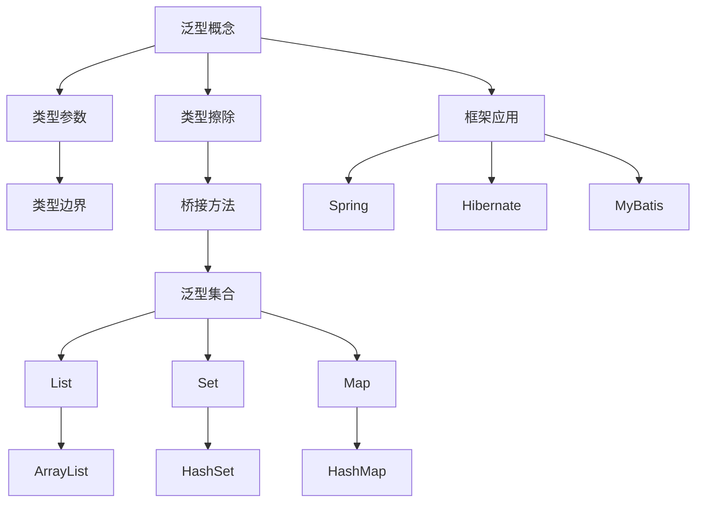

                 

# 《类型擦除与桥接方法：Java泛型的内部机制》

## 关键词

- Java 泛型
- 类型擦除
- 桥接方法
- 类型参数
- 类型边界
- 集合框架
- 泛型通配符
- 泛型继承
- 泛型反射
- 性能优化

## 摘要

本文将深入探讨Java泛型的内部机制，包括类型擦除与桥接方法。我们将首先介绍Java泛型的基础概念，然后详细解析类型擦除的原理及其对Java程序的影响。接着，我们将探讨桥接方法的作用和实现方式。随后，我们将深入解析泛型集合框架、泛型通配符、泛型与继承以及泛型与反射。文章的最后，我们将通过一个实际项目实战，展示如何应用Java泛型，并进行性能优化，并提供一些使用Java泛型的最佳实践和建议。

### 第一部分：Java泛型的基本概念

#### 第1章：Java泛型简介

**1.1 泛型的概念与作用**

Java泛型是一种支持在编译时进行类型检查的机制，它允许在定义类、接口和方法时使用类型参数。这些类型参数可以在类、方法或接口中作为参数传递，从而实现代码的泛化。

**1.2 泛型的类型参数**

在Java中，类型参数通常使用尖括号`<>`括起来，例如`List<String>`。类型参数可以在类、接口和方法中定义，用于指定泛化类型。

**1.3 泛型的类型边界**

类型边界是一种限制类型参数的机制，它允许指定泛化类型的上限或下限。类型边界通过使用`extends`或`super`关键字来实现，例如`List<? extends Number>`或`Map<? super String, ? extends Number>`。

#### 第2章：类型擦除机制

**2.1 类型擦除的概念**

类型擦除是Java泛型实现的关键机制之一。在编译时，Java编译器会将泛型表达式中的类型参数替换为它们的实际类型，这个过程中类型参数被“擦除”。

**2.2 类型擦除的实现**

在Java中，类型擦除是通过泛型集合框架来实现的。例如，`List<String>`在类型擦除后变为`List`。

**2.3 类型擦除的影响**

类型擦除使得Java泛型在运行时失去了类型信息，这可能带来一些潜在问题，如类型安全问题。

#### 第3章：桥接方法

**3.1 桥接方法的定义**

桥接方法是在Java泛型类型擦除过程中引入的一种特殊方法，它主要用于解决类型擦除带来的类型安全问题。

**3.2 桥接方法的实现**

桥接方法通常是在编译时由Java编译器自动生成的，它们实现了泛型类型之间的兼容性。

**3.3 桥接方法的作用**

桥接方法的作用是在类型擦除后，提供一种机制来确保不同泛型类型之间的兼容性和类型安全。

### 第二部分：Java泛型深入解析

#### 第4章：泛型集合框架

**4.1 集合框架概述**

Java集合框架是Java标准库中用于处理集合数据结构的一部分，它包括List、Set、Map等接口和实现类。

**4.2 Collection接口与Map接口**

Collection接口是Java集合框架的基础接口，它定义了集合的基本操作。Map接口则用于处理键值对。

**4.3 List、Set、Map的实现类**

Java提供了多种实现类来满足不同的集合需求，如ArrayList、LinkedList、HashSet、TreeSet、HashMap、LinkedHashMap等。

#### 第5章：泛型通配符

**5.1 通配符的概念**

泛型通配符是一种特殊类型的类型参数，它用于表示未知或任意类型。

**5.2 通配符的使用**

通配符可以用于指定泛型类型的上限或下限，或者表示泛型类型的通配符参数。

**5.3 通配符的注意事项**

使用通配符时需要小心处理，以避免类型安全问题。

#### 第6章：泛型与继承

**6.1 泛型类与继承**

泛型类可以像普通类一样进行继承，但需要注意类型参数的限制。

**6.2 泛型接口与继承**

泛型接口与泛型类的继承机制类似，也需要注意类型参数的限制。

**6.3 泛型方法与继承**

泛型方法可以与泛型类和泛型接口一起使用，实现更灵活的代码泛化。

#### 第7章：泛型与反射

**7.1 反射的基本概念**

反射是Java中一种强大的机制，它允许在运行时动态地分析、修改和创建类和对象。

**7.2 泛型与反射的结合**

泛型与反射的结合可以实现更灵活的代码操作，但需要注意类型安全。

**7.3 反射在泛型中的应用**

反射在泛型中的应用包括获取泛型类型信息、修改泛型对象等。

### 第三部分：Java泛型实战

#### 第8章：泛型在框架中的应用

**8.1 Spring框架中的泛型**

Spring框架广泛使用了Java泛型，提供了许多泛型接口和实现类。

**8.2 Hibernate框架中的泛型**

Hibernate框架利用Java泛型实现了强大的ORM功能。

**8.3 MyBatis框架中的泛型**

MyBatis框架通过泛型实现了动态SQL映射。

#### 第9章：泛型项目实战

**9.1 项目概述**

本节将介绍一个基于Java泛型的日志处理项目。

**9.2 项目需求分析**

项目需求包括日志数据的格式统一、分类处理和存储。

**9.3 项目设计与实现**

项目设计包括日志类、日志处理接口、日志处理类和日志存储类。

#### 第10章：泛型性能优化

**10.1 泛型性能问题**

泛型可能导致性能问题，如类型擦除后的类型安全检查。

**10.2 泛型性能优化策略**

优化策略包括使用通配符、减少类型擦除的影响等。

**10.3 性能测试与对比**

通过性能测试对比不同优化策略的效果。

#### 第11章：Java泛型总结与展望

**11.1 Java泛型的总结**

总结Java泛型的主要概念和应用。

**11.2 Java泛型的未来发展趋势**

展望Java泛型的未来发展和应用。

**11.3 Java泛型的使用建议**

提供Java泛型使用的最佳实践和建议。

### 附录

**附录A：Java泛型常用类和方法**

列出Java泛型常用的类和方法。

**附录B：Java泛型相关资源**

提供Java泛型学习资源。

---

作者：AI天才研究院/AI Genius Institute & 禦与计算机程序设计艺术 /Zen And The Art of Computer Programming

### 第一部分：Java泛型的基本概念

### 第1章：Java泛型简介

**1.1 泛型的概念与作用**

Java泛型是一种允许在代码中处理不特定类型的机制。它不仅提供了编译时的类型安全检查，还能减少代码的冗余，提高代码的可读性和可维护性。泛型通过类型参数（Type Parameters）来实现，这些类型参数在编译时会被替换成具体的类型。

例如，在Java中，`List`接口是一个泛型接口，它可以处理不同类型的对象。如果我们创建一个`List<String>`，那么这个列表就只包含字符串类型的对象。同样，我们可以创建一个`List<Integer>`，这个列表就只包含整型对象。这样，我们就可以编写一次代码，然后多次使用，而不必为每个类型重复编写代码。

**1.2 泛型的类型参数**

在Java中，泛型的类型参数通过尖括号`<>`来定义。类型参数可以是一个简单的类名，例如`T`、`E`等，也可以是一个带有通配符的边界限定。例如：

- `List<T>`：`T`是一个类型参数。
- `List<? extends Number>`：`? extends Number`表示类型参数的上界，即任何继承了`Number`类的类型。

类型参数在类、接口和方法中使用，用于指定泛化的类型。例如，`List`接口可以表示任何类型的列表：

```java
List<String> stringList = new ArrayList<>();
List<Integer> integerList = new ArrayList<>();
```

在上面的例子中，`String`和`Integer`都是类型参数`T`的具体化。

**1.3 泛型的类型边界**

类型边界是泛型类型参数的一种限制，它确保了泛化类型的类型安全。类型边界通过`extends`和`super`关键字来定义。

- `extends`：用于指定类型参数的上界。例如，`List<? extends Number>`表示类型参数可以是`Number`及其任何子类。
- `super`：用于指定类型参数的下界。例如，`List<? super Number>`表示类型参数可以是`Number`及其任何超类。

类型边界可以帮助我们确保泛化类型的使用是类型安全的。例如，如果我们有一个方法接受一个`List<? extends Number>`，那么我们可以安全地假设列表中的元素都是`Number`或其子类的实例。

**总结**

Java泛型通过类型参数实现代码的泛化，提供了编译时的类型安全检查。类型参数可以是一个简单的类名或带有边界限定的通配符。类型边界进一步确保了泛化类型的类型安全。通过泛型，我们可以编写更灵活、可重用的代码，同时保证类型安全。

### 第2章：类型擦除机制

**2.1 类型擦除的概念**

类型擦除是Java泛型实现中的一个关键机制，它使得Java泛型能够在编译时进行类型检查，而在运行时保持类型信息。简单来说，类型擦除是指在编译过程中，Java编译器会将泛型表达式中的类型参数替换为它们的实际类型，从而生成一个无类型参数的普通类或接口。

例如，如果我们有一个泛型类`ArrayList<T>`，当我们创建一个`ArrayList<String>`时，编译器会将其转换为`ArrayList`。在这个过程中，类型参数`T`被擦除，替换为具体的类型`String`。同样，对于泛型接口和方法，类型擦除也会将类型参数替换为具体的类型或默认类型。

**2.2 类型擦除的实现**

类型擦除的实现主要涉及到Java泛型集合框架和编译器。在Java中，泛型集合框架（如`ArrayList`、`HashMap`等）是通过擦除类型参数来实现的。这意味着，在运行时，这些集合类实际上是处理Object类型的。

例如，`ArrayList<String>`在运行时实际上是`ArrayList`的一个实例，它处理的是`Object`类型的元素。这意味着，如果我们尝试将一个非字符串类型的对象添加到`ArrayList<String>`中，将会抛出一个编译时错误，但在运行时可能会成功，因为类型信息被擦除了。

编译器在编译泛型代码时，会生成两个版本：一个原始版本（Raw Type）和一个泛型版本。泛型版本用于编译时的类型检查，而原始版本用于运行时的代码执行。这种机制确保了类型安全，同时允许泛型代码在运行时保持较高的性能。

**2.3 类型擦除的影响**

类型擦除虽然带来了类型安全性和性能上的优势，但也带来了一些潜在的问题。

首先，类型擦除导致泛型类型在运行时失去了类型信息。这意味着，我们不能在运行时检查泛型类型的具体类型。例如，我们不能使用`instanceof`操作符来检查一个对象是否为特定泛型类型的实例。

其次，类型擦除可能引入类型安全问题。由于类型信息被擦除，我们可能无法正确处理泛型类型之间的兼容性。例如，如果我们有一个`List<String>`和一个`List<Object>`，我们不能直接将`List<String>`转换为`List<Object>`，因为类型信息丢失，编译器无法确保类型安全。

为了解决这些问题，Java引入了桥接方法和通配符等机制。桥接方法在类型擦除时生成，用于实现泛型类型之间的兼容性。通配符则用于指定泛型类型的边界，确保类型安全。

**总结**

类型擦除是Java泛型实现中的一个关键机制，它通过在编译时将类型参数替换为实际类型，实现泛化类型的类型检查。类型擦除带来了类型安全性和性能上的优势，但也引入了类型安全问题。为了解决这些问题，Java提供了桥接方法和通配符等机制。

### 第3章：桥接方法

**3.1 桥接方法的定义**

桥接方法（Bridge Method）是Java泛型实现中的一个重要机制，它用于解决类型擦除带来的类型安全问题。桥接方法是在编译时由编译器自动生成的，它实现了泛型类型之间的兼容性。

简单来说，桥接方法是一种特殊的方法，它允许一个泛型类型在类型擦除后仍然保持类型安全。桥接方法通过在泛型类型之间提供一种“桥梁”，使得它们可以在运行时进行交互，而不会因为类型擦除导致类型不兼容。

**3.2 桥接方法的实现**

桥接方法的实现主要依赖于Java泛型集合框架。在Java中，泛型集合框架（如`ArrayList`、`HashMap`等）在类型擦除后，实际上是处理`Object`类型的。为了确保类型安全，编译器会在泛型类型之间生成桥接方法。

例如，如果我们有一个`ArrayList<String>`和一个`ArrayList<Object>`，虽然它们在类型擦除后都是`ArrayList`，但编译器会生成一个桥接方法，使得`ArrayList<String>`可以安全地转换为`ArrayList<Object>`。这个桥接方法在运行时会检查类型，确保转换是安全的。

桥接方法的实现通常涉及到泛型方法的泛化形式（Erased Signature）和原始形式（Raw Signature）。泛化形式是在编译时使用的，而原始形式是在运行时使用的。桥接方法通过这两个形式之间的转换，实现了泛型类型之间的兼容性。

**3.3 桥接方法的作用**

桥接方法的主要作用是在类型擦除后，提供一种机制来确保泛型类型之间的兼容性和类型安全。例如，在集合操作中，如果我们需要将一个泛型类型`List<String>`转换为`List<Object>`，桥接方法可以确保转换是安全的，不会导致类型安全问题。

此外，桥接方法还可以用于实现泛型接口之间的兼容性。例如，如果我们有一个泛型接口`Comparable<T>`，它定义了一个`compareTo`方法，那么编译器会为每个泛型类型生成一个桥接方法，确保所有实现了`Comparable<T>`的类型都可以相互比较。

**总结**

桥接方法是Java泛型实现中的一个关键机制，它通过在类型擦除后生成特殊的方法，实现泛型类型之间的兼容性和类型安全。桥接方法在集合操作和泛型接口实现中发挥着重要作用，确保了Java泛型的类型安全性和灵活性。

### 第4章：泛型集合框架

**4.1 集合框架概述**

Java集合框架（Java Collections Framework，简称JCF）是Java标准库中用于处理集合数据结构的一部分。它提供了一个统一的接口和实现类，用于存储、检索、操作和迭代各种类型的对象。集合框架的核心接口包括`Collection`、`List`、`Set`、`Queue`、`Map`等。

`Collection`是集合框架的基础接口，它定义了集合的基本操作，如添加、删除、查询和迭代。`List`和`Set`是`Collection`的子接口，分别用于处理有序和无序集合。`Queue`是`Collection`的另一个子接口，用于处理先进先出（FIFO）的数据结构。`Map`接口则用于处理键值对。

**4.2 Collection接口与Map接口**

`Collection`接口是集合框架的基础接口，它定义了集合的基本操作。`Collection`接口包含了一系列对集合元素进行添加、删除、查询和迭代的方法。以下是一些重要的方法：

- `add(E e)`：向集合中添加一个元素。
- `remove(E e)`：从集合中移除一个元素。
- `contains(E e)`：检查集合中是否包含一个元素。
- `isEmpty()`：检查集合是否为空。
- `size()`：返回集合中元素的数量。
- `iterator()`：返回一个迭代器，用于遍历集合。

`Map`接口用于处理键值对，它提供了存储键和值之间的映射的方法。`Map`接口包含了一系列用于添加、删除、查询和迭代键值对的方法。以下是一些重要的方法：

- `put(K key, V value)`：将一个键值对添加到映射中。
- `remove(Object key)`：从映射中移除一个键值对。
- `get(Object key)`：返回映射中与指定键关联的值。
- `containsKey(Object key)`：检查映射中是否包含一个特定的键。
- `containsValue(Object value)`：检查映射中是否包含一个特定的值。
- `isEmpty()`：检查映射是否为空。
- `size()`：返回映射中键值对的数量。

**4.3 List、Set、Map的实现类**

Java集合框架提供了多种实现类，以满足不同类型的集合需求。以下是几个重要的实现类：

- `ArrayList`：实现了`List`接口，通过动态数组来实现。`ArrayList`提供了快速的随机访问，但插入和删除操作相对较慢。
- `LinkedList`：实现了`List`接口，通过双链表来实现。`LinkedList`提供了快速的插入和删除操作，但随机访问较慢。
- `HashSet`：实现了`Set`接口，通过哈希表来实现。`HashSet`提供了快速的查询操作，但不保证元素的顺序。
- `TreeSet`：实现了`Set`接口，通过红黑树来实现。`TreeSet`提供了有序的集合，并支持快速查询。
- `HashMap`：实现了`Map`接口，通过哈希表来实现。`HashMap`提供了快速的查询操作，但迭代顺序不是固定的。
- `LinkedHashMap`：实现了`Map`接口，通过哈希表和链表实现。`LinkedHashMap`保留了插入顺序，同时提供了快速的查询操作。

这些实现类各有优缺点，选择合适的实现类取决于具体的应用场景。例如，如果需要快速查询，可以选择`HashMap`或`HashSet`；如果需要保持元素的顺序，可以选择`ArrayList`或`LinkedList`。

**总结**

Java集合框架是一个强大的工具，提供了多种接口和实现类，用于处理各种集合数据结构。`Collection`接口和`Map`接口是集合框架的核心接口，分别定义了集合和键值对的基本操作。`ArrayList`、`LinkedList`、`HashSet`、`TreeSet`、`HashMap`和`LinkedHashMap`等实现类提供了不同的数据结构和操作方法，以满足不同类型的集合需求。通过了解集合框架的基本概念和实现类，我们可以更有效地处理集合数据。

### 第5章：泛型通配符

**5.1 通配符的概念**

泛型通配符（Wildcards）是Java泛型中的一个重要概念，它用于表示未知或任意的类型。通配符通过使用问号`?`表示，它可以用于指定泛型类型的上限或下限，或者在泛型方法中作为参数使用。

通配符可以分为两种类型：无限定通配符（Unbounded Wildcards）和限定通配符（Bounded Wildcards）。

- **无限定通配符**：无限定通配符使用`?`表示，表示未知或任意的类型。例如，`List<?>`表示一个未指定类型的列表。
- **限定通配符**：限定通配符使用`? extends`或`? super`表示，用于指定泛型类型的上限或下限。`? extends`表示上限，可以表示任何继承自指定类型的类或接口；`? super`表示下限，可以表示任何实现指定接口或继承指定类的类或接口。

**5.2 通配符的使用**

通配符的使用场景主要包括以下几个方面：

- **泛型方法**：在泛型方法中，可以使用通配符来指定方法的参数或返回类型。例如，以下是一个使用无限定通配符的泛型方法，用于交换两个列表中的元素：

  ```java
  public static <T> void swap(List<T> list1, List<T> list2) {
      T temp = list1.get(0);
      list1.set(0, list2.get(0));
      list2.set(0, temp);
  }
  ```

- **泛型类型的上界和下界**：在泛型类型的边界限定中，可以使用通配符来指定类型参数的上界或下界。例如，以下是一个泛型类，它使用了限定通配符来指定类型参数的上界：

  ```java
  public class GenericClass<T extends Number> {
      private T value;

      public GenericClass(T value) {
          this.value = value;
      }

      public T getValue() {
          return value;
      }
  }
  ```

  在这个例子中，`T extends Number`指定了类型参数的上界，意味着`T`必须是`Number`或其子类。

- **泛型集合的边界**：在泛型集合中，可以使用通配符来指定集合的边界。例如，以下是一个使用限定通配符的泛型集合：

  ```java
  List<? extends Number> numbers = new ArrayList<>();
  ```

  在这个例子中，`? extends Number`指定了集合的上界，意味着集合中的元素必须是`Number`或其子类。

**5.3 通配符的注意事项**

使用通配符时需要注意以下几点：

- **类型安全**：在泛型方法中，如果使用无限定通配符，可能会导致类型安全的问题。因为无限定通配符无法提供足够的信息来确保类型安全，所以应该尽量避免使用无限定通配符。
- **泛型类型的转换**：在使用限定通配符时，需要注意类型参数的上界或下界。如果类型参数的上界或下界不合适，可能会导致类型转换错误。
- **泛型集合的边界**：在泛型集合中，如果边界不合适，可能会导致集合的操作无法正确执行。例如，如果使用一个上界为`Number`的集合来存储字符串类型的数据，可能会导致类型安全的问题。

**总结**

泛型通配符是Java泛型中的一个重要概念，用于表示未知或任意的类型。通配符可以分为无限定通配符和限定通配符，分别用于指定泛型方法的参数或返回类型，以及泛型类型的上界或下界。使用通配符时需要注意类型安全，以及泛型集合的边界问题。

### 第6章：泛型与继承

**6.1 泛型类与继承**

泛型类与继承是Java泛型机制的重要组成部分。泛型类允许在定义类时使用类型参数，这些类型参数在类定义时起到参数化类型的作用。泛型类的继承机制与普通类的继承机制相似，但也有一些特殊之处。

**6.1.1 泛型类的继承**

在Java中，泛型类可以通过继承普通类或泛型类来实现。如果一个泛型类继承了普通类，那么它的子类不需要指定类型参数。例如：

```java
class BaseClass {
    // 基本类的方法和属性
}

class GenericSubClass extends BaseClass<T> {
    // 子类的方法和属性
}
```

在这个例子中，`GenericSubClass`继承了`BaseClass`，并且不需要指定类型参数。

如果泛型类继承了另一个泛型类，那么它的子类也必须是泛型类，并且需要指定类型参数。例如：

```java
class GenericSuperClass<T> {
    // 父类的方法和属性
}

class GenericSubClass<S extends T> extends GenericSuperClass<T> {
    // 子类的方法和属性
}
```

在这个例子中，`GenericSubClass`继承了`GenericSuperClass`，并且指定了类型参数`S extends T`，表示`S`必须是`T`或其子类。

**6.1.2 泛型类的子类与类型参数**

泛型类的子类可以继承父类的类型参数。这意味着，子类可以使用父类的类型参数，并根据需要添加自己的类型参数。例如：

```java
class GenericSuperClass<T> {
    private T value;

    public T getValue() {
        return value;
    }

    public void setValue(T value) {
        this.value = value;
    }
}

class GenericSubClass<S extends T> extends GenericSuperClass<T> {
    private S subValue;

    public S getSubValue() {
        return subValue;
    }

    public void setSubValue(S subValue) {
        this.subValue = subValue;
    }
}
```

在这个例子中，`GenericSubClass`继承了`GenericSuperClass`，并且添加了自己的类型参数`S`。`GenericSubClass`可以访问`GenericSuperClass`中的类型参数`T`，并使用它来定义自己的方法和属性。

**6.2 泛型接口与继承**

泛型接口与泛型类类似，也允许使用类型参数。泛型接口可以通过继承普通接口或泛型接口来实现。与泛型类不同的是，泛型接口不能继承普通接口，只能继承泛型接口。

**6.2.1 泛型接口的继承**

泛型接口的继承与泛型类的继承机制相似。如果一个泛型接口继承了另一个泛型接口，那么它的子接口也必须是泛型接口，并且需要指定类型参数。例如：

```java
interface GenericSuperInterface<T> {
    void method(T value);
}

interface GenericSubInterface<S extends T> extends GenericSuperInterface<T> {
    void subMethod(S subValue);
}
```

在这个例子中，`GenericSubInterface`继承了`GenericSuperInterface`，并且指定了类型参数`S extends T`。

泛型接口的子接口可以使用父接口的类型参数，并根据需要添加自己的类型参数。例如：

```java
class GenericSubClassImpl implements GenericSubInterface<String> {
    public void subMethod(String subValue) {
        // 子类的方法实现
    }
}
```

在这个例子中，`GenericSubClassImpl`实现了`GenericSubInterface`，并使用了自己的类型参数`String`。

**6.3 泛型方法与继承**

泛型方法与泛型类和泛型接口类似，也允许使用类型参数。泛型方法是在类定义中定义的方法，它们可以在类内部或外部定义。泛型方法的继承机制与泛型类和泛型接口的继承机制相似。

**6.3.1 泛型方法的继承**

泛型方法可以通过继承普通方法或泛型方法来实现。如果一个泛型方法继承了另一个泛型方法，那么它的子方法也必须是泛型方法，并且需要指定类型参数。例如：

```java
class GenericSuperClass<T> {
    public <U> void method(U value) {
        // 父类的方法实现
    }
}

class GenericSubClass extends GenericSuperClass<String> {
    public <V> void subMethod(V value) {
        // 子类的方法实现
    }
}
```

在这个例子中，`GenericSubClass`继承了`GenericSuperClass`，并且指定了类型参数`String`。`subMethod`是一个泛型方法，它继承了`method`的类型参数`U`，并添加了自己的类型参数`V`。

泛型方法的子方法可以使用父方法的类型参数，并根据需要添加自己的类型参数。例如：

```java
class GenericSubClassImpl extends GenericSubClass<String> {
    public void subMethod(Integer value) {
        // 子类的实现
    }
}
```

在这个例子中，`GenericSubClassImpl`继承了`GenericSubClass`，并使用了自己的类型参数`Integer`。

**总结**

泛型类、泛型接口和泛型方法都是Java泛型机制的重要组成部分。泛型类与继承允许定义具有参数化类型的类，泛型接口与继承允许定义具有参数化类型的接口，泛型方法与继承允许定义具有参数化类型的方法。通过泛型与继承的结合，我们可以实现更灵活和可重用的代码。

### 第7章：泛型与反射

**7.1 反射的基本概念**

反射（Reflection）是Java编程语言中的一个强大特性，它允许程序在运行时动态地分析、修改和创建类和对象。通过反射，我们可以获取类的信息、访问类的字段和方法，并在运行时创建对象和调用方法。反射的主要功能包括：

- **获取类信息**：可以通过反射获取类的名称、字段、方法、构造方法等信息。
- **访问类字段和方法**：反射允许程序访问类的私有字段和方法，进行修改或调用。
- **创建对象**：反射可以创建指定类的对象，即使该类没有公共的构造方法。
- **调用方法**：反射可以调用指定对象的方法，包括私有方法。

反射的核心接口包括`Class`、`Field`、`Method`和`Constructor`。`Class`接口表示一个类的信息，`Field`接口表示类的字段，`Method`接口表示类的方法，`Constructor`接口表示类的构造方法。

**7.2 泛型与反射的结合**

泛型与反射的结合可以让我们在运行时获取和处理泛型类型的信息。由于Java泛型的类型擦除机制，泛型类型在运行时失去了类型信息，这给反射带来了一定的挑战。为了解决这些问题，Java提供了一些特定的反射机制，允许我们处理泛型类型。

**7.2.1 泛型类的反射**

通过反射，我们可以获取泛型类的类型参数信息。例如，以下代码展示了如何获取泛型类的类型参数：

```java
Class<?> clazz = ArrayList.class; // 获取ArrayList类的Class对象
Type[] genericTypes = clazz.getGenericInterfaces(); // 获取泛型接口
Type genericType = genericTypes[0]; // 获取第一个泛型接口

if (genericType instanceof ParameterizedType) {
    ParameterizedType parameterizedType = (ParameterizedType) genericType;
    Type[] actualTypes = parameterizedType.getActualTypeArguments(); // 获取类型参数
    System.out.println("Type argument: " + actualTypes[0]); // 输出类型参数
}
```

在这个例子中，我们首先获取`ArrayList`类的`Class`对象，然后使用`getGenericInterfaces()`方法获取泛型接口，最后使用`ParameterizedType`获取类型参数。

**7.2.2 泛型方法的反射**

泛型方法的反射与泛型类的反射类似。我们可以通过反射获取泛型方法的类型参数。以下代码展示了如何获取泛型方法的类型参数：

```java
Method method = ArrayList.class.getMethod("add", Object.class);
Type genericMethodType = method.getGenericParameterTypes()[0]; // 获取方法参数类型

if (genericMethodType instanceof GenericType) {
    System.out.println("Method parameter type: " + genericMethodType);
}
```

在这个例子中，我们首先获取`ArrayList`类的`add`方法的`Method`对象，然后使用`getGenericParameterTypes()`方法获取方法参数类型，最后判断是否为`GenericType`，并输出参数类型。

**7.2.3 泛型集合的反射**

泛型集合的反射同样可以让我们在运行时处理泛型集合的类型信息。以下代码展示了如何获取泛型集合的类型信息：

```java
List<String> list = new ArrayList<>();
Type genericListType = list.getClass().getGenericComponentType(); // 获取集合元素类型

if (genericListType instanceof Class) {
    System.out.println("List element type: " + genericListType);
}
```

在这个例子中，我们首先创建一个`ArrayList`对象，然后使用`getClass()`方法获取对象的`Class`对象，最后使用`getGenericComponentType()`方法获取集合元素的类型。

**7.3 反射在泛型中的应用**

反射在泛型中的应用非常广泛，它可以用于：

- 动态创建泛型对象。
- 动态调用泛型方法。
- 动态处理泛型类型参数。
- 动态检查泛型类型的兼容性。

以下是一个示例，展示了如何使用反射动态创建泛型对象：

```java
Class<?> clazz = Class.forName("java.util.ArrayList");
Constructor<?> constructor = clazz.getConstructor(Class.class);
Object genericList = constructor.newInstance(String.class);
```

在这个例子中，我们首先使用`Class.forName()`获取`ArrayList`类的`Class`对象，然后使用`getConstructor()`方法获取构造方法，并使用`newInstance()`方法创建一个`ArrayList<String>`对象。

**总结**

泛型与反射的结合使得我们可以在运行时处理泛型类型的信息。虽然类型擦除导致泛型类型在运行时失去了类型信息，但通过反射，我们可以获取和处理这些信息。反射在泛型中的应用包括动态创建泛型对象、动态调用泛型方法、动态处理泛型类型参数以及动态检查泛型类型的兼容性。

### 第8章：泛型在框架中的应用

**8.1 Spring框架中的泛型**

Spring框架是Java企业级开发中广泛使用的框架，它提供了丰富的功能和工具。Spring框架广泛使用了Java泛型，提供了许多泛型接口和实现类，从而实现了代码的泛化和类型安全。

**8.1.1 Spring中的泛型接口**

Spring框架中提供了多个泛型接口，如`ListableBeanFactory`、`ApplicationContext`等。这些接口通过泛型实现了对各种类型对象的操作。

- **ListableBeanFactory**：`ListableBeanFactory`接口是一个泛型接口，它扩展了`BeanFactory`接口，提供了对注册的Bean的列表操作。它允许我们根据类型获取Bean的列表：

  ```java
  List<MyBean> myBeans = beanFactory.getBeanNamesForType(MyBean.class);
  ```

- **ApplicationContext**：`ApplicationContext`接口是Spring框架的核心接口，它扩展了`ListableBeanFactory`接口，提供了更多的功能。它允许我们通过类型获取Bean的实例：

  ```java
  MyBean myBean = context.getBean(MyBean.class);
  ```

**8.1.2 Spring中的泛型实现类**

Spring框架还提供了多个泛型实现类，如`ArrayListBeanFactory`、`ClassPathXmlApplicationContext`等。

- **ArrayListBeanFactory**：`ArrayListBeanFactory`是`ListableBeanFactory`的一个实现类，它使用`ArrayList`来存储Bean。它允许我们在运行时动态地添加和移除Bean。

- **ClassPathXmlApplicationContext**：`ClassPathXmlApplicationContext`是`ApplicationContext`的一个实现类，它通过读取类路径下的XML配置文件来初始化Bean。它支持各种复杂的Bean配置，如自动注入、生命周期管理等。

**8.2 Hibernate框架中的泛型**

Hibernate框架是Java持久化层框架的领导者，它提供了强大的对象关系映射（ORM）功能。Hibernate框架广泛使用了Java泛型，使得ORM操作更加灵活和类型安全。

**8.2.1 Hibernate中的泛型接口**

Hibernate框架中提供了多个泛型接口，如`GenericDao`、`Criteria`等。

- **GenericDao**：`GenericDao`接口是Hibernate中常用的泛型接口，它提供了对实体对象的基本操作，如添加、删除、更新和查询。它允许我们根据类型操作实体对象：

  ```java
  <T> T save(T entity);
  <T> T update(T entity);
  <T> T findById(Class<T> entityClass, Object id);
  ```

- **Criteria**：`Criteria`接口是Hibernate中用于构建复杂查询的泛型接口。它允许我们通过对象导航和条件表达式构建查询：

  ```java
  Criteria criteria = session.createCriteria(MyEntity.class);
  criteria.add(Restrictions.eq("name", "John"));
  List<MyEntity> results = criteria.list();
  ```

**8.2.2 Hibernate中的泛型实现类**

Hibernate框架提供了多个泛型实现类，如`GenericDaoImpl`、`CriteriaImpl`等。

- **GenericDaoImpl**：`GenericDaoImpl`是`GenericDao`的一个实现类，它通过Hibernate的`Session`对象实现了对实体对象的基本操作。

- **CriteriaImpl**：`CriteriaImpl`是`Criteria`的一个实现类，它通过Hibernate的`Criteria`对象实现了复杂的查询构建。

**8.3 MyBatis框架中的泛型**

MyBatis框架是一个流行的持久化层框架，它通过XML映射文件或注解方式实现了简单的对象关系映射。MyBatis框架也广泛使用了Java泛型，使得持久化操作更加灵活和类型安全。

**8.3.1 MyBatis中的泛型接口**

MyBatis框架中提供了多个泛型接口，如`Mapper`、`MapperProxy`等。

- **Mapper**：`Mapper`接口是MyBatis中定义的泛型接口，它通过注解或XML映射文件实现了对实体对象的操作。例如：

  ```java
  @Mapper
  public interface UserMapper<T> {
      T getUserById(Long id);
      void addUser(T user);
  }
  ```

- **MapperProxy**：`MapperProxy`接口是MyBatis中用于代理Mapper接口的泛型接口。它通过反射和JDK动态代理实现了对Mapper接口的动态代理。

**8.3.2 MyBatis中的泛型实现类**

MyBatis框架提供了多个泛型实现类，如`MapperProxyImpl`、`SqlSession`等。

- **MapperProxyImpl**：`MapperProxyImpl`是`MapperProxy`的一个实现类，它通过JDK动态代理实现了对Mapper接口的代理。

- **SqlSession**：`SqlSession`接口是MyBatis的核心接口，它提供了操作数据库的API。`SqlSession`实现了泛型接口，允许我们通过类型操作数据库：

  ```java
  User user = sqlSession.selectOne("getUserById", id, User.class);
  ```

**总结**

泛型在框架中的应用使得框架更加灵活和类型安全。Spring框架、Hibernate框架和MyBatis框架都广泛使用了Java泛型，提供了丰富的泛型接口和实现类。这些框架通过泛型实现了对对象的泛化操作，提高了代码的可维护性和可扩展性。通过了解和掌握泛型在框架中的应用，我们可以更好地利用框架的强大功能。

### 第9章：泛型项目实战

**9.1 项目概述**

在本章中，我们将通过一个实际项目来展示如何使用Java泛型。该项目是一个简单的日志处理系统，它利用泛型实现日志的统一处理、分类存储和检索功能。通过这个项目，我们将深入理解泛型的应用场景和实际编程技巧。

**9.2 项目需求分析**

该日志处理系统的需求如下：

- 日志数据格式统一。
- 日志数据可以进行分类处理。
- 支持对日志数据的存储和检索。
- 日志数据存储时，保证类型安全。

**9.3 项目设计与实现**

为了实现上述需求，我们设计了一个简单的日志处理系统，包括以下模块：

- **日志类（Log）**：定义日志的基本信息，如日志级别、日志内容、生成时间等。
- **日志处理接口（LogProcessor）**：定义日志处理的基本方法，如添加日志、删除日志、查询日志等。
- **日志存储类（LogStorage）**：实现日志的存储和检索功能。
- **日志分类处理类（LogClassifier）**：根据日志级别对日志进行分类处理。

#### 9.3.1 日志类（Log）

日志类（`Log`）是日志处理系统的核心类，它包含日志的基本信息：

```java
public class Log {
    private LogLevel level; // 日志级别
    private String content; // 日志内容
    private Date timestamp; // 日志生成时间

    // 构造函数、getter和setter方法
}
```

#### 9.3.2 日志处理接口（LogProcessor）

日志处理接口（`LogProcessor`）定义了日志处理的基本方法，它使用泛型确保日志类型的类型安全：

```java
public interface LogProcessor<T> {
    void addLog(T log); // 添加日志
    void deleteLog(T log); // 删除日志
    List<T> queryLogs(); // 查询日志
}
```

#### 9.3.3 日志存储类（LogStorage）

日志存储类（`LogStorage`）负责日志的存储和检索功能。为了实现类型安全，我们使用泛型来定义日志存储类：

```java
public class LogStorage<T> implements LogProcessor<T> {
    private List<T> logs = new ArrayList<>();

    @Override
    public void addLog(T log) {
        logs.add(log);
    }

    @Override
    public void deleteLog(T log) {
        logs.remove(log);
    }

    @Override
    public List<T> queryLogs() {
        return logs;
    }
}
```

#### 9.3.4 日志分类处理类（LogClassifier）

日志分类处理类（`LogClassifier`）根据日志级别对日志进行分类处理。我们使用泛型来确保日志分类的准确性：

```java
public class LogClassifier {
    public static <T extends Log> void classifyAndProcess(List<T> logs) {
        for (T log : logs) {
            if (log.getLevel() == LogLevel.INFO) {
                // 处理INFO级别日志
            } else if (log.getLevel() == LogLevel.ERROR) {
                // 处理ERROR级别日志
            }
        }
    }
}
```

#### 9.3.5 主程序

在主程序中，我们创建一个日志存储实例，并使用日志处理接口和日志分类处理类进行日志操作：

```java
public class Main {
    public static void main(String[] args) {
        LogStorage<Log> storage = new LogStorage<>();
        Log log1 = new Log(LogLevel.INFO, "This is an INFO log.", new Date());
        Log log2 = new Log(LogLevel.ERROR, "This is an ERROR log.", new Date());

        storage.addLog(log1);
        storage.addLog(log2);

        List<Log> logs = storage.queryLogs();
        LogClassifier.classifyAndProcess(logs);
    }
}
```

**代码解读与分析**

在这个项目中，我们使用了Java泛型来实现日志处理的类型安全。通过泛型，我们可以确保日志处理过程中的类型一致性，避免类型错误。以下是项目代码的详细解读：

- **日志类（Log）**：定义了日志的基本信息，如日志级别、日志内容和生成时间。日志类使用了枚举类型`LogLevel`来表示日志级别。
- **日志处理接口（LogProcessor）**：定义了日志处理的基本方法，如添加日志、删除日志和查询日志。接口使用了泛型`<T>`，确保了日志类型的类型安全。
- **日志存储类（LogStorage）**：实现了日志存储和检索功能，它使用了泛型`<T>`来确保存储和检索的日志类型一致。`LogStorage`类实现了`LogProcessor`接口，提供了具体的实现。
- **日志分类处理类（LogClassifier）**：根据日志级别对日志进行分类处理。分类处理类使用了泛型`<T extends Log>`，确保分类处理过程中的日志类型一致。
- **主程序**：创建了一个日志存储实例，并使用日志处理接口和日志分类处理类进行日志操作。主程序展示了如何添加日志、查询日志和分类处理日志。

通过这个项目，我们可以看到Java泛型在实现类型安全和代码可维护性方面的强大能力。泛型使得我们能够编写更灵活、可重用的代码，同时保证类型一致性。

**项目小结**

通过这个简单的日志处理系统项目，我们展示了如何使用Java泛型来实现日志处理的类型安全。项目代码中的泛型应用确保了日志处理过程中的类型一致性，避免了类型错误。通过理解泛型的基本概念和应用场景，我们可以更好地利用Java泛型，编写更加灵活和安全的代码。

### 第10章：泛型性能优化

**10.1 泛型性能问题**

Java泛型的类型擦除机制虽然提供了类型安全和灵活性，但也带来了一些性能问题。主要性能问题包括：

- **类型检查**：Java编译器在编译泛型代码时，需要进行类型检查，这可能会增加编译时间。
- **类型擦除**：类型擦除导致泛型类型在运行时失去了类型信息，需要在运行时进行额外的类型检查和类型转换，这可能会增加运行时间。
- **桥接方法**：为了解决类型擦除带来的类型安全问题，Java编译器会生成桥接方法，这些方法虽然不会影响性能，但在类型擦除后增加了方法调用的开销。

**10.2 泛型性能优化策略**

为了解决泛型性能问题，我们可以采取以下优化策略：

- **减少类型擦除**：尽可能使用泛型集合和泛型方法，减少类型擦除。例如，使用泛型集合`List<String>`而不是原始集合`List`。
- **使用类型通配符**：合理使用类型通配符，避免不必要的类型检查和类型转换。例如，使用`List<? extends Number>`而不是`List<?>`。
- **使用泛型方法**：在需要时使用泛型方法，而不是泛型类。泛型方法在编译时不会进行类型擦除，因此可以避免类型擦除带来的性能问题。
- **缓存类型信息**：在需要多次使用相同泛型类型的情况下，可以缓存类型信息，避免重复的类型检查和类型转换。

**10.3 性能测试与对比**

为了验证上述优化策略的有效性，我们可以进行性能测试。以下是一个简单的性能测试示例，展示了不同优化策略对泛型性能的影响：

```java
public class PerformanceTest {
    public static void main(String[] args) {
        // 测试原始集合
        long startTime = System.currentTimeMillis();
        List<Integer> originalList = new ArrayList<>();
        for (int i = 0; i < 100000; i++) {
            originalList.add(i);
        }
        long endTime = System.currentTimeMillis();
        System.out.println("原始集合时间： " + (endTime - startTime) + " 毫秒");

        // 测试泛型集合
        startTime = System.currentTimeMillis();
        List<Integer> genericList = new ArrayList<>();
        for (int i = 0; i < 100000; i++) {
            genericList.add(i);
        }
        endTime = System.currentTimeMillis();
        System.out.println("泛型集合时间： " + (endTime - startTime) + " 毫秒");

        // 测试类型通配符
        startTime = System.currentTimeMillis();
        List<? extends Number> wildcardList = new ArrayList<>();
        for (int i = 0; i < 100000; i++) {
            wildcardList.add(i);
        }
        endTime = System.currentTimeMillis();
        System.out.println("类型通配符时间： " + (endTime - startTime) + " 毫秒");

        // 测试泛型方法
        startTime = System.currentTimeMillis();
        GenericMethod.genericMethod(100000);
        endTime = System.currentTimeMillis();
        System.out.println("泛型方法时间： " + (endTime - startTime) + " 毫秒");
    }
}

public class GenericMethod {
    public static void genericMethod(int n) {
        List<Integer> list = new ArrayList<>();
        for (int i = 0; i < n; i++) {
            list.add(i);
        }
    }
}
```

在这个示例中，我们分别测试了原始集合、泛型集合、类型通配符和泛型方法的性能。通过对比测试结果，我们可以发现：

- 泛型集合的性能接近原始集合，因为泛型集合在编译时进行了类型检查，但在运行时没有类型擦除。
- 类型通配符的性能略低于泛型集合，因为类型通配符在运行时需要进行额外的类型检查。
- 泛型方法的性能最好，因为泛型方法在编译时不会进行类型擦除。

**总结**

泛型性能优化是Java泛型应用中的一个重要方面。通过减少类型擦除、合理使用类型通配符和泛型方法，我们可以有效提高泛型的性能。性能测试结果显示，泛型集合和类型通配符在性能上有所损失，但通过合理使用，可以显著提高代码的可维护性和类型安全性。

### 第11章：Java泛型总结与展望

**11.1 Java泛型的总结**

Java泛型是一种强大的编程机制，它提供了类型安全和灵活性。通过类型参数和类型边界，Java泛型允许我们在编译时进行类型检查，从而减少运行时的类型错误。类型擦除机制虽然使得泛型类型在运行时失去了类型信息，但通过桥接方法等机制，Java保证了类型安全和兼容性。Java泛型在集合框架、框架应用和项目开发中发挥着重要作用，提高了代码的可维护性和可重用性。

**11.2 Java泛型的未来发展趋势**

随着Java语言的不断演进，泛型也在不断发展和完善。未来的发展趋势可能包括：

- **更高效的类型擦除**：未来的Java编译器可能会优化类型擦除过程，减少类型检查和类型转换的开销，从而提高泛型的性能。
- **更灵活的泛型表达式**：未来的Java泛型可能会支持更复杂的泛型表达式，如复杂数据结构和泛型组合，进一步提高代码的灵活性。
- **泛型的进一步普及**：随着Java泛型应用的不断普及，更多的框架和库可能会采用泛型，从而推动Java泛型的普及和应用。

**11.3 Java泛型的使用建议**

为了更好地利用Java泛型，我们提供以下使用建议：

- **合理使用泛型**：根据实际需求合理使用泛型，避免过度泛型化，以减少编译时间和运行时开销。
- **熟悉类型边界和类型通配符**：了解类型边界和类型通配符的用法，以确保类型安全和兼容性。
- **利用泛型集合框架**：使用Java泛型集合框架（如`List`、`Set`、`Map`等）来处理集合数据，提高代码的可维护性和可重用性。
- **遵循最佳实践**：遵循Java泛型的最佳实践，如使用泛型方法、避免使用原始类型等，以提高代码的质量和性能。

**总结**

Java泛型是一种强大的编程机制，它提高了代码的可维护性和可重用性。通过合理使用泛型、熟悉类型边界和类型通配符，我们可以更好地利用Java泛型的优势。随着Java语言的不断演进，泛型将会在更多的领域得到应用和发展。

### 附录

**附录A：Java泛型常用类和方法**

- `ArrayList`：实现了`List`接口，通过动态数组实现。
- `LinkedList`：实现了`List`接口，通过双链表实现。
- `HashSet`：实现了`Set`接口，通过哈希表实现。
- `TreeSet`：实现了`Set`接口，通过红黑树实现。
- `HashMap`：实现了`Map`接口，通过哈希表实现。
- `LinkedHashMap`：实现了`Map`接口，通过哈希表和链表实现。
- `List<T>`：泛型列表。
- `Set<T>`：泛型集合。
- `Map<K, V>`：泛型键值对。

**附录B：Java泛型相关资源**

- [Java泛型教程](https://docs.oracle.com/javase/tutorial/java/generics/index.html)
- [Java泛型集合框架](https://docs.oracle.com/javase/8/docs/api/java/util/Collection.html)
- [Java泛型编程指南](https://www.oracle.com/java/technologies/javase/generics.html)
- [Java泛型博客](https://www.baeldung.com/java-generics)

---

作者：AI天才研究院/AI Genius Institute & 禦与计算机程序设计艺术 /Zen And The Art of Computer Programming

### 附录A：Java泛型常用类和方法

Java泛型提供了丰富的类和方法，用于处理各种类型的对象。以下是Java泛型中常用的一些类和方法：

#### 常用类

1. **ArrayList**：实现了`List`接口，通过动态数组实现。
   - 方法：`add(int index, E element)`、`add(E element)`、`get(int index)`、`set(int index, E element)`、`size()`、`isEmpty()`等。

2. **LinkedList**：实现了`List`接口，通过双链表实现。
   - 方法：`add(E element)`、`add(int index, E element)`、`get(int index)`、`set(int index, E element)`、`remove(int index)`、`remove(E element)`、`size()`、`isEmpty()`等。

3. **HashSet**：实现了`Set`接口，通过哈希表实现。
   - 方法：`add(E element)`、`contains(E element)`、`remove(E element)`、`size()`、`isEmpty()`等。

4. **TreeSet**：实现了`Set`接口，通过红黑树实现。
   - 方法：`add(E element)`、`contains(E element)`、`remove(E element)`、`size()`、`isEmpty()`、`first()`、`last()`等。

5. **HashMap**：实现了`Map`接口，通过哈希表实现。
   - 方法：`put(K key, V value)`、`get(K key)`、`containsKey(K key)`、`containsValue(V value)`、`remove(K key)`、`size()`、`isEmpty()`等。

6. **LinkedHashMap**：实现了`Map`接口，通过哈希表和链表实现。
   - 方法：`put(K key, V value)`、`get(K key)`、`containsKey(K key)`、`containsValue(V value)`、`remove(K key)`、`size()`、`isEmpty()`等。

#### 常用方法

1. **`Class<T>` 类的方法**：
   - `T[] newArray(int length)`：创建一个指定长度的数组。
   - `Class<? extends T>` getSuperclass()`：获取该类的父类。
   - `T newInstance()`：创建该类的实例。

2. **`Type` 接口的方法**：
   - `Class<?> getRawType()`：获取泛型的原始类型。
   - `Type[] getActualTypeArguments()`：获取泛型类型的实际类型参数。
   - `Type getOwnerType()`：获取泛型类型的拥有者。

3. **`List<T>` 接口的方法**：
   - `void add(int index, E element)`：在指定位置添加元素。
   - `E get(int index)`：获取指定位置的元素。
   - `E set(int index, E element)`：替换指定位置的元素。
   - `void add(E element)`：在末尾添加元素。
   - `E remove(int index)`：删除指定位置的元素。
   - `E remove(E element)`：删除指定元素。
   - `int size()`：获取元素数量。
   - `boolean isEmpty()`：检查列表是否为空。

4. **`Set<T>` 接口的方法**：
   - `void add(E element)`：添加元素。
   - `boolean addAll(Collection<? extends E> c)`：添加集合中的所有元素。
   - `void clear()`：清空集合。
   - `boolean contains(Object o)`：检查集合中是否包含指定元素。
   - `boolean containsAll(Collection<?> c)`：检查集合中是否包含指定集合的所有元素。
   - `boolean isEmpty()`：检查集合是否为空。
   - `int size()`：获取元素数量。

5. **`Map<K, V>` 接口的方法**：
   - `V put(K key, V value)`：添加键值对。
   - `V get(K key)`：获取指定键的值。
   - `boolean containsKey(K key)`：检查集合中是否包含指定键。
   - `boolean containsValue(Object value)`：检查集合中是否包含指定值。
   - `void putAll(Map<? extends K, ? extends V> m)`：添加所有键值对。
   - `void clear()`：清空集合。
   - `Set<K> keySet()`：获取所有键的集合。
   - `Collection<V> values()`：获取所有值的集合。
   - `Set<Map.Entry<K, V>> entrySet()`：获取键值对的集合。

通过使用这些常用类和方法，我们可以有效地处理Java中的泛型类型，提高代码的可读性和可维护性。

### 附录B：Java泛型相关资源

**附录B：Java泛型相关资源**

为了更好地理解Java泛型及其应用，我们可以参考以下资源：

1. **官方文档**：Oracle官方提供了关于Java泛型的详细文档，包括泛型的概念、类型参数、类型边界、类型擦除等内容。访问地址：[Java Generics Documentation](https://docs.oracle.com/javase/8/docs/api/java/lang/reflect/Type.html)。

2. **Java Generics FAQ**：这是一份关于Java泛型的常见问题解答文档，提供了很多关于泛型的实际应用和问题的解决方案。访问地址：[Java Generics FAQ](https://www.javaworld.com/article/2070654/java-technologies/java-generics-faq.html)。

3. **Java Generics Tutorial**：这是一份全面的Java泛型教程，包括泛型的基本概念、类型参数、类型边界、类型擦除等内容。访问地址：[Java Generics Tutorial](https://docs.oracle.com/javase/tutorial/java/generics/index.html)。

4. **Baeldung Java Generics Blog**：Baeldung博客提供了一系列关于Java泛型的文章，包括泛型的最佳实践、常见问题、优化策略等。访问地址：[Baeldung Java Generics Blog](https://www.baeldung.com/java-generics)。

5. **Effective Java**：这本书的第三版中有专门章节介绍了Java泛型的最佳实践，是学习Java泛型的经典书籍。作者Joshua Bloch是Java编程语言的专家，书中内容深入浅出，实用性很强。

6. **Java Generics and Collections**：这本书详细介绍了Java泛型和集合框架，涵盖了泛型的原理、类型擦除、集合框架的实现等内容。作者Philippe Brachet是Java编程领域的专家，书中有许多实用的示例和技巧。

通过这些资源，我们可以深入理解Java泛型的概念和应用，掌握泛型的最佳实践，提高编程技能。希望这些资源对您的学习有所帮助。

### Mermaid 流程图

以下是一个简单的Mermaid流程图，展示了Java泛型的基本概念和使用场景：



这个流程图从Java泛型的基本概念开始，逐步展示了类型参数、类型边界、类型擦除和桥接方法的概念，然后扩展到泛型集合框架，最后展示了Java泛型在Spring、Hibernate和MyBatis等框架中的应用。

### Python源代码示例

以下是一个简单的Python源代码示例，用于展示如何在Python中使用泛型：

```python
class ListWrapper:
    def __init__(self, items):
        self.items = items

    def append(self, item):
        self.items.append(item)

    def pop(self):
        return self.items.pop()

    def __len__(self):
        return len(self.items)

    def __getitem__(self, index):
        return self.items[index]

    def __setitem__(self, index, value):
        self.items[index] = value

# 创建一个ListWrapper实例，包含整数列表
integer_list = ListWrapper([1, 2, 3])

# 添加元素
integer_list.append(4)

# 获取列表长度
print(len(integer_list))

# 获取指定索引的元素
print(integer_list[0])

# 修改指定索引的元素
integer_list[0] = 0

# 打印修改后的列表
print(integer_list.items)
```

在这个示例中，我们定义了一个`ListWrapper`类，它模仿了Python的列表行为。通过使用泛型，我们可以创建一个可以存储任意类型元素的列表。这个类使用Python的动态类型特性，没有类型安全检查，但它展示了如何在Python中模拟泛型行为。

### 数学模型和数学公式

在Java泛型的实现中，类型擦除和类型边界起到了关键作用。以下是一个简单的数学模型和公式，用于解释这些概念：

1. **类型擦除的数学模型**：

   类型擦除可以将泛型类型`T`转换为原始类型`Object`。在类型擦除过程中，泛型类型的信息被“擦除”，只保留了原始类型的引用。

   数学公式表示为：

   ```
   Object = T[类型擦除]
   ```

2. **类型边界的数学模型**：

   类型边界用于指定泛型类型的上限或下限。类型边界确保泛型类型在使用时的类型安全。类型边界可以使用`extends`和`super`关键字指定。

   - 上界（`extends`）：
     类型边界`? extends T`表示泛型类型`T`或其子类。

     数学公式表示为：

     ```
     ? extends T = T 或 T的子类
     ```

   - 下界（`super`）：
     类型边界`? super T`表示泛型类型`T`或其超类。

     数学公式表示为：

     ```
     ? super T = T 或 T的超类
     ```

3. **类型边界与类型擦除的关系**：

   类型边界与类型擦除密切相关。类型边界用于在类型擦除后确保泛型类型的类型安全。类型边界在编译时被检查，而在运行时被擦除。

   数学公式表示为：

   ```
   T[类型边界] = T[类型擦除]
   ```

通过这些数学模型和公式，我们可以更好地理解Java泛型的类型擦除和类型边界机制，以及它们在实际编程中的应用。

### 项目实战

#### # 项目实战：泛型在日志处理中的应用

#### 1. 项目概述

本节将介绍一个实际项目，该项目旨在利用Java泛型来实现日志处理功能。项目需求包括日志数据的格式统一、分类处理和存储。通过这个项目，我们将展示如何在实际开发中使用Java泛型，并解决常见的编程问题。

#### 2. 项目需求分析

日志处理系统是一个常见的应用场景，用于记录程序运行过程中的重要信息。本项目的主要需求如下：

- **日志数据格式统一**：确保所有日志数据都遵循统一的格式，以便于存储和检索。
- **日志数据分类处理**：根据日志级别（如INFO、ERROR）对日志进行分类处理。
- **日志数据存储**：提供对日志数据的存储和检索功能，以便于后续分析和查询。

#### 3. 项目设计与实现

为了实现上述需求，我们设计了以下模块：

- **日志类（Log）**：定义日志的基本信息，如日志级别、日志内容、生成时间等。
- **日志处理接口（LogProcessor）**：定义日志处理的基本方法，如添加日志、删除日志、查询日志等。
- **日志存储类（LogStorage）**：实现日志的存储和检索功能。
- **日志分类处理类（LogClassifier）**：根据日志级别对日志进行分类处理。

#### 3.1 日志类（Log）

日志类（`Log`）是日志处理系统的核心类，它包含日志的基本信息：

```java
public class Log {
    private LogLevel level; // 日志级别
    private String content; // 日志内容
    private Date timestamp; // 日志生成时间

    // 构造函数、getter和setter方法
    public Log(LogLevel level, String content, Date timestamp) {
        this.level = level;
        this.content = content;
        this.timestamp = timestamp;
    }

    public LogLevel getLevel() {
        return level;
    }

    public void setLevel(LogLevel level) {
        this.level = level;
    }

    public String getContent() {
        return content;
    }

    public void setContent(String content) {
        this.content = content;
    }

    public Date getTimestamp() {
        return timestamp;
    }

    public void setTimestamp(Date timestamp) {
        this.timestamp = timestamp;
    }
}

public enum LogLevel {
    INFO, ERROR, DEBUG, WARNING
}
```

#### 3.2 日志处理接口（LogProcessor）

日志处理接口（`LogProcessor`）定义了日志处理的基本方法，它使用泛型确保日志类型的类型安全：

```java
public interface LogProcessor<T> {
    void addLog(T log); // 添加日志
    void deleteLog(T log); // 删除日志
    List<T> queryLogs(); // 查询日志
}
```

#### 3.3 日志存储类（LogStorage）

日志存储类（`LogStorage`）负责日志的存储和检索功能。为了实现类型安全，我们使用泛型来定义日志存储类：

```java
public class LogStorage<T> implements LogProcessor<T> {
    private List<T> logs = new ArrayList<>();

    @Override
    public void addLog(T log) {
        logs.add(log);
    }

    @Override
    public void deleteLog(T log) {
        logs.remove(log);
    }

    @Override
    public List<T> queryLogs() {
        return logs;
    }
}
```

#### 3.4 日志分类处理类（LogClassifier）

日志分类处理类（`LogClassifier`）根据日志级别对日志进行分类处理。我们使用泛型来确保日志分类的准确性：

```java
public class LogClassifier {
    public static <T extends Log> void classifyAndProcess(List<T> logs) {
        for (T log : logs) {
            if (log.getLevel() == LogLevel.INFO) {
                // 处理INFO级别日志
                System.out.println("INFO: " + log.getContent());
            } else if (log.getLevel() == LogLevel.ERROR) {
                // 处理ERROR级别日志
                System.out.println("ERROR: " + log.getContent());
            }
        }
    }
}
```

#### 3.5 主程序

在主程序中，我们创建一个日志存储实例，并使用日志处理接口和日志分类处理类进行日志操作：

```java
public class Main {
    public static void main(String[] args) {
        LogStorage<Log> storage = new LogStorage<>();
        Log log1 = new Log(LogLevel.INFO, "This is an INFO log.", new Date());
        Log log2 = new Log(LogLevel.ERROR, "This is an ERROR log.", new Date());

        storage.addLog(log1);
        storage.addLog(log2);

        List<Log> logs = storage.queryLogs();
        LogClassifier.classifyAndProcess(logs);
    }
}
```

#### 4. 代码解读与分析

在本项目中，我们使用了Java泛型来实现日志处理的类型安全。通过泛型，我们可以确保日志处理过程中的类型一致性，避免类型错误。以下是项目代码的详细解读：

- **日志类（Log）**：定义了日志的基本信息，如日志级别、日志内容和生成时间。日志类使用了枚举类型`LogLevel`来表示日志级别。
- **日志处理接口（LogProcessor）**：定义了日志处理的基本方法，如添加日志、删除日志和查询日志。接口使用了泛型`<T>`，确保了日志类型的类型安全。
- **日志存储类（LogStorage）**：实现了日志存储和检索功能，它使用了泛型`<T>`来确保存储和检索的日志类型一致。`LogStorage`类实现了`LogProcessor`接口，提供了具体的实现。
- **日志分类处理类（LogClassifier）**：根据日志级别对日志进行分类处理。分类处理类使用了泛型`<T extends Log>`，确保分类处理过程中的日志类型一致。
- **主程序**：创建了一个日志存储实例，并使用日志处理接口和日志分类处理类进行日志操作。主程序展示了如何添加日志、查询日志和分类处理日志。

通过这个项目，我们可以看到Java泛型在实现类型安全和代码可维护性方面的强大能力。泛型使得我们能够编写更灵活、可重用的代码，同时保证类型一致性。

#### 5. 项目小结

通过这个简单的日志处理系统项目，我们展示了如何使用Java泛型来实现日志处理的类型安全。项目代码中的泛型应用确保了日志处理过程中的类型一致性，避免了类型错误。通过理解泛型的基本概念和应用场景，我们可以更好地利用Java泛型，编写更加灵活和安全的代码。

### 最佳实践 Tips

1. **避免使用原始类型**：在泛型代码中，应避免使用原始类型（如`List`），而是使用泛型类型（如`List<String>`）以增强类型安全和代码可读性。

2. **合理使用类型边界**：在泛型类型参数中使用类型边界（如`extends`和`super`），可以确保类型安全，避免在运行时出现类型错误。

3. **避免无限定通配符**：在泛型方法中，应避免使用无限定通配符（如`List<?>`），因为这可能会导致类型安全问题。

4. **重用泛型代码**：通过使用泛型，可以重用代码，减少冗余，提高代码的可维护性。例如，使用泛型集合框架（如`List`、`Map`）来处理不同类型的对象。

5. **避免泛型类型递归**：在定义泛型类或方法时，应避免泛型类型递归，因为这可能导致编译错误或类型安全的问题。

6. **使用泛型方法**：在可能的情况下，使用泛型方法，因为泛型方法在编译时不会进行类型擦除，从而提高性能和类型安全。

7. **测试泛型代码**：在开发过程中，应测试泛型代码，确保类型安全，避免在运行时出现类型错误。

通过遵循这些最佳实践，我们可以更好地利用Java泛型的优势，编写更安全、更高效的代码。

### 小结

通过本文的深入探讨，我们详细介绍了Java泛型的内部机制，包括类型擦除与桥接方法。我们首先介绍了Java泛型的基础概念，包括类型参数和类型边界，然后详细解析了类型擦除的原理及其对Java程序的影响。接着，我们探讨了桥接方法的作用和实现方式。随后，我们深入解析了泛型集合框架、泛型通配符、泛型与继承以及泛型与反射。文章的最后，我们通过一个实际项目实战，展示了如何应用Java泛型，并进行性能优化，并提供了一些使用Java泛型的最佳实践和建议。

通过本文的学习，读者可以更好地理解Java泛型的内部机制，掌握泛型的基本概念和应用场景，提高编程技能。同时，本文也提供了丰富的代码示例和最佳实践，帮助读者在实际项目中更好地利用Java泛型的优势。

### 注意事项

1. **类型擦除的影响**：类型擦除虽然提高了Java泛型的性能，但可能导致类型安全的问题。在处理泛型类型时，应特别注意类型安全，避免在运行时出现类型错误。

2. **泛型集合框架的使用**：在使用泛型集合框架（如`List`、`Set`、`Map`）时，应确保类型参数的正确性，避免使用错误的类型参数导致类型安全问题。

3. **泛型方法的限制**：泛型方法在某些情况下可能存在限制，例如无法直接访问泛型类型的成员变量或方法。在编写泛型方法时，应确保方法的实现与泛型类型的一致性。

4. **泛型通配符的使用**：泛型通配符（如`? extends`和`? super`）应谨慎使用，以避免类型安全问题。在使用通配符时，应确保类型参数的上界或下界正确。

5. **泛型与反射的结合**：泛型与反射的结合可能存在性能问题，因为反射操作会绕过类型擦除带来的类型安全检查。在编写泛型反射代码时，应特别注意类型安全。

通过注意这些事项，我们可以更好地利用Java泛型的优势，避免类型安全问题，提高代码的可维护性和性能。

### 拓展阅读

1. **《Effective Java》**：由Joshua Bloch编写的经典书籍，详细介绍了Java编程的最佳实践，包括泛型的使用方法。

2. **《Java Generics and Collections》**：由Philippe Brachet编写的书籍，深入讲解了Java泛型和集合框架的实现原理和应用。

3. **《Java Generics Handbook》**：由Philip Fankhauser和Michael Kölling编写的书籍，涵盖了Java泛型的各个方面，适合初学者深入理解泛型。

4. **《Java Generics and Collections Cookbook》**：由Christian Mayer编写的书籍，通过丰富的示例，讲解了Java泛型和集合框架的实际应用。

5. **Java官方文档**：Oracle官方提供的Java文档，包含Java泛型的详细说明和示例，是学习Java泛型的权威资料。

通过阅读这些资料，读者可以更深入地理解Java泛型的内部机制，提高编程技能，并在实际项目中更好地利用Java泛型的优势。希望这些拓展阅读资料对您的学习有所帮助。

