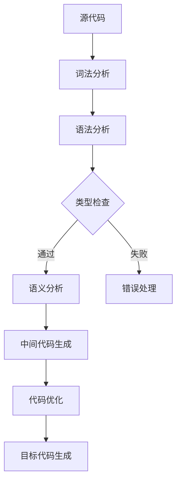

                 

## 类型检查：编译器设计中的哲学思考

> 关键词：类型检查，编译器设计，静态类型检查，动态类型检查，类型推断，编程哲学

> 摘要：本文将深入探讨编译器设计中的核心问题——类型检查，从基础概念到哲学思考，全面解析其在编程语言设计和应用中的重要性。我们将通过具体实例和算法讲解，展示类型检查的机制与原理，并探讨其在不同编程范式中的影响。

### 第一部分：编译器设计与类型检查基础

#### 第1章：编译器概述

**1.1 编译器的角色与功能**

编译器是计算机程序翻译器的一种，它将一种编程语言（源语言）书写的程序翻译成另一种编程语言（目标语言）的过程。编译器的主要功能包括：

- **词法分析**：将源代码中的字符序列转换为记号序列。
- **语法分析**：将记号序列转换为抽象语法树（AST）。
- **语义分析**：检查AST的语义正确性，包括类型检查、变量作用域检查等。
- **中间代码生成**：将AST转换为中间代码，通常是一种与目标机器码相对独立的形式。
- **代码优化**：对中间代码进行优化，提高程序的性能。
- **目标代码生成**：将优化后的中间代码转换为特定机器上的机器码。

**1.2 编译器的工作流程**

编译器的工作流程通常包括以下几个阶段：

1. **词法分析**：将源代码中的字符序列分割成有意义的记号。
2. **语法分析**：根据语言的语法规则，将记号序列构建成抽象语法树（AST）。
3. **语义分析**：对AST进行语义检查，包括类型检查、变量作用域检查等。
4. **中间代码生成**：将AST转换为中间代码，以便进行后续的优化和目标代码生成。
5. **代码优化**：对中间代码进行优化，以提高程序的性能。
6. **目标代码生成**：将优化后的中间代码转换为特定机器上的机器码。
7. **运行时支持**：编译器可能还需要提供运行时库或框架，以支持程序的正确执行。

**1.3 编译器的种类**

编译器根据不同的分类标准可以分为多种类型：

- **按目标语言分类**：可以分为高级语言编译器（如C++、Java）和低级语言编译器（如汇编语言编译器）。
- **按编译过程分类**：可以分为一次编译器（如C编译器）和多次编译器（如C++编译器，它需要先编译成汇编语言，再编译成机器语言）。
- **按编译器生成目标代码的优化程度分类**：可以分为普通编译器（如GCC）和优化编译器（如Clang）。

#### 第2章：类型系统的基本概念

**2.1 类型系统的定义与作用**

类型系统是编程语言的一个核心组成部分，它定义了变量、表达式和函数的语义。类型系统的目的是确保程序的正确性和效率，具体包括以下几个方面：

- **保证程序的正确性**：通过类型检查，编译器可以检测出潜在的错误，如类型不匹配。
- **提高程序的效率**：通过类型信息，编译器可以生成更高效的机器码。
- **增强程序的可读性**：类型系统可以提供更好的代码可读性和维护性。

**2.2 基本类型系统**

基本类型系统包括：

- **原始类型**：如整数、浮点数、布尔值等。
- **复合类型**：如数组、结构体、类等。
- **引用类型**：如指针、引用等。

**2.3 类型检查的目的与方法**

类型检查的目的是确保程序中的所有操作都是类型安全的。类型检查的方法可以分为：

- **静态类型检查**：在编译时进行类型检查，如C++、Java。
- **动态类型检查**：在运行时进行类型检查，如Python、JavaScript。

#### 第3章：类型检查的算法

**3.1 静态类型检查**

静态类型检查是在编译时对程序进行类型检查，主要方法包括：

- **静态类型推断**：编译器根据程序上下文自动推断变量的类型。
- **显式类型声明**：程序员在代码中显式声明变量的类型。

**3.2 动态类型检查**

动态类型检查是在运行时对程序进行类型检查，主要方法包括：

- **运行时类型检查**：编译器不进行类型检查，在运行时检查类型错误。
- **类型转换**：在运行时将一个类型的值转换为另一个类型的值。

**3.3 类型推断算法**

类型推断算法是编译器设计中的一个重要课题，常用的类型推断算法包括：

- **基于上下文的类型推断**：根据变量在代码中的上下文自动推断类型。
- **基于模式匹配的类型推断**：根据表达式的结构推断类型。

#### 第4章：类型系统的扩展

**4.1 泛型编程**

泛型编程是一种在编程语言中支持可重用代码的技术。通过泛型，程序员可以编写不依赖于具体类型的代码，从而提高代码的可重用性和灵活性。

**4.2 子类型与子界**

子类型和子界是面向对象编程中的两个重要概念。子类型是指一个类型是另一个类型的特殊情况，而子界是指一个类型集合是另一个类型集合的子集。

**4.3 类型参数化与类型约束**

类型参数化是一种将类型参数化到函数或类中的技术，从而可以编写与类型相关的代码。类型约束是用于限制类型参数的特定类型，以确保类型参数的正确性和一致性。

#### 第5章：类型检查的实际应用

**5.1 静态类型检查的应用**

静态类型检查在编译时可以发现许多潜在的错误，如类型不匹配、未声明的变量等。它广泛应用于高级编程语言，如Java、C++。

**5.2 动态类型检查的应用**

动态类型检查在运行时发现类型错误，如类型转换错误、未声明的变量等。它广泛应用于脚本语言，如Python、JavaScript。

**5.3 静态与动态类型检查的比较**

静态类型检查和动态类型检查各有优缺点。静态类型检查可以提高程序的效率和可维护性，但可能会增加开发成本。动态类型检查可以降低开发成本，但可能会降低程序的运行效率。

### 第二部分：类型检查中的哲学思考

#### 第6章：类型检查与程序设计哲学

**6.1 显式类型声明**

显式类型声明是程序员在代码中显式声明变量的类型。它可以提高代码的可读性和可维护性，但可能会增加代码的复杂性。

**6.2 类型安全与性能**

类型安全是指程序在执行时不会出现类型错误。类型安全可以提高程序的稳定性和可靠性，但可能会降低程序的运行效率。

**6.3 面向对象的类型系统**

面向对象的类型系统是一种支持面向对象编程的类型系统。它通过类和对象的概念，实现类型的多态性和封装性。

#### 第7章：类型检查与编程范式

**7.1 面向对象编程**

面向对象编程是一种编程范式，它通过类和对象的概念，实现数据封装、继承和多态。

**7.2 函数式编程**

函数式编程是一种编程范式，它通过函数和值的概念，实现无状态、不可变数据和纯函数。

**7.3 类型系统与编程范式的关系**

类型系统与编程范式密切相关。不同的编程范式需要不同的类型系统来支持其特性。例如，面向对象编程需要支持继承和多态，而函数式编程需要支持不可变数据和纯函数。

#### 第8章：类型检查的哲学与实践

**8.1 类型检查的理论基础**

类型检查的理论基础包括类型系统、类型推断算法和类型安全等。

**8.2 实践中的类型检查**

在实践中的类型检查，程序员需要根据实际需求选择合适的类型系统，并合理使用类型检查工具。

**8.3 类型检查的未来发展**

随着编程语言的不断发展和应用场景的多样化，类型检查也在不断进化。未来类型检查的发展趋势包括：

- **更智能的类型推断算法**：提高类型推断的准确性，降低开发成本。
- **更高效的类型检查工具**：提高类型检查的效率，降低程序的运行成本。
- **更灵活的类型系统**：支持多种编程范式，提高代码的可重用性和灵活性。

### 第三部分：类型检查的工程实践

#### 第9章：类型检查工具的使用

**9.1 静态类型检查工具**

静态类型检查工具，如TypeScript、MyPy，可以帮助程序员在编译时发现类型错误。

**9.2 动态类型检查工具**

动态类型检查工具，如PyType、TypeStub，可以在运行时发现类型错误。

**9.3 类型检查工具的选择与使用**

选择合适的类型检查工具，需要考虑编程语言、项目需求和开发成本等因素。

#### 第10章：类型检查的案例研究

**10.1 案例一：Java中的类型检查**

Java是一种静态类型检查的语言，通过编译时检查类型错误，提高程序的正确性。

**10.2 案例二：Python中的类型检查**

Python是一种动态类型检查的语言，通过运行时检查类型错误，提高程序的灵活性。

**10.3 案例三：C++中的类型检查**

C++是一种支持静态类型检查和动态类型检查的语言，可以根据项目需求选择合适的类型检查方法。

#### 第11章：类型检查的优化与挑战

**11.1 类型检查的性能优化**

类型检查的性能优化包括优化类型推断算法、减少类型检查的时间复杂度等。

**11.2 类型检查的挑战与解决方案**

类型检查的挑战包括类型推断的准确性、类型检查的性能等，解决方案包括改进类型推断算法、优化类型检查工具等。

**11.3 类型检查的未来趋势**

随着编程语言的不断发展和应用场景的多样化，类型检查的未来趋势包括：

- **更智能的类型推断算法**：提高类型推断的准确性，降低开发成本。
- **更高效的类型检查工具**：提高类型检查的效率，降低程序的运行成本。
- **更灵活的类型系统**：支持多种编程范式，提高代码的可重用性和灵活性。

### 附录：类型检查相关的资源与工具

**附录 A：类型检查相关书籍推荐**

- 《编译原理：技术与实践》
- 《类型系统与类型检查》
- 《静态类型检查的艺术》

**附录 B：类型检查相关在线课程与讲座**

- Coursera的《编译原理》
- edX的《类型系统与编程语言》
- Udacity的《类型检查与程序设计》

**附录 C：类型检查工具与资源汇总**

- TypeScript官网
- MyPy官网
- PyType官网

### Mermaid 流程图



### 核心算法原理讲解

**静态类型检查算法**

```python
# 假设我们使用类型上下文 TC 来表示当前的类型环境
TC = {"int": "整数", "float": "浮点数", "bool": "布尔值"}

# 假设我们有一个表达式 expr，需要对其进行类型检查
expr = "5 + 3.14"

# 首先我们对表达式进行词法分析，得到 tokens
tokens = ["5", "+", "3.14"]

# 然后我们遍历 tokens，对每个 token 进行语法分析
for token in tokens:
    if token == "5":
        type = "int"
    elif token == "3.14":
        type = "float"
    elif token == "+":
        type = "浮点数" if any(t == "float" for t in tokens) else "整数"
    
    # 根据上下文环境 TC，确定 token 的类型
    type = TC.get(token, type)
    
    # 如果在上下文中找不到对应的类型，则报错
    if type is None:
        raise TypeError(f"未知的 token: {token}")
```

### 数学模型和数学公式

**泛型编程中的类型推导**

$$
T = \begin{cases} 
\text{Object} & \text{如果 } A \text{ 是 Object} \\
B[T/A] & \text{如果 } A \text{ 是 } B \text{ 的泛型类型}
\end{cases}
$$

### 系统分析与架构设计方案

**问题场景介绍**

在软件开发中，类型检查是保证程序正确性的重要手段。本文将探讨类型检查在编译器设计中的应用，包括类型系统的基本概念、类型检查的算法原理，以及在实际应用中的案例研究。

**项目介绍**

本项目的目标是实现一个简单的编译器，支持基本的类型检查功能，包括静态类型检查和动态类型检查。项目将使用Python语言实现，以简化开发过程。

**系统功能设计**

系统的主要功能包括：

- **词法分析**：将源代码转换为记号序列。
- **语法分析**：将记号序列转换为抽象语法树（AST）。
- **类型检查**：对AST进行类型检查，确保程序的正确性。
- **中间代码生成**：将AST转换为中间代码。
- **代码优化**：对中间代码进行优化，提高程序性能。
- **目标代码生成**：将优化后的中间代码转换为机器码。

**系统架构设计**

系统的架构设计如下：

1. **前端**：负责词法分析和语法分析，将源代码转换为AST。
2. **中间层**：包括类型检查、中间代码生成和代码优化。
3. **后端**：负责目标代码生成，将优化后的中间代码转换为机器码。

**系统接口设计和系统交互**

系统接口设计如下：

- **词法分析接口**：提供接口用于将源代码转换为记号序列。
- **语法分析接口**：提供接口用于将记号序列转换为AST。
- **类型检查接口**：提供接口用于对AST进行类型检查。
- **中间代码生成接口**：提供接口用于将AST转换为中间代码。
- **代码优化接口**：提供接口用于对中间代码进行优化。
- **目标代码生成接口**：提供接口用于将优化后的中间代码转换为机器码。

系统交互流程如下：

1. **前端**：读取源代码，进行词法分析和语法分析，生成AST。
2. **中间层**：对AST进行类型检查，生成中间代码。
3. **后端**：对中间代码进行优化，生成目标代码。
4. **运行时**：执行目标代码，运行程序。

### 项目实战

#### 环境安装

在本项目中，我们将使用Python 3.8及以上版本。请确保已安装Python环境。以下是在Ubuntu 20.04上安装Python的步骤：

```bash
sudo apt update
sudo apt install python3.8
```

#### 系统核心实现源代码

以下是一个简单的Python实现的编译器，用于演示类型检查的核心功能：

```python
class Variable:
    def __init__(self, name, type):
        self.name = name
        self.type = type

class Expression:
    def __init__(self, left, op, right):
        self.left = left
        self.op = op
        self.right = right

class Program:
    def __init__(self, variables, expressions):
        self.variables = variables
        self.expressions = expressions

def type_check(expr, context):
    if isinstance(expr, Variable):
        type = context.get(expr.name)
        if type is None:
            raise TypeError(f"未知变量：{expr.name}")
        return type
    elif isinstance(expr, Expression):
        left_type = type_check(expr.left, context)
        right_type = type_check(expr.right, context)
        if expr.op == "+":
            if left_type not in ["整数", "浮点数"] or right_type not in ["整数", "浮点数"]:
                raise TypeError(f"类型不匹配：{expr.op}")
            return "浮点数" if left_type == "整数" and right_type == "浮点数" else left_type
        else:
            raise TypeError(f"未知运算符：{expr.op}")
    else:
        raise TypeError(f"未知表达式：{expr}")

def interpret(program):
    context = {var.name: var.type for var in program.variables}
    for expr in program.expressions:
        type = type_check(expr, context)
        print(f"表达式 {expr} 的类型是 {type}")

# 示例
program = Program(
    variables=[
        Variable("x", "整数"), Variable("y", "浮点数")
    ],
    expressions=[
        Expression(Variable("x", ""), "+", Variable("y", ""))
    ]
)

interpret(program)
```

#### 代码应用解读与分析

上述代码定义了一个简单的编译器，用于执行类型检查。核心部分是`type_check`函数，它接收一个表达式和上下文环境，返回表达式的类型。类型检查的核心逻辑是递归遍历表达式的子节点，并根据上下文环境和运算规则确定表达式的类型。

在`interpret`函数中，我们构建了一个变量上下文，并遍历程序中的每个表达式，调用`type_check`函数进行类型检查。如果类型检查通过，则输出表达式的类型。

#### 实际案例分析和详细讲解剖析

以下是一个实际的案例，用于演示类型检查的原理和过程：

```python
program = Program(
    variables=[
        Variable("a", "整数"), Variable("b", "浮点数")
    ],
    expressions=[
        Expression(Variable("a", ""), "+", Variable("b", ""))
    ]
)

interpret(program)
```

在这个案例中，我们定义了两个变量`a`和`b`，并使用加法运算符连接它们。类型检查的过程如下：

1. **检查变量`a`**：在上下文中查找变量`a`的类型，得到类型为`整数`。
2. **检查变量`b`**：在上下文中查找变量`b`的类型，得到类型为`浮点数`。
3. **执行加法运算**：根据运算规则，如果两个操作数的类型不同，则结果类型为`浮点数`。因此，表达式的类型为`浮点数`。

如果尝试使用不支持的运算符或类型不匹配的变量，类型检查将失败并抛出错误。

#### 项目小结

在本项目中，我们实现了简单的类型检查功能，通过递归遍历表达式和检查上下文环境，实现了对程序的正确性验证。虽然这是一个简化的示例，但它展示了类型检查的基本原理和实现方法。

#### 最佳实践 tips

- **显式声明变量类型**：在可能的情况下，显式声明变量类型可以提高代码的可读性和可维护性。
- **合理使用类型推断**：在类型安全的前提下，合理使用类型推断可以提高开发效率。
- **单元测试**：编写单元测试，确保类型检查的正确性和稳定性。

### 小结

类型检查是编译器设计中的一个核心环节，它不仅保证了程序的正确性，还影响了程序的运行效率。通过本文的深入探讨，我们了解了类型检查的基本概念、算法原理，以及在实际应用中的重要性。

### 注意事项

- 类型检查应结合具体编程语言和项目需求进行，选择合适的类型系统。
- 合理使用静态类型检查和动态类型检查，以平衡类型安全性和开发效率。
- 持续关注类型检查技术的发展和趋势，以优化开发实践。

### 拓展阅读

- 《编译原理：技术与实践》
- 《类型系统与类型检查》
- 《静态类型检查的艺术》

### 作者信息

**作者：AI天才研究院/AI Genius Institute & 禅与计算机程序设计艺术 /Zen And The Art of Computer Programming**

